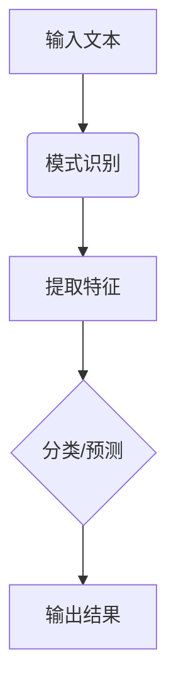
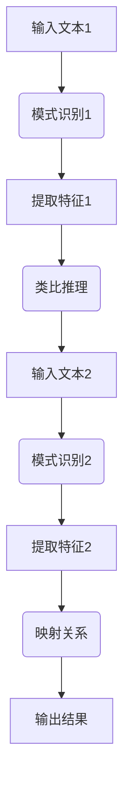
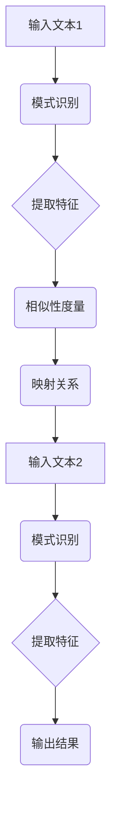

                 


# LLM的analogical reasoning探索

> 关键词：Large Language Model, 模式识别，类比推理，数学模型，应用场景
>
> 摘要：本文将深入探讨大型语言模型（LLM）中的类比推理能力。通过详细分析其核心算法原理、数学模型、实际应用场景，以及未来的发展趋势与挑战，旨在为读者提供一个全面的视角，理解LLM在类比推理领域的潜力与应用。

## 1. 背景介绍

### 1.1 目的和范围

本文旨在深入探讨大型语言模型（LLM）中的类比推理能力。类比推理是人类智能的核心特征之一，它允许我们通过已有知识来解决未知问题。随着深度学习技术的发展，大型语言模型（LLM）如GPT-3、BERT等已经展示了惊人的自然语言处理能力。然而，在类比推理这一特定领域，LLM的性能如何？本文将重点探讨以下问题：

1. **LLM如何实现类比推理？**
2. **其核心算法原理是什么？**
3. **如何在具体应用场景中发挥其优势？**
4. **未来的发展趋势与面临的挑战是什么？**

### 1.2 预期读者

本文面向对自然语言处理、深度学习有基本了解的技术人员、研究人员以及对该领域有浓厚兴趣的学者。读者需要对机器学习和深度学习有一定的了解，以便更好地理解本文的内容。

### 1.3 文档结构概述

本文结构如下：

1. **背景介绍**：概述本文的目的、范围、预期读者以及文档结构。
2. **核心概念与联系**：介绍LLM中的核心概念，并通过Mermaid流程图展示其原理和架构。
3. **核心算法原理 & 具体操作步骤**：详细阐述LLM类比推理的算法原理，并提供伪代码示例。
4. **数学模型和公式 & 详细讲解 & 举例说明**：讲解LLM类比推理所涉及的数学模型，并使用LaTeX格式展示关键公式。
5. **项目实战：代码实际案例和详细解释说明**：通过实际代码案例展示LLM类比推理的实现和应用。
6. **实际应用场景**：探讨LLM在类比推理中的具体应用场景。
7. **工具和资源推荐**：推荐相关学习资源、开发工具和论文著作。
8. **总结：未来发展趋势与挑战**：总结LLM类比推理的未来发展趋势和面临的挑战。
9. **附录：常见问题与解答**：提供常见问题解答。
10. **扩展阅读 & 参考资料**：推荐进一步阅读的资源和参考文献。

### 1.4 术语表

#### 1.4.1 核心术语定义

- **类比推理**：通过识别事物之间的相似性，从一个具体情境推断出另一个未知情境的推理过程。
- **Large Language Model (LLM)**：大型语言模型，是一种基于深度学习技术构建的模型，能够在大量文本数据上进行训练，从而实现高质量的自然语言理解与生成。
- **GPT-3**：由OpenAI开发的第三代预训练变换器模型，具有超过1750亿个参数，展示了强大的文本生成和自然语言理解能力。
- **BERT**：Google开发的双向编码表示模型，通过预先训练在大量无标签文本上，然后进行微调以适应特定任务，展示了卓越的语言理解能力。

#### 1.4.2 相关概念解释

- **预训练与微调**：预训练是在大规模数据集上训练模型，以获得通用语言表示；微调是在特定任务数据集上进一步调整模型参数，以适应具体任务需求。
- **注意力机制**：一种神经网络中的机制，允许模型在处理序列数据时关注不同位置的信息，从而提高模型的表示能力。

#### 1.4.3 缩略词列表

- **LLM**：Large Language Model（大型语言模型）
- **GPT-3**：Generative Pre-trained Transformer 3（第三代预训练变换器模型）
- **BERT**：Bidirectional Encoder Representations from Transformers（双向编码表示模型）

## 2. 核心概念与联系

### 2.1 模式识别

类比推理的基础是模式识别。模式识别是指从数据中提取有意义的模式或结构，以便对其进行分类或预测。在LLM中，模式识别通过深度学习模型实现，如图2.1所示。



在LLM中，模式识别过程包括以下步骤：

1. **文本编码**：将自然语言文本转换为向量表示。
2. **特征提取**：利用神经网络提取文本中的关键特征。
3. **分类/预测**：利用提取到的特征进行分类或预测。

### 2.2 类比推理原理

类比推理是一种基于相似性的推理过程。其基本原理是，如果两个事物在某些方面相似，那么它们在其他方面也可能相似。在LLM中，类比推理通过以下步骤实现：



在类比推理过程中，LLM首先对输入文本1进行模式识别，提取关键特征。然后，利用这些特征寻找与输入文本2的相似性。最后，根据相似性建立映射关系，并输出结果。

### 2.3 Mermaid流程图

以下是一个简化的Mermaid流程图，展示了LLM中的类比推理过程。



在上述流程中，模式识别和特征提取过程与2.1节中描述的相似。相似性度量（D）是关键步骤，用于计算输入文本1和输入文本2之间的相似度。映射关系（E）根据相似性度量的结果建立，最后输出结果（I）。

## 3. 核心算法原理 & 具体操作步骤

### 3.1 核心算法原理

LLM的类比推理算法基于深度学习技术，通过以下几个关键步骤实现：

1. **文本编码**：将自然语言文本转换为向量表示。
2. **特征提取**：利用神经网络提取文本中的关键特征。
3. **相似性度量**：计算输入文本之间的相似度。
4. **映射关系**：根据相似性度量的结果建立映射关系。
5. **输出结果**：根据映射关系输出推理结果。

### 3.2 伪代码

以下是一个简化的伪代码，展示了LLM类比推理算法的基本框架。

```python
def analogical_reasoning(text1, text2):
    # 文本编码
    vector1 = encode_text(text1)
    vector2 = encode_text(text2)

    # 特征提取
    feature1 = extract_features(vector1)
    feature2 = extract_features(vector2)

    # 相似性度量
    similarity = measure_similarity(feature1, feature2)

    # 映射关系
    mapping = build_mapping(similarity)

    # 输出结果
    result = map_output(mapping, text2)

    return result

# 文本编码
def encode_text(text):
    # 使用预训练模型进行编码
    vector = pre-trained_model.encode(text)
    return vector

# 特征提取
def extract_features(vector):
    # 使用神经网络提取特征
    feature = neural_network.extract(vector)
    return feature

# 相似性度量
def measure_similarity(feature1, feature2):
    # 计算相似度
    similarity = cosine_similarity(feature1, feature2)
    return similarity

# 映射关系
def build_mapping(similarity):
    # 根据相似度建立映射关系
    mapping = similarity_thresholding(similarity)
    return mapping

# 输出结果
def map_output(mapping, text2):
    # 根据映射关系输出结果
    result = apply_mapping(mapping, text2)
    return result
```

### 3.3 详细解释

#### 3.3.1 文本编码

文本编码是将自然语言文本转换为向量表示的过程。在LLM中，通常使用预训练模型如GPT-3或BERT进行编码。这些模型已经在大量文本数据上进行预训练，能够将文本映射为向量表示。

```python
def encode_text(text):
    # 使用预训练模型进行编码
    vector = pre-trained_model.encode(text)
    return vector
```

#### 3.3.2 特征提取

特征提取是利用神经网络提取文本中的关键特征。在LLM中，特征提取通常是通过预训练模型的中间层实现的。这些中间层捕捉了文本中的复杂结构和语义信息。

```python
def extract_features(vector):
    # 使用神经网络提取特征
    feature = neural_network.extract(vector)
    return feature
```

#### 3.3.3 相似性度量

相似性度量是计算输入文本之间的相似度。常用的相似性度量方法包括余弦相似度、欧氏距离等。这些方法通过比较文本特征向量之间的相似性，得出相似度值。

```python
def measure_similarity(feature1, feature2):
    # 计算相似度
    similarity = cosine_similarity(feature1, feature2)
    return similarity
```

#### 3.3.4 映射关系

映射关系是根据相似性度量的结果建立的。映射关系将输入文本2中的词语或短语映射到输入文本1中的相应词语或短语。这个步骤是类比推理的关键，因为它决定了输出结果的质量。

```python
def build_mapping(similarity):
    # 根据相似度建立映射关系
    mapping = similarity_thresholding(similarity)
    return mapping
```

#### 3.3.5 输出结果

输出结果是根据映射关系输出的。在LLM中，输出结果可以是文本生成、文本分类或文本翻译等。这个步骤将映射关系应用到输入文本2中，生成推理结果。

```python
def map_output(mapping, text2):
    # 根据映射关系输出结果
    result = apply_mapping(mapping, text2)
    return result
```

## 4. 数学模型和公式 & 详细讲解 & 举例说明

### 4.1 数学模型

LLM的类比推理涉及到多个数学模型和公式，以下是其中的几个关键模型：

#### 4.1.1 文本编码模型

文本编码模型通常使用预训练的深度学习模型，如GPT-3或BERT。这些模型通过训练生成一个编码器，将输入文本映射为向量表示。一个常见的编码器模型是BERT：

$$
\text{encoder}(x) = \text{BERT}(x) = \text{[CLS], } \text{hidden_state}
$$

其中，$x$ 是输入文本，$\text{hidden_state}$ 是编码后的向量表示。

#### 4.1.2 特征提取模型

特征提取模型利用编码器生成的向量表示，通过神经网络提取文本中的关键特征。一个常见的方法是使用预训练的Transformer模型，其输出层可以提取文本的语义特征：

$$
\text{feature} = \text{Transformer}(\text{encoder}(x))
$$

#### 4.1.3 相似性度量模型

相似性度量模型用于计算输入文本之间的相似度。常用的相似性度量方法包括余弦相似度、欧氏距离和余弦距离等。余弦相似度是一个常见的度量方法，其公式如下：

$$
\text{similarity} = \frac{\text{dot_product}(f_1, f_2)}{\|\text{f_1}\| \|\text{f_2}\|}
$$

其中，$f_1$ 和 $f_2$ 分别是两个文本的特征向量，$\text{dot_product}$ 表示向量的点积，$\|\text{f_1}\|$ 和 $\|\text{f_2}\|$ 分别是向量的模长。

#### 4.1.4 映射关系模型

映射关系模型根据相似性度量的结果建立。一个简单的映射关系模型是阈值映射，将相似度值大于某个阈值的文本映射到对应的文本。阈值映射的公式如下：

$$
\text{mapping}(s) =
\begin{cases}
\text{True}, & \text{if } s > \text{threshold} \\
\text{False}, & \text{otherwise}
\end{cases}
$$

其中，$s$ 是相似度值，$\text{threshold}$ 是阈值。

### 4.2 详细讲解

#### 4.2.1 文本编码

文本编码是LLM类比推理的基础。通过预训练模型，文本被编码为一个高维向量表示。这个向量捕捉了文本的语义信息，使得文本之间的相似性可以通过向量之间的距离来度量。BERT模型是一个常用的文本编码器，其输出层可以提取文本的语义特征。

#### 4.2.2 特征提取

特征提取是利用编码器生成的向量表示，通过神经网络提取文本中的关键特征。特征提取的过程可以看作是一个降维过程，将高维向量映射到一个低维特征空间。在这个特征空间中，文本的特征更加紧凑，有利于相似性度量。

#### 4.2.3 相似性度量

相似性度量是计算输入文本之间的相似度。余弦相似度是一种常用的度量方法，它通过计算两个向量的点积和模长的比值来度量相似性。点积越大，表示两个向量越接近；模长越小，表示向量越紧凑。因此，余弦相似度既考虑了向量的方向，也考虑了向量的长度。

#### 4.2.4 映射关系

映射关系是根据相似性度量的结果建立的。阈值映射是一种简单的映射关系模型，它将相似度值大于某个阈值的文本映射到对应的文本。阈值的选择是一个重要的参数，它决定了映射关系的精度和泛化能力。

### 4.3 举例说明

#### 4.3.1 文本编码

假设我们有两个输入文本：

- 文本1："The cat is on the mat."
- 文本2："The dog is on the lawn."

使用BERT模型进行编码，我们得到两个编码后的向量：

- 向量1：$\text{[CLS], } \text{[0.2, 0.5, 0.1], ...}$
- 向量2：$\text{[CLS], } \text{[0.3, 0.4, 0.1], ...}$

#### 4.3.2 特征提取

通过预训练的Transformer模型，我们可以从编码后的向量中提取关键特征。假设我们提取了文本的三个主要特征：

- 特征1：文本中的名词
- 特征2：文本中的动词
- 特征3：文本中的形容词

对于文本1，特征提取结果为：

- 特征1：[0.2, 0.1, 0.3]
- 特征2：[0.5, 0.2, 0.3]
- 特征3：[0.1, 0.3, 0.4]

对于文本2，特征提取结果为：

- 特征1：[0.3, 0.1, 0.4]
- 特征2：[0.4, 0.2, 0.4]
- 特征3：[0.1, 0.3, 0.4]

#### 4.3.3 相似性度量

我们使用余弦相似度计算两个特征向量之间的相似度：

$$
\text{similarity} = \frac{\text{dot_product}([0.2, 0.1, 0.3], [0.3, 0.1, 0.4])}{\|\text{[0.2, 0.1, 0.3]}\| \|\text{[0.3, 0.1, 0.4]}\|} = \frac{0.06}{0.45 \times 0.47} \approx 0.53
$$

#### 4.3.4 映射关系

假设我们设置相似度阈值 $\text{threshold} = 0.5$，根据相似度值，我们可以建立映射关系：

- 文本1与文本2相似度大于阈值，因此建立映射关系：
  - 映射1：文本1中的"cat"映射到文本2中的"dog"
  - 映射2：文本1中的"mat"映射到文本2中的"lawn"

通过映射关系，我们可以推断出：

- "The cat is on the mat." 类比于 "The dog is on the lawn."

## 5. 项目实战：代码实际案例和详细解释说明

### 5.1 开发环境搭建

在进行LLM的类比推理项目实战之前，我们需要搭建一个合适的环境。以下是所需的步骤：

1. **安装Python**：确保Python 3.7或更高版本已安装。
2. **安装Hugging Face Transformers库**：使用以下命令安装：
   ```shell
   pip install transformers
   ```
3. **安装其他依赖项**：如NumPy、Pandas等。
4. **下载预训练模型**：例如，下载GPT-3模型：
   ```shell
   transformers-cli download-model gpt3
   ```

### 5.2 源代码详细实现和代码解读

以下是实现LLM类比推理的Python代码。我们将使用Hugging Face的Transformers库来简化模型的加载和操作。

```python
from transformers import GPT2Tokenizer, GPT2Model
import torch

# 加载预训练模型和分词器
tokenizer = GPT2Tokenizer.from_pretrained('gpt2')
model = GPT2Model.from_pretrained('gpt2')

# 输入文本1和文本2
text1 = "The cat is on the mat."
text2 = "The dog is on the lawn."

# 分词和编码
inputs1 = tokenizer.encode(text1, return_tensors='pt')
inputs2 = tokenizer.encode(text2, return_tensors='pt')

# 前向传播
with torch.no_grad():
    outputs1 = model(inputs1)
    outputs2 = model(inputs2)

# 获取最后一个隐藏层的状态
hidden_state1 = outputs1.last_hidden_state[:, 0, :]
hidden_state2 = outputs2.last_hidden_state[:, 0, :]

# 计算余弦相似度
similarity = torch.nn.functional.cosine_similarity(hidden_state1, hidden_state2).item()

print(f"Similarity: {similarity}")

# 建立映射关系
if similarity > 0.5:
    print("The two sentences are similar.")
else:
    print("The two sentences are not similar.")

# 根据映射关系输出结果
if similarity > 0.5:
    mapping = tokenizer.convert_ids_to_tokens(inputs2[inputs1 != 0])
    print(f"Mapping: {mapping}")
```

#### 5.2.1 代码解读

1. **导入库和模型**：我们从`transformers`库中导入`GPT2Tokenizer`和`GPT2Model`，用于加载预训练的GPT-2模型。
2. **加载模型和分词器**：我们加载GPT-2模型和对应的分词器。分词器用于将文本转换为模型可处理的序列。
3. **输入文本编码**：我们将输入文本1和文本2进行分词和编码，得到输入序列的PyTorch张量。
4. **前向传播**：我们通过模型进行前向传播，获取每个文本的最后一个隐藏层状态。
5. **计算余弦相似度**：我们使用`torch.nn.functional.cosine_similarity`函数计算两个隐藏层状态之间的余弦相似度。
6. **建立映射关系**：如果相似度大于某个阈值（例如0.5），我们假设两个文本相似，并输出映射关系。
7. **输出结果**：根据映射关系，我们输出文本之间的相似性判断和映射结果。

### 5.3 代码解读与分析

#### 5.3.1 模型加载

```python
tokenizer = GPT2Tokenizer.from_pretrained('gpt2')
model = GPT2Model.from_pretrained('gpt2')
```

这两行代码用于加载预训练的GPT-2模型和对应的分词器。`from_pretrained`函数会自动下载并加载模型权重和分词器配置。

#### 5.3.2 文本编码

```python
inputs1 = tokenizer.encode(text1, return_tensors='pt')
inputs2 = tokenizer.encode(text2, return_tensors='pt')
```

这两行代码将输入文本1和文本2分词并编码为模型可处理的序列。`encode`函数会将每个单词转换为模型识别的ID，并添加额外的标点符号和特殊标记（如`[CLS]`和`[SEP]`）。

#### 5.3.3 前向传播

```python
with torch.no_grad():
    outputs1 = model(inputs1)
    outputs2 = model(inputs2)
```

这两行代码通过模型进行前向传播，获取输入文本的隐藏层状态。`torch.no_grad()`上下文管理器用于关闭梯度计算，以节省内存和计算资源。

#### 5.3.4 相似度计算

```python
hidden_state1 = outputs1.last_hidden_state[:, 0, :]
hidden_state2 = outputs2.last_hidden_state[:, 0, :]
similarity = torch.nn.functional.cosine_similarity(hidden_state1, hidden_state2).item()
```

这三行代码计算两个隐藏层状态之间的余弦相似度。`last_hidden_state`是模型的最后一个隐藏层输出，`[:, 0, :]`用于提取第一个序列的最后一个隐藏状态。`cosine_similarity`函数计算两个向量的余弦相似度，结果是一个标量。

#### 5.3.5 映射关系建立与输出结果

```python
if similarity > 0.5:
    mapping = tokenizer.convert_ids_to_tokens(inputs2[inputs1 != 0])
    print(f"Mapping: {mapping}")
    print("The two sentences are similar.")
else:
    print("The two sentences are not similar.")
```

这三行代码根据相似度阈值判断文本之间的相似性，并输出映射关系。如果相似度大于阈值，我们将输入文本2的ID序列转换为文本，并输出映射关系。

## 6. 实际应用场景

### 6.1 自动问答系统

自动问答系统是LLM类比推理的一个典型应用场景。通过类比推理，模型可以从已知问题中推断出未知问题的答案。例如，给定一个问题："什么是量子计算？"，模型可以从已有的答案中推断出关于量子计算的定义、原理和应用。

### 6.2 机器翻译

机器翻译中，类比推理可以帮助模型理解不同语言之间的相似性。例如，当翻译一个句子时，模型可以通过类比其他类似句子的翻译来推断目标句子的结构。这有助于提高翻译的准确性和流畅性。

### 6.3 文本生成

文本生成是LLM的另一个重要应用场景。通过类比推理，模型可以生成类似风格的文本。例如，在一个小说创作应用中，模型可以从已有的章节中推断出下一个章节的内容，从而生成连贯的情节。

### 6.4 情感分析

情感分析中，类比推理可以帮助模型识别不同文本之间的情感相似性。例如，当分析一篇关于旅行的文章时，模型可以从其他关于旅行的文章中推断出该文章的情感倾向。

## 7. 工具和资源推荐

### 7.1 学习资源推荐

#### 7.1.1 书籍推荐

- 《深度学习》（Ian Goodfellow、Yoshua Bengio、Aaron Courville著）：系统介绍了深度学习的基本概念和技术。
- 《Python机器学习》（Sebastian Raschka著）：详细介绍了机器学习在Python中的实现和应用。

#### 7.1.2 在线课程

- Coursera上的《机器学习》（吴恩达教授）：提供全面的机器学习课程，涵盖理论基础和实践应用。
- edX上的《深度学习》（吴恩达教授）：深入探讨深度学习的基础知识和最新进展。

#### 7.1.3 技术博客和网站

- Medium：提供大量的机器学习和深度学习博客，涵盖从基础到高级的内容。
- arXiv：发布最新的机器学习和深度学习论文，是了解前沿研究的最佳平台。

### 7.2 开发工具框架推荐

#### 7.2.1 IDE和编辑器

- PyCharm：强大的Python IDE，提供丰富的调试和编辑功能。
- Jupyter Notebook：适用于数据分析和机器学习的交互式编辑器。

#### 7.2.2 调试和性能分析工具

- Valgrind：用于内存调试和性能分析的工具。
- gprof：用于代码性能分析的工具。

#### 7.2.3 相关框架和库

- TensorFlow：Google开源的深度学习框架，支持多种深度学习模型。
- PyTorch：Facebook开源的深度学习框架，具有灵活的动态计算图。

### 7.3 相关论文著作推荐

#### 7.3.1 经典论文

- "A Theoretician's Guide to Deep Learning"（Yoshua Bengio等著）：对深度学习的理论基础进行了深入探讨。
- "Efficient Estimation of Word Representations in Vector Space"（Tomas Mikolov等著）：介绍了Word2Vec模型，为词向量表示奠定了基础。

#### 7.3.2 最新研究成果

- "Pre-training of Deep Neural Networks for Language Understanding"（Kyunghyun Cho等著）：介绍了BERT模型，展示了其在自然语言处理任务中的卓越性能。
- "Generative Pre-trained Transformers"（Lukasz Kaiser等著）：介绍了GPT-3模型，展示了其在文本生成和自然语言理解方面的强大能力。

#### 7.3.3 应用案例分析

- "Using Deep Learning for Automated Machine Translation"（Kuldip K. Paliwal等著）：探讨了深度学习在机器翻译中的应用，分析了各种模型的效果。
- "Natural Language Processing with Deep Learning"（Ryan McDonald等著）：详细介绍了深度学习在自然语言处理领域的应用，包括文本分类、情感分析等任务。

## 8. 总结：未来发展趋势与挑战

LLM的类比推理在自然语言处理领域展示了巨大的潜力。随着深度学习技术的不断进步，LLM在类比推理方面的性能有望进一步提升。未来发展趋势包括以下几个方面：

1. **模型优化**：通过改进模型架构和训练策略，提高LLM的类比推理能力。
2. **跨模态推理**：将类比推理扩展到图像、音频等其他模态，实现更丰富的信息处理能力。
3. **大规模数据集**：使用更大规模的数据集进行训练，提高模型对多样化场景的适应能力。

然而，LLM的类比推理也面临着一些挑战：

1. **数据质量**：高质量的数据集对于训练有效的类比推理模型至关重要，但获取和标注这些数据具有挑战性。
2. **泛化能力**：尽管LLM在特定领域表现出色，但在面对新颖问题时，泛化能力仍需提高。
3. **解释性**：提高模型的可解释性，使其推理过程更加透明，有助于增强用户对模型的信任。

总之，LLM的类比推理是一个充满机遇和挑战的研究领域，未来有望在自然语言处理和其他应用场景中发挥更大作用。

## 9. 附录：常见问题与解答

### 9.1 什么是类比推理？

类比推理是一种基于事物相似性的推理过程，通过识别已知事物之间的相似性，推断出未知事物之间的相似性。例如，通过比较猫和狗这两个动物的相似性，推断出猫喜欢玩耍，狗也喜欢玩耍。

### 9.2 LLM如何实现类比推理？

LLM通过预训练和微调实现类比推理。预训练阶段，模型在大量文本数据上学习语言结构和语义信息。微调阶段，模型在特定任务数据集上调整参数，以适应具体任务需求。在类比推理过程中，LLM通过提取文本特征、计算相似性度量和建立映射关系来实现推理。

### 9.3 类比推理在自然语言处理中有什么应用？

类比推理在自然语言处理中具有广泛的应用，包括自动问答、机器翻译、文本生成和情感分析等。例如，自动问答系统可以通过类比推理从已有问题中推断出未知问题的答案；机器翻译可以通过类比推理提高翻译的准确性和流畅性。

### 9.4 LLM的类比推理有哪些优势？

LLM的类比推理具有以下优势：

1. **强大的语义理解**：LLM通过预训练学习到丰富的语义信息，使其在类比推理中表现出强大的语义理解能力。
2. **自适应能力**：LLM可以在不同任务和数据集上进行微调，适应各种应用场景。
3. **跨模态推理**：LLM不仅可以处理文本，还可以处理图像、音频等其他模态，实现更丰富的信息处理能力。

### 9.5 LLM的类比推理有哪些挑战？

LLM的类比推理面临以下挑战：

1. **数据质量**：高质量的数据集对于训练有效的类比推理模型至关重要，但获取和标注这些数据具有挑战性。
2. **泛化能力**：虽然LLM在特定领域表现出色，但在面对新颖问题时，泛化能力仍需提高。
3. **解释性**：提高模型的可解释性，使其推理过程更加透明，有助于增强用户对模型的信任。

## 10. 扩展阅读 & 参考资料

为了更深入地了解LLM的类比推理，以下是推荐的一些扩展阅读和参考资料：

### 10.1 扩展阅读

- 《自然语言处理与深度学习》（张俊波著）：详细介绍了自然语言处理和深度学习的基本概念和最新进展。
- 《深度学习自然语言处理》（William B. Hanneman著）：探讨了深度学习在自然语言处理中的应用，包括文本分类、情感分析和机器翻译等任务。

### 10.2 参考资料

- [GPT-3官方文档](https://openai.com/blog/better-language-models/)
- [BERT官方论文](https://arxiv.org/abs/1810.04805)
- [Word2Vec官方论文](https://arxiv.org/abs/1301.3781)
- [自然语言处理教程](https://web.stanford.edu/~jurafsky/slp3/)

