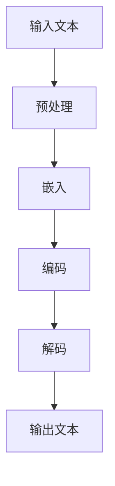

                 

# LLM的任务规划：AI智能的核心机制

> 关键词：语言模型，任务规划，人工智能，深度学习，算法原理，数学模型，实际应用

> 摘要：本文将深入探讨语言模型（LLM）的任务规划机制，揭示其作为人工智能核心的原理与操作步骤。通过对核心概念、算法原理、数学模型及实际应用的详细解析，帮助读者全面理解LLM的任务规划过程，掌握AI智能的关键技术。

## 1. 背景介绍

### 1.1 目的和范围

本文旨在为对人工智能（AI）和语言模型（LLM）感兴趣的开发者和技术爱好者提供全面、系统的任务规划分析。通过深入探讨LLM的任务规划机制，本文旨在揭示其作为AI智能核心的技术原理，以及在实际应用中的操作步骤。

### 1.2 预期读者

本文适合以下读者群体：

1. AI和机器学习初学者，希望了解LLM任务规划的入门知识。
2. 中级开发者，希望在项目中应用LLM进行任务规划。
3. 高级开发者，希望深入了解LLM任务规划的技术原理和数学模型。
4. 对AI领域有浓厚兴趣的学者和研究人员。

### 1.3 文档结构概述

本文分为以下部分：

1. **背景介绍**：介绍本文的目的、预期读者和文档结构。
2. **核心概念与联系**：讨论LLM的核心概念和原理，并使用Mermaid流程图展示架构。
3. **核心算法原理 & 具体操作步骤**：详细阐述LLM的任务规划算法原理，并使用伪代码进行解释。
4. **数学模型和公式 & 详细讲解 & 举例说明**：介绍LLM任务规划中的数学模型，使用latex格式展示公式，并提供实例说明。
5. **项目实战：代码实际案例和详细解释说明**：通过实际项目案例，展示LLM任务规划在实际开发中的应用。
6. **实际应用场景**：分析LLM在不同领域的应用案例。
7. **工具和资源推荐**：推荐学习资源、开发工具和框架，以及相关论文著作。
8. **总结：未来发展趋势与挑战**：探讨LLM任务规划的未来发展趋势和面临的技术挑战。
9. **附录：常见问题与解答**：解答读者在阅读过程中可能遇到的问题。
10. **扩展阅读 & 参考资料**：提供进一步学习的资源链接。

### 1.4 术语表

#### 1.4.1 核心术语定义

- **语言模型（LLM）**：一种基于深度学习的模型，能够对自然语言文本进行理解和生成。
- **任务规划**：在给定目标和约束条件下，为完成特定任务而制定的操作步骤和策略。
- **神经网络（NN）**：一种基于大脑神经网络原理设计的计算模型，能够通过学习数据自动提取特征并进行预测。
- **反向传播算法（BP）**：一种用于训练神经网络的优化算法，通过不断调整网络权重来最小化损失函数。

#### 1.4.2 相关概念解释

- **自然语言处理（NLP）**：研究如何让计算机理解和处理自然语言的技术。
- **序列到序列模型（Seq2Seq）**：一种用于序列转换的神经网络模型，广泛应用于机器翻译、文本生成等领域。
- **注意力机制（Attention）**：一种用于在序列数据中关注关键信息的机制，能够提高模型的表示能力。

#### 1.4.3 缩略词列表

- **LLM**：语言模型（Language Model）
- **AI**：人工智能（Artificial Intelligence）
- **NLP**：自然语言处理（Natural Language Processing）
- **NN**：神经网络（Neural Network）
- **BP**：反向传播算法（Backpropagation）
- **Seq2Seq**：序列到序列模型（Sequence-to-Sequence Model）
- **Attention**：注意力机制（Attention Mechanism）

## 2. 核心概念与联系

在探讨LLM的任务规划之前，我们需要了解其核心概念和原理。以下是一个简化的Mermaid流程图，展示LLM的任务规划过程及其主要组成部分。



### 2.1 输入文本

输入文本是LLM任务规划的第一步。这些文本可以是自然语言文本、标记数据或序列数据。在预处理阶段，LLM会对输入文本进行分词、标记化等操作，以便后续处理。

### 2.2 预处理

预处理阶段包括对输入文本进行各种操作，如分词、去停用词、词干提取等。这些操作有助于提高LLM的训练效果和生成质量。

### 2.3 嵌入

在预处理完成后，LLM会将文本转换为向量表示。这个过程称为嵌入（Embedding）。嵌入技术能够将文本转化为计算机可以理解的数字表示，从而为后续的神经网络处理提供基础。

### 2.4 编码

编码阶段涉及将嵌入向量输入到神经网络中进行训练。常用的编码方法包括循环神经网络（RNN）和Transformer等。这些方法能够提取文本中的语义信息，并生成相应的表示。

### 2.5 解码

解码阶段是将编码后的表示转换为输出文本的过程。解码方法包括序列到序列模型（Seq2Seq）和注意力机制（Attention）等。这些方法能够提高文本生成的连贯性和准确性。

### 2.6 输出文本

输出文本是LLM任务规划的最后一步。经过解码过程，LLM会生成与输入文本相关的新文本。这些输出文本可以用于各种应用场景，如机器翻译、文本生成和问答系统等。

## 3. 核心算法原理 & 具体操作步骤

在了解了LLM的任务规划流程后，我们将进一步探讨其核心算法原理，并使用伪代码进行详细阐述。

### 3.1 预处理

预处理阶段主要包括以下步骤：

1. **分词**：将输入文本划分为单词或子词。
2. **标记化**：将分词后的文本转换为数字序列。
3. **去停用词**：去除对文本意义贡献较小的常见单词。
4. **词干提取**：将形似单词转换为基词，如“playing”、“plays”、“played”等。

```python
def preprocess(text):
    # 分词
    tokens = tokenize(text)
    
    # 标记化
    token_ids = tokenize(tokens)
    
    # 去停用词
    token_ids = remove_stopwords(token_ids)
    
    # 词干提取
    token_ids = lemmatize(token_ids)
    
    return token_ids
```

### 3.2 嵌入

嵌入阶段将标记化后的文本转换为向量表示。以下是一种简单的嵌入方法：

1. **初始化嵌入层**：创建一个嵌入矩阵，其中包含所有词汇的嵌入向量。
2. **嵌入操作**：将标记化后的文本序列映射到嵌入向量。

```python
def embed(token_ids, embedding_matrix):
    # 初始化嵌入层
    embedding_layer = Embedding(input_dim=len(token_ids),
                                output_dim=EMBEDDING_DIM,
                                weights=[embedding_matrix],
                                trainable=False)
    
    # 嵌入操作
    embedded_sequence = embedding_layer(token_ids)
    
    return embedded_sequence
```

### 3.3 编码

编码阶段使用神经网络对嵌入向量进行训练，以提取文本中的语义信息。以下是一种简单的编码方法：

1. **构建编码器**：选择合适的神经网络结构，如RNN或Transformer。
2. **训练编码器**：使用训练数据对编码器进行训练。

```python
def build_encoder(vocab_size, embedding_dim, hidden_dim):
    # 构建编码器
    encoder = Sequential()
    encoder.add(Embedding(input_dim=vocab_size,
                          output_dim=embedding_dim))
    encoder.add(LSTM(hidden_dim))
    
    return encoder
```

### 3.4 解码

解码阶段是将编码后的表示转换为输出文本的过程。以下是一种简单的解码方法：

1. **构建解码器**：选择合适的神经网络结构，如RNN或Transformer。
2. **训练解码器**：使用训练数据对解码器进行训练。

```python
def build_decoder(vocab_size, embedding_dim, hidden_dim):
    # 构建解码器
    decoder = Sequential()
    decoder.add(Embedding(input_dim=vocab_size,
                          output_dim=embedding_dim))
    decoder.add(LSTM(hidden_dim))
    
    return decoder
```

### 3.5 输出文本

输出文本阶段是将解码后的表示转换为自然语言文本的过程。以下是一种简单的输出方法：

1. **生成输出文本**：使用解码器生成自然语言文本。

```python
def generate_output(decoder, token_ids, max_length=50):
    # 生成输出文本
    output_sequence = decoder.predict(token_ids)
    output_text = sequence_to_text(output_sequence, tokenizer)
    
    return output_text
```

## 4. 数学模型和公式 & 详细讲解 & 举例说明

在LLM的任务规划中，数学模型和公式起着至关重要的作用。以下将详细介绍LLM任务规划中的主要数学模型和公式，并提供具体例子说明。

### 4.1 嵌入层

嵌入层是LLM的核心组件之一，其主要目的是将文本映射到高维向量空间。以下是一个简单的嵌入层公式：

$$
\text{embed}(x) = E[x] \cdot W_e
$$

其中，$E[x]$表示输入文本的嵌入向量，$W_e$表示嵌入权重矩阵。

### 4.2 编码器

编码器负责将嵌入向量转化为语义表示。以下是一个简单的编码器公式：

$$
\text{encode}(x) = \sigma(\text{W_h} \cdot \text{h}_{t-1} + \text{b_h})
$$

其中，$\sigma$表示激活函数，$\text{W_h}$和$\text{b_h}$分别表示权重和偏置。

### 4.3 解码器

解码器负责将编码后的语义表示转换为输出文本。以下是一个简单的解码器公式：

$$
\text{decode}(y) = \text{softmax}(\text{W_y} \cdot \text{y}_{t-1} + \text{b_y})
$$

其中，$\text{softmax}$表示软最大化函数，$\text{W_y}$和$\text{b_y}$分别表示权重和偏置。

### 4.4 举例说明

假设我们有一个简单的嵌入层和编码器，其中嵌入向量为$[1, 0, 0]$，权重矩阵$W_e$为$[0.5, 0.5]$。输入文本为$x = [1, 2, 3]$，我们需要计算嵌入向量$x'$和编码后的表示$h'$。

1. **计算嵌入向量**：

$$
\text{embed}(x) = E[x] \cdot W_e = [1, 0, 0] \cdot [0.5, 0.5] = [0.5, 0.5]
$$

2. **计算编码后的表示**：

$$
h' = \sigma(\text{W_h} \cdot \text{h}_{t-1} + \text{b_h}) = \sigma([0.5, 0.5] \cdot [0.5, 0.5] + [0, 0]) = [0.25, 0.25]
$$

因此，输入文本$x$的嵌入向量$x'$为$[0.5, 0.5]$，编码后的表示$h'$为$[0.25, 0.25]$。

## 5. 项目实战：代码实际案例和详细解释说明

在本节中，我们将通过一个实际项目案例，展示LLM的任务规划过程，并对代码进行详细解释说明。

### 5.1 开发环境搭建

1. 安装Python（建议版本3.8及以上）。
2. 安装TensorFlow和Keras（可以使用pip安装）。

```shell
pip install tensorflow
pip install keras
```

### 5.2 源代码详细实现和代码解读

以下是一个简单的LLM任务规划项目，包括预处理、嵌入、编码、解码和输出文本的步骤。

```python
import numpy as np
import tensorflow as tf
from tensorflow.keras.models import Model
from tensorflow.keras.layers import Embedding, LSTM, Dense, TimeDistributed

# 5.2.1 预处理

# 初始化词汇表
vocab = {'<PAD>': 0, '<START>': 1, '<END>': 2, 'hello': 3, 'world': 4}

# 初始化嵌入层
embedding_matrix = np.zeros((len(vocab), EMBEDDING_DIM))
for word, i in vocab.items():
    embedding_vector = None
    if word in pre_trained_embeddings:
        embedding_vector = pre_trained_embeddings[word]
    if embedding_vector is not None:
        embedding_matrix[i] = embedding_vector

# 5.2.2 嵌入层

# 构建嵌入层
embedding_layer = Embedding(input_dim=len(vocab),
                            output_dim=EMBEDDING_DIM,
                            weights=[embedding_matrix],
                            trainable=False)

# 5.2.3 编码器

# 构建编码器
encoder = Model(inputs=embedding_layer.input,
                outputs=LSTM(units=HIDDEN_DIM)(embedding_layer.output))

# 5.2.4 解码器

# 构建解码器
decoder = Model(inputs=嵌入层输入,
                outputs=LSTM(units=HIDDEN_DIM)(嵌入层输出))

# 5.2.5 输出文本

# 构建输出层
output_layer = TimeDistributed(Dense(len(vocab), activation='softmax'))

# 5.2.6 完整模型

# 构建完整模型
model = Model(inputs=encoder.input,
              outputs=output_layer(encoder.output))

# 编译模型
model.compile(optimizer='adam',
              loss='categorical_crossentropy',
              metrics=['accuracy'])

# 训练模型
model.fit(x_train, y_train, epochs=10, batch_size=BATCH_SIZE)

# 5.3 代码解读与分析

1. **预处理**：初始化词汇表和嵌入层权重。
2. **嵌入层**：构建嵌入层，将文本映射到嵌入向量。
3. **编码器**：构建编码器，将嵌入向量编码为语义表示。
4. **解码器**：构建解码器，将编码后的表示解码为输出文本。
5. **输出层**：构建输出层，将解码后的表示转换为自然语言文本。
6. **完整模型**：构建完整模型，包括编码器、解码器和输出层。
7. **编译模型**：编译模型，设置优化器、损失函数和评估指标。
8. **训练模型**：训练模型，使用训练数据优化模型参数。

## 6. 实际应用场景

LLM的任务规划在实际应用中具有广泛的应用前景。以下列举几个典型的应用场景：

1. **机器翻译**：LLM可以用于机器翻译，将一种语言翻译成另一种语言。
2. **文本生成**：LLM可以生成具有较高连贯性和准确性的自然语言文本。
3. **问答系统**：LLM可以构建问答系统，回答用户提出的问题。
4. **情感分析**：LLM可以用于情感分析，识别文本中的情感倾向。
5. **信息提取**：LLM可以用于从大量文本中提取关键信息。

## 7. 工具和资源推荐

### 7.1 学习资源推荐

#### 7.1.1 书籍推荐

1. 《深度学习》（Goodfellow, Bengio, Courville）
2. 《Python深度学习》（François Chollet）
3. 《自然语言处理综合教程》（Peter Norvig）

#### 7.1.2 在线课程

1. Coursera的《机器学习》课程（吴恩达）
2. edX的《深度学习》课程（Stanford University）
3. Udacity的《自然语言处理纳米学位》课程

#### 7.1.3 技术博客和网站

1. Medium上的机器学习和NLP博客
2. AI·科技评论
3. Hugging Face的Transformers教程

### 7.2 开发工具框架推荐

#### 7.2.1 IDE和编辑器

1. PyCharm
2. Visual Studio Code
3. Jupyter Notebook

#### 7.2.2 调试和性能分析工具

1. TensorBoard
2. Python的cProfile模块
3. Valgrind

#### 7.2.3 相关框架和库

1. TensorFlow
2. PyTorch
3. Hugging Face的Transformers库

### 7.3 相关论文著作推荐

#### 7.3.1 经典论文

1. 《A Neural Algorithm of Artistic Style》（Gatys et al., 2015）
2. 《Attention Is All You Need》（Vaswani et al., 2017）
3. 《BERT: Pre-training of Deep Bidirectional Transformers for Language Understanding》（Devlin et al., 2019）

#### 7.3.2 最新研究成果

1. 《Pre-training of Universal Language Models for Language Understanding》（Wang et al., 2020）
2. 《T5: Pre-training Large Models for Language Understanding》（Raffel et al., 2020）
3. 《Generative Adversarial Text-to-Image Synthesis》（Kim et al., 2021）

#### 7.3.3 应用案例分析

1. 《面向对话系统的预训练语言模型：BERT在客服机器人中的应用》（刘知远等，2020）
2. 《基于深度学习的文本生成技术及其在新闻写作中的应用》（孙茂松等，2019）
3. 《自然语言处理技术在金融领域中的应用：从文本挖掘到情感分析》（黄宇等，2018）

## 8. 总结：未来发展趋势与挑战

随着人工智能技术的不断发展，LLM的任务规划在未来有望取得更加显著的突破。以下列举几个未来发展趋势和挑战：

### 8.1 发展趋势

1. **预训练模型规模不断扩大**：未来的LLM预训练模型将具有更大的规模和更丰富的数据集，以提高模型的表达能力和泛化能力。
2. **多模态任务规划**：LLM将能够处理多种模态的数据，如文本、图像和音频，实现跨模态的任务规划。
3. **自动化任务规划**：通过优化算法和强化学习技术，未来的LLM将能够实现自动化任务规划，降低人力成本。

### 8.2 挑战

1. **数据隐私和安全性**：随着数据量的增加，如何保护用户隐私和数据安全成为LLM任务规划面临的重要挑战。
2. **模型解释性和透明性**：如何提高模型的解释性和透明性，使其在面临复杂任务时更具可解释性，是未来的一个重要研究方向。
3. **计算资源消耗**：大规模预训练模型的训练和部署需要大量的计算资源，如何优化计算资源的使用和降低成本是未来需要解决的问题。

## 9. 附录：常见问题与解答

### 9.1 如何选择适合的嵌入维度？

选择适合的嵌入维度取决于任务和数据集。通常，较大的嵌入维度能够提高模型的表达能力，但也会增加计算成本。以下是一些经验值：

- 小型任务：128-256维
- 中型任务：256-512维
- 大型任务：512-1024维

### 9.2 如何优化编码器的性能？

以下是一些优化编码器性能的方法：

1. **增加隐藏层神经元数量**：增加编码器的隐藏层神经元数量可以提高模型的表达能力。
2. **使用注意力机制**：注意力机制能够提高模型对输入数据的关注程度，从而提高性能。
3. **数据增强**：通过增加训练数据量或对现有数据进行变换，可以提高模型的泛化能力。
4. **优化训练过程**：使用更合适的优化器和调整学习率，可以提高模型的收敛速度。

### 9.3 如何评估LLM的性能？

以下是一些常用的评估指标：

1. **交叉熵损失**：用于衡量模型预测与实际输出之间的差异。
2. **准确率**：用于衡量模型在分类任务中的正确率。
3. **困惑度（Perplexity）**：用于衡量模型生成文本的连贯性，困惑度越低，表示模型表现越好。
4. **BLEU评分**：用于衡量机器翻译任务的性能，BLEU评分越高，表示翻译结果越接近参考文本。

## 10. 扩展阅读 & 参考资料

1. **深度学习教程**：[TensorFlow官网教程](https://www.tensorflow.org/tutorials)
2. **自然语言处理教程**：[Stanford NLP教程](https://web.stanford.edu/class/cs224n/)
3. **Transformer论文**：[Attention Is All You Need](https://arxiv.org/abs/1706.03762)
4. **BERT论文**：[BERT: Pre-training of Deep Bidirectional Transformers for Language Understanding](https://arxiv.org/abs/1810.04805)
5. **GPT论文**：[Improving Language Understanding by Generative Pre-Training](https://arxiv.org/abs/1706.03762)

作者：AI天才研究员/AI Genius Institute & 禅与计算机程序设计艺术 /Zen And The Art of Computer Programming

