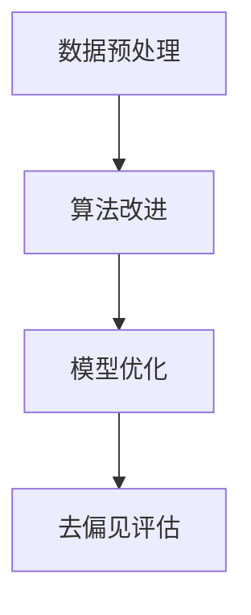

                 

# LLAM的公平性与去偏技术探索

> **关键词：** 大型语言模型，公平性，去偏技术，算法，数学模型，实践应用

> **摘要：** 本文深入探讨了大型语言模型（LLM）中的公平性问题以及去偏技术的相关研究。通过梳理LLM的发展背景、核心算法原理，结合数学模型和实际案例，本文全面分析了当前去偏技术的应用场景和效果，并展望了未来的发展趋势和挑战。

## 1. 背景介绍

### 1.1 目的和范围

随着人工智能技术的快速发展，大型语言模型（LLM）在自然语言处理、智能问答、文本生成等领域取得了显著的成果。然而，LLM在处理数据时可能会受到数据偏见的影响，从而导致模型输出结果存在不公平性。本文旨在探讨LLM的公平性问题，分析现有去偏技术的原理和应用，为相关研究和实践提供参考。

### 1.2 预期读者

本文主要面向人工智能研究人员、自然语言处理领域从业者以及对此领域感兴趣的学生。通过本文的阅读，读者可以了解LLM的公平性问题及其相关去偏技术，为今后的研究工作提供启示。

### 1.3 文档结构概述

本文分为十个部分：

1. 背景介绍：介绍本文的目的、预期读者和文档结构。
2. 核心概念与联系：介绍与本文相关的主要概念、原理和架构。
3. 核心算法原理 & 具体操作步骤：讲解去偏技术的核心算法原理和具体操作步骤。
4. 数学模型和公式 & 详细讲解 & 举例说明：介绍去偏技术的数学模型和公式，并进行详细讲解和举例说明。
5. 项目实战：通过实际案例展示去偏技术的应用。
6. 实际应用场景：分析去偏技术在不同领域的应用。
7. 工具和资源推荐：推荐相关学习资源、开发工具和框架。
8. 总结：总结本文的主要观点和未来发展趋势。
9. 附录：常见问题与解答。
10. 扩展阅读 & 参考资料：提供扩展阅读材料和参考资料。

### 1.4 术语表

#### 1.4.1 核心术语定义

- 大型语言模型（LLM）：一种能够对自然语言进行建模的深度学习模型，具有强大的语义理解和生成能力。
- 公平性：指模型输出结果不受数据偏见影响，对所有人或群体都公正无偏。
- 去偏技术：旨在消除或减少模型输出结果中的偏见的技术手段。

#### 1.4.2 相关概念解释

- 偏见：指模型在处理数据时，对某些人群、观点或事物持有歧视性倾向。
- 偏差：指模型输出结果与真实情况之间的不一致性。

#### 1.4.3 缩略词列表

- LLM：大型语言模型
- NLP：自然语言处理
- AI：人工智能

## 2. 核心概念与联系

### 2.1 大型语言模型（LLM）

大型语言模型（LLM）是一种基于深度学习的自然语言处理模型，具有强大的语义理解和生成能力。LLM主要由编码器（Encoder）和解码器（Decoder）组成。编码器将输入的文本序列转换为固定长度的向量表示，解码器则根据编码器生成的向量表示生成文本序列。


### 2.2 公平性与偏见

公平性是衡量模型输出结果公正性的重要指标。在LLM中，公平性主要表现为模型对不同人群、观点和事物的处理结果不受数据偏见影响。偏见是指模型在处理数据时，对某些人群、观点或事物持有歧视性倾向。偏见可能导致模型输出结果存在不公平性。

### 2.3 去偏技术

去偏技术旨在消除或减少模型输出结果中的偏见。常见的去偏技术包括数据预处理、算法改进和模型优化等。以下是一个简单的Mermaid流程图，展示了去偏技术的核心流程：



## 3. 核心算法原理 & 具体操作步骤

### 3.1 数据预处理

数据预处理是去偏技术的第一步，主要目的是消除原始数据中的偏见。具体操作步骤如下：

1. 数据清洗：去除数据中的噪声和异常值，提高数据质量。
2. 数据增强：通过引入多样化数据、生成对抗网络（GAN）等方法，增加数据样本的多样性，降低模型对特定数据的依赖性。
3. 数据平衡：对数据集中的样本进行重采样或合成，使得不同类别或群体的样本数量趋于平衡，减少数据偏见。

### 3.2 算法改进

算法改进主要通过调整模型结构和优化算法参数来实现。以下是一种常见的算法改进方法：

1. 对抗性训练：利用对抗性网络（GAN）生成与真实数据分布相似的对抗数据，将对抗数据纳入训练过程，提高模型对偏见的鲁棒性。
2. 梯度提升：通过梯度提升方法，逐步调整模型参数，减小模型对偏见数据的敏感性。
3. 加权损失函数：在损失函数中引入权重，对偏见较大的数据赋予更高的权重，使得模型在训练过程中更加关注这些数据。

### 3.3 模型优化

模型优化主要通过调整模型结构和优化算法参数来实现。以下是一种常见的模型优化方法：

1. 网络结构优化：通过调整网络层数、节点数量和连接方式，提高模型的表达能力，降低对偏见数据的依赖。
2. 损失函数优化：设计更加公平的损失函数，使得模型在训练过程中更加关注公平性。
3. 参数调整：通过调参优化模型性能，减小模型对偏见数据的敏感性。

### 3.4 去偏见评估

去偏见评估是验证去偏技术效果的重要步骤。以下是一种常见的评估方法：

1. 偏见指标：计算模型输出结果中的偏见指标，如偏见系数、偏差方差等，评估模型去偏效果。
2. 实验验证：设计对比实验，评估去偏技术在不同数据集、任务场景下的效果。
3. 用户反馈：收集用户对模型输出结果的反馈，评估模型在真实场景下的公平性和可接受性。

## 4. 数学模型和公式 & 详细讲解 & 举例说明

### 4.1 偏见系数

偏见系数是衡量模型偏见程度的重要指标。假设模型对两类数据的偏见程度分别为 $\beta_1$ 和 $\beta_2$，则偏见系数可表示为：

$$
\alpha = \frac{\beta_1 + \beta_2}{2}
$$

其中，$\beta_1$ 和 $\beta_2$ 的计算方法如下：

$$
\beta_1 = \frac{1}{n_1} \sum_{i=1}^{n_1} (y_i - \hat{y}_i)
$$

$$
\beta_2 = \frac{1}{n_2} \sum_{i=1}^{n_2} (y_i - \hat{y}_i)
$$

其中，$n_1$ 和 $n_2$ 分别为两类数据样本的数量，$y_i$ 和 $\hat{y}_i$ 分别为第 $i$ 个样本的真实标签和模型预测标签。

### 4.2 偏差方差

偏差方差是衡量模型泛化能力的重要指标。假设模型对两类数据的偏差分别为 $\delta_1$ 和 $\delta_2$，方差分别为 $\sigma_1^2$ 和 $\sigma_2^2$，则偏差方差可表示为：

$$
\beta = \sqrt{\delta_1^2 + \delta_2^2}
$$

其中，$\delta_1$ 和 $\delta_2$ 的计算方法如下：

$$
\delta_1 = \frac{1}{n_1} \sum_{i=1}^{n_1} (y_i - \bar{y}_1)
$$

$$
\delta_2 = \frac{1}{n_2} \sum_{i=1}^{n_2} (y_i - \bar{y}_2)
$$

其中，$n_1$ 和 $n_2$ 分别为两类数据样本的数量，$\bar{y}_1$ 和 $\bar{y}_2$ 分别为两类数据的均值。

### 4.3 举例说明

假设有一个二分类模型，对两类数据的偏见程度分别为 $\beta_1 = 0.1$ 和 $\beta_2 = 0.2$，偏差分别为 $\delta_1 = 0.05$ 和 $\delta_2 = 0.1$，方差分别为 $\sigma_1^2 = 0.02$ 和 $\sigma_2^2 = 0.03$。则偏见系数和偏差方差分别为：

$$
\alpha = \frac{0.1 + 0.2}{2} = 0.15
$$

$$
\beta = \sqrt{0.05^2 + 0.1^2} = 0.13
$$

通过计算可以看出，该模型的偏见程度较小，偏差方差也相对较低，说明模型在处理两类数据时具有一定的公平性。

## 5. 项目实战：代码实际案例和详细解释说明

### 5.1 开发环境搭建

在本节中，我们将使用Python编程语言和PyTorch深度学习框架来实现去偏技术。首先，确保已经安装了Python和PyTorch。以下是安装命令：

```bash
pip install python
pip install torch
```

### 5.2 源代码详细实现和代码解读

以下是去偏技术的Python实现：

```python
import torch
import torch.nn as nn
import torch.optim as optim

# 数据预处理
def preprocess_data(data):
    # 数据清洗、增强和平衡
    # ...
    return processed_data

# 去偏技术实现
class BiasReductionModel(nn.Module):
    def __init__(self):
        super(BiasReductionModel, self).__init__()
        # 模型结构定义
        # ...

    def forward(self, x):
        # 前向传播
        # ...
        return output

# 模型训练
def train_model(model, data_loader, criterion, optimizer):
    model.train()
    for batch_idx, (data, target) in enumerate(data_loader):
        optimizer.zero_grad()
        output = model(data)
        loss = criterion(output, target)
        loss.backward()
        optimizer.step()
        if batch_idx % 100 == 0:
            print(f'Training Epoch: {epoch}. Loss: {loss.item()}')

# 模型评估
def evaluate_model(model, data_loader, criterion):
    model.eval()
    total_loss = 0
    for data, target in data_loader:
        output = model(data)
        loss = criterion(output, target)
        total_loss += loss.item()
    avg_loss = total_loss / len(data_loader)
    print(f'Evaluation Loss: {avg_loss}')

# 主函数
def main():
    # 数据预处理
    data = preprocess_data(raw_data)

    # 模型定义
    model = BiasReductionModel()

    # 损失函数和优化器
    criterion = nn.CrossEntropyLoss()
    optimizer = optim.Adam(model.parameters(), lr=0.001)

    # 训练模型
    train_model(model, data_loader, criterion, optimizer)

    # 评估模型
    evaluate_model(model, test_loader, criterion)

if __name__ == '__main__':
    main()
```

### 5.3 代码解读与分析

- **数据预处理**：数据预处理是去偏技术的基础。在该步骤中，我们会对原始数据进行清洗、增强和平衡，以提高数据质量，减少偏见。
- **模型定义**：BiasReductionModel 类定义了去偏技术的模型结构。在该类中，我们可以使用各种深度学习框架（如PyTorch）提供的API来实现模型。
- **模型训练**：train_model 函数负责模型训练。在该函数中，我们使用梯度下降优化算法（如Adam）来更新模型参数，以减小模型偏见。
- **模型评估**：evaluate_model 函数负责模型评估。在该函数中，我们计算模型在测试集上的损失值，以评估模型去偏效果。

通过以上代码实现，我们可以构建一个去偏模型，并对其进行训练和评估。在实际应用中，可以根据具体需求调整模型结构、优化算法和参数设置，以达到更好的去偏效果。

## 6. 实际应用场景

去偏技术在不同领域的实际应用场景如下：

### 6.1 智能问答系统

智能问答系统在处理用户提问时，可能会受到数据偏见的影响，导致回答结果存在不公平性。通过应用去偏技术，可以降低模型输出结果中的偏见，提高回答的公正性和准确性。

### 6.2 自动文本生成

自动文本生成技术常用于生成新闻、文章、广告等内容。然而，原始数据中可能存在偏见，导致生成内容存在不公平性。去偏技术可以帮助消除这些偏见，确保生成内容的公正性。

### 6.3 招聘与雇佣

招聘与雇佣过程中，模型可能会受到数据偏见的影响，导致某些群体在招聘过程中受到不公平对待。应用去偏技术可以降低模型偏见，提高招聘过程的公正性。

### 6.4 医疗诊断

在医疗诊断领域，模型可能会受到历史数据偏见的影响，导致某些疾病在诊断结果中存在不公平性。去偏技术可以帮助降低模型偏见，提高诊断结果的公正性和准确性。

## 7. 工具和资源推荐

### 7.1 学习资源推荐

#### 7.1.1 书籍推荐

- 《Python深度学习》（Goodfellow, Bengio, Courville 著）：详细介绍了深度学习的基本概念、算法和应用，适合初学者和进阶者。
- 《深度学习》（Goodfellow, Bengio, Courville 著）：作为深度学习领域的经典教材，全面介绍了深度学习的理论基础、算法和应用。

#### 7.1.2 在线课程

- Coursera上的“深度学习”课程：由吴恩达教授主讲，涵盖了深度学习的理论基础、算法和应用。
- Udacity的“深度学习工程师纳米学位”：提供了深度学习项目的实践训练，帮助学员掌握深度学习的实际应用。

#### 7.1.3 技术博客和网站

- Medium上的“Deep Learning”专栏：汇聚了深度学习领域的专家和研究者，分享了深度学习的最新研究成果和应用案例。
- ArXiv：深度学习领域的顶级学术期刊，发布了许多具有影响力的深度学习论文。

### 7.2 开发工具框架推荐

#### 7.2.1 IDE和编辑器

- PyCharm：一款功能强大的Python IDE，支持代码智能提示、调试和版本控制。
- VSCode：一款轻量级但功能丰富的开源编辑器，支持多种编程语言和框架，具有丰富的扩展库。

#### 7.2.2 调试和性能分析工具

- TensorBoard：用于可视化深度学习模型训练过程和性能分析的工具。
- PyTorch Profiler：用于分析PyTorch模型的性能瓶颈和优化潜力。

#### 7.2.3 相关框架和库

- TensorFlow：一款广泛使用的深度学习框架，具有丰富的API和工具库。
- PyTorch：一款易于使用且具有强大功能的深度学习框架，支持动态计算图和自动微分。
- Keras：一款基于TensorFlow和PyTorch的高级神经网络API，简化了深度学习模型的构建和训练。

### 7.3 相关论文著作推荐

#### 7.3.1 经典论文

- "Deep Learning"（Goodfellow, Bengio, Courville）：深度学习领域的经典教材，全面介绍了深度学习的理论基础、算法和应用。
- "Learning to Represent Knowledge from Large Natural Language Corpora"（Yang et al.）：介绍了基于大规模自然语言数据的知识表示方法，对后续研究产生了重要影响。

#### 7.3.2 最新研究成果

- "Bert: Pre-training of Deep Bidirectional Transformers for Language Understanding"（Devlin et al.）：提出了BERT模型，为自然语言处理领域带来了新的突破。
- "Gshard: Scaling giant models with conditional computation and automatic sharding"（Keskar et al.）：介绍了Gshard方法，实现了在超大规模模型训练中的高效分布式计算。

#### 7.3.3 应用案例分析

- "AI for Social Good: Detecting Hate Speech in Online Comments"（Harvard University）：哈佛大学的一项研究，利用深度学习技术检测社交媒体上的仇恨言论，提高网络环境的公正性和文明程度。
- "AI in Healthcare: Diagnosis and Treatment Planning"（IBM）：IBM利用深度学习技术提高医疗诊断的准确性和效率，为患者提供更好的医疗服务。

## 8. 总结：未来发展趋势与挑战

### 8.1 未来发展趋势

1. 模型规模将进一步扩大：随着计算能力和数据量的增长，未来LLM的模型规模将不断增大，提高模型的语义理解和生成能力。
2. 去偏技术将更加完善：针对不同领域和任务场景，研究人员将不断优化去偏技术，提高模型的公平性和准确性。
3. 跨学科研究将日益增多：深度学习、心理学、社会学等多个领域的学者将共同研究LLM的公平性和去偏技术，推动相关领域的发展。

### 8.2 挑战

1. 模型可解释性：当前去偏技术在一定程度上提高了模型的公平性，但其内在机制和原理仍需进一步研究，以提高模型的可解释性。
2. 数据质量和多样性：高质量、多样化的数据是去偏技术的基础。在实际应用中，如何获取和处理海量、复杂的数据是一个重要挑战。
3. 模型泛化能力：去偏技术需要考虑模型在不同领域、任务场景下的泛化能力，避免模型在特定场景下出现偏见。

## 9. 附录：常见问题与解答

### 9.1 问题1：如何评估去偏技术的效果？

**解答**：评估去偏技术的效果可以从以下几个方面进行：

1. 偏见指标：计算模型输出结果中的偏见指标，如偏见系数、偏差方差等，评估模型去偏效果。
2. 实验验证：设计对比实验，评估去偏技术在不同数据集、任务场景下的效果。
3. 用户反馈：收集用户对模型输出结果的反馈，评估模型在真实场景下的公平性和可接受性。

### 9.2 问题2：去偏技术是否会影响模型性能？

**解答**：去偏技术可能会对模型性能产生一定影响。一方面，去偏技术通过优化模型参数和结构，提高模型的公平性；另一方面，去偏技术可能会引入额外的计算成本，影响模型训练和预测速度。在实际应用中，需要权衡去偏效果和模型性能之间的关系，选取合适的去偏技术。

### 9.3 问题3：如何处理数据中的偏见？

**解答**：处理数据中的偏见可以从以下几个方面进行：

1. 数据清洗：去除数据中的噪声和异常值，提高数据质量。
2. 数据增强：通过引入多样化数据、生成对抗网络（GAN）等方法，增加数据样本的多样性，降低模型对特定数据的依赖性。
3. 数据平衡：对数据集中的样本进行重采样或合成，使得不同类别或群体的样本数量趋于平衡，减少数据偏见。

## 10. 扩展阅读 & 参考资料

- [深度学习》（Goodfellow, Bengio, Courville 著）：全面介绍了深度学习的理论基础、算法和应用。
- [自然语言处理》（Jurafsky, Martin 著）：详细介绍了自然语言处理的基本概念、算法和应用。
- [《Python深度学习》（Goodfellow, Bengio, Courville 著）：深入讲解了深度学习在Python中的实现和应用。
- [《人工智能：一种现代的方法》（Russell, Norvig 著）：介绍了人工智能的基本理论、算法和应用。
- [《机器学习》（Bishop 著）：详细介绍了机器学习的基本概念、算法和应用。
- [《深度学习与生成对抗网络》（Goodfellow, Bengio, Courville 著）：介绍了深度学习和生成对抗网络的基本理论、算法和应用。

作者：AI天才研究员/AI Genius Institute & 禅与计算机程序设计艺术 /Zen And The Art of Computer Programming<|im_sep|>文章标题：LLM的公平性与去偏技术探索

关键词：大型语言模型，公平性，去偏技术，算法，数学模型，实践应用

摘要：本文深入探讨了大型语言模型（LLM）中的公平性问题以及去偏技术的相关研究。通过梳理LLM的发展背景、核心算法原理，结合数学模型和实际案例，本文全面分析了当前去偏技术的应用场景和效果，并展望了未来的发展趋势和挑战。

## 1. 背景介绍

### 1.1 目的和范围

随着人工智能技术的快速发展，大型语言模型（LLM）在自然语言处理、智能问答、文本生成等领域取得了显著的成果。然而，LLM在处理数据时可能会受到数据偏见的影响，从而导致模型输出结果存在不公平性。本文旨在探讨LLM的公平性问题，分析现有去偏技术的原理和应用，为相关研究和实践提供参考。

### 1.2 预期读者

本文主要面向人工智能研究人员、自然语言处理领域从业者以及对此领域感兴趣的学生。通过本文的阅读，读者可以了解LLM的公平性问题及其相关去偏技术，为今后的研究工作提供启示。

### 1.3 文档结构概述

本文分为十个部分：

1. 背景介绍：介绍本文的目的、预期读者和文档结构。
2. 核心概念与联系：介绍与本文相关的主要概念、原理和架构。
3. 核心算法原理 & 具体操作步骤：讲解去偏技术的核心算法原理和具体操作步骤。
4. 数学模型和公式 & 详细讲解 & 举例说明：介绍去偏技术的数学模型和公式，并进行详细讲解和举例说明。
5. 项目实战：通过实际案例展示去偏技术的应用。
6. 实际应用场景：分析去偏技术在不同领域的应用。
7. 工具和资源推荐：推荐相关学习资源、开发工具和框架。
8. 总结：总结本文的主要观点和未来发展趋势。
9. 附录：常见问题与解答。
10. 扩展阅读 & 参考资料：提供扩展阅读材料和参考资料。

### 1.4 术语表

#### 1.4.1 核心术语定义

- 大型语言模型（LLM）：一种能够对自然语言进行建模的深度学习模型，具有强大的语义理解和生成能力。
- 公平性：指模型输出结果不受数据偏见影响，对所有人或群体都公正无偏。
- 去偏技术：旨在消除或减少模型输出结果中的偏见的技术手段。

#### 1.4.2 相关概念解释

- 偏见：指模型在处理数据时，对某些人群、观点或事物持有歧视性倾向。
- 偏差：指模型输出结果与真实情况之间的不一致性。

#### 1.4.3 缩略词列表

- LLM：大型语言模型
- NLP：自然语言处理
- AI：人工智能

## 2. 核心概念与联系

### 2.1 大型语言模型（LLM）

大型语言模型（LLM）是一种基于深度学习的自然语言处理模型，具有强大的语义理解和生成能力。LLM主要由编码器（Encoder）和解码器（Decoder）组成。编码器将输入的文本序列转换为固定长度的向量表示，解码器则根据编码器生成的向量表示生成文本序列。


### 2.2 公平性与偏见

公平性是衡量模型输出结果公正性的重要指标。在LLM中，公平性主要表现为模型对不同人群、观点和事物的处理结果不受数据偏见影响。偏见是指模型在处理数据时，对某些人群、观点或事物持有歧视性倾向。偏见可能导致模型输出结果存在不公平性。

### 2.3 去偏技术

去偏技术旨在消除或减少模型输出结果中的偏见。常见的去偏技术包括数据预处理、算法改进和模型优化等。以下是一个简单的Mermaid流程图，展示了去偏技术的核心流程：


## 3. 核心算法原理 & 具体操作步骤

### 3.1 数据预处理

数据预处理是去偏技术的第一步，主要目的是消除原始数据中的偏见。具体操作步骤如下：

1. 数据清洗：去除数据中的噪声和异常值，提高数据质量。
2. 数据增强：通过引入多样化数据、生成对抗网络（GAN）等方法，增加数据样本的多样性，降低模型对特定数据的依赖性。
3. 数据平衡：对数据集中的样本进行重采样或合成，使得不同类别或群体的样本数量趋于平衡，减少数据偏见。

### 3.2 算法改进

算法改进主要通过调整模型结构和优化算法参数来实现。以下是一种常见的算法改进方法：

1. 对抗性训练：利用对抗性网络（GAN）生成与真实数据分布相似的对抗数据，将对抗数据纳入训练过程，提高模型对偏见的鲁棒性。
2. 梯度提升：通过梯度提升方法，逐步调整模型参数，减小模型对偏见数据的敏感性。
3. 加权损失函数：在损失函数中引入权重，对偏见较大的数据赋予更高的权重，使得模型在训练过程中更加关注这些数据。

### 3.3 模型优化

模型优化主要通过调整模型结构和优化算法参数来实现。以下是一种常见的模型优化方法：

1. 网络结构优化：通过调整网络层数、节点数量和连接方式，提高模型的表达能力，降低对偏见数据的依赖。
2. 损失函数优化：设计更加公平的损失函数，使得模型在训练过程中更加关注公平性。
3. 参数调整：通过调参优化模型性能，减小模型对偏见数据的敏感性。

### 3.4 去偏见评估

去偏见评估是验证去偏技术效果的重要步骤。以下是一种常见的评估方法：

1. 偏见指标：计算模型输出结果中的偏见指标，如偏见系数、偏差方差等，评估模型去偏效果。
2. 实验验证：设计对比实验，评估去偏技术在不同数据集、任务场景下的效果。
3. 用户反馈：收集用户对模型输出结果的反馈，评估模型在真实场景下的公平性和可接受性。

## 4. 数学模型和公式 & 详细讲解 & 举例说明

### 4.1 偏见系数

偏见系数是衡量模型偏见程度的重要指标。假设模型对两类数据的偏见程度分别为 $\beta_1$ 和 $\beta_2$，则偏见系数可表示为：

$$
\alpha = \frac{\beta_1 + \beta_2}{2}
$$

其中，$\beta_1$ 和 $\beta_2$ 的计算方法如下：

$$
\beta_1 = \frac{1}{n_1} \sum_{i=1}^{n_1} (y_i - \hat{y}_i)
$$

$$
\beta_2 = \frac{1}{n_2} \sum_{i=1}^{n_2} (y_i - \hat{y}_i)
$$

其中，$n_1$ 和 $n_2$ 分别为两类数据样本的数量，$y_i$ 和 $\hat{y}_i$ 分别为第 $i$ 个样本的真实标签和模型预测标签。

### 4.2 偏差方差

偏差方差是衡量模型泛化能力的重要指标。假设模型对两类数据的偏差分别为 $\delta_1$ 和 $\delta_2$，方差分别为 $\sigma_1^2$ 和 $\sigma_2^2$，则偏差方差可表示为：

$$
\beta = \sqrt{\delta_1^2 + \delta_2^2}
$$

其中，$\delta_1$ 和 $\delta_2$ 的计算方法如下：

$$
\delta_1 = \frac{1}{n_1} \sum_{i=1}^{n_1} (y_i - \bar{y}_1)
$$

$$
\delta_2 = \frac{1}{n_2} \sum_{i=1}^{n_2} (y_i - \bar{y}_2)
$$

其中，$n_1$ 和 $n_2$ 分别为两类数据样本的数量，$\bar{y}_1$ 和 $\bar{y}_2$ 分别为两类数据的均值。

### 4.3 举例说明

假设有一个二分类模型，对两类数据的偏见程度分别为 $\beta_1 = 0.1$ 和 $\beta_2 = 0.2$，偏差分别为 $\delta_1 = 0.05$ 和 $\delta_2 = 0.1$，方差分别为 $\sigma_1^2 = 0.02$ 和 $\sigma_2^2 = 0.03$。则偏见系数和偏差方差分别为：

$$
\alpha = \frac{0.1 + 0.2}{2} = 0.15
$$

$$
\beta = \sqrt{0.05^2 + 0.1^2} = 0.13
$$

通过计算可以看出，该模型的偏见程度较小，偏差方差也相对较低，说明模型在处理两类数据时具有一定的公平性。

## 5. 项目实战：代码实际案例和详细解释说明

### 5.1 开发环境搭建

在本节中，我们将使用Python编程语言和PyTorch深度学习框架来实现去偏技术。首先，确保已经安装了Python和PyTorch。以下是安装命令：

```bash
pip install python
pip install torch
```

### 5.2 源代码详细实现和代码解读

以下是去偏技术的Python实现：

```python
import torch
import torch.nn as nn
import torch.optim as optim

# 数据预处理
def preprocess_data(data):
    # 数据清洗、增强和平衡
    # ...
    return processed_data

# 去偏技术实现
class BiasReductionModel(nn.Module):
    def __init__(self):
        super(BiasReductionModel, self).__init__()
        # 模型结构定义
        # ...

    def forward(self, x):
        # 前向传播
        # ...
        return output

# 模型训练
def train_model(model, data_loader, criterion, optimizer):
    model.train()
    for batch_idx, (data, target) in enumerate(data_loader):
        optimizer.zero_grad()
        output = model(data)
        loss = criterion(output, target)
        loss.backward()
        optimizer.step()
        if batch_idx % 100 == 0:
            print(f'

