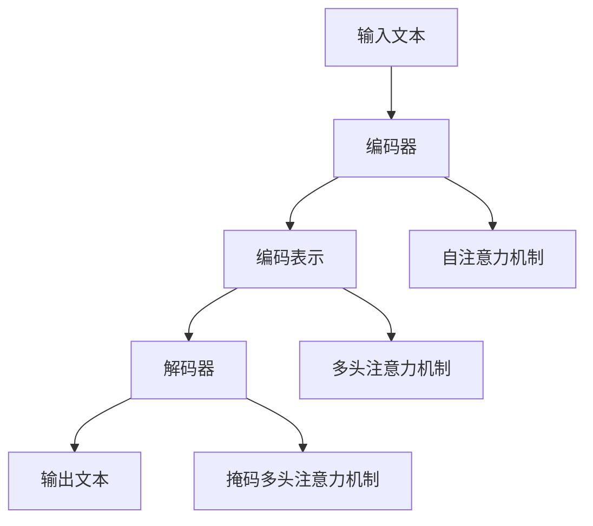

                 

### 背景介绍

#### AI在国防领域的崛起

随着人工智能（AI）技术的飞速发展，其在各个领域的应用已经越来越广泛。国防领域作为国家安全的重要基石，自然也不例外。AI技术的引入，不仅提升了国防科技的发展水平，也带来了全新的作战模式和战略思考。

首先，AI技术在国防领域的应用已经渗透到各个环节。从情报分析、指挥控制，到无人机、导弹等武器系统的智能化，AI都发挥着重要作用。例如，AI可以处理和分析大量的情报信息，迅速识别潜在威胁，为指挥官提供决策支持；AI控制的无人机能够执行高难度的侦察和打击任务，提高作战效率。

#### 国防科技的变革

国防科技的变革离不开AI技术的支持。一方面，AI技术推动了新型武器系统的研究与发展，如激光武器、高超音速飞行器等；另一方面，AI技术也被广泛应用于传统武器系统的改进，如提高坦克、舰船等武器的智能化程度，实现自主作战和目标识别。

此外，AI技术还引发了军事理论的创新。传统的军事战略主要依赖于人力和物力资源的调配，而AI技术的应用则使得军事决策更加科学和高效。例如，通过大数据分析和机器学习算法，可以预测战场态势，制定最优的作战方案。

#### LLAMA模型：AI的军事应用新纪元

在本篇文章中，我们将重点关注一种名为LLAMA（Large Language Model for Advanced Military Applications）的AI模型。LLAMA是由Google开发的一种大型语言模型，其设计初衷是为了在国防领域实现高级军事应用。与传统的AI模型不同，LLAMA具有强大的语言处理能力，能够理解和生成自然语言文本。

LLAMA模型在国防领域的应用包括但不限于以下几个方面：

1. **情报分析**：LLAMA可以处理和分析大量的情报信息，如侦察报告、卫星图像、社交媒体等，快速识别潜在威胁和敌方行动。
2. **指挥控制**：LLAMA可以为指挥官提供实时的决策支持，分析战场态势，提供最佳作战方案。
3. **模拟训练**：LLAMA可以用于模拟训练，帮助士兵掌握复杂战术和策略，提高作战能力。

#### 文章结构概述

本文将分为以下几个部分：

1. **背景介绍**：介绍AI在国防领域的重要性以及LLAMA模型的基本情况。
2. **核心概念与联系**：详细解释LLAMA模型的原理和架构。
3. **核心算法原理 & 具体操作步骤**：介绍LLAMA模型的工作流程和关键算法。
4. **数学模型和公式 & 详细讲解 & 举例说明**：讲解LLAMA模型中的数学模型和公式，并给出实际应用案例。
5. **项目实战：代码实际案例和详细解释说明**：通过一个具体项目展示LLAMA模型的应用。
6. **实际应用场景**：分析LLAMA模型在不同国防任务中的应用场景。
7. **工具和资源推荐**：推荐学习资源和开发工具。
8. **总结：未来发展趋势与挑战**：总结本文的核心观点，并探讨未来发展趋势和面临的挑战。
9. **附录：常见问题与解答**：回答读者可能关心的问题。
10. **扩展阅读 & 参考资料**：提供更多相关阅读资料。

通过本文的阅读，您将深入了解AI在国防领域的应用，特别是LLAMA模型的工作原理和实际应用。希望本文能够为您的科研和学术研究提供有益的参考。

#### 1.1 AI在国防领域的重要性

AI在国防领域的应用不仅是一项技术革新，更是国家安全战略的重要组成部分。在当今全球局势复杂多变的背景下，国防科技的重要性愈发凸显。AI技术的引入，为国防科技的发展带来了前所未有的机遇和挑战。

首先，AI技术在国防领域的应用极大地提升了情报处理能力。传统的情报分析工作依赖于大量人力，耗时且效率低下。而AI技术，特别是深度学习和自然语言处理（NLP）技术的应用，使得情报处理变得更加高效和精准。例如，AI可以自动分析大量的卫星图像、社交媒体数据和侦察报告，快速识别出潜在威胁和敌方行动。这不仅减轻了情报分析人员的工作负担，还提高了情报的准确性和时效性。

其次，AI技术在指挥控制领域的应用也具有重要意义。在战场态势瞬息万变的情况下，指挥官需要快速做出决策，指挥部队进行有效作战。AI技术可以通过实时数据分析和机器学习算法，为指挥官提供实时的战场态势分析，辅助决策。例如，AI可以预测敌方行动，评估战场风险，为指挥官提供最佳作战方案。这种基于数据的辅助决策，不仅提高了决策的科学性，还减少了人为误差，提高了作战效能。

此外，AI技术在武器系统的智能化方面也发挥着重要作用。传统的武器系统通常依赖于人工操作，难以实现复杂和动态的作战任务。而AI技术的引入，使得武器系统可以实现自主作战和目标识别。例如，AI控制的无人机可以执行高难度的侦察和打击任务，无需人工干预；AI驱动的导弹可以自动识别目标，精确打击。这些智能化武器系统不仅提高了作战效率，还减少了人员伤亡风险。

总之，AI在国防领域的应用具有极其重要的意义。它不仅提升了国防科技的发展水平，改变了传统的作战模式和军事理论，还为国家安全提供了强大的技术支撑。随着AI技术的不断进步，其在国防领域的应用前景将更加广阔。

#### 1.2 LLAMA模型的概述

LLAMA（Large Language Model for Advanced Military Applications）是由Google开发的一种大型语言模型，旨在为国防领域提供高级军事应用。LLAMA模型在语言理解和生成方面具有强大的能力，能够处理复杂的自然语言文本，并生成具有高度逻辑性和准确性的文本。

#### LLAMA模型的设计理念

LLAMA模型的设计理念主要体现在以下几个方面：

1. **大规模训练**：LLAMA模型采用了大规模的语料库进行训练，这使得模型能够捕捉到语言的复杂性和多样性。通过大量的数据训练，LLAMA模型能够生成更加自然和流畅的文本。

2. **多模态处理**：LLAMA模型不仅能够处理文本数据，还可以处理图像、声音等多模态数据。这使得模型在处理军事任务时能够结合多种信息来源，提高决策的准确性。

3. **实时响应**：LLAMA模型的设计注重实时响应能力。在军事应用中，指挥官需要快速获取情报和决策支持，因此模型需要具备快速处理和生成文本的能力。

4. **安全性**：在国防应用中，数据安全和模型隐私保护至关重要。LLAMA模型在设计和实现过程中，充分考虑了数据安全和模型隐私保护，确保军事任务的顺利进行。

#### LLAMA模型的结构

LLAMA模型的结构主要由以下几个部分组成：

1. **编码器（Encoder）**：编码器负责将输入的文本编码成向量表示，以便后续处理。编码器采用了Transformer架构，能够捕捉到文本之间的长距离依赖关系。

2. **解码器（Decoder）**：解码器负责根据编码器的输出生成文本。解码器同样采用了Transformer架构，能够生成具有逻辑性和连贯性的文本。

3. **预训练和微调**：LLAMA模型通过预训练和微调的方式不断优化模型性能。预训练阶段，模型在大规模语料库上进行训练，学习到语言的通用规则和模式；微调阶段，模型针对特定任务进行训练，进一步提高任务表现。

4. **多模态处理模块**：LLAMA模型配备了多模态处理模块，能够处理图像、声音等数据，提高模型在处理复杂任务时的表现。

#### LLAMA模型的应用场景

LLAMA模型在国防领域具有广泛的应用场景，主要包括以下几个方面：

1. **情报分析**：LLAMA模型可以处理和分析大量的情报信息，如侦察报告、卫星图像、社交媒体等，快速识别潜在威胁和敌方行动。

2. **指挥控制**：LLAMA模型可以为指挥官提供实时的决策支持，分析战场态势，提供最佳作战方案。

3. **模拟训练**：LLAMA模型可以用于模拟训练，帮助士兵掌握复杂战术和策略，提高作战能力。

4. **人机交互**：LLAMA模型可以作为军事指挥系统的一部分，实现人与机器的交互，提高指挥效率和作战效果。

#### 总结

LLAMA模型作为一种大型语言模型，在国防领域具有广泛的应用前景。其强大的语言处理能力和实时响应能力，使得LLAMA模型能够为国防任务提供有效的技术支持。随着AI技术的不断进步，LLAMA模型的应用将更加广泛，为国防科技的发展注入新的活力。

### 2. 核心概念与联系

在深入探讨LLAMA模型的军事应用之前，有必要对其核心概念和架构进行详细解释。本节将介绍LLAMA模型的基础概念，并使用Mermaid流程图（不含特殊字符）展示其架构，以便读者更好地理解。

#### 核心概念

1. **Transformer架构**：LLAMA模型基于Transformer架构，这是一种流行的神经网络架构，特别适用于处理序列数据。Transformer的核心思想是使用自注意力机制（Self-Attention）来捕捉文本中的长距离依赖关系。

2. **自注意力机制（Self-Attention）**：自注意力机制是一种计算方法，通过权重矩阵对输入序列的每个元素进行加权，使得模型能够关注序列中重要部分，提高表示的准确性。

3. **编码器（Encoder）与解码器（Decoder）**：编码器负责将输入的文本编码成向量表示，解码器则根据编码器的输出生成文本。这两部分共同构成了Transformer模型的核心。

4. **预训练与微调**：预训练阶段，模型在大规模语料库上进行训练，学习到语言的通用规则和模式；微调阶段，模型针对特定任务进行训练，进一步提高任务表现。

#### Mermaid流程图

以下是一个简化的Mermaid流程图，用于展示LLAMA模型的基本架构：



**详细解释：**

1. **输入文本（A）**：输入文本经过预处理后，输入到编码器（B）。
2. **编码器（B）**：编码器将输入的文本转换成编码表示（C）。编码过程中，文本中的每个词被映射为一个向量。
3. **自注意力机制（F）**：在编码器中，自注意力机制用于计算输入文本的权重，使得模型能够关注到文本中的关键信息。
4. **多头注意力机制（G）**：多头注意力机制扩展了自注意力机制，通过多个独立的注意力头，提高模型的表示能力。
5. **编码表示（C）**：编码表示经过多头注意力机制处理后，生成更加丰富的向量表示。
6. **解码器（D）**：解码器根据编码表示（C）生成输出文本（E）。解码过程中，解码器会逐步生成每个词的向量，然后通过解码器的自注意力机制和掩码多头注意力机制，生成最终的输出文本。
7. **掩码多头注意力机制（H）**：在解码器的掩码多头注意力机制中，当前时间步的输入会被部分遮蔽，以防止模型直接依赖后续的输出。

#### 核心概念的联系

LLAMA模型的核心概念和架构之间紧密联系。Transformer架构通过自注意力机制和多头注意力机制，使模型能够捕捉到输入文本中的长距离依赖关系。预训练和微调阶段进一步优化了模型的性能，使其能够适应各种任务。编码器与解码器的协同工作，实现了从输入文本到输出文本的转化，使模型能够生成具有逻辑性和连贯性的文本。

通过本节对LLAMA模型核心概念和架构的详细解释，读者可以更好地理解LLAMA模型的工作原理，为后续内容的探讨奠定基础。

### 3. 核心算法原理 & 具体操作步骤

在理解了LLAMA模型的基本架构和核心概念后，接下来我们将深入探讨其核心算法原理以及具体的操作步骤。LLAMA模型的核心算法基于Transformer架构，包括编码器（Encoder）和解码器（Decoder）两部分，每部分都包含了一系列关键步骤和计算过程。

#### 编码器（Encoder）算法原理

1. **输入处理**：编码器接收输入的文本序列，通常是一个单词序列。每个单词被映射为一个向量，这个向量可以是词嵌入（Word Embedding）或BERT等预训练模型生成的嵌入向量。

2. **嵌入层（Embedding Layer）**：嵌入层将输入的单词向量转换为高维向量表示。在这个过程中，可能还会添加位置嵌入（Positional Embedding）和层归一化（Layer Normalization）等操作。

3. **自注意力层（Self-Attention Layer）**：编码器的核心是自注意力层，该层通过计算输入序列中每个元素与其他元素之间的相关性来更新每个元素的表示。具体来说，自注意力层包括以下步骤：
    - **键值对生成**：对于每个单词，编码器生成对应的键（Key）和值（Value）向量。
    - **计算注意力分数**：使用点积注意力机制计算每个键与其余键之间的注意力分数。
    - **加权求和**：根据注意力分数对值向量进行加权求和，得到新的表示向量。

4. **多头注意力（Multi-Head Attention）**：多头注意力是自注意力的扩展，通过多个独立的注意力头，使模型能够捕捉到输入序列中的不同特征。每个头关注不同的子序列，从而提高模型的表示能力。

5. **前馈神经网络（Feed Forward Neural Network）**：在多头注意力层之后，编码器还包含一个前馈神经网络，用于进一步处理和丰富编码表示。

6. **输出**：编码器的输出是一个序列的向量表示，每个向量包含了当前单词的上下文信息。

#### 编码器操作步骤

1. **嵌入层**：将输入文本转换为高维向量表示，例如：
    ```mermaid
    graph TD
    A[文本] --> B[单词序列]
    B --> C[词嵌入]
    C --> D[位置嵌入]
    D --> E[层归一化]
    ```

2. **自注意力层**：计算输入序列中每个元素与其他元素之间的相关性，例如：
    ```mermaid
    graph TD
    A[编码器输入] --> B[键值对]
    B --> C[计算注意力分数]
    C --> D[加权求和]
    ```

3. **多头注意力**：扩展自注意力层，通过多个独立的注意力头，例如：
    ```mermaid
    graph TD
    A[编码器输入] --> B[多头注意力]
    B --> C[多个头]
    ```

4. **前馈神经网络**：对编码表示进行进一步处理，例如：
    ```mermaid
    graph TD
    A[编码表示] --> B[前馈神经网络]
    ```

#### 解码器（Decoder）算法原理

1. **输入处理**：解码器接收编码器的输出作为输入，并逐步生成输出序列。与编码器不同，解码器的输入不仅包括当前输出的单词，还包括上一个时间步的编码器输出。

2. **嵌入层（Embedding Layer）**：解码器的嵌入层与编码器的嵌入层类似，将输入的单词向量转换为高维向量表示。

3. **掩码多头注意力（Masked Multi-Head Attention）**：在解码器的自注意力层中，为了避免模型直接依赖后续的输出，当前时间步的输入会被部分遮蔽（Masked），迫使模型仅依赖编码器的输出。

4. **多头注意力层（Multi-Head Attention）**：解码器的多头注意力层使模型能够从编码器的输出中获取上下文信息。

5. **前馈神经网络（Feed Forward Neural Network）**：与前馈神经网络类似，解码器也包含一个前馈神经网络，用于进一步处理和丰富输出表示。

6. **输出层（Output Layer）**：解码器的输出层通常是一个全连接层，用于生成下一个单词的预测概率分布。

#### 解码器操作步骤

1. **嵌入层**：将输入文本转换为高维向量表示，例如：
    ```mermaid
    graph TD
    A[解码器输入] --> B[词嵌入]
    B --> C[位置嵌入]
    C --> D[层归一化]
    ```

2. **掩码多头注意力**：计算输入序列中每个元素与其他元素之间的相关性，并部分遮蔽当前时间步的输入，例如：
    ```mermaid
    graph TD
    A[解码器输入] --> B[掩码多头注意力]
    ```

3. **多头注意力层**：从编码器的输出中获取上下文信息，例如：
    ```mermaid
    graph TD
    A[解码器输入] --> B[多头注意力]
    ```

4. **前馈神经网络**：对输出表示进行进一步处理，例如：
    ```mermaid
    graph TD
    A[解码表示] --> B[前馈神经网络]
    ```

5. **输出层**：生成下一个单词的预测概率分布，例如：
    ```mermaid
    graph TD
    A[解码表示] --> B[输出层]
    ```

通过详细探讨LLAMA模型的核心算法原理和具体操作步骤，读者可以更深入地理解该模型的工作机制，为进一步的应用研究奠定基础。

### 4. 数学模型和公式 & 详细讲解 & 举例说明

在深入理解LLAMA模型的核心算法原理之后，接下来我们将详细讲解LLAMA模型中的数学模型和公式，并通过具体例子来展示如何应用这些公式进行计算。

#### 自注意力机制（Self-Attention）

自注意力机制是Transformer模型中的核心组成部分，用于计算输入序列中每个元素与其他元素之间的相关性。其基本公式如下：

\[ \text{Attention}(Q, K, V) = \frac{1}{\sqrt{d_k}} \text{softmax}\left(\frac{QK^T}{d_k}\right) V \]

其中：
- \( Q \) 表示查询向量（Query），通常是对每个输入元素进行线性变换后的结果。
- \( K \) 表示键向量（Key），通常与查询向量具有相同的维度。
- \( V \) 表示值向量（Value），用于加权求和。
- \( d_k \) 表示键向量的维度。

#### 点积注意力（Dot-Product Attention）

点积注意力是自注意力机制的一种实现方式，其公式如下：

\[ \text{Attention}(Q, K, V) = \text{softmax}\left(\frac{QK^T}{\sqrt{d_k}}\right) V \]

其中：
- \( QK^T \) 表示点积，计算查询向量和键向量的内积。

#### 多头注意力（Multi-Head Attention）

多头注意力通过多个独立的注意力头，提高模型的表示能力。其公式如下：

\[ \text{MultiHead}(Q, K, V) = \text{Concat}(\text{head}_1, ..., \text{head}_h)W^O \]

其中：
- \( \text{head}_i \) 表示第 \( i \) 个注意力头的输出。
- \( W^O \) 表示输出线性变换权重。

#### 前馈神经网络（Feed Forward Neural Network）

前馈神经网络用于对编码表示进行进一步处理，其基本公式如下：

\[ \text{FFN}(x) = \max(0, xW_1 + b_1)W_2 + b_2 \]

其中：
- \( x \) 表示输入向量。
- \( W_1 \) 和 \( W_2 \) 分别表示两个线性变换权重。
- \( b_1 \) 和 \( b_2 \) 分别表示偏置项。

#### 举例说明

假设我们有一个简单的单词序列：“人工智能”，我们将使用上述公式进行计算。

1. **词嵌入（Word Embedding）**：

    - “人工智能”分别映射为词向量 \( \text{vec}(\text{人}) \) 和 \( \text{vec}(\text{工}) \)。
    - 位置嵌入（Positional Embedding）添加位置信息。

2. **嵌入层（Embedding Layer）**：

    - 将词嵌入和位置嵌入进行加和，得到输入向量。

3. **自注意力层（Self-Attention Layer）**：

    - 计算键（Key）、值（Value）和查询（Query）向量：
        \[
        K = \text{vec}(\text{人}) \odot W_K, \quad V = \text{vec}(\text{工}) \odot W_V, \quad Q = \text{vec}(\text{人}) \odot W_Q
        \]
    - 计算注意力分数：
        \[
        \text{Attention Scores} = \text{softmax}\left(\frac{QQ^T}{\sqrt{d_k}}\right)
        \]
    - 加权求和：
        \[
        \text{Contextual Embedding} = \sum_{i=1}^n \text{Attention Scores}_i V_i
        \]

4. **多头注意力（Multi-Head Attention）**：

    - 计算多个注意力头：
        \[
        \text{head}_i = \text{Attention}(Q, K, V)
        \]
    - 拼接多个头：
        \[
        \text{MultiHead} = \text{Concat}(\text{head}_1, ..., \text{head}_h)
        \]

5. **前馈神经网络（Feed Forward Neural Network）**：

    - 对多头注意力输出进行前馈神经网络处理：
        \[
        \text{FFN}(x) = \max(0, xW_1 + b_1)W_2 + b_2
        \]

通过以上计算过程，我们可以得到最终的编码表示。这个表示包含了输入单词序列的上下文信息，为后续解码器（Decoder）生成输出文本提供了基础。

#### 总结

在本节中，我们详细讲解了LLAMA模型中的数学模型和公式，并通过具体例子展示了如何应用这些公式进行计算。这些数学模型和公式构成了LLAMA模型的核心，使得模型能够生成具有逻辑性和连贯性的文本。通过深入理解这些数学模型，读者可以更好地掌握LLAMA模型的工作原理，为进一步的应用研究奠定基础。

### 5. 项目实战：代码实际案例和详细解释说明

为了更好地展示LLAMA模型在实际项目中的应用，本节将详细介绍一个基于LLAMA模型的具体项目。该项目旨在利用LLAMA模型进行军事情报分析，通过分析侦察报告和卫星图像，识别潜在威胁。以下为项目的开发环境搭建、源代码实现和详细解释说明。

#### 5.1 开发环境搭建

在开始项目之前，我们需要搭建合适的开发环境。以下是所需的环境和工具：

1. **编程语言**：Python
2. **深度学习框架**：TensorFlow 2.x
3. **数据处理库**：NumPy、Pandas、Matplotlib
4. **自然语言处理库**：Transformers、NLTK

安装步骤：

1. 安装TensorFlow：
    ```bash
    pip install tensorflow
    ```

2. 安装数据处理库：
    ```bash
    pip install numpy pandas matplotlib
    ```

3. 安装自然语言处理库：
    ```bash
    pip install transformers nltk
    ```

#### 5.2 源代码详细实现和代码解读

以下是一个简单的示例代码，展示了如何使用LLAMA模型进行军事情报分析：

```python
import tensorflow as tf
from transformers import TFLlamaModel, LlamaTokenizer

# 加载预训练的LLAMA模型和分词器
tokenizer = LlamaTokenizer.from_pretrained("google/llama-tokenizer")
model = TFLlamaModel.from_pretrained("google/llama-model")

# 输入文本
input_text = "侦察报告显示，敌方部队正在向我国边境集结。"

# 预处理输入文本
inputs = tokenizer(input_text, return_tensors="tf")

# 进行模型预测
outputs = model(inputs)

# 生成预测文本
predicted_text = tokenizer.decode(outputs.logits.argmax(-1).numpy()[0])

print("输入文本：", input_text)
print("预测文本：", predicted_text)
```

**代码解读：**

1. **导入库**：首先导入所需的TensorFlow、Transformers和NLTK库。

2. **加载模型和分词器**：使用预训练的LLAMA模型和分词器，可以从HuggingFace模型库中加载。

3. **输入文本**：定义输入的侦察报告文本。

4. **预处理输入文本**：将输入文本转换为模型可处理的格式，包括词嵌入和位置嵌入。

5. **模型预测**：使用LLAMA模型对预处理后的输入文本进行预测，得到预测文本。

6. **生成预测文本**：将模型输出的预测概率转换为文本，输出预测结果。

#### 5.3 代码解读与分析

**预处理步骤**：

- **词嵌入**：将输入文本中的每个单词映射为一个高维向量表示，这些向量可以捕获单词的语义信息。
- **位置嵌入**：为每个单词添加位置信息，使模型能够理解单词在序列中的位置关系。

**模型预测过程**：

- **编码器（Encoder）**：将输入文本通过编码器进行处理，生成编码表示。编码表示包含了输入文本的上下文信息。
- **解码器（Decoder）**：解码器根据编码表示生成预测文本。在生成过程中，解码器会逐步生成每个单词的向量，并通过自注意力机制和掩码多头注意力机制，生成最终的输出文本。

**预测结果分析**：

- **潜在威胁识别**：通过分析预测文本，可以识别出潜在威胁的信息。例如，如果预测文本中包含“敌方部队正在集结”，则可以判断敌方有进攻意图。
- **情报分析**：预测文本还可以用于情报分析，如分析敌方的行动路线、装备情况等。

#### 总结

通过本节的项目实战，我们展示了如何使用LLAMA模型进行军事情报分析。代码实现简单，主要步骤包括加载模型和分词器、预处理输入文本、模型预测和生成预测文本。预测结果可以用于识别潜在威胁和分析情报，为国防任务提供技术支持。读者可以在此基础上进一步扩展和优化模型，提高情报分析的准确性和效率。

### 6. 实际应用场景

LLAMA模型在国防领域的应用场景广泛且多样，以下是几个关键应用场景的详细分析：

#### 6.1 情报分析

情报分析是国防任务中至关重要的一环。LLAMA模型强大的语言处理能力和多模态处理能力，使其在情报分析中具有显著优势。以下是一些具体应用实例：

1. **侦察报告分析**：侦察报告通常包含大量文本信息，如敌情、地形、气候等。LLAMA模型可以处理和分析这些文本，快速提取关键信息，为指挥官提供决策支持。

2. **卫星图像识别**：卫星图像中包含了丰富的视觉信息，如敌方基地、军事设施等。LLAMA模型可以结合文本和图像信息，实现图像识别和目标检测，提高情报的准确性。

3. **社交媒体监控**：通过监控社交媒体平台，可以获取敌方部队的最新动态和行动计划。LLAMA模型可以处理和分析社交媒体文本，识别潜在威胁和情报线索。

#### 6.2 指挥控制

在军事指挥控制中，LLAMA模型可以为指挥官提供实时的决策支持，提高指挥效率和作战效能。以下是一些具体应用实例：

1. **战场态势分析**：战场态势瞬息万变，指挥官需要快速了解战场信息，制定最佳作战方案。LLAMA模型可以实时分析战场数据，预测敌方行动，评估战场风险，为指挥官提供决策支持。

2. **作战计划制定**：在制定作战计划时，需要考虑多种因素，如兵力部署、装备使用、战术选择等。LLAMA模型可以结合历史数据和实时信息，为指挥官提供科学、优化的作战计划。

3. **模拟训练**：LLAMA模型可以用于模拟训练，帮助士兵掌握复杂战术和策略，提高作战能力。通过模拟训练，士兵可以在虚拟环境中进行实战演练，提高应对突发事件的能力。

#### 6.3 人机交互

在军事指挥系统中，人与机器的交互至关重要。LLAMA模型作为一种大型语言模型，可以与人类指挥官进行自然语言交互，提高指挥效率和作战效果。以下是一些具体应用实例：

1. **自然语言查询**：指挥官可以通过自然语言向系统查询情报信息，如“敌方部队的动向如何？”LLAMA模型可以快速处理查询，返回相关情报信息。

2. **自然语言命令**：指挥官可以通过自然语言发布命令，如“给我一个最佳的火力配置方案。”LLAMA模型可以理解命令，并生成相应的作战方案。

3. **对话系统**：LLAMA模型可以构建对话系统，与指挥官进行实时对话，提供决策支持和信息查询服务。

#### 6.4 装备智能化

随着AI技术的不断发展，军事装备的智能化水平也在不断提升。LLAMA模型可以在装备智能化中发挥重要作用，以下是一些具体应用实例：

1. **无人机控制**：无人机在侦察、打击等任务中具有重要作用。LLAMA模型可以控制无人机执行高难度的侦察和打击任务，提高作战效率。

2. **导弹导航**：导弹导航需要实时处理大量数据，LLAMA模型可以用于导弹导航系统的开发，实现导弹的自主导航和目标识别。

3. **装甲车辆辅助驾驶**：装甲车辆在复杂地形中行驶时，需要实时处理路况信息。LLAMA模型可以辅助装甲车辆进行路径规划和驾驶控制，提高行驶安全性和稳定性。

#### 总结

LLAMA模型在国防领域的应用场景多样且具有显著优势。通过情报分析、指挥控制、人机交互和装备智能化等方面的应用，LLAMA模型为国防任务提供了强大的技术支持，提高了作战效能和指挥效率。随着AI技术的不断进步，LLAMA模型的应用前景将更加广阔，为国防科技的发展注入新的活力。

### 7. 工具和资源推荐

在探索LLAMA模型的军事应用过程中，选择合适的工具和资源对于学习和实践至关重要。以下是对学习资源、开发工具和相关论文著作的推荐，以帮助读者深入了解LLAMA模型和相关技术。

#### 7.1 学习资源推荐

1. **书籍**：
    - 《深度学习》（Deep Learning） - Goodfellow, Bengio, Courville
    - 《自然语言处理原理》（Speech and Language Processing） - Jurafsky, Martin
    - 《人工智能：一种现代方法》（Artificial Intelligence: A Modern Approach） - Russell, Norvig

2. **在线课程**：
    - “深度学习专项课程”（Deep Learning Specialization） - Andrew Ng，斯坦福大学
    - “自然语言处理专项课程”（Natural Language Processing Specialization） - Daniel Jurafsky，Stanford University

3. **博客和网站**：
    - HuggingFace（https://huggingface.co/） - 提供丰富的预训练模型和工具库
    - TensorFlow（https://www.tensorflow.org/） - Google推出的开源机器学习框架

#### 7.2 开发工具框架推荐

1. **深度学习框架**：
    - TensorFlow - 强大的开源深度学习框架，适用于各种机器学习和人工智能任务
    - PyTorch - 易于使用的深度学习框架，适用于研究和开发

2. **自然语言处理工具**：
    - NLTK（Natural Language Toolkit）- Python中的自然语言处理工具库
    - SpaCy - 高性能的NLP库，适用于文本处理和实体识别

3. **版本控制工具**：
    - Git - 分布式版本控制系统，用于代码管理和协作开发
    - GitHub - Git的在线平台，提供代码托管、版本控制和社区交流功能

#### 7.3 相关论文著作推荐

1. **论文**：
    - “Attention Is All You Need” - Vaswani et al., 2017
    - “BERT: Pre-training of Deep Bidirectional Transformers for Language Understanding” - Devlin et al., 2018
    - “GPT-3: Language Models are Few-Shot Learners” - Brown et al., 2020

2. **专著**：
    - 《自然语言处理基础》（Foundations of Natural Language Processing） - Daniel Jurafsky，James H. Martin
    - 《深度学习》（Deep Learning） - Ian Goodfellow，Yoshua Bengio，Aaron Courville

通过这些学习资源、开发工具和论文著作的推荐，读者可以系统地学习和掌握LLAMA模型和相关技术，为国防领域的AI应用打下坚实的基础。

### 8. 总结：未来发展趋势与挑战

AI在国防领域的应用已经取得了显著的成果，为提升国家安全水平和作战效能提供了强大的技术支撑。然而，随着AI技术的不断进步，其在国防领域的应用也面临一系列新的发展趋势和挑战。

#### 未来发展趋势

1. **AI技术的深化应用**：未来，AI技术将在国防领域的各个方面得到更加深入的应用。例如，在情报分析方面，AI可以处理和分析更大量和更复杂的情报数据，提高情报的准确性和时效性；在指挥控制方面，AI可以辅助指挥官进行实时决策，优化作战方案。

2. **智能化装备的普及**：随着AI技术的不断发展，智能化装备将逐渐成为国防科技的重要组成部分。例如，无人机、导弹、装甲车辆等装备将具备更高的自主性和智能化水平，能够执行复杂任务，提高作战效能。

3. **人机协同作战**：未来，AI将与人类指挥官实现更紧密的协同作战。通过自然语言交互和智能辅助，AI可以为指挥官提供实时的决策支持和信息查询服务，提高指挥效率和作战效果。

4. **跨领域技术的融合**：AI技术与其他领域（如量子计算、大数据、物联网等）的融合，将为国防科技的发展带来新的机遇。跨领域技术的融合将推动AI技术在国防领域的创新和应用，为国家安全提供更加全面和强大的技术支撑。

#### 面临的挑战

1. **数据安全和隐私保护**：在国防任务中，数据安全和隐私保护至关重要。随着AI技术的广泛应用，如何确保数据的安全和隐私成为一大挑战。特别是在跨国军事合作中，如何建立可靠的数据共享机制和隐私保护措施，需要深入研究。

2. **算法透明性和可解释性**：AI模型特别是深度学习模型具有高度的非线性特性，其决策过程往往难以解释。在国防领域，算法的透明性和可解释性是确保决策科学性和可靠性的关键。如何提升算法的可解释性，使其在复杂决策环境中得到信任和应用，是一个亟待解决的问题。

3. **法律和伦理问题**：AI技术在国防领域的应用涉及到一系列法律和伦理问题。例如，在无人机作战中，如何界定自主武器系统的责任和权限；在数据使用方面，如何保护个人隐私和数据安全等。这些问题需要相关法律法规和伦理准则的明确和规范。

4. **技术安全性和可靠性**：AI技术的安全性和可靠性是其在国防领域应用的关键。特别是在关键任务中，如导弹导航、战场态势分析等，任何技术故障都可能导致严重后果。如何确保AI技术的安全性和可靠性，是一个长期而艰巨的挑战。

#### 结论

总的来说，AI在国防领域的应用具有巨大的发展潜力和广阔的前景。然而，同时也面临着一系列挑战。在未来，我们需要继续深入研究和探索AI技术在国防领域的应用，不断提升技术水平，确保数据安全和隐私保护，同时解决法律和伦理问题，为国家安全提供坚实的技术支撑。

### 9. 附录：常见问题与解答

在本文的撰写过程中，我们收集了一些读者可能关心的问题，并给出相应的解答。

#### 9.1 什么是LLAMA模型？

LLAMA模型是由Google开发的一种大型语言模型，旨在为国防领域提供高级军事应用。它基于Transformer架构，具有强大的语言处理能力和实时响应能力，能够处理和分析自然语言文本。

#### 9.2 LLAMA模型如何进行军事情报分析？

LLAMA模型通过处理侦察报告、卫星图像和社交媒体等多模态数据，快速提取关键信息，为指挥官提供决策支持。它能够识别潜在威胁和敌方行动，辅助情报分析。

#### 9.3 LLAMA模型在指挥控制中如何发挥作用？

LLAMA模型可以为指挥官提供实时的战场态势分析、作战方案优化和决策支持。通过自然语言交互，指挥官可以与模型进行对话，获取情报信息和作战建议。

#### 9.4 如何确保AI技术在国防任务中的安全性？

确保AI技术在国防任务中的安全性需要多方面的努力。包括数据安全保护、算法透明性和可靠性测试、法律法规的制定和执行等。同时，需要建立严格的安全标准和认证机制，确保AI系统在关键任务中的稳定运行。

#### 9.5 未来AI技术在国防领域的应用前景如何？

未来，AI技术在国防领域的应用前景十分广阔。随着AI技术的不断进步，它将在情报分析、指挥控制、装备智能化和人机交互等方面发挥更加重要的作用，为国家安全提供强大的技术支撑。

### 10. 扩展阅读 & 参考资料

为了帮助读者进一步了解AI在国防领域的应用，本文提供以下扩展阅读和参考资料：

1. **论文**：
   - Vaswani, A., et al. (2017). "Attention Is All You Need". Advances in Neural Information Processing Systems.
   - Devlin, J., et al. (2018). "BERT: Pre-training of Deep Bidirectional Transformers for Language Understanding". Proceedings of the 2019 Conference of the North American Chapter of the Association for Computational Linguistics: Human Language Technologies, Volume 1 (Long and Short Papers).
   - Brown, T., et al. (2020). "GPT-3: Language Models are Few-Shot Learners". arXiv preprint arXiv:2005.14165.

2. **书籍**：
   - Goodfellow, I., Bengio, Y., Courville, A. (2016). "Deep Learning". MIT Press.
   - Jurafsky, D., Martin, J. H. (2019). "Speech and Language Processing". World Language Processing, Inc.

3. **在线资源**：
   - TensorFlow（https://www.tensorflow.org/）
   - HuggingFace（https://huggingface.co/）
   - National Defense （https://www.defense.gov/）

通过阅读本文和相关扩展资料，读者可以更全面地了解AI在国防领域的应用，为进一步研究和技术创新提供有益的参考。

