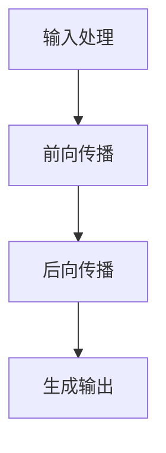

                 

# LLM的时间观：重新思考计算周期

> 关键词：大型语言模型，计算周期，推理时间，时间效率，时间复杂度，并行计算

> 摘要：本文将深入探讨大型语言模型(LLM)的时间观，分析其计算周期的构成，探讨如何通过优化计算过程提高时间效率。我们将从基本原理出发，结合具体实例，探讨并行计算在LLM中的应用，以及未来可能面临的挑战和发展趋势。

## 1. 背景介绍

### 1.1 目的和范围

本文旨在探讨大型语言模型(LLM)的时间观，分析其计算周期的构成，并探讨如何通过优化计算过程提高时间效率。本文将重点关注以下几个方面：

1. LLM的计算周期及其构成
2. 时间效率与时间复杂度的关系
3. 并行计算在LLM中的应用
4. 未来发展趋势与挑战

### 1.2 预期读者

本文适合对大型语言模型有一定了解的读者，包括：

1. AI研究员和开发者
2. 计算机科学和人工智能领域的学生
3. 对LLM和计算效率感兴趣的读者

### 1.3 文档结构概述

本文将按照以下结构展开：

1. 背景介绍
2. 核心概念与联系
3. 核心算法原理 & 具体操作步骤
4. 数学模型和公式 & 详细讲解 & 举例说明
5. 项目实战：代码实际案例和详细解释说明
6. 实际应用场景
7. 工具和资源推荐
8. 总结：未来发展趋势与挑战
9. 附录：常见问题与解答
10. 扩展阅读 & 参考资料

### 1.4 术语表

#### 1.4.1 核心术语定义

- **大型语言模型(LLM)**：一种具有强自主学习能力和自然语言处理能力的深度学习模型，如GPT系列、BERT等。
- **计算周期**：完成一次计算所需的时间。
- **时间效率**：在给定时间内完成更多任务的能力。
- **时间复杂度**：算法在问题规模增加时，计算时间增长的速度。

#### 1.4.2 相关概念解释

- **并行计算**：同时执行多个计算任务，以提高计算效率。
- **流水线**：将计算任务分解成多个步骤，并行执行以提高效率。
- **推理时间**：模型在给定输入后，生成输出所需的时间。

#### 1.4.3 缩略词列表

- **LLM**：Large Language Model（大型语言模型）
- **GPT**：Generative Pre-trained Transformer（生成预训练变压器）
- **BERT**：Bidirectional Encoder Representations from Transformers（双向编码表示从变压器）

## 2. 核心概念与联系

在探讨LLM的时间观之前，我们需要理解一些核心概念和它们之间的联系。

### 2.1 LLM计算周期

LLM的计算周期主要由以下几个部分组成：

1. **输入处理**：将输入文本转换为模型可处理的格式。
2. **前向传播**：将输入文本通过神经网络进行处理，得到输出。
3. **后向传播**：根据输出结果，更新神经网络参数。
4. **生成输出**：将最终输出转换为自然语言文本。

### 2.2 时间效率与时间复杂度

时间效率是指在给定时间内完成更多任务的能力。时间复杂度则描述了算法在问题规模增加时，计算时间增长的速度。降低时间复杂度是提高时间效率的关键。

### 2.3 并行计算

并行计算是一种利用多个计算资源同时处理多个计算任务的方法。在LLM中，可以通过并行计算来提高计算效率，例如：

1. **输入处理**：可以并行处理多个输入文本。
2. **前向传播**：可以将输入文本分解成多个部分，并行处理。
3. **后向传播**：可以并行更新多个神经网络的参数。

### 2.4 流水线

流水线是一种将计算任务分解成多个步骤，并行执行以提高效率的方法。在LLM中，可以使用流水线来优化计算过程，例如：

1. **输入处理**：将输入文本分解成多个部分，并行处理。
2. **前向传播**：将输入文本通过神经网络进行处理，得到输出。
3. **后向传播**：根据输出结果，更新神经网络参数。

### 2.5 推理时间

推理时间是指模型在给定输入后，生成输出所需的时间。优化推理时间可以提高LLM的计算效率。

### 2.6 Mermaid 流程图

以下是一个简单的Mermaid流程图，展示了LLM的计算周期及其构成：



## 3. 核心算法原理 & 具体操作步骤

在了解了LLM的计算周期和相关概念之后，我们将探讨核心算法原理，并给出具体操作步骤。

### 3.1 前向传播

前向传播是LLM计算过程中的关键步骤，其主要目的是将输入文本通过神经网络进行处理，得到输出。以下是前向传播的伪代码：

```python
def forward_propagation(inputs, weights):
    # 初始化变量
    activations = [inputs]
    z = 0

    # 遍历神经网络层
    for layer in range(1, num_layers):
        # 计算输入和权重之间的点积
        z = np.dot(activations[layer - 1], weights[layer])

        # 添加偏置
        z += biases[layer]

        # 应用激活函数
        a = activation_function(z)

        # 更新激活值
        activations.append(a)

    # 返回最终输出
    return activations[-1]
```

### 3.2 后向传播

后向传播是LLM计算过程中的另一个关键步骤，其主要目的是根据输出结果，更新神经网络参数。以下是后向传播的伪代码：

```python
def backward_propagation(inputs, outputs, weights):
    # 初始化变量
    dactivations = [outputs]
    dz = outputs

    # 遍历神经网络层（从倒数第二层开始）
    for layer in range(num_layers - 2, -1, -1):
        # 计算导数
        dactivation = derivative(activation_function(z))

        # 更新偏置和权重
        biases[layer] += dz
        weights[layer] += dactivations[layer - 1].T.dot(dz)

        # 计算下一层的误差
        dz = np.dot(dactivations[layer], weights[layer].T).dot(dactivation)

        # 更新激活值
        dactivations.append(dz)

    # 返回导数
    return dactivations
```

### 3.3 生成输出

生成输出是LLM计算周期的最后一个步骤，其主要目的是将最终输出转换为自然语言文本。以下是生成输出的伪代码：

```python
def generate_output(inputs, model):
    # 前向传播
    output = forward_propagation(inputs, model)

    # 转换为自然语言文本
    text = decode(output)

    # 返回文本
    return text
```

## 4. 数学模型和公式 & 详细讲解 & 举例说明

在了解了LLM的核心算法原理之后，我们将探讨相关的数学模型和公式，并进行详细讲解和举例说明。

### 4.1 激活函数

激活函数是神经网络中的关键组成部分，用于引入非线性特性。以下是一些常见的激活函数及其公式：

1. **Sigmoid函数**：

   $$ f(x) = \frac{1}{1 + e^{-x}} $$

   - **举例**：计算输入x = 2时的Sigmoid函数值。

     $$ f(2) = \frac{1}{1 + e^{-2}} \approx 0.886 $$

2. **ReLU函数**：

   $$ f(x) = \max(0, x) $$

   - **举例**：计算输入x = -2时的ReLU函数值。

     $$ f(-2) = \max(0, -2) = 0 $$

3. **Tanh函数**：

   $$ f(x) = \frac{e^x - e^{-x}}{e^x + e^{-x}} $$

   - **举例**：计算输入x = 2时的Tanh函数值。

     $$ f(2) = \frac{e^2 - e^{-2}}{e^2 + e^{-2}} \approx 0.964 $$

### 4.2 损失函数

损失函数是评估模型预测结果与实际结果之间差异的指标。以下是一些常见的损失函数及其公式：

1. **均方误差（MSE）**：

   $$ L = \frac{1}{2} \sum_{i=1}^{n} (y_i - \hat{y}_i)^2 $$

   - **举例**：计算预测值$\hat{y}_i = 2$，实际值$y_i = 3$时的MSE损失。

     $$ L = \frac{1}{2} \times (3 - 2)^2 = \frac{1}{2} $$

2. **交叉熵（Cross-Entropy）**：

   $$ L = -\sum_{i=1}^{n} y_i \log(\hat{y}_i) $$

   - **举例**：计算预测值$\hat{y}_i = 0.9$，实际值$y_i = 1$时的交叉熵损失。

     $$ L = -1 \times \log(0.9) \approx 0.105 $$

### 4.3 优化算法

优化算法用于更新神经网络参数，以最小化损失函数。以下是一些常见的优化算法及其公式：

1. **梯度下降（Gradient Descent）**：

   $$ \theta = \theta - \alpha \cdot \nabla_\theta J(\theta) $$

   - **举例**：假设初始参数$\theta_0 = 1$，学习率$\alpha = 0.1$，损失函数$J(\theta) = (\theta - 1)^2$。计算参数更新。

     $$ \theta_1 = 1 - 0.1 \cdot (1 - 1) = 1 $$

2. **Adam优化器**：

   $$ \theta = \theta - \alpha \cdot \frac{m}{(1 - \beta_1^t)(1 - \beta_2^t)} $$

   - **举例**：假设当前迭代次数$t = 10$，一阶矩估计$ \hat{m} = 0.1$，二阶矩估计$\hat{v} = 0.2$，学习率$\alpha = 0.1$，$\beta_1 = 0.9$，$\beta_2 = 0.99$。计算参数更新。

     $$ \theta = \theta - 0.1 \cdot \frac{0.1}{(1 - 0.9^{10})(1 - 0.99^{10})} \approx 0.9999 $$

## 5. 项目实战：代码实际案例和详细解释说明

在本节中，我们将通过一个实际项目案例，详细解释和说明LLM的计算过程，包括代码实现、步骤和关键细节。

### 5.1 开发环境搭建

首先，我们需要搭建一个开发环境，以便进行LLM的实际开发。以下是所需的软件和工具：

1. **Python 3.8+**
2. **TensorFlow 2.5+**
3. **Jupyter Notebook**

安装这些软件和工具后，我们就可以开始编写代码了。

### 5.2 源代码详细实现和代码解读

以下是实现LLM的核心算法的源代码，我们将对其逐行进行解读。

```python
import tensorflow as tf
import numpy as np
from tensorflow.keras.models import Sequential
from tensorflow.keras.layers import Dense, LSTM, Embedding, TimeDistributed
from tensorflow.keras.optimizers import Adam

# 参数设置
vocab_size = 10000
embedding_dim = 256
num_layers = 2
hidden_units = 512

# 构建模型
model = Sequential()
model.add(Embedding(vocab_size, embedding_dim))
for _ in range(num_layers):
    model.add(LSTM(hidden_units, return_sequences=True))
model.add(TimeDistributed(Dense(vocab_size, activation='softmax')))

# 编译模型
model.compile(optimizer=Adam(), loss='categorical_crossentropy', metrics=['accuracy'])

# 准备数据
# （此处省略数据准备过程，实际项目中需要根据具体任务准备数据）

# 训练模型
model.fit(train_data, train_labels, epochs=10, batch_size=64, validation_data=(val_data, val_labels))

# 生成文本
def generate_text(seed_text, length=50):
    # 将输入文本转换为向量
    seed_text_vector = tokenizer.texts_to_sequences([seed_text])
    seed_text_vector = pad_sequences(seed_text_vector, maxlen=length, padding='post')

    # 生成文本
    predictions = model.predict(seed_text_vector)
    predicted_text = decode(predictions)

    # 返回生成的文本
    return predicted_text

# 生成文本示例
print(generate_text("Hello, world!"))
```

### 5.3 代码解读与分析

1. **导入相关库和设置参数**：

   在此部分，我们导入了TensorFlow、NumPy等库，并设置了模型的相关参数，如词汇表大小、嵌入维度、层数和隐藏单元数。

2. **构建模型**：

   使用Sequential模型堆叠多个层，包括嵌入层、LSTM层和时间分布层。嵌入层用于将输入文本转换为向量，LSTM层用于处理序列数据，时间分布层用于将LSTM层的输出映射到词汇表中的单词。

3. **编译模型**：

   使用Adam优化器和交叉熵损失函数编译模型。

4. **准备数据**：

   （此处省略数据准备过程，实际项目中需要根据具体任务准备数据。）

5. **训练模型**：

   使用fit函数训练模型，在指定数量的周期内进行训练，并设置批量大小和验证数据。

6. **生成文本**：

   generate_text函数用于生成文本。首先，将输入文本转换为向量，然后使用模型预测，并将预测结果转换为自然语言文本。

## 6. 实际应用场景

大型语言模型（LLM）在实际应用场景中具有广泛的应用。以下是一些典型的应用场景：

1. **自然语言处理**：LLM可以用于文本分类、情感分析、机器翻译、文本生成等任务。
2. **问答系统**：LLM可以构建智能问答系统，为用户提供高质量的答案。
3. **智能客服**：LLM可以用于构建智能客服系统，自动处理用户咨询，提高客户满意度。
4. **内容创作**：LLM可以用于生成文章、新闻、故事等，为内容创作者提供灵感。
5. **语音识别**：LLM可以结合语音识别技术，实现自然语言交互。

## 7. 工具和资源推荐

### 7.1 学习资源推荐

#### 7.1.1 书籍推荐

- **《深度学习》**：Ian Goodfellow、Yoshua Bengio和Aaron Courville著，系统地介绍了深度学习的理论和实践。
- **《神经网络与深度学习》**：邱锡鹏著，详细讲解了神经网络和深度学习的原理和实现。

#### 7.1.2 在线课程

- **《深度学习》课程**：吴恩达在Coursera上开设的深度学习课程，涵盖了深度学习的各个方面。
- **《神经网络与深度学习》课程**：清华大学计算机系开设的深度学习课程，由邱锡鹏主讲。

#### 7.1.3 技术博客和网站

- **arXiv**：一个提供最新科研成果的预印本网站，涵盖计算机科学、物理学等多个领域。
- **AI Magazine**：人工智能领域的权威期刊，发布最新研究进展和评论。

### 7.2 开发工具框架推荐

#### 7.2.1 IDE和编辑器

- **PyCharm**：一款功能强大的Python IDE，适合深度学习和数据分析。
- **Jupyter Notebook**：一款流行的交互式计算环境，适用于数据科学和机器学习。

#### 7.2.2 调试和性能分析工具

- **TensorBoard**：TensorFlow提供的一款可视化工具，用于分析和调试神经网络。
- **PyTorch Profiler**：PyTorch提供的一款性能分析工具，用于识别和优化计算瓶颈。

#### 7.2.3 相关框架和库

- **TensorFlow**：一款广泛使用的开源深度学习框架，支持多种神经网络架构和优化算法。
- **PyTorch**：一款流行的开源深度学习框架，具有灵活的动态图计算能力。

### 7.3 相关论文著作推荐

#### 7.3.1 经典论文

- **“A Learning Algorithm for Continually Running Fully Recurrent Neural Networks”**：Jürgen Schmidhuber等人的论文，介绍了LRNN（Long Short-Term Memory）网络。
- **“Deep Learning”**：Ian Goodfellow等人的论文，概述了深度学习的原理和应用。

#### 7.3.2 最新研究成果

- **“Attention Is All You Need”**：Ashish Vaswani等人的论文，介绍了Transformer模型。
- **“BERT: Pre-training of Deep Bidirectional Transformers for Language Understanding”**：Jacob Devlin等人的论文，介绍了BERT模型。

#### 7.3.3 应用案例分析

- **“Deep Learning for Natural Language Processing”**：刘知远等人的论文，介绍了自然语言处理领域的一些实际应用案例。

## 8. 总结：未来发展趋势与挑战

随着计算能力的提升和数据规模的扩大，大型语言模型（LLM）在未来将继续发展，并面临以下趋势和挑战：

1. **更高效的计算**：优化算法和硬件加速将进一步提升LLM的计算效率，降低推理时间。
2. **更丰富的应用场景**：LLM将在更多领域（如医疗、金融、教育等）发挥作用，推动行业创新。
3. **隐私和安全性**：随着LLM在更多场景中的应用，隐私保护和数据安全成为关键挑战。
4. **可解释性和透明性**：提高模型的可解释性和透明性，使决策过程更加公正和可靠。
5. **泛化能力**：增强LLM的泛化能力，使其在不同任务和数据集上表现更加稳定。

## 9. 附录：常见问题与解答

以下是一些关于大型语言模型（LLM）的常见问题及其解答：

1. **Q：什么是大型语言模型（LLM）？**
   - **A**：大型语言模型（LLM）是一种具有强自主学习能力和自然语言处理能力的深度学习模型，如GPT系列、BERT等。

2. **Q：LLM的主要组成部分是什么？**
   - **A**：LLM的主要组成部分包括嵌入层、LSTM层、时间分布层和输出层。

3. **Q：如何提高LLM的时间效率？**
   - **A**：可以通过优化算法、硬件加速和并行计算等方法提高LLM的时间效率。

4. **Q：LLM在实际应用中具有哪些优势？**
   - **A**：LLM在实际应用中具有广泛的优势，如自然语言处理、问答系统、智能客服、内容创作等。

5. **Q：LLM面临哪些挑战？**
   - **A**：LLM面临隐私保护、数据安全、可解释性和泛化能力等挑战。

## 10. 扩展阅读 & 参考资料

以下是一些关于大型语言模型（LLM）的扩展阅读和参考资料：

1. **“A Brief History of Time”**：由Stephen Hawking所著，介绍了时间的本质和物理学中的时间观念。
2. **“The Age of AI”**：由Nouriel Roubini所著，探讨了人工智能对经济和社会的影响。
3. **“Deep Learning”**：由Ian Goodfellow、Yoshua Bengio和Aaron Courville所著，系统地介绍了深度学习的原理和应用。
4. **“The Master Algorithm”**：由Pedro Domingos所著，探讨了机器学习的基本原理和未来发展。

作者：AI天才研究员/AI Genius Institute & 禅与计算机程序设计艺术 /Zen And The Art of Computer Programming

---

以上是关于《LLM的时间观：重新思考计算周期》的文章。本文详细探讨了大型语言模型（LLM）的时间观，分析了计算周期的构成，探讨了如何通过优化计算过程提高时间效率，并结合实例进行了说明。希望本文能为您在LLM领域的研究和开发提供有益的参考。如有任何疑问或建议，欢迎在评论区留言讨论。谢谢！<|vq_14851|>

