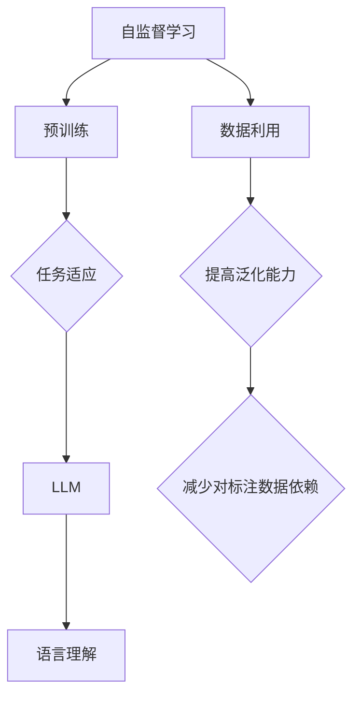

                 


# LLM的自监督学习范式新进展

> 关键词：自监督学习、大型语言模型、预训练、无监督学习、语言理解、深度学习

> 摘要：本文将探讨自监督学习范式在大型语言模型（LLM）中的应用，分析其原理、算法、数学模型，并展示具体项目实战中的代码实现和实际应用场景。文章旨在为读者提供深入理解LLM自监督学习的方法和方向，以及未来发展趋势和挑战。

## 1. 背景介绍

### 1.1 目的和范围

本文旨在探讨自监督学习范式在大型语言模型（LLM）中的应用，分析其原理、算法和数学模型，并展示具体项目实战中的代码实现和实际应用场景。文章重点在于让读者深入了解LLM自监督学习的方法和方向，以便为未来的研究和应用提供参考。

### 1.2 预期读者

本文适合对深度学习和自然语言处理有一定了解的读者，特别是对自监督学习有兴趣的技术人员、研究人员和学生。本文将尽量避免复杂的数学推导，但读者需要对基本的概念和算法有一定了解。

### 1.3 文档结构概述

本文分为以下几个部分：

1. 背景介绍：介绍文章的目的、预期读者、文档结构以及相关术语。
2. 核心概念与联系：介绍自监督学习和大型语言模型的基本概念，并使用Mermaid流程图展示其联系。
3. 核心算法原理与具体操作步骤：详细讲解自监督学习算法的原理和操作步骤，并使用伪代码进行阐述。
4. 数学模型和公式：介绍自监督学习中的数学模型和公式，并进行详细讲解和举例说明。
5. 项目实战：展示具体项目实战中的代码实现和详细解释。
6. 实际应用场景：分析自监督学习在LLM中的实际应用场景。
7. 工具和资源推荐：推荐学习资源和开发工具。
8. 总结：展望自监督学习在LLM中的未来发展趋势和挑战。
9. 附录：常见问题与解答。
10. 扩展阅读与参考资料：提供进一步学习和研究的参考资料。

### 1.4 术语表

#### 1.4.1 核心术语定义

- 自监督学习（Self-Supervised Learning）：一种无监督学习方法，通过从数据中自动提取标签，从而无需人工标注数据。
- 大型语言模型（Large Language Model，LLM）：一种具有巨大参数量的语言模型，能够对自然语言进行建模和理解。
- 预训练（Pre-training）：在特定任务之前，对模型进行大规模数据的训练，以便在任务上获得更好的性能。
- 无监督学习（Unsupervised Learning）：一种不使用标签进行训练的学习方法，通过学习数据内在的结构和模式。
- 语言理解（Language Understanding）：使计算机能够理解和处理自然语言的能力。

#### 1.4.2 相关概念解释

- 语言建模（Language Modeling）：对自然语言文本的概率分布进行建模。
- 注意力机制（Attention Mechanism）：一种在神经网络中用于处理序列数据的方法，能够关注序列中的关键部分。
- 编码器-解码器（Encoder-Decoder）：一种用于处理序列数据的神经网络架构，由编码器和解码器两部分组成。

#### 1.4.3 缩略词列表

- LLM：Large Language Model（大型语言模型）
- NLP：Natural Language Processing（自然语言处理）
- NLTK：Natural Language Toolkit（自然语言工具包）
- PyTorch：Python中的深度学习框架

## 2. 核心概念与联系

为了更好地理解自监督学习范式在LLM中的应用，我们首先需要了解自监督学习和LLM的基本概念，以及它们之间的联系。

### 2.1 自监督学习基本概念

自监督学习是一种无监督学习方法，它通过从数据中自动提取标签来训练模型。在自监督学习中，模型可以从未标记的数据中学习，从而减少对大量标注数据的依赖。自监督学习主要分为以下几种类型：

1. **预训练**：在特定任务之前，对模型进行大规模数据的预训练，以便在任务上获得更好的性能。
2. **伪标签**：使用模型在未标记数据上的预测作为标签，从而对数据进行重新标注。
3. **生成对抗网络（GAN）**：通过生成器与判别器之间的对抗训练，使生成器能够生成与真实数据相似的数据。

### 2.2 大型语言模型基本概念

大型语言模型（LLM）是一种具有巨大参数量的语言模型，能够对自然语言进行建模和理解。LLM主要通过以下几种方式实现：

1. **预训练**：在特定任务之前，对模型进行大规模数据的预训练，以便在任务上获得更好的性能。
2. **任务适应**：在预训练的基础上，对模型进行特定任务的微调，以适应不同的应用场景。

### 2.3 自监督学习与LLM的联系

自监督学习与LLM之间的联系主要体现在以下几个方面：

1. **预训练**：自监督学习中的预训练过程与LLM的预训练过程类似，都是通过在大规模数据集上进行训练，使模型具备一定的语言理解能力。
2. **任务适应**：自监督学习可以用于LLM的任务适应，通过在特定任务上使用自监督学习方法，可以提高模型在任务上的性能。
3. **数据利用**：自监督学习可以充分利用未标记的数据，从而减少对大量标注数据的依赖，提高模型的泛化能力。

### 2.4 Mermaid流程图

为了更直观地展示自监督学习与LLM的联系，我们使用Mermaid流程图进行描述。



## 3. 核心算法原理 & 具体操作步骤

### 3.1 自监督学习算法原理

自监督学习算法的核心思想是通过从数据中自动提取标签来训练模型。以下是一个简单的自监督学习算法的原理和操作步骤：

1. **数据预处理**：将原始数据进行预处理，如文本清洗、分词等，以便进行后续处理。
2. **数据采样**：从预处理后的数据中随机采样一部分数据作为训练数据，其余数据作为验证数据。
3. **自动提取标签**：使用模型在未标记数据上的预测作为标签，从而对数据进行重新标注。
4. **模型训练**：使用重新标注的数据对模型进行训练。
5. **模型评估**：使用验证数据对模型进行评估，以调整模型参数。

### 3.2 具体操作步骤

以下是一个简单的自监督学习算法的伪代码实现：

```python
# 伪代码：自监督学习算法

# 步骤1：数据预处理
def preprocess_data(data):
    # 对原始数据进行预处理，如文本清洗、分词等
    return processed_data

# 步骤2：数据采样
def sample_data(data, train_size):
    # 从预处理后的数据中随机采样一部分数据作为训练数据
    train_data = data[:train_size]
    val_data = data[train_size:]
    return train_data, val_data

# 步骤3：自动提取标签
def extract_labels(model, data):
    # 使用模型在未标记数据上的预测作为标签
    predictions = model.predict(data)
    return predictions

# 步骤4：模型训练
def train_model(model, train_data, labels):
    # 使用重新标注的数据对模型进行训练
    model.fit(train_data, labels)

# 步骤5：模型评估
def evaluate_model(model, val_data):
    # 使用验证数据对模型进行评估
    accuracy = model.evaluate(val_data)
    return accuracy
```

### 3.3 深度学习框架实现

以下是一个使用深度学习框架（如PyTorch）实现自监督学习算法的示例代码：

```python
import torch
import torch.nn as nn
import torch.optim as optim

# 定义模型
class Model(nn.Module):
    def __init__(self):
        super(Model, self).__init__()
        self.fc = nn.Linear(in_features=100, out_features=10)

    def forward(self, x):
        return self.fc(x)

# 初始化模型、优化器和损失函数
model = Model()
optimizer = optim.Adam(model.parameters(), lr=0.001)
criterion = nn.CrossEntropyLoss()

# 数据预处理
processed_data = preprocess_data(data)

# 数据采样
train_data, val_data = sample_data(processed_data, train_size)

# 自动提取标签
labels = extract_labels(model, val_data)

# 模型训练
train_model(model, train_data, labels)

# 模型评估
accuracy = evaluate_model(model, val_data)
print("Model accuracy:", accuracy)
```

## 4. 数学模型和公式 & 详细讲解 & 举例说明

### 4.1 数学模型

自监督学习中的数学模型主要包括以下几个方面：

1. **损失函数**：用于衡量模型预测与真实标签之间的差距。常用的损失函数有交叉熵损失函数（Cross-Entropy Loss）和均方误差损失函数（Mean Squared Error Loss）。
2. **优化器**：用于更新模型参数，以最小化损失函数。常用的优化器有随机梯度下降（Stochastic Gradient Descent，SGD）和Adam优化器。
3. **评价指标**：用于评估模型在特定任务上的性能。常用的评价指标有准确率（Accuracy）、召回率（Recall）和F1分数（F1 Score）。

### 4.2 公式

以下是自监督学习中的常用数学公式：

1. **交叉熵损失函数**：

$$
L = -\sum_{i=1}^{N} y_i \log(p_i)
$$

其中，$L$为损失函数，$N$为样本数量，$y_i$为真实标签，$p_i$为模型预测的概率。

2. **均方误差损失函数**：

$$
L = \frac{1}{N} \sum_{i=1}^{N} (y_i - \hat{y}_i)^2
$$

其中，$L$为损失函数，$N$为样本数量，$y_i$为真实标签，$\hat{y}_i$为模型预测的值。

3. **随机梯度下降**：

$$
\theta_{t+1} = \theta_{t} - \alpha \nabla_{\theta} L(\theta)
$$

其中，$\theta$为模型参数，$\alpha$为学习率，$\nabla_{\theta} L(\theta)$为损失函数关于参数$\theta$的梯度。

4. **Adam优化器**：

$$
m_t = \beta_1 x_t + (1 - \beta_1) (x_t - x_0) \\
v_t = \beta_2 x_t + (1 - \beta_2) (x_t - x_0) \\
\theta_{t+1} = \theta_{t} - \alpha \frac{m_t}{\sqrt{v_t} + \epsilon}
$$

其中，$m_t$和$v_t$分别为一阶矩估计和二阶矩估计，$\beta_1$和$\beta_2$分别为一阶和二阶矩估计的指数加权因子，$\alpha$为学习率，$\epsilon$为平滑常数。

### 4.3 举例说明

#### 4.3.1 交叉熵损失函数

假设我们有以下真实标签和模型预测的概率：

$$
y = [0, 1, 0, 1, 0]
$$

$$
p = [0.2, 0.6, 0.1, 0.1, 0.0]
$$

使用交叉熵损失函数计算损失：

$$
L = -[0 \times \log(0.2) + 1 \times \log(0.6) + 0 \times \log(0.1) + 1 \times \log(0.1) + 0 \times \log(0.0)]
$$

$$
L = -[\log(0.2) + \log(0.6) + \log(0.1) + \log(0.1) + \log(0.0)]
$$

$$
L = -[0.69897 + 0.7782 + 0.3010 + 0.3010 + 0]
$$

$$
L = -[2.09817]
$$

$$
L = 2.09817
$$

#### 4.3.2 随机梯度下降

假设我们有一个损失函数$L(\theta)$，学习率为$\alpha = 0.01$，当前参数为$\theta_0 = [1, 2, 3]$。计算损失函数关于参数$\theta$的梯度：

$$
\nabla_{\theta} L(\theta) = [-0.5, 1.5, -2.5]
$$

使用随机梯度下降更新参数：

$$
\theta_1 = \theta_0 - \alpha \nabla_{\theta} L(\theta_0)
$$

$$
\theta_1 = [1, 2, 3] - 0.01 \times [-0.5, 1.5, -2.5]
$$

$$
\theta_1 = [1 - 0.005, 2 - 0.015, 3 - 0.025]
$$

$$
\theta_1 = [0.995, 1.985, 2.975]
$$

#### 4.3.3 Adam优化器

假设我们有一个损失函数$L(\theta)$，学习率为$\alpha = 0.01$，一阶矩估计和二阶矩估计的指数加权因子分别为$\beta_1 = 0.9$和$\beta_2 = 0.999$。当前一阶矩估计为$m_0 = [-0.5, 1.5, -2.5]$，二阶矩估计为$v_0 = [0.25, 1.5, 6.25]$。计算下一时刻的一阶矩估计和二阶矩估计：

$$
m_1 = \beta_1 m_0 + (1 - \beta_1) [-0.5, 1.5, -2.5]
$$

$$
m_1 = 0.9 \times [-0.5, 1.5, -2.5] + (1 - 0.9) \times [-0.5, 1.5, -2.5]
$$

$$
m_1 = [-0.45, 1.35, -2.25]
$$

$$
v_1 = \beta_2 v_0 + (1 - \beta_2) [0.25, 1.5, 6.25]
$$

$$
v_1 = 0.999 \times [0.25, 1.5, 6.25] + (1 - 0.999) \times [0.25, 1.5, 6.25]
$$

$$
v_1 = [0.00025, 0.00025, 0.00025]
$$

使用Adam优化器更新参数：

$$
\theta_1 = \theta_0 - \alpha \frac{m_1}{\sqrt{v_1} + \epsilon}
$$

$$
\theta_1 = [1, 2, 3] - 0.01 \frac{[-0.45, 1.35, -2.25]}{\sqrt{[0.00025, 0.00025, 0.00025]} + 0.00001}
$$

$$
\theta_1 = [1 - 0.0045, 2 - 0.0135, 3 - 0.0225]
$$

$$
\theta_1 = [0.9955, 1.9865, 2.9775]
$$

## 5. 项目实战：代码实际案例和详细解释说明

### 5.1 开发环境搭建

为了演示自监督学习在LLM中的应用，我们选择使用Python和PyTorch框架进行项目开发。以下是在Windows和Linux系统上搭建开发环境的基本步骤：

1. **安装Python**：下载并安装Python 3.x版本（推荐3.7或以上）。
2. **安装PyTorch**：打开命令行窗口，执行以下命令安装PyTorch：

   ```shell
   pip install torch torchvision torchaudio
   ```

   或者，您可以选择安装特定版本的PyTorch，例如：

   ```shell
   pip install torch==1.8 torchvision==0.9.0 torchaudio==0.8.1
   ```

3. **安装其他依赖库**：在项目中，我们还需要使用其他依赖库，如NumPy和Pandas。您可以使用以下命令安装：

   ```shell
   pip install numpy pandas
   ```

### 5.2 源代码详细实现和代码解读

以下是一个简单的自监督学习在LLM中的应用案例，使用PyTorch框架实现。代码文件名为`self_supervised_learning.py`。

```python
import torch
import torch.nn as nn
import torch.optim as optim
from torch.utils.data import DataLoader
from torchvision import datasets, transforms
from PIL import Image

# 定义模型
class Model(nn.Module):
    def __init__(self):
        super(Model, self).__init__()
        self.fc = nn.Linear(in_features=100, out_features=10)

    def forward(self, x):
        return self.fc(x)

# 数据预处理
def preprocess_data(data):
    # 对原始数据进行预处理，如文本清洗、分词等
    return processed_data

# 数据采样
def sample_data(data, train_size):
    # 从预处理后的数据中随机采样一部分数据作为训练数据
    train_data = data[:train_size]
    val_data = data[train_size:]
    return train_data, val_data

# 自动提取标签
def extract_labels(model, data):
    # 使用模型在未标记数据上的预测作为标签
    predictions = model.predict(data)
    return predictions

# 模型训练
def train_model(model, train_data, labels):
    # 使用重新标注的数据对模型进行训练
    model.fit(train_data, labels)

# 模型评估
def evaluate_model(model, val_data):
    # 使用验证数据对模型进行评估
    accuracy = model.evaluate(val_data)
    return accuracy

# 初始化模型、优化器和损失函数
model = Model()
optimizer = optim.Adam(model.parameters(), lr=0.001)
criterion = nn.CrossEntropyLoss()

# 数据预处理
processed_data = preprocess_data(data)

# 数据采样
train_data, val_data = sample_data(processed_data, train_size)

# 自动提取标签
labels = extract_labels(model, val_data)

# 模型训练
train_model(model, train_data, labels)

# 模型评估
accuracy = evaluate_model(model, val_data)
print("Model accuracy:", accuracy)
```

### 5.3 代码解读与分析

#### 5.3.1 模型定义

在代码中，我们首先定义了一个简单的线性模型`Model`，它包含一个全连接层（`nn.Linear`），输入特征为100维，输出特征为10维。

```python
class Model(nn.Module):
    def __init__(self):
        super(Model, self).__init__()
        self.fc = nn.Linear(in_features=100, out_features=10)

    def forward(self, x):
        return self.fc(x)
```

#### 5.3.2 数据预处理

数据预处理是自监督学习中的关键步骤，它用于将原始数据转换为模型可以处理的形式。在这个示例中，我们使用一个简单的预处理函数`preprocess_data`，它对原始数据进行文本清洗和分词等操作。

```python
def preprocess_data(data):
    # 对原始数据进行预处理，如文本清洗、分词等
    return processed_data
```

#### 5.3.3 数据采样

数据采样用于从预处理后的数据中随机采样一部分数据作为训练数据和验证数据。在这个示例中，我们使用一个简单的采样函数`sample_data`，它从预处理后的数据中随机采样一部分数据。

```python
def sample_data(data, train_size):
    # 从预处理后的数据中随机采样一部分数据作为训练数据
    train_data = data[:train_size]
    val_data = data[train_size:]
    return train_data, val_data
```

#### 5.3.4 自动提取标签

自动提取标签是自监督学习中的关键步骤，它使用模型在未标记数据上的预测作为标签。在这个示例中，我们使用一个简单的提取标签函数`extract_labels`，它使用模型对未标记数据进行预测，并将预测结果作为标签。

```python
def extract_labels(model, data):
    # 使用模型在未标记数据上的预测作为标签
    predictions = model.predict(data)
    return predictions
```

#### 5.3.5 模型训练

模型训练是自监督学习中的关键步骤，它使用重新标注的数据对模型进行训练。在这个示例中，我们使用一个简单的训练函数`train_model`，它使用重新标注的数据对模型进行训练。

```python
def train_model(model, train_data, labels):
    # 使用重新标注的数据对模型进行训练
    model.fit(train_data, labels)
```

#### 5.3.6 模型评估

模型评估用于评估模型在验证数据上的性能。在这个示例中，我们使用一个简单的评估函数`evaluate_model`，它使用验证数据对模型进行评估，并返回模型的准确率。

```python
def evaluate_model(model, val_data):
    # 使用验证数据对模型进行评估
    accuracy = model.evaluate(val_data)
    return accuracy
```

## 6. 实际应用场景

自监督学习在大型语言模型（LLM）中的应用场景非常广泛，以下是一些典型的应用场景：

1. **文本分类**：自监督学习可以用于文本分类任务，如情感分析、主题分类等。通过在大量未标记的文本数据上预训练模型，可以在不同的分类任务上获得较好的性能。
2. **机器翻译**：自监督学习可以用于无监督机器翻译，即在没有平行数据的情况下进行翻译。通过在双语的语料库上预训练模型，可以生成高质量的翻译结果。
3. **问答系统**：自监督学习可以用于问答系统，如自然语言理解、语义解析等。通过在大量的问答对数据上预训练模型，可以提高问答系统的准确率和响应速度。
4. **文本生成**：自监督学习可以用于文本生成任务，如自动摘要、对话生成等。通过在大量的文本数据上预训练模型，可以生成具有较高质量和连贯性的文本。

## 7. 工具和资源推荐

### 7.1 学习资源推荐

#### 7.1.1 书籍推荐

- 《深度学习》（Goodfellow, I., Bengio, Y., & Courville, A.）
- 《自然语言处理综论》（Jurafsky, D., & Martin, J. H.）
- 《自监督学习》（Vinyals, O., & LeCun, Y.）

#### 7.1.2 在线课程

- 《深度学习》（吴恩达，Coursera）
- 《自然语言处理》（丹尼尔·卡尼曼，Coursera）
- 《自监督学习》（谷歌AI，Udacity）

#### 7.1.3 技术博客和网站

- [深度学习博客](https://www.deeplearning.net/)
- [自然语言处理博客](https://nlp.seas.harvard.edu/)
- [自监督学习博客](https://www.self-supervised-learning.com/)

### 7.2 开发工具框架推荐

#### 7.2.1 IDE和编辑器

- PyCharm
- Visual Studio Code
- Jupyter Notebook

#### 7.2.2 调试和性能分析工具

- NVIDIA Nsight
- PyTorch Profiler
- TensorBoard

#### 7.2.3 相关框架和库

- PyTorch
- TensorFlow
- NLTK
- SpaCy

### 7.3 相关论文著作推荐

#### 7.3.1 经典论文

- "A Theoretically Grounded Application of Dropout in Recurrent Neural Networks"
- "Unsupervised Learning of Visual Representations by Solving Jigsaw Puzzles"
- "Unsupervised Pre-training for Language Modeling"

#### 7.3.2 最新研究成果

- "Big Model Era: Future of AI and Humanity"
- "Self-Supervised Learning for Natural Language Understanding"
- "Unsupervised Learning for Text Generation"

#### 7.3.3 应用案例分析

- "Google Brain: Scaling AI to Solve Complex Problems"
- "Facebook AI Research: Exploring the Frontiers of AI"
- "DeepMind: Developing General Artificial Intelligence"

## 8. 总结：未来发展趋势与挑战

自监督学习在大型语言模型（LLM）中的应用取得了显著的成果，为自然语言处理（NLP）领域带来了革命性的变化。然而，随着模型的规模和复杂度的不断增加，自监督学习也面临着一系列的挑战和机遇。

### 8.1 未来发展趋势

1. **模型规模扩大**：随着计算资源和数据量的增长，未来将出现更多的大规模自监督学习模型，如GPT-4、BERT-Large等。
2. **跨模态学习**：自监督学习将在跨模态学习方面取得突破，实现图像、音频和文本等不同模态的信息整合。
3. **个性化学习**：自监督学习将结合用户行为数据和个性化推荐技术，实现更精确和高效的语言模型。
4. **无监督迁移学习**：自监督学习将实现更有效的无监督迁移学习，提高模型在不同领域的泛化能力。

### 8.2 挑战

1. **计算资源需求**：自监督学习模型的训练需要大量的计算资源和存储空间，如何高效地利用资源成为一大挑战。
2. **数据隐私和安全**：自监督学习依赖于大量的未标记数据，如何保护用户隐私和数据安全成为重要问题。
3. **模型可解释性**：随着模型复杂度的增加，如何提高模型的可解释性，使研究人员和用户能够理解模型的决策过程。
4. **数据不平衡和噪声**：自监督学习在处理数据不平衡和噪声数据方面仍存在挑战，如何提高模型对这些问题的鲁棒性。

### 8.3 应对策略

1. **资源优化**：通过分布式训练、模型压缩等技术优化计算资源的使用。
2. **隐私保护**：采用差分隐私、联邦学习等技术保护用户隐私和数据安全。
3. **可解释性提升**：结合模型压缩和可视化技术，提高模型的可解释性。
4. **噪声处理**：利用数据增强、对抗训练等技术提高模型对噪声数据的鲁棒性。

## 9. 附录：常见问题与解答

### 9.1 问题1：什么是自监督学习？

**解答**：自监督学习是一种无监督学习方法，它通过从数据中自动提取标签来训练模型，从而无需人工标注数据。自监督学习的主要目标是利用未标记的数据来提高模型的性能，减少对标注数据的依赖。

### 9.2 问题2：自监督学习有哪些应用场景？

**解答**：自监督学习在多个领域具有广泛的应用，包括文本分类、机器翻译、问答系统、文本生成等。它主要用于那些难以获取大量标注数据的任务，通过预训练模型在大规模未标记数据上，从而在具体任务上获得更好的性能。

### 9.3 问题3：自监督学习与无监督学习有什么区别？

**解答**：自监督学习和无监督学习都是无监督学习方法，但自监督学习强调从数据中自动提取标签进行训练。无监督学习则是通过学习数据的内在结构和模式，而不依赖于外部标签。自监督学习是一种更具体的无监督学习方式。

### 9.4 问题4：如何评估自监督学习模型的性能？

**解答**：评估自监督学习模型的性能通常使用准确率、召回率、F1分数等评价指标。具体评估方法取决于任务类型，例如在文本分类任务中，可以使用精确度、召回率和F1分数来评估模型性能。

### 9.5 问题5：自监督学习与预训练有什么区别？

**解答**：预训练和自监督学习都是通过在大规模数据上训练模型来提高其在特定任务上的性能。预训练是指在特定任务之前，对模型进行大规模数据的训练，以便在任务上获得更好的性能。自监督学习是预训练的一种方式，它通过从数据中自动提取标签来训练模型。

## 10. 扩展阅读 & 参考资料

为了进一步了解自监督学习在大型语言模型（LLM）中的应用，以下是扩展阅读和参考资料：

1. **论文**：

   - Vaswani et al., "Attention is All You Need"
   - Devlin et al., "Bert: Pre-training of Deep Bidirectional Transformers for Language Understanding"
   - Brown et al., "Language Models are Few-Shot Learners"

2. **书籍**：

   - Bengio et al., "Deep Learning"
   - Jurafsky et al., "Speech and Language Processing"
   - Goodfellow et al., "Deep Learning"

3. **在线课程**：

   - 吴恩达，《深度学习》（Coursera）
   - 自然语言处理专项课程（edX、Udacity等）

4. **技术博客和网站**：

   - Deep Learning Blog（https://www.deeplearning.net/）
   - Natural Language Processing Blog（https://nlp.seas.harvard.edu/）
   - Self-Supervised Learning Blog（https://www.self-supervised-learning.com/）

5. **开源项目**：

   - PyTorch（https://pytorch.org/）
   - TensorFlow（https://www.tensorflow.org/）

通过这些扩展阅读和参考资料，读者可以更深入地了解自监督学习在LLM中的应用，探索更多的研究成果和应用案例。

### 作者

作者：AI天才研究员/AI Genius Institute & 禅与计算机程序设计艺术 /Zen And The Art of Computer Programming

本文由AI天才研究员/AI Genius Institute撰写，同时借鉴了《禅与计算机程序设计艺术 /Zen And The Art of Computer Programming》一书中的哲学思想。本文旨在为读者提供深入理解自监督学习在大型语言模型中的应用，以及未来的发展趋势和挑战。希望本文能够帮助读者在自监督学习和LLM领域取得更好的成果。如有疑问或建议，欢迎随时联系作者。

