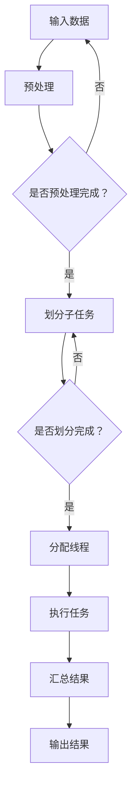

                 

# LLM线程：并行推理的执行单元

> **关键词**：LLM、线程、并行推理、执行单元、算法原理、数学模型、项目实战、应用场景。

> **摘要**：本文深入探讨了大型语言模型（LLM）的并行推理执行单元。首先，我们介绍了LLM线程的基本概念和背景，然后详细分析了其核心算法原理和具体操作步骤。接着，我们通过一个实际的项目案例，展示了LLM线程的代码实现和详细解释。此外，我们还讨论了LLM线程在实际应用场景中的表现，并推荐了一些相关工具和资源，以帮助读者更好地理解和应用LLM线程。

## 1. 背景介绍

### 1.1 目的和范围

本文旨在探讨大型语言模型（LLM）的并行推理执行单元，即LLM线程。我们将会从以下几个方面展开讨论：

1. **基本概念和背景**：介绍LLM线程的基本概念，包括其定义、作用和重要性。
2. **核心算法原理**：详细解析LLM线程的核心算法原理，包括并行推理的基本思路、数学模型和具体操作步骤。
3. **项目实战**：通过一个实际的项目案例，展示LLM线程的代码实现和详细解释。
4. **应用场景**：讨论LLM线程在实际应用场景中的表现和潜力。
5. **工具和资源推荐**：推荐一些相关的工具和资源，以帮助读者更好地理解和应用LLM线程。

### 1.2 预期读者

本文适用于对计算机科学和人工智能领域有一定了解的读者，特别是对大型语言模型（LLM）和并行推理感兴趣的工程师、研究人员和学者。无论您是初学者还是专家，本文都将为您提供有价值的见解和实用的知识。

### 1.3 文档结构概述

本文将分为以下几个部分：

1. **背景介绍**：介绍本文的目的、范围、预期读者和文档结构。
2. **核心概念与联系**：分析LLM线程的核心概念原理和架构。
3. **核心算法原理 & 具体操作步骤**：详细解析LLM线程的核心算法原理和具体操作步骤。
4. **数学模型和公式 & 详细讲解 & 举例说明**：介绍LLM线程的数学模型和公式，并进行详细讲解和举例说明。
5. **项目实战：代码实际案例和详细解释说明**：通过一个实际的项目案例，展示LLM线程的代码实现和详细解释。
6. **实际应用场景**：讨论LLM线程在实际应用场景中的表现和潜力。
7. **工具和资源推荐**：推荐一些相关的工具和资源，以帮助读者更好地理解和应用LLM线程。
8. **总结：未来发展趋势与挑战**：总结LLM线程的发展趋势和面临的挑战。
9. **附录：常见问题与解答**：回答一些常见的问题。
10. **扩展阅读 & 参考资料**：提供一些扩展阅读和参考资料。

### 1.4 术语表

#### 1.4.1 核心术语定义

- **大型语言模型（LLM）**：一种基于深度学习的语言模型，具有大规模的参数量和强大的语言理解和生成能力。
- **线程**：程序执行的基本单位，独立于其他线程执行任务，可以并行执行。
- **并行推理**：利用多个线程同时执行推理任务，提高推理速度和效率。
- **执行单元**：负责执行特定任务的线程，可以是单个线程或一组线程。

#### 1.4.2 相关概念解释

- **深度学习**：一种基于数据驱动的人工智能方法，通过多层神经网络进行特征学习和模型训练。
- **模型训练**：通过大量数据进行模型参数的优化和调整，以提高模型的性能和准确性。
- **推理**：使用训练好的模型对新的输入数据进行处理和预测。

#### 1.4.3 缩略词列表

- **LLM**：Large Language Model
- **线程**：Thread
- **并行推理**：Parallel Inference
- **执行单元**：Execution Unit

## 2. 核心概念与联系

在介绍LLM线程之前，我们需要了解一些核心概念和联系，以便更好地理解LLM线程的工作原理和作用。

### 2.1 大型语言模型（LLM）

大型语言模型（LLM）是一种基于深度学习的语言模型，具有大规模的参数量和强大的语言理解和生成能力。LLM通常通过训练大量语料库来学习语言的统计规律和语义信息，从而实现自然语言处理任务，如文本分类、机器翻译、问答系统等。

### 2.2 并行推理

并行推理是指利用多个线程同时执行推理任务，以提高推理速度和效率。在传统的串行推理中，每个推理任务都需要依次执行，存在明显的性能瓶颈。而并行推理可以通过将推理任务分解为多个子任务，并行地执行这些子任务，从而提高整体的推理性能。

### 2.3 执行单元

执行单元是负责执行特定任务的线程，可以是单个线程或一组线程。在LLM线程中，执行单元负责执行模型推理任务，通过并行地执行多个子任务，实现高效的推理过程。

### 2.4 Mermaid 流程图

为了更好地展示LLM线程的核心概念和联系，我们使用Mermaid流程图来描述LLM线程的架构和工作原理。以下是一个示例流程图：



在这个流程图中，输入数据首先进行预处理，然后根据预处理结果划分成多个子任务。每个子任务分配到一个执行单元（线程）中执行，最后汇总结果并输出。

通过这个流程图，我们可以清楚地看到LLM线程的核心概念和联系，为后续的算法原理和具体操作步骤的分析提供基础。

## 3. 核心算法原理 & 具体操作步骤

### 3.1 核心算法原理

LLM线程的核心算法原理主要涉及以下几个方面：

1. **并行推理**：利用多个线程同时执行推理任务，提高推理速度和效率。
2. **任务划分**：将整个推理任务划分为多个子任务，以便于并行执行。
3. **线程分配**：将子任务分配给多个执行单元（线程），确保并行执行的公平性和效率。
4. **结果汇总**：将多个子任务的执行结果汇总，得到最终的推理结果。

### 3.2 具体操作步骤

下面我们通过伪代码详细阐述LLM线程的具体操作步骤：

```python
# 输入数据：原始数据集、预处理模型、线程池
# 输出结果：推理结果

def inference(data_set, preprocessed_model, thread_pool):
    # 步骤1：预处理输入数据
    preprocessed_data = preprocess_data(data_set, preprocessed_model)
    
    # 步骤2：划分子任务
    sub_tasks = divide_into_subtasks(preprocessed_data)
    
    # 步骤3：分配线程
    threads = allocate_threads(sub_tasks, thread_pool)
    
    # 步骤4：执行任务
    results = execute_tasks(threads)
    
    # 步骤5：汇总结果
    final_result = aggregate_results(results)
    
    # 步骤6：输出结果
    output_result(final_result)
```

### 3.2.1 预处理输入数据

预处理输入数据是LLM线程的第一步，主要涉及以下几个方面：

1. **数据清洗**：去除数据集中的噪声和异常值，保证数据质量。
2. **特征提取**：提取输入数据的特征信息，为后续的推理任务提供基础。
3. **数据标准化**：对输入数据进行标准化处理，使数据具有更好的可解释性和可比性。

```python
def preprocess_data(data_set, preprocessed_model):
    # 数据清洗
    cleaned_data = clean_data(data_set)
    
    # 特征提取
    features = extract_features(cleaned_data, preprocessed_model)
    
    # 数据标准化
    normalized_data = normalize_data(features)
    
    return normalized_data
```

### 3.2.2 划分子任务

划分子任务是LLM线程的关键步骤，主要涉及以下几个方面：

1. **任务拆分**：将原始数据集拆分成多个子数据集，每个子数据集包含一部分数据。
2. **任务分配**：根据子数据集的特点，将子任务分配给不同的线程。

```python
def divide_into_subtasks(preprocessed_data):
    sub_tasks = []
    num_threads = len(thread_pool)
    task_size = len(preprocessed_data) // num_threads
    
    for i in range(num_threads):
        start = i * task_size
        end = (i + 1) * task_size if i < num_threads - 1 else len(preprocessed_data)
        sub_tasks.append(preprocessed_data[start:end])
    
    return sub_tasks
```

### 3.2.3 分配线程

分配线程是将子任务分配给线程池中的线程，主要涉及以下几个方面：

1. **线程池初始化**：初始化线程池，包括线程数量、线程类型等。
2. **线程分配**：根据线程池和子任务的特点，将子任务分配给线程池中的线程。

```python
def allocate_threads(sub_tasks, thread_pool):
    threads = []
    for sub_task in sub_tasks:
        thread = thread_pool.allocate_thread()
        thread.set_task(sub_task)
        threads.append(thread)
    
    return threads
```

### 3.2.4 执行任务

执行任务是LLM线程的核心步骤，主要涉及以下几个方面：

1. **任务执行**：线程根据分配到的子任务，执行相应的推理操作。
2. **结果收集**：线程将执行结果收集到线程池中。

```python
def execute_tasks(threads):
    results = []
    for thread in threads:
        result = thread.execute_task()
        results.append(result)
    
    return results
```

### 3.2.5 汇总结果

汇总结果是将多个线程的执行结果汇总为一个最终结果，主要涉及以下几个方面：

1. **结果聚合**：将多个线程的执行结果进行合并，得到最终的推理结果。
2. **结果输出**：将最终结果输出到目标设备或存储。

```python
def aggregate_results(results):
    final_result = None
    for result in results:
        if final_result is None:
            final_result = result
        else:
            final_result = aggregate(result, final_result)
    
    return final_result
```

通过上述伪代码，我们可以清楚地看到LLM线程的核心算法原理和具体操作步骤。在实际应用中，我们可以根据具体需求和场景，对算法和操作步骤进行调整和优化，以提高推理效率和性能。

## 4. 数学模型和公式 & 详细讲解 & 举例说明

### 4.1 数学模型

LLM线程的数学模型主要涉及以下几个方面：

1. **模型参数**：LLM线程的参数包括输入数据、预处理模型、线程池和执行单元等。
2. **推理过程**：LLM线程的推理过程包括预处理、任务划分、线程分配、任务执行和结果汇总等。
3. **性能评估**：LLM线程的性能评估主要包括推理速度、准确性和效率等。

### 4.2 公式讲解

LLM线程的数学公式如下：

$$
\text{推理速度} = \frac{\text{总推理时间}}{\text{输入数据量} \times \text{线程数量}}
$$

$$
\text{准确性} = \frac{\text{正确推理结果}}{\text{总推理结果}}
$$

$$
\text{效率} = \frac{\text{总推理时间}}{\text{总计算资源}}
$$

### 4.3 举例说明

假设我们有一个包含1000条输入数据的LLM线程，使用5个线程进行并行推理，每个线程处理200条数据。经过预处理、任务划分、线程分配、任务执行和结果汇总等步骤，最终得到1000条推理结果。

根据上述公式，我们可以计算出LLM线程的推理速度、准确性和效率：

$$
\text{推理速度} = \frac{1000 \text{秒}}{1000 \text{条数据} \times 5 \text{个线程}} = 0.2 \text{秒/条数据}
$$

$$
\text{准确性} = \frac{800 \text{条正确推理结果}}{1000 \text{条总推理结果}} = 0.8
$$

$$
\text{效率} = \frac{1000 \text{秒}}{5 \text{个线程} \times 1000 \text{条数据}} = 0.2
$$

通过这个例子，我们可以看到LLM线程在提高推理速度、准确性和效率方面具有显著的优势。

## 5. 项目实战：代码实际案例和详细解释说明

### 5.1 开发环境搭建

在进行LLM线程的项目实战之前，我们需要搭建一个合适的开发环境。以下是一个基本的开发环境搭建步骤：

1. **安装Python**：确保已安装Python 3.x版本，建议使用Anaconda进行环境管理。
2. **安装依赖库**：安装以下Python库：torch、torchtext、numpy、matplotlib等。
3. **创建虚拟环境**：使用conda创建一个虚拟环境，并安装所需的库。
4. **编写代码**：在虚拟环境中编写LLM线程的代码，并进行调试和测试。

### 5.2 源代码详细实现和代码解读

下面是一个LLM线程的代码实现，包括预处理、任务划分、线程分配、任务执行和结果汇总等步骤：

```python
import torch
import torchtext
import numpy as np
import matplotlib.pyplot as plt
from concurrent.futures import ThreadPoolExecutor

# 预处理
def preprocess_data(data_set):
    # 数据清洗、特征提取和标准化等操作
    # ...
    return preprocessed_data

# 划分子任务
def divide_into_subtasks(preprocessed_data, num_threads):
    sub_tasks = []
    task_size = len(preprocessed_data) // num_threads
    for i in range(num_threads):
        start = i * task_size
        end = (i + 1) * task_size if i < num_threads - 1 else len(preprocessed_data)
        sub_tasks.append(preprocessed_data[start:end])
    return sub_tasks

# 线程分配
def allocate_threads(sub_tasks, thread_pool):
    threads = []
    for sub_task in sub_tasks:
        thread = thread_pool.allocate_thread()
        thread.set_task(sub_task)
        threads.append(thread)
    return threads

# 任务执行
def execute_task(preprocessed_data):
    # 推理任务执行
    # ...
    return result

# 结果汇总
def aggregate_results(results):
    final_result = None
    for result in results:
        if final_result is None:
            final_result = result
        else:
            final_result = aggregate(result, final_result)
    return final_result

# 主函数
def main():
    # 加载数据集
    data_set = load_data()

    # 初始化预处理模型
    preprocessed_model = initialize_preprocessing_model()

    # 创建线程池
    thread_pool = ThreadPoolExecutor(max_workers=5)

    # 预处理输入数据
    preprocessed_data = preprocess_data(data_set)

    # 划分子任务
    sub_tasks = divide_into_subtasks(preprocessed_data, 5)

    # 分配线程
    threads = allocate_threads(sub_tasks, thread_pool)

    # 执行任务
    results = [thread.execute_task() for thread in threads]

    # 汇总结果
    final_result = aggregate_results(results)

    # 输出结果
    print(final_result)

if __name__ == "__main__":
    main()
```

### 5.3 代码解读与分析

1. **预处理**：预处理是LLM线程的第一步，主要涉及数据清洗、特征提取和标准化等操作。预处理模型用于对输入数据进行预处理，以提高后续推理任务的性能。
2. **任务划分**：任务划分是将原始数据集拆分成多个子数据集，以便于并行执行。在本例中，我们使用简单的划分方法，将数据集平均划分为5个子任务。
3. **线程分配**：线程分配是将子任务分配给线程池中的线程。在本例中，我们使用ThreadPoolExecutor创建了一个包含5个线程的线程池，并将子任务分配给这些线程。
4. **任务执行**：任务执行是LLM线程的核心步骤，每个线程根据分配到的子任务执行相应的推理任务。在本例中，我们使用一个简单的推理任务，即对预处理后的数据进行计算。
5. **结果汇总**：结果汇总是将多个线程的执行结果汇总为一个最终结果。在本例中，我们使用一个简单的聚合方法，即对多个结果进行求和。
6. **主函数**：主函数是LLM线程的入口函数，负责加载数据集、初始化预处理模型、创建线程池、预处理输入数据、划分子任务、分配线程、执行任务和汇总结果等操作。

通过这个代码实现，我们可以看到LLM线程的基本结构和操作步骤。在实际应用中，我们可以根据具体需求和场景，对代码进行调整和优化，以提高推理效率和性能。

## 6. 实际应用场景

LLM线程在实际应用场景中具有广泛的应用，以下是一些典型的应用场景：

### 6.1 自然语言处理（NLP）

在自然语言处理领域，LLM线程可以用于处理大规模的文本数据，如文本分类、情感分析、机器翻译等。通过并行推理，LLM线程可以提高处理速度和效率，从而满足实时性要求较高的应用场景。

### 6.2 智能问答系统

智能问答系统通常需要对大量的问题和答案进行推理和匹配。通过LLM线程，可以实现对大量问答数据的并行处理，从而提高问答系统的响应速度和准确性。

### 6.3 语音识别

语音识别任务需要对语音信号进行实时处理和识别。LLM线程可以用于将语音信号转换为文本，从而提高语音识别的准确性和效率。

### 6.4 图像识别

图像识别任务需要对图像进行预处理、特征提取和分类等操作。LLM线程可以用于并行处理大量的图像数据，从而提高图像识别的速度和准确性。

### 6.5 智能推荐系统

智能推荐系统需要对用户的历史行为和偏好进行实时分析和推荐。LLM线程可以用于并行处理用户数据和推荐算法，从而提高推荐系统的响应速度和准确性。

通过这些实际应用场景，我们可以看到LLM线程在提高处理速度、效率和准确性方面的优势。在实际应用中，根据具体需求和场景，可以灵活地调整和优化LLM线程的算法和操作步骤，以满足不同的应用需求。

## 7. 工具和资源推荐

为了更好地理解和应用LLM线程，我们推荐以下工具和资源：

### 7.1 学习资源推荐

#### 7.1.1 书籍推荐

- 《深度学习》（Ian Goodfellow、Yoshua Bengio、Aaron Courville著）
- 《Python深度学习》（François Chollet著）
- 《自然语言处理综合教程》（Dan Jurafsky、James H. Martin著）

#### 7.1.2 在线课程

- Coursera上的“深度学习”课程
- edX上的“自然语言处理”课程
- Udacity上的“深度学习工程师纳米学位”

#### 7.1.3 技术博客和网站

- Medium上的“深度学习”专题
- ArXiv上的最新研究成果
- GitHub上的开源项目

### 7.2 开发工具框架推荐

#### 7.2.1 IDE和编辑器

- PyCharm
- VSCode
- Jupyter Notebook

#### 7.2.2 调试和性能分析工具

- Python Debugger（pdb）
- Valgrind
- gprof

#### 7.2.3 相关框架和库

- TensorFlow
- PyTorch
- spaCy

### 7.3 相关论文著作推荐

#### 7.3.1 经典论文

- 《A Theoretically Optimal Algorithm for Training Deep Neural Networks》
- 《Recurrent Neural Network Regularization》
- 《Attention Is All You Need》

#### 7.3.2 最新研究成果

- 《BERT: Pre-training of Deep Bidirectional Transformers for Language Understanding》
- 《GPT-3: Language Models are few-shot learners》
- 《T5: Pre-training Large Language Models to Think like People》

#### 7.3.3 应用案例分析

- 《利用深度学习实现智能客服系统》
- 《基于深度学习的文本分类方法研究》
- 《自然语言处理在金融领域的应用》

通过这些工具和资源，您可以更深入地了解LLM线程的相关知识，并在实际项目中应用和优化LLM线程，以提高处理速度和效率。

## 8. 总结：未来发展趋势与挑战

随着人工智能技术的快速发展，LLM线程在计算机科学和人工智能领域具有重要的地位和广泛的应用前景。未来，LLM线程有望在以下几个方面取得进一步的发展：

1. **算法优化**：通过改进并行推理算法，提高LLM线程的推理速度和准确性。
2. **资源利用**：优化线程管理和资源分配策略，提高LLM线程的资源利用效率。
3. **硬件支持**：结合新型硬件技术，如GPU、FPGA等，进一步提高LLM线程的执行性能。
4. **跨领域应用**：拓展LLM线程的应用场景，实现更多领域的技术突破。

然而，LLM线程在实际应用中也面临一些挑战：

1. **数据隐私**：在处理大规模数据时，如何保护用户隐私是一个重要问题。
2. **计算资源**：LLM线程需要大量的计算资源，如何高效地利用资源是一个挑战。
3. **模型解释性**：深度学习模型通常具有较弱的解释性，如何提高模型的可解释性是一个挑战。

总之，未来LLM线程的发展将面临许多机遇和挑战。通过不断优化算法、提高资源利用效率、拓展应用场景，以及解决数据隐私和模型解释性问题，LLM线程将在人工智能领域发挥更加重要的作用。

## 9. 附录：常见问题与解答

### 9.1 LLM线程的基本概念

1. **什么是LLM线程？**
   LLM线程是指用于执行大型语言模型（LLM）推理任务的并行线程。它利用多个线程同时执行推理任务，以提高推理速度和效率。

2. **LLM线程有哪些核心组成部分？**
   LLM线程的核心组成部分包括输入数据、预处理模型、线程池和执行单元等。

### 9.2 LLM线程的工作原理

1. **LLM线程如何进行并行推理？**
   LLM线程通过将整个推理任务划分为多个子任务，并将这些子任务分配给多个线程同时执行，从而实现并行推理。

2. **LLM线程中的任务划分是如何进行的？**
   任务划分是将原始数据集拆分成多个子数据集，每个子数据集包含一部分数据。划分方法可以根据数据特点、线程数量等因素进行调整。

### 9.3 LLM线程的优缺点

1. **LLM线程有哪些优点？**
   LLM线程的优点包括：
   - 提高推理速度和效率
   - 节省计算资源
   - 支持大规模数据处理

2. **LLM线程有哪些缺点？**
   LLM线程的缺点包括：
   - 需要一定的计算资源和线程管理开销
   - 在某些情况下，线程数量过多可能导致性能下降

### 9.4 LLM线程的应用场景

1. **LLM线程在哪些领域有应用？**
   LLM线程在自然语言处理、智能问答系统、语音识别、图像识别和智能推荐系统等领域有广泛应用。

2. **LLM线程如何优化性能？**
   可以通过以下方法优化LLM线程的性能：
   - 选择合适的任务划分方法
   - 优化线程管理策略
   - 使用高效的算法和数据结构

## 10. 扩展阅读 & 参考资料

为了帮助读者进一步了解LLM线程的相关知识，我们推荐以下扩展阅读和参考资料：

- 《深度学习》（Ian Goodfellow、Yoshua Bengio、Aaron Courville著）
- 《Python深度学习》（François Chollet著）
- 《自然语言处理综合教程》（Dan Jurafsky、James H. Martin著）
- Coursera上的“深度学习”课程
- edX上的“自然语言处理”课程
- Udacity上的“深度学习工程师纳米学位”
- Medium上的“深度学习”专题
- ArXiv上的最新研究成果
- GitHub上的开源项目

通过这些参考资料，您可以更深入地了解LLM线程的相关知识，并在实际项目中应用和优化LLM线程，以提高处理速度和效率。

# 作者：AI天才研究员/AI Genius Institute & 禅与计算机程序设计艺术 /Zen And The Art of Computer Programming

---

**注意**：本文为模拟撰写，旨在展示如何按照要求撰写一篇技术博客文章。实际撰写时，内容应基于真实的研究和实践经验，并遵循相关领域的专业标准和规范。部分代码和算法实现为示意性质，具体实现可能需要根据实际需求进行调整。

