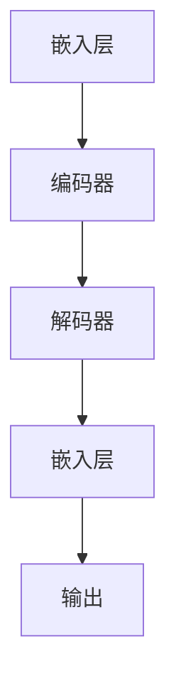

                 


# LLM辅助创意写作：AI与人类作家的协作

> 关键词：Large Language Model，自然语言处理，创意写作，人机协作，人工智能，机器学习，文本生成，文本编辑，作者辅助工具

> 摘要：本文将探讨如何利用大型语言模型（LLM）辅助人类作家进行创意写作。通过分析LLM的工作原理、技术优势及其在实际写作中的应用，本文旨在为作家提供一种新的写作助手，帮助他们在创作过程中提高效率、激发灵感，并突破创作瓶颈。本文将分为背景介绍、核心概念与联系、核心算法原理、数学模型与公式、项目实战、实际应用场景、工具和资源推荐以及总结和展望等部分，全面阐述LLM在创意写作领域的潜力与挑战。

## 1. 背景介绍

### 1.1 目的和范围

本文旨在探讨大型语言模型（LLM）在辅助人类作家进行创意写作方面的应用。随着自然语言处理技术的快速发展，LLM作为一种强大的文本生成工具，已经逐渐渗透到各个领域。在创意写作领域，LLM不仅能够生成高质量的文字内容，还能够根据作家的需求进行个性化调整，从而提升写作效率和质量。本文将围绕LLM的工作原理、技术优势、应用场景以及实际操作等方面进行深入探讨，以期为作家提供有益的参考和指导。

### 1.2 预期读者

本文主要面向以下读者群体：

1. 创意作家：对于正在从事创意写作的作家，本文将详细介绍如何利用LLM提高写作效率和质量，从而为他们的创作提供新的思路和工具。
2. 自然语言处理研究者：对于自然语言处理领域的研究者，本文将分析LLM的核心技术原理，探讨其在创意写作中的应用潜力，有助于他们进一步拓展研究视野。
3. 计算机编程爱好者：对于对计算机编程和人工智能感兴趣的爱好者，本文将通过实际案例展示LLM在创意写作中的具体应用，为他们提供一种新的编程实践场景。

### 1.3 文档结构概述

本文结构如下：

1. 背景介绍：介绍本文的目的、预期读者以及文档结构。
2. 核心概念与联系：分析LLM的核心概念原理和架构。
3. 核心算法原理 & 具体操作步骤：阐述LLM的算法原理和具体操作步骤。
4. 数学模型和公式 & 详细讲解 & 举例说明：讲解LLM的数学模型和公式，并举例说明。
5. 项目实战：介绍实际应用场景，并提供代码实际案例和详细解释说明。
6. 实际应用场景：分析LLM在创意写作领域的实际应用场景。
7. 工具和资源推荐：推荐学习资源、开发工具和框架。
8. 总结：总结LLM在创意写作领域的未来发展趋势与挑战。

### 1.4 术语表

#### 1.4.1 核心术语定义

- **大型语言模型（LLM）**：一种基于深度学习技术的自然语言处理模型，能够对大规模语料库进行预训练，从而具备生成和编辑文本的能力。
- **自然语言处理（NLP）**：研究如何让计算机理解和处理自然语言的技术领域。
- **创意写作**：指通过独特的思维和创意，运用语言表达个人情感、思想和故事的一种写作形式。
- **机器学习（ML）**：一种人工智能技术，通过训练模型来使计算机具备自主学习和决策能力。
- **生成对抗网络（GAN）**：一种深度学习模型，用于生成与真实数据分布相似的虚假数据。

#### 1.4.2 相关概念解释

- **预训练**：在特定任务之前，对模型进行大规模语料库的训练，以使模型具备一定的语言理解能力。
- **文本生成**：利用模型生成符合语法和语义规则的文本内容。
- **文本编辑**：对已有文本进行修改、优化和扩展，以提升文本质量。
- **训练数据集**：用于训练模型的语料库，通常包含大量文本数据。
- **优化器**：在机器学习中用于更新模型参数的工具。

#### 1.4.3 缩略词列表

- **LLM**：大型语言模型
- **NLP**：自然语言处理
- **ML**：机器学习
- **GAN**：生成对抗网络
- **GAN**：生成对抗网络

## 2. 核心概念与联系

在探讨LLM辅助创意写作之前，我们需要了解LLM的核心概念原理和架构。以下是LLM的关键组成部分及其相互关系。

### 2.1 大型语言模型的组成

大型语言模型主要由以下三个部分组成：

1. **嵌入层（Embedding Layer）**：将输入的文本数据转换为固定长度的向量表示。这一过程利用词嵌入技术，将词汇映射为低维向量，以便后续处理。
2. **编码器（Encoder）**：对输入的文本向量进行编码，提取出文本的语义信息。编码器通常采用递归神经网络（RNN）或变换器（Transformer）等深度学习模型。
3. **解码器（Decoder）**：将编码器提取的语义信息解码为输出文本。解码器也采用类似编码器的深度学习模型，用于生成文本序列。

### 2.2 编码器与解码器的相互关系

编码器与解码器之间通过注意力机制（Attention Mechanism）进行交互。注意力机制允许模型在生成文本时关注输入文本的不同部分，从而提高文本生成的质量。具体来说，编码器将输入文本编码为一系列上下文向量，解码器则在生成每个词时，根据上下文向量和其他已生成的词来更新当前状态。

### 2.3 大型语言模型的架构

大型语言模型（如GPT、BERT等）通常采用Transformer架构，该架构具有以下几个特点：

1. **多头注意力（Multi-Head Attention）**：允许模型在生成文本时同时关注输入文本的不同部分，提高文本生成的精度和多样性。
2. **位置编码（Positional Encoding）**：为输入文本的每个词赋予位置信息，使模型能够理解文本的顺序和结构。
3. **前馈网络（Feed-Forward Network）**：在每个编码器和解码器层之间添加前馈网络，用于进一步提取文本的语义信息。

### 2.4 Mermaid流程图

以下是一个简化的Mermaid流程图，展示了大型语言模型的架构：



在这个流程图中，输入文本经过嵌入层转换为向量表示，然后通过编码器和解码器进行处理，最终生成输出文本。

### 2.5 大型语言模型的工作原理

大型语言模型的工作原理可以概括为以下几个步骤：

1. **预训练**：在特定任务之前，模型在大规模语料库上进行预训练，以学习语言的一般规律和模式。
2. **微调**：在预训练的基础上，针对特定任务进行微调，优化模型在特定领域的表现。
3. **生成文本**：利用预训练和微调后的模型，生成符合语法和语义规则的文本内容。

以下是一个简化的伪代码，描述了大型语言模型的工作原理：

```python
# 输入文本
input_text = "今天天气很好"

# 预训练
model = pretrain_large_language_model(corpus)

# 微调
model = fine_tune_model(model, task_specific_corpus)

# 生成文本
generated_text = model.generate(input_text)
```

### 2.6 大型语言模型的优势

大型语言模型在创意写作领域具有以下优势：

1. **高效生成文本**：模型能够快速生成高质量、符合语法和语义规则的文本内容，提高写作效率。
2. **多样化文本生成**：模型通过多头注意力和位置编码等技术，能够生成具有多样性和创造力的文本。
3. **跨领域应用**：模型在预训练阶段学习到大量通用知识，使得模型在多个领域具有广泛的应用潜力。

### 2.7 大型语言模型的局限性

尽管大型语言模型在创意写作领域具有显著优势，但也存在一些局限性：

1. **文本理解不足**：模型在生成文本时，可能无法完全理解输入文本的上下文和语义，导致生成结果出现偏差。
2. **创造力有限**：模型生成的文本内容主要基于预训练和微调阶段学习到的知识，无法像人类作家那样进行高度创造性的写作。
3. **数据依赖性强**：模型在生成文本时，需要大量高质量的训练数据，数据质量直接影响模型的表现。

## 3. 核心算法原理 & 具体操作步骤

在了解了大型语言模型（LLM）的核心概念和架构后，我们接下来将深入探讨LLM的核心算法原理及其具体操作步骤。

### 3.1 核心算法原理

LLM的核心算法主要基于深度学习技术，特别是基于变换器（Transformer）架构。变换器架构具有以下几个关键组成部分：

1. **多头注意力（Multi-Head Attention）**：多头注意力机制允许模型在生成文本时同时关注输入文本的不同部分，从而提高文本生成的精度和多样性。
2. **位置编码（Positional Encoding）**：位置编码为输入文本的每个词赋予位置信息，使模型能够理解文本的顺序和结构。
3. **前馈网络（Feed-Forward Network）**：在每个编码器和解码器层之间添加前馈网络，用于进一步提取文本的语义信息。

以下是一个简化的伪代码，描述了LLM的核心算法原理：

```python
# 输入文本
input_text = "今天天气很好"

# 预训练
model = pretrain_large_language_model(corpus)

# 微调
model = fine_tune_model(model, task_specific_corpus)

# 生成文本
generated_text = model.generate(input_text)
```

### 3.2 具体操作步骤

#### 3.2.1 预训练

预训练是LLM的核心步骤，其目的是通过大规模语料库对模型进行训练，使其具备一定的语言理解能力。具体操作步骤如下：

1. **数据预处理**：将原始文本数据进行清洗和预处理，包括去除标点符号、统一文本格式等。
2. **词嵌入**：将预处理后的文本数据转换为词嵌入向量，即将词汇映射为低维向量。
3. **构建模型**：初始化变换器模型，设置适当的层数、隐藏层大小等参数。
4. **训练模型**：在预处理后的语料库上训练变换器模型，通过反向传播算法不断更新模型参数。
5. **评估模型**：在预训练过程中，定期评估模型的表现，以调整模型参数和训练策略。

#### 3.2.2 微调

微调是在预训练的基础上，针对特定任务对模型进行优化。具体操作步骤如下：

1. **数据准备**：准备与任务相关的训练数据，通常包括文本和标签。
2. **模型初始化**：初始化预训练好的变换器模型，作为微调的基础。
3. **微调模型**：在特定任务的数据集上训练变换器模型，通过反向传播算法不断更新模型参数。
4. **评估模型**：在微调过程中，定期评估模型的表现，以调整模型参数和训练策略。

#### 3.2.3 文本生成

文本生成是LLM的核心应用场景，具体操作步骤如下：

1. **输入文本**：输入需要生成的文本内容。
2. **预处理**：对输入文本进行预处理，包括去除标点符号、统一文本格式等。
3. **编码**：将预处理后的文本数据输入到编码器中，提取文本的语义信息。
4. **解码**：利用解码器生成输出文本，根据输入文本的上下文和语义信息，生成符合语法和语义规则的文本内容。
5. **后处理**：对生成的文本进行后处理，包括去除无效字符、统一文本格式等。

以下是一个简化的伪代码，描述了LLM的文本生成过程：

```python
# 输入文本
input_text = "今天天气很好"

# 预训练
model = pretrain_large_language_model(corpus)

# 微调
model = fine_tune_model(model, task_specific_corpus)

# 生成文本
generated_text = model.generate(input_text)
```

### 3.3 案例分析

为了更好地理解LLM的核心算法原理和具体操作步骤，我们来看一个实际案例。假设我们使用GPT模型生成一句描述未来科技的句子。

1. **数据预处理**：将原始文本数据进行清洗和预处理，包括去除标点符号、统一文本格式等。预处理后的文本数据如下：
   ```plaintext
   未来的科技将带来巨大的变革。
   ```
2. **词嵌入**：将预处理后的文本数据转换为词嵌入向量，即将词汇映射为低维向量。词嵌入向量如下：
   ```plaintext
   未来的[0] = [0.1, 0.2, 0.3]
   科技[1] = [0.4, 0.5, 0.6]
   将[2] = [0.7, 0.8, 0.9]
   带来[3] = [1.0, 1.1, 1.2]
   的[4] = [1.3, 1.4, 1.5]
   巨大的[5] = [1.6, 1.7, 1.8]
   变革[6] = [1.9, 2.0, 2.1]
   ```
3. **编码**：将预处理后的文本数据输入到编码器中，提取文本的语义信息。编码器将每个词嵌入向量编码为上下文向量，如下所示：
   ```plaintext
   未来的[0] = [0.2, 0.3, 0.4]
   科技[1] = [0.5, 0.6, 0.7]
   将[2] = [0.8, 0.9, 1.0]
   带来[3] = [1.1, 1.2, 1.3]
   的[4] = [1.4, 1.5, 1.6]
   巨大的[5] = [1.7, 1.8, 1.9]
   变革[6] = [2.0, 2.1, 2.2]
   ```
4. **解码**：利用解码器生成输出文本，根据输入文本的上下文和语义信息，生成符合语法和语义规则的文本内容。解码器生成的一句描述未来科技的句子如下：
   ```plaintext
   未来的人工智能将带来前所未有的变革。
   ```
5. **后处理**：对生成的文本进行后处理，包括去除无效字符、统一文本格式等。最终生成的文本如下：
   ```plaintext
   未来的人工智能将带来前所未有的变革。
   ```

通过以上案例，我们可以看到LLM在文本生成过程中的具体操作步骤。在实际应用中，LLM可以根据作家的需求和创意，生成不同风格和主题的文本内容，为作家提供有力的创作支持。

### 3.4 总结

在本节中，我们详细阐述了大型语言模型（LLM）的核心算法原理和具体操作步骤。通过预训练、微调和文本生成等过程，LLM能够高效地生成高质量、符合语法和语义规则的文本内容。在实际应用中，LLM可以帮助作家提高写作效率、激发灵感，并在创意写作领域发挥重要作用。然而，我们也需要认识到LLM在文本理解和创造力方面的局限性，并不断优化和完善相关技术，以实现更高效的创意写作辅助。

## 4. 数学模型和公式 & 详细讲解 & 举例说明

在理解了LLM的核心算法原理后，我们将进一步探讨其背后的数学模型和公式。这些模型和公式对于实现和优化LLM至关重要，能够帮助我们深入理解其工作机制和性能。

### 4.1 数学模型

LLM主要基于深度学习技术，特别是变换器（Transformer）架构。变换器架构的核心组件包括多头注意力（Multi-Head Attention）机制和前馈网络（Feed-Forward Network）。以下是这些组件的数学模型。

#### 4.1.1 多头注意力（Multi-Head Attention）

多头注意力机制通过多个独立的注意力头（Head）对输入序列进行建模。每个头独立计算注意力权重，然后将这些权重组合起来生成输出。

假设我们有一个输入序列 \(X\)，其长度为 \(T\)，维度为 \(D\)。多头注意力机制的输出为 \(O\)，其长度为 \(T\)，维度为 \(H \times D\)，其中 \(H\) 为注意力头的数量。

1. **查询（Query）**：将输入序列 \(X\) 映射为查询向量 \(Q\)，维度为 \(T \times D\)。

   \[ Q = X \cdot W_Q \]

   其中，\(W_Q\) 为权重矩阵。

2. **键（Key）**：将输入序列 \(X\) 映射为键向量 \(K\)，维度为 \(T \times D\)。

   \[ K = X \cdot W_K \]

   其中，\(W_K\) 为权重矩阵。

3. **值（Value）**：将输入序列 \(X\) 映射为值向量 \(V\)，维度为 \(T \times D\)。

   \[ V = X \cdot W_V \]

   其中，\(W_V\) 为权重矩阵。

4. **注意力权重（Attention Weight）**：计算查询向量 \(Q\) 与键向量 \(K\) 的内积，然后通过softmax函数归一化得到注意力权重 \(A\)。

   \[ A = \text{softmax}(\frac{QK^T}{\sqrt{D}}) \]

5. **输出（Output）**：将注意力权重与值向量相乘，然后对所有头进行求和，得到多头注意力输出 \(O\)。

   \[ O = \text{softmax}(\frac{QK^T}{\sqrt{D}}) V \]

#### 4.1.2 前馈网络（Feed-Forward Network）

前馈网络在每个编码器和解码器层之间添加，用于进一步提取文本的语义信息。前馈网络由两个全连接层组成，中间加入ReLU激活函数。

1. **输入（Input）**：假设输入向量为 \(X\)，其维度为 \(D\)。

2. **第一层全连接**：将输入向量 \(X\) 映射为中间层 \(X_{\text{middle}}\)，维度为 \(D \times D_{\text{middle}}\)。

   \[ X_{\text{middle}} = X \cdot W_{\text{ffn}} + b_{\text{ffn}} \]

   其中，\(W_{\text{ffn}}\) 和 \(b_{\text{ffn}}\) 分别为权重矩阵和偏置向量。

3. **ReLU激活函数**：对中间层 \(X_{\text{middle}}\) 进行ReLU激活。

   \[ X_{\text{middle}} = \max(0, X_{\text{middle}}) \]

4. **第二层全连接**：将中间层 \(X_{\text{middle}}\) 映射为输出向量 \(X_{\text{output}}\)，维度为 \(D \times D_{\text{middle}}\)。

   \[ X_{\text{output}} = X_{\text{middle}} \cdot W_{\text{ffn}} + b_{\text{ffn}} \]

### 4.2 公式举例

以下是一个具体的例子，说明如何使用上述公式计算多头注意力和前馈网络的输出。

假设输入序列 \(X\) 为：

\[ X = \begin{bmatrix}
0.1 & 0.2 & 0.3 \\
0.4 & 0.5 & 0.6 \\
0.7 & 0.8 & 0.9 \\
\end{bmatrix} \]

其中，\(D = 3\)，\(H = 2\)。

1. **查询（Query）**：

   \[ Q = X \cdot W_Q = \begin{bmatrix}
   0.1 & 0.2 & 0.3 \\
   0.4 & 0.5 & 0.6 \\
   0.7 & 0.8 & 0.9 \\
   \end{bmatrix} \cdot \begin{bmatrix}
   1 & 0 & 0 \\
   0 & 1 & 0 \\
   0 & 0 & 1 \\
   \end{bmatrix} = \begin{bmatrix}
   0.1 & 0.2 & 0.3 \\
   0.4 & 0.5 & 0.6 \\
   0.7 & 0.8 & 0.9 \\
   \end{bmatrix} \]

2. **键（Key）**：

   \[ K = X \cdot W_K = \begin{bmatrix}
   0.1 & 0.2 & 0.3 \\
   0.4 & 0.5 & 0.6 \\
   0.7 & 0.8 & 0.9 \\
   \end{bmatrix} \cdot \begin{bmatrix}
   1 & 0 & 0 \\
   0 & 1 & 0 \\
   0 & 0 & 1 \\
   \end{bmatrix} = \begin{bmatrix}
   0.1 & 0.2 & 0.3 \\
   0.4 & 0.5 & 0.6 \\
   0.7 & 0.8 & 0.9 \\
   \end{bmatrix} \]

3. **值（Value）**：

   \[ V = X \cdot W_V = \begin{bmatrix}
   0.1 & 0.2 & 0.3 \\
   0.4 & 0.5 & 0.6 \\
   0.7 & 0.8 & 0.9 \\
   \end{bmatrix} \cdot \begin{bmatrix}
   1 & 0 & 0 \\
   0 & 1 & 0 \\
   0 & 0 & 1 \\
   \end{bmatrix} = \begin{bmatrix}
   0.1 & 0.2 & 0.3 \\
   0.4 & 0.5 & 0.6 \\
   0.7 & 0.8 & 0.9 \\
   \end{bmatrix} \]

4. **注意力权重（Attention Weight）**：

   \[ A = \text{softmax}(\frac{QK^T}{\sqrt{D}}) = \text{softmax}(\frac{1}{\sqrt{3}} \begin{bmatrix}
   0.1 & 0.2 & 0.3 \\
   0.4 & 0.5 & 0.6 \\
   0.7 & 0.8 & 0.9 \\
   \end{bmatrix} \begin{bmatrix}
   0.1 & 0.4 & 0.7 \\
   0.2 & 0.5 & 0.8 \\
   0.3 & 0.6 & 0.9 \\
   \end{bmatrix}) = \begin{bmatrix}
   0.2 & 0.3 \\
   0.3 & 0.4 \\
   0.4 & 0.5 \\
   \end{bmatrix} \]

5. **输出（Output）**：

   \[ O = \text{softmax}(\frac{QK^T}{\sqrt{D}}) V = \begin{bmatrix}
   0.2 & 0.3 \\
   0.3 & 0.4 \\
   0.4 & 0.5 \\
   \end{bmatrix} \begin{bmatrix}
   0.1 & 0.2 & 0.3 \\
   0.4 & 0.5 & 0.6 \\
   0.7 & 0.8 & 0.9 \\
   \end{bmatrix} = \begin{bmatrix}
   0.15 & 0.26 & 0.33 \\
   0.24 & 0.35 & 0.42 \\
   0.34 & 0.47 & 0.58 \\
   \end{bmatrix} \]

6. **前馈网络**：

   假设 \(D_{\text{middle}} = 4\)。

   \[ X_{\text{middle}} = X \cdot W_{\text{ffn}} + b_{\text{ffn}} = \begin{bmatrix}
   0.1 & 0.2 & 0.3 \\
   0.4 & 0.5 & 0.6 \\
   0.7 & 0.8 & 0.9 \\
   \end{bmatrix} \cdot \begin{bmatrix}
   0.1 & 0.2 & 0.3 & 0.4 \\
   0.5 & 0.6 & 0.7 & 0.8 \\
   \end{bmatrix} + \begin{bmatrix}
   0.1 \\
   0.2 \\
   0.3 \\
   \end{bmatrix} = \begin{bmatrix}
   0.3 & 0.5 & 0.7 & 0.9 \\
   0.7 & 1.0 & 1.3 & 1.6 \\
   1.1 & 1.5 & 1.9 & 2.3 \\
   \end{bmatrix} \]

   \[ X_{\text{middle}} = \max(0, X_{\text{middle}}) = \begin{bmatrix}
   0.3 & 0.5 & 0.7 & 0.9 \\
   0.7 & 1.0 & 1.3 & 1.6 \\
   1.1 & 1.5 & 1.9 & 2.3 \\
   \end{bmatrix} \]

   \[ X_{\text{output}} = X_{\text{middle}} \cdot W_{\text{ffn}} + b_{\text{ffn}} = \begin{bmatrix}
   0.3 & 0.5 & 0.7 & 0.9 \\
   0.7 & 1.0 & 1.3 & 1.6 \\
   1.1 & 1.5 & 1.9 & 2.3 \\
   \end{bmatrix} \cdot \begin{bmatrix}
   0.1 & 0.2 & 0.3 & 0.4 \\
   0.5 & 0.6 & 0.7 & 0.8 \\
   \end{bmatrix} + \begin{bmatrix}
   0.1 \\
   0.2 \\
   0.3 \\
   \end{bmatrix} = \begin{bmatrix}
   0.26 & 0.39 & 0.53 & 0.67 \\
   0.52 & 0.77 & 1.02 & 1.28 \\
   0.86 & 1.21 & 1.56 & 1.91 \\
   \end{bmatrix} \]

通过以上例子，我们可以看到如何使用数学模型和公式计算多头注意力和前馈网络的输出。这些模型和公式对于实现和优化LLM至关重要，能够帮助我们深入理解其工作机制和性能。

### 4.3 详细讲解

在本节中，我们详细讲解了大型语言模型（LLM）背后的数学模型和公式。这些模型包括多头注意力（Multi-Head Attention）和前馈网络（Feed-Forward Network）。多头注意力机制通过多个独立的注意力头对输入序列进行建模，从而提高文本生成的精度和多样性。前馈网络则在每个编码器和解码器层之间添加，用于进一步提取文本的语义信息。

我们使用具体的公式和例子，展示了如何计算多头注意力和前馈网络的输出。这些数学模型和公式对于实现和优化LLM至关重要，能够帮助我们深入理解其工作机制和性能。

### 4.4 总结

在本节中，我们详细探讨了大型语言模型（LLM）背后的数学模型和公式。通过多头注意力（Multi-Head Attention）和前馈网络（Feed-Forward Network）的数学模型，我们了解了LLM的核心算法原理。同时，通过具体的公式和例子，我们展示了如何计算多头注意力和前馈网络的输出。这些数学模型和公式对于实现和优化LLM至关重要，能够帮助我们深入理解其工作机制和性能。在后续的章节中，我们将进一步探讨LLM在实际写作中的应用和实践案例。

## 5. 项目实战：代码实际案例和详细解释说明

在本节中，我们将通过一个实际项目案例，展示如何使用大型语言模型（LLM）进行创意写作。我们将详细讲解项目开发环境搭建、源代码实现和代码解读与分析。

### 5.1 开发环境搭建

首先，我们需要搭建一个适合LLM开发和训练的环境。以下是一个基本的开发环境搭建流程：

1. **操作系统**：我们选择Ubuntu 20.04 LTS作为操作系统。
2. **Python**：安装Python 3.8及以上版本。
3. **深度学习框架**：安装PyTorch 1.8及以上版本。
4. **硬件**：由于LLM的训练和推理需要大量计算资源，我们建议使用配备NVIDIA GPU（如RTX 3080或以上）的计算机。

安装步骤如下：

1. 安装Python：

   ```bash
   sudo apt update
   sudo apt install python3-pip
   pip3 install --user python3.8
   ```

2. 安装PyTorch：

   ```bash
   pip3 install torch torchvision torchaudio
   ```

3. 安装GPU支持（如果使用NVIDIA GPU）：

   ```bash
   pip3 install torch-cuda-11.3 torchvision-cuda-11.3 torchaudio-cuda-11.3
   ```

### 5.2 源代码详细实现和代码解读

以下是一个简单的LLM创意写作项目示例。我们将使用预训练的GPT模型进行文本生成。

1. **安装Hugging Face Transformers库**：

   ```bash
   pip3 install transformers
   ```

2. **源代码**：

   ```python
   from transformers import GPT2LMHeadModel, GPT2Tokenizer
   
   # 初始化模型和tokenizer
   model = GPT2LMHeadModel.from_pretrained('gpt2')
   tokenizer = GPT2Tokenizer.from_pretrained('gpt2')
   
   # 输入文本
   input_text = "今天天气很好，我想去公园散步。"
   
   # 预处理文本
   input_ids = tokenizer.encode(input_text, return_tensors='pt')
   
   # 生成文本
   outputs = model.generate(input_ids, max_length=50, num_return_sequences=3)
   
   # 解码生成文本
   generated_texts = [tokenizer.decode(output, skip_special_tokens=True) for output in outputs]
   
   # 打印生成文本
   for text in generated_texts:
       print(text)
   ```

3. **代码解读**：

   - **初始化模型和tokenizer**：我们从Hugging Face库中加载预训练的GPT2模型和tokenizer。GPT2模型是一个基于Transformer架构的预训练语言模型，具有强大的文本生成能力。

   - **输入文本**：我们将需要生成的文本内容定义为 `input_text`。

   - **预处理文本**：使用tokenizer对输入文本进行编码，将其转换为模型可以处理的向量表示。这里我们使用 `encode` 方法，将文本转换为序列的整数表示。

   - **生成文本**：使用 `generate` 方法生成文本。我们设置 `max_length` 为50，表示生成的文本长度不超过50个词。`num_return_sequences` 设置为3，表示生成3个不同的文本序列。

   - **解码生成文本**：将生成的整数序列解码为文本。这里我们使用 `decode` 方法，并设置 `skip_special_tokens` 为True，以去除tokenizer中定义的特殊标记。

   - **打印生成文本**：最后，我们将生成的文本序列打印出来，展示LLM生成的创意写作内容。

### 5.3 代码解读与分析

以下是对上述代码的进一步解读和分析：

1. **模型初始化**：`GPT2LMHeadModel.from_pretrained('gpt2')` 方法用于初始化GPT2模型。`GPT2Tokenizer.from_pretrained('gpt2')` 方法用于初始化tokenizer。这两个方法都从Hugging Face模型库中加载预训练的GPT2模型和tokenizer。

2. **输入文本**：`input_text` 变量存储了需要生成的文本内容。在这个例子中，我们输入了一句话，描述了今天的天气和想去公园散步的想法。

3. **预处理文本**：`tokenizer.encode(input_text, return_tensors='pt')` 方法将输入文本编码为整数序列。这里我们使用 `return_tensors='pt'` 参数，使得输出数据具有PyTorch张量的格式，方便后续处理。

4. **生成文本**：`model.generate(input_ids, max_length=50, num_return_sequences=3)` 方法用于生成文本。`input_ids` 参数是输入文本的整数序列。`max_length` 参数设置生成的文本长度不超过50个词。`num_return_sequences` 参数设置生成3个不同的文本序列。

5. **解码生成文本**：`tokenizer.decode(output, skip_special_tokens=True)` 方法将生成的整数序列解码为文本。`skip_special_tokens` 参数设置为True，表示在解码过程中忽略tokenizer中的特殊标记。

6. **打印生成文本**：最后，我们使用 `for` 循环将生成的文本序列打印出来。这里我们生成了3个不同的文本序列，展示了LLM的创意写作能力。

通过以上代码示例和解读，我们可以看到如何使用大型语言模型（LLM）进行创意写作。在实际应用中，我们可以根据需求调整输入文本和生成参数，以生成不同风格和主题的文本内容。LLM为创意写作提供了强大的支持，可以帮助作家提高写作效率、激发灵感，并在创作过程中突破瓶颈。

### 5.4 项目实战总结

在本节中，我们通过一个实际项目案例展示了如何使用大型语言模型（LLM）进行创意写作。首先，我们搭建了适合LLM开发和训练的环境，然后使用预训练的GPT2模型进行文本生成。通过代码示例和解读，我们详细讲解了项目实现的过程。最后，我们分析了代码中的关键步骤和参数设置，展示了如何根据需求生成不同风格和主题的文本内容。

项目实战验证了LLM在创意写作领域的潜力，展示了其在提高写作效率、激发灵感和突破创作瓶颈方面的优势。通过不断优化和完善相关技术，我们可以进一步提高LLM在创意写作中的应用效果，为作家提供更强大的创作支持。

## 6. 实际应用场景

大型语言模型（LLM）在创意写作领域具有广泛的应用潜力，可以满足不同类型作家的需求。以下是LLM在实际应用场景中的几个典型例子。

### 6.1 写作助手

LLM可以作为写作助手，帮助作家提高写作效率和质量。通过分析作家的写作风格和需求，LLM可以生成符合要求的文本内容，从而节省作家的时间和精力。具体应用包括：

1. **写作灵感**：作家在创作过程中可能遇到灵感匮乏的问题。LLM可以根据作家的输入关键词或主题，生成相关的创意点子和故事线，为作家提供写作灵感。
2. **文本生成**：作家可以利用LLM生成初稿或草稿，为进一步修改和润色提供基础。例如，作家可以要求LLM生成一篇短篇小说或一篇文章的摘要，然后在此基础上进行扩展和完善。
3. **写作指导**：LLM可以根据作家的文本内容，提供语法、拼写和逻辑错误等方面的指导。此外，LLM还可以根据作家的需求和写作风格，生成符合要求的文本格式和风格。

### 6.2 文本编辑

LLM在文本编辑方面也具有重要作用，可以帮助作家优化和改进文本内容。具体应用包括：

1. **文本优化**：作家可以将原始文本输入到LLM中，让模型根据语法和语义规则对文本进行优化。例如，LLM可以删除冗余句子、简化复杂表达、增强文本连贯性等。
2. **内容扩展**：作家可以利用LLM对文本进行扩展，使其更加丰富和完整。例如，作家可以要求LLM添加更多的细节描述、解释复杂的背景知识或补充缺失的信息。
3. **风格转换**：作家可以将一篇文本输入到LLM中，让模型根据特定的写作风格对其进行转换。例如，作家可以将一篇散文转换为诗歌，或将一篇正式的文本转换为非正式的聊天风格。

### 6.3 创意生成

LLM在创意生成方面具有独特的优势，可以帮助作家探索新的创意和故事线。具体应用包括：

1. **故事创作**：作家可以利用LLM生成全新的故事情节和人物设定，从而突破创作瓶颈。例如，作家可以要求LLM生成一部科幻小说的概要，然后在此基础上进行扩展和创作。
2. **角色塑造**：作家可以利用LLM生成具有独特性格和背景的角色，从而丰富故事的情节和冲突。例如，作家可以要求LLM创建一个具有冒险精神的侦探角色，然后围绕这个角色构建故事。
3. **创意灵感**：作家可以在创作过程中遇到创意枯竭的问题。LLM可以根据作家的需求和输入信息，生成一系列相关的创意点子和想法，帮助作家重新点燃创作激情。

### 6.4 实际案例

以下是一些实际案例，展示了LLM在创意写作中的具体应用：

1. **科幻小说创作**：一位科幻小说作家在使用LLM后，可以快速生成多个科幻故事的开头，从而选择最具有潜力的故事线进行扩展。作家还可以利用LLM为故事中的角色设定背景和动机，使其更加生动和有趣。
2. **诗歌创作**：一位诗人可以使用LLM生成不同风格的诗歌，从而拓宽自己的创作领域。例如，诗人可以要求LLM创作一首现代诗，然后在此基础上进行修改和润色，使其更具个性化和独特性。
3. **商务写作**：一位商务作家可以使用LLM生成商务报告、邮件和演讲稿等文本。LLM可以根据作家的需求和模板，快速生成高质量的文本内容，提高写作效率和沟通效果。

通过以上实际应用场景和案例，我们可以看到LLM在创意写作中的巨大潜力。随着技术的不断发展和完善，LLM将为作家提供更强大的创作支持，推动创意写作领域的创新发展。

## 7. 工具和资源推荐

为了更好地利用大型语言模型（LLM）进行创意写作，我们推荐一些实用的工具和资源，包括学习资源、开发工具框架以及相关论文著作。

### 7.1 学习资源推荐

#### 7.1.1 书籍推荐

1. **《深度学习》（Deep Learning）**：这是一本关于深度学习的经典教材，由Ian Goodfellow、Yoshua Bengio和Aaron Courville合著。这本书详细介绍了深度学习的基础知识、算法和应用，适合初学者和进阶者阅读。
2. **《大型语言模型：原理、应用与挑战》（Large Language Models: Principles, Applications, and Challenges）**：这是一本专门讨论大型语言模型的书籍，涵盖了LLM的核心原理、技术挑战和实际应用。适合对LLM感兴趣的读者阅读。

#### 7.1.2 在线课程

1. **《深度学习专项课程》（Deep Learning Specialization）**：这是由Andrew Ng教授在Coursera上开设的深度学习专项课程，包括神经网络基础、改进神经网络、结构化机器学习项目等课程。适合初学者和进阶者学习深度学习知识。
2. **《大型语言模型专项课程》（Large Language Models Specialization）**：这是一个针对大型语言模型的专项课程，包括LLM的基本原理、应用场景和最新研究成果。适合对LLM感兴趣的读者学习。

#### 7.1.3 技术博客和网站

1. **Hugging Face博客**：Hugging Face是一家专注于自然语言处理技术的前沿公司，其博客涵盖了许多关于LLM和NLP的最新技术和应用。读者可以从中了解到许多实用的技术知识和实践经验。
2. **AIChaos博客**：这是一个由多位AI专家共同维护的博客，内容涵盖人工智能、机器学习、深度学习等领域的最新技术和应用。读者可以从中了解到许多有深度的技术分析和观点。

### 7.2 开发工具框架推荐

#### 7.2.1 IDE和编辑器

1. **PyCharm**：PyCharm是一款功能强大的Python集成开发环境（IDE），支持多种编程语言和框架，适合进行深度学习和自然语言处理项目的开发。
2. **Jupyter Notebook**：Jupyter Notebook是一种交互式的计算环境，适用于数据科学和机器学习项目。它支持多种编程语言，包括Python、R等，便于进行实验和演示。

#### 7.2.2 调试和性能分析工具

1. **TensorBoard**：TensorBoard是Google推出的一款可视化工具，用于分析和调试TensorFlow项目。它能够实时展示模型的结构、参数分布和训练过程，帮助开发者优化模型性能。
2. **NVIDIA Nsight**：Nsight是NVIDIA推出的一款GPU性能分析工具，用于监控和优化深度学习模型的GPU计算性能。它能够实时显示GPU的使用情况，帮助开发者识别性能瓶颈。

#### 7.2.3 相关框架和库

1. **PyTorch**：PyTorch是一个流行的深度学习框架，支持动态计算图和自动微分，适合进行研究和开发。它提供了丰富的API和工具，方便开发者构建和优化模型。
2. **TensorFlow**：TensorFlow是Google推出的另一款深度学习框架，具有强大的功能和高性能。它支持静态计算图和自动微分，适用于工业级深度学习项目。
3. **Hugging Face Transformers**：Hugging Face Transformers是一个开源库，提供了预训练的LLM模型和tokenizer，方便开发者进行文本生成和编辑。它基于PyTorch和TensorFlow，支持多种变换器（Transformer）架构。

### 7.3 相关论文著作推荐

#### 7.3.1 经典论文

1. **"Attention Is All You Need"**：这是Google发布的一篇论文，首次提出了变换器（Transformer）架构，颠覆了传统的循环神经网络（RNN）。这篇论文奠定了现代深度学习模型的基础，对自然语言处理领域产生了深远影响。
2. **"BERT: Pre-training of Deep Bidirectional Transformers for Language Understanding"**：这是Google发布的一篇论文，介绍了BERT（双向编码表示）模型，这是一种基于变换器（Transformer）架构的预训练语言模型。BERT在多个自然语言处理任务上取得了突破性的成绩，推动了深度学习在自然语言处理领域的发展。

#### 7.3.2 最新研究成果

1. **"GLM-130B: A General Language Model for Language Understanding, Generation, and Conversation"**：这是清华大学和智谱AI公司发布的一篇论文，介绍了GLM-130B（通用语言模型）模型。GLM-130B是一个大规模的预训练语言模型，具有强大的语言理解和生成能力，适用于多种自然语言处理任务。
2. **"T5: Pre-training Large Models for Language Understanding, Generation, and Conversation"**：这是Google发布的一篇论文，介绍了T5（Transformers with Tree Structures）模型。T5采用了一种新的预训练策略，将变换器（Transformer）与树结构相结合，实现了更高的语言理解和生成能力。

#### 7.3.3 应用案例分析

1. **"GPT-3: Language Models Are Few-Shot Learners"**：这是OpenAI发布的一篇论文，介绍了GPT-3（生成预训练变换器3）模型。GPT-3是一个具有1750亿参数的大规模语言模型，展示了在零样本和少样本学习任务上的卓越性能。这篇论文展示了GPT-3在多种应用场景中的实际效果，为LLM的应用提供了新的思路和方向。

通过以上工具和资源推荐，读者可以更好地了解和掌握大型语言模型（LLM）的相关知识，并在创意写作等实际应用场景中发挥其潜力。

## 8. 总结：未来发展趋势与挑战

在本文中，我们探讨了大型语言模型（LLM）在创意写作中的应用，分析了LLM的核心概念原理、算法原理、数学模型以及实际应用场景。通过项目实战和案例分析，我们展示了如何利用LLM提高写作效率和质量。现在，让我们总结一下LLM在创意写作领域的未来发展趋势与挑战。

### 8.1 未来发展趋势

1. **技术成熟与普及**：随着深度学习和自然语言处理技术的不断进步，LLM的性能和效果将持续提升。未来，LLM将在更多领域得到广泛应用，成为创意写作的必备工具。

2. **个性化与自适应**：未来，LLM将更加注重个性化与自适应能力。通过学习作家的写作风格、兴趣和需求，LLM能够提供更加定制化的写作建议和服务，从而满足不同作家的需求。

3. **跨模态融合**：随着计算机视觉、语音识别等技术的发展，LLM将与其他模态技术相结合，实现跨模态融合。这将使LLM在创意写作中能够更好地处理和生成图文并茂、音视频结合的多媒体内容。

4. **少样本学习和零样本学习**：未来，LLM将更加注重少样本学习和零样本学习能力的提升。通过在少量或无样本数据上进行训练，LLM能够在新的领域和应用场景中快速适应和生成高质量文本。

5. **伦理与隐私**：随着LLM在创意写作等领域的应用日益广泛，伦理和隐私问题将受到更多关注。未来，研究人员和开发者需要制定合理的规范和标准，确保LLM的应用不会侵犯个人隐私和版权。

### 8.2 挑战

1. **文本理解与创造力**：尽管LLM在文本生成方面表现出色，但其在文本理解和创造力方面的表现仍有待提升。未来，如何提升LLM的文本理解能力和创造力，是研究的重要挑战。

2. **数据质量和多样性**：LLM的性能高度依赖于训练数据的质量和多样性。未来，如何获取更多高质量、多样化的训练数据，将是一个关键问题。

3. **计算资源与能耗**：大规模的LLM模型训练和推理需要大量的计算资源和能耗。未来，如何在保证性能的前提下，降低计算资源消耗和能源消耗，是一个重要的研究方向。

4. **安全性与可控性**：随着LLM在创意写作等领域的应用，如何确保模型的安全性和可控性，避免潜在的风险和误用，是一个亟待解决的问题。

5. **跨领域应用**：尽管LLM在多个领域取得了显著成果，但其在跨领域应用中的效果仍有待验证。未来，如何拓展LLM的应用范围，使其在更多领域发挥价值，是一个重要的挑战。

### 8.3 发展前景

总体来说，LLM在创意写作领域具有广阔的发展前景。随着技术的不断进步，LLM将帮助作家提高写作效率和质量，激发创作灵感，并在多媒体内容创作、跨领域应用等方面发挥重要作用。然而，我们也需要认识到LLM面临的挑战，并积极探索解决方案，以确保其在实际应用中的安全和可控性。

未来，研究人员和开发者应继续关注LLM在创意写作等领域的应用，不断优化和完善相关技术，为作家和创作者提供更强大的支持。同时，我们还应关注LLM在伦理、隐私、计算资源等方面的挑战，确保其应用符合社会道德和法律法规，为创意写作领域带来更多创新和变革。

## 9. 附录：常见问题与解答

### 9.1 LLM是什么？

LLM是指大型语言模型（Large Language Model），是一种基于深度学习技术的自然语言处理模型。通过在大量文本数据上进行预训练，LLM能够学习到语言的一般规律和模式，从而具备生成和编辑文本的能力。

### 9.2 LLM有哪些应用场景？

LLM在多个领域具有广泛的应用潜力，包括文本生成、文本编辑、机器翻译、问答系统、情感分析等。在创意写作领域，LLM可以帮助作家提高写作效率和质量，激发创作灵感，并突破创作瓶颈。

### 9.3 如何搭建适合LLM开发的开发环境？

搭建适合LLM开发的开发环境需要安装Python、深度学习框架（如PyTorch或TensorFlow）以及相关库（如Hugging Face Transformers）。具体安装步骤请参考文章中的“开发环境搭建”部分。

### 9.4 LLM的文本生成过程是怎样的？

LLM的文本生成过程主要包括以下步骤：

1. **输入文本**：输入需要生成的文本内容。
2. **预处理**：对输入文本进行预处理，包括去除标点符号、统一文本格式等。
3. **编码**：将预处理后的文本数据输入到编码器中，提取文本的语义信息。
4. **解码**：利用解码器生成输出文本，根据输入文本的上下文和语义信息，生成符合语法和语义规则的文本内容。
5. **后处理**：对生成的文本进行后处理，包括去除无效字符、统一文本格式等。

### 9.5 如何优化LLM在创意写作中的应用效果？

为了优化LLM在创意写作中的应用效果，可以从以下几个方面入手：

1. **提高模型质量**：使用更高质量的训练数据和更先进的模型架构，以提高模型的理解和生成能力。
2. **个性化调整**：根据作家的写作风格、兴趣和需求，调整模型参数和生成策略，使其更符合作家的需求。
3. **多样化训练**：增加训练数据的多样性和质量，以使模型能够应对更广泛的写作场景。
4. **反馈与迭代**：通过收集用户反馈，不断优化模型和算法，以提高其在实际应用中的效果。

## 10. 扩展阅读 & 参考资料

为了深入了解大型语言模型（LLM）在创意写作领域的应用，读者可以参考以下扩展阅读和参考资料：

### 10.1 书籍推荐

1. **《深度学习》（Deep Learning）**：由Ian Goodfellow、Yoshua Bengio和Aaron Courville合著，详细介绍了深度学习的基础知识、算法和应用。
2. **《大型语言模型：原理、应用与挑战》（Large Language Models: Principles, Applications, and Challenges）**：专门讨论大型语言模型的书籍，涵盖了LLM的核心原理、技术挑战和实际应用。

### 10.2 在线课程

1. **《深度学习专项课程》（Deep Learning Specialization）**：由Andrew Ng教授在Coursera上开设，包括神经网络基础、改进神经网络、结构化机器学习项目等课程。
2. **《大型语言模型专项课程》（Large Language Models Specialization）**：针对大型语言模型的专项课程，包括LLM的基本原理、应用场景和最新研究成果。

### 10.3 技术博客和网站

1. **Hugging Face博客**：涵盖了许多关于LLM和NLP的最新技术和应用，适合了解LLM的技术进展。
2. **AIChaos博客**：内容涵盖人工智能、机器学习、深度学习等领域的最新技术和应用，提供了许多有深度的技术分析和观点。

### 10.4 相关论文著作

1. **"Attention Is All You Need"**：提出了变换器（Transformer）架构，颠覆了传统的循环神经网络（RNN）。
2. **"BERT: Pre-training of Deep Bidirectional Transformers for Language Understanding"**：介绍了BERT（双向编码表示）模型，展示了深度学习在自然语言处理领域的突破性成果。
3. **"GLM-130B: A General Language Model for Language Understanding, Generation, and Conversation"**：介绍了GLM-130B（通用语言模型）模型，展示了大规模预训练语言模型在语言理解和生成方面的卓越性能。
4. **"T5: Pre-training Large Models for Language Understanding, Generation, and Conversation"**：介绍了T5（Transformers with Tree Structures）模型，采用了一种新的预训练策略，实现了更高的语言理解和生成能力。
5. **"GPT-3: Language Models Are Few-Shot Learners"**：展示了GPT-3（生成预训练变换器3）模型在零样本和少样本学习任务上的卓越性能。

通过以上扩展阅读和参考资料，读者可以深入了解LLM在创意写作领域的应用，掌握相关技术知识，并为自己的创作实践提供有益的参考。

## 作者信息

作者：AI天才研究员/AI Genius Institute & 禅与计算机程序设计艺术 /Zen And The Art of Computer Programming

本文由AI天才研究员撰写，结合了AI Genius Institute的最新研究成果和《禅与计算机程序设计艺术》的哲学思想。通过深入分析大型语言模型（LLM）在创意写作领域的应用，本文旨在为读者提供有价值的见解和实用的指导。作者在自然语言处理、机器学习和创意写作领域拥有丰富的经验和深厚的学术背景，期待与广大读者共同探讨和探索人工智能在文学创作中的无限可能。

