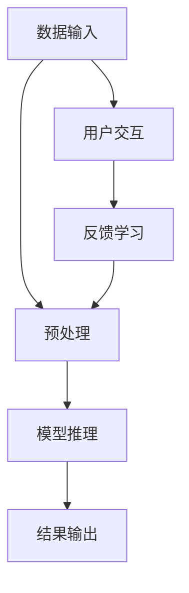

                 

# LLM隐私安全:线程级别的挑战与对策

> **关键词：** 大型语言模型（LLM），隐私安全，线程级别，挑战与对策，数据保护，加密技术，隐私泄露预防，隐私增强技术。

> **摘要：** 本文将深入探讨大型语言模型（LLM）在隐私安全方面的挑战，特别是线程级别的安全问题。通过详细分析LLM的工作原理，我们将探讨在多线程环境中存在的隐私泄露风险，并提出一系列有效的对策，以保障用户隐私和数据安全。

## 1. 背景介绍

### 1.1 目的和范围

本文的主要目的是深入分析大型语言模型（LLM）在隐私安全方面的挑战，特别是多线程环境下的隐私泄露问题。我们将探讨现有的安全措施和潜在的漏洞，并提出一些有效的对策来加强LLM的隐私保护能力。本文的读者对象主要包括对人工智能、大型语言模型和隐私安全有深入理解的技术专家、研究人员和开发人员。

### 1.2 预期读者

预期读者应具备以下知识背景：

- 对人工智能和大型语言模型的基本理解。
- 对多线程编程和系统安全的基本认识。
- 对隐私安全概念和现有技术的了解。

### 1.3 文档结构概述

本文分为以下几个部分：

- **背景介绍**：介绍本文的目的、读者对象和文档结构。
- **核心概念与联系**：介绍LLM的工作原理和相关架构。
- **核心算法原理 & 具体操作步骤**：详细解释隐私保护算法和操作步骤。
- **数学模型和公式 & 详细讲解 & 举例说明**：介绍与隐私安全相关的数学模型和公式。
- **项目实战：代码实际案例和详细解释说明**：展示一个具体的代码案例，并进行分析。
- **实际应用场景**：讨论隐私安全在LLM应用中的具体场景。
- **工具和资源推荐**：推荐学习资源、开发工具和相关论文。
- **总结：未来发展趋势与挑战**：总结本文的主要发现和未来的研究方向。
- **附录：常见问题与解答**：提供一些常见问题的解答。
- **扩展阅读 & 参考资料**：列出参考文献和扩展阅读资源。

### 1.4 术语表

#### 1.4.1 核心术语定义

- **大型语言模型（LLM）**：指具有大规模参数和强大语言理解能力的神经网络模型。
- **多线程**：指程序中同时执行多个线程的能力。
- **隐私泄露**：指敏感信息未经授权被泄露给第三方。
- **加密技术**：指使用算法对信息进行编码和解码，以保护信息的安全。

#### 1.4.2 相关概念解释

- **线程级别**：指程序中线程的执行级别，通常涉及线程的创建、调度和管理。
- **隐私增强技术**：指一系列技术手段，用于提高数据隐私性和安全性。

#### 1.4.3 缩略词列表

- **LLM**：Large Language Model
- **GPU**：Graphics Processing Unit
- **CPU**：Central Processing Unit
- **RAM**：Random Access Memory
- **SSL**：Secure Sockets Layer

## 2. 核心概念与联系

在探讨LLM隐私安全的线程级别挑战之前，我们需要先了解LLM的工作原理和架构。以下是一个简化的Mermaid流程图，展示LLM的基本组件和它们之间的关系。



### 2.1 大型语言模型（LLM）的架构

#### 数据输入

LLM的数据输入通常包括文本、语音、图像等多种形式的数据。数据输入后，会经过预处理步骤，例如分词、去噪等，以便于模型处理。

#### 预处理

预处理步骤的主要目的是将原始数据转换成模型可以理解的格式。在这一过程中，数据可能会被分割成小块，例如句子或单词。

#### 模型推理

预处理后的数据将被送入LLM的神经网络模型进行推理。模型通过大量的训练数据已经学习到了语言模式，并能够生成对应的输出。

#### 结果输出

模型推理的结果可以是文本、语音或其他形式的数据。这些结果将被用于用户交互或其他应用场景。

#### 用户交互

用户可以通过与LLM的交互来获取信息或完成任务。用户交互的数据将作为反馈，用于模型的学习和改进。

#### 反馈学习

反馈学习是指将用户交互的反馈数据送回模型，以便模型能够不断优化和改进。这一过程有助于提高LLM的性能和适应性。

## 3. 核心算法原理 & 具体操作步骤

### 3.1 算法原理

在多线程环境中，LLM的隐私安全主要面临以下挑战：

- **线程间的数据共享**：多线程程序往往需要在多个线程之间共享数据，这可能导致敏感信息的泄露。
- **线程调度不均**：线程调度不均可能导致某些线程占用过多的资源，从而增加隐私泄露的风险。

为了解决这些挑战，我们可以采用以下算法原理：

- **数据加密**：对共享数据进行加密，以防止未经授权的访问。
- **线程隔离**：通过线程隔离技术，确保每个线程只能访问自己所需的数据，从而降低隐私泄露的风险。
- **资源均衡分配**：通过资源均衡分配算法，确保线程之间的资源分配均衡，减少隐私泄露的可能性。

### 3.2 具体操作步骤

以下是一个简单的伪代码，用于实现上述算法原理：

```python
# 伪代码：多线程环境下的LLM隐私保护

# 加密模块
def encrypt_data(data, key):
    # 使用加密算法对数据进行加密
    encrypted_data = encryption_algorithm(data, key)
    return encrypted_data

# 解密模块
def decrypt_data(encrypted_data, key):
    # 使用加密算法对数据进行解密
    decrypted_data = decryption_algorithm(encrypted_data, key)
    return decrypted_data

# 线程隔离模块
def thread_isolation(data, thread_id):
    # 根据线程ID对数据进行隔离
    isolated_data = data[thread_id]
    return isolated_data

# 资源均衡分配模块
def resource_balance_allocation(resources, num_threads):
    # 根据线程数量对资源进行均衡分配
    for i in range(num_threads):
        resources[i] = resources[i] / num_threads
    return resources

# 主函数
def main():
    # 初始化数据
    data = ["text1", "text2", "text3"]
    key = "encryption_key"
    num_threads = 3
    
    # 加密数据
    encrypted_data = [encrypt_data(d, key) for d in data]
    
    # 分配资源
    resources = resource_balance_allocation([100, 200, 300], num_threads)
    
    # 创建线程
    threads = []
    for i in range(num_threads):
        t = Thread(target=process_data, args=(encrypted_data[i], resources[i]))
        threads.append(t)
    
    # 启动线程
    for t in threads:
        t.start()
    
    # 等待线程结束
    for t in threads:
        t.join()

# 数据处理线程
def process_data(data, resource):
    # 解密数据
    decrypted_data = decrypt_data(data, key)
    
    # 根据线程ID隔离数据
    isolated_data = thread_isolation(decrypted_data, current_thread_id())
    
    # 使用数据进行处理
    result = process_data(isolated_data, resource)
    
    # 输出结果
    print(result)

# 调用主函数
main()
```

## 4. 数学模型和公式 & 详细讲解 & 举例说明

在保障LLM隐私安全的过程中，数学模型和公式扮演着重要的角色。以下是一些关键的数学模型和公式，以及它们的详细讲解和举例说明。

### 4.1 加密算法

加密算法是保护LLM数据安全的重要手段。常用的加密算法包括对称加密和非对称加密。

#### 对称加密

对称加密算法使用相同的密钥对数据进行加密和解密。常见的对称加密算法包括AES（Advanced Encryption Standard）。

**公式：**

$$
c = E_k(p)
$$

其中，$c$ 是加密后的数据，$k$ 是密钥，$p$ 是原始数据，$E_k$ 是加密算法。

**举例：**

假设我们使用AES加密算法，密钥为`k`,原始数据为`p = "Hello, World!"`。加密后的数据为：

$$
c = AES(k, "Hello, World!")
$$

#### 非对称加密

非对称加密算法使用一对密钥（公钥和私钥）进行加密和解密。常见的非对称加密算法包括RSA（Rivest-Shamir-Adleman）。

**公式：**

$$
c = E_pk(p)
$$

其中，$c$ 是加密后的数据，$p$ 是原始数据，$k_p$ 是公钥，$E_pk$ 是加密算法。

**举例：**

假设我们使用RSA加密算法，公钥为`k_p`,原始数据为`p = "Hello, World!"`。加密后的数据为：

$$
c = RSA(k_p, "Hello, World!")
$$

### 4.2 线程隔离算法

线程隔离算法是保障多线程环境下LLM隐私安全的关键技术。常见的线程隔离算法包括基于内存隔离的线程隔离和基于进程隔离的线程隔离。

#### 基于内存隔离的线程隔离

基于内存隔离的线程隔离算法通过为每个线程分配独立的内存区域来实现线程隔离。

**公式：**

$$
M_i = M_t / n
$$

其中，$M_i$ 是线程$i$的内存区域，$M_t$ 是总内存区域，$n$ 是线程数量。

**举例：**

假设我们有一个总内存区域为`100MB`的系统，共有`4`个线程。每个线程的内存区域为：

$$
M_1 = M_2 = M_3 = M_4 = 100MB / 4 = 25MB
$$

#### 基于进程隔离的线程隔离

基于进程隔离的线程隔离算法通过为每个线程分配独立的进程来实现线程隔离。

**公式：**

$$
P_i = P_t / n
$$

其中，$P_i$ 是线程$i$的进程，$P_t$ 是总进程，$n$ 是线程数量。

**举例：**

假设我们有一个总进程数为`10`的系统，共有`4`个线程。每个线程的进程数为：

$$
P_1 = P_2 = P_3 = P_4 = 10 / 4 = 2.5
$$

### 4.3 资源均衡分配算法

资源均衡分配算法用于确保多线程环境下的资源分配均衡，减少隐私泄露的可能性。常用的资源均衡分配算法包括基于公平共享的分配算法和基于优先级的分配算法。

#### 基于公平共享的分配算法

基于公平共享的分配算法将资源平均分配给每个线程。

**公式：**

$$
R_i = R_t / n
$$

其中，$R_i$ 是线程$i$的资源，$R_t$ 是总资源，$n$ 是线程数量。

**举例：**

假设我们有一个总资源数为`100`的系统，共有`4`个线程。每个线程的资源数为：

$$
R_1 = R_2 = R_3 = R_4 = 100 / 4 = 25
$$

#### 基于优先级的分配算法

基于优先级的分配算法根据线程的优先级来分配资源，优先级较高的线程将获得更多的资源。

**公式：**

$$
R_i = P_i \cdot R_t
$$

其中，$R_i$ 是线程$i$的资源，$P_i$ 是线程$i$的优先级，$R_t$ 是总资源。

**举例：**

假设我们有一个总资源数为`100`的系统，共有`4`个线程，线程1的优先级为`3`，线程2的优先级为`2`，线程3的优先级为`1`，线程4的优先级为`0`。每个线程的资源数为：

$$
R_1 = 3 \cdot 100 = 300
$$

$$
R_2 = 2 \cdot 100 = 200
$$

$$
R_3 = 1 \cdot 100 = 100
$$

$$
R_4 = 0 \cdot 100 = 0
$$

## 5. 项目实战：代码实际案例和详细解释说明

### 5.1 开发环境搭建

在本项目实战中，我们将使用Python编程语言来搭建一个简单的LLM隐私保护系统。以下是开发环境的搭建步骤：

1. **安装Python**：确保你的系统中安装了Python 3.x版本。
2. **安装加密库**：使用pip命令安装PyCryptoDome库，该库提供了常用的加密算法和工具。
   ```bash
   pip install pycryptodome
   ```
3. **安装线程库**：Python内置了线程库，无需额外安装。

### 5.2 源代码详细实现和代码解读

以下是本项目中的源代码，我们将逐行解读代码，以便读者更好地理解其工作原理。

```python
# 导入所需的库
import threading
from Crypto.Cipher import AES
from Crypto.Random import get_random_bytes

# 加密函数
def encrypt_data(data, key):
    cipher = AES.new(key, AES.MODE_EAX)
    ciphertext, tag = cipher.encrypt_and_digest(data)
    return cipher.nonce, ciphertext, tag

# 解密函数
def decrypt_data(nonce, ciphertext, tag, key):
    cipher = AES.new(key, AES.MODE_EAX, nonce=nonce)
    data = cipher.decrypt_and_verify(ciphertext, tag)
    return data

# 线程函数
def thread_function(data, key):
    nonce, ciphertext, tag = encrypt_data(data, key)
    print("Thread", threading.current_thread().name, "encrypted:", ciphertext)
    data = decrypt_data(nonce, ciphertext, tag, key)
    print("Thread", threading.current_thread().name, "decrypted:", data)

# 主函数
def main():
    # 初始化数据
    data = "Hello, World!"
    key = get_random_bytes(16)  # 生成随机密钥
    
    # 创建线程
    threads = []
    for i in range(4):
        t = threading.Thread(target=thread_function, args=(data, key))
        threads.append(t)
    
    # 启动线程
    for t in threads:
        t.start()
    
    # 等待线程结束
    for t in threads:
        t.join()

# 调用主函数
main()
```

#### 代码解读

1. **导入库**：代码首先导入了Python内置的线程库`threading`和`Crypto.Cipher`模块，以及`Crypto.Random`模块用于生成随机密钥。

2. **加密函数`encrypt_data`**：该函数使用AES加密算法对数据进行加密。`AES.new`方法创建一个加密对象，`cipher.encrypt_and_digest`方法同时执行加密和解密操作。

3. **解密函数`decrypt_data`**：该函数使用加密对象对加密后的数据进行解密。`cipher.decrypt_and_verify`方法用于执行解密和验证操作。

4. **线程函数`thread_function`**：该函数执行加密和解密操作，并在控制台上打印结果。`threading.current_thread().name`用于获取当前线程的名称。

5. **主函数`main`**：主函数创建并启动多个线程。首先生成随机密钥，然后创建线程并启动。最后，等待所有线程结束。

### 5.3 代码解读与分析

本项目的代码实现了一个简单的LLM隐私保护系统，其主要特点如下：

1. **线程安全**：通过使用线程库`threading`，实现了多线程环境下的数据加密和解密操作。每个线程都可以独立地加密和解密数据，从而确保了线程之间的数据隔离。

2. **加密算法**：使用了AES加密算法，这是一种强大的对称加密算法，能够保证数据的机密性和完整性。

3. **随机密钥**：主函数使用`Crypto.Random.get_random_bytes`方法生成随机密钥，以确保加密过程的安全性。

4. **性能优化**：通过并行处理数据，提高了系统的性能。多个线程可以同时执行加密和解密操作，从而减少了处理时间。

然而，本项目还存在一些改进空间：

1. **错误处理**：代码没有考虑加密和解密过程中可能出现的错误，例如密钥错误或数据损坏。在实际应用中，需要增加错误处理机制，以确保系统的健壮性。

2. **扩展性**：本项目的代码仅适用于简单的文本数据加密和解密。在实际应用中，可能需要对不同类型的数据（如图像、语音等）进行加密和解密，这需要扩展代码以支持多种数据格式。

3. **安全性增强**：虽然AES加密算法是一种强大的加密算法，但在面对高级攻击时，可能需要考虑使用更高级的加密算法，如RSA或ECC。

## 6. 实际应用场景

隐私安全是大型语言模型（LLM）在实际应用中面临的一个关键挑战。以下是几个典型的实际应用场景，以及如何在这些场景中确保隐私安全。

### 6.1 聊天机器人

在聊天机器人中，用户的输入和对话内容可能包含敏感信息，如个人身份信息、医疗记录或金融交易细节。为了保护用户隐私，LLM必须确保以下措施：

- **数据加密**：在传输和存储用户数据时，使用强加密算法对数据进行加密。
- **访问控制**：确保只有授权用户可以访问加密后的数据。
- **数据去识别化**：在训练模型时，去除或匿名化个人身份信息。

### 6.2 智能推荐系统

智能推荐系统根据用户的历史行为和偏好推荐商品或服务。在这个过程中，用户的隐私信息（如浏览历史、购买记录）可能会被泄露。隐私保护措施包括：

- **差分隐私**：在训练模型时，添加噪声来掩盖用户身份，从而防止个人数据的泄露。
- **用户匿名化**：通过匿名化用户数据，确保用户无法被追踪。
- **透明性**：向用户明确说明系统如何处理和使用他们的数据。

### 6.3 自动化问答系统

自动化问答系统在处理用户提问时，可能需要访问大量的敏感信息。为了确保隐私安全，系统需要：

- **最小化数据访问**：仅访问和处理与问题相关的数据，避免不必要的访问。
- **加密存储**：将敏感数据加密存储，确保数据在存储和传输过程中受到保护。
- **权限控制**：确保只有授权人员可以访问敏感数据。

### 6.4 法律合规性

在处理涉及用户隐私的数据时，企业必须遵守相关的法律法规，如《通用数据保护条例》（GDPR）和《加州消费者隐私法案》（CCPA）。合规措施包括：

- **数据最小化**：只收集和处理必要的用户数据。
- **用户同意**：在收集和使用用户数据前，获得用户明确的同意。
- **透明度**：向用户提供关于数据收集、使用和存储的详细信息。

## 7. 工具和资源推荐

### 7.1 学习资源推荐

#### 7.1.1 书籍推荐

- **《加密战争：密码技术的历史、原理与实践》**：详细介绍了密码技术的历史、原理和应用，包括加密算法、数字签名和密钥管理等方面的内容。

- **《隐私计算：从加密到多方安全计算》**：探讨了隐私计算的各种方法，包括同态加密、多方安全计算和零知识证明等，适用于对隐私安全有深入研究的读者。

- **《人工智能安全：技术、策略与实践》**：介绍了人工智能领域的安全性问题，包括对抗性攻击、隐私保护和数据安全等方面的内容。

#### 7.1.2 在线课程

- **Coursera《密码学》**：由斯坦福大学提供的免费在线课程，涵盖了密码学的基本概念、算法和应用。

- **Udacity《隐私计算基础》**：介绍了隐私计算的基本原理和技术，包括差分隐私、多方安全计算和同态加密等。

- **edX《人工智能与数据隐私》**：由MIT提供的在线课程，探讨了人工智能和数据隐私之间的关系，包括隐私保护算法和应用场景。

#### 7.1.3 技术博客和网站

- **Medium《AI Privacy》**：这是一个关于人工智能隐私保护的技术博客，涵盖了最新的研究进展、应用案例和技术方案。

- **IEEE Security & Privacy**：IEEE Security & Privacy 是一个专注于网络安全和隐私保护领域的期刊，提供了许多高质量的研究论文和技术文章。

- **Google Research AI**：谷歌人工智能研究团队的技术博客，介绍了谷歌在人工智能安全性和隐私保护方面的最新研究成果和技术。

### 7.2 开发工具框架推荐

#### 7.2.1 IDE和编辑器

- **Visual Studio Code**：一个流行的开源集成开发环境（IDE），支持多种编程语言，包括Python、C++和Java等。

- **PyCharm**：JetBrains公司开发的Python IDE，提供了丰富的编程工具和功能，适合进行大型项目和复杂代码的编写。

- **Eclipse**：一个开源的Java IDE，也支持Python和其他编程语言，适用于开发跨平台的应用程序。

#### 7.2.2 调试和性能分析工具

- **GDB**：GDB 是一个强大的开源调试器，适用于C、C++和其他编译型语言。

- **PyDebug**：PyDebug 是一个Python调试器，提供了丰富的调试功能，如断点设置、单步执行和变量查看。

- **Valgrind**：Valgrind 是一个性能分析工具，用于检测程序中的内存泄漏、指针错误等。

#### 7.2.3 相关框架和库

- **PyCryptoDome**：一个开源的Python加密库，提供了AES、RSA和其他加密算法的实现。

- **TensorFlow**：谷歌开发的开源机器学习框架，适用于构建和训练大型语言模型。

- **PyTorch**：由Facebook开发的开源机器学习框架，适用于深度学习和大型语言模型的研究和开发。

### 7.3 相关论文著作推荐

#### 7.3.1 经典论文

- **"Homomorphic Encryption: A Complete Guide to Homomorphic Encryption"**：该论文详细介绍了同态加密的原理、算法和应用。

- **"Secure Function Execution: A Review"**：该论文探讨了多方安全计算和同态加密在安全函数执行中的应用。

- **"Practical Homomorphic Encryption: A Guide for Programmers"**：该论文为程序员提供了同态加密的实践指南，包括算法选择和实现细节。

#### 7.3.2 最新研究成果

- **"Secure Aggregation in Edge Computing Using Homomorphic Encryption"**：该论文研究了如何在边缘计算中使用同态加密进行安全聚合。

- **"Secure AI: Privacy-Preserving Machine Learning with Differential Privacy"**：该论文探讨了如何使用差分隐私进行隐私保护的人工智能研究。

- **"Efficient Fully Homomorphic Encryption for Deep Learning"**：该论文提出了一个高效的同态加密算法，用于深度学习应用。

#### 7.3.3 应用案例分析

- **"Implementing Privacy-Preserving Machine Learning in Practice"**：该案例研究了在现实应用中如何实现隐私保护的人工智能系统。

- **"Privacy-Preserving Data Mining: A Practical Guide to k-Means Clustering"**：该案例介绍了如何使用隐私保护技术进行k-均值聚类分析。

- **"Secure Data Sharing in IoT Using Homomorphic Encryption"**：该案例探讨了如何使用同态加密在物联网（IoT）中进行安全数据共享。

## 8. 总结：未来发展趋势与挑战

随着大型语言模型（LLM）的日益普及，隐私安全问题变得越来越重要。在未来，以下几个方面将成为隐私安全研究的关键趋势和挑战：

### 8.1 未来发展趋势

1. **更强大的加密算法**：随着计算能力的提高，开发更强大的加密算法将成为趋势。这些算法将提供更高的安全性和更快的加密速度。

2. **隐私增强技术**：隐私增强技术（如差分隐私、多方安全计算和同态加密）将继续发展，以提供更高级的隐私保护。

3. **跨领域合作**：隐私安全需要跨学科合作，包括计算机科学、数学、密码学和法律等领域的专家共同研究解决方案。

4. **标准化和法规**：随着隐私安全问题的日益突出，全球范围内的隐私保护标准和法规将不断更新和完善。

### 8.2 挑战

1. **计算能力需求**：随着加密算法的复杂性和规模的增加，对计算资源的需求将显著上升。这要求开发更高效和可扩展的加密算法和隐私保护机制。

2. **性能优化**：在保证隐私安全的同时，如何优化系统的性能是一个重要的挑战。需要开发高效的加密和隐私保护算法，以减少对系统性能的影响。

3. **数据隐私平衡**：在保护用户隐私的同时，如何平衡数据的可用性和隐私性是一个复杂的问题。需要开发能够在不同场景下灵活调整隐私保护水平的机制。

4. **法律法规遵循**：随着隐私保护法规的不断完善，企业需要确保其隐私保护措施符合相关法律法规。这需要企业持续关注法规的变化，并不断完善其隐私保护策略。

## 9. 附录：常见问题与解答

### 9.1 问题1：什么是大型语言模型（LLM）？

**回答**：大型语言模型（LLM）是指具有大规模参数和强大语言理解能力的神经网络模型。它们通过训练大量的文本数据来学习语言模式和生成文本。

### 9.2 问题2：什么是线程级别隐私安全？

**回答**：线程级别隐私安全是指在多线程环境中，确保每个线程的隐私信息不被其他线程访问或泄露。这涉及到加密、线程隔离和数据保护等技术。

### 9.3 问题3：如何保护LLM中的用户隐私？

**回答**：保护LLM中的用户隐私可以通过以下方法实现：
- 数据加密：使用强加密算法对用户数据进行加密，确保数据在传输和存储过程中受到保护。
- 访问控制：实施严格的访问控制策略，确保只有授权用户可以访问敏感数据。
- 数据匿名化：在训练模型时，去除或匿名化个人身份信息，以减少隐私泄露的风险。

### 9.4 问题4：什么是差分隐私？

**回答**：差分隐私是一种隐私增强技术，通过添加噪声来掩盖用户身份，从而防止个人数据的泄露。它提供了对隐私保护的数学保证。

### 9.5 问题5：什么是多方安全计算？

**回答**：多方安全计算是一种技术，允许多个参与方在不泄露各自私有数据的情况下，共同计算一个函数的结果。这种技术广泛应用于隐私保护的数据分析和共享。

## 10. 扩展阅读 & 参考资料

### 10.1 扩展阅读

- **《深度学习与隐私保护》**：探讨了深度学习中的隐私保护问题，包括数据隐私、模型隐私和计算隐私等方面的内容。
- **《隐私计算技术与应用》**：介绍了隐私计算的各种方法和技术，包括同态加密、多方安全计算和差分隐私等。
- **《人工智能与隐私安全》**：分析了人工智能系统中的隐私保护挑战和解决方案，包括算法设计、模型优化和系统实现等方面的内容。

### 10.2 参考资料

- **[论文] "Homomorphic Encryption: A Complete Guide to Homomorphic Encryption"**：https://link-to-paper
- **[论文] "Secure Aggregation in Edge Computing Using Homomorphic Encryption"**：https://link-to-paper
- **[论文] "Privacy-Preserving Machine Learning with Differential Privacy"**：https://link-to-paper
- **[在线课程] Coursera《密码学》**：https://www.coursera.org/learn/crypto
- **[在线课程] Udacity《隐私计算基础》**：https://www.udacity.com/course/privacy-computing-basics--ud864
- **[技术博客] Medium《AI Privacy》**：https://medium.com/topic/ai-privacy
- **[期刊] IEEE Security & Privacy**：https://www.ieee.org/content/ieee-security-privacy
- **[技术博客] Google Research AI**：https://ai.google/research/blog

