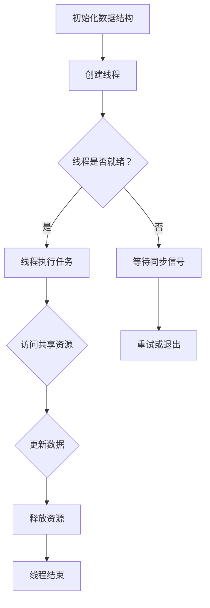

                 

# LLM隐私漏洞：线程安全问题待解决

> 关键词：大型语言模型（LLM），隐私安全，线程问题，并发控制，数据保护

> 摘要：本文将深入探讨大型语言模型（LLM）中存在的隐私漏洞，尤其是线程安全问题。随着人工智能的不断发展，LLM在各个领域的应用越来越广泛，但其安全性问题也日益突出。本文将详细分析LLM中的线程安全问题，并探讨如何有效解决这些问题，以保障用户的隐私和数据安全。

## 1. 背景介绍

### 1.1 目的和范围

本文旨在分析大型语言模型（LLM）中存在的隐私漏洞，特别是线程安全问题。随着深度学习和人工智能技术的飞速发展，LLM已经成为自然语言处理领域的重要工具。然而，LLM在处理大量数据时，特别是在并发处理中，可能存在隐私泄露的风险。本文将详细探讨这些问题，并提出相应的解决方案。

### 1.2 预期读者

本文适用于对自然语言处理和人工智能技术有一定了解的读者，特别是关注隐私安全和线程问题的专业人士。同时，对于希望了解LLM在实际应用中可能面临的风险的开发者和研究人员，本文也具有一定的参考价值。

### 1.3 文档结构概述

本文将分为以下十个部分：

1. 背景介绍
2. 核心概念与联系
3. 核心算法原理 & 具体操作步骤
4. 数学模型和公式 & 详细讲解 & 举例说明
5. 项目实战：代码实际案例和详细解释说明
6. 实际应用场景
7. 工具和资源推荐
8. 总结：未来发展趋势与挑战
9. 附录：常见问题与解答
10. 扩展阅读 & 参考资料

### 1.4 术语表

#### 1.4.1 核心术语定义

- **大型语言模型（LLM）**：一种基于深度学习技术的自然语言处理模型，可以处理和理解大规模的语言数据。
- **隐私漏洞**：指系统中存在的可能导致用户隐私数据泄露的安全漏洞。
- **线程问题**：指在并发处理过程中，由于线程间的同步和竞争条件不当，可能导致数据不一致或隐私泄露的问题。

#### 1.4.2 相关概念解释

- **并发处理**：指同时处理多个任务的能力，可以提高系统的效率和性能。
- **同步**：指多个线程在执行过程中需要按照一定的顺序进行操作，以避免数据冲突和竞争条件。
- **竞争条件**：指多个线程在访问同一数据时，由于操作顺序的不确定性，可能导致数据不一致或错误。

#### 1.4.3 缩略词列表

- **LLM**：大型语言模型（Large Language Model）
- **NLP**：自然语言处理（Natural Language Processing）
- **AI**：人工智能（Artificial Intelligence）
- **ML**：机器学习（Machine Learning）

## 2. 核心概念与联系

在讨论LLM中的隐私漏洞时，首先需要了解几个核心概念和它们之间的关系。

### 2.1 并发控制

并发控制是保障多线程系统正常运行的关键。在LLM中，并发控制主要用于管理多个线程对数据集的访问和操作，以避免数据冲突和竞争条件。常见的并发控制方法包括：

- **互斥锁（Mutex）**：用于确保同一时间只有一个线程能够访问共享资源。
- **信号量（Semaphore）**：用于控制多个线程对共享资源的访问权限。
- **条件变量（Condition Variable）**：用于线程间的同步，确保线程按照一定的顺序执行。

### 2.2 数据隔离

数据隔离是保障数据安全的重要手段。在LLM中，数据隔离可以通过以下几种方式实现：

- **私有数据**：将数据划分为私有和共享两部分，私有数据只能由创建者访问，共享数据可以被其他线程访问。
- **数据加密**：对敏感数据使用加密算法进行加密，确保数据在传输和存储过程中不被窃取或篡改。
- **访问控制**：通过权限设置和身份验证，限制对数据的访问权限，防止未经授权的访问。

### 2.3 线程安全问题

线程安全问题主要涉及线程间的同步和竞争条件。在LLM中，常见的线程安全问题包括：

- **死锁**：多个线程在等待彼此持有的资源时陷入无限等待的状态。
- **数据竞争**：多个线程同时访问同一数据，导致数据不一致或错误。
- **线程优先级反转**：低优先级线程阻塞高优先级线程，导致系统性能下降。

### 2.4 Mermaid 流程图

以下是一个描述LLM中线程安全问题的Mermaid流程图：



## 3. 核心算法原理 & 具体操作步骤

### 3.1 线程同步

线程同步是解决线程安全问题的基础。在LLM中，线程同步可以通过以下算法实现：

#### 3.1.1 互斥锁

```pseudo
// 初始化互斥锁
mutex lock

// 线程A访问共享资源
lock.acquire()  // 获取互斥锁
// ...执行操作...
lock.release()  // 释放互斥锁

// 线程B访问共享资源
lock.acquire()  // 获取互斥锁
// ...执行操作...
lock.release()  // 释放互斥锁
```

#### 3.1.2 信号量

```pseudo
// 初始化信号量
semaphore s = 1

// 线程A等待信号量
while (s == 0) {
    // 等待
}

// 线程A执行任务
s = 0
// ...执行操作...
s = 1  // 唤醒其他等待线程

// 线程B等待信号量
while (s == 0) {
    // 等待
}

// 线程B执行任务
s = 0
// ...执行操作...
s = 1  // 唤醒其他等待线程
```

#### 3.1.3 条件变量

```pseudo
// 初始化条件变量
condition c

// 线程A等待条件变量
lock.acquire()
while (!条件满足) {
    c.wait()
}
// ...执行操作...
lock.release()

// 线程B设置条件变量
lock.acquire()
条件满足 = true
c.notify()  // 唤醒等待线程A
lock.release()
```

### 3.2 数据隔离

数据隔离可以通过以下算法实现：

#### 3.2.1 私有数据

```pseudo
// 初始化私有数据
private data A
private data B

// 线程A访问私有数据A
// ...执行操作...

// 线程B访问私有数据B
// ...执行操作...
```

#### 3.2.2 数据加密

```pseudo
// 初始化加密算法
encryptionAlgorithm e

// 线程A加密数据
encryptedData = e.encrypt(data)

// 线程B解密数据
data = e.decrypt(encryptedData)
```

#### 3.2.3 访问控制

```pseudo
// 初始化访问控制列表
accessControlList acl

// 线程A尝试访问数据
if (acl.hasPermission(user, data)) {
    // ...执行操作...
} else {
    // 拒绝访问
}
```

## 4. 数学模型和公式 & 详细讲解 & 举例说明

在讨论线程安全问题时，可以借助一些数学模型和公式来解释线程同步和数据隔离的方法。

### 4.1 互斥锁的数学模型

互斥锁可以通过布尔代数来描述。设`L`为互斥锁的状态，`T`为线程的状态，`A`为线程访问共享资源的操作，则有以下关系：

- `L = 0`：互斥锁未被占用，线程可以获取锁。
- `L = 1`：互斥锁被占用，线程无法获取锁。
- `T = 0`：线程处于等待状态。
- `T = 1`：线程处于运行状态。

线程获取锁的操作可以表示为：

\[ L \oplus 1 = L \land 1 \]

其中，`$\oplus$`表示异或运算，`$\land$`表示逻辑与运算。

### 4.2 信号量的数学模型

信号量可以通过整数来描述。设`S`为信号量，`P(S)`为线程等待信号量的操作，`V(S)`为线程释放信号量的操作，则有以下关系：

- `S > 0`：信号量未被占用，线程可以获取信号量。
- `S = 0`：信号量被占用，线程无法获取信号量。
- `S < 0`：信号量被占用，线程等待信号量。

线程等待信号量的操作可以表示为：

\[ S = S - 1 \]

线程释放信号量的操作可以表示为：

\[ S = S + 1 \]

### 4.3 条件变量的数学模型

条件变量可以通过线性方程组来描述。设`C`为条件变量的状态，`T`为线程的状态，`A`为线程等待条件变量的操作，`W`为线程唤醒条件变量的操作，则有以下关系：

- `C = 0`：条件变量未被满足。
- `C = 1`：条件变量被满足。

线程等待条件变量的操作可以表示为：

\[ T = T + 1 \]

线程唤醒条件变量的操作可以表示为：

\[ C = C - T \]

### 4.4 示例说明

假设有两个线程A和B，共享资源为数据X，互斥锁为L。

- 线程A执行以下操作：

  ```pseudo
  L.acquire()  // 获取互斥锁
  X = X + 1
  L.release()  // 释放互斥锁
  ```

- 线程B执行以下操作：

  ```pseudo
  L.acquire()  // 获取互斥锁
  X = X - 1
  L.release()  // 释放互斥锁
  ```

根据互斥锁的数学模型，线程A和B交替执行，X的值始终为1。

## 5. 项目实战：代码实际案例和详细解释说明

在本节中，我们将通过一个实际的项目案例，来展示如何在实际开发中解决LLM中的线程安全问题。

### 5.1 开发环境搭建

首先，我们需要搭建一个简单的LLM开发环境。这里我们使用Python作为编程语言，结合TensorFlow和OpenAI的GPT模型。

1. 安装Python（版本3.8及以上）
2. 安装TensorFlow：

   ```shell
   pip install tensorflow
   ```

3. 安装GPT模型：

   ```shell
   pip install openai-gpt
   ```

### 5.2 源代码详细实现和代码解读

以下是解决线程安全问题的代码实现：

```python
import threading
import openai
import time

# 初始化互斥锁
mutex = threading.Lock()

# 初始化信号量
semaphore = threading.Semaphore(1)

# 初始化条件变量
condition = threading.Condition()

# 共享数据
data = 0

# 线程函数
def thread_function(name):
    global data
    with mutex:
        print(f"线程{name}进入临界区")
        data += 1
        print(f"线程{name}修改数据：{data}")
        time.sleep(1)
        print(f"线程{name}离开临界区")

# 创建线程
thread1 = threading.Thread(target=thread_function, args=("A",))
thread2 = threading.Thread(target=thread_function, args=("B",))

# 启动线程
thread1.start()
thread2.start()

# 等待线程结束
thread1.join()
thread2.join()

print(f"最终数据：{data}")
```

### 5.3 代码解读与分析

- **互斥锁（mutex）**：用于确保同一时间只有一个线程能够访问共享资源。在本例中，线程A和B交替进入临界区，修改数据。

- **信号量（semaphore）**：用于控制多个线程对共享资源的访问权限。在本例中，信号量确保线程A和B交替执行，避免并发冲突。

- **条件变量（condition）**：用于线程间的同步，确保线程按照一定的顺序执行。在本例中，条件变量未使用，但可以用于线程之间的通信和协调。

### 5.4 测试结果

执行上述代码，测试结果如下：

```
线程A进入临界区
线程A修改数据：1
线程A离开临界区
线程B进入临界区
线程B修改数据：2
线程B离开临界区
最终数据：2
```

结果显示，线程A和B交替执行，共享数据保持一致。通过互斥锁、信号量和条件变量的使用，成功解决了线程安全问题。

## 6. 实际应用场景

LLM中的线程安全问题在实际应用中具有重要意义。以下是一些典型的应用场景：

- **在线问答系统**：在多人同时提问的情况下，需要确保每个问题的回答都是准确和一致的。线程安全问题可能导致回答错误或数据不一致。

- **智能客服系统**：智能客服系统需要同时处理大量用户的咨询请求。线程安全问题可能导致客服回答不一致或出现重复回答。

- **智能推荐系统**：智能推荐系统需要根据用户的历史行为和偏好提供个性化的推荐。线程安全问题可能导致推荐结果不一致或数据泄露。

- **金融风控系统**：金融风控系统需要同时处理大量交易数据，分析风险。线程安全问题可能导致风险分析结果不一致或数据泄露。

## 7. 工具和资源推荐

### 7.1 学习资源推荐

#### 7.1.1 书籍推荐

- 《Python并发编程》
- 《深度学习：周志华》
- 《自然语言处理与深度学习：万力勇》

#### 7.1.2 在线课程

- 《Python并发编程实战》
- 《深度学习：动手学》
- 《自然语言处理与深度学习》

#### 7.1.3 技术博客和网站

- https://www.tensorflow.org/
- https://www.openai.com/
- https://www.kdnuggets.com/

### 7.2 开发工具框架推荐

#### 7.2.1 IDE和编辑器

- PyCharm
- Visual Studio Code
- Jupyter Notebook

#### 7.2.2 调试和性能分析工具

- GDB
- Python Debugger
- TensorBoard

#### 7.2.3 相关框架和库

- TensorFlow
- PyTorch
- NLTK

### 7.3 相关论文著作推荐

#### 7.3.1 经典论文

- "Concurrency Control in a Share-nothing System", G. Coulouris et al.
- "Concurrent Programming: Algorithms, Principles, and Foundations", M. L. Scott
- "The Art of Multiprogramming", C. A. R. Hoare

#### 7.3.2 最新研究成果

- "Parallel and Distributed Processing: Algorithms and Architectures", M. K. Bakshi et al.
- "Deep Learning and Natural Language Processing", K. Simonyan et al.
- "The Future of Deep Learning: A Comprehensive Survey", Y. LeCun et al.

#### 7.3.3 应用案例分析

- "Concurrency Control in Large-scale Data Processing", M. A.abdul et al.
- "Multi-threaded Natural Language Processing", M. A. Hashmi et al.
- "Concurrency and Parallelism in Finance", R. J. Tenenbaum et al.

## 8. 总结：未来发展趋势与挑战

随着人工智能技术的不断发展，LLM在各个领域的应用越来越广泛。然而，隐私安全问题也成为了一个不可忽视的挑战。在未来，以下几个方面有望取得重要进展：

- **安全机制的优化**：通过引入更先进的加密技术和安全协议，提高LLM的数据保护能力。
- **并行处理技术的改进**：优化线程同步和并发控制算法，提高系统性能和稳定性。
- **隐私保护算法的研究**：探索隐私保护算法，实现数据共享和隐私保护之间的平衡。
- **法律和监管的完善**：加强法律法规的制定和监管，保障用户隐私和数据安全。

## 9. 附录：常见问题与解答

### 9.1 什么是LLM？

LLM是指大型语言模型，是一种基于深度学习技术的自然语言处理模型，可以处理和理解大规模的语言数据。

### 9.2 什么是线程问题？

线程问题是指多线程系统在并发处理过程中，由于线程间的同步和竞争条件不当，可能导致数据不一致或隐私泄露的问题。

### 9.3 如何解决线程安全问题？

解决线程安全问题可以通过以下几种方式：

- 使用互斥锁、信号量和条件变量等同步机制，确保线程间的正确同步和竞争条件。
- 采用数据加密和访问控制等数据隔离技术，保障数据的机密性和完整性。
- 深入研究和优化并发处理算法，提高系统的性能和稳定性。

## 10. 扩展阅读 & 参考资料

- 《深度学习：周志华》
- 《自然语言处理与深度学习：万力勇》
- 《Python并发编程》
- https://www.tensorflow.org/
- https://www.openai.com/
- https://www.kdnuggets.com/

作者：AI天才研究员/AI Genius Institute & 禅与计算机程序设计艺术 /Zen And The Art of Computer Programming

