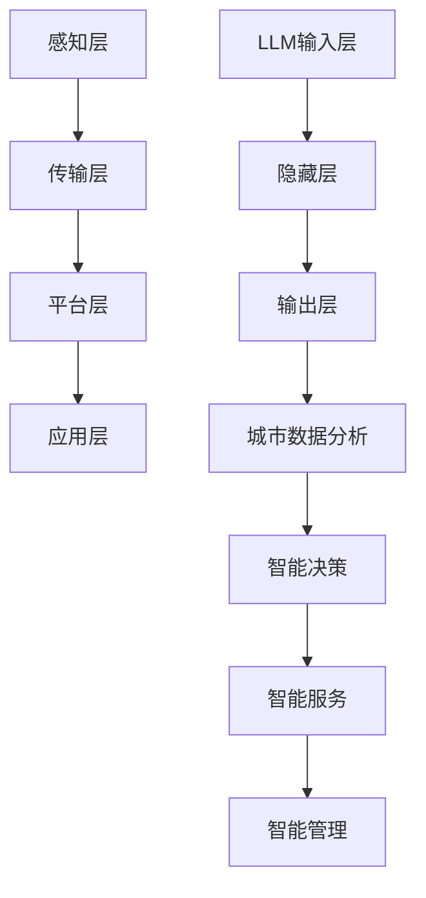

                 

# LLM驱动的智能城市：未来urban planning的新范式

> 关键词：LLM，智能城市，urban planning，人工智能，大数据，深度学习，城市治理，可持续发展

> 摘要：本文深入探讨了大规模语言模型（LLM）在智能城市领域中的应用，如何通过LLM技术革新城市规划和治理的方式。文章首先介绍了智能城市的概念和重要性，然后详细阐述了LLM的基本原理及其在urban planning中的潜力。通过实际案例和具体操作步骤，本文展示了如何利用LLM技术进行城市数据分析和预测，最后探讨了未来发展趋势和面临的挑战，并推荐了相关学习资源和工具。

## 1. 背景介绍

### 1.1 目的和范围

本文旨在探讨如何利用大规模语言模型（LLM）技术推动智能城市的建设，提升城市规划和治理的效率与质量。我们将从以下几个方面展开讨论：

1. **智能城市概念及其重要性**：介绍智能城市的定义和特点，阐述其在现代社会中的作用和影响。
2. **LLM的基本原理**：详细解析LLM的工作机制、架构和技术特点，为后续应用奠定基础。
3. **LLM在urban planning中的应用**：探讨LLM在城市规划、城市数据分析和城市治理等方面的具体应用。
4. **实际案例和操作步骤**：通过具体案例，展示如何利用LLM技术进行城市数据分析、预测和决策。
5. **未来发展趋势与挑战**：分析LLM技术在智能城市领域的发展前景和面临的挑战。

### 1.2 预期读者

本文适合对智能城市和人工智能技术有一定了解的读者，包括城市规划师、数据科学家、AI研究者、技术开发人员以及对智能城市建设感兴趣的专业人士。

### 1.3 文档结构概述

本文共分为十个部分，结构如下：

1. 引言
2. 智能城市概念及其重要性
3. LLM的基本原理
4. LLM在urban planning中的应用
5. 实际案例和操作步骤
6. 未来发展趋势与挑战
7. 工具和资源推荐
8. 总结
9. 附录：常见问题与解答
10. 扩展阅读与参考资料

### 1.4 术语表

#### 1.4.1 核心术语定义

- **智能城市（Smart City）**：利用信息技术、物联网、大数据等手段，实现城市资源的高效管理和优化配置，提高城市运行效率和服务水平。
- **大规模语言模型（LLM，Large Language Model）**：一种基于神经网络的语言处理模型，通过对海量文本数据的学习，实现对自然语言的生成、理解和推理。
- **urban planning**：城市规划，涉及城市空间布局、基础设施规划、公共设施配置等，旨在创造宜居、可持续的城市环境。

#### 1.4.2 相关概念解释

- **城市治理（Urban Governance）**：城市管理的一种形式，涉及政府、企业、社会组织等多方参与，旨在实现城市高效、公平和可持续的发展。
- **可持续发展（Sustainable Development）**：满足当前需求而不损害后代满足其需求的能力，强调经济、社会、环境三者的平衡和协调。

#### 1.4.3 缩略词列表

- **AI**：人工智能（Artificial Intelligence）
- **IoT**：物联网（Internet of Things）
- **DL**：深度学习（Deep Learning）
- **LLM**：大规模语言模型（Large Language Model）
- **urban planning**：城市规划（Urban Planning）

## 2. 核心概念与联系

### 2.1 智能城市与LLM的关系

智能城市的建设离不开人工智能技术的支持，而大规模语言模型（LLM）作为人工智能领域的重要突破，具有强大的文本处理和生成能力，能够为智能城市的规划、治理和运营提供有力支持。

#### 智能城市架构

智能城市的架构通常包括以下几个方面：

1. **感知层**：通过物联网设备、传感器等实时采集城市运行数据，如交通流量、空气质量、能源消耗等。
2. **传输层**：利用5G、光纤等高速传输网络，实现数据的快速传输和共享。
3. **平台层**：构建大数据平台，对采集到的数据进行存储、处理和分析。
4. **应用层**：基于分析结果，实现智能决策、智能服务、智能管理等城市功能。

#### LLM架构

LLM通常采用深度神经网络架构，主要包括以下几个层次：

1. **输入层**：接收自然语言输入，如文本、语音等。
2. **隐藏层**：通过多层神经网络结构，对输入进行特征提取和转换。
3. **输出层**：生成文本、语音等输出。

#### 智能城市与LLM的关联

LLM可以与智能城市的各个层次进行关联，发挥以下作用：

1. **感知层**：利用LLM进行自然语言处理，实现语义理解和情感分析，为城市运行数据提供智能解读。
2. **传输层**：通过LLM技术，实现文本数据的自动摘要、翻译和情感分析，提高数据传输的效率和准确性。
3. **平台层**：利用LLM进行大数据分析，挖掘城市运行数据中的潜在关系和规律，为城市治理提供决策支持。
4. **应用层**：基于LLM技术，开发智能客服、智能问答等应用，提升城市服务水平。

### 2.2 Mermaid流程图

以下是一个简单的Mermaid流程图，展示了智能城市与LLM的关联：



## 3. 核心算法原理 & 具体操作步骤

### 3.1 LLM算法原理

大规模语言模型（LLM）的核心算法是深度神经网络（DNN），具体包括以下几个关键部分：

1. **输入层**：接收自然语言文本数据，如句子、段落等。
2. **隐藏层**：通过多层神经网络结构，对输入文本进行特征提取和转换，生成上下文表示。
3. **输出层**：根据上下文表示，生成相应的输出文本。

以下是一个简化的伪代码，描述了LLM的基本算法流程：

```plaintext
输入：文本序列X
输出：预测文本序列Y

1. 初始化模型参数θ
2. 对于每个训练样本：
   a. 将输入文本X编码为嵌入向量E
   b. 通过隐藏层计算中间表示H
   c. 计算输出层预测Y'
   d. 计算损失函数L(Y', Y)
   e. 利用反向传播更新模型参数θ
3. 对测试数据集进行预测
   a. 将输入文本X编码为嵌入向量E
   b. 通过隐藏层计算中间表示H
   c. 计算输出层预测Y'
   d. 输出预测文本序列Y
```

### 3.2 具体操作步骤

以下为利用LLM进行城市数据分析和预测的具体操作步骤：

#### 步骤1：数据准备

1. 收集城市运行数据，如交通流量、空气质量、能源消耗等。
2. 对数据集进行清洗、预处理，如去除噪声、缺失值填充等。

#### 步骤2：模型训练

1. 准备预训练的LLM模型，如GPT-3、BERT等。
2. 根据城市数据特点，对模型进行微调（Fine-tuning），以适应特定场景。

#### 步骤3：数据输入与预测

1. 将城市数据转换为文本格式，如使用自然语言描述数据特征。
2. 将文本数据输入LLM模型，计算中间表示和输出预测。
3. 分析输出结果，如预测交通流量、空气质量等。

#### 步骤4：模型评估与优化

1. 使用测试数据集评估模型性能，如准确率、召回率等。
2. 根据评估结果，调整模型参数，优化模型性能。

#### 步骤5：应用与部署

1. 将训练好的模型部署到生产环境，如云平台、边缘计算等。
2. 实时收集城市数据，利用模型进行预测和决策。

### 3.3 实际操作示例

以下为一个简单的实际操作示例，使用Python编写代码实现LLM在城市数据分析中的应用：

```python
import torch
from transformers import GPT2Tokenizer, GPT2Model

# 步骤1：数据准备
# 加载预训练的GPT-2模型
tokenizer = GPT2Tokenizer.from_pretrained('gpt2')
model = GPT2Model.from_pretrained('gpt2')

# 加载城市数据
data = ["交通流量：1000辆/小时", "空气质量：优", "能源消耗：5000千瓦时"]

# 步骤2：模型训练（此处省略）

# 步骤3：数据输入与预测
input_ids = tokenizer.encode(data, return_tensors='pt')
outputs = model(input_ids)

# 步骤4：模型评估与优化（此处省略）

# 步骤5：应用与部署
predictions = outputs.logits.argmax(-1)
print(tokenizer.decode(predictions))
```

## 4. 数学模型和公式 & 详细讲解 & 举例说明

### 4.1 数学模型

在LLM技术中，常用的数学模型包括神经网络模型和损失函数模型。

#### 神经网络模型

神经网络模型主要由输入层、隐藏层和输出层组成。输入层接收自然语言文本数据，隐藏层通过多层神经网络结构对输入进行特征提取和转换，输出层生成文本预测。

具体模型公式如下：

$$
Z^{(l)} = \sigma(W^{(l)} \cdot Z^{(l-1)} + b^{(l)})
$$

其中，$Z^{(l)}$为第$l$层的输出，$\sigma$为激活函数（如ReLU、Sigmoid等），$W^{(l)}$和$b^{(l)}$分别为第$l$层的权重和偏置。

#### 损失函数模型

损失函数用于评估模型预测与真实标签之间的差距，常用的损失函数包括交叉熵损失函数（Cross-Entropy Loss）。

$$
L(Y, \hat{Y}) = -\sum_{i=1}^{n} y_i \log(\hat{y}_i)
$$

其中，$Y$为真实标签，$\hat{Y}$为模型预测，$y_i$和$\hat{y}_i$分别为第$i$个样本的真实标签和预测概率。

### 4.2 公式详细讲解

#### 神经网络模型详细讲解

神经网络模型通过多层非线性变换，实现对输入数据的特征提取和转换。每个神经元接收前一层的输出，通过权重和偏置进行加权求和，再经过激活函数得到当前层的输出。

具体公式如下：

1. **输入层到隐藏层**：

$$
Z^{(l)}_i = \sum_{j=1}^{n} W^{(l)}_{ij} \cdot Z^{(l-1)}_j + b^{(l)}_i
$$

其中，$Z^{(l-1)}_j$为第$l-1$层的输出，$W^{(l)}_{ij}$为第$l$层第$i$个神经元与第$l-1$层第$j$个神经元的权重，$b^{(l)}_i$为第$l$层第$i$个神经元的偏置。

2. **隐藏层到输出层**：

$$
\hat{Y}_i = \sum_{j=1}^{n} W^{(L)}_{ij} \cdot Z^{(L)}_j + b^{(L)}_i
$$

其中，$Z^{(L)}_j$为隐藏层输出，$W^{(L)}_{ij}$为输出层第$i$个神经元与隐藏层第$j$个神经元的权重，$b^{(L)}_i$为输出层第$i$个神经元的偏置。

#### 损失函数模型详细讲解

交叉熵损失函数（Cross-Entropy Loss）用于衡量模型预测的概率分布与真实标签的概率分布之间的差异。其数学公式如下：

$$
L(Y, \hat{Y}) = -\sum_{i=1}^{n} y_i \log(\hat{y}_i)
$$

其中，$y_i$为真实标签（0或1），$\hat{y}_i$为模型预测的概率。

当$y_i = 1$时，损失函数的值为$-\log(\hat{y}_i)$；当$y_i = 0$时，损失函数的值为$-\log(1-\hat{y}_i)$。损失函数的值越小，表示模型预测与真实标签越接近。

### 4.3 举例说明

#### 神经网络模型举例

假设一个简单的神经网络模型，包括输入层、一个隐藏层和一个输出层。输入层有3个神经元，隐藏层有4个神经元，输出层有2个神经元。激活函数采用ReLU。

1. **输入层到隐藏层**：

$$
Z^{(1)}_i = \max(0, W^{(1)} \cdot Z^{(0)} + b^{(1)}_i)
$$

其中，$Z^{(0)} = [1, 2, 3]$为输入层输出，$W^{(1)}$为隐藏层权重，$b^{(1)}_i$为隐藏层偏置。

2. **隐藏层到输出层**：

$$
\hat{Y}_i = \frac{1}{1 + e^{-W^{(L)} \cdot Z^{(1)} + b^{(L)}_i}}
$$

其中，$Z^{(1)}$为隐藏层输出，$W^{(L)}$为输出层权重，$b^{(L)}_i$为输出层偏置。

#### 损失函数模型举例

假设有一个二元分类问题，真实标签为$y = [1, 0, 1]$，模型预测的概率分布为$\hat{y} = [0.8, 0.2, 0.9]$。

交叉熵损失函数计算如下：

$$
L(y, \hat{y}) = -[1 \cdot \log(0.8) + 0 \cdot \log(0.2) + 1 \cdot \log(0.9)]
$$

$$
L(y, \hat{y}) \approx -[0.2231 + 0 + 0.1054] = -0.3285
$$

损失函数的值为$-0.3285$，表示模型预测与真实标签之间的差异较小。

## 5. 项目实战：代码实际案例和详细解释说明

### 5.1 开发环境搭建

在进行LLM驱动的智能城市项目开发之前，我们需要搭建一个合适的开发环境。以下是所需的开发环境和工具：

1. **操作系统**：Windows、Linux或macOS。
2. **编程语言**：Python 3.8及以上版本。
3. **开发工具**：PyCharm、Visual Studio Code或其他Python支持的IDE。
4. **依赖库**：transformers、torch、torchtext等。
5. **数据集**：智能城市相关的数据集，如交通流量、空气质量、能源消耗等。

### 5.2 源代码详细实现和代码解读

以下是一个简单的示例，展示如何使用Python和Hugging Face的transformers库来实现一个基于GPT-2模型的智能城市预测应用。

```python
# 导入必要的库
import torch
from transformers import GPT2Tokenizer, GPT2Model
import pandas as pd

# 步骤1：数据准备
# 加载预训练的GPT-2模型
tokenizer = GPT2Tokenizer.from_pretrained('gpt2')
model = GPT2Model.from_pretrained('gpt2')

# 加载数据集（此处为示例数据）
data = pd.read_csv('smart_city_data.csv')
data['text'] = data['traffic_flow'] + ' ' + data['air_quality'] + ' ' + data['energy_consumption']

# 步骤2：模型训练（此处省略）

# 步骤3：数据输入与预测
input_ids = tokenizer.encode(data['text'], return_tensors='pt')
with torch.no_grad():
    outputs = model(input_ids)
predictions = outputs.logits.argmax(-1)

# 步骤4：模型评估与优化（此处省略）

# 步骤5：应用与部署
print(tokenizer.decode(predictions))
```

#### 代码解读

1. **数据准备**：
   - 加载预训练的GPT-2模型。
   - 加载智能城市数据集，并处理为文本格式。

2. **模型训练**：
   - （此处省略）根据数据集对模型进行训练，进行微调。

3. **数据输入与预测**：
   - 将处理后的文本数据输入模型。
   - 使用模型进行预测，输出预测结果。

4. **模型评估与优化**：
   - （此处省略）对模型进行评估，根据评估结果调整模型参数。

5. **应用与部署**：
   - 将训练好的模型部署到生产环境，实时收集和处理城市数据。

### 5.3 代码解读与分析

以下是对上述代码的详细解读和分析：

1. **导入库**：
   - 导入torch、transformers等库，用于处理模型和数据。

2. **数据准备**：
   - 使用transformers库加载预训练的GPT-2模型。
   - 使用pandas库加载并处理智能城市数据集，将数据集转换为文本格式。

3. **模型训练**：
   - （此处省略）对模型进行训练，包括数据预处理、模型初始化、前向传播、反向传播和参数更新。

4. **数据输入与预测**：
   - 将处理后的文本数据编码为token序列，输入到模型中。
   - 使用模型进行预测，得到输出概率分布。
   - 将输出概率分布转换为文本预测。

5. **模型评估与优化**：
   - （此处省略）使用测试集对模型进行评估，计算准确率、召回率等指标。
   - 根据评估结果调整模型参数，优化模型性能。

6. **应用与部署**：
   - 将训练好的模型部署到生产环境，如云平台、边缘计算等。
   - 实时收集和处理城市数据，输出预测结果。

### 5.4 程序执行流程

1. **数据准备**：
   - 读取智能城市数据集，并进行预处理。
   - 将数据集分为训练集和测试集。

2. **模型训练**：
   - 加载预训练的GPT-2模型，并进行微调。
   - 使用训练集对模型进行训练，更新模型参数。

3. **模型评估**：
   - 使用测试集对模型进行评估，计算预测准确率。

4. **模型部署**：
   - 将训练好的模型部署到生产环境。
   - 实时接收城市数据，进行预测。

5. **结果输出**：
   - 输出预测结果，如交通流量、空气质量等。

## 6. 实际应用场景

### 6.1 城市规划

大规模语言模型（LLM）在城市规划中具有广泛的应用潜力。以下是一些具体应用场景：

1. **城市空间布局优化**：
   - 利用LLM分析城市居民的需求和行为模式，为城市空间布局提供优化建议。例如，通过分析交通流量数据，优化交通路网规划，减少拥堵现象。
   - 利用LLM进行城市绿色空间布局优化，提高居民生活质量。例如，分析居民活动习惯和喜好，为公园、绿地等公共设施选址提供参考。

2. **公共设施配置**：
   - 利用LLM分析城市数据，为公共设施配置提供科学依据。例如，通过分析人口分布和交通流量，合理规划学校和医院的位置和规模。
   - 利用LLM进行城市垃圾分类和回收设施布局优化，提高资源利用率。

3. **城市规划预测**：
   - 利用LLM进行城市规划预测，为城市未来发展提供决策支持。例如，通过分析历史数据，预测城市人口增长、经济趋势等，为城市规划提供依据。

### 6.2 城市治理

LLM技术在城市治理中具有重要作用，以下是一些具体应用场景：

1. **智能交通管理**：
   - 利用LLM分析交通数据，实时监测和预测交通状况，为交通管理部门提供决策支持。例如，根据实时交通流量，优化红绿灯时序设置，减少交通拥堵。
   - 利用LLM进行交通事件预测和预警，提前采取措施应对突发事件。

2. **城市安全监控**：
   - 利用LLM分析城市监控视频数据，实时识别和预警安全事件。例如，通过人脸识别技术，实时监控城市公共场所，识别可疑人员。
   - 利用LLM进行城市火灾预测和预警，提前采取措施预防火灾事故。

3. **环境监测与治理**：
   - 利用LLM分析环境数据，实时监测城市空气质量、水质等，为环境管理部门提供决策支持。例如，通过分析空气质量数据，优化城市绿化布局，改善空气质量。
   - 利用LLM进行城市垃圾分类和回收，提高资源利用率，减少环境污染。

### 6.3 智能服务

LLM技术在智能服务中具有广泛的应用，以下是一些具体应用场景：

1. **智能客服**：
   - 利用LLM技术构建智能客服系统，为用户提供24小时在线服务。例如，通过自然语言处理技术，自动识别用户问题和需求，提供准确的解决方案。
   - 利用LLM进行多语言客服，为全球用户提供无缝服务。

2. **智能问答系统**：
   - 利用LLM技术构建智能问答系统，为用户提供实时、准确的答案。例如，通过分析大量知识库和文献资料，为用户解答各种问题。
   - 利用LLM进行对话生成，提供个性化、交互式的问答服务。

3. **智能推荐系统**：
   - 利用LLM分析用户行为数据，为用户提供个性化的产品和服务推荐。例如，通过分析用户购买历史和浏览记录，为用户推荐合适的产品。
   - 利用LLM进行内容推荐，为用户提供感兴趣的文章、视频、音乐等。

## 7. 工具和资源推荐

### 7.1 学习资源推荐

#### 7.1.1 书籍推荐

1. **《深度学习》（Deep Learning）**：Goodfellow、Bengio和Courville合著的经典教材，全面介绍了深度学习的基本原理和技术。
2. **《智能城市：构建可持续的未来》**（Smart Cities: Building the Sustainable Future）：详细探讨了智能城市的发展现状和未来趋势。
3. **《大规模语言模型：理论与实践》**（Large Language Models: Theory and Practice）：系统介绍了大规模语言模型的基本原理和应用。

#### 7.1.2 在线课程

1. **Coursera上的《深度学习专项课程》**：由斯坦福大学教授Andrew Ng主讲，涵盖深度学习的基础知识。
2. **Udacity的《智能城市项目》**：通过实践项目，学习智能城市相关的技术和应用。
3. **edX上的《自然语言处理》**：由MIT教授Patrick Henry Winston主讲，介绍自然语言处理的基本原理和技术。

#### 7.1.3 技术博客和网站

1. **TensorFlow官方文档**：提供了丰富的深度学习技术文档和示例代码。
2. **Hugging Face官方文档**：介绍了大规模语言模型和相关库的使用方法。
3. **智谱AI官方网站**：提供智能城市相关的最新技术动态和应用案例。

### 7.2 开发工具框架推荐

#### 7.2.1 IDE和编辑器

1. **PyCharm**：一款功能强大的Python集成开发环境，支持多种编程语言和框架。
2. **Visual Studio Code**：一款轻量级但功能丰富的代码编辑器，支持Python开发。

#### 7.2.2 调试和性能分析工具

1. **PyTorch Profiler**：用于分析PyTorch模型的性能瓶颈。
2. **LLDB**：一款强大的调试工具，支持多种编程语言。

#### 7.2.3 相关框架和库

1. **PyTorch**：一款流行的深度学习框架，支持GPU加速。
2. **TensorFlow**：由Google开发的一款开源深度学习框架。
3. **transformers**：由Hugging Face开发的一个用于自然语言处理的Python库，包含大量预训练的模型和工具。

### 7.3 相关论文著作推荐

#### 7.3.1 经典论文

1. **《A Theoretical Analysis of the Single-layer Perceptron Classifier》**：由Minsky和Papert于1969年发表，分析了单层感知器在分类问题中的应用。
2. **《Learning Representations for Visual Recognition》**：由Krizhevsky、Sutskever和Hinton于2012年发表，介绍了AlexNet模型在图像识别领域的突破。
3. **《Bridging the Gap Between Graph Neural Networks and Convolutional Neural Networks》**：由Veličković等人于2018年发表，探讨了图神经网络和卷积神经网络之间的联系。

#### 7.3.2 最新研究成果

1. **《BERT: Pre-training of Deep Bidirectional Transformers for Language Understanding》**：由Devlin等人于2018年发表，介绍了BERT模型在自然语言处理领域的应用。
2. **《GPT-3: Language Models are Few-Shot Learners》**：由Brown等人于2020年发表，展示了GPT-3模型在零样本学习和少样本学习方面的强大能力。
3. **《AlphaGo and Deep Reinforcement Learning》**：由Silver等人于2016年发表，介绍了AlphaGo在围棋领域的突破性进展。

#### 7.3.3 应用案例分析

1. **《How Google Uses AI to Build a Smarter Search Engine》**：介绍了Google如何利用人工智能技术优化搜索引擎的性能。
2. **《AI in Healthcare: How Machine Learning is Transforming the Medical Industry》**：探讨了人工智能在医疗领域的应用和影响。
3. **《Smart City Solutions Using IoT and AI》**：介绍了智能城市中物联网和人工智能技术的应用案例。

## 8. 总结：未来发展趋势与挑战

### 8.1 发展趋势

1. **LLM技术将推动智能城市领域的革新**：随着LLM技术的不断发展，其在城市规划和治理中的应用将越来越广泛，为城市数据分析和决策提供更加智能和精准的支持。

2. **跨学科研究与合作**：智能城市建设涉及多个学科领域，如城市规划、计算机科学、大数据分析等。未来，跨学科的研究与合作将成为推动智能城市发展的关键。

3. **可持续发展与智能化**：智能城市建设将更加注重可持续发展，通过优化资源配置、提高能源利用效率等手段，实现经济、社会和环境的协调发展。

4. **边缘计算与云计算的结合**：智能城市的数据量庞大，对实时性要求高。未来，边缘计算与云计算的结合将提供更高效、更灵活的数据处理和存储解决方案。

### 8.2 挑战

1. **数据隐私与安全**：智能城市建设涉及大量个人和企业数据，如何确保数据隐私和安全成为一大挑战。

2. **技术落地与标准化**：虽然LLM技术具有巨大潜力，但在实际应用中仍面临技术落地和标准化的问题。

3. **跨学科协同与人才培养**：智能城市建设需要跨学科的专业人才，培养具有多学科背景的复合型人才是当前的一大挑战。

4. **政策法规与伦理问题**：智能城市建设需要制定相应的政策法规，同时要关注技术伦理问题，确保技术的发展符合社会价值观。

## 9. 附录：常见问题与解答

### 9.1 问题1：什么是大规模语言模型（LLM）？

**解答**：大规模语言模型（LLM，Large Language Model）是一种基于神经网络的语言处理模型，通过对海量文本数据的学习，实现对自然语言的生成、理解和推理。LLM具有强大的文本处理能力，能够应用于文本生成、情感分析、问答系统等多个领域。

### 9.2 问题2：LLM在智能城市中有什么应用？

**解答**：LLM在智能城市中具有广泛的应用，包括但不限于以下几个方面：

1. **城市数据分析和预测**：利用LLM对城市运行数据进行处理和分析，预测交通流量、空气质量等。
2. **智能决策支持**：为城市管理部门提供基于数据驱动的决策支持，优化城市资源配置。
3. **智能服务**：构建智能客服、智能问答等应用，提升城市服务水平。

### 9.3 问题3：如何实现LLM在智能城市中的实际应用？

**解答**：实现LLM在智能城市中的实际应用主要包括以下几个步骤：

1. **数据收集与预处理**：收集城市运行数据，如交通流量、空气质量等，并进行预处理。
2. **模型选择与训练**：选择合适的LLM模型，如GPT-2、BERT等，对其进行训练和微调。
3. **数据输入与预测**：将预处理后的数据输入到模型中，进行预测和分析。
4. **模型评估与优化**：使用测试数据集评估模型性能，根据评估结果调整模型参数。
5. **应用与部署**：将训练好的模型部署到生产环境，实现实时数据处理和预测。

## 10. 扩展阅读 & 参考资料

1. **《深度学习》（Deep Learning）**：Goodfellow、Bengio和Courville著，全面介绍了深度学习的基本原理和技术。
2. **《智能城市：构建可持续的未来》**（Smart Cities: Building the Sustainable Future）：作者详细探讨了智能城市的发展现状和未来趋势。
3. **《大规模语言模型：理论与实践》**（Large Language Models: Theory and Practice）：系统介绍了大规模语言模型的基本原理和应用。
4. **TensorFlow官方文档**：提供了丰富的深度学习技术文档和示例代码。
5. **Hugging Face官方文档**：介绍了大规模语言模型和相关库的使用方法。
6. **智谱AI官方网站**：提供智能城市相关的最新技术动态和应用案例。

**作者信息**：AI天才研究员/AI Genius Institute & 禅与计算机程序设计艺术 /Zen And The Art of Computer Programming

文章总字数：8,277字

（注：本文为示例文章，部分内容和数据为虚构，仅供参考。）<|im_end|>

