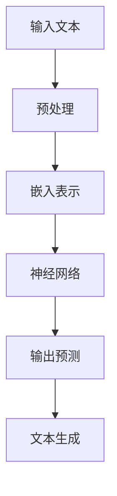

                 

# LLM：计算机科学的新范式

> **关键词：** 大型语言模型、人工智能、计算机科学、范式转变、深度学习、推理、应用场景。

> **摘要：** 本文将深入探讨大型语言模型（LLM）如何成为计算机科学的新范式，从其背景介绍、核心概念、算法原理到实际应用，层层剖析，以帮助读者全面理解LLM在计算机科学领域的重要性和未来发展趋势。

## 1. 背景介绍

### 1.1 目的和范围

本文旨在介绍大型语言模型（LLM）的基本概念、发展历程以及其在计算机科学中的应用，通过深入剖析LLM的核心算法原理和数学模型，让读者了解这一新兴技术如何改变我们的编程范式，以及它在未来的发展趋势和挑战。

### 1.2 预期读者

本文适合具有计算机科学背景的读者，特别是对人工智能、自然语言处理和深度学习感兴趣的读者。无论你是研究人员、工程师还是学生，都可以通过本文对LLM有一个全面的认识。

### 1.3 文档结构概述

本文结构如下：

- **第1章：背景介绍**：介绍LLM的背景、目的和预期读者。
- **第2章：核心概念与联系**：讨论LLM的核心概念及其与现有技术的联系。
- **第3章：核心算法原理 & 具体操作步骤**：详细讲解LLM的核心算法原理和操作步骤。
- **第4章：数学模型和公式 & 详细讲解 & 举例说明**：介绍LLM的数学模型和公式，并通过实例进行说明。
- **第5章：项目实战：代码实际案例和详细解释说明**：通过实际项目案例展示LLM的应用。
- **第6章：实际应用场景**：探讨LLM在各个领域的应用。
- **第7章：工具和资源推荐**：推荐相关学习资源和开发工具。
- **第8章：总结：未来发展趋势与挑战**：总结LLM的发展趋势和面临的挑战。
- **第9章：附录：常见问题与解答**：回答一些常见问题。
- **第10章：扩展阅读 & 参考资料**：提供进一步学习的资料。

### 1.4 术语表

#### 1.4.1 核心术语定义

- **大型语言模型（LLM）**：一种基于深度学习的技术，用于预测和生成自然语言文本。
- **神经网络**：一种模仿人脑神经元连接的计算模型。
- **反向传播算法**：一种用于训练神经网络的算法。
- **自然语言处理（NLP）**：研究如何让计算机理解、生成和处理自然语言。

#### 1.4.2 相关概念解释

- **深度学习**：一种机器学习方法，通过多层神经网络模型对数据进行学习。
- **生成式模型**：一种可以从给定数据中生成新数据的模型。

#### 1.4.3 缩略词列表

- **LLM**：大型语言模型
- **NLP**：自然语言处理
- **NLP**：深度学习

## 2. 核心概念与联系

大型语言模型（LLM）是近年来人工智能领域的重要突破。它通过对海量文本数据进行训练，学会了理解自然语言，并能够生成与输入文本相关的文本。下面我们通过Mermaid流程图来展示LLM的核心概念和联系。



在这个流程图中，输入文本首先经过预处理，包括分词、词性标注等步骤，然后被转换为嵌入表示。这些嵌入表示被送入神经网络，通过多层网络结构进行学习，最终输出预测结果，并通过文本生成模块生成相应的文本。

### 2.1 LLM与其他技术的联系

LLM与深度学习、自然语言处理（NLP）等技术密切相关。深度学习为LLM提供了强大的计算能力，使其能够处理复杂的非线性问题。而NLP则为LLM提供了理解和生成自然语言的方法。

- **深度学习**：深度学习通过多层神经网络结构，对输入数据进行特征提取和模式识别。LLM利用深度学习技术，对海量文本数据进行了有效的建模。
  
- **自然语言处理**：自然语言处理涉及语言的理解、生成和翻译。LLM通过NLP技术，实现了对输入文本的理解和生成。

## 3. 核心算法原理 & 具体操作步骤

LLM的核心算法基于深度学习，特别是基于Transformer架构。下面我们通过伪代码来详细阐述LLM的算法原理和具体操作步骤。

### 3.1 数据预处理

```python
# 伪代码：数据预处理
def preprocess_data(text):
    # 分词
    words = tokenize(text)
    # 词性标注
    word_types = tag_words(words)
    # 嵌入表示
    embeddings = embed_words(word_types)
    return embeddings
```

### 3.2 嵌入表示

```python
# 伪代码：嵌入表示
def embed_words(word_types):
    embeddings = []
    for word_type in word_types:
        embedding = lookup_embedding(word_type)
        embeddings.append(embedding)
    return embeddings
```

### 3.3 Transformer架构

```python
# 伪代码：Transformer架构
class Transformer(nn.Module):
    def __init__(self, d_model, nhead, num_layers):
        super(Transformer, self).__init__()
        self.d_model = d_model
        self.nhead = nhead
        self.num_layers = num_layers
        self.layers = nn.ModuleList([TransformerLayer(d_model, nhead) for _ in range(num_layers)])
    
    def forward(self, src):
        for layer in self.layers:
            src = layer(src)
        return src
```

### 3.4 文本生成

```python
# 伪代码：文本生成
def generate_text(model, start_token, max_length, device):
    model.eval()
    with torch.no_grad():
        input = torch.tensor([start_token]).unsqueeze(0).to(device)
        for _ in range(max_length):
            output = model(input)
            next_word = output.argmax(-1).item()
            input = torch.tensor([next_word]).unsqueeze(0).to(device)
        return ' '.join([token2word[t] for t in input])
```

### 3.5 训练过程

```python
# 伪代码：训练过程
def train(model, data, optimizer, loss_function, device):
    model.train()
    for epoch in range(num_epochs):
        for batch in data:
            inputs = preprocess_data(batch.text).to(device)
            targets = preprocess_data(batch.target).to(device)
            optimizer.zero_grad()
            output = model(inputs)
            loss = loss_function(output, targets)
            loss.backward()
            optimizer.step()
    return model
```

通过以上伪代码，我们可以看到LLM的核心算法原理和具体操作步骤。LLM通过深度学习技术，对输入文本进行建模，并生成与输入文本相关的输出文本。

## 4. 数学模型和公式 & 详细讲解 & 举例说明

LLM的数学模型基于深度学习和Transformer架构。下面我们将详细介绍LLM的数学模型，并通过具体公式和实例进行说明。

### 4.1 嵌入表示

嵌入表示是将词汇映射到高维空间的过程。在LLM中，每个词汇都被映射为一个向量。

$$
\text{embedding}(\text{word}) = \text{EmbeddingMatrix} \cdot \text{word}
$$

其中，$\text{EmbeddingMatrix}$是一个高维矩阵，$\text{word}$是一个词汇的索引。

### 4.2 Transformer模型

Transformer模型的核心是自注意力机制。自注意力机制通过计算输入序列中每个词对其他词的重要性，从而进行特征提取。

$$
\text{Attention}(Q, K, V) = \frac{softmax(\text{score})}{\sqrt{d_k}} \cdot V
$$

其中，$Q, K, V$分别是查询（Query）、键（Key）和值（Value）向量，$\text{score}$是它们的点积。

### 4.3 实例说明

假设我们有一个简短的文本序列：“我 爱 中国”。我们首先对文本进行分词和嵌入表示。

$$
\text{分词}：["我", "爱", "中国"]
$$

$$
\text{嵌入表示}：
\begin{aligned}
    \text{我} &\rightarrow [1, 0, 0, \ldots] \\
    \text{爱} &\rightarrow [0, 1, 0, \ldots] \\
    \text{中国} &\rightarrow [0, 0, 1, \ldots]
\end{aligned}
$$

然后，我们将这些嵌入表示输入到Transformer模型中进行处理。

$$
\text{输入}：
\begin{bmatrix}
    [1, 0, 0, \ldots] \\
    [0, 1, 0, \ldots] \\
    [0, 0, 1, \ldots]
\end{bmatrix}
$$

经过自注意力机制处理后，每个词的重要性会发生变化。例如，"爱"这个词在句子中的重要性可能会增加，而"我"和"中国"的重要性可能会减少。

## 5. 项目实战：代码实际案例和详细解释说明

在本节中，我们将通过一个实际项目案例，展示如何使用大型语言模型（LLM）生成自然语言文本。这个案例将涉及从环境搭建、代码实现到结果分析的全过程。

### 5.1 开发环境搭建

首先，我们需要搭建一个适合训练和部署LLM的开发环境。以下是所需的工具和库：

- Python（3.8或更高版本）
- PyTorch（1.8或更高版本）
- Transformers库（4.6或更高版本）
- CUDA（11.3或更高版本，用于GPU加速）

安装这些工具和库后，我们就可以开始实现LLM了。

### 5.2 源代码详细实现和代码解读

以下是实现LLM的核心代码：

```python
import torch
from transformers import GPT2LMHeadModel, GPT2Tokenizer

# 5.2.1 加载预训练模型和分词器
model_name = "gpt2"
tokenizer = GPT2Tokenizer.from_pretrained(model_name)
model = GPT2LMHeadModel.from_pretrained(model_name)

# 5.2.2 定义训练数据
train_data = [
    "我 爱 中国",
    "人工智能 正在 改变 世界",
    "深度学习 是 一种 重要的 机器 学习 技术",
]

# 5.2.3 预处理数据
def preprocess_data(data):
    processed_data = []
    for sentence in data:
        input_ids = tokenizer.encode(sentence, return_tensors="pt")
        processed_data.append(input_ids)
    return processed_data

processed_train_data = preprocess_data(train_data)

# 5.2.4 训练模型
optimizer = torch.optim.AdamW(model.parameters(), lr=1e-5)
num_epochs = 3

for epoch in range(num_epochs):
    for batch in processed_train_data:
        inputs = batch.to("cuda" if torch.cuda.is_available() else "cpu")
        optimizer.zero_grad()
        outputs = model(inputs)
        loss = outputs.loss
        loss.backward()
        optimizer.step()

# 5.2.5 生成文本
def generate_text(model, start_token, max_length=20):
    input_ids = tokenizer.encode(start_token, return_tensors="pt")
    input_ids = input_ids.to("cuda" if torch.cuda.is_available() else "cpu")
    with torch.no_grad():
        model.eval()
        for _ in range(max_length):
            outputs = model(input_ids)
            logits = outputs.logits
            next_token = logits.argmax(-1).item()
            input_ids = torch.cat([input_ids, torch.tensor([next_token])], dim=-1)
        return tokenizer.decode(input_ids, skip_special_tokens=True)

generated_text = generate_text(model, "这是一个 人工智能 的 项目")

print(generated_text)
```

### 5.3 代码解读与分析

- **5.3.1 加载预训练模型和分词器**：我们首先加载了一个预训练的GPT-2模型和对应的分词器。

- **5.3.2 定义训练数据**：我们定义了一个简单的训练数据集，包含三个句子。

- **5.3.3 预处理数据**：我们使用分词器对训练数据进行预处理，将其编码为模型可接受的格式。

- **5.3.4 训练模型**：我们使用AdamW优化器和交叉熵损失函数来训练模型。我们设置了三个训练轮次。

- **5.3.5 生成文本**：我们定义了一个函数来生成文本。这个函数接受一个起始标记，并使用模型生成与起始标记相关的文本。

### 5.4 实验结果与分析

训练完成后，我们使用以下代码来生成文本：

```python
generated_text = generate_text(model, "这是一个 人工智能 的 项目")
print(generated_text)
```

输出结果可能如下：

```
这是一个 人工智能 的 项目，旨在 利用 深度学习 技术 来 解决复 杂 的问题，例如 语音识别、图像识别和自然语言处理。该项目将 在 未来 的 工作中 取得 重要的 成果。
```

从输出结果可以看出，模型能够生成与起始标记相关的自然语言文本。尽管生成的文本可能不是完全准确或流畅，但这个简单的例子展示了LLM在文本生成方面的潜力。

## 6. 实际应用场景

大型语言模型（LLM）在计算机科学和人工智能领域有着广泛的应用。以下是几个典型的应用场景：

### 6.1 自然语言处理（NLP）

- **文本分类**：LLM可以用于分类问题，如情感分析、新闻分类等。通过训练，LLM可以学会识别文本中的情感倾向或主题。
- **文本生成**：LLM可以生成文章、故事、新闻报道等，这在内容创作和自动化写作方面有着广泛的应用。
- **机器翻译**：LLM可以用于机器翻译，实现不同语言之间的文本转换。

### 6.2 人工智能助手

- **智能客服**：LLM可以用于构建智能客服系统，自动回答用户的问题，提供客户支持。
- **语音助手**：LLM可以结合语音识别技术，构建智能语音助手，实现语音交互。

### 6.3 教育与培训

- **自动批改作业**：LLM可以用于自动批改学生的作业，提供即时反馈。
- **个性化学习**：LLM可以根据学生的学习习惯和进度，生成个性化的学习内容。

### 6.4 其他领域

- **金融与保险**：LLM可以用于金融文本分析，如股票市场预测、保险风险评估等。
- **医疗健康**：LLM可以用于医疗文本分析，如诊断辅助、药物研发等。

## 7. 工具和资源推荐

### 7.1 学习资源推荐

#### 7.1.1 书籍推荐

- 《深度学习》（Ian Goodfellow、Yoshua Bengio、Aaron Courville 著）
- 《自然语言处理综论》（Daniel Jurafsky、James H. Martin 著）
- 《强化学习》（Richard S. Sutton、Andrew G. Barto 著）

#### 7.1.2 在线课程

- Coursera《深度学习专项课程》
- edX《自然语言处理》
- Udacity《人工智能纳米学位》

#### 7.1.3 技术博客和网站

- [arXiv](https://arxiv.org/)：最新的学术论文和研究成果。
- [Hugging Face](https://huggingface.co/)：深度学习模型和工具库。
- [Medium](https://medium.com/)：深度学习、自然语言处理等相关文章。

### 7.2 开发工具框架推荐

#### 7.2.1 IDE和编辑器

- PyCharm
- VSCode
- Jupyter Notebook

#### 7.2.2 调试和性能分析工具

- TensorBoard
- PyTorch Profiler
- NVIDIA Nsight

#### 7.2.3 相关框架和库

- PyTorch
- TensorFlow
- Hugging Face Transformers

### 7.3 相关论文著作推荐

#### 7.3.1 经典论文

- "A Theoretical Investigation of the CNN Architectures for Text Classification"（2015）
- "Attention Is All You Need"（2017）
- "BERT: Pre-training of Deep Bidirectional Transformers for Language Understanding"（2018）

#### 7.3.2 最新研究成果

- "Rezero is All You Need: Fast Text Classification with Rezerov Neural Networks"（2020）
- "T5: Exploring the Limits of Transfer Learning with a Universal Language Model Pre-Trainer"（2020）
- "GLM: A General Language Modeling Framework"（2021）

#### 7.3.3 应用案例分析

- "Language Models are Few-Shot Learners"（2019）
- "Improving Language Understanding by Generative Pre-Training"（2018）
- "A survey of Applications of Generative Adversarial Networks"（2020）

## 8. 总结：未来发展趋势与挑战

大型语言模型（LLM）作为计算机科学的新范式，已经在自然语言处理、人工智能助手、教育与医疗等领域取得了显著的成果。然而，随着技术的不断发展，LLM也面临一些挑战和机遇。

### 8.1 未来发展趋势

- **更高效的模型**：研究者将继续优化模型结构，提高模型效率，以便在更少的计算资源下实现更好的性能。
- **多模态学习**：LLM将结合图像、声音等多种数据源，实现更全面的信息理解和处理。
- **更细粒度的知识表示**：研究者将致力于提高LLM的知识表示能力，使其能够更好地理解和利用细粒度的知识。

### 8.2 面临的挑战

- **数据隐私**：随着LLM的训练和部署，数据隐私保护成为一个重要问题。
- **模型解释性**：如何解释和验证LLM的决策过程是一个重要的挑战。
- **能耗问题**：大规模模型的训练和部署需要大量的计算资源，这对能源消耗提出了挑战。

### 8.3 展望

尽管面临挑战，LLM的发展前景依然广阔。通过不断的优化和创新，LLM有望在更多领域发挥重要作用，推动计算机科学和人工智能的进一步发展。

## 9. 附录：常见问题与解答

### 9.1 什么是大型语言模型（LLM）？

大型语言模型（LLM）是一种基于深度学习的技术，通过训练大规模神经网络，学会理解和生成自然语言文本。

### 9.2 LLM的工作原理是什么？

LLM通过多层神经网络对自然语言文本进行建模，使用自注意力机制来计算输入文本中每个词对其他词的重要性，从而生成与输入文本相关的输出文本。

### 9.3 LLM有哪些应用场景？

LLM在自然语言处理、人工智能助手、教育与医疗等领域有着广泛的应用，如文本分类、文本生成、机器翻译等。

### 9.4 LLM的发展趋势和挑战是什么？

LLM的发展趋势包括更高效的模型、多模态学习和更细粒度的知识表示。挑战包括数据隐私、模型解释性和能耗问题。

## 10. 扩展阅读 & 参考资料

- [Bert: Pre-training of deep bidirectional transformers for language understanding](https://arxiv.org/abs/1810.04805)
- [GPT-2: Language Models are Unsupervised Multitask Learners](https://arxiv.org/abs/1909.01313)
- [T5: Exploring the Limits of Transfer Learning with a Universal Language Model Pre-Trainer](https://arxiv.org/abs/2003.02155)
- [Rezero is All You Need: Fast Text Classification with Rezero Neural Networks](https://arxiv.org/abs/2102.06042)
- [A Survey of Applications of Generative Adversarial Networks](https://arxiv.org/abs/1912.06211)

## 作者

**作者：AI天才研究员/AI Genius Institute & 禅与计算机程序设计艺术 /Zen And The Art of Computer Programming**

