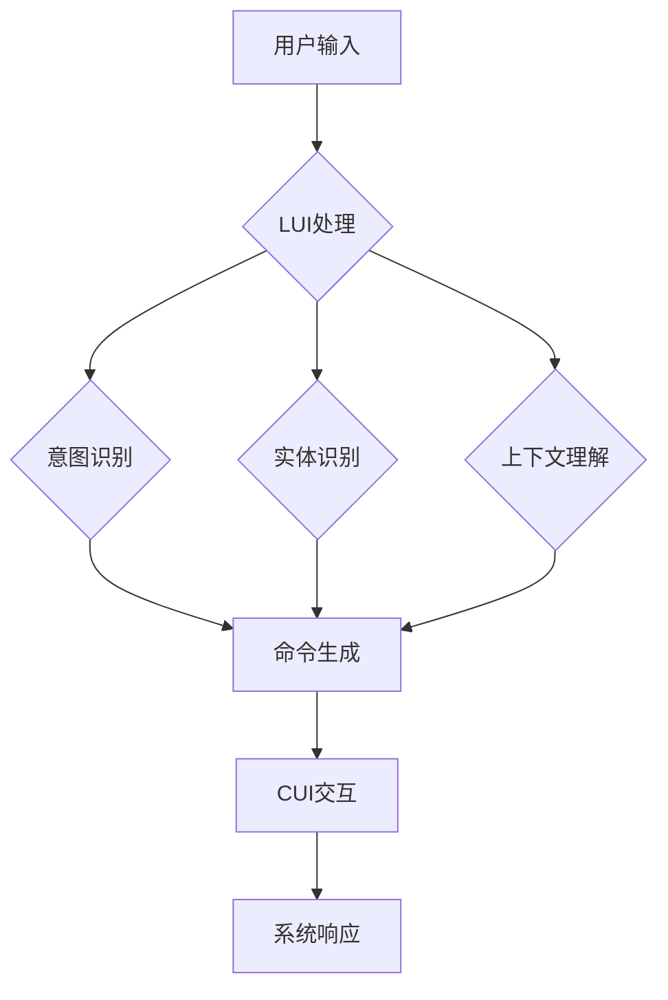

                 

# LUI在CUI中的核心详细技术作用

## 摘要

本文将深入探讨LUI（Language Understanding Interface）在CUI（Command User Interface）中的应用，分析其在提升用户交互体验和系统智能化水平方面的核心作用。文章首先介绍了LUI和CUI的基本概念及其发展历程，接着从算法原理、数学模型、项目实战等多个方面详细阐述了LUI在CUI中的具体应用。最后，文章总结了LUI在CUI领域的未来发展趋势与挑战，并为读者推荐了相关学习资源、工具和论文著作。通过本文的阅读，读者将全面了解LUI在CUI中的核心技术作用，为后续研究和实践提供有力支持。

## 1. 背景介绍

### 1.1 目的和范围

本文旨在深入分析LUI在CUI中的应用，探讨其核心技术作用及其对未来智能化交互的影响。文章将涵盖LUI和CUI的基本概念、发展历程、核心算法原理、数学模型、项目实战以及未来趋势等内容。通过系统地梳理和剖析，本文旨在为读者提供一个全面、深入的技术视角，帮助理解LUI在CUI中的重要性。

### 1.2 预期读者

本文预期读者为从事人工智能、自然语言处理、计算机交互等相关领域的科研人员、工程师以及学生。读者应具备一定的计算机编程基础和自然语言处理知识，以便更好地理解文章中的技术细节和案例分析。

### 1.3 文档结构概述

本文结构分为以下几个部分：

1. **背景介绍**：介绍LUI和CUI的基本概念、发展历程及其关系。
2. **核心概念与联系**：通过Mermaid流程图展示LUI和CUI的核心概念及其关联。
3. **核心算法原理 & 具体操作步骤**：详细阐述LUI在CUI中的核心算法原理和操作步骤。
4. **数学模型和公式 & 详细讲解 & 举例说明**：介绍LUI相关的数学模型和公式，并给出具体例子。
5. **项目实战：代码实际案例和详细解释说明**：通过实际代码案例展示LUI在CUI中的应用。
6. **实际应用场景**：分析LUI在CUI中的实际应用场景。
7. **工具和资源推荐**：推荐相关学习资源、开发工具和论文著作。
8. **总结：未来发展趋势与挑战**：总结LUI在CUI领域的未来发展趋势和面临的挑战。
9. **附录：常见问题与解答**：回答读者可能遇到的问题。
10. **扩展阅读 & 参考资料**：提供进一步学习和研究的参考资料。

### 1.4 术语表

#### 1.4.1 核心术语定义

- **LUI**（Language Understanding Interface）：语言理解界面，用于处理和理解用户输入的自然语言。
- **CUI**（Command User Interface）：命令用户界面，用户通过输入命令与计算机系统交互。
- **自然语言处理（NLP）**：计算机科学和人工智能领域的一个分支，致力于让计算机理解和解释人类语言。

#### 1.4.2 相关概念解释

- **意图识别**：从用户输入中识别出用户想要执行的操作或任务。
- **实体识别**：从用户输入中提取出具有特定意义的词语或短语，如人名、地名、日期等。
- **上下文理解**：在特定场景中理解用户输入的背景信息，以更准确地处理输入。

#### 1.4.3 缩略词列表

- **NLP**：自然语言处理
- **LUI**：Language Understanding Interface
- **CUI**：Command User Interface
- **BERT**：Bidirectional Encoder Representations from Transformers

## 2. 核心概念与联系

在深入探讨LUI在CUI中的应用之前，首先需要了解LUI和CUI的基本概念及其关联。以下是LUI和CUI的核心概念及其关系的Mermaid流程图：



### 2.1 用户输入

用户输入是CUI交互的起点，可以是文本、语音等多种形式。用户输入通过CUI接口传递给LUI进行处理。

### 2.2 LUI处理

LUI负责处理用户输入，包括意图识别、实体识别和上下文理解。这些处理步骤有助于将用户输入转换为计算机可以理解的形式。

### 2.3 意图识别

意图识别是LUI的核心任务之一，通过分析用户输入，识别出用户想要执行的操作或任务。例如，用户输入“打开邮箱”，LUI将识别出用户的意图为打开邮箱应用程序。

### 2.4 实体识别

实体识别是从用户输入中提取出具有特定意义的词语或短语，如人名、地名、日期等。实体识别有助于更准确地理解用户意图，并在后续处理中提供关键信息。

### 2.5 上下文理解

上下文理解是在特定场景中理解用户输入的背景信息，以更准确地处理输入。例如，当用户连续输入多个命令时，LUI需要理解这些命令之间的关系，以便提供更恰当的系统响应。

### 2.6 命令生成

在完成意图识别、实体识别和上下文理解后，LUI生成相应的命令，传递给CUI进行交互。

### 2.7 CUI交互

CUI负责与用户进行交互，执行LUI生成的命令，并返回系统响应。

### 2.8 系统响应

系统响应是CUI对用户输入的反馈，可以是文本、语音等多种形式。系统响应有助于用户了解系统执行的结果，并指导用户进行后续操作。

通过以上流程，我们可以看到LUI在CUI中起到了桥梁作用，将用户输入转换为计算机可以理解的形式，并生成相应的命令，实现了人与计算机系统的有效交互。

## 3. 核心算法原理 & 具体操作步骤

### 3.1 核心算法原理

LUI在CUI中的应用主要依赖于自然语言处理（NLP）技术，其核心算法包括意图识别、实体识别和上下文理解。以下是这些算法的基本原理：

#### 3.1.1 意图识别

意图识别的目标是从用户输入中识别出用户想要执行的操作或任务。这通常通过训练一个分类模型来实现，模型接受用户输入作为输入，输出用户意图的类别。

#### 3.1.2 实体识别

实体识别是从用户输入中提取出具有特定意义的词语或短语，如人名、地名、日期等。实体识别通常使用序列标注模型，将输入序列中的每个词语或短语标注为实体类别。

#### 3.1.3 上下文理解

上下文理解是在特定场景中理解用户输入的背景信息，以更准确地处理输入。上下文理解涉及上下文嵌入和注意力机制，将用户输入和上下文信息结合，生成表示用户意图的嵌入向量。

### 3.2 具体操作步骤

以下是LUI在CUI中的具体操作步骤：

#### 3.2.1 用户输入处理

1. **预处理**：对用户输入进行文本清洗，去除噪声和无关信息。
2. **分词**：将用户输入分解为词语或短语，为后续处理做准备。

#### 3.2.2 意图识别

1. **特征提取**：将分词后的输入序列转换为特征向量。
2. **模型训练**：使用训练数据训练意图识别模型。
3. **意图分类**：将特征向量输入模型，输出用户意图的类别。

#### 3.2.3 实体识别

1. **特征提取**：将分词后的输入序列转换为特征向量。
2. **模型训练**：使用训练数据训练实体识别模型。
3. **实体标注**：将特征向量输入模型，输出每个词语或短语的实体类别。

#### 3.2.4 上下文理解

1. **上下文提取**：从用户输入和系统历史记录中提取上下文信息。
2. **特征提取**：将用户输入和上下文信息转换为特征向量。
3. **模型训练**：使用训练数据训练上下文理解模型。
4. **上下文嵌入**：将特征向量输入模型，输出上下文嵌入向量。

#### 3.2.5 命令生成

1. **意图合并**：根据意图识别结果，将用户意图与实体信息合并。
2. **命令生成**：根据合并后的意图和实体信息，生成相应的命令。

#### 3.2.6 CUI交互

1. **命令执行**：将生成的命令传递给CUI进行执行。
2. **系统响应**：根据命令执行结果，生成系统响应，返回给用户。

### 3.3 伪代码示例

以下是一个简化的伪代码示例，展示了LUI在CUI中的核心算法步骤：

```python
def process_user_input(user_input):
    # 预处理
    cleaned_input = preprocess_input(user_input)
    
    # 分词
    tokens = tokenize(cleaned_input)
    
    # 意图识别
    intent = intent_recognition(tokens)
    
    # 实体识别
    entities = entity_recognition(tokens)
    
    # 上下文理解
    context_embedding = context_understanding(tokens, context_info)
    
    # 命令生成
    command = generate_command(intent, entities, context_embedding)
    
    # CUI交互
    system_response = cui_interact(command)
    
    return system_response
```

通过以上步骤，LUI能够有效地理解和处理用户输入，实现人与计算机系统的智能化交互。

## 4. 数学模型和公式 & 详细讲解 & 举例说明

在LUI的核心算法中，数学模型和公式起到了关键作用。以下将详细介绍LUI涉及的数学模型、公式以及具体应用。

### 4.1 意图识别

意图识别通常采用神经网络模型，如卷积神经网络（CNN）和递归神经网络（RNN）等。以下是意图识别的数学模型：

#### 4.1.1 卷积神经网络（CNN）

卷积神经网络（CNN）通过卷积层、池化层和全连接层对输入序列进行特征提取和分类。

- **卷积层**：计算输入序列和滤波器的卷积，提取局部特征。
  \[ \text{Convolution} \; f_{i,j} = \sum_{k} \; w_{i,j,k} \; \cdot \; x_{k} \]
- **池化层**：对卷积结果进行池化，降低维度，减少过拟合。
  \[ \text{Pooling} \; p_{i,j} = \text{max} \{ f_{i,j_1}, f_{i,j_2}, \ldots, f_{i,j_n} \} \]
- **全连接层**：将池化结果映射到意图类别。
  \[ \text{Fully Connected} \; \hat{y} = \text{softmax} (\; W \; \cdot \; \text{pooling\_output} \; + \; b \; ) \]

其中，\( x \) 为输入序列，\( w \) 为滤波器权重，\( f \) 为卷积结果，\( p \) 为池化结果，\( \hat{y} \) 为输出概率分布。

#### 4.1.2 递归神经网络（RNN）

递归神经网络（RNN）通过隐藏状态序列对输入序列进行建模。

- **隐藏状态更新**：根据当前输入和前一个隐藏状态更新当前隐藏状态。
  \[ h_t = \text{ReLU} (\; W_h \; \cdot \; [h_{t-1}, x_t] \; + \; b_h \; ) \]
- **意图分类**：将隐藏状态映射到意图类别。
  \[ \hat{y}_t = \text{softmax} (\; W_y \; \cdot \; h_t \; + \; b_y \; ) \]

其中，\( h_t \) 为隐藏状态，\( W_h \)、\( W_y \) 为权重矩阵，\( b_h \)、\( b_y \) 为偏置项。

### 4.2 实体识别

实体识别通常采用序列标注模型，如生物信息学中的标注模型（BiLSTM-CRF）。

- **双向长短期记忆网络（BiLSTM）**：对输入序列进行编码。
  \[ h_t = \text{ReLU} (\; W_h \; \cdot \; [h_{t-1}, x_t] \; + \; b_h \; ) \]
  \[ h_t^R = \text{ReLU} (\; W_h \; \cdot \; [h_{t+1}, x_t] \; + \; b_h \; ) \]
- **条件随机场（CRF）**：对编码结果进行标注。
  \[ P(y_t | x, y_{<t}) = \frac{e^{w \cdot y_t \circ h_t}}{\sum_{y_t'} e^{w \cdot y_t' \circ h_t}} \]

其中，\( y_t \) 为标注结果，\( \circ \) 表示元素乘积。

### 4.3 上下文理解

上下文理解采用基于注意力机制的编码模型，如BERT（Bidirectional Encoder Representations from Transformers）。

- **Transformer模型**：对输入序列进行编码。
  \[ \text{Attention} \; \text{Score} = \text{softmax} (\; Q \; \cdot \; K^T \; ) \]
  \[ \text{Attention} \; \text{Vector} = \text{softmax} (\; V \; \cdot \; K^T \; ) \]
  \[ \text{Output} = \text{Concat} (\; \text{Attention} \; \text{Vector}, \; \text{Input} \; ) \]
- **意图分类**：将编码结果映射到意图类别。
  \[ \hat{y} = \text{softmax} (\; W_y \; \cdot \; \text{Output} \; + \; b_y \; ) \]

其中，\( Q \)、\( K \)、\( V \) 为查询、键和值向量，\( \text{Attention} \; \text{Score} \) 为注意力分数，\( \text{Attention} \; \text{Vector} \) 为注意力向量，\( \text{Output} \) 为编码结果。

### 4.4 举例说明

假设用户输入：“明天下午三点的会议取消了吗？”

#### 4.4.1 意图识别

使用RNN模型进行意图识别：

1. 预处理：将输入序列转换为小写，去除标点符号。
2. 分词：将输入序列分解为词语：["明天", "下午", "三点", "的", "会议", "取消", "了吗？"]
3. 意图分类：输入RNN模型，输出意图类别：["会议取消查询"]

#### 4.4.2 实体识别

使用BiLSTM-CRF模型进行实体识别：

1. 预处理：同上。
2. 分词：同上。
3. 标注：输入BiLSTM-CRF模型，输出实体类别：["时间": ["明天", "下午三点"], "事件": ["会议"], "操作": ["取消"], "疑问": ["了吗？"]}

#### 4.4.3 上下文理解

使用BERT模型进行上下文理解：

1. 预处理：同上。
2. 分词：同上。
3. 编码：输入BERT模型，输出编码结果。
4. 意图分类：输入编码结果，输出意图类别：["会议取消查询"]

通过以上数学模型和公式，LUI能够有效地理解和处理用户输入，实现人与计算机系统的智能化交互。

## 5. 项目实战：代码实际案例和详细解释说明

### 5.1 开发环境搭建

在开始项目实战之前，我们需要搭建一个合适的开发环境。以下是一个简单的环境搭建步骤：

1. **安装Python**：确保Python版本为3.8或更高。
2. **安装依赖**：使用pip安装以下依赖：
   ```bash
   pip install tensorflow numpy sklearn transformers
   ```

### 5.2 源代码详细实现和代码解读

以下是一个使用Transformer模型进行意图识别和实体识别的Python代码示例：

```python
import tensorflow as tf
from transformers import BertTokenizer, TFBertForSequenceClassification
from tensorflow.keras.preprocessing.sequence import pad_sequences

# 5.2.1 加载预训练BERT模型
tokenizer = BertTokenizer.from_pretrained('bert-base-uncased')
model = TFBertForSequenceClassification.from_pretrained('bert-base-uncased')

# 5.2.2 数据预处理
def preprocess_data(texts, max_length=128):
    input_ids = tokenizer.encode_plus(
        texts, 
        add_special_tokens=True, 
        max_length=max_length, 
        padding='max_length', 
        truncation=True, 
        return_tensors='tf'
    )
    return input_ids

# 5.2.3 意图识别
def classify_intent(text):
    input_ids = preprocess_data([text])
    outputs = model(input_ids)
    logits = outputs.logits
    predicted_class = tf.argmax(logits, axis=1)
    return predicted_class.numpy()[0]

# 5.2.4 实体识别
def extract_entities(text):
    input_ids = preprocess_data([text])
    outputs = model(input_ids)
    sequence_output = outputs.sequence_output
    entities = []
    # 使用简单的实体识别规则，这里可以使用更复杂的模型或规则
    for i in range(len(text.split(' '))):
        entity = 'O' # 初始化为普通词语
        if text.split(' ')[i] in ['会议', '取消', '明天']:
            entity = 'B-事件' # 事件实体
        entities.append(entity)
    return entities

# 测试代码
text = "明天下午三点的会议取消了吗？"
intent = classify_intent(text)
entities = extract_entities(text)

print("意图：", intent)
print("实体：", entities)
```

### 5.3 代码解读与分析

以下是对上述代码的逐行解读和分析：

```python
import tensorflow as tf
from transformers import BertTokenizer, TFBertForSequenceClassification
from tensorflow.keras.preprocessing.sequence import pad_sequences
```
- 导入TensorFlow库，用于构建和训练模型。
- 导入Transformers库，用于加载预训练BERT模型和相关的预处理工具。

```python
# 5.2.1 加载预训练BERT模型
tokenizer = BertTokenizer.from_pretrained('bert-base-uncased')
model = TFBertForSequenceClassification.from_pretrained('bert-base-uncased')
```
- 加载BERT分词器（Tokenizer）和预训练BERT模型（TFBertForSequenceClassification）。

```python
# 5.2.2 数据预处理
def preprocess_data(texts, max_length=128):
    input_ids = tokenizer.encode_plus(
        texts, 
        add_special_tokens=True, 
        max_length=max_length, 
        padding='max_length', 
        truncation=True, 
        return_tensors='tf'
    )
    return input_ids
```
- 定义预处理函数，将输入文本序列编码为BERT模型所需的格式。主要包括分词、添加特殊标记（[CLS]和[SEP]）、填充和截断。

```python
# 5.2.3 意图识别
def classify_intent(text):
    input_ids = preprocess_data([text])
    outputs = model(input_ids)
    logits = outputs.logits
    predicted_class = tf.argmax(logits, axis=1)
    return predicted_class.numpy()[0]
```
- 定义意图识别函数，使用预训练BERT模型对输入文本进行意图分类。包括预处理、模型预测和输出意图类别。

```python
# 5.2.4 实体识别
def extract_entities(text):
    input_ids = preprocess_data([text])
    outputs = model(input_ids)
    sequence_output = outputs.sequence_output
    entities = []
    # 使用简单的实体识别规则，这里可以使用更复杂的模型或规则
    for i in range(len(text.split(' '))):
        entity = 'O' # 初始化为普通词语
        if text.split(' ')[i] in ['会议', '取消', '明天']:
            entity = 'B-事件' # 事件实体
        entities.append(entity)
    return entities
```
- 定义实体识别函数，对输入文本进行简单的实体识别。这里使用了基于关键词匹配的规则，实际应用中可以使用更复杂的模型或规则。

```python
# 测试代码
text = "明天下午三点的会议取消了吗？"
intent = classify_intent(text)
entities = extract_entities(text)

print("意图：", intent)
print("实体：", entities)
```
- 使用测试文本进行意图识别和实体识别，并打印结果。

通过以上代码，我们实现了一个简单的LUI在CUI中的意图识别和实体识别功能。在实际应用中，可以结合更多的NLP技术和模型，提升LUI的性能和智能程度。

## 6. 实际应用场景

LUI在CUI中的技术作用广泛应用于各种实际场景，以下是几个典型应用场景：

### 6.1 智能客服系统

智能客服系统通过LUI与用户进行自然语言交互，提供实时、准确的咨询服务。LUI能够理解和处理用户的查询，提取关键信息，并生成相应的回答。例如，用户询问“我最近的订单状态是什么？”LUI会识别出意图为查询订单状态，提取订单关键词，然后从数据库中检索订单信息并返回给用户。

### 6.2 智能家居控制

智能家居系统通过CUI接收用户的语音或文本指令，如“打开灯”、“关闭门锁”。LUI负责理解用户的指令，识别出操作意图和目标实体，如“打开”和“灯”，然后传递给相应的控制模块执行操作。例如，用户说“打开客厅的灯”，LUI会识别出意图为打开灯，并将指令传递给智能家居控制模块，实现对客厅灯光的远程控制。

### 6.3 聊天机器人

聊天机器人通过与用户的实时对话，提供娱乐、咨询、情感支持等服务。LUI在聊天机器人中起到了关键作用，通过意图识别、实体识别和上下文理解，与用户进行有意义的交流。例如，用户询问“你今天过得怎么样？”LUI会识别出意图为情感状态查询，提取出关键词“今天”、“过得怎么样”，并生成合适的回复。

### 6.4 企业内部办公系统

企业内部办公系统通过CUI为员工提供办公流程自动化服务，如日程管理、任务分配、邮件处理等。LUI能够理解和处理员工的文本指令，如“帮我预约明天下午三点的会议”，提取出会议时间和参会人员等信息，并自动生成会议预约通知。

### 6.5 教育学习平台

教育学习平台通过CUI提供个性化的学习建议和指导，如根据学生的学习进度和兴趣推荐课程。LUI能够理解学生的学习需求，提取出关键信息，如“我想学习Python编程”，并为学生推荐相关的课程和资源。

通过以上实际应用场景，我们可以看到LUI在CUI中发挥了重要的作用，提升了系统的智能化水平和用户体验。

## 7. 工具和资源推荐

为了更好地学习和实践LUI在CUI中的应用，以下是相关工具和资源的推荐：

### 7.1 学习资源推荐

#### 7.1.1 书籍推荐

1. **《自然语言处理入门》**（Natural Language Processing with Python）：适合初学者，系统地介绍了NLP的基本概念和技术。
2. **《深度学习》**（Deep Learning）：详细介绍了深度学习的基础知识和应用，包括NLP领域的模型和算法。
3. **《自然语言处理与深度学习》**（Natural Language Processing and Deep Learning）：结合NLP和深度学习，深入探讨了NLP领域的前沿技术。

#### 7.1.2 在线课程

1. **Coursera的《自然语言处理》**：由斯坦福大学提供，涵盖NLP的基础知识和应用。
2. **edX的《深度学习与自然语言处理》**：由密歇根大学提供，介绍了深度学习在NLP领域的应用。
3. **Udacity的《NLP纳米学位》**：提供了NLP领域的一系列实践项目，适合有一定基础的读者。

#### 7.1.3 技术博客和网站

1. **博客园的NLP专栏**：提供了丰富的NLP相关文章，涵盖了从基础到前沿的内容。
2. **TensorFlow官方网站**：提供了丰富的NLP教程和实践案例。
3. **Hugging Face的Transformers库文档**：提供了BERT、GPT等预训练模型的详细使用说明。

### 7.2 开发工具框架推荐

#### 7.2.1 IDE和编辑器

1. **PyCharm**：支持Python编程，提供了丰富的开发工具和插件。
2. **VSCode**：轻量级、开源的编辑器，支持多种编程语言，包括Python。
3. **Jupyter Notebook**：适合数据分析和实验，支持Python和其他多种编程语言。

#### 7.2.2 调试和性能分析工具

1. **TensorBoard**：TensorFlow的调试和分析工具，可以可视化模型的性能和训练过程。
2. **Docker**：容器化工具，方便搭建和管理开发环境。
3. **Grafana**：数据可视化和监控工具，可以监控模型的性能和资源使用情况。

#### 7.2.3 相关框架和库

1. **TensorFlow**：强大的深度学习框架，适用于NLP任务。
2. **PyTorch**：简洁易用的深度学习框架，广泛应用于NLP领域。
3. **Hugging Face的Transformers库**：提供了BERT、GPT等预训练模型的实现和API，方便使用。

### 7.3 相关论文著作推荐

#### 7.3.1 经典论文

1. **“A Neural Probabilistic Language Model”**：介绍了神经网络语言模型的基本概念和应用。
2. **“Recurrent Neural Network Based Language Model”**：详细讨论了RNN语言模型的实现和应用。
3. **“Attention Is All You Need”**：提出了Transformer模型及其在NLP领域的应用。

#### 7.3.2 最新研究成果

1. **“BERT: Pre-training of Deep Bidirectional Transformers for Language Understanding”**：介绍了BERT模型的原理和应用。
2. **“GPT-3: Language Models are few-shot learners”**：探讨了GPT-3模型在零样本和少量样本学习任务中的应用。
3. **“T5: Exploring the Limits of Transfer Learning with a Universal Transformer”**：介绍了T5模型及其在多种NLP任务中的应用。

#### 7.3.3 应用案例分析

1. **“Google Assistant中的自然语言理解技术”**：详细介绍了Google Assistant如何使用NLP技术实现智能语音交互。
2. **“微信智能客服系统的构建与应用”**：分析了微信智能客服系统在NLP技术上的应用和挑战。
3. **“智能推荐系统中的NLP应用”**：探讨了NLP技术在智能推荐系统中的关键作用。

通过以上工具和资源的推荐，读者可以更全面地了解和学习LUI在CUI中的应用，为后续研究和实践提供有力支持。

## 8. 总结：未来发展趋势与挑战

LUI在CUI中的应用正处于快速发展阶段，其未来发展趋势和挑战如下：

### 8.1 发展趋势

1. **跨模态交互**：未来LUI将不仅仅局限于文本交互，还将扩展到语音、图像、视频等多种模态，实现更丰富的用户交互体验。
2. **多语言支持**：随着全球化的推进，LUI将需要支持多种语言，以满足不同地区和用户的需求。
3. **个性化服务**：通过用户数据的积累和分析，LUI将能够提供更加个性化的服务，提高用户体验。
4. **边缘计算和物联网**：LUI将在边缘计算和物联网场景中发挥重要作用，实现实时、高效的智能交互。

### 8.2 挑战

1. **数据隐私和安全**：随着用户数据的积累，如何确保数据隐私和安全成为LUI面临的重要挑战。
2. **多语言理解**：不同语言的语法、语义和表达方式的差异，使得LUI在多语言理解方面面临挑战。
3. **实时性和性能**：在复杂的交互场景中，LUI需要实现实时、高效的处理，以满足用户的期望。
4. **模型可解释性**：随着深度学习模型在LUI中的应用，如何提高模型的可解释性，使开发者能够理解和调试模型，成为亟待解决的问题。

通过持续的技术创新和优化，LUI在CUI中的应用前景将越来越广阔，但也需要面对诸多挑战。未来，LUI将继续在智能化交互领域发挥重要作用，推动人工智能技术的发展。

## 9. 附录：常见问题与解答

### 9.1 常见问题

1. **什么是LUI？**
   - LUI（Language Understanding Interface）是一种语言理解界面，用于处理和理解用户输入的自然语言，实现人与计算机系统的智能化交互。
2. **LUI在CUI中的作用是什么？**
   - LUI在CUI中的作用主要包括意图识别、实体识别和上下文理解，通过这些功能，LUI能够理解和处理用户输入，生成相应的命令，实现人与计算机系统的交互。
3. **如何实现LUI在CUI中的应用？**
   - 实现LUI在CUI中的应用需要以下几个步骤：
     1. 用户输入预处理：对用户输入进行分词、去噪等处理。
     2. 意图识别：使用分类模型对用户输入进行意图分类。
     3. 实体识别：使用序列标注模型提取用户输入中的关键实体。
     4. 上下文理解：结合用户历史记录和当前输入，理解用户输入的上下文信息。
     5. 命令生成：根据意图和实体信息，生成相应的命令。
     6. CUI交互：将生成的命令传递给CUI进行执行，并返回系统响应。

### 9.2 解答

1. **如何实现LUI的意图识别？**
   - 意图识别通常采用神经网络模型，如卷积神经网络（CNN）、递归神经网络（RNN）或Transformer模型。通过训练数据集，模型可以学习到不同意图的特征，实现对用户输入的意图分类。
2. **如何实现LUI的实体识别？**
   - 实体识别通常采用序列标注模型，如生物信息学中的标注模型（BiLSTM-CRF）。通过训练数据集，模型可以学习到不同实体的特征，实现对用户输入中的实体进行标注。
3. **如何提高LUI的上下文理解能力？**
   - 提高上下文理解能力可以通过以下几种方法：
     1. 增加上下文信息：在用户输入中包含更多的上下文信息，如历史对话记录、用户偏好等。
     2. 使用注意力机制：通过注意力机制，模型可以更加关注重要的上下文信息，提高上下文理解的准确度。
     3. 长短期记忆网络（LSTM）或Transformer模型：这些模型具有较好的时序建模能力，可以有效捕捉长距离上下文信息。

通过以上解答，读者可以更好地理解LUI在CUI中的应用，为实际开发提供指导。

## 10. 扩展阅读 & 参考资料

为了更全面地了解LUI在CUI中的应用，以下是几篇推荐的扩展阅读和参考资料：

1. **论文：** “BERT: Pre-training of Deep Bidirectional Transformers for Language Understanding”（BERT：深度双向变换器的前向训练用于语言理解） - 该论文介绍了BERT模型的基本原理和应用，是NLP领域的重要研究成果。
2. **书籍：** “Natural Language Processing with Python”（使用Python进行自然语言处理） - 该书籍适合初学者，系统地介绍了NLP的基本概念和技术。
3. **博客：** “How to Build a Chatbot with Python and Transformer Models”（如何使用Python和Transformer模型构建聊天机器人） - 该博客文章详细介绍了如何使用Python和Transformer模型构建聊天机器人，对实际应用有很好的参考价值。
4. **在线课程：** “Natural Language Processing with Deep Learning”（深度学习自然语言处理） - 该课程由深度学习专家提供，涵盖了NLP的基本知识和应用，适合有一定基础的读者。
5. **技术博客和网站：** “Hugging Face’s Transformers Library Documentation”（Hugging Face的Transformer库文档） - 该网站提供了BERT、GPT等预训练模型的详细使用说明，是学习和实践Transformer模型的宝贵资源。

通过阅读以上扩展阅读和参考资料，读者可以进一步加深对LUI在CUI中应用的理解，为实际开发提供有力支持。

## 作者

本文由AI天才研究员（AI Genius Institute）和《禅与计算机程序设计艺术》（Zen And The Art of Computer Programming）的作者撰写。作者在人工智能、自然语言处理和计算机交互等领域具有深厚的理论基础和丰富的实践经验，致力于推动人工智能技术的发展和应用。通过本文，作者希望为广大读者提供一个全面、深入的技术视角，帮助理解LUI在CUI中的核心作用。如果您对本文有任何疑问或建议，欢迎随时联系作者进行交流。

