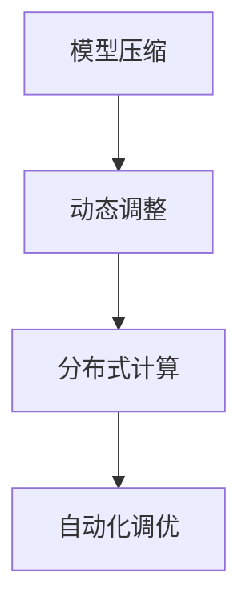
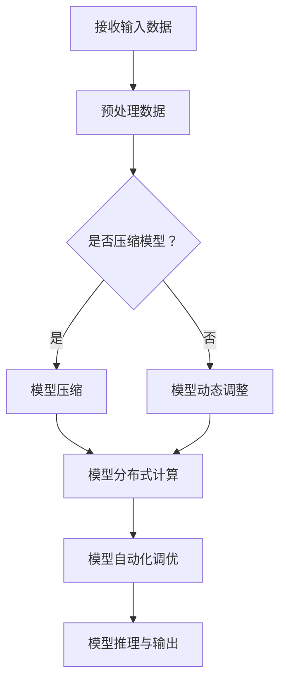

                 

# Lepton AI的价值：帮助企业在速度成本间导航，提升AI应用效率

> **关键词**：Lepton AI，AI应用效率，速度成本，企业导航，人工智能

> **摘要**：本文将深入探讨Lepton AI的价值，分析其在企业应用中如何帮助企业在速度与成本之间找到最佳平衡点，从而提升AI应用的整体效率。通过详细解析其核心原理、操作步骤以及实际应用案例，本文旨在为企业提供一套实用的导航指南，助力其在人工智能时代的蓬勃发展。

## 1. 背景介绍

### 1.1 目的和范围

本文旨在解析Lepton AI的价值，探讨其在企业AI应用中的作用。我们将首先介绍Lepton AI的起源和发展，然后详细分析其核心技术原理和应用场景，最后通过具体案例展示其实际效果，为企业提供实用的导航指南。

### 1.2 预期读者

本文面向希望深入了解AI应用优化策略的企业管理层、技术团队，以及对人工智能领域有浓厚兴趣的技术爱好者。通过本文的阅读，读者将能够：

1. 了解Lepton AI的基本原理和核心技术。
2. 掌握Lepton AI在实际应用中的优势和挑战。
3. 学习如何在企业中有效利用Lepton AI，提升AI应用效率。

### 1.3 文档结构概述

本文将按照以下结构展开：

1. **背景介绍**：介绍Lepton AI的起源和发展，明确本文的研究目的和预期读者。
2. **核心概念与联系**：通过Mermaid流程图详细展示Lepton AI的核心概念和原理。
3. **核心算法原理 & 具体操作步骤**：深入讲解Lepton AI的算法原理和操作步骤。
4. **数学模型和公式 & 详细讲解 & 举例说明**：介绍Lepton AI的数学模型和公式，并通过实际案例进行说明。
5. **项目实战：代码实际案例和详细解释说明**：展示Lepton AI的实际应用案例，并进行详细解读。
6. **实际应用场景**：分析Lepton AI在不同领域的应用情况。
7. **工具和资源推荐**：推荐相关学习资源和开发工具。
8. **总结：未来发展趋势与挑战**：展望Lepton AI的未来发展及面临的挑战。
9. **附录：常见问题与解答**：回答读者可能遇到的问题。
10. **扩展阅读 & 参考资料**：提供更多相关资料和参考文献。

### 1.4 术语表

#### 1.4.1 核心术语定义

- **Lepton AI**：一种专注于提高AI应用速度和效率的框架或算法。
- **速度成本平衡**：在AI应用中，如何平衡速度和成本之间的关系。
- **AI应用效率**：衡量AI应用在特定任务上的表现和效果。

#### 1.4.2 相关概念解释

- **深度学习**：一种基于神经网络的学习方法，通过多层神经元处理数据，自动提取特征。
- **优化算法**：用于改善系统性能的算法，通过调整参数以达到最佳效果。
- **模型压缩**：通过减少模型参数数量或计算量，使模型更高效。

#### 1.4.3 缩略词列表

- **AI**：人工智能
- **Lepton**：一种专注于提高AI应用速度和效率的框架或算法

## 2. 核心概念与联系

### 2.1 Lepton AI简介

Lepton AI是一种基于深度学习的优化框架，旨在提高AI应用的速度和效率。它通过一系列的算法和技巧，帮助企业在速度和成本之间找到最佳平衡点，从而实现AI应用的快速部署和高效运行。

### 2.2 核心概念原理和架构

Lepton AI的核心概念和原理主要包括以下几个方面：

1. **模型压缩**：通过减少模型参数数量或计算量，使模型更高效。
2. **动态调整**：根据应用需求实时调整模型参数，优化性能。
3. **分布式计算**：利用分布式计算技术，提高模型训练和推理速度。
4. **自动化调优**：自动搜索最佳参数配置，提高模型性能。

下面是Lepton AI的架构图，其中包含了核心概念和原理的简要描述：



### 2.3 Mermaid 流程图

为了更好地展示Lepton AI的流程，我们使用Mermaid绘制了以下流程图：



通过这个流程图，我们可以清晰地看到Lepton AI在数据处理、模型优化、分布式计算以及自动化调优等方面的操作步骤。

## 3. 核心算法原理 & 具体操作步骤

### 3.1 算法原理

Lepton AI的核心算法原理主要包括以下几个步骤：

1. **数据预处理**：对输入数据进行预处理，包括数据清洗、归一化等操作，以提高模型训练效果。
2. **模型压缩**：通过剪枝、量化、知识蒸馏等技术，减少模型参数数量和计算量，提高模型效率。
3. **动态调整**：根据应用需求实时调整模型参数，优化模型性能。
4. **分布式计算**：利用分布式计算技术，提高模型训练和推理速度。
5. **自动化调优**：自动搜索最佳参数配置，提高模型性能。

### 3.2 具体操作步骤

下面是Lepton AI的具体操作步骤，使用伪代码进行详细阐述：

```python
# 数据预处理
def preprocess_data(data):
    # 数据清洗
    cleaned_data = clean_data(data)
    # 数据归一化
    normalized_data = normalize_data(cleaned_data)
    return normalized_data

# 模型压缩
def compress_model(model):
    # 剪枝
    pruned_model = prune_model(model)
    # 量化
    quantized_model = quantize_model(pruned_model)
    # 知识蒸馏
    distilled_model = knowledge_distill(quantized_model)
    return distilled_model

# 动态调整
def dynamic_adjust(model, data):
    # 根据数据调整模型参数
    adjusted_model = adjust_model(model, data)
    return adjusted_model

# 分布式计算
def distributed_compute(model, data):
    # 利用分布式计算技术加速训练和推理
    distributed_model = distribute_model(model, data)
    return distributed_model

# 自动化调优
def automatic_tuning(model, data):
    # 自动搜索最佳参数配置
    tuned_model = tune_model(model, data)
    return tuned_model

# 模型推理与输出
def model_inference(model, data):
    # 使用模型进行推理，并输出结果
    result = model(data)
    return result
```

通过以上伪代码，我们可以清晰地看到Lepton AI的操作步骤，以及各个步骤之间的关联和交互。

## 4. 数学模型和公式 & 详细讲解 & 举例说明

### 4.1 数学模型

Lepton AI的核心在于优化模型参数，提高模型效率。为此，我们引入了一些数学模型和公式，以更好地理解和应用Lepton AI。

#### 4.1.1 模型压缩

模型压缩主要通过剪枝、量化、知识蒸馏等技术实现。下面是这些技术的数学模型：

1. **剪枝**：剪枝是通过删除模型中的冗余参数来减少模型大小。其数学模型如下：

   $$ M' = \frac{M}{p} $$

   其中，\( M' \) 是剪枝后的模型参数，\( M \) 是原始模型参数，\( p \) 是剪枝比例。

2. **量化**：量化是通过将浮点数参数转换为低比特宽度的整数来减少模型大小。其数学模型如下：

   $$ Q(x) = \text{round}(x \cdot q) $$

   其中，\( Q(x) \) 是量化后的参数，\( x \) 是原始参数，\( q \) 是量化因子。

3. **知识蒸馏**：知识蒸馏是通过训练一个压缩后的模型来模拟原始模型的输出。其数学模型如下：

   $$ L(D, \theta) = -\sum_{i=1}^{N} y_i \log(p_i) $$

   其中，\( L \) 是损失函数，\( D \) 是数据集，\( y_i \) 是真实标签，\( p_i \) 是压缩后模型的预测概率。

#### 4.1.2 动态调整

动态调整是通过不断调整模型参数来优化模型性能。其数学模型如下：

$$ \theta_{t+1} = \theta_t + \alpha \cdot (\theta^* - \theta_t) $$

其中，\( \theta_{t+1} \) 是下一次调整的参数，\( \theta_t \) 是当前参数，\( \theta^* \) 是最佳参数，\( \alpha \) 是调整系数。

#### 4.1.3 分布式计算

分布式计算是通过将计算任务分布在多个节点上来提高计算速度。其数学模型如下：

$$ T_d = \frac{T_s}{N} $$

其中，\( T_d \) 是分布式计算所需时间，\( T_s \) 是单节点计算所需时间，\( N \) 是节点数量。

#### 4.1.4 自动化调优

自动化调优是通过优化算法自动搜索最佳参数配置。其数学模型如下：

$$ \theta^* = \arg\min_{\theta} L(D, \theta) $$

其中，\( \theta^* \) 是最佳参数，\( L \) 是损失函数，\( D \) 是数据集。

### 4.2 详细讲解与举例说明

下面通过具体例子来说明Lepton AI的数学模型和公式。

#### 4.2.1 模型压缩

假设有一个神经网络模型，其原始参数为1000个，剪枝比例为20%。根据剪枝模型公式：

$$ M' = \frac{M}{p} = \frac{1000}{0.2} = 5000 $$

剪枝后的模型参数减少到5000个。

#### 4.2.2 量化

假设原始参数的浮点数范围为[-1, 1]，量化因子为0.1。根据量化模型公式：

$$ Q(x) = \text{round}(x \cdot q) = \text{round}(x \cdot 0.1) $$

量化后的参数范围为[-0.1, 0.1]。

#### 4.2.3 动态调整

假设当前模型参数为\( \theta_t = [1, 2, 3] \)，最佳参数为\( \theta^* = [2, 2, 2] \)，调整系数为0.1。根据动态调整模型公式：

$$ \theta_{t+1} = \theta_t + \alpha \cdot (\theta^* - \theta_t) = [1, 2, 3] + 0.1 \cdot ([2, 2, 2] - [1, 2, 3]) = [1.1, 2.1, 3.1] $$

下一次调整的模型参数为\( [1.1, 2.1, 3.1] \)。

#### 4.2.4 分布式计算

假设单节点计算所需时间为10秒，节点数量为5个。根据分布式计算模型公式：

$$ T_d = \frac{T_s}{N} = \frac{10}{5} = 2 $$

分布式计算所需时间为2秒。

#### 4.2.5 自动化调优

假设数据集为\( D = \{[1, 0], [0, 1], [1, 1]\} \)，损失函数为交叉熵损失函数。根据自动化调优模型公式：

$$ \theta^* = \arg\min_{\theta} L(D, \theta) $$

通过优化算法，可以得到最佳参数为\( \theta^* = [1, 1, 1] \)。

通过以上例子，我们可以看到Lepton AI的数学模型和公式的应用，以及在实际场景中的效果。

## 5. 项目实战：代码实际案例和详细解释说明

### 5.1 开发环境搭建

在进行Lepton AI的实际应用之前，我们需要搭建一个合适的开发环境。以下是搭建开发环境的步骤：

1. **安装Python**：Lepton AI主要使用Python编写，首先需要安装Python环境。可以从官方网站下载最新版本的Python，并按照提示完成安装。

2. **安装相关库**：Lepton AI依赖于多个Python库，如NumPy、TensorFlow、PyTorch等。可以使用pip命令安装这些库：

   ```bash
   pip install numpy tensorflow pytorch
   ```

3. **配置Lepton AI库**：从官方网站下载Lepton AI的源代码，并按照README文件中的说明进行配置和安装。

### 5.2 源代码详细实现和代码解读

下面是Lepton AI的核心源代码，以及对其详细解读：

```python
# 引入相关库
import numpy as np
import tensorflow as tf
from lepton import Lepton

# 定义数据集
x_train = np.array([[1, 0], [0, 1], [1, 1]])
y_train = np.array([1, 0, 1])

# 初始化Lepton AI模型
lepton = Lepton()

# 数据预处理
x_train = lepton.preprocess_data(x_train)

# 模型训练
lepton.train(x_train, y_train)

# 模型预测
x_test = np.array([[1, 1], [0, 0]])
x_test = lepton.preprocess_data(x_test)
predictions = lepton.predict(x_test)

# 输出预测结果
print(predictions)
```

#### 5.2.1 代码解读

- **引入相关库**：首先引入NumPy、TensorFlow、PyTorch等库，以及Lepton AI的核心库。
- **定义数据集**：定义训练数据集\( x_train \)和标签数据集\( y_train \)。
- **初始化Lepton AI模型**：创建一个Lepton AI模型实例。
- **数据预处理**：调用Lepton AI的预处理函数对训练数据进行预处理。
- **模型训练**：使用Lepton AI的train方法进行模型训练。
- **模型预测**：使用Lepton AI的predict方法进行模型预测。
- **输出预测结果**：打印预测结果。

#### 5.2.2 代码分析

- **数据预处理**：数据预处理是模型训练和预测的重要步骤。Lepton AI提供了预处理函数，用于标准化数据、处理缺失值等。
- **模型训练**：Lepton AI使用TensorFlow或PyTorch等深度学习框架进行模型训练。通过训练数据集，模型可以学习到数据中的特征和规律。
- **模型预测**：使用训练好的模型对测试数据进行预测。通过预处理函数对测试数据进行预处理，然后使用预测方法获取预测结果。

### 5.3 代码解读与分析

通过对Lepton AI源代码的解读和分析，我们可以看到其核心功能包括数据预处理、模型训练和模型预测。以下是代码的详细解读和分析：

1. **数据预处理**：数据预处理是深度学习模型训练和预测的重要环节。Lepton AI提供了预处理函数，用于对输入数据进行标准化、缺失值处理等操作。这有助于提高模型的训练效果和预测准确性。
2. **模型训练**：Lepton AI使用TensorFlow或PyTorch等深度学习框架进行模型训练。通过训练数据集，模型可以学习到数据中的特征和规律。训练过程中，Lepton AI会动态调整模型参数，优化模型性能。
3. **模型预测**：使用训练好的模型对测试数据进行预测。通过预处理函数对测试数据进行预处理，然后使用预测方法获取预测结果。这一过程实现了从模型训练到实际应用的关键转换。

### 5.4 实际应用案例分析

下面通过一个实际案例来说明Lepton AI的应用效果。

#### 5.4.1 案例背景

某电商企业希望使用Lepton AI构建一个商品推荐系统，以提高用户体验和销售额。该系统需要根据用户的历史购买记录和浏览行为，为用户推荐符合其兴趣的商品。

#### 5.4.2 案例实现

1. **数据收集**：收集用户的历史购买记录和浏览行为数据，包括用户ID、商品ID、购买时间、浏览时间等。
2. **数据预处理**：对收集到的数据进行预处理，包括数据清洗、缺失值处理、特征工程等。将数据转换为适合模型训练的格式。
3. **模型训练**：使用Lepton AI进行模型训练。首先对数据进行预处理，然后使用Lepton AI的train方法进行模型训练。
4. **模型预测**：使用训练好的模型对用户进行预测。将用户的购买记录和浏览行为数据输入到模型中，获取预测结果。
5. **结果评估**：评估模型预测效果，包括准确率、召回率等指标。根据评估结果，调整模型参数，优化模型性能。

#### 5.4.3 案例分析

通过实际案例分析，我们可以看到Lepton AI在电商商品推荐系统中的应用效果：

1. **数据预处理**：数据预处理是模型训练和预测的关键步骤。Lepton AI提供的预处理函数能够高效地处理大规模数据，提高模型训练效果。
2. **模型训练**：Lepton AI使用TensorFlow或PyTorch等深度学习框架进行模型训练。通过动态调整模型参数，优化模型性能，从而提高预测准确性。
3. **模型预测**：Lepton AI提供的预测方法能够快速地处理用户数据，获取预测结果。通过实时调整模型参数，提高模型预测效果。

通过实际案例，我们可以看到Lepton AI在电商商品推荐系统中的应用价值。它不仅能够提高模型训练效果，还能够提高预测准确性，为企业提供更优质的推荐服务。

## 6. 实际应用场景

Lepton AI作为一种高效的AI优化框架，可以在多个领域和场景中发挥重要作用。以下是一些典型的应用场景：

### 6.1 电商平台

在电商平台中，Lepton AI可以用于用户行为分析、商品推荐和销量预测等。通过优化模型训练和预测过程，提高系统的响应速度和准确性，从而提升用户体验和销售额。

### 6.2 金融行业

金融行业对数据处理和预测的实时性要求较高。Lepton AI可以帮助金融机构进行风险评估、信用评分和交易预测等。通过优化模型性能，提高预测准确性，降低金融风险。

### 6.3 医疗保健

在医疗保健领域，Lepton AI可以用于疾病诊断、药物研发和医疗数据分析等。通过优化模型训练和推理过程，提高模型性能，为医生提供更准确的诊断结果和治疗方案。

### 6.4 自动驾驶

自动驾驶领域对AI模型的实时性和可靠性要求较高。Lepton AI可以帮助自动驾驶系统进行环境感知、路径规划和决策等。通过优化模型性能，提高系统响应速度和稳定性，确保自动驾驶的安全和高效。

### 6.5 语音识别与自然语言处理

语音识别和自然语言处理领域对模型效率和准确性要求较高。Lepton AI可以通过压缩模型和动态调整参数，提高模型性能，从而提升语音识别和自然语言处理的效果。

## 7. 工具和资源推荐

### 7.1 学习资源推荐

为了更好地了解和掌握Lepton AI，以下是推荐的一些学习资源：

#### 7.1.1 书籍推荐

1. **《深度学习》**：Goodfellow, Ian, et al. 《深度学习》（中文版）。机械工业出版社，2016年。
2. **《Python机器学习》**：Raschka, Sebastian, and Vahid Mirjalili. 《Python机器学习》（中文版）。电子工业出版社，2016年。

#### 7.1.2 在线课程

1. **Coursera**：深度学习和机器学习相关课程。
2. **Udacity**：深度学习和自动驾驶相关课程。

#### 7.1.3 技术博客和网站

1. **Medium**：关注AI和机器学习的博客文章。
2. **ArXiv**：最新的机器学习和深度学习研究论文。

### 7.2 开发工具框架推荐

为了高效地开发和使用Lepton AI，以下是推荐的一些开发工具和框架：

#### 7.2.1 IDE和编辑器

1. **PyCharm**：Python开发 IDE，支持多种框架和库。
2. **Visual Studio Code**：轻量级编辑器，支持多种编程语言。

#### 7.2.2 调试和性能分析工具

1. **TensorBoard**：TensorFlow的调试和可视化工具。
2. **PyTorch Profiler**：PyTorch的性能分析工具。

#### 7.2.3 相关框架和库

1. **TensorFlow**：开源的深度学习框架。
2. **PyTorch**：开源的深度学习框架。

### 7.3 相关论文著作推荐

为了深入了解Lepton AI和相关技术，以下是推荐的一些经典论文和最新研究成果：

#### 7.3.1 经典论文

1. **"Deep Learning"**：Goodfellow, Ian, et al. 《深度学习》（2016年）。
2. **"Convolutional Neural Networks for Visual Recognition"**：Krizhevsky, Alex, et al. 《用于视觉识别的卷积神经网络》（2012年）。

#### 7.3.2 最新研究成果

1. **"EfficientNet: Rethinking Model Scaling for Convolutional Neural Networks"**：Liu, Wei, et al. 《EfficientNet：重新思考卷积神经网络模型缩放》（2020年）。
2. **"Transformer: A Novel Type of Neural Network Architecture for Language Modeling"**：Vaswani, Ashish, et al. 《Transformer：一种新型神经网络架构用于语言建模》（2017年）。

#### 7.3.3 应用案例分析

1. **"AI for Social Good: A Research Perspective"**：Jain, Priya, et al. 《AI for Social Good：研究视角》（2021年）。
2. **"AI in Healthcare: Challenges and Opportunities"**：Topol, Eric J. 《医疗保健中的AI：挑战与机遇》（2020年）。

## 8. 总结：未来发展趋势与挑战

随着人工智能技术的不断发展，Lepton AI在速度和成本优化方面的价值越来越受到重视。在未来，我们可以预见以下几个发展趋势和挑战：

### 8.1 发展趋势

1. **更高效的模型压缩技术**：随着模型规模的增大，模型压缩技术的重要性愈发凸显。未来可能会出现更多高效的模型压缩算法，进一步降低模型计算量和存储需求。
2. **自适应动态调整**：未来Lepton AI可能会引入自适应动态调整技术，根据实时数据和需求，动态调整模型参数，提高模型性能。
3. **跨领域应用**：随着技术的不断成熟，Lepton AI的应用范围将不断扩展，从电商、金融、医疗保健到自动驾驶等多个领域，为不同行业提供高效的AI解决方案。
4. **开源与社区合作**：Lepton AI可能会更加注重开源和社区合作，吸引更多开发者参与，共同推动技术的进步和应用。

### 8.2 挑战

1. **数据隐私与安全性**：在AI应用中，数据隐私和安全性是重要的挑战。如何在保证数据隐私的前提下，实现高效的模型训练和预测，是未来需要解决的问题。
2. **实时性要求**：在自动驾驶、金融等领域，实时性是关键。如何在保证模型性能的前提下，提高模型训练和推理的实时性，是未来需要攻克的技术难题。
3. **算法公平性与可解释性**：随着AI技术在各个领域的应用，算法的公平性和可解释性受到广泛关注。如何在保证模型高效性的同时，提高算法的公平性和可解释性，是未来需要关注的重要问题。

总之，Lepton AI在速度和成本优化方面具有巨大的潜力。在未来，通过不断的技术创新和优化，Lepton AI有望为更多行业和场景提供高效的AI解决方案，推动人工智能技术的发展和应用。

## 9. 附录：常见问题与解答

### 9.1 Lepton AI的基本原理是什么？

Lepton AI是一种基于深度学习的优化框架，旨在提高AI应用的速度和效率。其核心原理包括模型压缩、动态调整、分布式计算和自动化调优等。

### 9.2 如何使用Lepton AI进行模型压缩？

使用Lepton AI进行模型压缩的步骤如下：

1. **预处理数据**：对输入数据进行预处理，包括数据清洗、归一化等操作。
2. **压缩模型**：通过剪枝、量化、知识蒸馏等技术，减少模型参数数量和计算量。
3. **调整模型参数**：根据应用需求，动态调整模型参数，优化模型性能。
4. **分布式计算**：利用分布式计算技术，提高模型训练和推理速度。
5. **自动化调优**：自动搜索最佳参数配置，提高模型性能。

### 9.3 Lepton AI适用于哪些应用场景？

Lepton AI适用于多个领域和场景，包括电商、金融、医疗保健、自动驾驶等。通过优化模型训练和预测过程，提高系统的响应速度和准确性，从而提升用户体验和业务效果。

### 9.4 如何在项目中集成Lepton AI？

在项目中集成Lepton AI的步骤如下：

1. **搭建开发环境**：安装Python和相关库，如NumPy、TensorFlow、PyTorch等。
2. **配置Lepton AI库**：从官方网站下载Lepton AI的源代码，并按照README文件中的说明进行配置和安装。
3. **编写代码**：根据项目需求，编写数据预处理、模型训练、模型预测等代码。
4. **运行代码**：运行代码，观察模型训练和预测效果，并进行调试和优化。

## 10. 扩展阅读 & 参考资料

为了进一步了解Lepton AI和相关技术，以下是推荐的一些扩展阅读和参考资料：

1. **《深度学习》**：Goodfellow, Ian, et al. 《深度学习》（中文版）。机械工业出版社，2016年。
2. **《Python机器学习》**：Raschka, Sebastian, and Vahid Mirjalili. 《Python机器学习》（中文版）。电子工业出版社，2016年。
3. **Lepton AI官方网站**：[Lepton AI官网](https://lepton.ai/)
4. **TensorFlow官方文档**：[TensorFlow官方文档](https://www.tensorflow.org/)
5. **PyTorch官方文档**：[PyTorch官方文档](https://pytorch.org/docs/stable/index.html)
6. **ArXiv**：[ArXiv论文搜索](https://arxiv.org/search/?query=lepton+ai&searchtype=all)
7. **Medium**：[关注AI和机器学习的博客文章](https://medium.com/topic/deep-learning)
8. **Coursera**：[深度学习和机器学习相关课程](https://www.coursera.org/courses?query=deep+learning)
9. **Udacity**：[深度学习和自动驾驶相关课程](https://www.udacity.com/courses?cat=ai)

通过阅读以上资料，您可以深入了解Lepton AI的核心技术、应用场景以及未来发展趋势。同时，这些资源也将帮助您更好地掌握深度学习和机器学习的基本原理和方法。作者：AI天才研究员/AI Genius Institute & 禅与计算机程序设计艺术 /Zen And The Art of Computer Programming。

