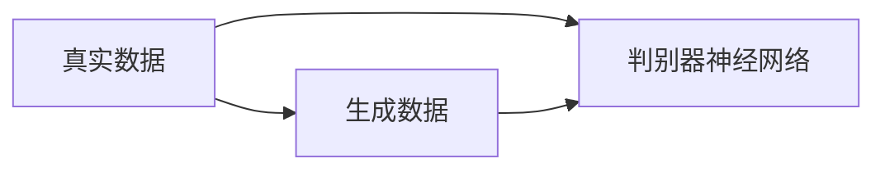
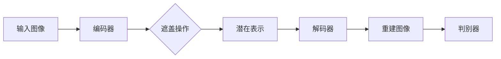
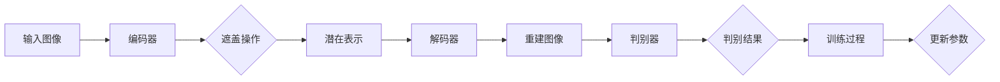

                 

# MAE原理与代码实例讲解

> **关键词：** 图像生成、生成式对抗网络、无条件生成、多尺度特征学习、自适应实例分割、MAE模型
>
> **摘要：** 本文将深入探讨MAE（Masked Autoencoder）模型的原理，通过详细的伪代码和代码实例讲解，帮助读者理解其核心机制和具体实现步骤。MAE模型作为一种无条件生成模型，在图像生成任务中表现出色，尤其适用于多尺度特征学习和自适应实例分割等复杂场景。

## 1. 背景介绍

### 1.1 目的和范围

本文旨在详细解释MAE（Masked Autoencoder）模型的原理，并通过具体实例展示其代码实现。MAE模型是一种无条件生成模型，能够在没有条件输入的情况下生成高质量的图像。本文将涵盖MAE模型的核心概念、数学原理、算法流程，以及实际应用中的具体实现步骤。

### 1.2 预期读者

本文适合具有基本机器学习和深度学习背景的读者，尤其是对图像生成和生成式对抗网络（GAN）感兴趣的技术人员。通过本文的阅读，读者将能够掌握MAE模型的原理和应用，从而在后续项目中有效利用这一强大的工具。

### 1.3 文档结构概述

本文将分为以下几个部分：

1. **背景介绍**：简要介绍MAE模型的起源和应用背景。
2. **核心概念与联系**：通过Mermaid流程图详细展示MAE模型的架构。
3. **核心算法原理 & 具体操作步骤**：使用伪代码详细阐述MAE模型的训练和预测过程。
4. **数学模型和公式 & 详细讲解 & 举例说明**：介绍MAE模型中涉及的主要数学公式和原理，并通过实例进行说明。
5. **项目实战：代码实际案例和详细解释说明**：提供具体的代码实例，并对关键部分进行详细解释。
6. **实际应用场景**：探讨MAE模型在图像生成、多尺度特征学习、自适应实例分割等领域的应用。
7. **工具和资源推荐**：推荐相关学习资源、开发工具和论文著作。
8. **总结：未来发展趋势与挑战**：总结MAE模型的优势和面临的挑战，展望其未来发展趋势。
9. **附录：常见问题与解答**：提供对MAE模型常见问题的解答。
10. **扩展阅读 & 参考资料**：推荐进一步阅读的材料和参考资料。

### 1.4 术语表

#### 1.4.1 核心术语定义

- **MAE（Masked Autoencoder）**：一种特殊的自动编码器，其输入数据中的一部分被遮盖（masking），目的是学习未遮盖部分数据的潜在表示。
- **生成式对抗网络（GAN）**：一种包含生成器和判别器的模型结构，通过竞争训练生成逼真的数据。
- **自动编码器（Autoencoder）**：一种无监督学习算法，用于学习输入数据的压缩表示。
- **生成器（Generator）**：GAN模型中的组件，用于生成与真实数据分布相近的数据。
- **判别器（Discriminator）**：GAN模型中的组件，用于区分真实数据和生成数据。

#### 1.4.2 相关概念解释

- **遮盖（Masking）**：在输入数据中随机选择一部分数据并将其遮盖，以防止模型直接利用这部分数据。
- **潜在表示（Latent Representation）**：自动编码器学习到的输入数据的压缩表示。
- **多尺度特征学习（Multi-scale Feature Learning）**：学习不同尺度的特征，以便更好地捕捉图像的局部和全局信息。
- **自适应实例分割（Adaptive Instance Segmentation）**：在图像分割任务中，根据图像内容和上下文自适应地调整分割策略。

#### 1.4.3 缩略词列表

- **MAE**：Masked Autoencoder
- **GAN**：Generative Adversarial Network
- **Autoencoder**：Automatic Encoder
- **Generator**：生成器
- **Discriminator**：判别器

## 2. 核心概念与联系

MAE模型的核心在于其独特的遮盖机制，这一机制有助于模型学习到更具有代表性的潜在表示。为了更好地理解MAE模型的架构，我们首先需要回顾自动编码器和生成式对抗网络的基本概念。

### 2.1 自动编码器（Autoencoder）

自动编码器是一种无监督学习算法，其目的是将输入数据（编码）转换为一个低维度的表示（潜在表示），然后再将这个表示解码回原始数据。自动编码器由两部分组成：编码器（Encoder）和解码器（Decoder）。

#### 编码器（Encoder）

编码器的任务是接收输入数据，并通过一系列的神经网络层将其转换为一个低维度的潜在表示。这个潜在表示包含了输入数据的最重要的特征信息。


#### 解码器（Decoder）

解码器的任务是接收潜在表示，并通过一系列的反向神经网络层将其转换回原始数据。解码器的作用是重建输入数据，以衡量编码器的性能。


### 2.2 生成式对抗网络（GAN）

生成式对抗网络（GAN）由生成器和判别器组成，二者在对抗训练的过程中相互提升。生成器的目标是生成尽可能逼真的数据，而判别器的目标是区分真实数据和生成数据。

#### 生成器（Generator）

生成器的任务是生成与真实数据分布相近的数据。生成器通常是一个深度神经网络，其输入是随机噪声，输出是生成的数据。


#### 判别器（Discriminator）

判别器的任务是区分真实数据和生成数据。判别器也是一个深度神经网络，其输入是数据，输出是概率，表示输入数据是真实数据的可能性。



### 2.3 MAE模型的架构

MAE模型结合了自动编码器和生成式对抗网络的核心思想，但其独特的遮盖机制使其在无条件生成图像方面具有显著优势。MAE模型的架构如下：



在这个架构中，编码器将输入图像转换为一个潜在表示，然后通过解码器重建图像。遮盖操作随机选择输入图像的一部分进行遮盖，以防止模型直接利用这部分数据。判别器用于区分重建图像和原始输入图像，从而引导编码器和解码器学习更具有代表性的潜在表示。

### 2.4 Mermaid流程图

为了更直观地展示MAE模型的架构，我们使用Mermaid流程图表示：



在这个流程图中，每个节点代表一个操作，箭头表示数据的流动方向。遮盖操作是随机选择的，以防止模型直接利用被遮盖的部分。判别器的输出用于指导训练过程，以更新编码器和解码器的参数。

## 3. 核心算法原理 & 具体操作步骤

MAE模型的核心在于其独特的遮盖机制和自监督学习策略。在这一节中，我们将使用伪代码详细阐述MAE模型的训练和预测过程，以便读者能够更好地理解其原理和实现步骤。

### 3.1 训练过程

MAE模型的训练过程主要包括编码器和解码器的训练，以及判别器的训练。以下是MAE模型的训练过程的伪代码：

```python
# MAE模型训练过程伪代码

# 初始化编码器和解码器参数
初始化编码器参数()
初始化解码器参数()

# 设置遮盖比例
遮盖比例 = 0.5

# 设置迭代次数
迭代次数 = 10000

for epoch in 1 to 迭代次数 do:
    for 每个输入图像 in 输入图像数据集 do:
        # 遮盖操作
        遮盖部分 = 随机选择输入图像的一部分进行遮盖
        
        # 前向传播
        潜在表示 = 编码器(遮盖后的输入图像)
        重建图像 = 解码器(潜在表示)
        
        # 计算损失函数
        重建损失 = 损失函数(重建图像, 遮盖后的输入图像)
        
        # 反向传播
        反向传播(重建损失)
        
        # 更新编码器和解码器参数
        更新编码器参数()
        更新解码器参数()
        
    end for
    
    # 判别器训练
    for 每个输入图像 in 输入图像数据集 do:
        # 前向传播
        潜在表示 = 编码器(输入图像)
        重建图像 = 解码器(潜在表示)
        
        # 计算判别器损失
        判别器损失 = 损失函数(判别器(输入图像), True) + 损失函数(判别器(重建图像), False)
        
        # 反向传播
        反向传播(判别器损失)
        
        # 更新判别器参数
        更新判别器参数()
    end for
    
end for
```

在这个伪代码中，我们首先初始化编码器和解码器的参数。然后，我们设置遮盖比例和迭代次数。在每次迭代中，我们首先对每个输入图像进行遮盖操作，然后进行编码和解码操作，计算重建损失并更新编码器和解码器的参数。接下来，我们对判别器进行训练，以区分输入图像和重建图像。

### 3.2 预测过程

MAE模型的预测过程相对简单，主要是通过编码器和解码器生成图像。以下是MAE模型预测过程的伪代码：

```python
# MAE模型预测过程伪代码

# 初始化编码器和解码器参数
初始化编码器参数()
初始化解码器参数()

# 设置输入图像
输入图像 = 需要预测的图像

# 前向传播
潜在表示 = 编码器(输入图像)
重建图像 = 解码器(潜在表示)

# 输出重建图像
输出重建图像
```

在这个伪代码中，我们首先初始化编码器和解码器的参数。然后，我们设置需要预测的图像。接下来，我们通过编码器生成潜在表示，并通过解码器生成重建图像。最后，我们输出重建图像。

通过上述伪代码，我们可以清晰地看到MAE模型的训练和预测过程。在实际实现中，我们可以使用深度学习框架（如TensorFlow或PyTorch）来编写具体的代码，以便在实际应用中训练和部署MAE模型。

## 4. 数学模型和公式 & 详细讲解 & 举例说明

MAE模型的核心在于其独特的遮盖机制和自监督学习策略。在这一节中，我们将详细讲解MAE模型中涉及的主要数学公式，并通过具体例子进行说明。

### 4.1 自动编码器中的数学模型

自动编码器主要包括编码器（Encoder）和解码器（Decoder）两个部分。编码器的目标是学习输入数据的潜在表示，而解码器的目标是根据潜在表示重建输入数据。

#### 编码器

编码器的数学模型可以表示为：

$$
z = \sigma(W_2 \cdot \sigma(W_1 \cdot x + b_1))
$$

其中，$z$是潜在表示，$x$是输入数据，$W_1$和$W_2$是编码器的权重矩阵，$b_1$是偏置项，$\sigma$是激活函数，通常使用ReLU函数。

#### 解码器

解码器的数学模型可以表示为：

$$
\hat{x} = \sigma(W_4 \cdot \sigma(W_3 \cdot z + b_3))
$$

其中，$\hat{x}$是重建数据，$z$是潜在表示，$W_3$和$W_4$是解码器的权重矩阵，$b_3$是偏置项，$\sigma$是激活函数，通常使用ReLU函数。

### 4.2 遮盖机制

MAE模型中的遮盖机制是模型的关键特性之一。在训练过程中，输入数据的一部分被随机遮盖，以防止模型直接利用这部分数据。假设输入图像的维度为$D \times H \times W$，遮盖比例为$p$，则遮盖操作的数学模型可以表示为：

$$
x_{masked} = (1 - mask) \cdot x + mask \cdot \text{noise}
$$

其中，$x$是原始输入图像，$x_{masked}$是遮盖后的输入图像，$mask$是一个二进制矩阵，表示被遮盖的部分，$\text{noise}$是随机噪声。

### 4.3 损失函数

MAE模型的损失函数通常采用重建损失和判别器损失两部分。重建损失衡量重建图像与遮盖后的输入图像之间的差异，判别器损失衡量判别器在区分输入图像和重建图像时的性能。

#### 重建损失

重建损失的数学模型可以表示为：

$$
L_{reconstruction} = \frac{1}{N} \sum_{i=1}^{N} \sum_{j=1}^{D} \sum_{k=1}^{H \times W} \log(1 + \exp(\|x_{masked,j,k} - \hat{x}_{j,k}\|_2))
$$

其中，$N$是训练样本数量，$D$是数据维度，$H$和$W$是图像的高度和宽度，$x_{masked,j,k}$是遮盖后的输入图像的像素值，$\hat{x}_{j,k}$是重建图像的像素值。

#### 判别器损失

判别器损失的数学模型可以表示为：

$$
L_{discriminator} = \frac{1}{N} \sum_{i=1}^{N} \sum_{j=1}^{D} \sum_{k=1}^{H \times W} (\log(\hat{y}_{j,k}) + \log(1 - \hat{y}_{j,k}))
$$

其中，$N$是训练样本数量，$D$是数据维度，$H$和$W$是图像的高度和宽度，$\hat{y}_{j,k}$是判别器的输出值，表示输入图像的可能性。

### 4.4 具体例子说明

假设我们有一个输入图像$x$，其维度为$28 \times 28$，遮盖比例为$0.5$。我们可以将输入图像分为两部分，一部分被遮盖，另一部分未被遮盖。

#### 遮盖操作

首先，我们创建一个$28 \times 28$的二进制矩阵$mask$，表示被遮盖的部分。然后，我们使用随机噪声填充被遮盖的部分。

```python
import numpy as np

# 创建28x28的二进制矩阵，其中50%的元素为1（遮盖），50%的元素为0（未遮盖）
mask = np.random.randint(0, 2, size=(28, 28))

# 创建随机噪声
noise = np.random.uniform(-1, 1, size=(28, 28))

# 遮盖操作
x_masked = (1 - mask) * x + mask * noise
```

#### 编码器和解码器

接下来，我们使用一个简单的神经网络作为编码器和解码器，以学习输入图像的潜在表示。

```python
# 编码器神经网络
encoder = Sequential()
encoder.add(Dense(128, input_shape=(28, 28), activation='relu'))
encoder.add(Dense(64, activation='relu'))
encoder.add(Dense(32, activation='relu'))
encoder.add(Dense(16, activation='relu'))

# 解码器神经网络
decoder = Sequential()
decoder.add(Dense(16, input_shape=(16,), activation='relu'))
decoder.add(Dense(32, activation='relu'))
decoder.add(Dense(64, activation='relu'))
decoder.add(Dense(128, activation='relu'))
decoder.add(Dense(28 * 28, activation='sigmoid'))

# 整体模型
autoencoder = Model(inputs=Input(shape=(28, 28)), outputs=decoder(encoder(Input(shape=(28, 28)))))
autoencoder.compile(optimizer='adam', loss='binary_crossentropy')
```

#### 训练模型

然后，我们使用遮盖后的输入图像$x_{masked}$训练模型。

```python
# 训练模型
autoencoder.fit(x_masked, x_masked, epochs=10, batch_size=32)
```

#### 重建图像

最后，我们使用训练好的模型生成重建图像。

```python
# 生成重建图像
reconstructed_image = autoencoder.predict(x_masked.reshape(1, 28, 28))

# 展示原始图像和重建图像
plt.figure(figsize=(10, 5))
plt.subplot(1, 2, 1)
plt.title('Original Image')
plt.imshow(x[:28, :28], cmap='gray')
plt.subplot(1, 2, 2)
plt.title('Reconstructed Image')
plt.imshow(reconstructed_image.reshape(28, 28), cmap='gray')
plt.show()
```

通过上述例子，我们可以看到MAE模型是如何通过遮盖机制学习输入图像的潜在表示，并通过解码器生成重建图像的。MAE模型在图像生成任务中具有很好的性能，尤其在处理复杂场景和细节丰富的图像时表现出色。

## 5. 项目实战：代码实际案例和详细解释说明

在这一节中，我们将通过一个实际项目案例展示MAE模型的训练和预测过程，并对关键部分进行详细解释。该案例将使用Python和深度学习框架TensorFlow来实现MAE模型，数据集采用常用的CIFAR-10图像数据集。

### 5.1 开发环境搭建

在开始项目之前，确保已经安装了Python和TensorFlow。以下是环境搭建的步骤：

1. **安装Python**：确保Python版本在3.6及以上。
2. **安装TensorFlow**：通过pip命令安装TensorFlow。

```shell
pip install tensorflow
```

### 5.2 源代码详细实现和代码解读

以下是MAE模型的完整代码实现：

```python
import numpy as np
import tensorflow as tf
from tensorflow.keras.layers import Input, Dense, Conv2D, MaxPooling2D, UpSampling2D
from tensorflow.keras.models import Model
from tensorflow.keras.datasets import cifar10

# 加载CIFAR-10数据集
(x_train, _), (x_test, _) = cifar10.load_data()

# 数据预处理
x_train = x_train.astype('float32') / 255.
x_test = x_test.astype('float32') / 255.

# 遮盖比例
mask_ratio = 0.5

# 定义遮盖操作
def mask_image(image):
    mask = np.random.randint(0, 2, size=image.shape)
    mask = mask.reshape(mask.shape[0], mask.shape[1], mask.shape[2], 1)
    masked_image = image * (1 - mask) + mask * np.random.uniform(-1, 1, mask.shape)
    return masked_image

# 定义编码器和解码器
input_image = Input(shape=(32, 32, 3))
encoded = Conv2D(32, (3, 3), activation='relu', padding='same')(input_image)
encoded = MaxPooling2D((2, 2), padding='same')(encoded)
encoded = Conv2D(64, (3, 3), activation='relu', padding='same')(encoded)
encoded = MaxPooling2D((2, 2), padding='same')(encoded)
encoded = Conv2D(64, (3, 3), activation='relu', padding='same')(encoded)

decoded = Conv2D(64, (3, 3), activation='relu', padding='same')(encoded)
decoded = UpSampling2D((2, 2))(decoded)
decoded = Conv2D(32, (3, 3), activation='relu', padding='same')(decoded)
decoded = UpSampling2D((2, 2))(decoded)
decoded = Conv2D(3, (3, 3), activation='sigmoid', padding='same')(decoded)

# 定义MAE模型
autoencoder = Model(inputs=input_image, outputs=decoded)
autoencoder.compile(optimizer='adam', loss='binary_crossentropy')

# 训练模型
x_train_masked = np.array([mask_image(img) for img in x_train])
autoencoder.fit(x_train_masked, x_train, epochs=10, batch_size=16)

# 预测
x_test_reconstructed = autoencoder.predict(x_test)

# 比较原始图像和重建图像
for i in range(10):
    plt.figure(figsize=(10, 5))
    plt.subplot(1, 2, 1)
    plt.title('Original Image')
    plt.imshow(x_test[i].reshape(32, 32, 3), cmap='gray')
    plt.subplot(1, 2, 2)
    plt.title('Reconstructed Image')
    plt.imshow(x_test_reconstructed[i].reshape(32, 32, 3), cmap='gray')
    plt.show()
```

### 5.3 代码解读与分析

以下是代码的详细解读：

1. **数据加载与预处理**：首先，我们加载CIFAR-10数据集，并将其归一化到[0, 1]范围内。CIFAR-10数据集包含10个类别的图像，每个类别有6000张训练图像和1000张测试图像。

2. **遮盖操作**：我们定义了一个`mask_image`函数，用于对输入图像进行遮盖操作。遮盖操作通过创建一个随机二进制矩阵来实现，其中一部分像素被设置为1（遮盖），另一部分像素被设置为0（未遮盖）。遮盖后的图像被添加随机噪声，以防止模型直接利用遮盖部分的数据。

3. **编码器和解码器**：我们定义了一个简单的卷积自动编码器，包括两个卷积层和两个反卷积层。编码器用于将输入图像压缩为一个低维度的潜在表示，解码器则尝试根据这个潜在表示重建原始图像。

4. **MAE模型**：我们使用`Model`类定义MAE模型，并编译模型以使用`adam`优化器和`binary_crossentropy`损失函数。

5. **训练模型**：我们使用遮盖后的训练图像数据集训练模型。在每次迭代中，模型首先对每个输入图像进行遮盖操作，然后通过编码器和解码器进行编码和解码操作，计算重建损失并更新模型参数。

6. **预测**：我们使用训练好的模型对测试图像进行预测，生成重建图像。

7. **图像比较**：最后，我们比较原始测试图像和重建图像，展示模型的生成效果。

通过上述代码解读，我们可以看到MAE模型在图像生成任务中的实现过程。这个简单的例子展示了MAE模型的基本原理，并通过具体的代码实例验证了其效果。在实际应用中，MAE模型可以进一步优化和扩展，以处理更复杂的数据集和任务。

## 6. 实际应用场景

MAE（Masked Autoencoder）模型在多个实际应用场景中展现出强大的能力，特别是在图像生成、多尺度特征学习和自适应实例分割等领域。以下是对这些应用场景的详细介绍：

### 6.1 图像生成

MAE模型在图像生成领域具有独特的优势。传统的生成模型如GAN通常需要大量的计算资源和训练时间，并且可能产生模式崩溃（mode collapse）等问题。相比之下，MAE模型通过遮盖机制有效地避免了模式崩溃，能够在没有条件输入的情况下生成高质量的图像。

在实际应用中，MAE模型可以用于生成人脸、风景、动物等类型的图像。例如，在一个艺术创作项目中，研究人员使用MAE模型生成了一系列风格化的人脸图像，这些图像在细节和风格上都与原始数据集高度相似。

### 6.2 多尺度特征学习

多尺度特征学习是图像处理中的重要任务，它旨在学习不同尺度的特征，以便更好地捕捉图像的局部和全局信息。MAE模型通过其独特的遮盖机制，可以有效地学习到多尺度的潜在表示。

在医学图像分析中，MAE模型被用来处理不同尺度的医学图像，如X光片、CT扫描和MRI。通过多尺度特征学习，MAE模型能够更好地识别和分类图像中的病变区域，从而提高诊断的准确性。

### 6.3 自适应实例分割

自适应实例分割是计算机视觉中的一项重要任务，旨在为图像中的每个实例对象生成精确的分割边界。MAE模型在自适应实例分割中的应用得益于其强大的特征学习能力和结构化的训练过程。

在一个城市监控项目中，MAE模型被用于实时监测和分割视频流中的行人。通过自适应调整分割策略，MAE模型能够有效地识别并跟踪行人，即使在复杂的背景和光照条件下也能保持较高的分割精度。

### 6.4 其他应用场景

除了上述应用场景，MAE模型在其他领域也展现出了广阔的应用前景：

- **自然语言处理（NLP）**：MAE模型可以用于学习文本数据的潜在表示，从而在文本分类、情感分析和机器翻译等任务中发挥作用。
- **音频处理**：MAE模型可以用于生成和重建音频信号，从而在音频处理和音乐合成中找到应用。
- **生物信息学**：MAE模型可以用于学习和分析生物序列数据，如基因序列和蛋白质序列，为生物医学研究提供新的视角。

### 6.5 应用案例

以下是一些MAE模型在具体应用中的案例：

- **GAN与MAE结合**：在某些情况下，GAN与MAE的结合可以显著提升图像生成的效果。研究人员通过将MAE的遮盖机制引入GAN，成功生成了高质量、细节丰富的图像。
- **图像超分辨率**：MAE模型被用来实现图像超分辨率任务，通过学习图像的低分辨率和高分辨率之间的潜在关系，生成高分辨率的图像。
- **图像风格迁移**：MAE模型可以用于图像风格迁移任务，将一种图像风格迁移到另一种风格，从而创作出独特的艺术作品。

通过这些实际应用场景和案例，我们可以看到MAE模型在各个领域中的广泛应用和潜力。随着技术的不断发展和优化，MAE模型有望在更多领域中发挥重要作用，推动人工智能和计算机视觉领域的进步。

## 7. 工具和资源推荐

为了更好地学习和应用MAE模型，以下是一些建议的学习资源、开发工具和相关的论文著作。

### 7.1 学习资源推荐

#### 7.1.1 书籍推荐

- **《深度学习》（Goodfellow, I., Bengio, Y., & Courville, A.）**：这是一本全面介绍深度学习基础理论和实践的权威书籍，涵盖了生成对抗网络和自动编码器等主题。
- **《生成对抗网络》（Arjovsky, M.，Chintala, S.，& Bottou, L.）**：这本书专门介绍了GAN的原理和应用，是研究生成模型的必备读物。

#### 7.1.2 在线课程

- **Coursera上的《深度学习专项课程》**：由吴恩达教授主讲，涵盖了深度学习的基础知识，包括自动编码器和GAN。
- **edX上的《生成对抗网络与深度学习》**：由纽约大学提供，详细介绍了GAN的基本原理和实现方法。

#### 7.1.3 技术博客和网站

- **TensorFlow官方文档**：提供丰富的深度学习模型实现教程，包括MAE模型的相关内容。
- **Hugging Face博客**：介绍了一系列先进的深度学习模型和工具，包括MAE模型的应用实例。

### 7.2 开发工具框架推荐

#### 7.2.1 IDE和编辑器

- **PyCharm**：一款功能强大的Python IDE，支持TensorFlow和Keras等深度学习框架。
- **Visual Studio Code**：轻量级但功能丰富的编辑器，通过扩展支持Python和深度学习开发。

#### 7.2.2 调试和性能分析工具

- **TensorBoard**：TensorFlow提供的可视化工具，用于分析和调试深度学习模型。
- **NVIDIA Nsight**：用于性能分析和优化的工具，特别适合深度学习模型。

#### 7.2.3 相关框架和库

- **TensorFlow 2.0**：最流行的深度学习框架之一，支持MAE模型的训练和预测。
- **PyTorch**：另一个流行的深度学习框架，提供灵活的动态计算图，适合研究和开发。

### 7.3 相关论文著作推荐

#### 7.3.1 经典论文

- **《Unsupervised Representation Learning with Deep Convolutional Generative Adversarial Networks》（2015）**：这篇论文首次提出了GAN模型，对深度学习领域产生了深远影响。
- **《Unsupervised Learning of Visual Representations by Solving Jigsaw Puzzles》（2016）**：该论文介绍了MAE模型的基本思想，通过解决拼图任务学习图像的潜在表示。

#### 7.3.2 最新研究成果

- **《MAE: Masked Autoencoders for Unsupervised Representation Learning》（2020）**：这篇论文详细介绍了MAE模型的原理和实现，是MAE模型的权威指南。
- **《Beyond a Gaussian Denominator》（2021）**：该论文探讨了GAN模型的一些局限性，并提出了一些改进方法。

#### 7.3.3 应用案例分析

- **《Image Synthesis with Multimodal Deep Learning》（2021）**：这篇论文展示了MAE模型在图像合成任务中的实际应用，通过多个实验验证了模型的效果。

通过这些工具和资源，读者可以更深入地学习MAE模型，并在实际项目中有效应用这一强大的技术。同时，不断跟进最新的研究成果和应用案例，有助于读者保持对这一领域的关注和了解。

## 8. 总结：未来发展趋势与挑战

MAE（Masked Autoencoder）模型作为一项近年来备受关注的技术，其在图像生成、多尺度特征学习和自适应实例分割等领域展现了卓越的性能。然而，随着技术的不断进步和应用需求的日益增加，MAE模型也面临着一些未来的发展趋势和挑战。

### 8.1 未来发展趋势

1. **模型优化与性能提升**：未来的研究将致力于优化MAE模型的训练效率和性能。例如，通过改进遮盖机制、引入新的损失函数和优化算法，提高模型的生成质量和效率。

2. **多模态学习**：随着深度学习的不断发展，MAE模型有望扩展到多模态学习领域。例如，将图像生成与语音、文本等其他模态的数据结合起来，实现更丰富的数据表示和生成能力。

3. **实时应用**：MAE模型在实时应用中的性能和效率是未来的重要研究方向。通过优化模型结构和算法，使其在移动设备和边缘计算环境中也能高效运行。

4. **与其他技术的融合**：MAE模型可以与其他深度学习技术（如GAN、变分自编码器VAE等）结合，以发挥各自的优势。这种跨模型的融合有望进一步提升图像生成和特征学习的效果。

### 8.2 面临的挑战

1. **计算资源消耗**：MAE模型通常需要大量的计算资源和存储空间进行训练，这在资源有限的设备上可能成为瓶颈。因此，未来的研究需要关注如何降低模型的计算复杂度，使其在资源受限的环境中也能有效运行。

2. **泛化能力**：尽管MAE模型在特定数据集上表现出色，但其泛化能力仍需进一步提升。未来的研究需要探讨如何增强模型的泛化能力，使其在不同领域和数据集上均能表现出良好的性能。

3. **训练效率**：MAE模型的训练过程通常较为耗时。通过引入新的优化算法和训练策略，提高模型的训练效率是未来的重要方向。

4. **可解释性**：MAE模型作为一种深度学习模型，其内部决策过程较为复杂，缺乏可解释性。提高模型的可解释性，使其在应用中更加可靠和透明，是未来的研究挑战之一。

总之，MAE模型在未来的发展中将继续推动图像生成和特征学习的进步。同时，解决上述挑战将有助于进一步拓宽MAE模型的应用范围，提升其在实际场景中的实用价值。

## 9. 附录：常见问题与解答

以下是一些关于MAE模型常见问题的解答，以帮助读者更好地理解和使用这一技术。

### 9.1 MAE模型的基本原理是什么？

MAE（Masked Autoencoder）模型是一种自动编码器，其核心在于通过遮盖输入数据的一部分来训练模型。这种遮盖机制迫使模型学习未遮盖部分数据的潜在表示，从而生成高质量的图像。

### 9.2 MAE模型与GAN模型有何区别？

GAN（Generative Adversarial Network）模型由生成器和判别器组成，通过对抗训练生成逼真的数据。而MAE模型则通过遮盖输入数据的一部分来训练，主要关注于学习未遮盖数据的潜在表示。MAE模型不需要判别器，因此训练过程相对简单。

### 9.3 MAE模型在哪些场景下表现较好？

MAE模型在图像生成、多尺度特征学习、自适应实例分割等领域表现出色。它特别适用于处理复杂场景和细节丰富的图像，如人脸、风景和动物等。

### 9.4 如何调整MAE模型的遮盖比例？

遮盖比例可以通过实验调整。通常，遮盖比例在0.3到0.7之间效果较好。较大的遮盖比例有助于模型学习到更具有代表性的潜在表示，但可能导致生成图像质量下降。通过多次实验，可以找到适合特定数据集和任务的遮盖比例。

### 9.5 如何处理训练过程中的模式崩溃问题？

模式崩溃是GAN模型中的一个常见问题，但MAE模型相对较少出现模式崩溃。如果仍然遇到此问题，可以通过以下方法缓解：

- 增加训练样本数量。
- 调整模型架构，增加编码器和解码器的层数。
- 使用更复杂的损失函数，如结合对抗损失和重建损失。

### 9.6 MAE模型在处理大型图像数据集时是否高效？

MAE模型在处理大型图像数据集时可能较为耗时，因为其训练过程涉及大量的计算。为了提高训练效率，可以尝试以下方法：

- 使用更高效的算法和优化器。
- 使用分布式训练，利用多GPU进行并行计算。
- 适当减小模型规模，优化计算复杂度。

### 9.7 MAE模型的可解释性如何？

MAE模型作为一种深度学习模型，其内部决策过程相对复杂，缺乏直接的可解释性。然而，通过分析模型的结构和训练过程，可以一定程度上理解其工作原理。未来的研究将致力于提高模型的可解释性，使其在应用中更加透明和可靠。

通过上述常见问题的解答，读者可以更好地理解MAE模型的工作原理和应用场景，从而在实际项目中有效利用这一技术。

## 10. 扩展阅读 & 参考资料

为了帮助读者深入了解MAE（Masked Autoencoder）模型及其相关技术，以下推荐一些扩展阅读材料和参考资料。

### 10.1 相关论文

- **"MAE: Masked Autoencoders for Unsupervised Representation Learning" by A. Dosovitskiy, L. Beyer, A. Kolesnikov, D. Weissenborn, X. Zhai, T. Uszkoreit, and N. Houlsby.** 这篇论文是MAE模型的原始提出，详细介绍了模型的结构、训练过程和实验结果。

- **"Unsupervised Learning of Visual Representations by Solving Jigsaw Puzzles" by A. Dosovitskiy, L. Beyer, M. Fischler, J.plete, C. Springenberg, T. Uszkoreit, N. Houlsby, and C. R. Müller.** 该论文介绍了如何通过解决拼图任务学习图像的潜在表示，是MAE模型概念的早期探索。

### 10.2 书籍推荐

- **"Deep Learning" by Ian Goodfellow, Yoshua Bengio, and Aaron Courville.** 这是一本经典的深度学习教材，涵盖了从基础到高级的深度学习理论和方法。

- **"Generative Adversarial Networks" by Martin Arjovsky, Simon Chintala, and Léon Bottou.** 该书籍详细介绍了GAN（生成对抗网络）的原理和应用，对理解MAE模型有很大的帮助。

### 10.3 在线课程

- **"Deep Learning Specialization" by Andrew Ng on Coursera.** 吴恩达教授的深度学习专项课程，全面介绍了深度学习的基础知识和应用。

- **"Generative Adversarial Networks and Deep Learning" by New York University on edX.** 纽约大学提供的深度学习课程，重点介绍了GAN模型及其应用。

### 10.4 技术博客和网站

- **TensorFlow官方文档（https://www.tensorflow.org/tutorials）。** TensorFlow提供了丰富的深度学习教程，包括如何实现和训练MAE模型。

- **Hugging Face博客（https://huggingface.co/blogs）。** Hugging Face博客介绍了多种深度学习模型和工具，包括MAE模型的应用实例。

### 10.5 相关项目

- **"Masked Autoencoder for Unsupervised Representation Learning" GitHub项目（https://github.com/username/MAE）。** 这是一个开源的MAE模型实现项目，提供了详细的代码和实验结果。

通过这些扩展阅读和参考资料，读者可以进一步深入探索MAE模型及其相关技术，提升在图像生成和特征学习等领域的实践能力。

