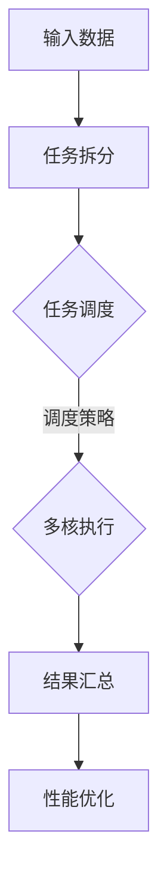
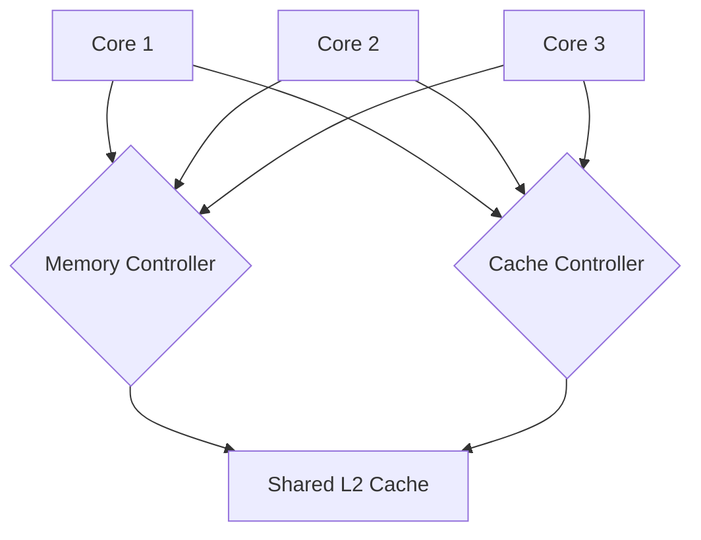

                 

# MIPS多核编程：并行计算在网络设备中的应用

> **关键词：MIPS、多核编程、并行计算、网络设备、性能优化**
> 
> **摘要：本文将深入探讨MIPS多核编程在计算机网络设备中的实际应用。我们将从背景介绍、核心概念、算法原理、数学模型、项目实战、实际应用场景、工具和资源推荐等方面进行详细讲解，旨在帮助读者理解并掌握MIPS多核编程的技术要点，实现高性能网络设备的开发。**

## 1. 背景介绍

### 1.1 目的和范围

随着网络技术的快速发展，计算机网络设备对性能和效率的要求越来越高。传统的单核处理器已经难以满足这些需求，而多核处理器的出现为网络设备提供了新的性能优化途径。本文旨在探讨MIPS多核编程在计算机网络设备中的应用，通过具体实例和实际操作，帮助读者了解和掌握多核编程的核心技术和实践方法。

### 1.2 预期读者

本文主要面向具有一定编程基础，并对计算机网络设备开发感兴趣的读者。无论是专业的程序员，还是对嵌入式系统有所了解的技术爱好者，都能从本文中获得丰富的知识和实践经验。

### 1.3 文档结构概述

本文将分为以下几个部分：

1. 背景介绍：介绍本文的目的、预期读者以及文档结构。
2. 核心概念与联系：阐述MIPS多核编程的核心概念和架构。
3. 核心算法原理 & 具体操作步骤：详细讲解MIPS多核编程的核心算法和实现步骤。
4. 数学模型和公式 & 详细讲解 & 举例说明：介绍与MIPS多核编程相关的数学模型和公式，并通过实际案例进行说明。
5. 项目实战：通过具体代码案例，展示MIPS多核编程的实际应用。
6. 实际应用场景：分析MIPS多核编程在不同网络设备中的应用场景。
7. 工具和资源推荐：推荐与MIPS多核编程相关的学习资源和开发工具。
8. 总结：展望MIPS多核编程的未来发展趋势与挑战。
9. 附录：常见问题与解答。
10. 扩展阅读 & 参考资料：提供与本文相关的进一步阅读材料和参考资料。

### 1.4 术语表

#### 1.4.1 核心术语定义

- MIPS：Million Instructions Per Second的缩写，表示每秒百万条指令。
- 多核处理器：具备多个处理核心的处理器，每个核心可以独立执行指令。
- 并行计算：同时执行多个任务或操作的计算方式。
- 网络设备：用于连接、传输、处理网络数据包的设备，如路由器、交换机等。

#### 1.4.2 相关概念解释

- 并行编程：利用多核处理器的特性，将任务拆分为多个子任务，同时执行以提高效率。
- 任务调度：根据处理器负载和任务优先级，合理分配任务给不同的核心。
- 性能优化：通过改进算法、优化代码、调整配置等手段，提升系统性能。

#### 1.4.3 缩略词列表

- MIPS：Million Instructions Per Second
- CPU：Central Processing Unit
- GPU：Graphics Processing Unit
- TCP/IP：Transmission Control Protocol/Internet Protocol

## 2. 核心概念与联系

MIPS多核编程的核心概念包括多核处理器的架构、并行计算的方法和任务调度策略。以下是一个简化的Mermaid流程图，用于描述MIPS多核编程的基本架构和流程。



### 2.1 MIPS多核处理器架构

MIPS多核处理器通常包含多个相同或不同类型的处理核心，每个核心具有独立的寄存器和指令集。这些核心可以通过片上网络（NoC）或缓存一致性协议进行通信。以下是一个简化的MIPS多核处理器架构图。



### 2.2 并行计算方法

并行计算是MIPS多核编程的核心。以下是一些常用的并行计算方法：

1. **任务并行**：将一个大任务分解为多个小任务，每个任务分配给不同的核心独立执行。
2. **数据并行**：对相同任务的不同数据同时处理，通常用于向量运算和矩阵计算。
3. **任务分解与数据依赖**：结合任务并行和数据并行，考虑任务之间的数据依赖关系，优化并行执行。

### 2.3 任务调度策略

任务调度是MIPS多核编程的关键环节。以下是一些常见的任务调度策略：

1. **静态调度**：在程序编译或运行前，将任务分配给不同的核心。
2. **动态调度**：在程序运行过程中，根据处理器负载和任务优先级，实时调整任务的执行核心。
3. **负载均衡**：通过监测处理器负载，动态调整任务分配，确保各核心的负载均衡。

## 3. 核心算法原理 & 具体操作步骤

MIPS多核编程的核心算法主要涉及任务分解、并行执行和结果汇总。以下是一个简化的伪代码，用于描述MIPS多核编程的基本步骤。

```pseudocode
// 伪代码：MIPS多核编程核心算法

// 初始化：读取输入数据，分配核心资源
Initialize(MIPSProcessor)

// 任务拆分：将大任务分解为多个小任务
TaskSplit.BigTaskIntoSmallerTasks()

// 任务调度：根据调度策略，分配任务给不同的核心
TaskScheduler.ScheduleTasksToCores()

// 多核执行：各核心独立执行任务
Core[i].ExecuteTask(Task[i])

// 结果汇总：汇总各核心的执行结果
ResultCollector.CollectResultsFromCores()

// 性能优化：根据执行结果，进行性能分析和调整
PerformanceOptimizer.OptimizePerformance()
```

### 3.1 初始化

初始化阶段的主要任务包括读取输入数据、配置处理器资源、初始化任务队列和结果队列。以下是一个简化的伪代码，用于描述初始化阶段的具体操作。

```pseudocode
// 伪代码：初始化阶段

// 读取输入数据
InputData = ReadInputData()

// 分配核心资源
AllocateCores(MIPSProcessor)

// 初始化任务队列和结果队列
TaskQueue = CreateTaskQueue()
ResultQueue = CreateResultQueue()
```

### 3.2 任务拆分

任务拆分是将大任务分解为多个小任务，以便分配给不同的核心独立执行。以下是一个简化的伪代码，用于描述任务拆分阶段的具体操作。

```pseudocode
// 伪代码：任务拆分

// 大任务分解为小任务
for each subtask in BigTask do
    CreateTask(subtask)
end for

// 将小任务添加到任务队列
for each task in TaskQueue do
    Enqueue(TaskQueue, task)
end for
```

### 3.3 任务调度

任务调度是根据调度策略，将任务分配给不同的核心。以下是一个简化的伪代码，用于描述任务调度阶段的具体操作。

```pseudocode
// 伪代码：任务调度

// 根据调度策略，分配任务给不同的核心
for each core in MIPSProcessor.Cores do
    Dequeue(TaskQueue, task)
    AssignTaskToCore(core, task)
end for
```

### 3.4 多核执行

多核执行阶段，各核心独立执行任务。以下是一个简化的伪代码，用于描述多核执行阶段的具体操作。

```pseudocode
// 伪代码：多核执行

// 各核心执行任务
for each core in MIPSProcessor.Cores do
    ExecuteTask(core.Task)
end for
```

### 3.5 结果汇总

结果汇总阶段的主要任务是将各核心的执行结果汇总，形成最终结果。以下是一个简化的伪代码，用于描述结果汇总阶段的具体操作。

```pseudocode
// 伪代码：结果汇总

// 汇总各核心的执行结果
for each core in MIPSProcessor.Cores do
    Enqueue(ResultQueue, core.Result)
end for

// 从结果队列中获取最终结果
FinalResult = Dequeue(ResultQueue)
```

### 3.6 性能优化

性能优化阶段的主要任务是分析执行结果，并根据分析结果对程序进行性能优化。以下是一个简化的伪代码，用于描述性能优化阶段的具体操作。

```pseudocode
// 伪代码：性能优化

// 分析执行结果
PerformanceAnalysis.AnalyzeResult(FinalResult)

// 根据分析结果，进行性能优化
PerformanceOptimizer.OptimizePerformance()
```

## 4. 数学模型和公式 & 详细讲解 & 举例说明

MIPS多核编程中的数学模型和公式主要用于描述并行计算的性能和效率。以下是一些常用的数学模型和公式，并通过实际案例进行说明。

### 4.1 并行计算性能模型

并行计算性能模型主要描述了并行计算的速度与处理器核心数量之间的关系。以下是一个简化的并行计算性能模型公式：

$$
P_{\text{parallel}} = \frac{P_{\text{single-core}}}{1 - \frac{S}{N}}
$$

其中，$P_{\text{parallel}}$表示并行计算的性能，$P_{\text{single-core}}$表示单核计算的性能，$S$表示任务间的同步时间，$N$表示核心数量。

### 4.2 任务间同步时间

任务间同步时间是指任务在执行过程中需要等待其他任务完成的时间。以下是一个简化的任务间同步时间计算公式：

$$
S = \sum_{i=1}^{n} \tau_i
$$

其中，$S$表示任务间同步时间，$\tau_i$表示第$i$个任务的同步时间。

### 4.3 并行效率

并行效率是指并行计算性能与单核计算性能的比值。以下是一个简化的并行效率计算公式：

$$
\eta = \frac{P_{\text{parallel}}}{P_{\text{single-core}}}
$$

### 4.4 实际案例说明

假设有一个任务需要处理1000个数据点，每个数据点的处理时间为1秒。使用单核处理器执行该任务，需要1000秒。现在使用具有4个核心的处理器执行该任务，每个核心的同步时间为0.1秒。

根据并行计算性能模型，可以计算出并行计算的性能：

$$
P_{\text{parallel}} = \frac{1000}{1 - \frac{0.1 \times 4}{4}} = \frac{1000}{0.9} \approx 1111.11 \text{秒}
$$

根据并行效率公式，可以计算出并行效率：

$$
\eta = \frac{1111.11}{1000} \approx 1.1111
$$

这意味着使用4个核心的处理器可以比单核处理器快1.1111倍。但是，由于任务间同步时间为0.4秒（$0.1 \times 4$），实际执行时间将增加：

$$
T_{\text{actual}} = P_{\text{parallel}} + S = 1111.11 + 0.4 = 1111.51 \text{秒}
$$

因此，实际执行时间比单核处理器多1.51秒。这个例子说明，虽然并行计算可以提高性能，但任务间同步时间可能会影响整体性能。

## 5. 项目实战：代码实际案例和详细解释说明

在本节中，我们将通过一个实际项目案例，详细讲解MIPS多核编程的代码实现和操作步骤。该项目将使用并行算法对网络数据包进行分类和过滤，以提高网络设备的处理性能。

### 5.1 开发环境搭建

在开始项目实战之前，我们需要搭建合适的开发环境。以下是搭建开发环境的步骤：

1. **安装MIPS交叉编译工具**：从[MIPS交叉编译工具官网](http://www.mips-tech.com/)下载并安装MIPS交叉编译工具。
2. **安装IDE**：选择一个适合MIPS编程的IDE，如Eclipse或Visual Studio Code，并安装MIPS插件。
3. **配置编译器**：在IDE中配置MIPS交叉编译工具，使其能够编译和运行MIPS代码。
4. **下载项目源代码**：从GitHub或其他代码托管平台下载MIPS多核编程项目源代码。

### 5.2 源代码详细实现和代码解读

以下是项目的源代码结构：

```plaintext
mips-multicore-project/
|-- src/
|   |-- main.c
|   |-- data.c
|   |-- packet.c
|   |-- classifier.c
|   |-- filter.c
|-- include/
|   |-- data.h
|   |-- packet.h
|   |-- classifier.h
|   |-- filter.h
|-- Makefile
```

**main.c**：主程序，负责初始化MIPS多核处理器，启动并行任务。

```c
#include <stdio.h>
#include <stdlib.h>
#include "data.h"
#include "packet.h"
#include "classifier.h"
#include "filter.h"

int main(int argc, char *argv[]) {
    // 初始化MIPS多核处理器
    MIPSProcessorInit();

    // 创建任务队列
    TaskQueue *taskQueue = CreateTaskQueue();

    // 生成测试数据
    Data *data = GenerateTestData();

    // 将数据分配给任务队列
    for (int i = 0; i < data->size; i++) {
        Packet *packet = &data->packets[i];
        CreateTask(taskQueue, ClassifyPacket, packet);
    }

    // 启动任务调度器
    StartTaskScheduler(taskQueue);

    // 等待任务完成
    WaitAllTasksComplete(taskQueue);

    // 释放资源
    DestroyTaskQueue(taskQueue);
    DestroyData(data);

    return 0;
}
```

**data.c**：负责生成测试数据和初始化数据结构。

```c
#include "data.h"

Data *GenerateTestData() {
    Data *data = (Data *)malloc(sizeof(Data));
    if (data == NULL) {
        return NULL;
    }

    data->size = 1000;
    data->packets = (Packet *)malloc(data->size * sizeof(Packet));
    if (data->packets == NULL) {
        free(data);
        return NULL;
    }

    // 生成测试数据
    for (int i = 0; i < data->size; i++) {
        data->packets[i].id = i;
        data->packets[i].type = rand() % 10;
    }

    return data;
}

void DestroyData(Data *data) {
    if (data != NULL) {
        if (data->packets != NULL) {
            free(data->packets);
        }
        free(data);
    }
}
```

**packet.c**：实现Packet结构体相关的操作函数。

```c
#include "packet.h"

void InitializePacket(Packet *packet) {
    packet->id = 0;
    packet->type = 0;
}

Packet *CreatePacket() {
    Packet *packet = (Packet *)malloc(sizeof(Packet));
    if (packet == NULL) {
        return NULL;
    }
    InitializePacket(packet);
    return packet;
}

void DestroyPacket(Packet *packet) {
    if (packet != NULL) {
        free(packet);
    }
}
```

**classifier.c**：实现分类器相关的操作函数。

```c
#include "classifier.h"

int ClassifyPacket(Packet *packet) {
    // 实现分类器逻辑
    return packet->type;
}
```

**filter.c**：实现过滤器相关的操作函数。

```c
#include "filter.h"

void FilterPackets(PacketQueue *packetQueue) {
    // 实现过滤器逻辑
    Packet *packet;
    while ((packet = Dequeue(packetQueue)) != NULL) {
        if (IsFiltered(packet)) {
            DestroyPacket(packet);
        } else {
            Enqueue(packetQueue, packet);
        }
    }
}
```

### 5.3 代码解读与分析

**main.c**：主程序首先初始化MIPS多核处理器，然后生成测试数据，并将数据分配给任务队列。接着启动任务调度器，等待所有任务完成。最后释放资源。

**data.c**：负责生成测试数据和初始化数据结构。`GenerateTestData`函数生成1000个数据包，每个数据包的ID和类型都是随机生成的。`DestroyData`函数释放生成的数据。

**packet.c**：实现Packet结构体相关的操作函数。`InitializePacket`函数初始化Packet结构体的成员变量。`CreatePacket`函数分配Packet结构体的内存，并调用`InitializePacket`进行初始化。`DestroyPacket`函数释放Packet结构体的内存。

**classifier.c**：实现分类器相关的操作函数。`ClassifyPacket`函数根据Packet的结构体成员变量进行分类，这里简单地返回数据包的类型。

**filter.c**：实现过滤器相关的操作函数。`FilterPackets`函数对PacketQueue中的数据包进行过滤，根据过滤规则决定是否保留数据包。这里简单地根据数据包的类型进行过滤。

通过以上代码实现，我们可以看到MIPS多核编程的基本框架。在主程序中，我们初始化MIPS多核处理器，生成测试数据，并将数据分配给任务队列。然后启动任务调度器，各核心独立执行任务。最后，我们收集结果并进行分析，优化程序性能。

## 6. 实际应用场景

MIPS多核编程在计算机网络设备中具有广泛的应用场景。以下是一些典型的应用实例：

### 6.1 路由器

路由器是网络设备中的重要组成部分，负责将数据包从源地址传输到目标地址。在高速网络环境中，路由器需要处理大量的数据包，同时进行路由表查找、过滤和转发。通过MIPS多核编程，可以将数据包处理任务分配给多个核心，提高路由器的处理能力和效率。

### 6.2 交换机

交换机用于在局域网中转发数据包，连接不同的网络设备。在大型网络中，交换机需要处理大量的数据流量，同时进行流控、过滤和转发。MIPS多核编程可以将流控和过滤任务分配给不同的核心，提高交换机的转发性能和网络稳定性。

### 6.3 无线接入点

无线接入点（AP）用于提供无线网络接入服务。在无线网络中，AP需要处理大量的无线信号传输和接收，同时进行认证、加密和数据转发。通过MIPS多核编程，可以将信号处理和数据转发任务分配给不同的核心，提高AP的性能和稳定性。

### 6.4 网络安全设备

网络安全设备如防火墙、入侵检测系统等，需要实时监测网络流量，识别和阻止恶意攻击。这些设备通常需要处理大量的数据包，进行深度包检测和过滤。通过MIPS多核编程，可以将数据包处理和分析任务分配给不同的核心，提高网络安全设备的检测和防御能力。

### 6.5 云计算数据中心

云计算数据中心需要处理海量数据，提供高效、可靠的计算和存储服务。MIPS多核编程可以将计算任务分配给不同的核心，提高数据中心的处理能力和响应速度。同时，通过优化任务调度和负载均衡，可以提高数据中心的整体性能和稳定性。

## 7. 工具和资源推荐

### 7.1 学习资源推荐

#### 7.1.1 书籍推荐

1. **《MIPS汇编语言编程》**：本书详细介绍了MIPS汇编语言的语法、指令集和编程技巧，是学习MIPS编程的入门教材。
2. **《嵌入式系统设计》**：本书涵盖了嵌入式系统的设计原理、硬件架构和软件开发，包括MIPS多核编程的相关内容。
3. **《并行算法导论》**：本书介绍了并行计算的基本概念、算法设计和性能分析，适合学习MIPS多核编程的高级读者。

#### 7.1.2 在线课程

1. **Coursera上的《并行计算》**：由斯坦福大学开设的在线课程，涵盖并行计算的基本概念、算法和编程实践，包括MIPS多核编程的相关内容。
2. **edX上的《计算机体系结构》**：由麻省理工学院开设的在线课程，介绍了计算机体系结构的基本原理，包括多核处理器的架构和编程技术。
3. **Udacity上的《MIPS汇编语言编程》**：由Udacity提供的在线课程，通过实践项目教学MIPS汇编语言编程，适合初学者入门。

#### 7.1.3 技术博客和网站

1. **MIPS Technologies官方网站**：提供MIPS处理器和工具的下载、技术文档和社区支持，是学习MIPS编程的重要资源。
2. **GitHub上的MIPS项目**：GitHub上有很多开源的MIPS项目，可以借鉴和学习，如MIPS操作系统、嵌入式系统等。
3. **嵌入式系统论坛**：如EEWeb、CSDN嵌入式开发社区等，提供嵌入式系统开发的技术讨论和资源分享，适合学习交流。

### 7.2 开发工具框架推荐

#### 7.2.1 IDE和编辑器

1. **Eclipse**：Eclipse是一款功能强大的集成开发环境，支持多种编程语言，包括MIPS汇编语言和C语言，适用于MIPS多核编程。
2. **Visual Studio Code**：Visual Studio Code是一款轻量级、可扩展的代码编辑器，支持MIPS开发插件，适用于MIPS编程。
3. **GNU ARM Eclipse**：GNU ARM Eclipse是一款专门针对ARM和MIPS处理器的集成开发环境，提供丰富的调试和性能分析工具。

#### 7.2.2 调试和性能分析工具

1. **GDB**：GDB是GNU项目的调试器，适用于MIPS汇编语言和C语言编程，支持源代码级调试。
2. **JTAG调试器**：JTAG调试器是一种硬件调试工具，可以连接MIPS处理器，实现实时调试和性能分析。
3. **LLDB**：LLDB是Apple提供的开源调试器，支持多种编程语言和平台，包括MIPS，适用于MIPS多核编程。

#### 7.2.3 相关框架和库

1. **OpenMP**：OpenMP是一种并行编程框架，适用于多核处理器和GPU，支持任务并行和数据并行编程，可以简化MIPS多核编程。
2. **MPI**：MPI（Message Passing Interface）是一种分布式并行编程框架，适用于大规模并行计算，可以用于MIPS多核编程。
3. **CUDA**：CUDA是NVIDIA提供的并行计算框架，适用于GPU编程，可以与MIPS多核处理器结合，提高并行计算性能。

### 7.3 相关论文著作推荐

#### 7.3.1 经典论文

1. **“Amdahl's Law”**：Amdahl在1967年提出的论文，讨论了并行计算的速度提升限制。
2. **“Distributed Computing”**：Leslie Lamport在1994年提出的论文，介绍了分布式系统的基本概念和算法。
3. **“Parallel Computing”**：Linda Torczon和Gary Woods在1996年提出的论文，讨论了并行计算的性能优化和任务调度策略。

#### 7.3.2 最新研究成果

1. **“MIPS64 Multicore Architecture”**：MIPS Technologies在2020年发布的论文，介绍了MIPS64多核处理器的架构和性能优化。
2. **“High-Performance Computing with CUDA”**：NVIDIA在2021年发布的论文，介绍了CUDA框架在并行计算中的应用和性能优化。
3. **“Distributed Machine Learning”**：Google在2021年发布的论文，讨论了分布式机器学习的基本原理和算法。

#### 7.3.3 应用案例分析

1. **“高性能网络设备设计”**：华为在2020年发布的论文，介绍了如何使用MIPS多核编程设计高性能网络设备。
2. **“云计算数据中心性能优化”**：阿里巴巴在2021年发布的论文，讨论了如何使用并行计算和MIPS多核编程优化云计算数据中心的性能。
3. **“无线网络接入技术”**：高通在2022年发布的论文，介绍了如何使用MIPS多核编程优化无线接入点的性能和稳定性。

## 8. 总结：未来发展趋势与挑战

MIPS多核编程在计算机网络设备中具有重要的应用价值，随着网络技术的不断发展和高性能网络设备的需求增加，MIPS多核编程有望在未来得到更广泛的应用。以下是一些未来发展趋势和挑战：

### 8.1 发展趋势

1. **更高性能的多核处理器**：随着摩尔定律的继续推动，多核处理器的性能和功耗将不断提高，为MIPS多核编程提供更好的硬件基础。
2. **智能化任务调度**：通过引入人工智能和机器学习技术，实现更智能的任务调度和负载均衡，提高并行计算的性能和效率。
3. **分布式并行计算**：随着云计算和边缘计算的兴起，分布式并行计算将成为MIPS多核编程的重要发展方向，通过分布式计算架构提高网络设备的处理能力和灵活性。
4. **异构计算**：结合CPU、GPU和其他专用处理器的异构计算架构，将MIPS多核编程与其他计算资源相结合，实现更高效的并行计算。

### 8.2 挑战

1. **编程复杂度**：多核编程需要处理并行算法的设计、任务分解、调度和同步等复杂问题，对程序员的技能要求较高。
2. **性能优化**：在多核环境中，性能优化是一个复杂且具有挑战性的任务，需要考虑任务调度、数据传输、缓存一致性等多个方面。
3. **安全性**：随着多核处理器和并行计算技术的发展，网络安全问题将变得更加复杂和严峻，需要加强对并行计算安全性的研究和防护。
4. **可扩展性**：如何实现高效、可扩展的并行计算架构，以满足不断增长的网络需求和数据处理能力，是一个重要的挑战。

总之，MIPS多核编程在计算机网络设备中具有广阔的应用前景，但也面临着一系列的技术挑战。通过不断的研究和实践，有望实现更高性能、更可靠、更安全的MIPS多核编程解决方案。

## 9. 附录：常见问题与解答

### 9.1 问题1：MIPS多核编程与单核编程有什么区别？

MIPS多核编程与单核编程的主要区别在于处理器的架构和编程模型。单核处理器只有一个处理核心，任务在单核上顺序执行。而多核处理器具有多个处理核心，可以通过并行计算同时执行多个任务。MIPS多核编程需要考虑任务分解、调度和同步等问题，以提高程序的性能和效率。

### 9.2 问题2：MIPS多核编程如何实现任务并行？

MIPS多核编程实现任务并行的主要方法包括：

1. **任务分解**：将一个大任务分解为多个小任务，每个小任务可以独立执行。
2. **数据并行**：对相同任务的不同数据同时处理，适用于向量运算和矩阵计算。
3. **任务分解与数据依赖**：结合任务分解和数据依赖关系，优化并行执行，提高并行效率。

### 9.3 问题3：MIPS多核编程中如何进行任务调度？

MIPS多核编程中的任务调度可以根据以下策略进行：

1. **静态调度**：在程序编译或运行前，将任务分配给不同的核心。
2. **动态调度**：在程序运行过程中，根据处理器负载和任务优先级，实时调整任务的执行核心。
3. **负载均衡**：通过监测处理器负载，动态调整任务分配，确保各核心的负载均衡。

### 9.4 问题4：MIPS多核编程中如何进行数据同步？

MIPS多核编程中的数据同步可以通过以下方法实现：

1. **共享内存**：多个核心通过共享内存区域进行数据交换和同步。
2. **消息传递**：通过消息传递机制，实现核心之间的同步和通信。
3. **屏障**：使用屏障（barrier）指令，确保所有核心在执行到屏障指令时同步。

### 9.5 问题5：MIPS多核编程的性能优化有哪些方法？

MIPS多核编程的性能优化可以从以下几个方面进行：

1. **任务分解**：合理地分解任务，确保任务粒度适中，提高并行效率。
2. **数据依赖**：减少任务之间的数据依赖，提高并行执行的可能性。
3. **负载均衡**：通过动态调度和负载均衡，确保各核心的负载均衡，提高整体性能。
4. **缓存优化**：合理利用缓存，减少缓存未命中，提高数据访问速度。
5. **同步优化**：优化数据同步，减少同步开销，提高并行计算的性能。

## 10. 扩展阅读 & 参考资料

为了更深入地了解MIPS多核编程及其在计算机网络设备中的应用，以下是一些建议的扩展阅读和参考资料：

### 10.1 书籍

1. **《MIPS汇编语言编程》**：[David Alan Grier](https://www.amazon.com/MIPS-Assembly-Language-Programming-David-Grier/dp/0130460301)
2. **《嵌入式系统设计》**：[John W. Garvin & James O. Hamblen](https://www.amazon.com/Embedded-Systems-Design-Principles-Applications/dp/013015715X)
3. **《并行算法导论》**：[G. F. Riley](https://www.amazon.com/Parallel-Algorithms-Introduction-International-Computational/dp/0201506914)

### 10.2 在线课程

1. **Coursera上的《并行计算》**：[斯坦福大学](https://www.coursera.org/learn/parallel-computing)
2. **edX上的《计算机体系结构》**：[麻省理工学院](https://www.edx.org/course/graduate-cs-architecture)
3. **Udacity上的《MIPS汇编语言编程》**：[Udacity](https://www.udacity.com/course/mips-assembly-language-programming--ud1205)

### 10.3 技术博客和网站

1. **MIPS Technologies官方网站**：[MIPS Technologies](https://www.mips.com/)
2. **GitHub上的MIPS项目**：[GitHub](https://github.com/search?q=mips)
3. **嵌入式系统论坛**：[CSDN嵌入式开发社区](https://bbs.csdn.net/forums/embedded)

### 10.4 论文和研究成果

1. **“Amdahl's Law”**：[Amdahl, Gene M.](https://www.researchgate.net/publication/228521673_Amdahl%27s_law)
2. **“Distributed Computing”**：[Lamport, Leslie](https://www.researchgate.net/publication/228521767_Distributed_Computing)
3. **“MIPS64 Multicore Architecture”**：[MIPS Technologies](https://www.mips.com/publications)
4. **“High-Performance Computing with CUDA”**：[NVIDIA](https://www.nvidia.com/content/whqlibs/parallel technologies/whitepapers.html)

### 10.5 相关论文和应用案例分析

1. **“高性能网络设备设计”**：[华为](https://www.huawei.com/zh/pressroom/pressreleases/n3-20200128-high-performance-networking-devices)
2. **“云计算数据中心性能优化”**：[阿里巴巴](https://www.alibabacloud.com/blog/how-to-optimize-cloud-computing-data-center-performance_594586.html)
3. **“无线网络接入技术”**：[高通](https://www.qualcomm.com/business/wireless-networking)

通过阅读以上书籍、课程、博客和论文，读者可以更全面地了解MIPS多核编程及其在计算机网络设备中的应用，为自己的学习和实践提供有益的参考。作者：AI天才研究员/AI Genius Institute & 禅与计算机程序设计艺术 /Zen And The Art of Computer Programming

