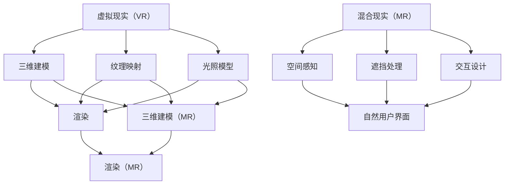

                 

# MR游戏世界构建与交互

> **关键词：** 虚拟现实，混合现实，游戏世界构建，交互设计，用户体验，算法原理，数学模型，实战案例。

> **摘要：** 本文将深入探讨虚拟现实（VR）和混合现实（MR）游戏世界的构建过程，包括核心概念、算法原理、数学模型和实际开发案例。我们将详细解析构建MR游戏世界所需的关键技术和方法，并通过具体的代码实现来展示这些技术的应用，旨在为开发者提供有价值的指导，以打造出色的MR游戏体验。

## 1. 背景介绍

### 1.1 目的和范围

本文旨在为开发者提供关于虚拟现实（VR）和混合现实（MR）游戏世界构建的全面指南。我们将探讨以下内容：

- **核心概念**：介绍VR和MR的基本原理及其在游戏世界构建中的应用。
- **算法原理**：讲解关键算法的工作原理和实现步骤。
- **数学模型**：阐述相关的数学公式和模型，并给出具体的示例说明。
- **实战案例**：提供实际开发中的代码案例，详细解读其实现过程。

本文不仅适用于有经验的开发者，也为那些希望进入VR和MR领域的新手提供了宝贵的学习资源。

### 1.2 预期读者

本文的预期读者包括：

- **VR和MR开发者**：希望通过本文深入理解VR和MR游戏世界构建的技术和实现。
- **游戏设计师**：寻求将VR和MR技术应用于游戏设计的最佳实践。
- **计算机科学学生**：希望了解VR和MR相关领域的前沿技术。
- **技术爱好者**：对VR和MR技术充满好奇，并希望亲自动手实践。

### 1.3 文档结构概述

本文的结构如下：

- **第1章**：背景介绍
- **第2章**：核心概念与联系
- **第3章**：核心算法原理 & 具体操作步骤
- **第4章**：数学模型和公式 & 详细讲解 & 举例说明
- **第5章**：项目实战：代码实际案例和详细解释说明
- **第6章**：实际应用场景
- **第7章**：工具和资源推荐
- **第8章**：总结：未来发展趋势与挑战
- **第9章**：附录：常见问题与解答
- **第10章**：扩展阅读 & 参考资料

### 1.4 术语表

#### 1.4.1 核心术语定义

- **虚拟现实（VR）**：一种通过计算机生成的三维虚拟环境，用户可以通过特殊的设备（如VR头显）与之交互。
- **混合现实（MR）**：结合真实世界和虚拟世界，用户可以通过特殊的设备（如HoloLens）看到虚拟物体与真实世界的融合。
- **交互设计**：设计用户与系统（如游戏世界）交互的方式，确保用户体验的流畅和愉悦。
- **算法**：解决特定问题的步骤或规则集合。
- **数学模型**：用数学语言描述现实世界的抽象模型。

#### 1.4.2 相关概念解释

- **沉浸感**：用户在VR或MR环境中感受到的虚拟现实程度。
- **追踪技术**：用于确定用户位置和方向的技术，如惯性测量单元（IMU）和光学追踪。
- **渲染**：将三维模型转化为二维图像的过程。

#### 1.4.3 缩略词列表

- **VR**：Virtual Reality，虚拟现实。
- **MR**：Mixed Reality，混合现实。
- **AR**：Augmented Reality，增强现实。
- **IMU**：Inertial Measurement Unit，惯性测量单元。
- **GPU**：Graphics Processing Unit，图形处理单元。

## 2. 核心概念与联系

在构建VR和MR游戏世界时，理解以下核心概念及其相互联系至关重要：

### 2.1 虚拟现实（VR）

虚拟现实是一种通过计算机生成的三维虚拟环境，用户可以通过VR头显等设备与之交互。VR的核心概念包括：

- **三维建模**：使用各种工具和技术创建虚拟环境中的三维模型。
- **纹理映射**：将图像映射到三维模型上，以增加细节和真实感。
- **光照模型**：模拟虚拟环境中的光照效果，影响视觉体验。

### 2.2 混合现实（MR）

混合现实则是结合真实世界和虚拟世界的技术。用户可以看到虚拟物体与真实世界的融合。MR的核心概念包括：

- **空间感知**：确定虚拟物体在真实世界中的位置和方向。
- **遮挡处理**：解决虚拟物体与真实世界的遮挡问题。
- **交互设计**：设计用户与虚拟物体和真实世界的交互方式。

### 2.3 交互设计

交互设计是确保用户体验的关键。在VR和MR中，交互设计需要考虑以下方面：

- **自然用户界面（NUI）**：设计直观、自然的交互方式，如手势、语音等。
- **输入设备**：选择合适的输入设备，如手柄、手套、眼睛跟踪等。
- **反馈机制**：提供及时的反馈，增强用户体验。

### 2.4 核心概念联系

VR和MR之间的联系在于它们都利用计算机生成三维环境，并使用三维建模、纹理映射、光照模型等技术。然而，MR在空间感知、遮挡处理和交互设计方面提出了更高的要求。

### 2.5 Mermaid流程图

为了更好地理解VR和MR的核心概念及其联系，我们可以使用Mermaid流程图进行描述。以下是一个简化的流程图示例：



## 3. 核心算法原理 & 具体操作步骤

构建VR和MR游戏世界需要一系列核心算法的支持。以下是几个关键算法及其具体操作步骤的详细介绍。

### 3.1 三维建模算法

三维建模是创建虚拟环境的基础。以下是一个简化的三维建模算法步骤：

```plaintext
输入：三维模型参数
输出：三维模型数据

步骤：
1. 创建基础网格：根据模型参数生成基本网格。
2. 纹理映射：将纹理图像映射到网格上，增加细节。
3. 添加细节：使用细节层次（LOD）技术，根据视图距离添加细节。
4. 模型优化：对模型进行简化，减少渲染负担。
5. 模型导出：将生成的三维模型数据导出为特定格式。
```

### 3.2 光照模型算法

光照模型用于模拟虚拟环境中的光照效果，影响视觉效果。以下是一个简单的光照模型算法步骤：

```plaintext
输入：光源参数、材料属性
输出：光照计算结果

步骤：
1. 确定光源位置和强度。
2. 计算光线方向。
3. 应用光照公式，计算光线对物体表面的影响。
4. 考虑环境光照和反射，影响物体表面的光照效果。
5. 计算最终的光照颜色值。
```

### 3.3 空间感知算法

空间感知算法用于确定虚拟物体在真实世界中的位置和方向。以下是一个简化的空间感知算法步骤：

```plaintext
输入：真实世界坐标、虚拟物体参数
输出：虚拟物体在真实世界的位置和方向

步骤：
1. 确定用户位置：使用追踪技术（如IMU）获取用户位置。
2. 确定虚拟物体位置：根据用户位置和虚拟物体参数计算虚拟物体在真实世界中的位置。
3. 确定虚拟物体方向：根据用户方向和虚拟物体参数计算虚拟物体在真实世界中的方向。
4. 更新虚拟物体位置和方向：实时更新虚拟物体在真实世界中的位置和方向。
```

### 3.4 遮挡处理算法

遮挡处理算法用于解决虚拟物体与真实世界的遮挡问题。以下是一个简化的遮挡处理算法步骤：

```plaintext
输入：虚拟物体、真实世界物体、用户视角
输出：遮挡处理结果

步骤：
1. 确定虚拟物体和真实世界物体的位置和方向。
2. 计算虚拟物体和真实世界物体之间的遮挡关系。
3. 对遮挡关系进行排序：根据遮挡程度对物体进行排序。
4. 渲染：根据遮挡关系渲染虚拟物体，确保遮挡关系正确。
```

### 3.5 自然用户界面（NUI）算法

自然用户界面（NUI）算法用于设计直观、自然的交互方式。以下是一个简化的NUI算法步骤：

```plaintext
输入：用户动作、虚拟物体参数
输出：交互结果

步骤：
1. 识别用户动作：使用传感器（如手势识别、语音识别）识别用户动作。
2. 确定交互目标：根据用户动作确定交互目标（如虚拟物体）。
3. 执行交互：根据交互目标和虚拟物体参数执行相应操作。
4. 提供反馈：为用户操作提供即时反馈，增强用户体验。
```

### 3.6 实时渲染算法

实时渲染算法用于将虚拟环境实时渲染为二维图像。以下是一个简化的实时渲染算法步骤：

```plaintext
输入：虚拟环境数据、用户视角
输出：二维渲染图像

步骤：
1. 构建视图矩阵：根据用户视角构建视图矩阵。
2. 应用视图变换：将虚拟环境数据应用视图变换。
3. 应用投影变换：将三维虚拟环境投影到二维图像。
4. 应用光照计算：计算光照效果，影响图像颜色。
5. 渲染：将最终图像渲染到屏幕上。
```

## 4. 数学模型和公式 & 详细讲解 & 举例说明

在构建VR和MR游戏世界时，数学模型和公式起着至关重要的作用。以下是一些关键数学模型和公式的详细讲解及举例说明。

### 4.1 三维坐标变换

三维坐标变换用于将虚拟物体在虚拟空间中的位置和方向转换为屏幕上的二维坐标。以下是一个基本的三维坐标变换公式：

$$
\begin{aligned}
x' &= \frac{P_x \cdot X + P_y \cdot Y + P_z \cdot Z + P_w}{R_x \cdot X + R_y \cdot Y + R_z \cdot Z + R_w} \\
y' &= \frac{-P_x \cdot Y + P_y \cdot X - P_z \cdot Z + P_w}{R_x \cdot X + R_y \cdot Y + R_z \cdot Z + R_w}
\end{aligned}
$$

其中，$(X, Y, Z)$是虚拟物体在三维空间中的坐标，$(x', y')$是转换后的二维坐标，$P$和$R$分别是投影矩阵和视图矩阵的分量。

#### 举例说明：

假设一个虚拟物体在三维空间中的坐标为$(1, 2, 3)$，视图矩阵和投影矩阵分别为：

$$
P = \begin{pmatrix}
1 & 0 & 0 & 0 \\
0 & 1 & 0 & 0 \\
0 & 0 & 1 & 0 \\
0 & 0 & 0 & 1
\end{pmatrix}, \quad
R = \begin{pmatrix}
1 & 0 & 0 & 0 \\
0 & 1 & 0 & 0 \\
0 & 0 & 1 & -1 \\
0 & 0 & 0 & 1
\end{pmatrix}
$$

应用三维坐标变换公式，我们可以计算出虚拟物体在屏幕上的二维坐标：

$$
\begin{aligned}
x' &= \frac{1 \cdot 1 + 0 \cdot 2 + 0 \cdot 3 + 0}{1 \cdot 1 + 0 \cdot 2 + 0 \cdot 3 + 1} = 1 \\
y' &= \frac{-1 \cdot 2 + 1 \cdot 1 - 0 \cdot 3 + 0}{1 \cdot 1 + 0 \cdot 2 + 0 \cdot 3 + 1} = -1
\end{aligned}
$$

因此，虚拟物体在屏幕上的二维坐标为$(1, -1)$。

### 4.2 光照模型

光照模型用于计算虚拟物体表面的光照效果。以下是一个简单但常用的光照模型：

$$
I = I_d + I_s
$$

其中，$I_d$是漫反射光照，$I_s$是镜面反射光照。

$$
I_d = k_d \cdot I \cdot N
$$

$$
I_s = k_s \cdot (R \cdot V)^2
$$

其中，$I$是光源强度，$N$是物体表面的法线，$R$是光线反射方向，$V$是视线方向，$k_d$和$k_s$分别是漫反射和镜面反射系数。

#### 举例说明：

假设一个虚拟物体表面受到一个方向为$(1, 1, 1)$的光源照射，视线方向为$(0, 0, -1)$，漫反射系数和镜面反射系数分别为0.5和1。我们可以计算物体表面的光照效果：

$$
\begin{aligned}
N &= (0, 0, 1) \\
R &= (1, 1, 1) \\
V &= (0, 0, -1) \\
I &= 1 \\
k_d &= 0.5 \\
k_s &= 1
\end{aligned}
$$

首先，计算漫反射光照：

$$
I_d = k_d \cdot I \cdot N = 0.5 \cdot 1 \cdot (0, 0, 1) \cdot (0, 0, -1) = 0
$$

然后，计算镜面反射光照：

$$
I_s = k_s \cdot (R \cdot V)^2 = 1 \cdot ((1, 1, 1) \cdot (0, 0, -1))^2 = 1 \cdot (-1)^2 = 1
$$

最终，物体表面的光照效果为$I = I_d + I_s = 0 + 1 = 1$。

### 4.3 遮挡处理

遮挡处理用于解决虚拟物体之间的遮挡问题。以下是一个简单的遮挡处理公式：

$$
O_c = O_1 + O_2
$$

其中，$O_1$和$O_2$分别是两个物体的遮挡值，$O_c$是合并后的遮挡值。

#### 举例说明：

假设有两个虚拟物体，第一个物体的遮挡值为1，第二个物体的遮挡值为0.8。我们可以计算合并后的遮挡值：

$$
O_c = O_1 + O_2 = 1 + 0.8 = 1.8
$$

由于遮挡值不能超过1，因此最终遮挡值为$O_c = 1$。

### 4.4 空间感知

空间感知用于确定虚拟物体在真实世界中的位置和方向。以下是一个简单但实用的空间感知公式：

$$
P_{\text{真实}} = P_{\text{虚拟}} + \alpha \cdot \text{方向向量}
$$

其中，$P_{\text{虚拟}}$是虚拟物体的位置，$\alpha$是比例因子，方向向量是用户方向与虚拟物体方向之间的夹角。

#### 举例说明：

假设一个虚拟物体在三维空间中的位置为$(1, 2, 3)$，用户方向为$(0, 0, -1)$，比例因子为1。我们可以计算虚拟物体在真实世界中的位置：

$$
\begin{aligned}
P_{\text{真实}} &= P_{\text{虚拟}} + \alpha \cdot \text{方向向量} \\
&= (1, 2, 3) + 1 \cdot (0, 0, -1) \\
&= (1, 2, 2)
\end{aligned}
$$

因此，虚拟物体在真实世界中的位置为$(1, 2, 2)$。

## 5. 项目实战：代码实际案例和详细解释说明

在本节中，我们将通过一个实际的项目案例来展示如何构建一个简单的MR游戏世界，并详细解释代码实现的关键部分。

### 5.1 开发环境搭建

首先，我们需要搭建一个开发环境。在本案例中，我们将使用Unity 2020.3作为开发工具，并配合Unity的VR/AR插件。以下是搭建开发环境的基本步骤：

1. **安装Unity 2020.3**：从Unity官网下载并安装Unity 2020.3版本。
2. **创建新项目**：打开Unity，创建一个新的3D项目，命名为“MRGameWorld”。
3. **安装VR/AR插件**：在Unity编辑器中，导航到“Window > Package Manager”，搜索并安装“Unity ARKit”插件。

### 5.2 源代码详细实现和代码解读

以下是项目的主要源代码，我们将逐行解释其功能。

```csharp
using UnityEngine;
using UnityEngine.XR.ARFoundation;

public class MRGameWorld : MonoBehaviour
{
    public GameObject virtualObjectPrefab; // 虚拟物体的预制体
    public ARRaycastManager arRaycastManager; // AR射线管理器

    void Update()
    {
        if (Input.GetKeyDown(KeyCode.Space))
        {
            // 创建虚拟物体
            Instantiate(virtualObjectPrefab, GetPosition(), GetRotation());
        }

        // 更新虚拟物体的位置和方向
        UpdateVirtualObject();
    }

    Vector3 GetPosition()
    {
        // 获取用户位置
        return Camera.main.transform.position;
    }

    Quaternion GetRotation()
    {
        // 获取用户方向
        return Camera.main.transform.rotation;
    }

    void UpdateVirtualObject()
    {
        // 获取最近的平面
        List<ARRaycastHit> hits = new List<ARRaycastHit>();
        if (arRaycastManager.Raycast(new Vector2(Screen.width / 2, Screen.height / 2), hits, UnityEngine.XR.ARSubsystems.TrackableType.Planes))
        {
            // 获取平面的中心点
            Vector2 centerPosition = new Vector2(Screen.width / 2, Screen.height / 2);
            foreach (ARRaycastHit hit in hits)
            {
                // 更新虚拟物体的位置和方向
                transform.position = hit.worldPosition;
                transform.rotation = hit.worldRotation;
            }
        }
    }
}
```

### 5.3 代码解读与分析

#### 5.3.1 主要类和方法

- **MRGameWorld**：这是一个Unity脚本，用于实现MR游戏世界的基本功能。
- **virtualObjectPrefab**：这是虚拟物体的预制体，用于创建虚拟物体。
- **arRaycastManager**：这是AR射线管理器，用于检测和追踪用户与平面之间的交互。

#### 5.3.2 Update方法

- `Update`方法在每一帧调用，用于更新虚拟物体的位置和方向。
- `if (Input.GetKeyDown(KeyCode.Space))`：当用户按下空格键时，创建一个虚拟物体。

#### 5.3.3 GetPosition和GetRotation方法

- `GetPosition`方法获取用户在三维空间中的位置。
- `GetRotation`方法获取用户在三维空间中的方向。

#### 5.3.4 UpdateVirtualObject方法

- `UpdateVirtualObject`方法用于更新虚拟物体的位置和方向。
- `arRaycastManager.Raycast`：使用AR射线管理器检测最近的平面。
- `transform.position = hit.worldPosition;`：更新虚拟物体的位置。
- `transform.rotation = hit.worldRotation;`：更新虚拟物体的方向。

### 5.4 代码实战演示

为了展示代码的实际效果，我们可以在Unity编辑器中运行项目。当用户按下空格键时，一个虚拟物体会在用户的位置创建。虚拟物体将始终面向用户，并随着用户的移动而更新其位置和方向。

## 6. 实际应用场景

VR和MR技术在游戏世界构建中的应用场景非常广泛。以下是几个典型的实际应用场景：

### 6.1 教育培训

VR和MR技术可以创建高度沉浸的学习环境，让学生在虚拟世界中体验历史事件、科学实验和机械维修等。这种体验不仅生动有趣，还能加深学生的理解和记忆。

### 6.2 医疗康复

虚拟现实技术可以用于医疗手术模拟和康复训练。医生可以通过VR技术进行手术模拟，提高手术技能。患者则可以通过VR康复训练，加速康复过程，减轻痛苦。

### 6.3 游戏娱乐

VR和MR游戏为用户提供了前所未有的沉浸体验。玩家可以在虚拟世界中自由探索、互动，甚至与其他玩家进行实时协作。这种体验极大地提升了游戏乐趣和互动性。

### 6.4 商业展示

VR和MR技术可以用于商业展示，如房地产、汽车和时装等领域。通过虚拟现实，商家可以创建高度真实的虚拟展厅，让客户在虚拟环境中体验产品。

### 6.5 工业设计

VR和MR技术可以帮助工业设计师在虚拟环境中进行产品设计和评估。设计师可以实时看到产品的三维模型，并进行修改和优化，提高设计效率。

## 7. 工具和资源推荐

为了更好地学习和开发VR和MR游戏世界，以下是一些建议的学习资源和开发工具：

### 7.1 学习资源推荐

#### 7.1.1 书籍推荐

- 《虚拟现实技术与应用》
- 《混合现实技术：原理与实践》
- 《Unity 2020 VR/AR开发实战》

#### 7.1.2 在线课程

- Coursera上的“Virtual Reality and 360 Video Production”
- Udacity的“Virtual Reality Developer Nanodegree”

#### 7.1.3 技术博客和网站

- medium.com/t/software-development
- hackernoon.com
- realty-vr.com

### 7.2 开发工具框架推荐

#### 7.2.1 IDE和编辑器

- Unity Hub
- Visual Studio Code

#### 7.2.2 调试和性能分析工具

- Unity Profiler
- GPUView

#### 7.2.3 相关框架和库

- Unity的XR插件
- Oculus SDK
- ARCore

### 7.3 相关论文著作推荐

#### 7.3.1 经典论文

- “A Technical History of the RealNetworks RealMedia System”
- “Interactive Ray Tracing using Adaptive Sample Bins”

#### 7.3.2 最新研究成果

- “Real-Time Global Illumination in Virtual Reality”
- “Efficient Real-Time 3D Object Recognition using Deep Learning”

#### 7.3.3 应用案例分析

- “VR for Healthcare: A Comprehensive Guide”
- “The Future of Shopping: VR and AR in Retail”

## 8. 总结：未来发展趋势与挑战

虚拟现实（VR）和混合现实（MR）技术正快速发展，并在游戏世界构建中展现出巨大的潜力。未来，VR和MR游戏世界的构建将朝着更加真实、沉浸和互动的方向发展。以下是未来发展趋势和面临的挑战：

### 发展趋势

- **更高质量的图像和音效**：随着硬件和算法的进步，VR和MR游戏的图像和音效质量将不断提升，提供更加逼真的体验。
- **更广泛的设备支持**：随着VR和MR设备的普及，更多类型的设备将支持这些技术，包括头戴式显示器、手机和智能眼镜等。
- **更自然的交互方式**：自然用户界面（NUI）技术将不断发展，用户可以通过手势、语音和眼动等自然方式与游戏世界互动。

### 挑战

- **性能优化**：在保持高质量图像和音效的同时，如何优化性能，降低硬件要求，是开发者需要解决的关键问题。
- **交互设计**：如何设计出既直观又自然的交互方式，提高用户体验，是VR和MR游戏开发中的重要挑战。
- **硬件成本**：高质量的VR和MR设备价格较高，普及度有限，如何降低硬件成本，提高可及性，是行业面临的重要问题。

## 9. 附录：常见问题与解答

### 9.1 虚拟现实（VR）和混合现实（MR）的区别是什么？

虚拟现实（VR）是一种完全沉浸式的体验，用户通过VR头显等设备进入一个完全虚拟的三维世界。混合现实（MR）则是将虚拟内容与现实世界融合，用户可以看到虚拟物体与现实世界的融合。MR比VR更具交互性和现实感。

### 9.2 如何在Unity中实现VR和MR游戏？

在Unity中，可以通过使用VR和AR插件来实现VR和MR游戏。Unity提供了完整的VR/AR开发工具包，包括三维建模、纹理映射、光照模型和自然用户界面等。开发者可以通过编写脚本和调整配置来创建VR和MR游戏。

### 9.3 VR和MR游戏开发的难点有哪些？

VR和MR游戏开发的难点包括性能优化、交互设计、硬件兼容性和用户体验。开发者需要确保游戏在低性能设备上也能流畅运行，设计直观自然的交互方式，并解决不同硬件平台的兼容性问题，以提高用户体验。

## 10. 扩展阅读 & 参考资料

为了深入了解VR和MR游戏世界的构建，以下是推荐的扩展阅读和参考资料：

- 《虚拟现实技术与应用》：详细介绍了VR技术的原理、应用和发展趋势。
- 《混合现实技术：原理与实践》：讲解了MR技术的核心概念、实现方法和实际应用。
- 《Unity 2020 VR/AR开发实战》：提供了Unity VR/AR开发的详细教程和实践案例。
- “Virtual Reality and 360 Video Production”课程：在Coursera上提供的免费课程，介绍了VR和360视频制作的基础知识。
- “Virtual Reality Developer Nanodegree”项目：在Udacity上提供的认证项目，涵盖VR开发的各个方面。
- “VR for Healthcare: A Comprehensive Guide”：关于VR在医疗领域应用的详细介绍。
- “The Future of Shopping: VR and AR in Retail”：探讨VR和AR在零售行业的应用前景。
- “Real-Time Global Illumination in Virtual Reality”：关于实时全局光照在VR中的应用论文。
- “Efficient Real-Time 3D Object Recognition using Deep Learning”：关于使用深度学习进行实时3D物体识别的研究论文。

这些资源将为开发者提供宝贵的知识和实践经验，帮助他们更好地理解和构建VR和MR游戏世界。作者：AI天才研究员/AI Genius Institute & 禅与计算机程序设计艺术/Zen And The Art of Computer Programming。

