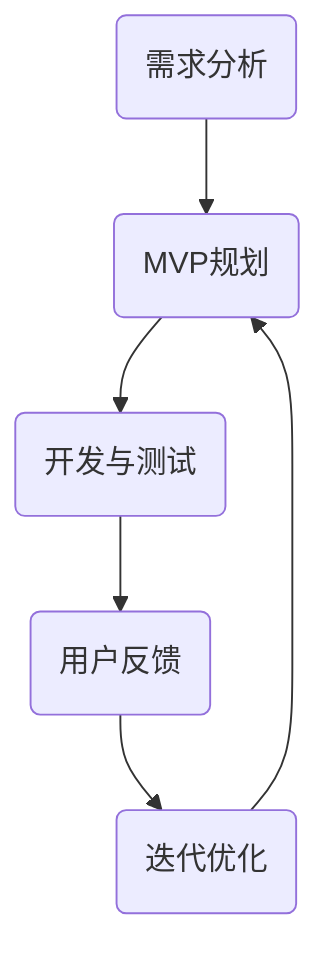
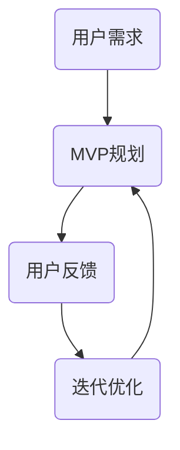
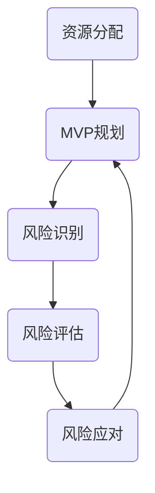

                 


# MVP开发中的常见误区及规避策略

> 关键词：MVP开发，产品迭代，用户反馈，资源分配，技术选型，风险控制
>
> 摘要：本文深入探讨了MVP（最小可行性产品）开发过程中常见的误区及其规避策略，旨在帮助开发者避免掉入这些陷阱，提高MVP开发的成功率。

## 1. 背景介绍

### 1.1 目的和范围

本文旨在分析MVP开发过程中的常见误区，并探讨如何规避这些误区，以提高MVP项目的成功率和产品市场匹配度。我们将讨论以下几个方面的内容：

- MVP开发的基本概念和原理
- MVP开发过程中的常见误区
- 针对每个误区的规避策略
- 实际案例中的应用

### 1.2 预期读者

本文适用于MVP开发初学者、有一定经验的产品经理和开发人员，以及关注产品开发流程的从业者。

### 1.3 文档结构概述

本文将分为以下几部分：

1. 背景介绍：介绍MVP开发的基本概念、目的和本文的结构。
2. 核心概念与联系：阐述MVP开发中的核心概念，并通过流程图展示其关系。
3. 核心算法原理 & 具体操作步骤：详细讲解MVP开发的方法和步骤。
4. 数学模型和公式 & 详细讲解 & 举例说明：介绍MVP开发中涉及的数学模型和公式。
5. 项目实战：代码实际案例和详细解释说明。
6. 实际应用场景：探讨MVP开发在不同领域的应用。
7. 工具和资源推荐：推荐相关学习资源、开发工具和论文著作。
8. 总结：未来发展趋势与挑战。
9. 附录：常见问题与解答。
10. 扩展阅读 & 参考资料：提供进一步学习的资料。

### 1.4 术语表

#### 1.4.1 核心术语定义

- MVP（最小可行性产品）：一款具有基本功能的产品，旨在验证市场需求，而非追求功能完整性。
- 产品迭代：根据用户反馈和市场变化，对产品进行持续改进和优化。
- 用户反馈：用户对产品使用的评价和意见，用于指导产品迭代和优化。
- 资源分配：在项目开发过程中，合理分配人力、时间和预算等资源。

#### 1.4.2 相关概念解释

- 用户需求：用户在特定情境下对产品的期望和需求。
- 技术选型：根据产品需求和项目目标，选择合适的技术方案。
- 风险控制：识别、评估和应对项目开发过程中可能出现的风险。

#### 1.4.3 缩略词列表

- MVP：最小可行性产品
- 用户反馈：User Feedback
- 资源分配：Resource Allocation
- 技术选型：Technology Selection
- 风险控制：Risk Control

## 2. 核心概念与联系

在MVP开发过程中，以下核心概念和关系至关重要：

### 2.1 MVP开发流程



### 2.2 用户需求与反馈



### 2.3 资源分配与风险控制



通过上述流程图，我们可以看到MVP开发的核心概念和关系。在接下来的章节中，我们将详细讨论每个概念和关系，并提供具体的操作步骤和策略。

## 3. 核心算法原理 & 具体操作步骤

### 3.1 MVP规划

MVP规划的目的是确定产品的核心功能和目标用户群体。以下是MVP规划的具体操作步骤：

#### 3.1.1 用户需求分析

1. **确定目标用户**：通过市场调研、竞品分析和用户访谈等方式，了解目标用户的需求和痛点。
2. **收集用户需求**：整理和分析用户需求，确定产品的核心功能和用户场景。
3. **用户优先级排序**：根据用户需求的重要性和优先级，划分核心功能和非核心功能。

#### 3.1.2 功能模块划分

1. **功能模块划分**：根据用户需求，将产品功能划分为多个模块，确保每个模块都具有独立的功能和意义。
2. **功能模块优先级排序**：根据用户优先级排序，确定每个功能模块的优先级，确保核心功能优先开发。

#### 3.1.3 MVP原型设计

1. **MVP原型设计**：根据功能模块的优先级，设计MVP的原型，明确产品的界面和交互逻辑。
2. **原型验证**：通过用户测试和反馈，验证MVP原型是否符合用户需求，并进行优化。

### 3.2 开发与测试

在确定MVP规划后，进行产品开发与测试。以下是具体的操作步骤：

#### 3.2.1 技术选型

1. **技术选型**：根据产品需求和开发团队的能力，选择合适的技术框架和工具。
2. **开发环境搭建**：搭建开发环境，包括服务器、数据库、开发工具等。

#### 3.2.2 功能实现

1. **功能实现**：根据MVP规划，逐步实现功能模块。
2. **代码规范**：编写规范、可维护的代码，确保代码质量和开发效率。

#### 3.2.3 测试与优化

1. **单元测试**：对每个功能模块进行单元测试，确保功能正确无误。
2. **集成测试**：对整个产品进行集成测试，确保各个模块之间的交互正常。
3. **性能测试**：对产品进行性能测试，确保在高峰期和压力情况下仍能稳定运行。

### 3.3 用户反馈与迭代优化

在产品开发完成后，进行用户反馈和迭代优化。以下是具体的操作步骤：

#### 3.3.1 用户反馈收集

1. **用户反馈收集**：通过用户调研、问卷调查、用户访谈等方式，收集用户对产品的评价和反馈。
2. **反馈分类与整理**：对用户反馈进行分类和整理，确定反馈的重要性和优先级。

#### 3.3.2 迭代优化

1. **迭代优化**：根据用户反馈，对产品进行持续优化和改进。
2. **功能迭代**：根据用户需求，逐步增加和优化产品功能。
3. **性能优化**：根据用户反馈和性能测试结果，对产品进行性能优化。

### 3.4 持续迭代与优化

MVP开发是一个持续迭代和优化的过程。以下是持续迭代与优化的具体操作步骤：

#### 3.4.1 定期评估

1. **定期评估**：定期对产品进行评估，分析用户满意度、市场表现和竞品情况。
2. **优化策略制定**：根据评估结果，制定相应的优化策略。

#### 3.4.2 持续改进

1. **持续改进**：根据优化策略，持续改进产品功能和用户体验。
2. **技术更新**：关注技术动态，适时更新和优化技术架构。

## 4. 数学模型和公式 & 详细讲解 & 举例说明

在MVP开发中，一些数学模型和公式可以帮助我们评估产品的性能和优化策略。以下是几个常用的数学模型和公式：

### 4.1 用户满意度评估模型

用户满意度是评估MVP成功与否的重要指标。以下是用户满意度评估模型：

$$
S = \frac{\sum_{i=1}^{n} w_i \cdot U_i}{\sum_{i=1}^{n} w_i}
$$

其中，$S$表示用户满意度，$w_i$表示第$i$个功能的权重，$U_i$表示第$i$个功能的用户评分。

#### 举例说明

假设我们有三个功能模块，其权重分别为0.4、0.3和0.3，用户评分分别为4、3和4。计算用户满意度：

$$
S = \frac{0.4 \cdot 4 + 0.3 \cdot 3 + 0.3 \cdot 4}{0.4 + 0.3 + 0.3} = \frac{1.6 + 0.9 + 1.2}{1.2} = \frac{3.7}{1.2} = 3.08
$$

用户满意度为3.08，说明用户对产品的满意度较高。

### 4.2 资源分配模型

资源分配模型用于优化MVP开发过程中的资源利用。以下是资源分配模型：

$$
\text{最大化}\ \sum_{i=1}^{n} p_i \cdot w_i
$$

其中，$p_i$表示第$i$个资源的分配量，$w_i$表示第$i$个资源的重要性权重。

#### 举例说明

假设我们有三个资源（人力、时间和预算），其重要性权重分别为0.5、0.3和0.2。计算最优资源分配：

$$
\text{最大化}\ \sum_{i=1}^{3} p_i \cdot w_i
$$

假设总资源量为100单位，我们进行如下分配：

- 人力：50单位
- 时间：30单位
- 预算：20单位

资源分配结果为：

$$
\sum_{i=1}^{3} p_i \cdot w_i = 50 \cdot 0.5 + 30 \cdot 0.3 + 20 \cdot 0.2 = 25 + 9 + 4 = 38
$$

最优资源分配为38，说明资源利用效率较高。

### 4.3 风险评估模型

风险评估模型用于评估MVP开发过程中可能出现的风险。以下是风险评估模型：

$$
R = \sum_{i=1}^{n} p_i \cdot C_i
$$

其中，$R$表示总风险值，$p_i$表示第$i$个风险的概率，$C_i$表示第$i$个风险的损失值。

#### 举例说明

假设我们有三个风险，其概率和损失值分别为：

- 风险1：概率0.3，损失值1000
- 风险2：概率0.4，损失值1500
- 风险3：概率0.3，损失值800

计算总风险值：

$$
R = 0.3 \cdot 1000 + 0.4 \cdot 1500 + 0.3 \cdot 800 = 300 + 600 + 240 = 1140
$$

总风险值为1140，说明MVP开发过程中可能面临较高的风险。

通过以上数学模型和公式，我们可以更好地评估MVP开发的性能和优化策略。在后续章节中，我们将结合实际案例，进一步探讨这些模型和公式的应用。

## 5. 项目实战：代码实际案例和详细解释说明

### 5.1 开发环境搭建

在开始MVP开发之前，我们需要搭建合适的开发环境。以下是一个简单的Python开发环境搭建过程：

1. 安装Python：访问[Python官方网站](https://www.python.org/)，下载并安装Python。
2. 安装IDE：选择合适的IDE，如PyCharm或VSCode，并安装Python插件。
3. 安装依赖库：使用pip命令安装所需的依赖库，例如：

   ```shell
   pip install flask
   pip install pandas
   pip install numpy
   ```

### 5.2 源代码详细实现和代码解读

以下是一个简单的MVP项目——基于Python的天气查询系统，用于演示MVP开发的核心步骤。

#### 5.2.1 功能需求分析

我们的目标是实现一个能够根据用户输入的城市名称查询天气情况的简单系统。主要功能包括：

- 用户输入城市名称
- 查询天气信息
- 输出天气结果

#### 5.2.2 功能模块划分

我们将天气查询系统划分为以下三个模块：

1. **输入模块**：负责接收用户输入的城市名称。
2. **查询模块**：负责从外部API获取天气信息。
3. **输出模块**：负责将天气结果输出给用户。

#### 5.2.3 代码实现

以下是基于Flask框架实现的天气查询系统代码：

```python
from flask import Flask, request, render_template
import requests

app = Flask(__name__)

# 天气API接口地址
API_URL = "http://api.openweathermap.org/data/2.5/weather"

# 天气API密钥
API_KEY = "your_api_key_here"

@app.route("/", methods=["GET", "POST"])
def index():
    weather_data = {}
    if request.method == "POST":
        city = request.form["city"]
        params = {
            "q": city,
            "appid": API_KEY,
            "units": "metric",
        }
        response = requests.get(API_URL, params=params)
        if response.status_code == 200:
            weather_data = response.json()
        else:
            weather_data = {"error": "Invalid city name or API key."}
    return render_template("index.html", weather_data=weather_data)

if __name__ == "__main__":
    app.run(debug=True)
```

#### 5.2.4 代码解读与分析

1. **导入库和设置**：我们首先导入所需的库，包括Flask和requests，并设置API接口地址和API密钥。
2. **定义应用**：创建Flask应用对象。
3. **定义路由和视图函数**：`index`函数处理用户请求，接收用户输入的城市名称，并通过requests库调用天气API获取天气信息。
4. **渲染模板**：使用`render_template`函数渲染`index.html`模板，将天气信息传递给前端页面。

以下是一个简单的`index.html`模板：

```html
<!DOCTYPE html>
<html>
<head>
    <title>Weather Query</title>
</head>
<body>
    <h1>Weather Query</h1>
    <form method="post">
        <input type="text" name="city" placeholder="Enter city name">
        <input type="submit" value="Query">
    </form>
    
        
            <p>Error: {{ weather_data.error }}</p>
        
            <p>City: {{ weather_data.name }}</p>
            <p>Temperature: {{ weather_data.main.temp }}°C</p>
            <p>Weather: {{ weather_data.weather[0].description }}</p>
        
    
</body>
</html>
```

1. **HTML结构**：定义表单和输入框，用于接收用户输入的城市名称。
2. **条件判断**：根据天气信息是否成功获取，显示相应的提示信息。

通过以上代码实现，我们完成了一个简单的MVP天气查询系统。在实际项目中，我们还可以继续添加更多功能和优化，如添加更多天气信息、缓存天气数据、实现错误处理等。

### 5.3 代码解读与分析

#### 5.3.1 输入模块

输入模块主要负责接收用户输入的城市名称。在`index`函数中，我们通过`request.form["city"]`获取用户输入的城市名称。该操作非常简单，但需要注意输入验证，以避免用户输入非法字符或导致API调用失败。

#### 5.3.2 查询模块

查询模块负责调用天气API获取天气信息。我们使用requests库向API接口发送GET请求，传递城市名称和API密钥等参数。需要注意的是，我们需要处理API返回的响应，以确保成功获取天气信息。

#### 5.3.3 输出模块

输出模块负责将天气结果输出给用户。我们使用Flask的模板渲染功能，将天气信息传递给前端页面，并在`index.html`模板中根据天气信息是否成功获取显示相应的提示信息。

通过以上代码解读与分析，我们可以更好地理解MVP开发的核心步骤和关键模块。在实际项目中，我们可以根据需求进一步优化和扩展系统功能，以满足用户需求和市场变化。

## 6. 实际应用场景

MVP开发模式在众多领域和行业中具有广泛的应用。以下是一些实际应用场景：

### 6.1 创业公司

对于初创公司，MVP开发模式可以帮助他们在资源有限的情况下快速验证市场需求，降低创业风险。初创公司通常面临预算有限、团队规模较小等问题，通过MVP模式，他们可以迅速构建一个具备核心功能的产品原型，吸引早期用户，获取反馈，并根据用户需求进行迭代优化。

### 6.2 软件开发

在软件行业中，MVP开发模式被广泛应用于新产品开发。开发团队可以首先构建一个具有基本功能的产品原型，然后根据用户反馈逐步增加和优化功能。这种模式有助于提高开发效率，降低开发成本，确保产品满足用户需求。

### 6.3 硬件产品

对于硬件产品的开发，MVP模式可以帮助团队验证产品原型，测试产品性能，并根据用户反馈进行优化。通过MVP模式，硬件团队可以更快地推出产品，降低研发风险，提高市场竞争力。

### 6.4 金融科技

在金融科技领域，MVP开发模式被用于构建创新型金融产品。例如，一些金融科技公司通过MVP模式开发金融应用，快速验证市场需求，并在短时间内获取用户反馈。这种模式有助于降低金融产品开发的风险，提高市场适应能力。

### 6.5 教育培训

在教育领域，MVP开发模式可以帮助教育机构快速开发在线课程平台，吸引学员，并根据学员反馈不断优化课程内容和教学方式。这种模式有助于提高教育机构的市场竞争力，降低课程开发成本。

### 6.6 医疗健康

在医疗健康领域，MVP开发模式可以帮助医疗机构快速开发医疗信息系统，提高医疗服务质量。例如，医院可以通过MVP模式开发电子病历系统、在线问诊平台等，提高医疗效率，降低医疗成本。

### 6.7 物流配送

在物流配送领域，MVP开发模式可以帮助物流公司快速构建物流管理系统，优化配送流程，提高物流效率。通过MVP模式，物流公司可以更快地响应市场变化，提高客户满意度。

### 6.8 社交媒体

在社交媒体领域，MVP开发模式被用于开发新型社交应用。通过MVP模式，社交媒体团队可以快速验证用户需求，优化应用功能，吸引更多用户，提高市场占有率。

通过以上实际应用场景，我们可以看到MVP开发模式在不同领域和行业中的广泛应用。这种模式有助于降低开发风险，提高产品市场匹配度，为企业和团队带来更高的成功率。

## 7. 工具和资源推荐

### 7.1 学习资源推荐

#### 7.1.1 书籍推荐

1. **《精益创业》**（作者：埃里克·莱斯）：介绍了MVP开发模式及其在创业中的应用。
2. **《产品经理实战手册》**（作者：徐晓东）：详细讲解了产品开发的全过程，包括MVP开发。
3. **《人人都是产品经理》**（作者：苏杰）：介绍了产品经理的工作方法和实战技巧。

#### 7.1.2 在线课程

1. **Coursera**：提供丰富的产品开发、创业管理等相关在线课程。
2. **Udemy**：提供各种编程语言、技术框架等在线课程，有助于提升开发技能。
3. **Product School**：专注于产品管理和创业领域的在线教育平台。

#### 7.1.3 技术博客和网站

1. **Medium**：许多产品经理和开发者在此分享经验和案例。
2. **GitHub**：可以找到许多优秀的开源项目和MVP案例。
3. **Product Hunt**：展示最新的产品和创新，有助于了解市场趋势。

### 7.2 开发工具框架推荐

#### 7.2.1 IDE和编辑器

1. **PyCharm**：适用于Python开发的集成开发环境。
2. **VSCode**：跨平台、功能强大的代码编辑器。
3. **Xcode**：适用于iOS开发的集成开发环境。

#### 7.2.2 调试和性能分析工具

1. **Postman**：API调试和性能测试工具。
2. **JMeter**：适用于Web应用和服务的性能测试工具。
3. **Fiddler**：网络调试和监控工具。

#### 7.2.3 相关框架和库

1. **Flask**：Python Web开发框架，适用于构建简单的Web应用。
2. **Django**：Python Web开发框架，适用于快速构建高性能Web应用。
3. **React**：JavaScript库，适用于构建用户界面。

### 7.3 相关论文著作推荐

#### 7.3.1 经典论文

1. **《精益创业》**（作者：埃里克·莱斯）：介绍了MVP开发模式及其在创业中的应用。
2. **《产品经理实战手册》**（作者：徐晓东）：详细讲解了产品开发的全过程，包括MVP开发。
3. **《人人都是产品经理》**（作者：苏杰）：介绍了产品经理的工作方法和实战技巧。

#### 7.3.2 最新研究成果

1. **《敏捷开发实践指南》**（作者：Jeff Sutherland）：介绍了敏捷开发方法及其在MVP开发中的应用。
2. **《数字化产品创新》**（作者：Nassim Taleb）：探讨了数字化时代的产品创新策略。
3. **《设计思维》**（作者：Tim Brown）：介绍了设计思维在产品开发中的应用。

#### 7.3.3 应用案例分析

1. **《Airbnb如何通过MVP快速成长》**：详细分析了Airbnb如何通过MVP模式实现快速增长。
2. **《LinkedIn如何通过MVP优化用户体验》**：探讨了LinkedIn如何通过MVP模式提升用户体验。
3. **《Uber如何通过MVP抢占市场》**：介绍了Uber如何通过MVP模式迅速占领市场。

通过以上学习和资源推荐，开发者可以更好地了解MVP开发模式，提升产品开发能力，为项目成功奠定基础。

## 8. 总结：未来发展趋势与挑战

随着技术的不断进步和市场竞争的加剧，MVP开发模式在未来的发展趋势和挑战如下：

### 8.1 发展趋势

1. **快速迭代与优化**：随着用户需求的不断变化，MVP开发模式将越来越注重快速迭代和优化，以满足用户需求和市场变化。
2. **数据驱动**：MVP开发将更加依赖于数据分析和用户反馈，以指导产品优化和迭代。
3. **AI与MVP结合**：人工智能技术将被广泛应用于MVP开发，例如通过自然语言处理和机器学习技术提高用户需求分析准确性。
4. **平台化**：MVP开发将逐渐平台化，提供一站式解决方案，降低开发门槛，提高开发效率。

### 8.2 挑战

1. **资源有限**：在MVP开发过程中，资源（如人力、时间和预算）有限，如何合理分配和高效利用资源成为一大挑战。
2. **用户需求变化**：用户需求多变，如何快速识别和适应用户需求变化，确保产品持续优化成为挑战。
3. **技术选型**：在众多技术框架和工具中，如何选择合适的技术方案，确保产品性能和可维护性成为挑战。
4. **市场竞争**：在激烈的市场竞争中，如何通过MVP开发快速抢占市场份额，提高产品竞争力成为挑战。

为了应对这些挑战，开发者需要不断提升自身技能，关注市场动态，积极探索新技术，并优化MVP开发流程。只有这样，才能在未来的市场竞争中立于不败之地。

## 9. 附录：常见问题与解答

### 9.1 MVP是什么？

MVP（最小可行性产品）是一种产品开发方法，旨在通过构建具有核心功能的产品原型，验证市场需求，并快速获取用户反馈，以便在后续开发中进行优化。

### 9.2 MVP开发的优势有哪些？

MVP开发的优势包括：

- 降低开发成本：通过构建最小可行性产品，减少功能冗余，降低开发成本。
- 快速验证市场需求：通过用户反馈，快速验证市场需求，降低市场风险。
- 提高开发效率：注重核心功能，提高开发效率，确保产品在短时间内上线。
- 灵活应对变化：根据用户反馈和市场变化，快速调整和优化产品，提高市场适应性。

### 9.3 MVP开发过程中如何处理用户反馈？

在MVP开发过程中，处理用户反馈的方法包括：

- 定期收集：定期收集用户反馈，包括问卷调查、用户访谈等方式。
- 分析整理：对用户反馈进行分类和整理，确定反馈的重要性和优先级。
- 迭代优化：根据用户反馈，对产品进行持续优化和改进。
- 反馈验证：在每次迭代后，验证用户反馈是否得到解决，确保产品持续改进。

### 9.4 MVP开发中的常见风险有哪些？

MVP开发中的常见风险包括：

- 资源有限：资源（如人力、时间和预算）不足，可能导致项目进度延误。
- 用户需求变化：用户需求多变，可能导致产品方向偏离。
- 技术选型不当：选择不合适的技术方案，可能导致产品性能和可维护性下降。
- 市场竞争：在激烈的市场竞争中，可能无法快速抢占市场份额。

### 9.5 如何提高MVP项目的成功率？

提高MVP项目成功率的策略包括：

- 明确目标：确定产品目标和市场定位，确保产品方向正确。
- 优化团队：组建高效、专业的开发团队，确保项目顺利进行。
- 用户参与：让用户参与产品设计和迭代，提高产品市场匹配度。
- 数据驱动：依靠数据分析，指导产品优化和迭代。
- 持续学习：关注市场动态，不断学习新技术，提高自身竞争力。

通过以上常见问题与解答，开发者可以更好地了解MVP开发的方法和策略，提高项目成功率。

## 10. 扩展阅读 & 参考资料

为了进一步深入了解MVP开发及其相关概念，读者可以参考以下扩展阅读和参考资料：

### 10.1 书籍推荐

1. 《精益创业》：作者埃里克·莱斯，详细介绍了MVP开发模式及其在创业中的应用。
2. 《产品经理实战手册》：作者徐晓东，介绍了产品开发的全过程，包括MVP开发。
3. 《人人都是产品经理》：作者苏杰，介绍了产品经理的工作方法和实战技巧。

### 10.2 在线课程

1. Coursera：提供丰富的产品开发、创业管理等相关在线课程。
2. Udemy：提供各种编程语言、技术框架等在线课程，有助于提升开发技能。
3. Product School：专注于产品管理和创业领域的在线教育平台。

### 10.3 技术博客和网站

1. Medium：许多产品经理和开发者在此分享经验和案例。
2. GitHub：可以找到许多优秀的开源项目和MVP案例。
3. Product Hunt：展示最新的产品和创新，有助于了解市场趋势。

### 10.4 相关论文著作

1. 《敏捷开发实践指南》：作者Jeff Sutherland，介绍了敏捷开发方法及其在MVP开发中的应用。
2. 《数字化产品创新》：作者Nassim Taleb，探讨了数字化时代的产品创新策略。
3. 《设计思维》：作者Tim Brown，介绍了设计思维在产品开发中的应用。

### 10.5 应用案例分析

1. 《Airbnb如何通过MVP快速成长》：详细分析了Airbnb如何通过MVP模式实现快速增长。
2. 《LinkedIn如何通过MVP优化用户体验》：探讨了LinkedIn如何通过MVP模式提升用户体验。
3. 《Uber如何通过MVP抢占市场》：介绍了Uber如何通过MVP模式迅速占领市场。

通过以上扩展阅读和参考资料，读者可以更全面地了解MVP开发的方法、策略和实践，为自身项目提供有益的参考。

