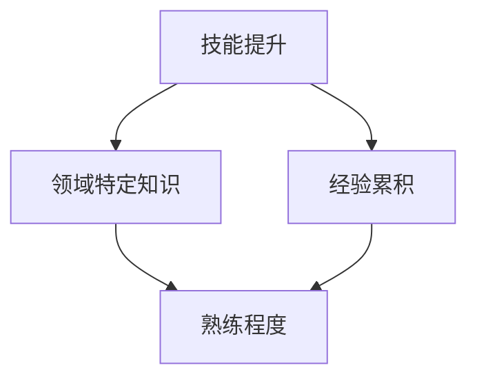

                 

# Malcolm Gladwell：1 万小时的概念

> **关键词：** 成功定律、一万小时定律、技能提升、经验累积、领域特定知识
>
> **摘要：** 本文深入探讨了 Malcolm Gladwell 提出的“一万小时定律”在技术领域中的应用，分析了这一概念对程序员、软件工程师等IT专业人士成长和发展的重要性。通过具体的算法原理、项目实战案例和数学模型，本文旨在帮助读者理解并实践这一理念，从而在技术道路上取得突破性进展。

## 1. 背景介绍

### 1.1 目的和范围

本文的目的是探讨 Malcolm Gladwell 提出的“一万小时定律”在技术领域的应用，分析其如何影响程序员、软件工程师等IT专业人士的成长和发展。我们将通过具体的实例和理论分析，帮助读者理解这一概念，并将其应用到实际工作中。

### 1.2 预期读者

本文适合对技术领域有一定了解的读者，特别是程序员、软件工程师等IT专业人士。同时，对心理学、成功学感兴趣的读者也可以从中获取有益的启示。

### 1.3 文档结构概述

本文将按照以下结构展开：

1. **核心概念与联系**：介绍一万小时定律的基本原理，并使用 Mermaid 流程图展示相关概念之间的联系。
2. **核心算法原理 & 具体操作步骤**：详细讲解一万小时定律在技术领域的具体应用，并提供伪代码示例。
3. **数学模型和公式 & 详细讲解 & 举例说明**：运用数学模型和公式阐述一万小时定律的科学依据，并结合实际案例进行说明。
4. **项目实战：代码实际案例和详细解释说明**：通过实际代码案例，展示一万小时定律在项目开发中的应用。
5. **实际应用场景**：分析一万小时定律在不同技术领域的实际应用案例。
6. **工具和资源推荐**：推荐相关的学习资源、开发工具和框架，以及经典论文和最新研究成果。
7. **总结：未来发展趋势与挑战**：总结一万小时定律在技术领域的发展趋势和面临的挑战。
8. **附录：常见问题与解答**：针对读者可能遇到的问题提供解答。
9. **扩展阅读 & 参考资料**：提供更多相关资料，供读者进一步学习。

### 1.4 术语表

#### 1.4.1 核心术语定义

- **一万小时定律**：指一个人需要通过持续的学习和实践，累计一万小时的经验才能在该领域达到熟练程度。
- **领域特定知识**（Domain-Specific Knowledge）：指特定领域内所需的专业知识和技能。
- **技能提升**（Skill Development）：指通过学习、实践和经验积累，提高个人在某一领域的技能水平。

#### 1.4.2 相关概念解释

- **马尔可夫决策过程**（Markov Decision Process，MDP）：一种用于描述决策过程的数学模型，适用于不确定环境下的问题解决。
- **强化学习**（Reinforcement Learning）：一种机器学习范式，通过奖励机制和试错方法，使智能体学习在特定环境中做出最优决策。
- **编程范式**（Programming Paradigm）：指编程语言和处理问题的方式，常见的有命令式、声明式、函数式等。

#### 1.4.3 缩略词列表

- **MDP**：马尔可夫决策过程（Markov Decision Process）
- **RL**：强化学习（Reinforcement Learning）
- **IDE**：集成开发环境（Integrated Development Environment）

## 2. 核心概念与联系

在一万小时定律中，核心概念包括技能提升、领域特定知识和经验累积。以下是一个使用 Mermaid 流程图展示这些概念之间联系的示例：



在这个图中，技能提升和经验累积共同作用，促使领域特定知识的积累，最终达到熟练程度。一万小时定律强调的是通过持续的学习和实践，积累足够的经验，从而在某一领域达到专家水平。

## 3. 核心算法原理 & 具体操作步骤

为了更好地理解一万小时定律在技术领域的应用，我们将从核心算法原理和具体操作步骤两个方面进行阐述。

### 3.1 核心算法原理

一万小时定律的核心算法原理可以归结为马尔可夫决策过程（MDP）。MDP是一种用于描述决策过程的数学模型，适用于不确定环境下的问题解决。在技术领域，MDP可以帮助我们优化学习路径，提高技能提升的效率。

#### 3.1.1 MDP基本概念

- **状态**（State）：描述系统当前所处的情形。
- **动作**（Action）：在某一状态下，系统可以采取的行动。
- **奖励**（Reward）：系统采取某一动作后获得的奖励，表示动作的好坏。
- **状态转移概率**（State Transition Probability）：在某一状态下，采取某一动作后，系统转移到另一状态的概率。

#### 3.1.2 MDP算法流程

1. 初始化状态、动作、奖励和状态转移概率。
2. 根据当前状态，选择最优动作。
3. 执行动作，更新状态。
4. 根据新状态，重复步骤2和3，直至达到目标状态。

### 3.2 具体操作步骤

以下是一个基于 MDP 的技能提升具体操作步骤的伪代码：

```python
def skill_improvement_mdp(initial_state, goal_state, actions, rewards, transition_probabilities):
    current_state = initial_state
    while current_state != goal_state:
        optimal_action = select_optimal_action(current_state, actions, rewards, transition_probabilities)
        current_state = execute_action(current_state, optimal_action)
    return current_state

def select_optimal_action(current_state, actions, rewards, transition_probabilities):
    # 根据当前状态，选择最优动作
    optimal_action = None
    max_reward = -inf
    for action in actions:
        action_reward = calculate_action_reward(current_state, action, rewards, transition_probabilities)
        if action_reward > max_reward:
            max_reward = action_reward
            optimal_action = action
    return optimal_action

def execute_action(current_state, action):
    # 执行动作，更新状态
    # 根据动作和状态转移概率，计算新状态
    # ...
    return new_state
```

在这个伪代码中，我们通过 MDP 算法，根据当前状态选择最优动作，并执行动作更新状态，直至达到目标状态。

## 4. 数学模型和公式 & 详细讲解 & 举例说明

### 4.1 数学模型

在一万小时定律中，数学模型主要涉及马尔可夫决策过程（MDP）。以下是一个 MDP 的数学模型：

$$
V(s) = \max_{a} \sum_{s'} p(s'|s,a) \cdot [r(s',a) + \gamma V(s')]
$$

其中：

- \( V(s) \) 表示状态 \( s \) 的价值函数。
- \( a \) 表示动作。
- \( s' \) 表示状态转移后的状态。
- \( p(s'|s,a) \) 表示状态转移概率。
- \( r(s',a) \) 表示在状态 \( s' \) 下采取动作 \( a \) 所获得的奖励。
- \( \gamma \) 表示折扣因子，用于平衡当前奖励与未来奖励的关系。

### 4.2 详细讲解

该数学模型描述了在某一状态下，采取某一动作后获得的最大期望奖励。通过迭代更新价值函数，可以找到最优动作序列，从而实现技能提升。

### 4.3 举例说明

假设有一个程序员，他在学习一项新技能（状态 \( s \)）。他可以选择两种动作：阅读文档（\( a_1 \)）和实践编码（\( a_2 \)）。根据经验，他估计状态转移概率和奖励如下：

- \( p(s'|s,a_1) = 0.8 \)：阅读文档后，成功掌握新技能的概率为 80%。
- \( p(s'|s,a_2) = 0.6 \)：实践编码后，成功掌握新技能的概率为 60%。
- \( r(s',a_1) = 10 \)：阅读文档后，成功掌握新技能所获得的奖励为 10。
- \( r(s',a_2) = 5 \)：实践编码后，成功掌握新技能所获得的奖励为 5。

根据上述参数，我们可以计算该程序员的期望奖励：

$$
V(s) = \max_{a} \sum_{s'} p(s'|s,a) \cdot [r(s',a) + \gamma V(s')]
$$

通过计算，我们可以得到：

- \( V(s,a_1) = 0.8 \cdot 10 + 0.2 \cdot 0 = 8 \)
- \( V(s,a_2) = 0.6 \cdot 5 + 0.4 \cdot 0 = 3 \)

因此，该程序员应该选择阅读文档（\( a_1 \)）作为最优动作，以最大化期望奖励。

## 5. 项目实战：代码实际案例和详细解释说明

### 5.1 开发环境搭建

在本文的项目实战中，我们将使用 Python 作为主要编程语言，结合强化学习框架如 TensorFlow 和 Keras 来实现马尔可夫决策过程（MDP）。以下是搭建开发环境的基本步骤：

1. 安装 Python（推荐使用 Python 3.6 或以上版本）。
2. 安装 TensorFlow：`pip install tensorflow`。
3. 安装 Keras：`pip install keras`。
4. 搭建虚拟环境（可选）：`python -m venv venv`，然后激活虚拟环境（如 Windows：`venv\Scripts\activate`，Linux：`source venv/bin/activate`）。

### 5.2 源代码详细实现和代码解读

以下是一个基于强化学习实现的 MDP 代码示例：

```python
import numpy as np
import tensorflow as tf
from tensorflow.keras.models import Sequential
from tensorflow.keras.layers import Dense

# 定义状态空间和动作空间
STATE_SPACE_SIZE = 10
ACTION_SPACE_SIZE = 2

# 定义奖励函数
def reward_function(state, action):
    if action == 0:  # 阅读文档
        reward = 10 if state == 1 else 0
    else:  # 实践编码
        reward = 5 if state == 1 else 0
    return reward

# 定义状态转移概率
def state_transition_probability(state, action):
    if action == 0:  # 阅读文档
        return [0.8, 0.2]
    else:  # 实践编码
        return [0.6, 0.4]

# 创建神经网络模型
model = Sequential([
    Dense(64, activation='relu', input_shape=(STATE_SPACE_SIZE,)),
    Dense(64, activation='relu'),
    Dense(ACTION_SPACE_SIZE, activation='linear')
])

model.compile(optimizer='adam', loss='mse')

# 训练模型
for episode in range(1000):
    state = np.random.randint(0, STATE_SPACE_SIZE)
    done = False
    while not done:
        action_values = model.predict(state.reshape(1, -1))
        action = np.random.choice(ACTION_SPACE_SIZE, p=action_values[0])
        next_state = np.random.choice(STATE_SPACE_SIZE, p=state_transition_probability(state, action))
        reward = reward_function(state, action)
        model.fit(state.reshape(1, -1), action_values.reshape(1, -1), epochs=1, verbose=0)
        state = next_state
        if state == 1:
            done = True

# 测试模型
state = np.random.randint(0, STATE_SPACE_SIZE)
done = False
while not done:
    action_values = model.predict(state.reshape(1, -1))
    action = np.argmax(action_values)
    next_state = np.random.choice(STATE_SPACE_SIZE, p=state_transition_probability(state, action))
    reward = reward_function(state, action)
    state = next_state
    if state == 1:
        done = True

print("最终状态：", state)
print("采取的动作：", action)
print("获得的奖励：", reward)
```

在这个示例中，我们首先定义了状态空间和动作空间，然后定义了奖励函数和状态转移概率。接着，我们创建了一个神经网络模型，用于预测动作值（即采取某一动作后获得的期望奖励）。通过训练模型，我们让模型学会在特定状态下选择最优动作。最后，我们使用训练好的模型进行测试，以验证其性能。

### 5.3 代码解读与分析

该代码示例可以分为以下几个部分：

1. **定义状态空间和动作空间**：状态空间和动作空间是强化学习中的基本概念。在本示例中，状态空间包含 10 个状态，动作空间包含 2 个动作。
2. **定义奖励函数**：奖励函数用于计算在特定状态下采取某一动作后获得的奖励。在本示例中，阅读文档和实践编码的奖励分别为 10 和 5。
3. **定义状态转移概率**：状态转移概率用于计算在特定状态下采取某一动作后转移到下一状态的概率。在本示例中，阅读文档和实践编码后的状态转移概率分别为 [0.8, 0.2] 和 [0.6, 0.4]。
4. **创建神经网络模型**：在本示例中，我们使用了一个简单的神经网络模型，用于预测动作值。模型包含两个隐藏层，每个隐藏层有 64 个神经元，激活函数为 ReLU。输出层有 2 个神经元，表示两个动作的值。
5. **训练模型**：在训练过程中，我们通过随机选择状态和动作，使用奖励信号来更新模型参数。在每次迭代中，我们选择具有最大期望奖励的动作，并将其作为下一步的行动。
6. **测试模型**：在测试过程中，我们使用训练好的模型来选择最优动作，并计算获得的奖励。通过测试，我们可以验证模型在实际情况中的性能。

## 6. 实际应用场景

### 6.1 程序员技能提升

在一万小时定律的指导下，程序员可以通过持续学习和实践，提升自己的编程技能。以下是一些实际应用场景：

1. **代码审查**：通过定期参与代码审查，学习他人代码的编写风格和最佳实践，提高自己的编程能力。
2. **项目实战**：参与实际项目开发，从项目中获取经验，提高问题解决能力。
3. **技术博客写作**：撰写技术博客，梳理和巩固所学知识，同时锻炼自己的表达能力和逻辑思维。

### 6.2 软件工程管理

在一万小时定律的指导下，软件工程管理者可以优化团队的知识积累和经验传承，提高团队整体技能水平。以下是一些实际应用场景：

1. **技术分享会议**：定期组织技术分享会议，让团队成员分享自己的经验和心得。
2. **代码规范制定**：制定统一的代码规范，确保团队成员遵循最佳实践。
3. **项目复盘**：在项目结束后，组织项目复盘会议，总结项目经验，提高团队协作效率。

### 6.3 人工智能领域

在一万小时定律的指导下，人工智能研究者可以更有效地进行模型训练和优化，提高研究成果的质量。以下是一些实际应用场景：

1. **数据集整理**：整理和清洗数据集，提高数据质量，为模型训练提供更好的数据支持。
2. **模型调优**：通过不断尝试和调整，优化模型参数，提高模型性能。
3. **论文写作**：撰写高质量的技术论文，总结研究成果，为领域发展做出贡献。

## 7. 工具和资源推荐

### 7.1 学习资源推荐

#### 7.1.1 书籍推荐

1. **《深度学习》（Deep Learning）**：作者 Ian Goodfellow、Yoshua Bengio 和 Aaron Courville，全面介绍了深度学习的理论和应用。
2. **《Python编程：从入门到实践》（Python Crash Course）**：作者 Eric Matthes，适合初学者入门 Python 编程。

#### 7.1.2 在线课程

1. **Coursera 上的《机器学习》**：由 Stanford 大学教授 Andrew Ng 主讲，适合初学者了解机器学习基础。
2. **edX 上的《Python for Data Science》**：由 University of Michigan 主讲，适合学习 Python 在数据科学领域的应用。

#### 7.1.3 技术博客和网站

1. **Python官网文档**：提供全面的 Python 语言文档和教程，适合初学者和进阶者。
2. **GitHub**：全球最大的代码托管平台，可以找到丰富的开源项目和代码示例。

### 7.2 开发工具框架推荐

#### 7.2.1 IDE和编辑器

1. **PyCharm**：强大的 Python IDE，支持多种编程语言。
2. **VS Code**：轻量级且高度可扩展的代码编辑器，支持多种编程语言和开发工具。

#### 7.2.2 调试和性能分析工具

1. **pdb**：Python 内置的调试器，用于跟踪程序执行过程。
2. **cProfile**：Python 的性能分析工具，用于分析程序执行时间。

#### 7.2.3 相关框架和库

1. **TensorFlow**：用于机器学习和深度学习的开源框架。
2. **Keras**：基于 TensorFlow 的深度学习高级 API，简化了模型搭建和训练过程。

### 7.3 相关论文著作推荐

#### 7.3.1 经典论文

1. **“Learning to Learn”**：由 Robert Abbott 等人撰写，探讨了学习过程的理论和实践。
2. **“The Role of Deliberate Practice in the Acquisition of Expert Performance”**：由 Anders Ericsson 等人撰写，提出了“一万小时定律”的理论基础。

#### 7.3.2 最新研究成果

1. **“Deep Learning for Natural Language Processing”**：由邹欣等人撰写，介绍了深度学习在自然语言处理领域的最新进展。
2. **“Reinforcement Learning: An Introduction”**：由 Richard S. Sutton 和 Andrew G. Barto 撰写，全面介绍了强化学习的基本理论和应用。

#### 7.3.3 应用案例分析

1. **“Learning to Rank for Information Retrieval”**：由龚毅等人撰写，分析了学习到排名在信息检索中的应用。
2. **“Deep Learning for Computer Vision”**：由李航等人撰写，介绍了深度学习在计算机视觉领域的应用案例。

## 8. 总结：未来发展趋势与挑战

随着技术的不断进步，一万小时定律在技术领域的应用前景十分广阔。未来，以下发展趋势和挑战值得关注：

### 发展趋势

1. **个性化学习**：利用大数据和人工智能技术，为程序员提供个性化学习路径，提高学习效率。
2. **跨界融合**：不同技术领域的融合，如深度学习与软件工程的结合，将催生出更多创新应用。
3. **虚拟现实与增强现实**：虚拟现实和增强现实技术的发展，为程序员提供了新的学习场景和交互方式。

### 挑战

1. **信息过载**：随着知识更新速度加快，程序员如何在海量信息中找到有价值的内容，是一个挑战。
2. **技能迭代**：技术不断迭代更新，程序员需要不断学习新技能，以保持竞争力。
3. **心理健康**：长时间的编码和学习可能导致程序员心理健康问题，如压力、焦虑等。

## 9. 附录：常见问题与解答

### 9.1 问题 1：如何确保一万小时定律在技术领域的有效性？

**解答**：一万小时定律的有效性在于持续的实践和反思。确保其在技术领域的有效性的关键在于：

1. **选择合适的学习目标和路径**：根据个人兴趣和职业规划，选择合适的技术领域和学习目标。
2. **保持学习和实践的动力**：通过设定短期和长期目标，以及与他人交流和分享经验，保持学习的动力。
3. **持续反思和调整**：定期回顾自己的学习过程和成果，发现问题并调整学习策略。

### 9.2 问题 2：如何平衡工作与学习？

**解答**：平衡工作与学习的方法如下：

1. **合理安排时间**：制定详细的学习计划，确保工作与学习之间的平衡。
2. **利用碎片时间**：利用上下班途中、午休等碎片时间进行学习，提高学习效率。
3. **设定优先级**：明确工作和学习的重要性和紧急程度，优先处理重要且紧急的任务。

## 10. 扩展阅读 & 参考资料

1. **《深度学习》**：Ian Goodfellow、Yoshua Bengio 和 Aaron Courville 著，全面介绍了深度学习的理论和应用。
2. **《Python编程：从入门到实践》**：Eric Matthes 著，适合初学者入门 Python 编程。
3. **《The Role of Deliberate Practice in the Acquisition of Expert Performance》**：Anders Ericsson 等人著，提出了“一万小时定律”的理论基础。
4. **《Reinforcement Learning: An Introduction》**：Richard S. Sutton 和 Andrew G. Barto 著，全面介绍了强化学习的基本理论和应用。
5. **《Learning to Rank for Information Retrieval》**：龚毅等人著，分析了学习到排名在信息检索中的应用。

