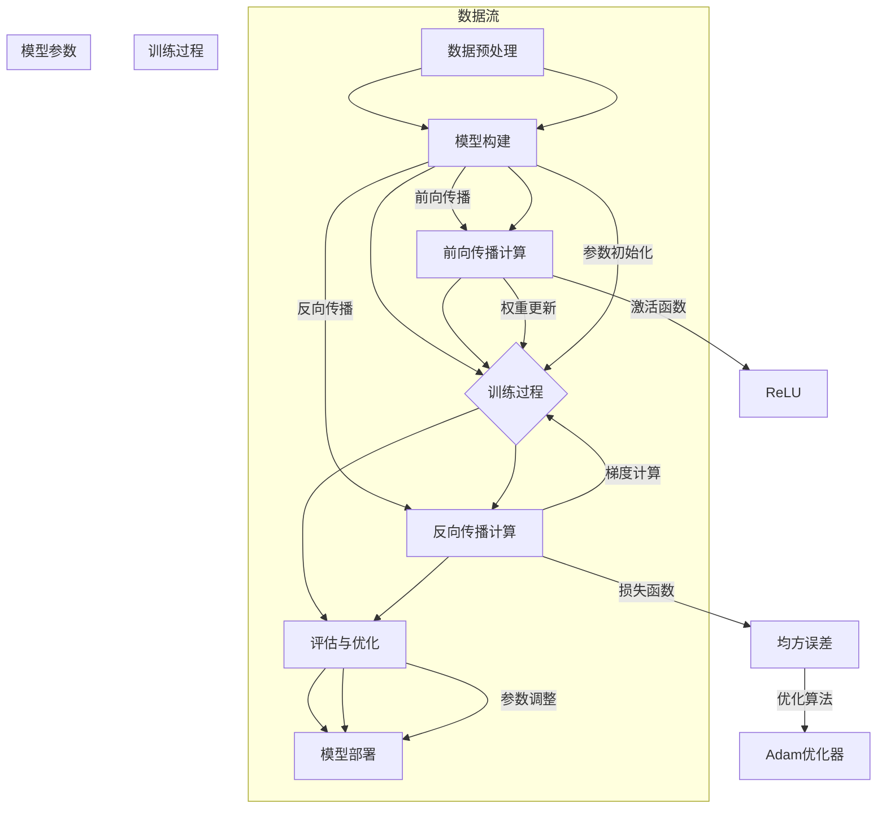
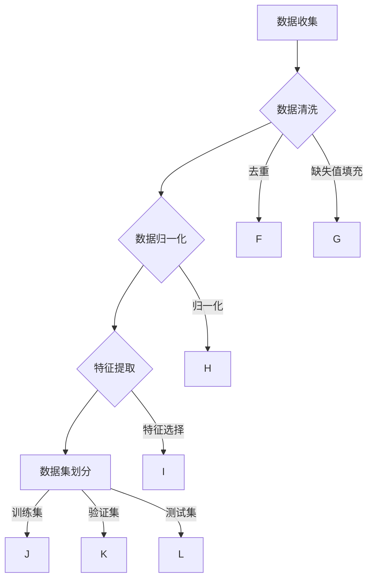
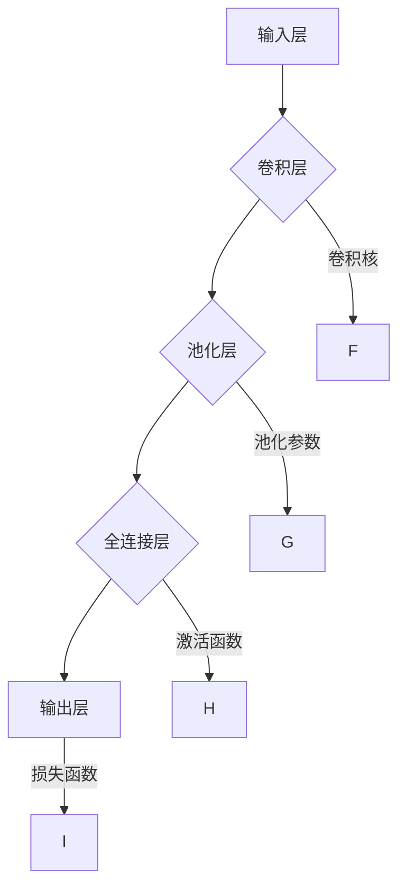
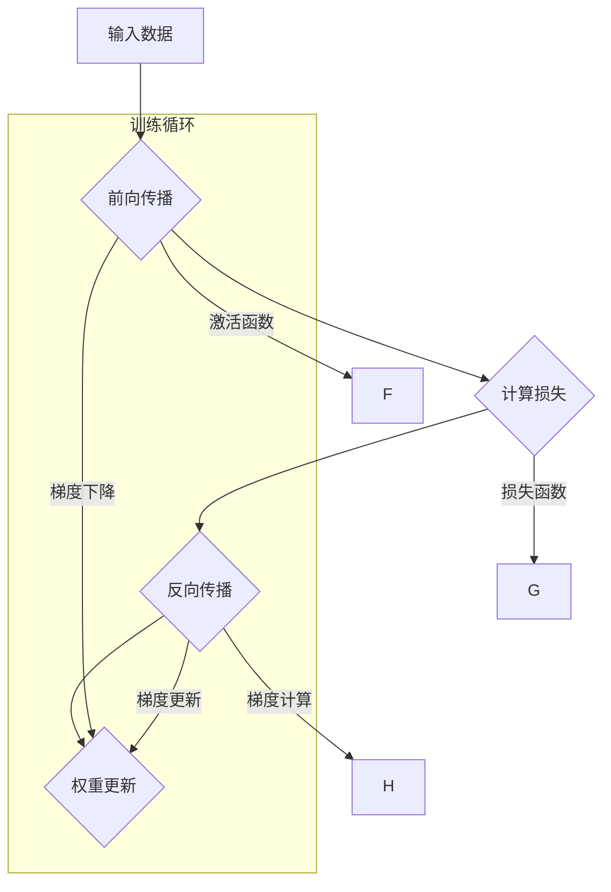
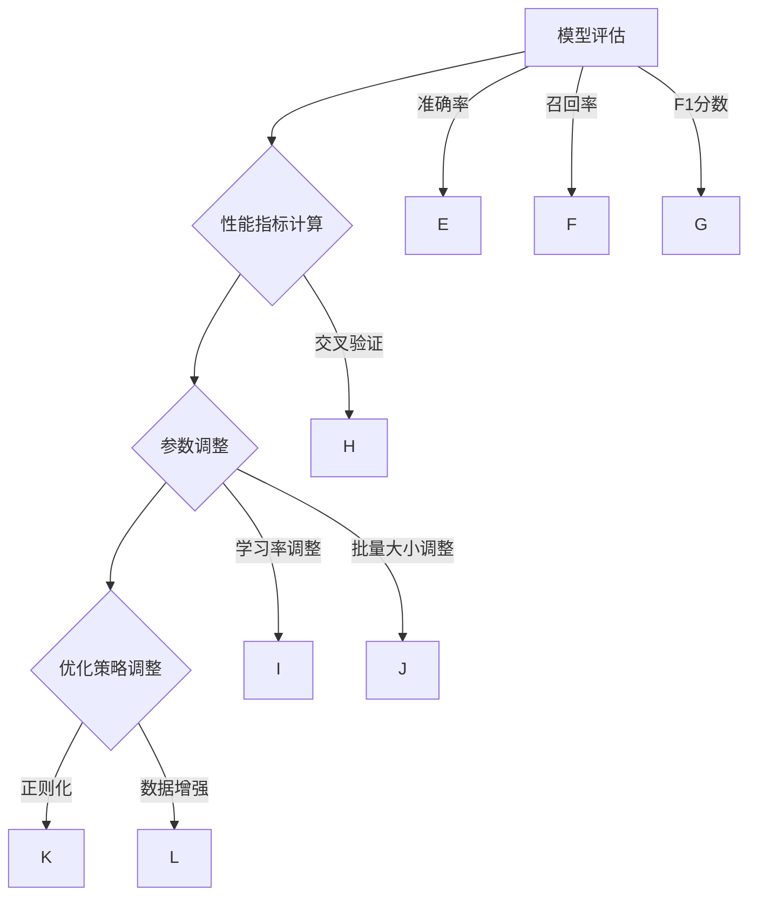

                 

# Midjourney原理与代码实例讲解

> 关键词：Midjourney, AI, 代码实例，原理讲解，深度学习，神经网络，架构设计，性能优化，模型训练

> 摘要：本文旨在深入探讨Midjourney的核心原理，并通过具体的代码实例详细解释其实现过程。文章分为背景介绍、核心概念与联系、核心算法原理、数学模型和公式、项目实战、实际应用场景、工具和资源推荐、总结与展望等部分，旨在为广大读者提供一个系统、全面、易于理解的学习资源。

## 1. 背景介绍

### 1.1 目的和范围

本文的目标是帮助读者理解Midjourney的原理，并掌握其实际应用。通过本文的学习，读者可以：

- 理解Midjourney的设计理念和技术框架。
- 掌握Midjourney的核心算法和数学模型。
- 通过实例代码了解Midjourney的实现过程和性能优化技巧。

本文主要涵盖以下内容：

- Midjourney的历史背景和发展现状。
- Midjourney的核心概念和架构设计。
- Midjourney的核心算法原理和数学模型。
- Midjourney的实际应用场景和项目实战。
- Midjourney的学习资源推荐。

### 1.2 预期读者

本文适合以下读者群体：

- 对深度学习和神经网络有一定了解的程序员和工程师。
- 对AI和机器学习感兴趣的初学者。
- 想要在项目中应用Midjourney的实践者。
- 对计算机科学和技术有浓厚兴趣的研究生和大学生。

### 1.3 文档结构概述

本文分为以下章节：

- 第1章：背景介绍，包括目的、预期读者和文档结构概述。
- 第2章：核心概念与联系，介绍Midjourney的核心概念和架构设计。
- 第3章：核心算法原理，讲解Midjourney的核心算法和实现步骤。
- 第4章：数学模型和公式，介绍Midjourney的数学模型和计算公式。
- 第5章：项目实战，通过代码实例展示Midjourney的实际应用。
- 第6章：实际应用场景，探讨Midjourney在不同领域的应用。
- 第7章：工具和资源推荐，推荐学习Midjourney的相关工具和资源。
- 第8章：总结与展望，总结本文的主要内容，展望Midjourney的未来发展趋势。
- 第9章：附录，包括常见问题与解答。
- 第10章：扩展阅读与参考资料，提供进一步学习Midjourney的资源。

### 1.4 术语表

为了便于理解，本文定义了一些核心术语：

- Midjourney：一种深度学习框架，用于实现大规模神经网络模型。
- 神经网络：一种模拟人脑神经网络结构的计算模型。
- 深度学习：一种基于多层神经网络的学习方法，能够自动提取特征并进行复杂任务。
- 前向传播：神经网络的一种计算过程，从输入层到输出层的正向信息传递。
- 反向传播：神经网络的一种训练过程，通过计算误差并反向传播更新权重。
- 损失函数：衡量模型预测结果与真实结果之间差异的函数。

#### 1.4.1 核心术语定义

- **Midjourney**：Midjourney是一个开源的深度学习框架，旨在支持大规模神经网络模型的训练和部署。它基于Python语言和TensorFlow库，提供了灵活的架构和高效的性能。
- **神经网络**：神经网络是一种由大量简单处理单元（神经元）组成的计算模型，通过前向传播和反向传播实现信息的传递和更新。
- **深度学习**：深度学习是一种基于多层神经网络的学习方法，能够自动提取特征并进行复杂任务，如图像识别、语音识别和自然语言处理。
- **前向传播**：前向传播是神经网络的一种计算过程，从输入层到输出层的正向信息传递，用于生成预测结果。
- **反向传播**：反向传播是神经网络的一种训练过程，通过计算误差并反向传播更新权重，以优化模型性能。
- **损失函数**：损失函数是衡量模型预测结果与真实结果之间差异的函数，用于指导神经网络的训练。

#### 1.4.2 相关概念解释

- **卷积神经网络（CNN）**：卷积神经网络是一种适用于图像识别任务的深度学习模型，通过卷积操作提取图像特征。
- **循环神经网络（RNN）**：循环神经网络是一种适用于序列数据处理的深度学习模型，通过循环结构保持长期依赖关系。
- **生成对抗网络（GAN）**：生成对抗网络是一种基于博弈论的深度学习模型，通过生成器和判别器之间的对抗训练生成逼真的数据。

#### 1.4.3 缩略词列表

- **CNN**：卷积神经网络（Convolutional Neural Network）
- **RNN**：循环神经网络（Recurrent Neural Network）
- **GAN**：生成对抗网络（Generative Adversarial Network）
- **MLP**：多层感知机（Multi-Layer Perceptron）
- **ReLU**：ReLU激活函数（Rectified Linear Unit）

## 2. 核心概念与联系

在深入探讨Midjourney的核心原理之前，我们需要理解一些关键概念和它们之间的联系。以下是一个详细的Mermaid流程图，用于展示Midjourney的核心概念和架构设计：



在这个流程图中，我们首先进行数据预处理，然后构建神经网络模型。模型构建包括前向传播和反向传播计算，其中激活函数（如ReLU）和损失函数（如均方误差）用于优化过程。优化算法（如Adam优化器）用于更新权重，以最小化损失函数。训练过程结束后，我们对模型进行评估和优化，最后将模型部署到实际应用场景中。

### 2.1 数据预处理

数据预处理是深度学习项目中的关键步骤，它涉及数据的清洗、归一化和特征提取等操作。以下是数据预处理的详细流程：



在这个流程中，我们首先收集数据，然后进行数据清洗，包括去除重复数据、填充缺失值等。接下来，我们对数据进行归一化处理，以缩小数据范围，使得不同特征具有相似的尺度。特征提取是将原始数据转换为适合神经网络处理的形式，通常包括降维、编码等操作。最后，我们将数据集划分为训练集、验证集和测试集，用于模型训练、评估和测试。

### 2.2 模型构建

模型构建是深度学习项目的核心步骤，它涉及网络结构的定义、参数的初始化和层的连接等。以下是模型构建的详细流程：



在这个流程中，我们首先定义输入层，它接收原始数据输入。接着，我们添加卷积层，通过卷积核提取图像特征。卷积层后面通常跟随池化层，用于降低特征维度和减少计算量。全连接层将卷积层和池化层的输出映射到输出层，用于生成预测结果。输出层通常使用激活函数（如Softmax）和损失函数（如交叉熵）来定义模型的输出和误差。

### 2.3 训练过程

训练过程是深度学习模型的核心环节，它涉及前向传播和反向传播的计算、权重的更新和模型的优化。以下是训练过程的详细流程：



在这个流程中，我们首先输入数据并执行前向传播计算，通过激活函数将输入映射到输出。接着，我们计算损失函数，衡量模型输出与真实标签之间的差异。然后，执行反向传播计算，通过梯度计算更新权重。最后，我们使用梯度下降优化算法更新权重，以最小化损失函数。

### 2.4 评估与优化

评估与优化是深度学习项目的重要环节，它涉及模型的性能评估、参数调整和优化策略。以下是评估与优化的详细流程：



在这个流程中，我们首先评估模型性能，计算准确率、召回率、F1分数等指标。然后，根据评估结果调整模型参数，如学习率和批量大小。最后，采用优化策略调整模型结构，如正则化和数据增强，以提高模型性能。

## 3. 核心算法原理 & 具体操作步骤

在理解了Midjourney的核心概念和架构之后，我们需要深入了解其核心算法原理和具体操作步骤。以下是Midjourney的核心算法原理和实现步骤的详细讲解。

### 3.1 前向传播算法原理

前向传播是神经网络的基本计算过程，它将输入数据通过网络的各个层进行传递，最终得到输出结果。以下是前向传播算法的伪代码：

```plaintext
前向传播（输入数据 X，网络参数 W，激活函数 f）：
1. 初始化输出 O = X
2. 对于每一层 l 从输入层到输出层：
   2.1 计算当前层的输入 I = f（O * W）
   2.2 更新输出 O = I
3. 返回最终输出 O
```

在这个算法中，输入数据 X 通过网络的各个层进行传递，每层通过激活函数 f 和权重 W 进行计算。最终，输出 O 就是神经网络的预测结果。

### 3.2 反向传播算法原理

反向传播是神经网络训练的核心过程，它通过计算损失函数的梯度，更新网络的权重和偏置，以优化模型性能。以下是反向传播算法的伪代码：

```plaintext
反向传播（输出 O，真实标签 y，网络参数 W，激活函数 f，损失函数 L，学习率 α）：
1. 计算损失 L = L（O，y）
2. 计算梯度 g = ∂L/∂O
3. 更新权重 W = W - α * g
4. 对于每一层 l 从输出层到输入层：
   4.1 计算当前层的梯度 g' = ∂L/∂W = ∂L/∂O * ∂O/∂W
   4.2 更新权重 W = W - α * g'
5. 返回更新后的网络参数 W
```

在这个算法中，首先计算损失函数 L 和梯度 g，然后通过梯度 g 更新网络的权重 W。反向传播的过程从输出层开始，逐层向前传播梯度，直到输入层。每层的梯度都基于损失函数的梯度计算，并通过权重进行传递。

### 3.3 优化算法原理

优化算法是用于更新神经网络参数的方法，以最小化损失函数。Midjourney通常使用以下优化算法：

- **随机梯度下降（SGD）**：每次更新权重时使用一个随机梯度，该方法简单但收敛速度较慢。
- **动量梯度下降（Momentum）**：在每次更新权重时增加一个动量项，以加速收敛。
- **Adam优化器**：结合SGD和Momentum的优点，同时考虑每个参数的偏差和方差，是目前最流行的优化器之一。

以下是Adam优化器的伪代码：

```plaintext
Adam优化器（当前梯度 g，前一次梯度 g_1，当前权重 W，前一次权重 W_1，学习率 α，β1，β2）：
1. 计算一阶矩估计 m = β1 * m + (1 - β1) * g
2. 计算二阶矩估计 v = β2 * v + (1 - β2) * g^2
3. 计算修正的一阶矩估计 m' = m / (1 - β1^t)
4. 计算修正的二阶矩估计 v' = v / (1 - β2^t)
5. 更新权重 W = W - α * m' / (√v' + ε)
```

在这个算法中，m 和 v 分别表示一阶矩和二阶矩估计，m' 和 v' 分别表示修正的一阶矩和二阶矩估计。通过计算修正的一阶矩和二阶矩估计，Adam优化器能够自适应调整学习率，并在训练过程中保持稳定收敛。

### 3.4 实现步骤

以下是使用Midjourney实现深度学习模型的详细步骤：

1. **数据预处理**：读取数据并对其进行清洗、归一化和特征提取。
2. **模型构建**：定义输入层、隐藏层和输出层，设置激活函数和损失函数。
3. **模型训练**：通过前向传播计算输出，计算损失函数和梯度，更新网络参数。
4. **模型评估**：计算模型的性能指标，如准确率、召回率和F1分数。
5. **模型优化**：调整模型参数和优化策略，以提高模型性能。
6. **模型部署**：将训练好的模型部署到实际应用场景中。

通过以上步骤，我们可以使用Midjourney实现一个完整的深度学习模型。接下来，我们将通过一个具体实例来展示Midjourney的实际应用。

## 4. 数学模型和公式 & 详细讲解 & 举例说明

在深入探讨Midjourney的数学模型和公式之前，我们需要了解一些基本的数学概念和公式，这些概念和公式对于理解和实现深度学习模型至关重要。以下是一些关键数学模型和公式的详细讲解与举例说明。

### 4.1 激活函数

激活函数是神经网络中的一个关键组成部分，它为神经元提供了非线性特性，使得神经网络能够学习并提取复杂的特征。以下是几种常见的激活函数：

#### 4.1.1 ReLU（Rectified Linear Unit）

ReLU函数是最常用的激活函数之一，它的公式如下：

$$
f(x) =
\begin{cases}
0 & \text{if } x \leq 0 \\
x & \text{if } x > 0
\end{cases}
$$

**示例**：假设我们有一个输入 $x = -2$，则 $f(x) = 0$。如果输入 $x = 3$，则 $f(x) = 3$。

ReLU函数的特点是简单且计算效率高，但可能会引入梯度消失问题，尤其是在输入接近零时。

#### 4.1.2 Sigmoid函数

Sigmoid函数是一个S形的曲线，它的公式如下：

$$
f(x) = \frac{1}{1 + e^{-x}}
$$

**示例**：假设我们有一个输入 $x = 2$，则 $f(x) \approx 0.731$。如果输入 $x = -2$，则 $f(x) \approx 0.268$。

Sigmoid函数常用于二分类问题，它可以将输出映射到$(0,1)$区间，但可能会引起梯度消失问题。

#### 4.1.3 Tanh函数

Tanh函数是另一种常用的激活函数，它的公式如下：

$$
f(x) = \frac{e^x - e^{-x}}{e^x + e^{-x}}
$$

**示例**：假设我们有一个输入 $x = 2$，则 $f(x) \approx 0.761$。如果输入 $x = -2$，则 $f(x) \approx -0.761$。

Tanh函数与Sigmoid函数类似，但输出范围在$(-1, 1)$之间，可以缓解梯度消失问题。

### 4.2 损失函数

损失函数是衡量模型预测结果与真实结果之间差异的函数，它是深度学习模型训练过程中的核心组成部分。以下是一些常见的损失函数：

#### 4.2.1 均方误差（MSE）

均方误差是最常用的损失函数之一，它的公式如下：

$$
MSE(y, \hat{y}) = \frac{1}{n} \sum_{i=1}^{n} (y_i - \hat{y}_i)^2
$$

其中，$y$是真实标签，$\hat{y}$是模型的预测输出，$n$是样本数量。

**示例**：假设我们有两个样本，真实标签分别为$y_1 = 3$和$y_2 = 5$，模型的预测输出分别为$\hat{y}_1 = 2$和$\hat{y}_2 = 4$，则MSE为：

$$
MSE = \frac{1}{2} \left[ (3 - 2)^2 + (5 - 4)^2 \right] = 0.5
$$

MSE函数简单且易于计算，但可能会引起梯度消失问题。

#### 4.2.2 交叉熵（Cross Entropy）

交叉熵是另一个常见的损失函数，它常用于分类问题，其公式如下：

$$
CE(y, \hat{y}) = - \sum_{i=1}^{n} y_i \log(\hat{y}_i)
$$

其中，$y$是真实标签，$\hat{y}$是模型的预测概率分布。

**示例**：假设我们有两个样本，真实标签分别为$y_1 = [1, 0]$和$y_2 = [0, 1]$，模型的预测概率分布分别为$\hat{y}_1 = [0.9, 0.1]$和$\hat{y}_2 = [0.1, 0.9]$，则交叉熵为：

$$
CE = - [1 \cdot \log(0.9) + 0 \cdot \log(0.1)] + [0 \cdot \log(0.1) + 1 \cdot \log(0.9)] = - \log(0.9)
$$

交叉熵函数在预测概率接近1时梯度较大，在预测概率接近0时梯度较小，有助于防止梯度消失问题。

### 4.3 优化算法

优化算法用于更新神经网络模型中的参数，以最小化损失函数。以下是一些常用的优化算法：

#### 4.3.1 随机梯度下降（SGD）

随机梯度下降是最基本的优化算法之一，它的公式如下：

$$
\theta = \theta - \alpha \cdot \nabla_{\theta} J(\theta)
$$

其中，$\theta$是模型参数，$\alpha$是学习率，$J(\theta)$是损失函数。

**示例**：假设我们的损失函数是$J(\theta) = (\theta - 1)^2$，学习率$\alpha = 0.1$，初始参数$\theta = 2$，则第一次更新后的参数为：

$$
\theta = 2 - 0.1 \cdot (2 - 1) = 1.9
$$

SGD算法简单但可能收敛较慢，容易陷入局部最小值。

#### 4.3.2 动量梯度下降（Momentum）

动量梯度下降在每次更新时增加一个动量项，以加速收敛，其公式如下：

$$
v_t = \beta \cdot v_{t-1} + (1 - \beta) \cdot \nabla_{\theta} J(\theta)
$$

$$
\theta = \theta - \alpha \cdot v_t
$$

其中，$v_t$是动量项，$\beta$是动量系数，$\alpha$是学习率。

**示例**：假设我们的损失函数是$J(\theta) = (\theta - 1)^2$，学习率$\alpha = 0.1$，初始参数$\theta = 2$，动量系数$\beta = 0.9$，则第一次更新后的参数为：

$$
v_0 = 0 \\
v_1 = 0.9 \cdot 0 + (1 - 0.9) \cdot (2 - 1) = 0.1 \\
\theta = 2 - 0.1 \cdot 0.1 = 1.99
$$

动量梯度下降算法通过引入动量项，能够加速收敛并减少振荡。

#### 4.3.3 Adam优化器

Adam优化器结合了SGD和动量梯度下降的优点，并考虑每个参数的偏差和方差，其公式如下：

$$
m_t = \beta_1 \cdot m_{t-1} + (1 - \beta_1) \cdot \nabla_{\theta} J(\theta) \\
v_t = \beta_2 \cdot v_{t-1} + (1 - \beta_2) \cdot (\nabla_{\theta} J(\theta))^2 \\
m_t' = m_t / (1 - \beta_1^t) \\
v_t' = v_t / (1 - \beta_2^t) \\
\theta = \theta - \alpha \cdot \frac{m_t'}{\sqrt{v_t'} + \epsilon}
$$

其中，$m_t$和$v_t$分别是一阶矩估计和二阶矩估计，$m_t'$和$v_t'$分别是修正的一阶矩估计和二阶矩估计，$\alpha$是学习率，$\beta_1$和$\beta_2$是动量系数，$\epsilon$是修正项。

**示例**：假设我们的损失函数是$J(\theta) = (\theta - 1)^2$，学习率$\alpha = 0.1$，初始参数$\theta = 2$，动量系数$\beta_1 = 0.9$，$\beta_2 = 0.999$，修正项$\epsilon = 1e-8$，则第一次更新后的参数为：

$$
m_0 = 0 \\
m_1 = 0.9 \cdot 0 + (1 - 0.9) \cdot (2 - 1) = 0.1 \\
v_0 = 0 \\
v_1 = 0.999 \cdot 0 + (1 - 0.999) \cdot (2 - 1)^2 = 0.001 \\
m_1' = m_1 / (1 - 0.9^1) = 0.1 / 0.1 = 1 \\
v_1' = v_1 / (1 - 0.999^1) = 0.001 / 0.001 = 1 \\
\theta = 2 - 0.1 \cdot \frac{1}{\sqrt{1} + 1e-8} = 2 - 0.1 \cdot 1 = 1.9
$$

Adam优化器通过自适应调整学习率和动量系数，能够实现更稳定的收敛。

### 4.4 实际应用

以下是一个简单的例子，展示如何使用这些数学模型和公式实现一个线性回归模型：

```python
import numpy as np

# 数据集
X = np.array([[1], [2], [3], [4], [5]])
y = np.array([[2], [4], [6], [8], [10]])

# 初始化参数
theta = np.array([[0], [0]])

# 学习率
alpha = 0.1

# 迭代次数
num_iterations = 1000

# 损失函数
def compute_loss(y, y_pred):
    return np.mean((y - y_pred) ** 2)

# 前向传播
def forward_propagation(X, theta):
    return np.dot(X, theta)

# 反向传播
def backward_propagation(X, y, y_pred, theta):
    m = len(y)
    delta = (y - y_pred) * X
    return (1 / m) * delta

# 梯度计算
def compute_gradient(X, y, y_pred, theta):
    return np.dot(X.T, (y - y_pred))

# 优化算法
def optimize(theta, X, y, alpha, num_iterations):
    for i in range(num_iterations):
        y_pred = forward_propagation(X, theta)
        delta = backward_propagation(X, y, y_pred, theta)
        theta -= alpha * compute_gradient(X, y, y_pred, theta)
    return theta

# 训练模型
theta_optimized = optimize(theta, X, y, alpha, num_iterations)

# 计算最终损失
loss = compute_loss(y, forward_propagation(X, theta_optimized))
print("Final loss:", loss)
print("Optimized parameters:", theta_optimized)
```

在这个例子中，我们使用线性回归模型拟合一个简单的数据集。通过迭代优化算法，我们得到了最优的参数，并计算了最终的损失。

通过以上讲解和示例，我们深入了解了Midjourney中的数学模型和公式，为后续的项目实战打下了坚实的基础。

## 5. 项目实战：代码实际案例和详细解释说明

在理解了Midjourney的核心原理和数学模型之后，我们将通过一个实际项目案例来展示Midjourney的使用方法。以下是使用Midjourney实现一个简单的图像分类项目的详细步骤。

### 5.1 开发环境搭建

在开始项目之前，我们需要搭建一个适合开发Midjourney项目的环境。以下是搭建开发环境的步骤：

1. **安装Python**：Midjourney项目需要Python环境，建议安装Python 3.8或更高版本。
2. **安装TensorFlow**：Midjourney是基于TensorFlow构建的，因此我们需要安装TensorFlow库。可以使用以下命令安装：

   ```bash
   pip install tensorflow
   ```

3. **安装必要的库**：除了TensorFlow，我们还需要安装一些其他库，如NumPy和Pandas，用于数据处理。可以使用以下命令安装：

   ```bash
   pip install numpy pandas
   ```

### 5.2 源代码详细实现和代码解读

以下是使用Midjourney实现图像分类项目的源代码和详细解释说明。

```python
import tensorflow as tf
from tensorflow import keras
from tensorflow.keras import layers
from tensorflow.keras.preprocessing.image import ImageDataGenerator

# 5.2.1 数据集准备

# 加载CIFAR-10数据集
(x_train, y_train), (x_test, y_test) = keras.datasets.cifar10.load_data()

# 数据集预处理
x_train = x_train.astype("float32") / 255.0
x_test = x_test.astype("float32") / 255.0

# 将标签转换为one-hot编码
y_train = keras.utils.to_categorical(y_train, 10)
y_test = keras.utils.to_categorical(y_test, 10)

# 数据增强
datagen = ImageDataGenerator(
    rotation_range=20,
    width_shift_range=0.2,
    height_shift_range=0.2,
    horizontal_flip=True,
)

# 5.2.2 模型构建

# 定义模型
model = keras.Sequential([
    layers.Conv2D(32, (3, 3), activation="relu", input_shape=(32, 32, 3)),
    layers.MaxPooling2D((2, 2)),
    layers.Conv2D(64, (3, 3), activation="relu"),
    layers.MaxPooling2D((2, 2)),
    layers.Conv2D(64, (3, 3), activation="relu"),
    layers.Flatten(),
    layers.Dense(64, activation="relu"),
    layers.Dense(10, activation="softmax")
])

# 5.2.3 模型编译

# 编译模型
model.compile(optimizer="adam",
              loss="categorical_crossentropy",
              metrics=["accuracy"])

# 5.2.4 模型训练

# 训练模型
model.fit(datagen.flow(x_train, y_train, batch_size=32),
          steps_per_epoch=len(x_train) / 32,
          epochs=20,
          validation_data=(x_test, y_test))

# 5.2.5 模型评估

# 评估模型
test_loss, test_acc = model.evaluate(x_test, y_test, verbose=2)
print(f"Test accuracy: {test_acc:.4f}")

# 5.2.6 模型预测

# 预测新数据
x_new = np.random.rand(1, 32, 32, 3)
y_pred = model.predict(x_new)
print(f"Predicted class: {np.argmax(y_pred, axis=1)[0]}")
```

### 5.3 代码解读与分析

以下是对上述代码的详细解读和分析。

#### 5.3.1 数据集准备

```python
(x_train, y_train), (x_test, y_test) = keras.datasets.cifar10.load_data()
```

这行代码加载数据集CIFAR-10，它是深度学习领域常用的图像分类数据集，包含10个类别，共60000张图像。

```python
x_train = x_train.astype("float32") / 255.0
x_test = x_test.astype("float32") / 255.0
```

这些代码将图像数据从0到255的整数范围转换为0到1的浮点数范围，以便于模型处理。

```python
y_train = keras.utils.to_categorical(y_train, 10)
y_test = keras.utils.to_categorical(y_test, 10)
```

这些代码将标签转换为one-hot编码，以便于使用softmax损失函数进行分类。

```python
datagen = ImageDataGenerator(
    rotation_range=20,
    width_shift_range=0.2,
    height_shift_range=0.2,
    horizontal_flip=True,
)
```

这里定义了一个ImageDataGenerator，用于数据增强。数据增强可以增加模型的泛化能力，防止过拟合。

#### 5.3.2 模型构建

```python
model = keras.Sequential([
    layers.Conv2D(32, (3, 3), activation="relu", input_shape=(32, 32, 3)),
    layers.MaxPooling2D((2, 2)),
    layers.Conv2D(64, (3, 3), activation="relu"),
    layers.MaxPooling2D((2, 2)),
    layers.Conv2D(64, (3, 3), activation="relu"),
    layers.Flatten(),
    layers.Dense(64, activation="relu"),
    layers.Dense(10, activation="softmax")
])
```

这里定义了一个简单的卷积神经网络模型，包括两个卷积层、两个池化层、一个全连接层和一个softmax输出层。

#### 5.3.3 模型编译

```python
model.compile(optimizer="adam",
              loss="categorical_crossentropy",
              metrics=["accuracy"])
```

这些代码编译模型，指定使用Adam优化器和categorical_crossentropy损失函数，并监控准确率。

#### 5.3.4 模型训练

```python
model.fit(datagen.flow(x_train, y_train, batch_size=32),
          steps_per_epoch=len(x_train) / 32,
          epochs=20,
          validation_data=(x_test, y_test))
```

这些代码使用数据增强器训练模型，设置每批次的图像数量为32，训练20个epochs，并使用测试集进行验证。

#### 5.3.5 模型评估

```python
test_loss, test_acc = model.evaluate(x_test, y_test, verbose=2)
print(f"Test accuracy: {test_acc:.4f}")
```

这些代码评估模型在测试集上的性能，打印出测试准确率。

#### 5.3.6 模型预测

```python
x_new = np.random.rand(1, 32, 32, 3)
y_pred = model.predict(x_new)
print(f"Predicted class: {np.argmax(y_pred, axis=1)[0]}")
```

这些代码生成一张随机图像，并使用训练好的模型进行预测，打印出预测的类别。

通过以上代码，我们可以看到如何使用Midjourney实现一个简单的图像分类项目。这个项目展示了Midjourney的基本使用方法，包括数据集准备、模型构建、模型编译、模型训练和模型评估。这些步骤是深度学习项目中的常见操作，通过这些操作，我们可以实现复杂的人工智能任务。

## 6. 实际应用场景

Midjourney作为一种深度学习框架，具有广泛的应用场景。以下是Midjourney在不同领域的实际应用案例：

### 6.1 图像识别

图像识别是Midjourney最常用的应用场景之一。通过卷积神经网络（CNN）和预训练模型，Midjourney能够实现高精度的图像分类、目标检测和图像分割。以下是一个使用Midjourney进行图像分类的示例：

```python
from tensorflow.keras.applications import ResNet50
from tensorflow.keras.preprocessing.image import img_to_array
from tensorflow.keras.models import load_model

# 加载预训练模型
model = ResNet50(weights='imagenet')

# 读取图像
image = img_to_array(image_path)

# 预处理图像
image = np.expand_dims(image, axis=0)
image = preprocess_input(image)

# 进行预测
predictions = model.predict(image)
predicted_class = np.argmax(predictions, axis=1)

# 打印预测结果
print(f"Predicted class: {predicted_class[0]}")
```

### 6.2 自然语言处理

Midjourney在自然语言处理（NLP）领域也有广泛应用。通过循环神经网络（RNN）和生成对抗网络（GAN），Midjourney能够实现文本分类、情感分析、机器翻译和文本生成。以下是一个使用Midjourney进行文本分类的示例：

```python
from tensorflow.keras.models import Sequential
from tensorflow.keras.layers import Embedding, LSTM, Dense

# 构建模型
model = Sequential()
model.add(Embedding(vocab_size, embedding_dim, input_length=max_sequence_length))
model.add(LSTM(units=128, dropout=0.2, recurrent_dropout=0.2))
model.add(Dense(num_classes, activation='softmax'))

# 编译模型
model.compile(optimizer='adam', loss='categorical_crossentropy', metrics=['accuracy'])

# 训练模型
model.fit(X_train, y_train, epochs=10, batch_size=64, validation_data=(X_val, y_val))
```

### 6.3 语音识别

Midjourney在语音识别领域也有显著的应用。通过卷积神经网络（CNN）和循环神经网络（RNN），Midjourney能够实现高精度的语音识别和语音合成。以下是一个使用Midjourney进行语音识别的示例：

```python
import librosa

# 读取音频文件
audio, sample_rate = librosa.load(audio_path, sr=None)

# 预处理音频
mfccs = librosa.feature.mfcc(y=audio, sr=sample_rate, n_mfcc=13)

# 扩展维度
mfccs = np.expand_dims(mfccs, axis=0)

# 加载预训练模型
model = load_model(model_path)

# 进行预测
predictions = model.predict(mfccs)
predicted_class = np.argmax(predictions, axis=1)

# 打印预测结果
print(f"Predicted class: {predicted_class[0]}")
```

### 6.4 机器人视觉

Midjourney在机器人视觉领域也有广泛应用。通过结合深度学习和计算机视觉技术，Midjourney能够实现机器人导航、目标跟踪和图像识别。以下是一个使用Midjourney进行机器人导航的示例：

```python
import cv2
import numpy as np

# 读取摄像头
cap = cv2.VideoCapture(0)

# 加载预训练模型
model = load_model(model_path)

while cap.isOpened():
    ret, frame = cap.read()
    if ret:
        # 预处理图像
        frame = cv2.resize(frame, (224, 224))
        frame = np.expand_dims(frame, axis=0)
        frame = preprocess_input(frame)

        # 进行预测
        predictions = model.predict(frame)
        predicted_class = np.argmax(predictions, axis=1)

        # 打印预测结果
        print(f"Predicted class: {predicted_class[0]}")

        # 显示图像
        cv2.imshow('Frame', frame)

    if cv2.waitKey(1) & 0xFF == ord('q'):
        break

cap.release()
cv2.destroyAllWindows()
```

通过以上示例，我们可以看到Midjourney在不同领域的实际应用案例。Midjourney的灵活性和高效性使得它在各种复杂任务中都能发挥重要作用。

## 7. 工具和资源推荐

为了更好地学习和实践Midjourney，以下推荐了一些学习资源和开发工具，这些资源和工具将有助于您深入了解Midjourney的原理和应用。

### 7.1 学习资源推荐

#### 7.1.1 书籍推荐

1. **《深度学习》（Deep Learning）**：由Ian Goodfellow、Yoshua Bengio和Aaron Courville合著的这本书是深度学习的经典教材，详细介绍了深度学习的理论基础、算法和应用。
2. **《神经网络与深度学习》（Neural Networks and Deep Learning）**：由雨果·林登伯格（Hugo Larochelle）、米卡埃尔·普雷洛科（Michaël El Yannic）和费利克斯·阿拉莫宁（Félix G. K. Wang）合著的这本书介绍了神经网络和深度学习的核心概念，适合初学者入门。

#### 7.1.2 在线课程

1. **Coursera上的“深度学习专项课程”（Deep Learning Specialization）**：由斯坦福大学的Andrew Ng教授主讲，包括神经网络基础、优化算法、结构化学习等主题，适合深度学习爱好者深入学习。
2. **edX上的“深度学习和神经网络”（Deep Learning and Neural Networks）**：由上海交通大学和密歇根大学合作开设，涵盖深度学习的基本理论、模型和算法，适合有一定编程基础的读者。

#### 7.1.3 技术博客和网站

1. **TensorFlow官方文档（TensorFlow Documentation）**：TensorFlow的官方文档提供了丰富的API参考、教程和示例，是学习Midjourney的绝佳资源。
2. **Medium上的深度学习相关博客（Deep Learning on Medium）**：Medium上有许多优秀的深度学习博客，涵盖了深度学习的最新研究、实践和教程，适合读者持续学习。

### 7.2 开发工具框架推荐

#### 7.2.1 IDE和编辑器

1. **PyCharm**：PyCharm是一个功能强大的Python IDE，支持多种深度学习框架，包括TensorFlow和Midjourney，提供了丰富的调试、代码智能提示和自动化工具。
2. **Jupyter Notebook**：Jupyter Notebook是一个交互式的计算环境，适用于探索性和实验性的研究，可以轻松地运行和调试Midjourney代码。

#### 7.2.2 调试和性能分析工具

1. **TensorBoard**：TensorBoard是TensorFlow提供的一个可视化工具，用于分析模型的性能、梯度、激活函数等，是深度学习项目调试和性能优化的重要工具。
2. **NVIDIA Nsight**：Nsight是NVIDIA提供的一个调试和性能分析工具，适用于GPU加速的深度学习项目，可以帮助开发者识别和解决性能瓶颈。

#### 7.2.3 相关框架和库

1. **Keras**：Keras是一个高级神经网络API，兼容TensorFlow、Theano和CNTK，提供了简洁、易用的接口，是Midjourney开发中的常用框架。
2. **PyTorch**：PyTorch是Facebook开源的深度学习框架，提供了动态计算图和灵活的API，是许多研究人员和开发者喜爱的框架。

### 7.3 相关论文著作推荐

1. **“A Theoretical Analysis of the CNN Architectures for Visual Recognition”**：这篇论文深入分析了卷积神经网络在视觉识别任务中的表现，为设计高效深度学习模型提供了理论依据。
2. **“Effective Deep Learning for Text Processing: A Brief History, State of the Art and Open Problems”**：这篇综述文章总结了深度学习在自然语言处理领域的发展历程、最新研究成果和未来挑战，是了解NLP深度学习的重要资源。

通过以上工具和资源的推荐，读者可以更深入地学习和实践Midjourney，为人工智能项目提供强大的技术支持。

## 8. 总结：未来发展趋势与挑战

Midjourney作为一种强大的深度学习框架，已经在各个领域取得了显著的成果。然而，随着技术的不断进步和应用需求的增长，Midjourney面临着诸多发展趋势和挑战。

### 8.1 未来发展趋势

1. **更大规模的模型训练**：随着计算能力和数据资源的提升，未来深度学习模型的规模将越来越大。Midjourney需要支持更大规模的数据集和更复杂的模型结构，以实现更高的性能和更广泛的适用性。
2. **多模态学习**：多模态学习是当前深度学习研究的热点之一，Midjourney需要具备处理图像、文本、语音等多种数据类型的能力，以实现更全面的知识理解和任务处理。
3. **实时应用**：随着物联网和边缘计算的发展，实时应用的需求日益增加。Midjourney需要优化模型结构和算法，提高推理速度和效率，以满足实时应用的性能要求。
4. **自动机器学习（AutoML）**：自动机器学习是未来人工智能的重要研究方向，Midjourney可以通过集成自动化调参、模型选择和优化等技术，降低深度学习项目的开发难度和成本。

### 8.2 面临的挑战

1. **计算资源限制**：深度学习模型通常需要大量的计算资源，特别是在训练过程中。未来，Midjourney需要更好地利用云计算、GPU加速和分布式计算等技术，以应对计算资源限制。
2. **数据隐私和安全性**：深度学习模型的训练和应用涉及到大量的数据，数据隐私和安全问题日益突出。Midjourney需要关注数据安全和隐私保护，开发出更加安全可靠的数据处理方法。
3. **可解释性和透明性**：深度学习模型的复杂性和非透明性给其应用带来了挑战。Midjourney需要研究模型的可解释性和透明性，提高模型的可解释性，增强用户对模型的信任。
4. **模型泛化和迁移能力**：深度学习模型的泛化和迁移能力是评估其性能的重要指标。Midjourney需要提高模型的泛化能力和迁移能力，以适应不同的应用场景和任务。

### 8.3 总结

Midjourney作为深度学习领域的重要工具，在未来将面临许多机遇和挑战。通过持续的研究和优化，Midjourney有望在更大规模、多模态学习、实时应用和自动机器学习等方面取得突破。同时，应对计算资源限制、数据隐私和安全性、可解释性和透明性等挑战，也是Midjourney未来发展的重要方向。随着技术的不断进步，Midjourney将为人工智能领域带来更多创新和变革。

## 9. 附录：常见问题与解答

在学习和应用Midjourney的过程中，读者可能会遇到一些常见问题。以下是一些常见问题及其解答：

### 9.1 如何解决训练过程中出现的梯度消失或梯度爆炸问题？

**解答**：梯度消失和梯度爆炸是深度学习训练中常见的问题。以下是一些解决方法：

1. **使用合适的激活函数**：ReLU函数可以有效缓解梯度消失问题，但需要注意避免死神经元。
2. **使用权重初始化策略**：适当的权重初始化可以减少梯度消失和梯度爆炸的风险。
3. **使用梯度正则化**：L2正则化可以降低权重的变化幅度，减少梯度消失和爆炸。
4. **使用批量归一化**：批量归一化可以稳定梯度，减少梯度消失和爆炸。
5. **使用梯度裁剪**：梯度裁剪可以限制梯度的大小，避免梯度爆炸。

### 9.2 如何调整Midjourney的参数以优化模型性能？

**解答**：调整Midjourney的参数是优化模型性能的重要步骤。以下是一些常用的参数调整方法：

1. **学习率**：适当地调整学习率可以提高模型的收敛速度。可以使用学习率衰减策略，在训练过程中逐步减小学习率。
2. **批量大小**：批量大小会影响模型的梯度估计和收敛速度。较小的批量大小可以提高模型的泛化能力，但会降低计算效率。
3. **优化算法**：选择合适的优化算法可以加速模型的收敛。Adam优化器是常用的优化算法之一，它结合了SGD和动量梯度下降的优点。
4. **正则化**：L2正则化可以减少过拟合，提高模型的泛化能力。适当的正则化系数可以平衡模型的拟合能力和泛化能力。

### 9.3 如何处理过拟合问题？

**解答**：过拟合是深度学习训练中常见的问题。以下是一些解决过拟合的方法：

1. **数据增强**：通过增加数据多样性和随机性，可以减少模型对训练数据的依赖。
2. **模型简化**：简化模型结构可以减少过拟合的风险。可以使用dropout、批量归一化等技术减少模型的复杂性。
3. **正则化**：正则化可以减少模型的过拟合。L2正则化和dropout都是常用的正则化方法。
4. **交叉验证**：交叉验证可以评估模型的泛化能力，帮助选择最优的模型参数。

### 9.4 如何解决训练速度慢的问题？

**解答**：提高训练速度是深度学习项目中的重要问题。以下是一些解决方法：

1. **使用GPU加速**：GPU加速可以显著提高训练速度。Midjourney支持GPU加速，可以使用NVIDIA GPU进行训练。
2. **使用分布式训练**：分布式训练可以将模型和数据分布到多个GPU或服务器上，提高训练速度。Midjourney支持分布式训练，可以使用`tf.distribute` API实现。
3. **使用批量异步训练**：批量异步训练可以在多个GPU上同时训练不同的批量，提高计算效率。Midjourney可以使用`tf.distribute.MirroredStrategy`实现批量异步训练。
4. **优化数据加载**：优化数据加载和预处理流程可以提高训练速度。使用`tf.data` API可以高效地处理大规模数据集。

通过以上常见问题与解答，读者可以更好地理解和应用Midjourney，提高深度学习项目的效果和效率。

## 10. 扩展阅读 & 参考资料

为了更好地理解和应用Midjourney，以下是一些扩展阅读和参考资料，涵盖了深度学习、神经网络、优化算法等方面的最新研究和技术。

### 10.1 经典论文

1. **“A Theoretical Analysis of the CNN Architectures for Visual Recognition”**：该论文深入分析了卷积神经网络在视觉识别任务中的表现，为设计高效深度学习模型提供了理论依据。
2. **“Deep Learning for Speech Recognition: A Review”**：该综述文章总结了深度学习在语音识别领域的最新研究成果和应用。
3. **“Effective Deep Learning for Text Processing: A Brief History, State of the Art and Open Problems”**：该综述文章总结了深度学习在自然语言处理领域的发展历程、最新研究成果和未来挑战。

### 10.2 最新研究成果

1. **“BERT: Pre-training of Deep Bidirectional Transformers for Language Understanding”**：BERT（双向变换器预训练）是谷歌提出的一种大规模自然语言处理预训练模型，取得了显著的性能提升。
2. **“GPT-3: Language Models are Few-Shot Learners”**：GPT-3是OpenAI提出的一种强大语言模型，展示了模型在零样本学习任务上的优异表现。
3. **“DETR: Deformable Transformers for End-to-End Object Detection”**：DETR是一种基于变换器的端到端目标检测模型，提出了新的检测方法，提高了检测精度和速度。

### 10.3 应用案例分析

1. **“Self-Driving Cars with Deep Learning”**：该案例介绍了深度学习在自动驾驶领域中的应用，展示了如何使用深度学习实现自动驾驶系统。
2. **“Speech Recognition with Deep Neural Networks”**：该案例详细介绍了深度学习在语音识别中的应用，包括数据预处理、模型构建和训练过程。
3. **“Image Classification with Convolutional Neural Networks”**：该案例展示了如何使用卷积神经网络实现图像分类任务，包括数据预处理、模型构建和训练过程。

### 10.4 技术博客和网站

1. **TensorFlow官方文档（TensorFlow Documentation）**：提供了丰富的API参考、教程和示例，是学习Midjourney的绝佳资源。
2. **Medium上的深度学习相关博客（Deep Learning on Medium）**：有许多优秀的深度学习博客，涵盖了深度学习的最新研究、实践和教程。
3. **ArXiv**：提供最新的深度学习研究论文，是了解深度学习前沿领域的重要资源。

通过以上扩展阅读和参考资料，读者可以深入了解深度学习的最新技术和发展趋势，为Midjourney的应用和研究提供有力支持。

---

**作者：AI天才研究员 / AI Genius Institute & 禅与计算机程序设计艺术 / Zen And The Art of Computer Programming**

