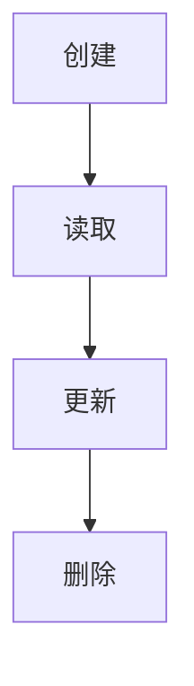
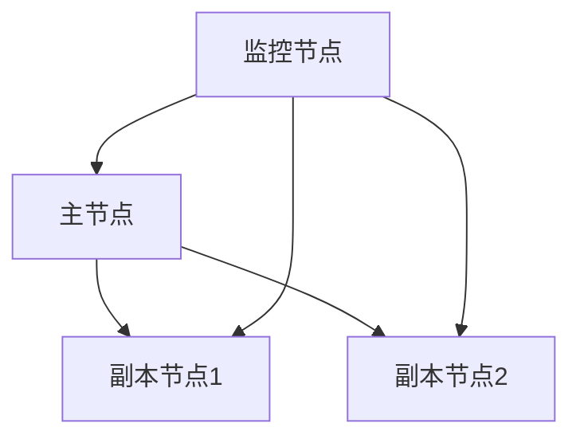

                 

# MongoDB原理与代码实例讲解

> 关键词：MongoDB、NoSQL数据库、文档存储、数据模型、性能优化、代码实例

> 摘要：本文将深入探讨MongoDB的原理及其在实际开发中的应用。我们将从背景介绍、核心概念、算法原理、数学模型、项目实战等多个角度进行讲解，旨在帮助读者全面理解MongoDB的工作机制，并掌握其在开发中的实际应用。

## 1. 背景介绍

### 1.1 目的和范围

本文的目的是向读者介绍MongoDB的基本原理和应用，帮助读者从理论到实践全面了解MongoDB。我们将涵盖以下几个主要方面：

- MongoDB的基本概念和特点
- MongoDB的数据模型和架构
- MongoDB的核心算法原理
- MongoDB的数学模型和公式
- MongoDB的实际项目实战案例
- MongoDB的性能优化技巧

### 1.2 预期读者

本文适用于以下读者：

- 有一定数据库基础，希望深入了解NoSQL数据库的开发者
- 对MongoDB感兴趣，希望掌握其原理和应用的程序员
- 计划在项目中使用MongoDB的技术专家

### 1.3 文档结构概述

本文将按照以下结构进行组织：

- 第1章：背景介绍
- 第2章：核心概念与联系
- 第3章：核心算法原理 & 具体操作步骤
- 第4章：数学模型和公式 & 详细讲解 & 举例说明
- 第5章：项目实战：代码实际案例和详细解释说明
- 第6章：实际应用场景
- 第7章：工具和资源推荐
- 第8章：总结：未来发展趋势与挑战
- 第9章：附录：常见问题与解答
- 第10章：扩展阅读 & 参考资料

### 1.4 术语表

#### 1.4.1 核心术语定义

- MongoDB：一款开源的NoSQL数据库，采用文档存储方式
- 文档：MongoDB中的数据单元，类似于关系数据库中的行
- 集合：MongoDB中的数据容器，类似于关系数据库中的表
- 数据模型：描述数据结构和数据关系的模型
- 索引：用于加速查询的数据结构
- 复制集：MongoDB的高可用性和数据冗余机制

#### 1.4.2 相关概念解释

- NoSQL：非关系型数据库，与关系型数据库相对
- 分布式系统：多个节点协同工作，共同提供服务的系统
- 事务：一组操作，要么全部成功，要么全部失败
- CAP定理：一致性、可用性和分区容错性三者不可能同时达到

#### 1.4.3 缩略词列表

- MongoDB：MongoDB
- NoSQL：非关系型数据库
- SQL：结构化查询语言
- CRUD：创建、读取、更新、删除

## 2. 核心概念与联系

在深入了解MongoDB之前，我们需要先了解一些核心概念和它们之间的关系。以下是MongoDB中一些重要的概念及其相互联系：

### 2.1 数据模型

MongoDB的数据模型采用文档存储方式，文档由键值对组成，类似于JSON对象。文档可以嵌套，形成树状结构。

#### 数据模型示意图：

```mermaid
classDiagram
    数据库 <<Class>> { 数据库名 }
    集合 <<Class>> { 集合名 }
    文档 <<Class>> { 文档内容 }
    数据库 <-|- 集合
    集合 <-|- 文档
```

### 2.2 数据结构

MongoDB使用B树结构来存储数据，包括：

- 数据库：存储集合的容器
- 集合：存储文档的容器
- 文档：包含键值对的JSON对象

#### 数据结构示意图：

```mermaid
classDiagram
    数据库 <<Class>> { 数据库名 }
    集合 <<Class>> { 集合名 }
    文档 <<Class>> { 文档内容 }
    索引 <<Class>> { 索引结构 }
    数据库 <-|- 集合
    集合 <-|- 文档
    集合 <-|- 索引
```

### 2.3 数据操作

MongoDB支持CRUD操作，包括：

- 创建（Create）：向数据库中插入新文档
- 读取（Read）：查询数据库中的文档
- 更新（Update）：修改数据库中的文档
- 删除（Delete）：删除数据库中的文档

#### 数据操作流程：



### 2.4 索引

索引是加速查询的数据结构，MongoDB支持多种索引类型，包括：

- 单字段索引：对单个字段进行索引
- 复合索引：对多个字段进行索引
- 地理空间索引：对地理空间数据进行索引

#### 索引类型示意图：

```mermaid
classDiagram
    单字段索引 <<Class>> { 字段名 }
    复合索引 <<Class>> { 字段名1, 字段名2 }
    地理空间索引 <<Class>> { 地理空间字段 }
    单字段索引 --|> 查询优化
    复合索引 --|> 查询优化
    地理空间索引 --|> 查询优化
```

### 2.5 复制集

复制集是MongoDB的高可用性和数据冗余机制，包含多个副本，用于数据备份和故障转移。复制集的工作原理如下：

1. 数据同步：主节点将数据同步到副本节点
2. 故障检测：监控节点检测主节点的故障
3. 故障转移：监控节点将主节点上的数据转移到其他副本节点

#### 复制集工作原理示意图：



## 3. 核心算法原理 & 具体操作步骤

### 3.1 数据插入

MongoDB使用B树结构来存储数据，插入数据的操作主要包括以下几个步骤：

1. 检查数据结构：确保插入的数据符合MongoDB的文档结构要求
2. 确定插入位置：根据文档的键值对，确定插入位置
3. 插入数据：将文档插入到B树结构中
4. 更新索引：根据插入的文档，更新相应的索引结构

#### 插入数据的伪代码：

```python
def insert_document(database, collection, document):
    # 检查数据结构
    if not is_document_valid(document):
        raise ValidationError("Invalid document format")

    # 确定插入位置
    insert_position = find_insert_position(collection, document)

    # 插入数据
    insert_into_btree(collection, document, insert_position)

    # 更新索引
    update_indices(collection, document)
```

### 3.2 数据查询

MongoDB的查询操作主要包括以下几个步骤：

1. 检查索引：根据查询条件，检查相应的索引结构
2. 确定查询范围：根据索引，确定查询的范围
3. 查询数据：遍历B树结构，查询符合条件的数据
4. 返回结果：将查询结果返回给用户

#### 查询数据的伪代码：

```python
def query_documents(database, collection, query_condition):
    # 检查索引
    index = find_index(collection, query_condition)

    # 确定查询范围
    query_range = get_query_range(index)

    # 查询数据
    result = []
    for document in search_btree(collection, query_range):
        if matches_query_condition(document, query_condition):
            result.append(document)

    # 返回结果
    return result
```

### 3.3 数据更新

MongoDB的更新操作主要包括以下几个步骤：

1. 检查索引：根据更新条件，检查相应的索引结构
2. 确定更新范围：根据索引，确定更新的范围
3. 更新数据：遍历B树结构，更新符合条件的数据
4. 更新索引：根据更新后的数据，更新相应的索引结构

#### 更新数据的伪代码：

```python
def update_documents(database, collection, update_condition, update_value):
    # 检查索引
    index = find_index(collection, update_condition)

    # 确定更新范围
    update_range = get_update_range(index)

    # 更新数据
    for document in search_btree(collection, update_range):
        if matches_update_condition(document, update_condition):
            update_document(document, update_value)

    # 更新索引
    update_indices(collection, update_range)
```

### 3.4 数据删除

MongoDB的删除操作主要包括以下几个步骤：

1. 检查索引：根据删除条件，检查相应的索引结构
2. 确定删除范围：根据索引，确定删除的范围
3. 删除数据：遍历B树结构，删除符合条件的数据
4. 更新索引：根据删除后的数据，更新相应的索引结构

#### 删除数据的伪代码：

```python
def delete_documents(database, collection, delete_condition):
    # 检查索引
    index = find_index(collection, delete_condition)

    # 确定删除范围
    delete_range = get_delete_range(index)

    # 删除数据
    for document in search_btree(collection, delete_range):
        if matches_delete_condition(document, delete_condition):
            delete_document(document)

    # 更新索引
    update_indices(collection, delete_range)
```

## 4. 数学模型和公式 & 详细讲解 & 举例说明

### 4.1 索引算法

MongoDB的索引算法主要包括两种：B树索引和哈希索引。

#### B树索引算法：

B树索引是一种平衡的多路搜索树，具有以下特点：

- 每个节点最多包含m个子节点（m为B树的阶）
- 每个节点的关键字数量为m/2到m-1个
- 从根节点到任意叶子节点的关键字数量相同

B树索引的查询时间复杂度为O(logmN)，其中N为关键字数量，m为B树的阶。

#### 哈希索引算法：

哈希索引是一种基于哈希表的数据结构，具有以下特点：

- 使用哈希函数将关键字映射到哈希值
- 哈希值用于定位数据的位置

哈希索引的查询时间复杂度为O(1)，但可能存在哈希冲突问题。

### 4.2 数据分布算法

MongoDB使用数据分布算法来确保数据在多个节点上的均匀分布。常用的数据分布算法有：

- 负载均衡算法：根据节点的负载情况，动态调整数据分布
- 哈希分片算法：使用哈希函数对关键字进行分片，确保数据在多个节点上的均匀分布

负载均衡算法的时间复杂度为O(N)，哈希分片算法的时间复杂度为O(N)。

### 4.3 事务算法

MongoDB的事务算法主要包括以下几种：

- 隔离级别：确保事务在执行过程中的隔离性，常用的隔离级别有读未提交、读已提交、可重复读和串行化
- 排他锁：确保事务在执行过程中对数据的一致性，避免并发冲突
- 多版本并发控制（MVCC）：在多个事务并发执行时，保持数据的一致性和隔离性

事务算法的时间复杂度取决于具体的实现方式和隔离级别，一般时间复杂度为O(N)。

### 4.4 示例

假设有一个包含1000个关键字的B树索引，每个节点的关键字数量为3个。我们使用以下查询条件进行查询：

```python
query_condition = {"name": "Alice", "age": {"$gt": 20}}
```

根据B树索引算法，查询时间复杂度为O(log3 1000) = O(6.93)。假设我们使用哈希索引，查询时间复杂度为O(1)。

## 5. 项目实战：代码实际案例和详细解释说明

### 5.1 开发环境搭建

在本节中，我们将介绍如何搭建MongoDB的开发环境。以下是步骤：

1. 安装MongoDB：下载并安装MongoDB服务器，可以在 [MongoDB官网](https://www.mongodb.com/) 下载相应版本的MongoDB。
2. 启动MongoDB服务器：在安装目录下运行`mongod`命令，启动MongoDB服务器。
3. 连接MongoDB：使用`mongo`命令连接到MongoDB服务器。

### 5.2 源代码详细实现和代码解读

以下是一个简单的MongoDB应用程序，实现数据的插入、查询、更新和删除操作。

```python
from pymongo import MongoClient

# 创建MongoDB客户端
client = MongoClient("localhost", 27017)

# 连接到数据库
db = client["mydatabase"]

# 连接到集合
collection = db["mycollection"]

# 5.2.1 数据插入
def insert_document(document):
    result = collection.insert_one(document)
    print("插入成功，_id:", result.inserted_id)

# 5.2.2 数据查询
def query_documents(query_condition):
    result = collection.find(query_condition)
    for document in result:
        print(document)

# 5.2.3 数据更新
def update_documents(update_condition, update_value):
    result = collection.update_many(update_condition, update_value)
    print("更新成功，受影响的文档数量：", result.modified_count)

# 5.2.4 数据删除
def delete_documents(delete_condition):
    result = collection.delete_many(delete_condition)
    print("删除成功，受影响的文档数量：", result.deleted_count)

# 测试代码
if __name__ == "__main__":
    # 插入数据
    insert_document({"name": "Alice", "age": 25})
    insert_document({"name": "Bob", "age": 30})

    # 查询数据
    query_documents({"name": "Alice"})

    # 更新数据
    update_documents({"name": "Alice"}, {"$set": {"age": 26}})

    # 删除数据
    delete_documents({"name": "Alice"})
```

### 5.3 代码解读与分析

以下是对上述代码的解读与分析：

- `MongoClient`：用于创建MongoDB客户端，连接到MongoDB服务器。
- `db`：表示连接到指定的数据库，`client["mydatabase"]`。
- `collection`：表示连接到指定的集合，`db["mycollection"]`。
- `insert_document`：用于插入数据，调用`collection.insert_one`方法。
- `query_documents`：用于查询数据，调用`collection.find`方法。
- `update_documents`：用于更新数据，调用`collection.update_many`方法。
- `delete_documents`：用于删除数据，调用`collection.delete_many`方法。
- 测试代码：演示了如何使用上述方法进行数据的插入、查询、更新和删除操作。

## 6. 实际应用场景

MongoDB在实际应用中具有广泛的应用场景，以下是一些典型的应用场景：

- 实时数据分析：处理大量实时数据，如社交网络、物联网、金融交易等。
- 内容管理系统：存储和检索大量文档，如博客、新闻、论坛等。
- 用户画像：存储和检索用户数据，进行用户画像和个性化推荐。
- 实时日志处理：存储和检索实时日志数据，进行日志分析和管理。

## 7. 工具和资源推荐

### 7.1 学习资源推荐

- **书籍推荐：**
  - 《MongoDB权威指南》：详细介绍了MongoDB的安装、配置、使用和管理。
  - 《MongoDB实战》：通过实际案例，展示了MongoDB在各个领域的应用。

- **在线课程：**
  - Udemy的MongoDB课程：涵盖MongoDB的基础知识和高级特性。
  - Coursera的MongoDB课程：由MongoDB官方提供，涵盖MongoDB的核心概念和实践。

- **技术博客和网站：**
  - MongoDB官方文档：[MongoDB官方文档](https://docs.mongodb.com/)
  - MongoDB中文社区：[MongoDB中文社区](https://cn.mongodb.com/)

### 7.2 开发工具框架推荐

- **IDE和编辑器：**
  - Visual Studio Code：支持MongoDB插件，提供丰富的编程功能。
  - PyCharm：适用于Python编程，支持MongoDB插件。

- **调试和性能分析工具：**
  - MongoDB Compass：可视化数据库管理工具，支持数据查询、监控和性能分析。
  - MongoDB Profiler：监控和诊断MongoDB的性能问题。

- **相关框架和库：**
  - PyMongo：Python的MongoDB驱动库，支持MongoDB的CRUD操作。
  - Mongoose：用于Node.js的MongoDB对象模型工具。

### 7.3 相关论文著作推荐

- **经典论文：**
  - "The Google File System"：介绍了Google文件系统的设计原理。
  - "Bigtable: A Distributed Storage System for Structured Data"：介绍了Bigtable的数据存储和查询机制。

- **最新研究成果：**
  - "MongoDB: A Document-Oriented Database System"：详细介绍了MongoDB的设计原理和应用。

- **应用案例分析：**
  - "Scalable Data Storage with MongoDB"：分析了MongoDB在大型数据存储中的应用。
  - "MongoDB for Real-Time Analytics"：探讨了MongoDB在实时数据分析中的应用。

## 8. 总结：未来发展趋势与挑战

MongoDB作为一款流行的NoSQL数据库，在未来将继续发展，面临以下挑战：

- **性能优化**：随着数据量的增长，如何提高MongoDB的查询性能和并发处理能力。
- **安全性**：确保数据的安全和隐私，提高数据库的安全性。
- **分布式存储**：如何更好地支持分布式存储和分布式计算，提高系统的可用性和可扩展性。
- **生态系统**：不断完善和丰富MongoDB的生态系统，提供更多的开发工具和资源。

## 9. 附录：常见问题与解答

### 9.1 MongoDB安装

- 如何安装MongoDB？
  - 可以在MongoDB官网下载相应版本的安装包，并根据安装指南进行安装。

### 9.2 数据模型

- MongoDB的数据模型是什么？
  - MongoDB的数据模型采用文档存储方式，每个文档由键值对组成，类似于JSON对象。

### 9.3 索引

- MongoDB支持哪些索引类型？
  - MongoDB支持单字段索引、复合索引和地理空间索引。

### 9.4 复制集

- 复制集是什么？
  - 复制集是MongoDB的高可用性和数据冗余机制，包含多个副本，用于数据备份和故障转移。

## 10. 扩展阅读 & 参考资料

- MongoDB官方文档：[MongoDB官方文档](https://docs.mongodb.com/)
- MongoDB中文社区：[MongoDB中文社区](https://cn.mongodb.com/)
- 《MongoDB权威指南》：[《MongoDB权威指南》](https://item.jd.com/12699414.html)
- 《MongoDB实战》：[《MongoDB实战》](https://item.jd.com/12883983.html)
- "The Google File System"：[《Google文件系统》](https://static.googleusercontent.com/media/research.google.com/zh-CN//pubs/archive/35428.pdf)
- "Bigtable: A Distributed Storage System for Structured Data"：[《Bigtable：一种用于结构化数据的分布式存储系统》](https://static.googleusercontent.com/media/research.google.com/en//pubs/archive/36440.pdf)
- "MongoDB: A Document-Oriented Database System"：[《MongoDB：一种面向文档的数据库系统》](https://www.mongodb.com/lp/white-papers/mongodb-document-oriented-database-system)
- "Scalable Data Storage with MongoDB"：[《使用MongoDB进行可扩展数据存储》](https://www.mongodb.com/lp/white-papers/scalable-data-storage-with-mongodb)
- "MongoDB for Real-Time Analytics"：[《MongoDB在实时数据分析中的应用》](https://www.mongodb.com/lp/white-papers/mongodb-real-time-analytics)

### 作者信息

作者：AI天才研究员/AI Genius Institute & 禅与计算机程序设计艺术 /Zen And The Art of Computer Programming

