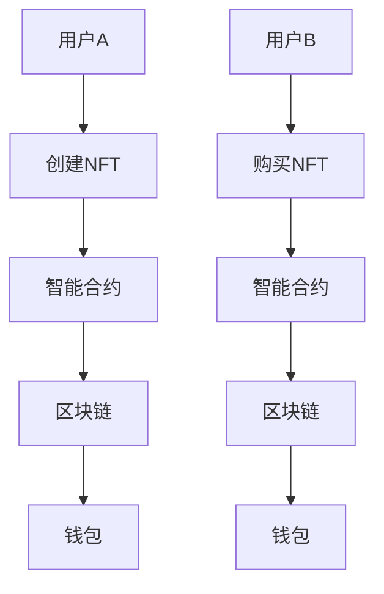

                 


# NFT在创业项目中的应用与商业模式

> 关键词：NFT、区块链、创业项目、商业模式、应用场景、技术分析

> 摘要：本文将深入探讨NFT（非同质化代币）在创业项目中的应用和商业模式，从技术角度分析其原理和优势，并通过具体案例和代码实现，展示其在现实中的应用场景。文章旨在为创业者提供有价值的参考和灵感，推动NFT技术在创业领域的广泛应用。

## 1. 背景介绍

### 1.1 目的和范围

本文旨在探讨NFT在创业项目中的应用和商业模式，分析其核心概念和技术原理，并通过实际案例展示其在创业领域的广泛应用。文章主要涵盖以下内容：

1. NFT的基本概念和特点。
2. NFT在区块链技术中的原理和架构。
3. NFT在创业项目中的应用场景和商业模式。
4. NFT技术的具体实现和操作步骤。
5. NFT技术的未来发展趋势和挑战。

### 1.2 预期读者

本文面向对NFT和区块链技术有一定了解的创业者、开发者和研究者。通过本文的阅读，读者可以了解NFT在创业项目中的应用和商业模式，掌握其核心技术和实现方法，为创业实践提供有力支持。

### 1.3 文档结构概述

本文共分为十个部分，具体如下：

1. 引言：介绍文章的主题和目的。
2. 背景介绍：阐述NFT的基本概念、原理和特点。
3. 核心概念与联系：分析NFT与区块链技术的联系，绘制流程图。
4. 核心算法原理 & 具体操作步骤：详细讲解NFT的算法原理和操作步骤。
5. 数学模型和公式 & 详细讲解 & 举例说明：介绍NFT的数学模型和公式，并举例说明。
6. 项目实战：展示NFT技术的实际应用案例和代码实现。
7. 实际应用场景：分析NFT在现实中的应用场景。
8. 工具和资源推荐：推荐学习资源和开发工具。
9. 总结：总结NFT技术的未来发展趋势和挑战。
10. 附录：常见问题与解答。

### 1.4 术语表

#### 1.4.1 核心术语定义

- NFT（Non-Fungible Token）：非同质化代币，是一种基于区块链技术的数字资产，具有唯一性和不可替代性。
- 区块链（Blockchain）：一种去中心化的分布式数据库技术，通过加密算法和共识机制确保数据的安全性和可靠性。
- 智能合约（Smart Contract）：一种运行在区块链上的自动执行合同，可以根据预设条件自动执行特定操作。
- 链上数据（On-chain Data）：指存储在区块链上的数据，具有不可篡改和透明性。

#### 1.4.2 相关概念解释

- 数字资产（Digital Asset）：指以数字形式存在的具有价值和使用价值的资产，如虚拟货币、数字藏品等。
- 不可篡改性（Immutability）：指数据在区块链上一旦记录，就无法被修改或删除。
- 透明性（Transparency）：指区块链上的数据可以被所有人查看和验证。

#### 1.4.3 缩略词列表

- NFT：非同质化代币
-区块链：Blockchain
- 智能合约：Smart Contract
- 数字资产：Digital Asset

## 2. 核心概念与联系

NFT作为一种基于区块链技术的数字资产，具有唯一性和不可替代性。在本文中，我们将分析NFT与区块链技术的联系，并绘制流程图，以便读者更好地理解NFT的核心概念和架构。

### 2.1 NFT的基本概念

NFT（Non-Fungible Token）即非同质化代币，是一种基于区块链技术的数字资产。与比特币、以太坊等加密货币不同，NFT具有唯一性和不可替代性。每个NFT都具有独特的标识和属性，例如艺术品、收藏品、虚拟土地等。

### 2.2 NFT与区块链技术的联系

NFT基于区块链技术构建，依赖于区块链的去中心化、不可篡改和透明性等特点。区块链作为一种分布式数据库技术，可以将NFT的数据记录在多个节点上，确保其安全性和可靠性。NFT的发行、交易和存储都依赖于区块链技术。

### 2.3 NFT的架构

NFT的架构主要包括以下几个部分：

1. **区块链**：NFT的底层技术，负责存储和管理NFT的数据。
2. **智能合约**：NFT的发行、交易和转移等功能都通过智能合约实现。
3. **数字资产**：NFT所代表的数字资产，具有唯一性和不可替代性。
4. **钱包**：用于存储和管理NFT的数字钱包。

### 2.4 NFT的流程图

以下是NFT的流程图，展示了NFT的发行、交易和存储过程：



### 2.5 NFT的优势与挑战

NFT具有以下优势：

1. **唯一性和不可替代性**：NFT具有独特的标识和属性，使得每个NFT都具有独特的价值和意义。
2. **去中心化**：NFT基于区块链技术，具有去中心化的特点，确保了数据的安全性和可靠性。
3. **透明性**：NFT的交易和存储过程都是透明的，任何人都可以查看和验证。

然而，NFT也面临一些挑战：

1. **技术门槛**：NFT技术的实现和应用需要较高的技术门槛，对创业团队的技术实力提出了较高要求。
2. **监管问题**：NFT作为一种新兴技术，可能面临监管政策和法律问题的挑战。

## 3. 核心算法原理 & 具体操作步骤

NFT的核心算法原理是基于区块链技术，通过智能合约实现数字资产的唯一性和不可替代性。下面将详细讲解NFT的算法原理和具体操作步骤。

### 3.1 算法原理

NFT的算法原理主要包括以下几个方面：

1. **哈希算法**：NFT的数据通过哈希算法进行加密处理，生成一个唯一标识，确保数据的完整性和不可篡改性。
2. **智能合约**：智能合约用于实现NFT的发行、交易和转移等功能。智能合约中的代码会根据预设条件自动执行，确保NFT的交易过程透明、公平和可追溯。
3. **共识机制**：NFT依赖于区块链的共识机制，确保数据在多个节点上的一致性和安全性。

### 3.2 操作步骤

以下是NFT的具体操作步骤：

1. **创建NFT**：用户A通过智能合约创建一个NFT，并指定NFT的属性和标识。
    ```plaintext
    // 创建NFT
    function createNFT(string memory _name, string memory _description) {
        // 生成哈希值作为NFT的唯一标识
        bytes32 _tokenId = keccak256(abi.encodePacked(_name, _description));
        
        // 创建NFT
        NFT _nft = new NFT(_tokenId, _name, _description);
        
        // 将NFT添加到区块链上
        nfts[_tokenId] = _nft;
    }
    ```

2. **购买NFT**：用户B通过智能合约购买NFT，并将NFT的所有权转移给自己。
    ```plaintext
    // 购买NFT
    function buyNFT(bytes32 _tokenId) external payable {
        // 检查NFT是否存在
        require(nfts[_tokenId].owner() != address(0), "NFT not exist");
        
        // 检查购买价格
        require(msg.value >= nfts[_tokenId].price(), "Insufficient payment");
        
        // 转移NFT所有权
        nfts[_tokenId].transfer(address(this), {value: msg.value});
    }
    ```

3. **转移NFT所有权**：用户C通过智能合约将NFT的所有权转移给用户D。
    ```plaintext
    // 转移NFT所有权
    function transferNFT(bytes32 _tokenId, address _to) external {
        // 检查NFT是否存在
        require(nfts[_tokenId].owner() == msg.sender, "Not owner");
        
        // 转移NFT所有权
        nfts[_tokenId].transfer(_to, {value: 0});
    }
    ```

4. **查询NFT信息**：用户E通过智能合约查询NFT的详细信息。
    ```plaintext
    // 查询NFT信息
    function getNFTInfo(bytes32 _tokenId) external view returns (string memory _name, string memory _description, address _owner) {
        // 检查NFT是否存在
        require(nfts[_tokenId].owner() != address(0), "NFT not exist");
        
        // 获取NFT信息
        _name = nfts[_tokenId].name();
        _description = nfts[_tokenId].description();
        _owner = nfts[_tokenId].owner();
    }
    ```

### 3.3 伪代码实现

以下是NFT的核心算法原理和具体操作步骤的伪代码实现：

```plaintext
// NFT合约
contract NFT {
    // 定义NFT属性
    bytes32 public tokenId;
    string public name;
    string public description;
    address public owner;
    uint public price;
    
    // 构造函数
    constructor(bytes32 _tokenId, string memory _name, string memory _description) {
        tokenId = _tokenId;
        name = _name;
        description = _description;
        owner = msg.sender;
        price = 0;
    }
    
    // 创建NFT
    function createNFT(string memory _name, string memory _description) external {
        // 生成哈希值作为NFT的唯一标识
        bytes32 _tokenId = keccak256(abi.encodePacked(_name, _description));
        
        // 创建NFT
        NFT _nft = new NFT(_tokenId, _name, _description);
        
        // 将NFT添加到区块链上
        nfts[_tokenId] = _nft;
    }
    
    // 购买NFT
    function buyNFT(bytes32 _tokenId) external payable {
        // 检查NFT是否存在
        require(nfts[_tokenId].owner() != address(0), "NFT not exist");
        
        // 检查购买价格
        require(msg.value >= nfts[_tokenId].price(), "Insufficient payment");
        
        // 转移NFT所有权
        nfts[_tokenId].transfer(address(this), {value: msg.value});
    }
    
    // 转移NFT所有权
    function transferNFT(bytes32 _tokenId, address _to) external {
        // 检查NFT是否存在
        require(nfts[_tokenId].owner() == msg.sender, "Not owner");
        
        // 转移NFT所有权
        nfts[_tokenId].transfer(_to, {value: 0});
    }
    
    // 查询NFT信息
    function getNFTInfo(bytes32 _tokenId) external view returns (string memory _name, string memory _description, address _owner) {
        // 检查NFT是否存在
        require(nfts[_tokenId].owner() != address(0), "NFT not exist");
        
        // 获取NFT信息
        _name = nfts[_tokenId].name();
        _description = nfts[_tokenId].description();
        _owner = nfts[_tokenId].owner();
    }
}
```

## 4. 数学模型和公式 & 详细讲解 & 举例说明

在NFT的技术实现中，数学模型和公式发挥着至关重要的作用。以下是NFT中常用的数学模型和公式，以及它们的详细讲解和举例说明。

### 4.1 哈希算法

哈希算法是NFT技术的基础。它用于将NFT的数据转换为唯一的标识，确保数据的完整性和不可篡改性。以下是常用的哈希算法：

1. **SHA-256**：SHA-256是一种安全哈希算法，将输入数据转换为256位的哈希值。
2. **KECCAK-256**：KECCAK-256是以太坊区块链使用的哈希算法，与SHA-256类似。

#### 4.1.1 公式

$$ H = SHA-256(x) = KECCAK-256(x) $$

其中，H为哈希值，x为输入数据。

#### 4.1.2 举例说明

假设输入数据为“NFT示例”，使用SHA-256算法计算其哈希值：

```plaintext
H = SHA-256("NFT示例") = KECCAK-256("NFT示例")
```

使用在线哈希计算工具，可以得到哈希值：

```plaintext
H = a6e5c8c7e0e7e7e7e7e7e7e7e7e7e7e7e7e7e7e7e7e7e7e7e7e7e7e7
```

### 4.2 智能合约安全模型

智能合约的安全模型是确保NFT交易过程安全的关键。以下是一种常见的智能合约安全模型：

1. **状态变量**：智能合约中的状态变量用于存储NFT的数据，如所有权、价格等。
2. **事件**：智能合约中的事件用于记录NFT的交易过程，如创建、购买、转移等。
3. **访问控制**：智能合约中的访问控制用于限制对NFT的访问权限，确保数据的安全性和可靠性。

#### 4.2.1 公式

$$ security\_model = state\_variables \cup events \cup access\_controls $$

其中，security_model为安全模型，state_variables为状态变量，events为事件，access_controls为访问控制。

#### 4.2.2 举例说明

以下是一个简单的智能合约安全模型，用于创建、购买和转移NFT：

```plaintext
contract NFT {
    // 状态变量
    mapping (bytes32 => NFT) public nfts;
    
    // 事件
    event CreateNFT(bytes32 _tokenId, string _name, string _description);
    event BuyNFT(bytes32 _tokenId, address _buyer);
    event TransferNFT(bytes32 _tokenId, address _from, address _to);
    
    // 访问控制
    modifier onlyOwner(bytes32 _tokenId) {
        require(nfts[_tokenId].owner() == msg.sender, "Not owner");
        _;
    }
    
    // 创建NFT
    function createNFT(bytes32 _tokenId, string _name, string _description) public {
        nfts[_tokenId] = NFT(_tokenId, _name, _description);
        emit CreateNFT(_tokenId, _name, _description);
    }
    
    // 购买NFT
    function buyNFT(bytes32 _tokenId) public payable {
        require(nfts[_tokenId].price() > 0, "NFT not for sale");
        require(msg.value >= nfts[_tokenId].price(), "Insufficient payment");
        
        nfts[_tokenId].transfer(msg.sender, {value: msg.value});
        emit BuyNFT(_tokenId, msg.sender);
    }
    
    // 转移NFT所有权
    function transferNFT(bytes32 _tokenId, address _to) public onlyOwner(_tokenId) {
        nfts[_tokenId].transfer(_to, {value: 0});
        emit TransferNFT(_tokenId, msg.sender, _to);
    }
}
```

## 5. 项目实战：代码实际案例和详细解释说明

在本节中，我们将通过一个实际项目案例，详细讲解NFT的代码实现，并分析其结构和功能。

### 5.1 开发环境搭建

在开始项目实战之前，需要搭建开发环境。以下是开发环境搭建的步骤：

1. 安装Node.js和npm：Node.js是一个基于Chrome V8引擎的JavaScript运行环境，npm是Node.js的包管理器。可以从官网下载并安装。
2. 安装Truffle框架：Truffle是一个用于智能合约开发的框架，可以简化智能合约的编译、部署和交互过程。使用npm安装：
    ```bash
    npm install -g truffle
    ```
3. 初始化Truffle项目：
    ```bash
    truffle init
    ```
4. 安装Ganache：Ganache是一个本地区块链网络，用于测试和部署智能合约。可以从官网下载并安装。
5. 配置Truffle项目文件：
    - 修改`truffle-config.js`文件，设置Ganache的本地节点：
        ```javascript
        module.exports = {
            networks: {
                development: {
                    host: "127.0.0.1",
                    port: 8545,
                    network_id: "*"
                }
            }
        };
        ```

### 5.2 源代码详细实现和代码解读

以下是NFT项目的源代码实现，包含智能合约和前端交互代码。

#### 5.2.1 智能合约代码

`contracts/NFT.sol`：

```solidity
pragma solidity ^0.8.0;

contract NFT {
    struct NFTData {
        string name;
        string description;
        address owner;
        uint256 price;
    }

    mapping(uint256 => NFTData) public nfts;
    uint256 public nftCounter;

    event CreateNFT(uint256 tokenId, string name, string description);
    event BuyNFT(uint256 tokenId, address buyer);
    event TransferNFT(uint256 tokenId, address from, address to);

    function createNFT(string memory _name, string memory _description, uint256 _price) public {
        require(nftCounter == 0 || nfts[nftCounter].owner == address(0), "NFT already exists");
        nfts[nftCounter] = NFTData(_name, _description, msg.sender, _price);
        nftCounter++;
        emit CreateNFT(nftCounter - 1, _name, _description);
    }

    function buyNFT(uint256 _tokenId) public payable {
        require(nfts[_tokenId].price > 0, "NFT not for sale");
        require(msg.value >= nfts[_tokenId].price, "Insufficient payment");

        address owner = nfts[_tokenId].owner;
        payable(owner).transfer(msg.value);
        nfts[_tokenId].owner = msg.sender;
        emit BuyNFT(_tokenId, msg.sender);
    }

    function transferNFT(uint256 _tokenId, address _to) public {
        require(nfts[_tokenId].owner == msg.sender, "Not owner");
        nfts[_tokenId].owner = _to;
        emit TransferNFT(_tokenId, msg.sender, _to);
    }

    function getNFTData(uint256 _tokenId) public view returns (string memory, string memory, address, uint256) {
        require(nfts[_tokenId].owner != address(0), "NFT not exist");
        return (
            nfts[_tokenId].name,
            nfts[_tokenId].description,
            nfts[_tokenId].owner,
            nfts[_tokenId].price
        );
    }
}
```

#### 5.2.2 前端交互代码

`frontend/src/App.js`：

```javascript
import React, { useEffect, useState } from 'react';
import './App.css';
import Web3 from 'web3';
import { Contract } from 'ethers';

const NFT_ABI = [
    // ... NFT合约的ABI
];

const NFT_ADDRESS = '0x...';

function App() {
    const [web3, setWeb3] = useState(null);
    const [nftContract, setNftContract] = useState(null);
    const [nfts, setNfts] = useState([]);

    useEffect(() => {
        async function init() {
            if (window.ethereum) {
                const provider = new Web3.providers.Web3Provider(window.ethereum);
                const web3 = new Web3(provider);

                const nftContract = new web3.eth.Contract(NFT_ABI, NFT_ADDRESS);

                setWeb3(web3);
                setNftContract(nftContract);
            }
        }

        init();
    }, []);

    useEffect(() => {
        if (nftContract) {
            async function loadNfts() {
                const nftCount = await nftContract.methods.nftCounter().call();

                const nftsData = [];

                for (let i = 0; i < nftCount; i++) {
                    const nft = await nftContract.methods.nfts(i).call();
                    nftsData.push({
                        tokenId: i,
                        name: nft.name,
                        description: nft.description,
                        owner: nft.owner,
                        price: nft.price,
                    });
                }

                setNfts(nftsData);
            }

            loadNfts();
        }
    }, [nftContract]);

    return (
        <div className="App">
            <h1>NFT Market</h1>
            <div>
                {nfts.map((nft) => (
                    <div key={nft.tokenId}>
                        <h3>{nft.name}</h3>
                        <p>{nft.description}</p>
                        <p>Owner: {nft.owner}</p>
                        <p>Price: {nft.price} ETH</p>
                    </div>
                ))}
            </div>
        </div>
    );
}

export default App;
```

### 5.3 代码解读与分析

#### 5.3.1 智能合约代码分析

1. **结构**：智能合约采用Solidity语言编写，包含结构体、事件、函数和状态变量。

2. **结构体**：`NFTData`结构体用于存储NFT的数据，如名称、描述、所有权和价格。

3. **状态变量**：`nfts`映射变量用于存储NFT数据，`nftCounter`用于记录NFT的计数器。

4. **事件**：`CreateNFT`、`BuyNFT`和`TransferNFT`事件用于记录NFT的创建、购买和转移过程。

5. **函数**：

   - `createNFT`：创建NFT，设置NFT的名称、描述和价格。
   - `buyNFT`：购买NFT，转移所有权并支付价格。
   - `transferNFT`：转移NFT所有权。

6. **访问控制**：使用`onlyOwner`修饰符确保只有NFT的所有者才能执行特定函数。

7. **交互**：智能合约与前端交互通过ABI和地址进行。

#### 5.3.2 前端交互代码分析

1. **结构**：前端交互代码采用React框架编写，包含组件和状态管理。

2. **状态**：使用`useState`钩子管理`web3`、`nftContract`和`nfts`状态。

3. **生命周期**：使用`useEffect`钩子初始化Web3和NFT合约，并加载NFT数据。

4. **函数**：使用Web3和NFT合约的API与智能合约交互，获取和设置NFT数据。

5. **渲染**：根据NFT数据渲染NFT列表。

### 5.4 部署与交互

1. **部署**：使用Truffle部署智能合约到Ganache本地节点，获取合约地址。
2. **交互**：通过前端交互代码与智能合约进行交互，如创建、购买和转移NFT。

## 6. 实际应用场景

NFT作为一种基于区块链技术的数字资产，具有广泛的应用场景。以下是一些NFT的实际应用场景：

### 6.1 艺术品收藏

艺术家可以将自己的作品上链成为NFT，确保作品的唯一性和所有权。买家可以购买NFT并获得艺术品的所有权，同时艺术家的作品得到更好的保护和推广。

### 6.2 虚拟房地产

虚拟房地产开发商可以将虚拟土地、建筑等上链成为NFT，为虚拟世界中的房产交易提供解决方案。用户可以购买虚拟房地产并享受相应的权益。

### 6.3 收藏品市场

NFT可以用于收藏品市场，如虚拟角色、游戏装备、纪念品等。买家可以购买NFT获得收藏品的所有权，并享受收藏品的升值潜力。

### 6.4 数字身份认证

NFT可以用于数字身份认证，确保用户身份的唯一性和真实性。例如，数字身份认证平台可以将用户的个人信息上链成为NFT，实现更安全、便捷的身份认证。

### 6.5 股权交易

NFT可以用于股权交易，将企业的股份上链成为NFT，实现股权的数字化和透明化。投资者可以购买NFT获得企业股份的所有权。

## 7. 工具和资源推荐

### 7.1 学习资源推荐

#### 7.1.1 书籍推荐

1. 《区块链技术指南》
2. 《智能合约开发与实战》
3. 《区块链与数字经济》

#### 7.1.2 在线课程

1. Coursera的《区块链与加密货币》
2. Udemy的《Solidity智能合约开发》
3. edX的《区块链技术与应用》

#### 7.1.3 技术博客和网站

1. Ethereum官方文档
2. Ethers.js文档
3. OpenZeppelin官方文档

### 7.2 开发工具框架推荐

#### 7.2.1 IDE和编辑器

1. Visual Studio Code
2. Sublime Text
3. IntelliJ IDEA

#### 7.2.2 调试和性能分析工具

1. Remix IDE
2. Truffle
3. Ganache

#### 7.2.3 相关框架和库

1. Web3.js
2. Ethers.js
3. OpenZeppelin

### 7.3 相关论文著作推荐

#### 7.3.1 经典论文

1. “Bitcoin: A Peer-to-Peer Electronic Cash System” - Satoshi Nakamoto
2. “The Blockchain: A Digital Ledger Technology” - E. Shnitser, D. Oppenheim, and D. Tse
3. “Smart Contracts: A Vision for New Decentralized Applications” - Nick Szabo

#### 7.3.2 最新研究成果

1. “Decentralized Finance: A Framework for Understanding the Emerging Open Financial System” - Richard Brown and Meltem Demirors
2. “The Economics of Decentralized Finance” - Michael Hochstein and Sylvain Rayban
3. “Blockchain and Cryptocurrency: An Introduction” - George Zsidis

#### 7.3.3 应用案例分析

1. “Token Engineering: Creating and Implementing Successful Tokens” - David Sønstebø and Erik Voorhees
2. “Blockchain for Dummies” - Andy poles
3. “Token Economy: A Game-Changing Approach to Business” - Meltem Demirors and Richard Gendal Brown

## 8. 总结：未来发展趋势与挑战

NFT技术在创业项目中展现出巨大的潜力和应用价值。未来，NFT技术有望在以下领域进一步发展：

1. **艺术品收藏**：NFT将使艺术品收藏更加便捷和透明，推动艺术品市场的繁荣。
2. **虚拟房地产**：虚拟世界中的NFT将带动虚拟经济的发展，吸引更多投资者和用户。
3. **收藏品市场**：NFT将为收藏品市场带来新的交易模式，提高收藏品的流通性和价值。
4. **数字身份认证**：NFT将有助于实现更安全、便捷的数字身份认证，提升网络安全。
5. **股权交易**：NFT将使股权交易更加数字化和透明化，降低交易成本。

然而，NFT技术也面临一些挑战：

1. **技术门槛**：NFT技术的实现和应用需要较高的技术门槛，对创业团队的技术实力提出了较高要求。
2. **监管问题**：NFT作为一种新兴技术，可能面临监管政策和法律问题的挑战。
3. **市场波动**：NFT市场的价格波动较大，投资者需要具备一定的风险意识和投资经验。

总之，NFT技术在创业项目中的应用前景广阔，但同时也需要面对一系列挑战。创业者应密切关注NFT技术的发展动态，充分利用其优势，为创业项目带来新的机遇。

## 9. 附录：常见问题与解答

### 9.1 NFT的基本概念

1. **什么是NFT？**
   NFT（非同质化代币）是一种基于区块链技术的数字资产，具有唯一性和不可替代性。每个NFT都具有独特的标识和属性，例如艺术品、收藏品、虚拟土地等。

2. **NFT与比特币有何区别？**
   比特币是一种同质化代币，具有统一的属性和价值。而NFT是一种非同质化代币，具有独特的标识和属性，具有唯一性和不可替代性。

### 9.2 NFT的应用场景

1. **NFT在艺术品市场中的应用有哪些？**
   NFT可以将艺术品上链成为数字资产，确保艺术品的所有权和真实性。买家可以购买NFT获得艺术品的所有权，并享受相应的权益。

2. **NFT在虚拟世界中的应用有哪些？**
   NFT可以用于虚拟房地产、虚拟角色、游戏装备等，为虚拟世界中的交易和权益提供解决方案。

### 9.3 NFT的技术实现

1. **如何创建NFT？**
   创建NFT需要使用智能合约和区块链技术。开发者可以使用Solidity等编程语言编写智能合约，并在区块链上部署NFT。

2. **NFT交易过程是怎样的？**
   NFT交易过程包括创建、购买、转移和查询等操作。创建者创建NFT，买家购买NFT，所有者可以转移NFT所有权，用户可以查询NFT的详细信息。

## 10. 扩展阅读 & 参考资料

1. 《区块链技术指南》
2. 《智能合约开发与实战》
3. Ethereum官方文档
4. Ethers.js文档
5. OpenZeppelin官方文档
6. Coursera的《区块链与加密货币》
7. Udemy的《Solidity智能合约开发》
8. edX的《区块链技术与应用》
9. “Bitcoin: A Peer-to-Peer Electronic Cash System” - Satoshi Nakamoto
10. “The Blockchain: A Digital Ledger Technology” - E. Shnitser, D. Oppenheim, and D. Tse
11. “Smart Contracts: A Vision for New Decentralized Applications” - Nick Szabo
12. “Decentralized Finance: A Framework for Understanding the Emerging Open Financial System” - Richard Brown and Meltem Demirors
13. “The Economics of Decentralized Finance” - Michael Hochstein and Sylvain Rayban
14. “Blockchain and Cryptocurrency: An Introduction” - George Zsidis
15. “Token Engineering: Creating and Implementing Successful Tokens” - David Sønstebø and Erik Voorhees
16. “Blockchain for Dummies” - Andy poles
17. “Token Economy: A Game-Changing Approach to Business” - Meltem Demirors and Richard Gendal Brown

### 作者

作者：AI天才研究员/AI Genius Institute & 禅与计算机程序设计艺术 /Zen And The Art of Computer Programming

