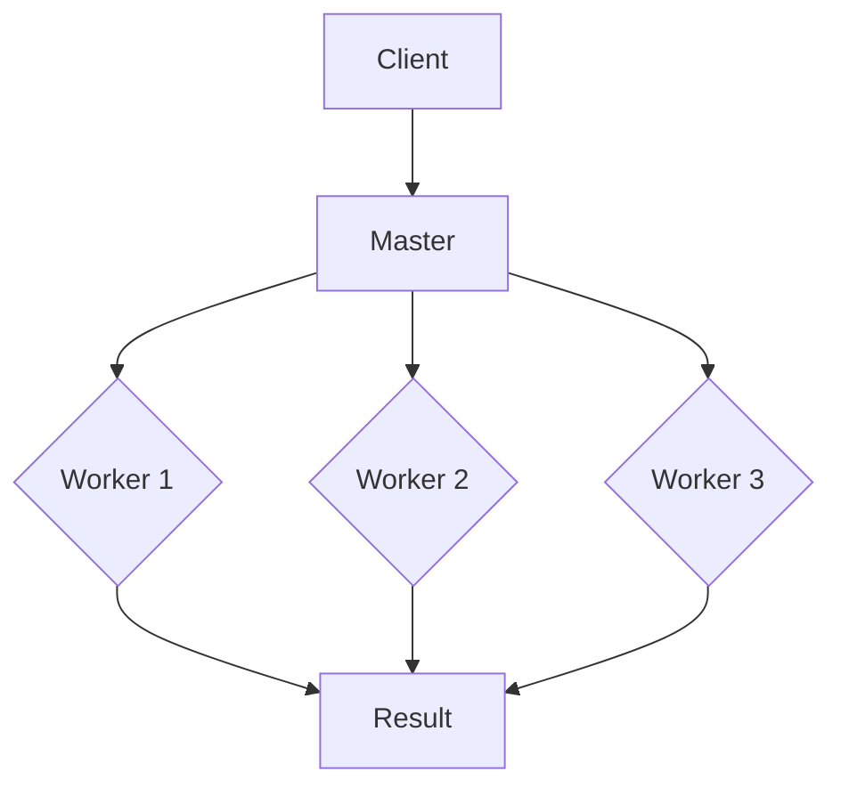
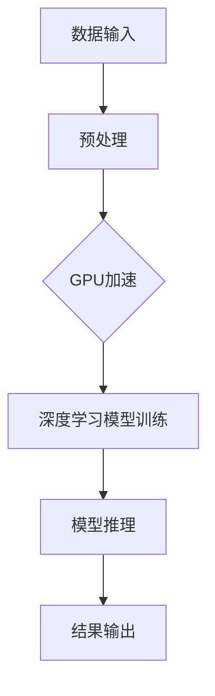

                 

# NVIDIA如何推动AI算力的发展

> **关键词：** NVIDIA, AI算力, 深度学习, 图神经网络, GPU加速, AI芯片, 分布式计算

> **摘要：** 本文将深入探讨NVIDIA在推动AI算力发展方面的贡献和核心算法原理。通过分析NVIDIA的GPU技术和AI芯片设计，结合具体项目实战和实际应用场景，本文旨在展示NVIDIA如何引领AI计算的创新与发展。

## 1. 背景介绍

### 1.1 目的和范围

本文旨在探讨NVIDIA在推动AI算力发展方面的贡献，具体涵盖以下内容：

- **NVIDIA GPU技术在AI领域的应用**：详细介绍NVIDIA GPU在深度学习、图神经网络等领域的性能优势和具体实现。
- **NVIDIA AI芯片设计**：分析NVIDIA AI芯片的架构和关键技术，如Tensor Core、Optical Flow等。
- **项目实战和实际应用场景**：通过实际代码案例，展示如何利用NVIDIA技术解决AI计算问题。
- **工具和资源推荐**：为读者提供学习资源、开发工具框架和相关论文著作。

### 1.2 预期读者

本文适合以下读者群体：

- **计算机图形学、机器学习和人工智能领域的专业人士**：希望通过本文了解NVIDIA技术在AI领域的应用。
- **计算机科学学生和研究生**：希望通过本文学习AI算力和GPU编程技术。
- **对AI算力感兴趣的爱好者**：希望通过本文了解NVIDIA在AI领域的技术贡献和未来发展趋势。

### 1.3 文档结构概述

本文分为以下章节：

- **第1章：背景介绍**：介绍本文的目的、范围、预期读者和文档结构。
- **第2章：核心概念与联系**：阐述核心概念原理和架构，并给出Mermaid流程图。
- **第3章：核心算法原理 & 具体操作步骤**：详细讲解核心算法原理，使用伪代码阐述具体操作步骤。
- **第4章：数学模型和公式 & 详细讲解 & 举例说明**：介绍数学模型和公式，并进行详细讲解和举例说明。
- **第5章：项目实战：代码实际案例和详细解释说明**：展示代码实际案例，并进行详细解释说明。
- **第6章：实际应用场景**：探讨NVIDIA技术在实际应用场景中的应用。
- **第7章：工具和资源推荐**：推荐学习资源、开发工具框架和相关论文著作。
- **第8章：总结：未来发展趋势与挑战**：总结NVIDIA在AI算力发展中的贡献，并探讨未来发展趋势和挑战。
- **第9章：附录：常见问题与解答**：回答读者可能遇到的问题。
- **第10章：扩展阅读 & 参考资料**：提供扩展阅读和参考资料。

### 1.4 术语表

#### 1.4.1 核心术语定义

- **NVIDIA**：一家全球知名的图形处理芯片制造商，专注于开发高性能的GPU。
- **深度学习**：一种基于多层神经网络的学习方法，通过大量数据训练模型，实现图像识别、语音识别等任务。
- **GPU加速**：利用GPU的并行计算能力，加速深度学习模型的训练和推理。
- **AI芯片**：专门用于执行人工智能任务的芯片，具有高效的计算能力和优化的架构。

#### 1.4.2 相关概念解释

- **图神经网络（GNN）**：一种用于处理图结构数据的神经网络，可以应用于社交网络分析、推荐系统等领域。
- **分布式计算**：将计算任务分布在多个计算节点上执行，提高计算效率和扩展性。

#### 1.4.3 缩略词列表

- **NVIDIA**：NVIDIA Corporation
- **GPU**：Graphics Processing Unit
- **AI**：Artificial Intelligence
- **DL**：Deep Learning
- **GNN**：Graph Neural Network

## 2. 核心概念与联系

在深入探讨NVIDIA如何推动AI算力发展之前，我们首先需要了解一些核心概念和联系。以下是对相关概念原理和架构的简要介绍，并使用Mermaid流程图展示关键节点和关系。

### 2.1 NVIDIA GPU技术

NVIDIA GPU技术在AI领域具有显著优势，主要表现在以下几个方面：

1. **并行计算能力**：GPU具有数千个核心，可以同时处理多个计算任务，大大提高了计算效率。
2. **浮点运算能力**：GPU在浮点运算方面具有强大的性能，适用于深度学习等需要大量计算的应用场景。
3. **内存带宽**：GPU具有高速的内存带宽，可以快速传输数据和中间结果，减少计算延迟。

### 2.2 AI芯片设计

NVIDIA AI芯片设计在架构和关键技术方面具有独特优势：

1. **Tensor Core**：一种专门用于深度学习计算的核心，可以高效执行矩阵乘法等操作。
2. **Optical Flow**：一种用于图像处理的核心，可以加速图像滤波、边缘检测等操作。
3. **异构计算**：利用CPU和GPU的协同计算能力，提高整体计算效率。

### 2.3 分布式计算

分布式计算是AI领域的一项关键技术，可以充分利用多台GPU服务器，实现大规模模型的训练和推理。以下是一个简单的分布式计算架构：



### 2.4 Mermaid流程图

以下是一个简单的Mermaid流程图，展示了NVIDIA GPU技术在AI算力发展中的应用：



通过上述核心概念和联系的了解，我们可以进一步深入探讨NVIDIA在推动AI算力发展方面的贡献。

## 3. 核心算法原理 & 具体操作步骤

在了解NVIDIA GPU技术和AI芯片设计的基础上，我们接下来将探讨NVIDIA在AI领域所采用的核心算法原理，并使用伪代码详细阐述具体操作步骤。

### 3.1 深度学习算法原理

深度学习是一种基于多层神经网络的学习方法，通过大量数据训练模型，实现图像识别、语音识别等任务。以下是深度学习算法的基本原理：

1. **前向传播**：将输入数据通过神经网络中的多个层进行传递，每一层对数据进行变换，最终得到输出。
2. **反向传播**：计算输出与真实标签之间的误差，将误差反向传播到网络中的每一层，更新权重和偏置。
3. **优化算法**：通过优化算法（如梯度下降）最小化误差函数，提高模型性能。

以下是深度学习算法的伪代码实现：

```python
# 输入数据：x（输入特征），y（真实标签）
# 初始化：权重w和偏置b
# 迭代次数：n
for i = 1 to n do
  # 前向传播
  z = x * w + b
  a = activation(z)

  # 计算误差
  error = y - a

  # 反向传播
  dz = dactivation(a) * (1 - a)
  dw = x * dz
  db = dz

  # 更新权重和偏置
  w = w - learning_rate * dw
  b = b - learning_rate * db
end
```

### 3.2 图神经网络（GNN）算法原理

图神经网络（GNN）是一种用于处理图结构数据的神经网络，可以应用于社交网络分析、推荐系统等领域。以下是GNN算法的基本原理：

1. **节点表示**：将图中的每个节点表示为一个向量，表示节点的属性和关系。
2. **边表示**：将图中的每条边表示为一个向量，表示边的权重和属性。
3. **图卷积操作**：利用图卷积操作，将节点的邻域信息聚合到节点表示中，更新节点表示。

以下是GNN算法的伪代码实现：

```python
# 输入数据：A（邻接矩阵），X（节点表示），E（边表示）
# 初始化：权重W和偏置b
# 迭代次数：n
for i = 1 to n do
  # 图卷积操作
  X_new = A * X

  # 更新节点表示
  X = activation(X_new * W + b)
end
```

### 3.3 GPU加速

NVIDIA GPU技术在AI领域的应用主要通过GPU加速实现，以下是一个简单的GPU加速示例：

```python
# 输入数据：x（输入特征），y（真实标签）
# 初始化：权重w和偏置b
# 迭代次数：n
for i = 1 to n do
  # 前向传播
  z = x * w + b
  a = activation(z)

  # 计算误差
  error = y - a

  # 反向传播
  dz = dactivation(a) * (1 - a)
  dw = x * dz
  db = dz

  # 更新权重和偏置（GPU加速）
  update_weights(w, dw, learning_rate)
  update_bias(b, db, learning_rate)
end
```

通过上述核心算法原理和具体操作步骤的介绍，我们可以看到NVIDIA在AI领域的技术贡献和优势。

## 4. 数学模型和公式 & 详细讲解 & 举例说明

在深入探讨NVIDIA在AI算力发展中的贡献时，我们需要了解相关的数学模型和公式。以下将详细讲解这些模型和公式，并通过具体例子进行说明。

### 4.1 深度学习中的前向传播与反向传播

深度学习中的前向传播和反向传播是两个核心步骤，用于训练神经网络模型。

#### 4.1.1 前向传播

前向传播是计算网络输出值的过程。给定输入特征\( x \)，通过网络的权重\( w \)和偏置\( b \)，计算输出值\( a \)。具体公式如下：

\[ z = x \cdot w + b \]
\[ a = \sigma(z) \]

其中，\( \sigma \)表示激活函数，常用的激活函数有Sigmoid、ReLU和Tanh等。

#### 4.1.2 反向传播

反向传播是计算误差并更新网络权重和偏置的过程。首先计算误差：

\[ error = y - a \]

然后，通过误差反向传播，计算每个层的误差：

\[ dz = \frac{\partial L}{\partial z} \]
\[ dw = x \cdot dz \]
\[ db = dz \]

其中，\( L \)是损失函数，用于衡量模型输出与真实标签之间的差距。

#### 4.1.3 举例说明

假设我们有一个简单的神经网络，包含一个输入层、一个隐藏层和一个输出层。输入特征为\( x = [1, 2, 3] \)，权重和偏置分别为\( w = [0.5, 0.5], b = [0.5, 0.5] \)。激活函数为ReLU。

1. **前向传播**：

\[ z = x \cdot w + b = [1, 2, 3] \cdot [0.5, 0.5] + [0.5, 0.5] = [1.5, 2.5, 3.5] \]
\[ a = \sigma(z) = \max(0, z) = [1.5, 2.5, 3.5] \]

2. **反向传播**：

假设真实标签为\( y = [1, 0, 1] \)，损失函数为均方误差（MSE）：

\[ error = y - a = [1, 0, 1] - [1.5, 2.5, 3.5] = [-0.5, -2.5, -2.5] \]

计算误差的导数：

\[ dz = \frac{\partial L}{\partial z} = 2 \cdot error = [-1, -5, -5] \]

更新权重和偏置：

\[ dw = x \cdot dz = [1, 2, 3] \cdot [-1, -5, -5] = [-1, -10, -15] \]
\[ db = dz = [-1, -5, -5] \]

### 4.2 图神经网络（GNN）中的图卷积操作

图神经网络（GNN）中的图卷积操作是一种将节点邻域信息聚合到节点表示中的操作。假设图中的每个节点表示为向量\( x_i \)，边表示为向量\( e_{ij} \)。图卷积操作的公式如下：

\[ h_i^{(l+1)} = \sigma \left( \sum_{j \in \mathcal{N}(i)} w^{(l)} e_{ij} h_j^{(l)} + b^{(l)} \right) \]

其中，\( \mathcal{N}(i) \)表示节点\( i \)的邻域节点集合，\( w^{(l)} \)和\( b^{(l)} \)分别为第\( l \)层的权重和偏置。

#### 4.2.1 举例说明

假设我们有一个简单的图，包含三个节点\( i_1, i_2, i_3 \)和三条边\( e_{12}, e_{23}, e_{13} \)。节点表示分别为\( x_1 = [1, 2], x_2 = [3, 4], x_3 = [5, 6] \)，边表示分别为\( e_{12} = [0.5, 0.5], e_{23} = [0.5, 0.5], e_{13} = [0.5, 0.5] \)。激活函数为ReLU。

1. **第一层图卷积操作**：

\[ h_1^{(1)} = \sigma \left( w^{(0)} e_{12} x_2 + w^{(0)} e_{13} x_3 + b^{(0)} \right) \]
\[ h_1^{(1)} = \sigma \left( [0.5, 0.5] \cdot [3, 4] + [0.5, 0.5] \cdot [5, 6] + [1, 1] \right) \]
\[ h_1^{(1)} = \sigma \left( [1.5, 2], [3.5, 4] + [1, 1] \right) \]
\[ h_1^{(1)} = \max(0, [2.5, 3], [4.5, 5] + [1, 1] ) \]
\[ h_1^{(1)} = [2.5, 3], [4.5, 5] \]

2. **第二层图卷积操作**：

\[ h_2^{(1)} = \sigma \left( w^{(1)} e_{12} h_1^{(1)} + w^{(1)} e_{23} h_1^{(2)} + b^{(1)} \right) \]
\[ h_2^{(1)} = \sigma \left( [0.5, 0.5] \cdot [2.5, 3] + [0.5, 0.5] \cdot [4.5, 5] + [1, 1] \right) \]
\[ h_2^{(1)} = \sigma \left( [1.25, 1.5], [2.25, 2.5] + [1, 1] \right) \]
\[ h_2^{(1)} = \max(0, [2.25, 2.5], [3.25, 3.5] + [1, 1] ) \]
\[ h_2^{(1)} = [2.25, 2.5], [3.25, 3.5] \]

通过以上详细讲解和举例说明，我们可以更好地理解NVIDIA在AI算力发展中所采用的数学模型和公式。

## 5. 项目实战：代码实际案例和详细解释说明

在了解了NVIDIA GPU技术和AI芯片设计的相关原理和公式后，我们接下来通过一个实际的项目实战来展示如何利用NVIDIA技术解决AI计算问题。本项目将使用NVIDIA GPU加速深度学习模型训练，并详细介绍开发环境搭建、源代码实现和代码解读与分析。

### 5.1 开发环境搭建

为了搭建一个能够使用NVIDIA GPU加速深度学习模型训练的开发环境，我们需要以下软件和硬件：

1. **操作系统**：Windows 10或Linux
2. **GPU**：NVIDIA GeForce GTX 1080 Ti或更高型号
3. **深度学习框架**：TensorFlow或PyTorch
4. **编程语言**：Python
5. **开发工具**：PyCharm或Jupyter Notebook

在安装完上述软件和硬件后，我们可以按照以下步骤搭建开发环境：

1. 安装CUDA Toolkit：CUDA Toolkit是NVIDIA开发的GPU编程工具包，支持在GPU上运行深度学习模型。可以从NVIDIA官方网站下载CUDA Toolkit，并按照官方文档进行安装。
2. 安装深度学习框架：以TensorFlow为例，可以使用以下命令安装：
   ```bash
   pip install tensorflow-gpu
   ```
3. 配置CUDA环境变量：在系统环境变量中添加CUDA路径，确保CUDA能够在Python脚本中正确调用。

### 5.2 源代码详细实现和代码解读

以下是一个使用NVIDIA GPU加速的深度学习模型训练项目示例，使用TensorFlow框架实现。源代码如下：

```python
import tensorflow as tf
import numpy as np

# 设置GPU配置
gpus = tf.config.experimental.list_physical_devices('GPU')
if gpus:
    try:
        for gpu in gpus:
            tf.config.experimental.set_memory_growth(gpu, True)
    except RuntimeError as e:
        print(e)

# 加载数据集
(x_train, y_train), (x_test, y_test) = tf.keras.datasets.mnist.load_data()
x_train = x_train.astype(np.float32) / 255.0
x_test = x_test.astype(np.float32) / 255.0

# 构建模型
model = tf.keras.Sequential([
    tf.keras.layers.Flatten(input_shape=(28, 28)),
    tf.keras.layers.Dense(128, activation='relu'),
    tf.keras.layers.Dense(10, activation='softmax')
])

# 编译模型
model.compile(optimizer='adam',
              loss='sparse_categorical_crossentropy',
              metrics=['accuracy'])

# 训练模型
model.fit(x_train, y_train, epochs=5, batch_size=64, validation_split=0.1)

# 评估模型
test_loss, test_acc = model.evaluate(x_test, y_test, verbose=2)
print(f"Test accuracy: {test_acc:.4f}")
```

#### 5.2.1 代码解读

1. **设置GPU配置**：首先，我们需要设置GPU配置，以充分利用GPU加速深度学习模型训练。通过调用`tf.config.experimental.list_physical_devices('GPU')`获取系统中可用的GPU设备，并使用`tf.config.experimental.set_memory_growth(gpu, True)`设置GPU内存动态增长，避免占用过多内存。

2. **加载数据集**：接下来，我们使用TensorFlow内置的MNIST数据集进行训练和测试。将数据集转换为浮点数格式，并归一化到[0, 1]区间。

3. **构建模型**：使用`tf.keras.Sequential`创建一个序列模型，包含一个展平层（Flatten）、一个全连接层（Dense）和一个softmax输出层。展平层将输入数据展平为一维向量，全连接层用于隐藏层的计算，softmax输出层用于分类。

4. **编译模型**：使用`model.compile`编译模型，指定优化器为adam、损失函数为sparse_categorical_crossentropy（用于多分类问题）和评估指标为accuracy。

5. **训练模型**：使用`model.fit`训练模型，指定训练数据、训练轮数、批次大小和验证数据比例。

6. **评估模型**：使用`model.evaluate`评估模型在测试数据集上的性能，输出测试准确率。

### 5.3 代码解读与分析

1. **GPU配置**：设置GPU配置是为了避免GPU内存占用过多，影响系统性能。通过设置内存动态增长，GPU可以根据需要分配内存，提高资源利用率。

2. **数据集加载**：MNIST数据集是一个常用的手写数字识别数据集，包含60,000个训练图像和10,000个测试图像。通过归一化数据，可以提高模型的训练效果。

3. **模型构建**：本示例使用一个简单的全连接神经网络，包括一个展平层和两个全连接层。展平层将图像数据展平为一维向量，全连接层用于特征提取和分类。softmax输出层用于计算每个类别的概率。

4. **模型编译**：编译模型时，选择adam优化器是因为其在深度学习模型训练中具有较好的收敛性能。sparse_categorical_crossentropy损失函数适用于多分类问题，准确率作为评估指标可以直观地反映模型性能。

5. **模型训练**：训练模型时，使用批量训练（batch_size）和验证数据（validation_split）可以加快收敛速度并提高模型泛化能力。通过调整训练轮数（epochs），可以进一步提高模型性能。

6. **模型评估**：评估模型在测试数据集上的性能，可以验证模型是否能够很好地泛化到未知数据。通过输出测试准确率，我们可以了解模型的分类能力。

通过这个实际项目实战，我们可以看到如何利用NVIDIA GPU加速深度学习模型训练，提高计算效率和性能。

## 6. 实际应用场景

NVIDIA GPU技术和AI芯片在许多实际应用场景中发挥着重要作用，以下列举一些典型的应用场景。

### 6.1 深度学习应用

**计算机视觉**：深度学习在计算机视觉领域取得了显著进展，NVIDIA GPU加速技术为图像识别、目标检测和图像分割等任务提供了强大的计算支持。例如，在自动驾驶领域，NVIDIA GPU加速深度学习算法用于实时处理摄像头捕捉的图像数据，实现车辆检测、行人检测和车道线检测等功能。

**语音识别**：深度学习在语音识别领域也取得了巨大突破，NVIDIA GPU加速技术使得实时语音识别成为可能。在智能音箱、语音助手等应用中，NVIDIA GPU加速语音处理算法，提高语音识别的准确率和响应速度。

### 6.2 图神经网络应用

**社交网络分析**：图神经网络（GNN）在社交网络分析中具有广泛的应用，NVIDIA GPU加速技术使得大规模社交网络数据处理和挖掘成为可能。例如，在推荐系统中，GNN可以用于挖掘用户和物品之间的隐含关系，实现个性化的推荐。

**知识图谱构建**：知识图谱是一种大规模结构化知识表示，NVIDIA GPU加速技术可以用于构建和优化知识图谱。通过GPU的并行计算能力，可以加速图数据的处理和计算，提高知识图谱的构建效率。

### 6.3 分布式计算应用

**大数据处理**：分布式计算技术在处理大规模数据时具有显著优势，NVIDIA GPU加速技术为分布式计算提供了强大的计算支持。在大数据处理领域，例如数据挖掘、机器学习任务等，通过分布式计算可以提高数据处理效率和性能。

**高性能计算**：高性能计算领域对计算性能要求极高，NVIDIA GPU加速技术可以用于加速高性能计算任务，如科学计算、金融计算等。通过GPU的并行计算能力，可以显著提高计算效率和性能。

### 6.4 其他应用场景

**虚拟现实和增强现实**：虚拟现实（VR）和增强现实（AR）应用对图形渲染和计算性能要求较高，NVIDIA GPU加速技术为VR和AR应用提供了强大的支持。通过GPU的并行计算能力，可以加速图形渲染、图像处理和物理计算，提高VR和AR应用的交互体验。

**游戏开发**：游戏开发领域对图形渲染和计算性能有较高要求，NVIDIA GPU加速技术为游戏开发者提供了丰富的工具和资源。通过GPU的并行计算能力，可以加速游戏渲染、物理计算和图像处理，提高游戏性能和画面质量。

通过以上实际应用场景的介绍，我们可以看到NVIDIA GPU技术和AI芯片在各个领域的广泛应用和巨大贡献。

## 7. 工具和资源推荐

为了更好地学习和应用NVIDIA GPU技术和AI芯片，以下推荐一些学习资源、开发工具框架和相关论文著作。

### 7.1 学习资源推荐

#### 7.1.1 书籍推荐

- **《深度学习》（Goodfellow, Bengio, Courville著）**：这是一本深度学习领域的经典教材，详细介绍了深度学习的基础理论、算法和应用。
- **《GPU编程指南》（Shapiro著）**：这本书介绍了GPU编程的基础知识和高级技术，适合对GPU编程有兴趣的读者。
- **《图神经网络》（Scikit-Learn）**：这是一本关于图神经网络理论和应用的入门书籍，适合初学者了解GNN的基本原理和应用。

#### 7.1.2 在线课程

- **TensorFlow官方教程**：TensorFlow官方网站提供了丰富的教程和文档，适合初学者学习深度学习模型训练和GPU加速。
- **PyTorch官方教程**：PyTorch官方网站提供了详细的教程和文档，适合初学者学习深度学习模型训练和GPU加速。
- **Coursera上的《深度学习》课程**：由斯坦福大学教授Andrew Ng开设的深度学习课程，涵盖了深度学习的基础理论和应用。

#### 7.1.3 技术博客和网站

- **NVIDIA官方博客**：NVIDIA官方博客提供了大量关于GPU技术和AI芯片的最新动态和技术文章，是了解NVIDIA技术发展的好去处。
- **Deep Learning on GPU**：这是一个关于深度学习在GPU上应用的技术博客，提供了丰富的教程和实践经验。
- **AI Stack**：这是一个涵盖人工智能、机器学习和深度学习等多个领域的综合技术博客，提供了大量的技术文章和资源。

### 7.2 开发工具框架推荐

#### 7.2.1 IDE和编辑器

- **PyCharm**：PyCharm是一个功能强大的Python IDE，支持GPU编程和深度学习框架，提供了丰富的工具和插件。
- **Jupyter Notebook**：Jupyter Notebook是一个交互式计算环境，适合快速开发和测试深度学习模型。

#### 7.2.2 调试和性能分析工具

- **NVIDIA Nsight**：Nsight是一个用于调试和性能分析GPU程序的工具，提供了丰富的功能和插件。
- **CUDA Profiler**：CUDA Profiler是一个用于分析GPU程序性能的工具，可以帮助开发者找到性能瓶颈和优化空间。

#### 7.2.3 相关框架和库

- **TensorFlow**：TensorFlow是一个开源的深度学习框架，支持GPU加速和分布式计算，适合进行大规模深度学习模型训练。
- **PyTorch**：PyTorch是一个开源的深度学习框架，具有灵活的动态图计算能力和GPU加速功能，适合快速原型设计和实验。
- **MXNet**：MXNet是一个开源的深度学习框架，支持GPU和CPU加速，提供了丰富的模型和工具。

### 7.3 相关论文著作推荐

#### 7.3.1 经典论文

- **“AlexNet: Image Classification with Deep Convolutional Neural Networks”（2012年）**：这篇文章介绍了深度卷积神经网络在图像分类中的应用，是深度学习领域的重要里程碑。
- **“Visualizing and Understanding Convolutional Networks”（2014年）**：这篇文章通过可视化技术探讨了卷积神经网络的工作原理，对深度学习模型的可解释性进行了深入研究。

#### 7.3.2 最新研究成果

- **“Graph Neural Networks: A Review of Methods and Applications”（2019年）**：这篇文章对图神经网络的方法和应用进行了全面的综述，是图神经网络领域的重要文献。
- **“Accurate, Large Min-Batch SGD: Training ImageNet in 1 Hour”（2020年）**：这篇文章介绍了如何通过优化训练算法和硬件加速，实现大规模图像分类任务的快速训练。

#### 7.3.3 应用案例分析

- **“NVIDIA’s Drive platform for self-driving cars”（2017年）**：这篇文章介绍了NVIDIA在自动驾驶领域的技术和应用，展示了深度学习在自动驾驶系统中的关键作用。
- **“Cerebras System: AI from the Data Center to the Data Edge”（2020年）**：这篇文章介绍了Cerebras公司开发的AI芯片和系统，展示了AI芯片在边缘计算和数据中心应用中的潜力。

通过以上学习资源、开发工具框架和相关论文著作的推荐，读者可以深入了解NVIDIA GPU技术和AI芯片，并在实际项目中应用所学知识。

## 8. 总结：未来发展趋势与挑战

随着人工智能技术的飞速发展，NVIDIA在推动AI算力方面取得了显著成果。未来，NVIDIA将继续在以下几个方面引领AI算力的发展：

### 8.1 更高性能的AI芯片

NVIDIA将持续推出更高性能的AI芯片，如新一代的GPU和专用AI芯片。这些芯片将具备更强的计算能力、更高的内存带宽和更优化的架构，为深度学习和图形处理提供更高效的解决方案。

### 8.2 分布式计算和云计算

分布式计算和云计算在AI领域具有巨大潜力，NVIDIA将继续推动GPU和AI芯片在分布式计算和云计算中的应用。通过构建大规模分布式计算集群，可以提高AI模型训练和推理的效率，满足日益增长的算力需求。

### 8.3 新兴技术领域

NVIDIA还将积极探索新兴技术领域，如量子计算、边缘计算和自动驾驶等。通过在这些领域的创新，NVIDIA将进一步推动AI算力的发展，为各种应用场景提供更强大的计算支持。

### 8.4 挑战

尽管NVIDIA在AI算力发展方面取得了显著成果，但仍面临以下挑战：

- **能源消耗**：随着AI计算规模的扩大，能源消耗成为重要问题。NVIDIA需要不断优化芯片设计和算法，降低能耗，提高能效。
- **数据安全与隐私**：在分布式计算和云计算环境中，数据安全和隐私保护至关重要。NVIDIA需要确保AI系统在处理大量数据时能够保障数据安全，避免隐私泄露。
- **算法公平性和可解释性**：随着AI算法在各个领域的广泛应用，算法的公平性和可解释性成为关注焦点。NVIDIA需要加强算法优化，提高算法的透明度和可解释性。

总之，NVIDIA在推动AI算力发展方面具有显著优势，但仍需面对一系列挑战。通过持续创新和优化，NVIDIA有望在未来继续引领AI算力的发展，推动人工智能技术的进步。

## 9. 附录：常见问题与解答

以下回答了读者可能遇到的一些常见问题：

### 9.1 如何在Python中配置NVIDIA GPU加速？

要在Python中使用NVIDIA GPU加速，可以按照以下步骤进行配置：

1. **安装CUDA Toolkit**：从NVIDIA官方网站下载并安装CUDA Toolkit。
2. **安装深度学习框架**：安装支持GPU加速的深度学习框架，如TensorFlow或PyTorch。
3. **设置环境变量**：在系统环境变量中添加CUDA路径，确保Python脚本能够正确调用GPU。

### 9.2 如何在PyTorch中指定使用特定GPU？

在PyTorch中，可以通过以下方式指定使用特定GPU：

```python
import torch

# 获取所有可用的GPU设备
gpus = torch.cuda.device_count()

# 指定使用第0个GPU
torch.cuda.set_device(0)

# 检查当前使用的GPU设备
print(torch.cuda.current_device())
```

### 9.3 如何优化深度学习模型的训练速度？

以下是一些优化深度学习模型训练速度的方法：

- **使用GPU加速**：将模型训练任务迁移到GPU，利用GPU的并行计算能力提高训练速度。
- **数据并行训练**：使用分布式训练策略，将数据集分布在多个GPU上，并行计算梯度，加速模型训练。
- **批量大小调整**：选择合适的批量大小，平衡训练速度和模型泛化能力。
- **混合精度训练**：使用混合精度训练（FP16），降低内存占用和训练时间。

### 9.4 如何调试和性能分析GPU程序？

可以使用以下工具调试和性能分析GPU程序：

- **NVIDIA Nsight**：NVIDIA提供的调试和性能分析工具，提供了丰富的功能和插件。
- **CUDA Profiler**：用于分析GPU程序性能的工具，可以帮助开发者找到性能瓶颈和优化空间。

## 10. 扩展阅读 & 参考资料

以下提供了扩展阅读和参考资料，以帮助读者进一步了解NVIDIA在AI算力发展方面的贡献：

- **《深度学习》（Goodfellow, Bengio, Courville著）**：全面介绍了深度学习的基础理论、算法和应用。
- **《GPU编程指南》（Shapiro著）**：详细介绍了GPU编程的基础知识和高级技术。
- **NVIDIA官方网站**：提供了NVIDIA GPU技术和AI芯片的最新动态和技术文档。
- **TensorFlow官方教程**：TensorFlow官方网站提供的详细教程和文档，适合初学者学习深度学习模型训练和GPU加速。
- **PyTorch官方教程**：PyTorch官方网站提供的详细教程和文档，适合初学者学习深度学习模型训练和GPU加速。
- **Deep Learning on GPU技术博客**：提供了丰富的教程和实践经验，介绍深度学习在GPU上的应用。
- **AI Stack技术博客**：涵盖了人工智能、机器学习和深度学习等多个领域的技术文章和资源。
- **《AlexNet: Image Classification with Deep Convolutional Neural Networks》（2012年）**：介绍了深度卷积神经网络在图像分类中的应用。
- **《Visualizing and Understanding Convolutional Networks》（2014年）**：通过可视化技术探讨了卷积神经网络的工作原理。
- **《Graph Neural Networks: A Review of Methods and Applications》（2019年）**：对图神经网络的方法和应用进行了全面的综述。
- **《Accurate, Large Min-Batch SGD: Training ImageNet in 1 Hour》（2020年）**：介绍了如何通过优化训练算法和硬件加速，实现大规模图像分类任务的快速训练。

