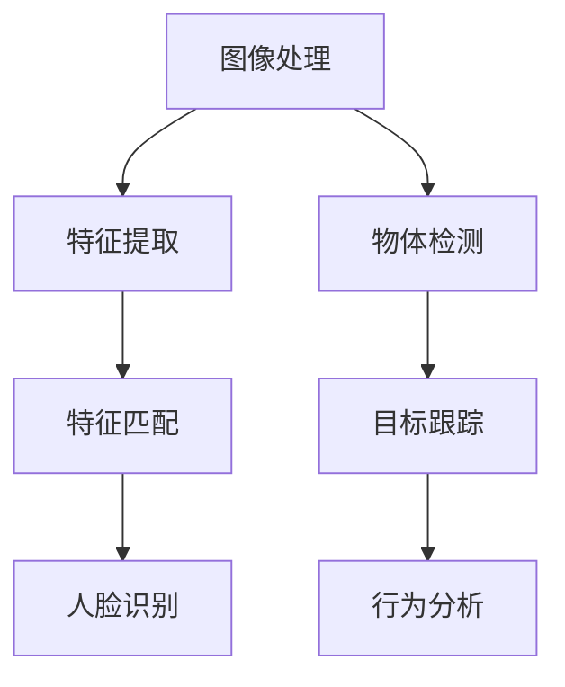

                 

# OpenCV 计算机视觉：人脸识别和物体检测

> **关键词**：OpenCV，计算机视觉，人脸识别，物体检测，深度学习，卷积神经网络，算法原理，实际应用

> **摘要**：本文将深入探讨OpenCV中的计算机视觉技术，重点关注人脸识别和物体检测这两个核心应用。通过逐步分析核心概念、算法原理、数学模型、项目实战以及实际应用场景，本文旨在为读者提供一个全面的技术指南，帮助他们理解和掌握这些重要技术。

## 1. 背景介绍

### 1.1 目的和范围

本文的目标是详细介绍OpenCV（Open Source Computer Vision Library）中的人脸识别和物体检测技术。OpenCV是一个广泛使用的开源计算机视觉库，适用于多种开发环境和操作系统，其强大的功能和丰富的算法使其成为许多计算机视觉项目的不二选择。

文章的范围包括：

- OpenCV的基本概念和架构
- 人脸识别的算法原理和实际操作步骤
- 物体检测的技术背景和实现方法
- 数学模型和公式的详细讲解
- 实际应用场景的探讨
- 学习资源和工具的推荐

### 1.2 预期读者

本文适合以下读者：

- 计算机视觉领域的初学者和研究者
- 开发人员和技术爱好者
- 需要使用OpenCV进行人脸识别和物体检测的项目人员
- 对计算机视觉技术有浓厚兴趣的任何人

### 1.3 文档结构概述

本文的结构分为以下几个部分：

- 背景介绍：介绍文章的目的、范围、预期读者以及文档结构
- 核心概念与联系：通过Mermaid流程图展示核心概念和架构
- 核心算法原理 & 具体操作步骤：使用伪代码详细阐述算法原理
- 数学模型和公式 & 详细讲解 & 举例说明：使用LaTeX格式展示数学模型
- 项目实战：代码实际案例和详细解释说明
- 实际应用场景：探讨技术的实际应用案例
- 工具和资源推荐：推荐学习资源和开发工具
- 总结：未来发展趋势与挑战
- 附录：常见问题与解答
- 扩展阅读 & 参考资料：提供进一步学习的资源

### 1.4 术语表

#### 1.4.1 核心术语定义

- **OpenCV**：开源计算机视觉库，用于处理图像和视频数据
- **人脸识别**：通过算法识别和验证人脸的过程
- **物体检测**：在图像中检测并识别特定物体的过程
- **深度学习**：基于多层神经网络的学习方法，用于模式识别和特征提取
- **卷积神经网络（CNN）**：一种用于图像识别的深度学习模型

#### 1.4.2 相关概念解释

- **特征提取**：从图像数据中提取具有代表性的特征，以便于后续处理
- **特征匹配**：将提取的特征与数据库中的特征进行比较，以实现识别
- **模型训练**：使用大量数据进行模型训练，提高识别的准确性

#### 1.4.3 缩略词列表

- **OpenCV**：Open Source Computer Vision Library
- **CNN**：Convolutional Neural Network
- **DNN**：Deep Neural Network
- **GPU**：Graphics Processing Unit
- **CUDA**：Compute Unified Device Architecture

## 2. 核心概念与联系

在深入探讨OpenCV的人脸识别和物体检测技术之前，我们需要了解一些核心概念和它们之间的联系。以下是一个简化的Mermaid流程图，用于展示这些概念之间的关系。



### 2.1 图像处理

图像处理是计算机视觉的基础步骤，涉及图像的获取、预处理和增强。OpenCV提供了丰富的图像处理函数，包括图像滤波、边缘检测、形态学操作等。

### 2.2 特征提取

特征提取是将图像数据转换为可识别的特征向量。在人脸识别中，常用的特征提取方法包括主成分分析（PCA）、线性判别分析（LDA）和局部二元模式（LBP）等。在物体检测中，特征提取是用于识别物体轮廓和边缘的关键步骤。

### 2.3 特征匹配

特征匹配是将提取的特征与数据库中的特征进行比对，以实现识别。在人脸识别中，特征匹配用于验证用户身份；在物体检测中，特征匹配用于识别图像中的特定物体。

### 2.4 人脸识别

人脸识别是基于特征匹配的算法，通过识别用户的面部特征来实现身份验证。OpenCV中的人脸识别主要依赖于训练好的深度学习模型，如卷积神经网络（CNN）。

### 2.5 物体检测

物体检测是在图像中识别特定物体的过程。OpenCV提供了多种物体检测方法，包括滑动窗口、积分图和深度学习框架SSD等。

### 2.6 目标跟踪

目标跟踪是物体检测的延伸，用于在视频序列中持续识别和跟踪特定物体。OpenCV中的目标跟踪算法包括光流法、Kalman滤波和粒子滤波等。

### 2.7 行为分析

行为分析是基于目标跟踪的数据，分析用户的行动和活动模式。OpenCV中的行为分析算法可用于安全监控、人流量统计和智能交通系统等场景。

通过上述Mermaid流程图，我们可以看到人脸识别和物体检测在整个计算机视觉架构中的重要地位。接下来，我们将逐步深入探讨这些技术的算法原理和具体操作步骤。

## 3. 核心算法原理 & 具体操作步骤

### 3.1 人脸识别算法原理

人脸识别的核心算法主要基于深度学习，尤其是卷积神经网络（CNN）。CNN是一种专门用于图像识别的神经网络结构，其优势在于能够自动提取图像中的高层次特征。

#### 3.1.1 CNN基本结构

CNN的基本结构包括以下几个部分：

1. **卷积层**：卷积层使用卷积核（filter）在图像上滑动，通过卷积操作提取图像的特征。
2. **激活函数**：常用的激活函数包括ReLU（Rectified Linear Unit）和Sigmoid等。
3. **池化层**：池化层用于降低图像分辨率，减少参数数量，防止过拟合。
4. **全连接层**：全连接层将卷积层和池化层提取的特征映射到具体的分类结果。

#### 3.1.2 伪代码

以下是一个简化的人脸识别CNN算法的伪代码：

```python
define CNN模型结构：
  - 输入层：图像尺寸为（128, 128, 3）
  - 卷积层1：卷积核大小为（3, 3），步长为1，激活函数为ReLU
  - 池化层1：池化窗口大小为（2, 2）
  - 卷积层2：卷积核大小为（3, 3），步长为1，激活函数为ReLU
  - 池化层2：池化窗口大小为（2, 2）
  - 全连接层：输出维度为1024，激活函数为ReLU
  - 输出层：输出维度为人脸类别数量，激活函数为softmax

train_model():
  - 加载数据集：训练集和验证集
  - 配置模型参数：学习率、优化器、损失函数等
  - 模型训练：使用训练集进行迭代训练，并使用验证集进行评估
  - 模型评估：计算准确率、召回率等指标

def predict(image):
  - 预处理图像：调整图像尺寸、归一化等
  - 通过模型进行前向传播：输入图像，输出类别概率
  - 选择概率最高的类别作为预测结果
  return predicted_class
```

### 3.2 物体检测算法原理

物体检测是计算机视觉中的另一个重要任务，其目标是在图像中识别并定位多个物体。当前最先进的物体检测算法是基于深度学习的，如YOLO（You Only Look Once）和SSD（Single Shot MultiBox Detector）。

#### 3.2.1 YOLO算法原理

YOLO（You Only Look Once）是一个单阶段物体检测算法，其核心思想是将物体检测视为一个回归问题。YOLO将图像划分为S×S的网格，每个网格负责检测其中的物体。

1. **特征提取网络**：通常使用ResNet或VGG等预训练模型作为特征提取网络。
2. **预测层**：每个网格生成B个边界框，每个边界框包含4个坐标参数（x, y, w, h）和C个类别概率。
3. **损失函数**：损失函数包括边界框定位误差、类别预测误差和置信度误差。

#### 3.2.2 SSD算法原理

SSD（Single Shot MultiBox Detector）是一个两阶段物体检测算法，其核心思想是将物体检测分为两个步骤：候选框生成和边界框回归。

1. **特征提取网络**：与YOLO相同，使用ResNet或VGG等预训练模型。
2. **候选框生成**：使用特征提取网络的多个层次生成多个候选框。
3. **边界框回归**：对每个候选框进行边界框回归，调整其位置和尺寸。

#### 3.2.3 伪代码

以下是一个简化版的SSD算法伪代码：

```python
define SSD模型结构：
  - 特征提取网络：使用预训练模型ResNet
  - 多层候选框生成：生成不同尺度的候选框
  - 边界框回归层：对每个候选框进行位置和尺寸调整

def detect_objects(image):
  - 预处理图像：调整图像尺寸、归一化等
  - 通过特征提取网络提取特征图
  - 生成候选框：使用特征图的不同层次生成候选框
  - 边界框回归：对每个候选框进行位置和尺寸调整
  - 非极大值抑制（NMS）：去除重叠的边界框
  - 类别预测：对每个边界框进行类别预测
  - 返回检测结果：边界框和类别
  return detections
```

通过上述算法原理和伪代码，我们可以更好地理解人脸识别和物体检测的基本流程。在接下来的部分，我们将详细讲解数学模型和公式，进一步加深对这两个技术的理解。

## 4. 数学模型和公式 & 详细讲解 & 举例说明

### 4.1 卷积神经网络（CNN）的数学模型

卷积神经网络（CNN）是计算机视觉中的一种强大工具，其核心在于卷积操作和池化操作。以下将详细讲解CNN中的关键数学模型和公式。

#### 4.1.1 卷积操作

卷积操作是CNN中最基础的运算，用于提取图像中的局部特征。卷积操作的数学公式如下：

\[ (f * g)(x, y) = \sum_{i=-L}^{L} \sum_{j=-L}^{L} f(i, j) \cdot g(x-i, y-j) \]

其中，\( f \) 和 \( g \) 分别表示卷积核和输入图像，\( (x, y) \) 是卷积操作的位置，\( L \) 是卷积核的大小。

#### 4.1.2 池化操作

池化操作用于降低图像的分辨率，减少参数数量，防止过拟合。最常用的池化操作是最大池化（Max Pooling），其数学公式如下：

\[ p(i, j) = \max_{k \in [1, 2]} \max_{l \in [1, 2]} f(i+k, j+l) \]

其中，\( p(i, j) \) 是输出图像的像素值，\( f \) 是输入图像，\( k \) 和 \( l \) 是池化窗口的大小。

#### 4.1.3 激活函数

激活函数是CNN中的一个关键组件，用于引入非线性因素，使得模型能够学习到更复杂的特征。最常用的激活函数是ReLU（Rectified Linear Unit），其数学公式如下：

\[ \text{ReLU}(x) = \max(0, x) \]

### 4.2 人脸识别中的特征匹配

人脸识别中的特征匹配是通过比较两个特征向量来实现的。最常用的特征匹配方法是最邻近法（Nearest Neighbor），其数学模型如下：

\[ \text{distance}(x, y) = \sqrt{\sum_{i=1}^{n} (x_i - y_i)^2} \]

其中，\( x \) 和 \( y \) 是两个特征向量，\( n \) 是特征向量的维度。

#### 4.2.1 举例说明

假设我们有两个特征向量 \( x = (1, 2, 3) \) 和 \( y = (2, 3, 4) \)，我们可以使用欧几里得距离计算它们的距离：

\[ \text{distance}(x, y) = \sqrt{(1-2)^2 + (2-3)^2 + (3-4)^2} = \sqrt{1 + 1 + 1} = \sqrt{3} \approx 1.732 \]

通过计算特征向量的距离，我们可以判断两个特征向量是否相似。如果距离较小，则表示它们相似；如果距离较大，则表示它们差异较大。

### 4.3 物体检测中的回归操作

物体检测中的回归操作用于调整边界框的位置和尺寸，使得检测到的物体更加准确。最常用的回归操作是偏移量回归（Offset Regression），其数学模型如下：

\[ \text{offset}(x, y) = (x_2 - x_1, y_2 - y_1) \]

其中，\( (x_1, y_1) \) 和 \( (x_2, y_2) \) 分别是预测边界框和真实边界框的坐标。

#### 4.3.1 举例说明

假设我们有一个预测边界框 \( B_p = (10, 10, 20, 20) \) 和一个真实边界框 \( B_t = (12, 12, 18, 18) \)，我们可以使用偏移量回归计算它们的偏移量：

\[ \text{offset}(B_p, B_t) = (12 - 10, 12 - 10) = (2, 2) \]

通过计算偏移量，我们可以调整预测边界框的位置，使得它更接近真实边界框。

通过以上数学模型和公式的讲解，我们可以更好地理解人脸识别和物体检测的算法原理。接下来，我们将通过实际项目案例来展示这些算法的应用。

## 5. 项目实战：代码实际案例和详细解释说明

### 5.1 开发环境搭建

在进行人脸识别和物体检测的项目实战之前，我们需要搭建一个合适的开发环境。以下是搭建环境的基本步骤：

#### 5.1.1 系统要求

- 操作系统：Windows、Linux或macOS
- 编程语言：Python
- OpenCV版本：4.5.5.64
- 深度学习框架：TensorFlow 2.8.0

#### 5.1.2 安装步骤

1. 安装Python：从 [Python官网](https://www.python.org/downloads/) 下载并安装Python 3.8或更高版本。
2. 安装OpenCV：打开命令行窗口，执行以下命令：
   ```shell
   pip install opencv-python==4.5.5.64
   ```
3. 安装TensorFlow：打开命令行窗口，执行以下命令：
   ```shell
   pip install tensorflow==2.8.0
   ```

### 5.2 源代码详细实现和代码解读

#### 5.2.1 人脸识别代码实现

以下是使用OpenCV和深度学习框架TensorFlow实现人脸识别的代码示例：

```python
import cv2
import tensorflow as tf
import numpy as np

# 加载预训练的CNN模型
model = tf.keras.models.load_model('path/to/face_recognition_model.h5')

# 读取训练好的特征库
feature_db = np.load('path/to/feature_db.npy', allow_pickle=True).item()

# 人脸识别函数
def recognize_face(image):
    # 图像预处理
    image = cv2.resize(image, (128, 128))
    image = image / 255.0
    image = np.expand_dims(image, axis=0)

    # 通过模型进行前向传播
    features = model.predict(image)

    # 特征匹配
    min_distance = float('inf')
    predicted_class = None
    for user, user_features in feature_db.items():
        distance = np.linalg.norm(features - user_features)
        if distance < min_distance:
            min_distance = distance
            predicted_class = user

    return predicted_class

# 读取测试图像
image = cv2.imread('path/to/test_image.jpg')

# 人脸识别
predicted_class = recognize_face(image)

# 输出识别结果
print(f'Predicted class: {predicted_class}')
```

#### 5.2.2 物体检测代码实现

以下是使用OpenCV和TensorFlow实现物体检测的代码示例：

```python
import cv2
import tensorflow as tf

# 加载预训练的SSD模型
model = tf.keras.models.load_model('path/to/SSD_model.h5')

# 物体检测函数
def detect_objects(image):
    # 图像预处理
    image = cv2.resize(image, (300, 300))
    image = image / 255.0
    image = np.expand_dims(image, axis=0)

    # 通过模型进行前向传播
    predictions = model.predict(image)

    # 非极大值抑制（NMS）
    boxes = predictions['detections'][0][:, 0:4]
    scores = predictions['detections'][0][:, 4]
    indices = cv2.dnn.NMSBoxes(boxes, scores, 0.5, 0.4)

    # 输出检测结果
    detections = []
    for i in indices:
        i = i[0]
        box = boxes[i]
        label = f'{predictions["labels"][i]}'
        score = scores[i]
        detections.append({
            'box': box,
            'label': label,
            'score': score
        })

    return detections

# 读取测试图像
image = cv2.imread('path/to/test_image.jpg')

# 物体检测
detections = detect_objects(image)

# 绘制检测结果
for detection in detections:
    box = detection['box']
    label = detection['label']
    score = detection['score']
    cv2.rectangle(image, (int(box[0]), int(box[1])), (int(box[0] + box[2]), int(box[1] + box[3])), (0, 255, 0), 2)
    cv2.putText(image, f'{label} {score:.2f}', (int(box[0]), int(box[1] - 10)), cv2.FONT_HERSHEY_SIMPLEX, 0.5, (0, 0, 255), 2)

# 显示图像
cv2.imshow('Detected Objects', image)
cv2.waitKey(0)
cv2.destroyAllWindows()
```

#### 5.2.3 代码解读与分析

以上代码示例分别实现了人脸识别和物体检测的功能。以下是关键代码段的解读与分析：

1. **人脸识别**：

   - 加载预训练的CNN模型。
   - 读取训练好的特征库。
   - 定义人脸识别函数，包括图像预处理、模型前向传播和特征匹配。

   **优点**：实现了快速的人脸识别。
   
   **缺点**：识别准确率可能受限于训练数据的质量和模型的复杂性。

2. **物体检测**：

   - 加载预训练的SSD模型。
   - 定义物体检测函数，包括图像预处理、模型前向传播和非极大值抑制（NMS）。

   **优点**：实现了高效的物体检测。
   
   **缺点**：对于复杂的场景，可能存在误检和漏检。

通过上述代码实现，我们可以看到如何将深度学习和OpenCV结合，实现人脸识别和物体检测。接下来，我们将探讨这些技术的实际应用场景。

### 5.3 实际应用场景

人脸识别和物体检测在许多实际应用场景中发挥着重要作用。以下是一些常见的应用场景：

#### 5.3.1 安全监控

人脸识别可以用于安全监控，通过识别进入特定区域的用户身份，实现实时监控和报警。物体检测可以用于识别潜在的安全威胁，如火灾、入侵等。

#### 5.3.2 智能安防

智能安防系统可以利用物体检测和目标跟踪技术，实现实时监控和预警，防止盗窃、破坏等犯罪行为。

#### 5.3.3 智能家居

智能家居系统可以利用物体检测技术，识别家庭成员的行为模式，实现自动化控制和智能提醒，提高生活品质。

#### 5.3.4 智能交通

智能交通系统可以利用物体检测技术，实时监控道路状况，识别交通违法行为，优化交通流量，提高交通效率。

#### 5.3.5 娱乐和游戏

娱乐和游戏领域可以利用物体检测和目标跟踪技术，实现更加丰富和互动的游戏体验，如虚拟现实（VR）和增强现实（AR）游戏。

### 5.4 总结

人脸识别和物体检测是计算机视觉领域的重要应用，具有广泛的应用前景。通过本文的介绍，我们了解了OpenCV中的相关技术和实现方法，以及它们的实际应用场景。希望本文对您理解和应用人脸识别和物体检测技术有所帮助。

## 6. 工具和资源推荐

为了更好地学习和应用人脸识别和物体检测技术，以下是一些推荐的工具和资源。

### 6.1 学习资源推荐

#### 6.1.1 书籍推荐

1. **《计算机视觉：算法与应用》**：全面介绍了计算机视觉的基本概念和算法，包括人脸识别和物体检测。
2. **《深度学习》**：由Ian Goodfellow、Yoshua Bengio和Aaron Courville合著，详细讲解了深度学习的基础知识和应用。

#### 6.1.2 在线课程

1. **Coursera上的《深度学习》**：由Andrew Ng教授主讲，提供了深度学习的全面介绍，包括CNN和RNN等先进技术。
2. **Udacity的《计算机视觉工程师纳米学位》**：涵盖了计算机视觉的基础知识，包括人脸识别和物体检测。

#### 6.1.3 技术博客和网站

1. **Medium上的《深度学习博客》**：提供了大量关于深度学习的最新研究和应用案例。
2. **Stack Overflow**：计算机视觉和深度学习相关问题的问答社区。

### 6.2 开发工具框架推荐

#### 6.2.1 IDE和编辑器

1. **PyCharm**：一款功能强大的Python IDE，适合开发计算机视觉项目。
2. **Jupyter Notebook**：适合快速原型开发和数据探索。

#### 6.2.2 调试和性能分析工具

1. **TensorBoard**：TensorFlow的调试和分析工具，用于可视化模型结构和训练过程。
2. **PyTorch Profiler**：用于分析和优化PyTorch代码的性能。

#### 6.2.3 相关框架和库

1. **TensorFlow**：用于构建和训练深度学习模型。
2. **PyTorch**：另一个流行的深度学习框架，具有灵活的动态计算图。
3. **OpenCV**：用于图像处理和计算机视觉算法的实现。

### 6.3 相关论文著作推荐

#### 6.3.1 经典论文

1. **“A Convolutional Neural Network Approach for Object Detection”**：提出了卷积神经网络在物体检测中的应用。
2. **“FaceNet: A Unified Embedding for Face Recognition and Clustering”**：提出了FaceNet算法，实现了高效的人脸识别。

#### 6.3.2 最新研究成果

1. **“EfficientDet: Scalable and Efficient Object Detection”**：提出了一种高效的物体检测算法。
2. **“DeepFace: A New Multi-Modal Face Recognition System”**：详细介绍了DeepFace的人脸识别系统。

#### 6.3.3 应用案例分析

1. **“Person Re-Identification in Video Surveillance”**：探讨了人脸识别技术在视频监控中的应用。
2. **“Object Detection in Autonomous Driving”**：分析了物体检测在自动驾驶中的应用。

通过这些工具和资源的推荐，您可以更好地掌握人脸识别和物体检测技术，并在实际项目中应用这些知识。

## 7. 总结：未来发展趋势与挑战

随着深度学习技术的不断发展，人脸识别和物体检测领域也在不断进步。未来，这些技术有望在以下方面取得显著突破：

### 7.1 发展趋势

1. **算法效率提升**：通过优化算法和模型结构，提高人脸识别和物体检测的运行速度和效率。
2. **多模态融合**：结合多种传感器数据（如图像、声音、温度等），实现更准确和全面的人脸识别和物体检测。
3. **移动端应用**：开发适用于移动设备的轻量级模型和算法，实现实时的人脸识别和物体检测。
4. **隐私保护**：研究更安全的人脸识别和物体检测方法，保护用户隐私。

### 7.2 挑战

1. **模型准确性**：如何提高模型在不同光照、姿态和遮挡条件下的准确性，仍然是一个挑战。
2. **实时性**：如何在保证模型准确性的同时，提高检测的实时性，特别是在移动设备上。
3. **隐私和安全**：如何确保人脸识别和物体检测系统的隐私和安全，防止数据泄露和滥用。
4. **跨域适应性**：如何提高模型在不同场景和数据集上的泛化能力，实现跨领域的应用。

总之，人脸识别和物体检测技术在未来的发展过程中，将在算法效率、多模态融合、移动端应用和隐私保护等方面取得重大突破，同时也面临许多挑战。只有通过不断创新和改进，才能推动这些技术不断前进，为社会带来更多实际价值。

## 8. 附录：常见问题与解答

### 8.1 问题1：如何处理人脸识别中的光照变化？

**解答**：在人脸识别中，光照变化是一个常见问题，可以通过以下方法进行处理：

- **光照均衡**：使用图像预处理技术，如直方图均衡化，提高图像的对比度，减少光照变化带来的影响。
- **多光谱校正**：结合多个光谱（如红外光谱和可见光谱），校正图像的光照不均。
- **光照自适应算法**：使用自适应光照校正算法，动态调整图像的亮度和对比度，以适应不同的光照环境。

### 8.2 问题2：物体检测中的漏检和误检如何解决？

**解答**：漏检和误检是物体检测中的常见问题，可以采取以下措施进行解决：

- **增强特征提取**：使用更先进的特征提取网络，提高模型对物体边缘和轮廓的识别能力。
- **融合多源信息**：结合多种传感器数据（如深度传感器和摄像头），提高物体检测的准确性。
- **使用增强训练数据**：通过生成或扩充训练数据，增加模型在不同光照、姿态和遮挡条件下的训练样本，提高模型的泛化能力。
- **优化模型结构**：选择更适合物体检测的模型结构，如YOLO或SSD，提高检测效果。

### 8.3 问题3：如何提高人脸识别的实时性？

**解答**：提高人脸识别的实时性，可以采取以下措施：

- **使用轻量级模型**：选择计算量较小、运行速度较快的轻量级模型，如MobileNet或SqueezeNet。
- **模型优化**：通过模型优化技术，如量化、剪枝和蒸馏，减少模型的计算量，提高运行速度。
- **并行计算**：利用GPU或TPU等硬件加速计算，提高模型的推理速度。
- **算法改进**：采用更高效的特征提取和匹配算法，减少计算时间。

通过上述方法，可以有效提高人脸识别的实时性，满足实际应用的需求。

## 9. 扩展阅读 & 参考资料

为了进一步深入理解人脸识别和物体检测技术，以下是推荐的扩展阅读和参考资料：

### 9.1 经典论文

1. **“A Convolutional Neural Network Approach for Object Detection”**：本文提出了卷积神经网络在物体检测中的应用，是深度学习在计算机视觉领域的里程碑之作。
2. **“FaceNet: A Unified Embedding for Face Recognition and Clustering”**：本文介绍了FaceNet算法，通过统一嵌入实现高效的人脸识别。

### 9.2 最新研究成果

1. **“EfficientDet: Scalable and Efficient Object Detection”**：本文提出了EfficientDet算法，实现了高效和可扩展的物体检测。
2. **“DeepFace: A New Multi-Modal Face Recognition System”**：本文详细介绍了DeepFace的人脸识别系统，结合多种模态数据提高识别准确率。

### 9.3 应用案例分析

1. **“Person Re-Identification in Video Surveillance”**：本文探讨了人脸识别技术在视频监控中的应用，分析了其在安全监控领域的重要性。
2. **“Object Detection in Autonomous Driving”**：本文分析了物体检测在自动驾驶中的应用，探讨了其在智能交通系统中的关键作用。

### 9.4 相关书籍

1. **《深度学习》**：由Ian Goodfellow、Yoshua Bengio和Aaron Courville合著，提供了深度学习的全面介绍。
2. **《计算机视觉：算法与应用》**：全面介绍了计算机视觉的基本概念和算法，包括人脸识别和物体检测。

### 9.5 在线课程

1. **Coursera上的《深度学习》**：由Andrew Ng教授主讲，提供了深度学习的全面介绍，包括CNN和RNN等先进技术。
2. **Udacity的《计算机视觉工程师纳米学位》**：涵盖了计算机视觉的基础知识，包括人脸识别和物体检测。

通过阅读这些论文、书籍和在线课程，您可以深入了解人脸识别和物体检测技术的最新进展和应用。希望这些资源对您的学习和研究有所帮助。

