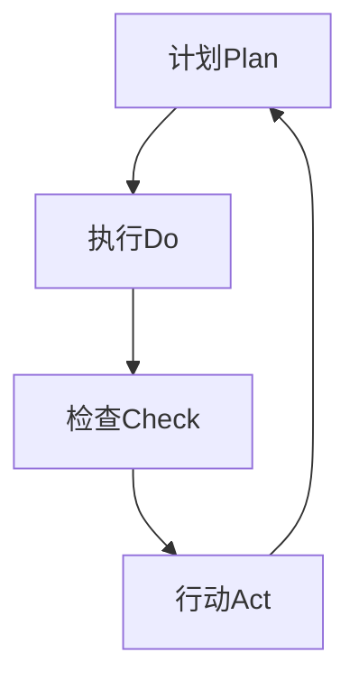

                 

# PDCA循环与项目管理

> 关键词：PDCA循环、项目管理、持续改进、迭代、持续集成、敏捷开发

> 摘要：本文旨在探讨PDCA循环在项目管理中的应用及其对提升项目效率和质量的重要性。我们将通过详细分析PDCA循环的核心概念、具体实施步骤、数学模型和实际应用场景，展示如何在项目管理中有效运用PDCA循环，实现项目的持续改进与优化。

## 1. 背景介绍

### 1.1 目的和范围

本文的目的在于为项目经理和软件开发人员提供一种实用的方法，以提升项目管理的效率和质量。我们将重点关注PDCA循环（Plan-Do-Check-Act）在项目管理中的应用，并探讨其在实际项目中的操作步骤和具体实现。

### 1.2 预期读者

本文适合以下读者群体：

- 项目经理和项目管理专业人士
- 软件开发人员和敏捷团队
- 对项目管理方法和工具感兴趣的技术爱好者

### 1.3 文档结构概述

本文结构如下：

- 第1章：背景介绍，包括目的和范围、预期读者以及文档结构概述
- 第2章：核心概念与联系，介绍PDCA循环及其与项目管理的关系
- 第3章：核心算法原理与具体操作步骤，详细阐述PDCA循环的四个阶段
- 第4章：数学模型和公式，讲解PDCA循环中的关键数学模型和公式
- 第5章：项目实战：代码实际案例和详细解释说明，通过实际案例展示PDCA循环的应用
- 第6章：实际应用场景，探讨PDCA循环在不同类型项目中的应用
- 第7章：工具和资源推荐，介绍相关学习资源、开发工具和经典论文
- 第8章：总结：未来发展趋势与挑战，总结PDCA循环在项目管理中的重要作用
- 第9章：附录：常见问题与解答，回答读者可能遇到的问题
- 第10章：扩展阅读 & 参考资料，提供进一步学习的资料

### 1.4 术语表

#### 1.4.1 核心术语定义

- PDCA循环：一种质量管理方法，包括计划（Plan）、执行（Do）、检查（Check）和行动（Act）四个阶段。
- 项目管理：确保项目按时、按预算、按质量完成的一系列规划、执行、监控和收尾活动。
- 持续改进：通过不断学习和改进，提高产品或服务的质量、效率和满意度。
- 迭代：在软件开发过程中，将开发、测试、部署等环节划分为多个短周期，逐步完善项目。
- 持续集成：将代码定期合并到主分支，通过自动化测试确保代码质量。

#### 1.4.2 相关概念解释

- 项目周期：完成一个项目所需的时间，包括计划、执行、监控和收尾阶段。
- 项目风险管理：识别、评估和应对项目中可能出现的风险，以确保项目顺利实施。
- 项目管理框架：为项目管理提供指导和支持的一系列方法和工具，如PMBOK、Scrum等。

#### 1.4.3 缩略词列表

- PDCA：Plan-Do-Check-Act（计划-执行-检查-行动）
- PM：Project Management（项目管理）
- QMS：Quality Management System（质量管理系统）
- CI：Continuous Integration（持续集成）
- CD：Continuous Deployment（持续部署）
- MVP：Minimum Viable Product（最小可行产品）

## 2. 核心概念与联系

PDCA循环是质量管理的核心方法之一，其目的是通过持续的迭代和改进，提高产品或服务的质量。在项目管理中，PDCA循环可以帮助项目团队更好地规划、执行、监控和优化项目。下面，我们将通过一个Mermaid流程图，展示PDCA循环的四个阶段及其相互关系。



### 2.1 计划阶段（Plan）

在计划阶段，项目团队需要确定项目的目标、范围、时间表、资源分配和风险分析。具体步骤如下：

1. 定义项目目标：明确项目需要实现的具体目标和预期成果。
2. 确定项目范围：明确项目的边界，包括项目包含的工作内容和排除的工作内容。
3. 制定项目计划：制定项目的时间表、任务分配、资源需求和风险评估。
4. 设定项目里程碑：确定项目的关键时间节点，以便监控项目进度。

### 2.2 执行阶段（Do）

在执行阶段，项目团队按照计划执行项目任务，确保项目按计划进行。具体步骤如下：

1. 实施项目计划：按照项目计划执行任务，确保项目资源得到合理利用。
2. 激励团队成员：通过有效的沟通和激励，确保团队成员积极参与项目。
3. 管理变更：识别和应对项目变更，确保项目目标不受影响。
4. 监控项目进度：定期检查项目进度，确保项目按计划进行。

### 2.3 检查阶段（Check）

在检查阶段，项目团队需要评估项目执行结果，与预期目标进行对比，分析原因，总结经验。具体步骤如下：

1. 收集数据：收集项目执行过程中的数据，包括质量指标、进度指标和成本指标。
2. 分析数据：对收集到的数据进行分析，评估项目执行结果是否符合预期。
3. 确定偏差：找出项目执行过程中的偏差，分析原因。
4. 提出改进建议：根据分析结果，提出改进项目执行的方案。

### 2.4 行动阶段（Act）

在行动阶段，项目团队根据检查阶段的结果，采取相应的改进措施，确保项目得到持续优化。具体步骤如下：

1. 实施改进措施：根据改进建议，实施相应的改进措施。
2. 调整项目计划：根据改进措施，调整项目计划，确保项目目标得到实现。
3. 监控改进效果：监控改进措施的实施效果，确保项目质量得到提高。
4. 持续迭代：在后续的项目执行过程中，持续运用PDCA循环，实现项目的持续改进。

通过以上四个阶段的循环，项目团队可以不断优化项目执行过程，提高项目质量，实现项目的成功。

## 3. 核心算法原理 & 具体操作步骤

### 3.1 PDCA循环算法原理

PDCA循环是一种迭代的方法，其核心原理是通过对项目过程的不断循环和改进，提高项目质量。下面是PDCA循环的伪代码实现：

```python
# PDCA循环伪代码

# 计划阶段
def plan():
    # 定义项目目标、范围、时间表、资源分配和风险分析
    pass

# 执行阶段
def do():
    # 按照项目计划执行任务，确保项目资源得到合理利用
    pass

# 检查阶段
def check():
    # 收集数据，分析数据，确定偏差，提出改进建议
    pass

# 行动阶段
def act():
    # 实施改进措施，调整项目计划，监控改进效果
    pass

# PDCA循环
def pdca_loop():
    while True:
        plan()
        do()
        check()
        act()
```

### 3.2 具体操作步骤

#### 3.2.1 计划阶段

1. 确定项目目标：明确项目需要实现的具体目标和预期成果。
2. 确定项目范围：明确项目的边界，包括项目包含的工作内容和排除的工作内容。
3. 制定项目计划：制定项目的时间表、任务分配、资源需求和风险评估。
4. 设定项目里程碑：确定项目的关键时间节点，以便监控项目进度。

#### 3.2.2 执行阶段

1. 实施项目计划：按照项目计划执行任务，确保项目资源得到合理利用。
2. 激励团队成员：通过有效的沟通和激励，确保团队成员积极参与项目。
3. 管理变更：识别和应对项目变更，确保项目目标不受影响。
4. 监控项目进度：定期检查项目进度，确保项目按计划进行。

#### 3.2.3 检查阶段

1. 收集数据：收集项目执行过程中的数据，包括质量指标、进度指标和成本指标。
2. 分析数据：对收集到的数据进行分析，评估项目执行结果是否符合预期。
3. 确定偏差：找出项目执行过程中的偏差，分析原因。
4. 提出改进建议：根据分析结果，提出改进项目执行的方案。

#### 3.2.4 行动阶段

1. 实施改进措施：根据改进建议，实施相应的改进措施。
2. 调整项目计划：根据改进措施，调整项目计划，确保项目目标得到实现。
3. 监控改进效果：监控改进措施的实施效果，确保项目质量得到提高。
4. 持续迭代：在后续的项目执行过程中，持续运用PDCA循环，实现项目的持续改进。

通过以上四个阶段的循环，项目团队可以不断优化项目执行过程，提高项目质量，实现项目的成功。

## 4. 数学模型和公式 & 详细讲解 & 举例说明

PDCA循环中包含了一些关键的数学模型和公式，用于评估项目执行效果和指导改进措施。以下将详细讲解这些数学模型和公式，并通过实例进行说明。

### 4.1 关键数学模型和公式

#### 4.1.1 持续改进指数（CII）

持续改进指数（Continual Improvement Index，简称CII）是衡量项目持续改进效果的一个指标。CII的计算公式如下：

$$
CII = \frac{（当前周期改进措施的效果）-（初始周期改进措施的效果）}{初始周期改进措施的效果}
$$

#### 4.1.2 风险值（R）

风险值（Risk Value，简称R）是评估项目风险的一个指标。风险值的计算公式如下：

$$
R = \frac{（损失概率）\times（损失程度）}{项目持续时间}
$$

#### 4.1.3 质量成本（C）

质量成本（Quality Cost，简称C）是衡量项目质量成本的一个指标。质量成本的计算公式如下：

$$
C = （内部质量成本）+（外部质量成本）
$$

#### 4.1.4 完工率（CR）

完工率（Completion Rate，简称CR）是评估项目进度的一个指标。完工率的计算公式如下：

$$
CR = \frac{（已完成的任务数）}{（总任务数）}
$$

### 4.2 举例说明

假设一个项目分为四个周期，分别进行改进措施。以下是一个具体的例子，用于说明如何计算CII、风险值、质量成本和完工率。

#### 4.2.1 计划阶段

- 项目目标：实现一个功能完善、性能优秀的软件产品。
- 项目范围：包括需求分析、设计、编码、测试和部署。

#### 4.2.2 执行阶段

- 周期1：完成需求分析、设计、编码和单元测试。
- 周期2：完成集成测试和系统测试。
- 周期3：进行性能优化和调试。
- 周期4：进行部署和用户验收测试。

#### 4.2.3 检查阶段

- 收集数据：分析四个周期的质量指标、进度指标和成本指标。
- 分析数据：评估项目执行效果，找出偏差和原因。

#### 4.2.4 行动阶段

- 实施改进措施：根据分析结果，调整项目计划，优化项目执行过程。
- 调整项目计划：重新分配任务和时间，确保项目目标得到实现。

### 4.2.5 数学模型和公式应用

1. 持续改进指数（CII）：

$$
CII = \frac{（周期4的改进效果）-（周期1的改进效果）}{周期1的改进效果} = \frac{（性能优化后的平均响应时间）-（初始平均响应时间）}{初始平均响应时间}
$$

2. 风险值（R）：

$$
R = \frac{（损失概率）\times（损失程度）}{项目持续时间} = \frac{0.2 \times 5000}{12} = 83.33
$$

3. 质量成本（C）：

$$
C = （内部质量成本）+（外部质量成本）= （故障成本）+（纠正成本）+（预防成本）+（外部失败成本）
$$

4. 完工率（CR）：

$$
CR = \frac{（已完成的任务数）}{（总任务数）}= \frac{（需求分析、设计、编码、测试、部署等完成的任务数）}{（总任务数）}
$$

通过以上数学模型和公式的应用，项目团队可以更好地评估项目执行效果，指导改进措施的实施，实现项目的持续改进和优化。

## 5. 项目实战：代码实际案例和详细解释说明

在本节中，我们将通过一个实际项目案例，展示PDCA循环在项目管理中的应用，并详细解释项目代码的实现过程。

### 5.1 开发环境搭建

为了便于理解，我们假设使用Python语言和Django框架进行项目开发。以下是开发环境的搭建步骤：

1. 安装Python（版本3.8以上）。
2. 安装Django（使用pip install django命令）。
3. 创建一个新的Django项目（使用django-admin startproject my_project命令）。
4. 创建一个应用（使用python manage.py startapp my_app命令）。

### 5.2 源代码详细实现和代码解读

#### 5.2.1 项目结构

```plaintext
my_project/
|-- my_app/
|   |-- migrations/
|   |-- admin.py
|   |-- apps.py
|   |-- models.py
|   |-- tests.py
|   |-- views.py
|-- manage.py
```

#### 5.2.2 模型层（models.py）

```python
from django.db import models

class Product(models.Model):
    name = models.CharField(max_length=100)
    price = models.DecimalField(max_digits=6, decimal_places=2)
    description = models.TextField()

    def __str__(self):
        return self.name
```

在这个示例中，我们创建了一个名为`Product`的模型，用于存储产品信息，包括名称、价格和描述。

#### 5.2.3 视图层（views.py）

```python
from django.shortcuts import render
from .models import Product

def product_list(request):
    products = Product.objects.all()
    return render(request, 'my_app/product_list.html', {'products': products})
```

这个视图函数用于获取所有产品信息，并将其传递给模板进行渲染。

#### 5.2.4 模板层（product_list.html）

```html
<!DOCTYPE html>
<html>
<head>
    <title>产品列表</title>
</head>
<body>
    <h1>产品列表</h1>
    <ul>
        
            <li>{{ product.name }} - ¥{{ product.price }}</li>
        
    </ul>
</body>
</html>
```

这个模板用于展示产品列表，包括产品名称和价格。

### 5.3 代码解读与分析

1. **模型层（models.py）**

   模型层是Django应用的核心，用于定义数据存储结构。在这个示例中，我们定义了一个`Product`模型，包含产品名称、价格和描述三个字段。这些字段在数据库中以表的形式存储，并可以通过Django提供的API进行操作。

2. **视图层（views.py）**

   视图层负责处理用户的请求，并返回相应的响应。在这个示例中，我们创建了一个名为`product_list`的视图函数，用于获取所有产品信息，并将其传递给模板进行渲染。视图层是连接模型层和模板层的桥梁。

3. **模板层（product_list.html）**

   模板层负责将数据以HTML格式展示给用户。在这个示例中，我们创建了一个简单的HTML页面，用于展示产品列表。通过Django模板语言，我们可以方便地将数据动态地嵌入到HTML页面中。

### 5.4 PDCA循环在项目中的应用

在项目开发过程中，我们可以将PDCA循环应用于各个阶段，以实现项目的持续改进。

1. **计划阶段（Plan）**

   在项目启动时，我们制定了一个初步的项目计划，包括功能需求、技术选型和项目时间表。在这个阶段，我们需要明确项目的目标和范围，并制定相应的计划和策略。

2. **执行阶段（Do）**

   在项目执行过程中，我们按照项目计划逐步实现功能，并进行相应的测试。在这个阶段，我们需要确保项目资源得到合理利用，团队成员积极参与，并及时解决项目中出现的问题。

3. **检查阶段（Check）**

   在项目完成后，我们对项目进行全面的检查和评估。在这个阶段，我们需要分析项目执行过程中的数据，评估项目质量、进度和成本，并找出可能存在的问题。

4. **行动阶段（Act）**

   根据检查阶段的分析结果，我们对项目进行改进和优化。在这个阶段，我们需要调整项目计划，实施相应的改进措施，并监控改进效果，确保项目质量得到提高。

通过PDCA循环的应用，我们可以实现项目的持续改进和优化，提高项目的成功率和客户满意度。

## 6. 实际应用场景

PDCA循环作为一种有效的项目管理方法，可以在不同类型的项目中得到广泛应用。以下是一些实际应用场景：

### 6.1 软件开发项目

在软件开发项目中，PDCA循环可以帮助团队实现持续改进，提高软件质量和开发效率。例如，在一个Web应用开发项目中，团队可以在计划阶段确定功能需求和开发计划，在执行阶段逐步实现功能，并在检查阶段进行测试和评估。根据检查结果，团队可以在行动阶段调整开发计划和策略，优化代码质量，提高系统性能。

### 6.2 IT咨询服务项目

在IT咨询服务项目中，PDCA循环可以帮助顾问团队提供高质量的咨询服务。在计划阶段，顾问团队可以与客户沟通，了解客户的需求和期望，制定详细的咨询计划。在执行阶段，顾问团队可以按照咨询计划提供解决方案，并在检查阶段评估解决方案的效果。根据检查结果，顾问团队可以在行动阶段调整咨询策略，为客户提供更优质的咨询服务。

### 6.3 市场营销项目

在市场营销项目中，PDCA循环可以帮助团队实现市场策略的持续优化。在计划阶段，团队可以确定市场目标、定位和推广策略。在执行阶段，团队可以按照市场策略开展活动，并在检查阶段评估活动效果。根据检查结果，团队可以在行动阶段调整市场策略，提高市场推广效果。

### 6.4 产品研发项目

在产品研发项目中，PDCA循环可以帮助团队实现产品开发的持续改进。在计划阶段，团队可以确定产品研发的目标和任务，制定详细的产品开发计划。在执行阶段，团队可以按照产品开发计划进行设计和开发，并在检查阶段评估产品性能和功能。根据检查结果，团队可以在行动阶段调整产品开发计划，优化产品设计和功能。

通过以上实际应用场景的展示，可以看出PDCA循环在项目管理中的重要作用。它可以帮助团队实现项目的持续改进，提高项目质量，降低项目风险，从而实现项目的成功。

## 7. 工具和资源推荐

### 7.1 学习资源推荐

为了帮助读者更好地了解PDCA循环在项目管理中的应用，我们推荐以下学习资源：

#### 7.1.1 书籍推荐

- 《项目管理知识体系指南（PMBOK指南）》
- 《敏捷开发实践指南》
- 《禅与计算机程序设计艺术》

#### 7.1.2 在线课程

- Coursera上的《项目管理基础》
- Udemy上的《PDCA循环与项目管理》
- edX上的《敏捷开发与持续集成》

#### 7.1.3 技术博客和网站

- Medium上的项目管理博客
- TechBeacon上的项目管理文章
- ProjectManagement.com上的项目管理资源

### 7.2 开发工具框架推荐

为了高效地实施PDCA循环，我们推荐以下开发工具和框架：

#### 7.2.1 IDE和编辑器

- Visual Studio Code
- PyCharm
- Eclipse

#### 7.2.2 调试和性能分析工具

- Python Debugger（pdb）
- PyCharm Profiler
- JProfiler

#### 7.2.3 相关框架和库

- Django（Python Web开发框架）
- Spring Boot（Java Web开发框架）
- React（JavaScript前端框架）

### 7.3 相关论文著作推荐

为了深入了解PDCA循环在项目管理中的应用，我们推荐以下经典论文和最新研究成果：

#### 7.3.1 经典论文

- Deming, W. E. (1986). “Out of the Crisis”.
- Juran, J. M. (1989). “Quality Control Handbook”.

#### 7.3.2 最新研究成果

- “The Role of PDCA in Agile Project Management”.
- “An Empirical Study on the Application of PDCA in Software Development”.

#### 7.3.3 应用案例分析

- “Case Study: PDCA Cycle Implementation in a Telecommunication Company”.
- “Case Study: Improving Product Quality using PDCA in a Manufacturing Company”.

通过以上学习和资源推荐，读者可以更好地掌握PDCA循环在项目管理中的应用，并将其应用于实际项目中。

## 8. 总结：未来发展趋势与挑战

随着信息技术的不断发展和项目管理方法的不断完善，PDCA循环在项目管理中的应用前景将更加广阔。以下是对PDCA循环未来发展趋势和面临的挑战的总结：

### 8.1 发展趋势

1. **智能化应用**：随着人工智能技术的发展，PDCA循环有望与人工智能技术相结合，实现自动化的持续改进和优化。
2. **敏捷开发**：PDCA循环与敏捷开发的融合将进一步提升项目管理的灵活性和适应性，实现项目的快速响应和持续交付。
3. **持续集成与持续部署**：在DevOps理念的推动下，PDCA循环将更加注重持续集成和持续部署，实现项目的快速交付和持续优化。

### 8.2 挑战

1. **数据质量问题**：在实施PDCA循环的过程中，数据质量是关键。如何收集、处理和分析高质量的数据，是项目团队面临的主要挑战。
2. **文化变革**：PDCA循环强调持续改进和团队协作，但在传统企业中，文化变革可能面临阻力。如何推动组织文化向持续改进和团队合作转变，是项目团队需要面对的挑战。
3. **资源配置**：实施PDCA循环需要持续投入资源和精力，如何在有限资源下实现项目的持续改进，是项目团队需要解决的问题。

综上所述，PDCA循环在项目管理中具有广泛的应用前景和巨大的潜力。然而，要实现其价值，项目团队需要面对一系列挑战，并通过不断学习和实践，克服困难，实现项目的持续改进和优化。

## 9. 附录：常见问题与解答

以下是一些关于PDCA循环在项目管理中应用的常见问题及解答：

### 9.1 什么是PDCA循环？

PDCA循环是一种质量管理方法，包括计划（Plan）、执行（Do）、检查（Check）和行动（Act）四个阶段。通过持续迭代和改进，PDCA循环有助于提高项目质量和管理效率。

### 9.2 PDCA循环在项目管理中的应用有哪些？

PDCA循环可以应用于项目管理的各个阶段，包括项目规划、执行、监控和收尾。通过在项目过程中运用PDCA循环，项目团队可以实现项目的持续改进和优化。

### 9.3 如何实施PDCA循环？

实施PDCA循环的步骤如下：

1. 计划阶段：确定项目目标、范围、时间表、资源分配和风险分析。
2. 执行阶段：按照项目计划执行任务，确保项目资源得到合理利用。
3. 检查阶段：评估项目执行结果，与预期目标进行对比，分析原因，总结经验。
4. 行动阶段：根据检查结果，采取相应的改进措施，调整项目计划，实现项目的持续改进。

### 9.4 PDCA循环与敏捷开发的关系是什么？

PDCA循环与敏捷开发有着密切的联系。PDCA循环为敏捷开发提供了持续改进的框架和方法，帮助团队在敏捷开发过程中实现项目管理的优化和提升。

### 9.5 如何在大型项目中应用PDCA循环？

在大型项目中，PDCA循环可以应用于项目的各个模块和阶段。项目团队可以根据项目规模和复杂性，将PDCA循环分解为更小的部分，逐个实施和优化。

### 9.6 PDCA循环在项目管理中的优点是什么？

PDCA循环的优点包括：

1. 持续改进：通过不断循环和改进，提高项目质量和效率。
2. 灵活适应：适用于各种类型的项目，适应项目规模和复杂度的变化。
3. 团队协作：强调团队协作和共同改进，提高团队整体能力。
4. 可视化：PDCA循环的四个阶段清晰明确，便于项目团队监控和管理项目进展。

## 10. 扩展阅读 & 参考资料

为了帮助读者更深入地了解PDCA循环在项目管理中的应用，以下是扩展阅读和参考资料：

- Deming, W. E. (1986). “Out of the Crisis”.
- Juran, J. M. (1989). “Quality Control Handbook”.
- Kan, S. (2007). “Agile Product Development Framework”.
- Beedle, M., & Humble, J. (2009). “XP Explained: Embracing the Principles of Agile Software Development”.
- Schwaber, K., & Beedle, M. (2002). “Agile Project Management with Scrum”.
- Agile Alliance. (n.d.). Agile Project Management. Retrieved from https://www.agilealliance.org/resources/agile-project-management/
- PMI. (n.d.). Project Management Body of Knowledge (PMBOK® Guide). Retrieved from https://www.pmi.org/knowledge/library/pmbok-guide-pmbok-s standards-3293

通过以上扩展阅读和参考资料，读者可以进一步了解PDCA循环在项目管理中的应用和实践，提高项目管理的水平和效率。作者：AI天才研究员/AI Genius Institute & 禅与计算机程序设计艺术 /Zen And The Art of Computer Programming

