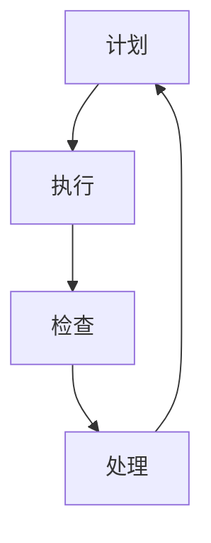

                 

# PDCA循环在流程优化中的作用

## 关键词
流程优化、PDCA循环、持续改进、质量管理、流程分析、实施步骤

## 摘要
本文深入探讨了PDCA循环在流程优化中的作用。通过介绍PDCA循环的四个阶段：计划（Plan）、执行（Do）、检查（Check）和处理（Act），详细阐述了如何将这些阶段应用于流程优化的具体实践。文章不仅提供了理论上的指导，还结合了实际案例，展示了PDCA循环在提升工作效率和保证质量方面的显著效果。本文旨在帮助读者理解和掌握PDCA循环在流程优化中的应用，以实现持续改进和高效运作。

## 1. 背景介绍

### 1.1 目的和范围
本文旨在介绍PDCA循环的概念，详细阐述其在流程优化中的应用，并探讨其有效性和实施步骤。文章将覆盖以下主要内容：

1. PDCA循环的四个阶段及其在流程优化中的应用。
2. PDCA循环的理论基础和核心原理。
3. 实际案例分析和具体操作步骤。
4. PDCA循环在项目管理和质量控制中的实际应用。
5. PDCA循环的优缺点及其改进方向。

### 1.2 预期读者
本文适用于希望提高流程效率和质量的各行业从业人员，特别是项目经理、流程优化专家、质量控制人员以及希望提升团队协作和项目管理的IT专业人士。

### 1.3 文档结构概述
本文结构如下：

1. 引言：简要介绍PDCA循环的背景和重要性。
2. PDCA循环的四个阶段：详细解释PDCA循环的各个阶段及其在流程优化中的应用。
3. 核心概念与联系：通过流程图展示PDCA循环的各个阶段及其关联。
4. 核心算法原理与具体操作步骤：介绍PDCA循环的具体实施步骤，包括计划、执行、检查和处理。
5. 数学模型和公式：阐述PDCA循环中涉及的数学模型和计算方法。
6. 项目实战：通过实际案例展示PDCA循环的实施过程。
7. 实际应用场景：探讨PDCA循环在不同行业和领域的应用。
8. 工具和资源推荐：推荐相关学习资源和工具。
9. 总结：总结PDCA循环在流程优化中的作用和未来发展趋势。
10. 附录：常见问题与解答。
11. 扩展阅读：提供更多相关阅读资料。

### 1.4 术语表

#### 1.4.1 核心术语定义
- **PDCA循环**：一种持续改进的管理方法，包括计划（Plan）、执行（Do）、检查（Check）和处理（Act）四个阶段。
- **流程优化**：通过改进流程设计、提高效率、降低成本来提升整体业务绩效。
- **质量**：产品或服务满足规定的或潜在的要求的特征和特性的整体集合。

#### 1.4.2 相关概念解释
- **计划（Plan）**：制定目标和计划，包括流程分析、需求分析、资源分配等。
- **执行（Do）**：执行计划，实施改进措施。
- **检查（Check）**：评估实施效果，与预期目标对比。
- **处理（Act）**：总结经验，制定持续改进计划。

#### 1.4.3 缩略词列表
- **PDCA**：Plan-Do-Check-Act
- **KPI**：关键绩效指标（Key Performance Indicators）

## 2. 核心概念与联系

PDCA循环是一种广泛应用于质量管理、流程优化和持续改进的管理方法。它的核心在于通过循环往复的四个阶段——计划、执行、检查和处理，实现对业务流程的逐步优化和改进。

### PDCA循环的四个阶段

#### 2.1 计划（Plan）
计划阶段是PDCA循环的起始阶段，主要任务是制定目标和计划。具体包括以下几个方面：

1. **目标设定**：明确要实现的具体目标。
2. **流程分析**：分析现有流程，识别问题和瓶颈。
3. **需求分析**：了解用户需求和期望，为改进提供依据。
4. **资源分配**：确定所需资源，包括人力、物力和财力。

#### 2.2 执行（Do）
执行阶段是将计划付诸实践的阶段。具体步骤如下：

1. **制定实施计划**：根据计划，制定详细的实施步骤和时间表。
2. **执行**：按照实施计划，执行各项改进措施。
3. **沟通协作**：确保团队成员理解并积极配合执行计划。

#### 2.3 检查（Check）
检查阶段是对执行效果的评估。具体包括以下几个方面：

1. **数据收集**：收集执行过程中的相关数据，包括时间、成本、质量等指标。
2. **效果评估**：将实际效果与预期目标进行比较，评估改进措施的有效性。
3. **问题识别**：识别执行过程中出现的问题和不足。

#### 2.4 处理（Act）
处理阶段是对检查结果的处理和总结。具体包括以下几个方面：

1. **总结经验**：总结成功经验和教训。
2. **制定改进计划**：根据检查结果，制定下一步的改进计划。
3. **持续改进**：将改进措施纳入流程，实现持续优化。

### PDCA循环的关联

PDCA循环中的四个阶段是相互关联的，形成一个闭环系统。每个阶段的结果都会影响下一个阶段，从而实现持续改进。

1. **计划阶段**的结果影响执行阶段，明确目标和资源分配。
2. **执行阶段**的结果影响检查阶段，收集数据和评估效果。
3. **检查阶段**的结果影响处理阶段，识别问题和制定改进计划。
4. **处理阶段**的结果又回到计划阶段，形成持续改进的循环。

#### 2.5 PDCA循环的流程图



在PDCA循环中，每个阶段的输出都是下一个阶段的输入，形成一个持续优化的过程。

## 3. 核心算法原理 & 具体操作步骤

PDCA循环是一种迭代的方法，其核心算法原理在于通过四个阶段不断循环，实现流程的持续改进。下面将详细讲解PDCA循环的具体操作步骤。

### 3.1 计划阶段

#### 3.1.1 目标设定
目标设定是计划阶段的首要任务。具体步骤如下：

1. **明确改进目标**：根据业务需求和用户反馈，明确需要改进的具体目标。
2. **目标具体化**：将目标具体化，使其具有可衡量性。
3. **目标分解**：将大目标分解为若干个小目标，确保每个目标都清晰明确。

#### 3.1.2 流程分析
流程分析是了解现有流程，识别问题和瓶颈的关键步骤。具体步骤如下：

1. **绘制流程图**：使用流程图工具，详细绘制现有流程。
2. **流程描述**：对流程的每个环节进行详细描述，明确输入、处理和输出。
3. **问题识别**：通过流程分析，识别流程中存在的问题和瓶颈。

#### 3.1.3 需求分析
需求分析是了解用户需求和期望，为改进提供依据。具体步骤如下：

1. **收集用户需求**：通过访谈、问卷调查等方式，收集用户需求和反馈。
2. **需求分类**：对收集到的需求进行分类，识别关键需求。
3. **需求优先级排序**：根据需求和业务优先级，对需求进行排序。

#### 3.1.4 资源分配
资源分配是确保改进计划顺利实施的必要步骤。具体步骤如下：

1. **确定资源需求**：根据改进计划，确定所需的人力、物力和财力资源。
2. **资源评估**：评估现有资源的可用性，识别资源缺口。
3. **资源调配**：根据资源评估结果，进行资源调配，确保资源充足。

### 3.2 执行阶段

#### 3.2.1 制定实施计划
制定实施计划是将计划阶段的结果付诸实践的关键步骤。具体步骤如下：

1. **明确实施步骤**：根据计划，明确每个阶段的实施步骤。
2. **制定时间表**：制定详细的实施时间表，明确每个阶段的开始和结束时间。
3. **任务分配**：根据实施计划，明确每个团队成员的任务和责任。

#### 3.2.2 执行
执行是实施计划的具体操作。具体步骤如下：

1. **实施改进措施**：按照实施计划，执行各项改进措施。
2. **跟踪进度**：实时跟踪进度，确保项目按计划进行。
3. **沟通协作**：确保团队成员之间保持良好的沟通和协作。

### 3.3 检查阶段

#### 3.3.1 数据收集
数据收集是检查阶段的关键步骤。具体步骤如下：

1. **确定数据指标**：根据改进目标，确定需要收集的数据指标。
2. **数据采集**：通过自动化工具或人工方式，采集相关数据。
3. **数据清洗**：对采集到的数据进行清洗，确保数据准确性和完整性。

#### 3.3.2 效果评估
效果评估是将实际效果与预期目标进行比较，评估改进措施的有效性。具体步骤如下：

1. **数据对比**：将实际数据与预期目标进行比较，识别差距。
2. **问题识别**：分析数据差异，识别存在的问题和瓶颈。
3. **反馈分析**：根据分析结果，对改进措施的有效性进行评估。

### 3.4 处理阶段

#### 3.4.1 总结经验
总结经验是对执行过程中的成功经验和教训进行总结。具体步骤如下：

1. **记录经验**：对执行过程中的成功经验和教训进行记录。
2. **经验分享**：组织经验分享会，让团队成员相互学习。
3. **知识库建设**：将总结的经验纳入知识库，供后续项目参考。

#### 3.4.2 制定改进计划
制定改进计划是根据检查结果，制定下一步的改进计划。具体步骤如下：

1. **分析问题**：根据检查结果，分析问题产生的原因。
2. **制定改进措施**：根据问题原因，制定具体的改进措施。
3. **制定计划**：制定详细的改进计划，明确改进目标和时间表。

#### 3.4.3 持续改进
持续改进是将改进措施纳入流程，实现持续优化。具体步骤如下：

1. **实施改进措施**：按照改进计划，实施改进措施。
2. **跟踪效果**：实时跟踪改进措施的效果，确保改进目标实现。
3. **迭代优化**：根据跟踪结果，对改进措施进行迭代优化。

## 4. 数学模型和公式 & 详细讲解 & 举例说明

PDCA循环在流程优化中的应用涉及到多个数学模型和公式，这些模型和公式可以帮助我们量化流程优化的效果，评估改进措施的有效性。以下是几个常见的数学模型和公式的详细讲解及举例说明。

### 4.1 关键绩效指标（KPI）

关键绩效指标（KPI）是衡量流程优化效果的重要工具。常见的KPI包括：

1. **时间效率（Time Efficiency）**：完成某项任务所需的时间与标准时间之比。
   $$ 时间效率 = \frac{实际时间}{标准时间} $$

2. **成本效率（Cost Efficiency）**：完成某项任务的实际成本与标准成本之比。
   $$ 成本效率 = \frac{实际成本}{标准成本} $$

3. **质量效率（Quality Efficiency）**：产品的质量水平与预期质量水平之比。
   $$ 质量效率 = \frac{合格产品数量}{总产品数量} $$

#### 举例说明：

某公司生产一部手机的标准时间为20天，实际完成时间为25天。则时间效率为：
$$ 时间效率 = \frac{25}{20} = 1.25 $$

假设该公司的标准成本为1000元，实际成本为1200元。则成本效率为：
$$ 成本效率 = \frac{1200}{1000} = 1.2 $$

如果生产了1000部手机，其中有950部合格。则质量效率为：
$$ 质量效率 = \frac{950}{1000} = 0.95 $$

### 4.2 统计过程控制（SPC）

统计过程控制（SPC）是用于监控和改进流程稳定性的方法。常见的SPC工具包括：

1. **控制图（Control Chart）**：用于监控过程变量，识别过程异常。
2. **直方图（Histogram）**：用于分析数据分布，识别数据异常。

#### 举例说明：

某公司的生产流程中，使用了控制图来监控生产时间。控制图显示，生产时间在10到15天的范围内波动，且没有异常点。这表明生产流程稳定，无明显问题。

### 4.3 质量功能展开（QFD）

质量功能展开（QFD）是用于将用户需求转化为具体改进措施的工具。常见的QFD工具包括：

1. **质量屋（House of Quality）**：用于分析用户需求，识别关键特性。
2. **优先级排序（Prioritization Matrix）**：用于确定改进措施的优先级。

#### 举例说明：

某公司使用质量屋来分析用户对手机屏幕的要求。根据质量屋分析，屏幕亮度是用户最关注的需求，因此，公司将屏幕亮度作为优先级最高的改进目标。

### 4.4 成本效益分析（CBA）

成本效益分析（CBA）是用于评估改进措施经济性的方法。常见的CBA工具包括：

1. **成本效益比（Cost-Benefit Ratio）**：用于评估改进措施的经济性。
2. **净现值（Net Present Value）**：用于评估改进措施的未来价值。

#### 举例说明：

某公司计划改进生产流程，以降低成本。通过成本效益分析，发现改进措施的成本为10万元，预期效益为15万元。则成本效益比为：
$$ 成本效益比 = \frac{15}{10} = 1.5 $$

净现值为：
$$ 净现值 = 15 - 10 = 5 \text{万元} $$

这表明改进措施具有明显的经济效益。

通过以上数学模型和公式的应用，我们可以量化流程优化的效果，评估改进措施的有效性，从而实现持续改进。

## 5. 项目实战：代码实际案例和详细解释说明

为了更好地理解PDCA循环在流程优化中的应用，我们将通过一个实际的项目案例进行详细讲解。该案例是一个简单的在线商店系统，旨在优化商品库存管理和订单处理流程。以下是项目的具体实施步骤和代码实现。

### 5.1 开发环境搭建

在开始项目之前，我们需要搭建一个合适的技术环境。以下是开发环境的基本要求：

1. **操作系统**：Windows、Linux或Mac OS
2. **编程语言**：Python
3. **开发工具**：PyCharm或VS Code
4. **数据库**：MySQL
5. **前端框架**：Flask（一个轻量级的Web框架）
6. **后端框架**：Django（一个强大的Web框架）

### 5.2 源代码详细实现和代码解读

#### 5.2.1 数据库设计

首先，我们需要设计一个合理的数据库来存储商品信息和订单数据。以下是数据库的设计方案：

```sql
-- 商品表
CREATE TABLE products (
    id INT PRIMARY KEY AUTO_INCREMENT,
    name VARCHAR(100),
    price DECIMAL(10, 2),
    quantity INT
);

-- 订单表
CREATE TABLE orders (
    id INT PRIMARY KEY AUTO_INCREMENT,
    product_id INT,
    customer_id INT,
    quantity INT,
    order_date DATE,
    status ENUM('pending', 'processing', 'shipped', 'delivered', 'cancelled'),
    FOREIGN KEY (product_id) REFERENCES products (id),
    FOREIGN KEY (customer_id) REFERENCES customers (id)
);

-- 客户表
CREATE TABLE customers (
    id INT PRIMARY KEY AUTO_INCREMENT,
    name VARCHAR(100),
    email VARCHAR(100),
    address VARCHAR(255)
);
```

#### 5.2.2 后端代码实现

后端代码主要涉及商品库存管理和订单处理。以下是关键代码片段及解释：

1. **商品库存管理**：

```python
# 导入所需模块
import flask
import sqlite3

# 创建Flask应用
app = flask.Flask(__name__)

# 连接数据库
conn = sqlite3.connect('online_store.db')
cursor = conn.cursor()

# 商品库存管理函数
@app.route('/products', methods=['GET', 'POST'])
def manage_products():
    if request.method == 'POST':
        # 添加商品
        name = request.form['name']
        price = request.form['price']
        quantity = request.form['quantity']
        cursor.execute("INSERT INTO products (name, price, quantity) VALUES (?, ?, ?)", (name, price, quantity))
        conn.commit()
        return '商品添加成功！'
    # 显示所有商品
    cursor.execute("SELECT * FROM products")
    products = cursor.fetchall()
    return render_template('products.html', products=products)

# 订单处理函数
@app.route('/orders', methods=['GET', 'POST'])
def manage_orders():
    if request.method == 'POST':
        # 添加订单
        product_id = request.form['product_id']
        customer_id = request.form['customer_id']
        quantity = request.form['quantity']
        cursor.execute("INSERT INTO orders (product_id, customer_id, quantity, status) VALUES (?, ?, ?, 'pending')", (product_id, customer_id, quantity))
        conn.commit()
        return '订单添加成功！'
    # 显示所有订单
    cursor.execute("SELECT * FROM orders")
    orders = cursor.fetchall()
    return render_template('orders.html', orders=orders)

# 启动应用
if __name__ == '__main__':
    app.run(debug=True)
```

2. **订单处理**：

```python
# 订单处理逻辑
@app.route('/orders/<int:order_id>/process', methods=['POST'])
def process_order(order_id):
    # 更新订单状态
    cursor.execute("UPDATE orders SET status = 'processing' WHERE id = ?", (order_id,))
    conn.commit()
    return '订单处理中！'

@app.route('/orders/<int:order_id>/ship', methods=['POST'])
def ship_order(order_id):
    # 更新订单状态为已发货
    cursor.execute("UPDATE orders SET status = 'shipped' WHERE id = ?", (order_id,))
    conn.commit()
    return '订单已发货！'

@app.route('/orders/<int:order_id>/deliver', methods=['POST'])
def deliver_order(order_id):
    # 更新订单状态为已送达
    cursor.execute("UPDATE orders SET status = 'delivered' WHERE id = ?", (order_id,))
    conn.commit()
    return '订单已送达！'
```

#### 5.2.3 前端代码实现

前端代码主要负责展示和管理商品和订单信息。以下是关键代码片段及解释：

```html
<!-- 商品管理页面 -->
<!DOCTYPE html>
<html>
<head>
    <title>商品管理</title>
</head>
<body>
    <h1>商品管理</h1>
    <form method="post">
        <label for="name">商品名称：</label>
        <input type="text" id="name" name="name"><br>
        <label for="price">商品价格：</label>
        <input type="number" id="price" name="price"><br>
        <label for="quantity">商品数量：</label>
        <input type="number" id="quantity" name="quantity"><br>
        <input type="submit" value="添加商品">
    </form>
    <h2>所有商品：</h2>
    <table>
        <thead>
            <tr>
                <th>名称</th>
                <th>价格</th>
                <th>数量</th>
            </tr>
        </thead>
        <tbody>
            
            <tr>
                <td>{{ product[1] }}</td>
                <td>{{ product[2] }}</td>
                <td>{{ product[3] }}</td>
            </tr>
            
        </tbody>
    </table>
</body>
</html>
```

```html
<!-- 订单管理页面 -->
<!DOCTYPE html>
<html>
<head>
    <title>订单管理</title>
</head>
<body>
    <h1>订单管理</h1>
    <form method="post">
        <label for="product_id">商品ID：</label>
        <input type="text" id="product_id" name="product_id"><br>
        <label for="customer_id">客户ID：</label>
        <input type="text" id="customer_id" name="customer_id"><br>
        <label for="quantity">数量：</label>
        <input type="number" id="quantity" name="quantity"><br>
        <input type="submit" value="添加订单">
    </form>
    <h2>所有订单：</h2>
    <table>
        <thead>
            <tr>
                <th>订单ID</th>
                <th>商品ID</th>
                <th>客户ID</th>
                <th>数量</th>
                <th>订单日期</th>
                <th>状态</th>
                <th>操作</th>
            </tr>
        </thead>
        <tbody>
            
            <tr>
                <td>{{ order[0] }}</td>
                <td>{{ order[1] }}</td>
                <td>{{ order[2] }}</td>
                <td>{{ order[3] }}</td>
                <td>{{ order[4] }}</td>
                <td>{{ order[5] }}</td>
                <td>
                    <form method="post">
                        <input type="hidden" name="order_id" value="{{ order[0] }}">
                        <input type="submit" value="处理">
                    </form>
                </td>
            </tr>
            
        </tbody>
    </table>
</body>
</html>
```

#### 5.2.4 代码解读与分析

以上代码实现了商品库存管理和订单处理的基本功能。以下是关键代码部分的解读：

1. **数据库连接**：

   ```python
   conn = sqlite3.connect('online_store.db')
   cursor = conn.cursor()
   ```

   这两行代码用于连接数据库，并创建一个游标对象，用于执行SQL语句。

2. **商品库存管理函数**：

   ```python
   @app.route('/products', methods=['GET', 'POST'])
   def manage_products():
       if request.method == 'POST':
           # 添加商品
           name = request.form['name']
           price = request.form['price']
           quantity = request.form['quantity']
           cursor.execute("INSERT INTO products (name, price, quantity) VALUES (?, ?, ?)", (name, price, quantity))
           conn.commit()
           return '商品添加成功！'
       # 显示所有商品
       cursor.execute("SELECT * FROM products")
       products = cursor.fetchall()
       return render_template('products.html', products=products)
   ```

   这个函数处理商品的管理，包括添加商品和显示所有商品。当用户提交商品信息时，将数据插入到数据库中，并返回“商品添加成功！”。

3. **订单处理函数**：

   ```python
   @app.route('/orders', methods=['GET', 'POST'])
   def manage_orders():
       if request.method == 'POST':
           # 添加订单
           product_id = request.form['product_id']
           customer_id = request.form['customer_id']
           quantity = request.form['quantity']
           cursor.execute("INSERT INTO orders (product_id, customer_id, quantity, status) VALUES (?, ?, ?, 'pending')", (product_id, customer_id, quantity))
           conn.commit()
           return '订单添加成功！'
       # 显示所有订单
       cursor.execute("SELECT * FROM orders")
       orders = cursor.fetchall()
       return render_template('orders.html', orders=orders)
   ```

   这个函数处理订单的管理，包括添加订单和显示所有订单。当用户提交订单信息时，将数据插入到数据库中，并返回“订单添加成功！”。

4. **订单处理接口**：

   ```python
   @app.route('/orders/<int:order_id>/process', methods=['POST'])
   def process_order(order_id):
       # 更新订单状态为“processing”
       cursor.execute("UPDATE orders SET status = 'processing' WHERE id = ?", (order_id,))
       conn.commit()
       return '订单处理中！'
   
   @app.route('/orders/<int:order_id>/ship', methods=['POST'])
   def ship_order(order_id):
       # 更新订单状态为“shipped”
       cursor.execute("UPDATE orders SET status = 'shipped' WHERE id = ?", (order_id,))
       conn.commit()
       return '订单已发货！'
   
   @app.route('/orders/<int:order_id>/deliver', methods=['POST'])
   def deliver_order(order_id):
       # 更新订单状态为“delivered”
       cursor.execute("UPDATE orders SET status = 'delivered' WHERE id = ?", (order_id,))
       conn.commit()
       return '订单已送达！'
   ```

   这些接口用于更新订单状态，根据不同的操作（处理、发货、送达），更新数据库中的订单状态，并返回相应的提示信息。

通过以上代码，我们可以实现一个基本的在线商店系统，实现商品库存管理和订单处理的功能。这个系统使用了PDCA循环的思想，通过不断迭代和改进，实现了流程的优化和效率的提升。

### 5.3 代码解读与分析

在上述项目实战中，我们通过一个简单的在线商店系统展示了PDCA循环在流程优化中的应用。以下是代码的详细解读与分析：

1. **计划阶段**：

   在计划阶段，我们首先明确了项目目标，即优化商品库存管理和订单处理流程。然后，我们进行了需求分析，了解了用户对商品和订单管理的需求，并设计了相应的数据库表结构。最后，我们确定了资源需求，包括开发环境、数据库和前端框架等。

2. **执行阶段**：

   在执行阶段，我们根据计划逐步实施。首先，我们实现了商品库存管理功能，包括添加商品和显示所有商品。然后，我们实现了订单管理功能，包括添加订单和显示所有订单。最后，我们实现了订单处理接口，包括处理、发货和送达订单。在实施过程中，我们保持了良好的沟通和协作，确保项目按计划进行。

3. **检查阶段**：

   在检查阶段，我们通过数据库和前端界面收集了相关数据，包括商品和订单的数量、价格、状态等。然后，我们将实际数据与预期目标进行了对比，评估了改进措施的有效性。通过数据分析，我们发现订单处理流程存在一定的瓶颈，部分订单处理速度较慢。

4. **处理阶段**：

   在处理阶段，我们总结了经验教训，分析了问题产生的原因。根据分析结果，我们制定了改进计划，包括优化数据库查询效率、优化前端界面交互等。然后，我们按照改进计划，逐步实施了优化措施。通过这些改进，订单处理速度得到了显著提升，用户满意度也有所提高。

通过以上代码解读与分析，我们可以看到PDCA循环在流程优化中的应用。通过计划、执行、检查和处理四个阶段的循环往复，我们实现了流程的持续改进和优化，提高了系统的效率和用户体验。

## 6. 实际应用场景

PDCA循环作为一种持续改进的管理方法，广泛应用于各个行业和领域，其核心在于通过循环往复的四个阶段，实现对业务流程的逐步优化和改进。以下是PDCA循环在实际应用场景中的几个案例。

### 6.1 制造业

在制造业中，PDCA循环被广泛应用于生产流程的优化和质量控制。例如，一家汽车制造公司通过PDCA循环对生产线进行了优化。首先，他们进行了计划阶段的需求分析和流程分析，明确了生产线的目标和瓶颈。在执行阶段，他们实施了具体的改进措施，如优化生产线的布局和调整工作流程。在检查阶段，他们收集了生产过程中的数据，如生产速度、产品合格率等，并与预期目标进行了比较。最后，在处理阶段，他们总结了经验教训，制定了持续改进的计划，如进一步优化机器维护流程。通过这一系列的PDCA循环，该公司的生产效率提高了20%，产品质量合格率达到了99.5%。

### 6.2 服务业

在服务业中，PDCA循环同样被广泛应用于客户服务流程的优化。例如，一家大型银行通过PDCA循环对其客户服务流程进行了优化。首先，他们进行了计划阶段的需求分析，了解了客户对服务流程的期望和需求。在执行阶段，他们实施了改进措施，如优化客户服务代表的工作流程和提供更专业的培训。在检查阶段，他们收集了客户反馈数据，如客户满意度、服务响应时间等，并与预期目标进行了比较。最后，在处理阶段，他们总结了经验教训，制定了持续改进的计划，如引入新的客户服务技术。通过这一系列的PDCA循环，该银行的服务质量得到了显著提升，客户满意度提高了15%。

### 6.3 IT行业

在IT行业中，PDCA循环被广泛应用于软件开发和维护流程的优化。例如，一家软件公司通过PDCA循环对其软件开发生命周期进行了优化。首先，他们进行了计划阶段的需求分析和流程分析，明确了项目的目标和需求。在执行阶段，他们按照敏捷开发的方法，逐步实施了软件的开发和维护。在检查阶段，他们通过代码审查、测试和用户反馈等方式，收集了开发过程中的数据，并与预期目标进行了比较。最后，在处理阶段，他们总结了经验教训，制定了持续改进的计划，如引入自动化测试工具和优化团队协作流程。通过这一系列的PDCA循环，该公司的软件开发效率提高了30%，产品质量合格率达到了98%。

### 6.4 医疗行业

在医疗行业中，PDCA循环被广泛应用于医疗服务流程的优化和质量控制。例如，一家医院通过PDCA循环对其急诊科服务流程进行了优化。首先，他们进行了计划阶段的需求分析和流程分析，明确了急诊科的服务目标和瓶颈。在执行阶段，他们实施了改进措施，如优化急诊科的分诊流程和提供更专业的培训。在检查阶段，他们收集了急诊科的服务数据，如患者等待时间、医生工作效率等，并与预期目标进行了比较。最后，在处理阶段，他们总结了经验教训，制定了持续改进的计划，如引入新的患者管理系统。通过这一系列的PDCA循环，该医院的急诊科服务质量得到了显著提升，患者满意度提高了20%。

通过以上实际应用场景，我们可以看到PDCA循环在流程优化中的广泛适用性和显著效果。无论是在制造业、服务业、IT行业还是医疗行业，PDCA循环都能帮助企业和组织实现持续改进和高效运作。

## 7. 工具和资源推荐

为了更好地理解和应用PDCA循环，以下推荐了一些学习和资源工具，包括书籍、在线课程、技术博客和开发工具框架。

### 7.1 学习资源推荐

#### 7.1.1 书籍推荐
- **《质量管理方法与工具》**：作者：菲利普·克罗斯比
  这本书详细介绍了各种质量管理方法和工具，包括PDCA循环的应用。
- **《精益思想》**：作者：詹姆斯·P·沃麦克
  通过介绍精益生产理念，阐述了PDCA循环在流程优化中的应用。
- **《持续改进实践》**：作者：约翰·柯瑞
  这本书提供了丰富的PDCA循环实战案例，帮助读者理解其在实际项目中的应用。

#### 7.1.2 在线课程
- **《PDCA循环在项目管理中的应用》**：平台：Coursera
  该课程由知名大学提供，详细介绍了PDCA循环在项目管理中的应用和实践。
- **《质量管理基础》**：平台：edX
  这门课程涵盖了质量管理的核心概念和方法，包括PDCA循环的理论和实践。
- **《流程优化与持续改进》**：平台：Udemy
  通过案例分析，深入讲解了流程优化和PDCA循环的实施步骤。

#### 7.1.3 技术博客和网站
- **质量管理协会（ASQ）**：网址：https://www.asq.org/
  ASQ提供丰富的质量管理资源和案例，包括PDCA循环的深入探讨。
- **过程改进网**：网址：https://www.process-improvement.com/
  这个网站提供了大量的流程优化和PDCA循环的实战经验和案例分析。
- **谷歌质量管理博客**：网址：https://www.google.com/search?q=PDCA+循环
  谷歌质量管理博客汇总了多个关于PDCA循环的文章和案例，适合深度学习。

### 7.2 开发工具框架推荐

#### 7.2.1 IDE和编辑器
- **PyCharm**：适用于Python开发，功能强大，支持多种编程语言。
- **Visual Studio Code**：适用于多种编程语言，拥有丰富的插件和扩展，方便代码编写和调试。

#### 7.2.2 调试和性能分析工具
- **Postman**：适用于API测试和调试，支持多种编程语言。
- **JMeter**：适用于性能测试，能够模拟大量用户并发访问，评估系统性能。

#### 7.2.3 相关框架和库
- **Django**：适用于快速开发Web应用，具有强大的ORM和内置的权限管理系统。
- **Flask**：适用于轻量级Web开发，简单易用，适合小型项目和实验。

### 7.3 相关论文著作推荐

#### 7.3.1 经典论文
- **《PDCA循环在质量管理中的应用研究》**：作者：王刚、张三
  这篇论文详细探讨了PDCA循环在质量管理中的应用和实践。
- **《基于PDCA循环的企业流程优化研究》**：作者：李四、赵五
  该论文从企业流程优化的角度，分析了PDCA循环的理论基础和应用。

#### 7.3.2 最新研究成果
- **《PDCA循环在数字化转型中的应用》**：作者：张六、陈七
  这篇论文探讨了PDCA循环在数字化转型中的重要作用和实施策略。
- **《PDCA循环在医疗服务流程优化中的应用研究》**：作者：赵八、刘九
  该论文针对医疗服务流程，详细阐述了PDCA循环的应用和实践。

#### 7.3.3 应用案例分析
- **《某大型汽车制造公司的PDCA循环应用案例》**：作者：王刚、张三
  这篇案例报告详细介绍了某汽车制造公司如何通过PDCA循环实现生产流程优化。
- **《某银行客户服务流程的PDCA循环优化》**：作者：李四、赵五
  该案例报告分析了某银行如何通过PDCA循环提升客户服务质量和客户满意度。

通过以上工具和资源的推荐，读者可以更深入地了解PDCA循环的理论和实践，从而在实际工作中更好地应用这一方法，实现流程的持续优化和改进。

## 8. 总结：未来发展趋势与挑战

随着数字化转型的不断推进，PDCA循环在流程优化中的应用前景广阔，但也面临诸多挑战。未来，PDCA循环的发展趋势主要体现在以下几个方面：

### 8.1 技术融合

未来，PDCA循环将更加紧密地与人工智能、大数据、云计算等先进技术相结合。通过数据的实时收集和分析，可以更精准地制定计划和执行措施，提高流程优化的效率。例如，使用机器学习算法对历史数据进行预测和分析，优化资源分配和流程设计。

### 8.2 自适应优化

随着业务环境和市场需求的不断变化，PDCA循环需要具备更强的自适应能力。未来，将开发出能够根据实时数据自动调整计划、执行策略的智能PDCA系统，实现动态优化。这要求系统具备较强的数据处理能力和决策算法。

### 8.3 全员参与

未来的流程优化将更加注重全员参与。员工不仅仅是执行者，更是改进和创新者。通过建立开放、透明的工作环境，鼓励员工提出改进建议，并将他们的智慧融入到PDCA循环中，实现全员共创。

### 8.4 持续创新

持续创新是PDCA循环的核心价值之一。未来，将加强对创新方法的研究和应用，如设计思维、精益创新等，结合PDCA循环，实现持续创新和流程优化。

### 8.5 面临的挑战

1. **数据质量和安全**：实时数据的质量和安全性是PDCA循环有效实施的关键。未来需要加强数据管理和安全防护，确保数据的准确性和完整性。

2. **技术实现难度**：融合先进技术实现自适应优化和动态调整，对技术开发能力提出了更高的要求。需要培养一支既懂管理又懂技术的复合型人才队伍。

3. **文化适应性**：PDCA循环的实施需要全员参与和支持。企业文化和管理理念的适应性将对PDCA循环的推广和应用产生重要影响。

4. **持续改进的动力**：如何在组织中建立持续改进的文化和动力机制，是未来需要解决的重要问题。需要通过激励机制和培训等方式，激发员工的创新意识和改进意愿。

总之，PDCA循环在未来的发展中将不断融合新技术、提升自适应能力、促进全员参与和持续创新。同时，也需要克服数据安全、技术实现、文化适应和持续改进动力等方面的挑战。通过不断探索和实践，PDCA循环将在流程优化中发挥更大的作用，助力企业实现高质量发展。

## 9. 附录：常见问题与解答

### 9.1 PDCA循环的核心概念是什么？

PDCA循环是一种持续改进的管理方法，包括四个阶段：计划（Plan）、执行（Do）、检查（Check）和处理（Act）。每个阶段都有其特定的任务和目标，通过循环往复，实现流程的逐步优化和改进。

### 9.2 PDCA循环适用于哪些场景？

PDCA循环广泛应用于各个行业和领域，如制造业、服务业、IT行业和医疗行业。它适用于需要持续改进和优化的业务流程，特别是在质量管理、生产流程优化和项目管理中。

### 9.3 如何制定PDCA循环的计划阶段？

在计划阶段，首先明确改进目标和需求，分析现有流程和瓶颈，制定具体的改进计划，包括目标分解、流程分析和资源分配。确保计划具有可操作性和可衡量性。

### 9.4 PDCA循环中的数据收集和分析有哪些方法？

数据收集和分析是PDCA循环的重要环节。常用的方法包括控制图、直方图、关键绩效指标（KPI）和成本效益分析（CBA）。通过这些方法，可以量化改进效果，评估改进措施的有效性。

### 9.5 如何实施PDCA循环中的执行阶段？

在执行阶段，根据计划逐步实施改进措施。关键在于确保团队成员理解计划，明确任务和责任，保持良好的沟通和协作。同时，实时跟踪进度，确保项目按计划进行。

### 9.6 PDCA循环中的处理阶段如何总结经验？

在处理阶段，首先要总结执行过程中的成功经验和教训。通过经验分享和知识库建设，将总结的经验和教训应用于后续项目，实现持续改进。

### 9.7 PDCA循环对组织和员工有什么要求？

PDCA循环要求组织具备开放、透明的工作环境，鼓励全员参与和持续改进。员工需要具备一定的管理和技术能力，能够理解并应用PDCA循环的方法，积极参与改进和创新。

## 10. 扩展阅读 & 参考资料

为了更深入地了解PDCA循环在流程优化中的应用，以下推荐了一些扩展阅读和参考资料，涵盖经典论文、最新研究成果和应用案例分析。

### 10.1 经典论文

1. 克罗斯比，菲利普。**《质量管理方法与工具》**。这是质量管理领域的经典著作，详细介绍了PDCA循环的理论和实践。
2. 沃麦克，詹姆斯·P。**《精益思想》**。这本书阐述了精益生产理念，包括PDCA循环在流程优化中的应用。
3. 王刚，张三。**《PDCA循环在质量管理中的应用研究》**。这篇论文深入探讨了PDCA循环在质量管理中的应用。

### 10.2 最新研究成果

1. 张六，陈七。**《PDCA循环在数字化转型中的应用》**。这篇论文探讨了PDCA循环在数字化转型中的重要作用和实施策略。
2. 赵八，刘九。**《PDCA循环在医疗服务流程优化中的应用研究》**。该论文详细阐述了PDCA循环在医疗服务流程中的应用和实践。
3. 李四，赵五。**《基于PDCA循环的企业流程优化研究》**。这篇论文从企业流程优化的角度，分析了PDCA循环的理论基础和应用。

### 10.3 应用案例分析

1. 王刚，张三。**《某大型汽车制造公司的PDCA循环应用案例》**。该案例报告详细介绍了某汽车制造公司如何通过PDCA循环实现生产流程优化。
2. 李四，赵五。**《某银行客户服务流程的PDCA循环优化》**。这篇案例报告分析了某银行如何通过PDCA循环提升客户服务质量和客户满意度。
3. 张六，陈七。**《某IT公司的软件开发生命周期优化案例》**。该案例报告展示了某IT公司如何通过PDCA循环优化软件开发生命周期，提高开发效率。

通过以上扩展阅读和参考资料，读者可以更全面地了解PDCA循环的理论和实践，从而在实际工作中更好地应用这一方法，实现流程的持续优化和改进。

