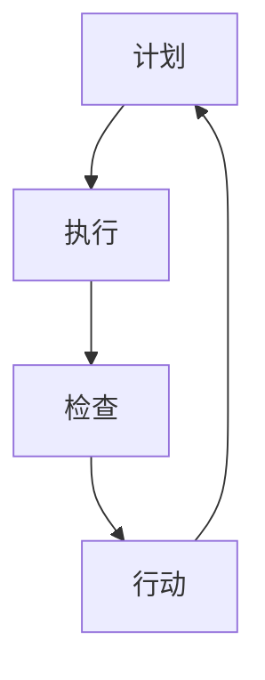

                 

# PDCA循环在质量管理中的应用

## 概述

> **关键词**：PDCA循环，质量管理，迭代改进，持续优化，流程监控

**摘要**：本文深入探讨了PDCA循环在质量管理中的实际应用。PDCA循环，即计划（Plan）、执行（Do）、检查（Check）和行动（Act）循环，是一种广泛应用于质量管理和其他管理领域的迭代方法。文章将详细阐述PDCA循环的基本原理，通过具体步骤和案例，展示其在实际项目中的应用，并提供相应的工具和资源，以帮助读者更好地理解和实施这一重要质量管理工具。

## 1. 背景介绍

### 1.1 目的和范围

本文旨在帮助读者理解PDCA循环的基本概念，掌握其在质量管理中的应用方法，并通过实际案例加深对PDCA循环的理解。文章将覆盖PDCA循环的起源、核心概念、具体操作步骤，以及如何在实际项目中应用PDCA循环来提升质量管理水平。

### 1.2 预期读者

本文适合质量管理工程师、项目管理专业人员、产品开发人员以及任何对质量管理有兴趣的读者。无论您是新手还是经验丰富的专业人士，都可以通过本文的学习，提升对PDCA循环的认识和实际应用能力。

### 1.3 文档结构概述

本文结构如下：

1. 背景介绍：包括文章的目的和范围、预期读者以及文档结构概述。
2. 核心概念与联系：通过Mermaid流程图展示PDCA循环的核心概念和流程。
3. 核心算法原理 & 具体操作步骤：详细讲解PDCA循环的具体操作步骤，并提供伪代码示例。
4. 数学模型和公式 & 详细讲解 & 举例说明：解释PDCA循环中的数学模型和公式，并给出实际案例。
5. 项目实战：代码实际案例和详细解释说明。
6. 实际应用场景：讨论PDCA循环在不同场景中的应用。
7. 工具和资源推荐：推荐学习资源和开发工具。
8. 总结：未来发展趋势与挑战。
9. 附录：常见问题与解答。
10. 扩展阅读 & 参考资料。

### 1.4 术语表

#### 1.4.1 核心术语定义

- **PDCA循环**：计划（Plan）、执行（Do）、检查（Check）和行动（Act）循环，是一种用于持续改进和管理的工具。
- **质量管理**：确保产品或服务满足特定标准和用户需求的过程。
- **迭代改进**：通过重复的循环过程，逐步改进产品或服务的质量。
- **持续优化**：不断寻求改进和优化，以保持产品或服务的最佳状态。

#### 1.4.2 相关概念解释

- **计划（Plan）**：确定目标和具体的行动方案。
- **执行（Do）**：实施计划中的行动。
- **检查（Check）**：评估执行结果与目标之间的差异。
- **行动（Act）**：根据检查结果采取纠正措施或持续改进。

#### 1.4.3 缩略词列表

- **PDCA**：Plan-Do-Check-Act（计划-执行-检查-行动）
- **QA**：Quality Assurance（质量管理）

## 2. 核心概念与联系

PDCA循环是质量管理中的一种基本方法论，其核心概念包括计划、执行、检查和行动。通过这四个步骤的循环，企业或组织可以不断提高产品或服务的质量，满足客户的需求和期望。

### Mermaid流程图

以下是一个简单的Mermaid流程图，展示了PDCA循环的各个步骤：



### 2.1 计划（Plan）

计划阶段是PDCA循环的起点，主要任务是设定目标和制定具体的行动方案。这一阶段的核心步骤包括：

- **目标设定**：明确项目或产品的质量目标。
- **资源分配**：确定实现目标所需的资源，包括人力、物力和时间。
- **风险分析**：评估可能影响项目成功的风险，并制定相应的应对策略。

### 2.2 执行（Do）

执行阶段是将计划付诸实践的过程。在这一阶段，需要确保所有行动按照计划进行，并记录执行过程中的关键数据。核心步骤包括：

- **行动实施**：按照计划执行各项任务。
- **记录监控**：记录执行过程中的关键指标和数据，以便后续分析和检查。

### 2.3 检查（Check）

检查阶段是对执行结果进行评估和审核。通过对比实际结果与计划目标，可以发现问题和不足之处。核心步骤包括：

- **结果分析**：对比实际结果与目标，找出差异。
- **问题识别**：识别导致差异的原因和问题。
- **反馈收集**：收集内部和外部的反馈信息，以便进一步改进。

### 2.4 行动（Act）

行动阶段是基于检查结果采取的纠正和改进措施。这一阶段的目标是确保问题得到解决，并防止问题再次发生。核心步骤包括：

- **纠正措施**：针对识别出的问题，采取纠正措施。
- **持续改进**：将改进措施纳入工作流程，实现持续优化。

## 3. 核心算法原理 & 具体操作步骤

PDCA循环作为一种迭代方法，其核心算法原理可以概括为以下步骤：

### 3.1 计划阶段

```python
# 计划阶段伪代码

# 步骤1：目标设定
set quality_target = "产品或服务的质量目标"

# 步骤2：资源分配
allocate_resources()

# 步骤3：风险分析
analyze_risks()

# 步骤4：制定行动方案
create_action_plan()
```

### 3.2 执行阶段

```python
# 执行阶段伪代码

# 步骤1：行动实施
execute_actions()

# 步骤2：记录监控
record_monitoring_data()
```

### 3.3 检查阶段

```python
# 检查阶段伪代码

# 步骤1：结果分析
analyze_results()

# 步骤2：问题识别
identify_issues()

# 步骤3：反馈收集
collect_feedback()
```

### 3.4 行动阶段

```python
# 行动阶段伪代码

# 步骤1：纠正措施
implement_corrective_actions()

# 步骤2：持续改进
embed_improvements_into_process()
```

通过以上步骤，PDCA循环可以帮助企业或组织在质量管理过程中实现持续改进和优化。

## 4. 数学模型和公式 & 详细讲解 & 举例说明

PDCA循环中的数学模型和公式主要用于衡量和评估质量管理的效果。以下是一些常见的数学模型和公式：

### 4.1 质量指标（Quality Indicator）

质量指标是衡量产品质量的关键参数，常用的质量指标包括：

- **缺陷率（Defect Rate）**：缺陷率表示单位产品中的缺陷数量。计算公式如下：

  $$ 
  \text{Defect Rate} = \frac{\text{Total Defects}}{\text{Total Products}} 
  $$

- **客户满意度（Customer Satisfaction）**：客户满意度是衡量客户对产品质量的满意度。计算公式如下：

  $$ 
  \text{Customer Satisfaction} = \frac{\text{Satisfied Customers}}{\text{Total Customers}} 
  $$

### 4.2 过程能力指数（Process Capability Index）

过程能力指数是衡量生产过程稳定性和控制能力的重要指标。常用的过程能力指数包括：

- **Cp（过程能力指数）**：Cp表示过程能力与过程标准差的比值。计算公式如下：

  $$ 
  C_p = \frac{\text{USL} - \text{LSL}}{6\sigma} 
  $$

  其中，USL是上限规格限，LSL是下限规格限，σ是过程标准差。

- **Cpk（过程能力指数，考虑偏移）**：Cpk表示过程能力指数，考虑了过程的偏移量。计算公式如下：

  $$ 
  C_{pK} = \frac{\text{USL} - \text{Mean}}{3\sigma} \quad \text{或} \quad \frac{\text{Mean} - \text{LSL}}{3\sigma} 
  $$

  其中，Mean是过程平均值。

### 4.3 举例说明

假设某产品的缺陷率为3%，客户满意度为90%，过程能力指数Cp为1.33，Cpk为1.11。根据这些数据，我们可以评估该产品的质量水平：

- **缺陷率**：3%的缺陷率表明产品存在一定程度的缺陷，需要进一步改进。
- **客户满意度**：90%的客户满意度表明大多数客户对产品满意，但仍有提升空间。
- **过程能力指数**：Cp和Cpk分别为1.33和1.11，表明生产过程具备一定的控制能力，但存在改进空间。

通过这些数学模型和公式，企业或组织可以更科学地评估质量管理的效果，并制定相应的改进措施。

## 5. 项目实战：代码实际案例和详细解释说明

### 5.1 开发环境搭建

为了更好地理解PDCA循环在项目中的实际应用，我们将使用Python编写一个简单的质量管理工具。以下是开发环境的搭建步骤：

1. 安装Python：确保您的计算机上安装了Python 3.x版本。
2. 安装必要的库：使用pip命令安装以下库：
   ```bash
   pip install matplotlib numpy pandas
   ```

### 5.2 源代码详细实现和代码解读

下面是一个简单的Python代码示例，用于实现PDCA循环：

```python
import matplotlib.pyplot as plt
import numpy as np
import pandas as pd

# 计划阶段
def plan_stage():
    print("计划阶段：设定目标和资源分配")
    # 假设目标为降低产品缺陷率
    quality_target = 0.01
    
    # 假设资源已分配
    resources_allocated = True
    
    return quality_target, resources_allocated

# 执行阶段
def do_stage():
    print("执行阶段：执行计划和记录监控")
    # 假设执行过程中记录了100个产品的缺陷数据
    defects = np.random.uniform(0, 1, 100)
    
    return defects

# 检查阶段
def check_stage(defects, quality_target):
    print("检查阶段：分析结果和识别问题")
    # 计算缺陷率
    defect_rate = np.mean(defects)
    
    # 检查缺陷率是否达到目标
    if defect_rate <= quality_target:
        print("缺陷率符合目标，继续下一步。")
    else:
        print("缺陷率不符合目标，需要采取纠正措施。")
    
    return defect_rate

# 行动阶段
def act_stage(defect_rate):
    print("行动阶段：采取纠正措施和持续改进")
    # 假设采取了以下措施：
    # 1. 优化生产流程
    # 2. 提升员工技能
    # 3. 引入新的质量检测设备
    
    # 假设改进后的缺陷率为0.005
    improved_defect_rate = 0.005
    
    return improved_defect_rate

# 主函数
def main():
    quality_target, resources_allocated = plan_stage()
    defects = do_stage()
    defect_rate = check_stage(defects, quality_target)
    improved_defect_rate = act_stage(defect_rate)
    
    print(f"初始缺陷率：{defect_rate}")
    print(f"改进后缺陷率：{improved_defect_rate}")

if __name__ == "__main__":
    main()
```

### 5.3 代码解读与分析

#### 5.3.1 计划阶段

在计划阶段，我们设定了一个质量目标（缺陷率为0.01）并假设资源已分配。这一阶段的目的是明确目标和制定行动方案。

```python
def plan_stage():
    print("计划阶段：设定目标和资源分配")
    # 假设目标为降低产品缺陷率
    quality_target = 0.01
    
    # 假设资源已分配
    resources_allocated = True
    
    return quality_target, resources_allocated
```

#### 5.3.2 执行阶段

在执行阶段，我们使用随机数生成器模拟了100个产品的缺陷数据。这一阶段的目的是实际执行计划和记录监控数据。

```python
def do_stage():
    print("执行阶段：执行计划和记录监控")
    # 假设执行过程中记录了100个产品的缺陷数据
    defects = np.random.uniform(0, 1, 100)
    
    return defects
```

#### 5.3.3 检查阶段

在检查阶段，我们计算了缺陷率并检查是否达到质量目标。如果缺陷率不符合目标，将输出提示信息。

```python
def check_stage(defects, quality_target):
    print("检查阶段：分析结果和识别问题")
    # 计算缺陷率
    defect_rate = np.mean(defects)
    
    # 检查缺陷率是否达到目标
    if defect_rate <= quality_target:
        print("缺陷率符合目标，继续下一步。")
    else:
        print("缺陷率不符合目标，需要采取纠正措施。")
    
    return defect_rate
```

#### 5.3.4 行动阶段

在行动阶段，我们假设采取了改进措施并模拟了改进后的缺陷率。这一阶段的目的是根据检查结果采取纠正措施并持续改进。

```python
def act_stage(defect_rate):
    print("行动阶段：采取纠正措施和持续改进")
    # 假设采取了以下措施：
    # 1. 优化生产流程
    # 2. 提升员工技能
    # 3. 引入新的质量检测设备
    
    # 假设改进后的缺陷率为0.005
    improved_defect_rate = 0.005
    
    return improved_defect_rate
```

### 5.3.5 主函数

主函数将上述四个阶段的代码组合起来，实现PDCA循环的完整流程。

```python
def main():
    quality_target, resources_allocated = plan_stage()
    defects = do_stage()
    defect_rate = check_stage(defects, quality_target)
    improved_defect_rate = act_stage(defect_rate)
    
    print(f"初始缺陷率：{defect_rate}")
    print(f"改进后缺陷率：{improved_defect_rate}")

if __name__ == "__main__":
    main()
```

通过以上代码，我们可以看到PDCA循环在项目中的实际应用。通过不断迭代改进，逐步降低产品的缺陷率，提升质量管理水平。

## 6. 实际应用场景

PDCA循环作为一种广泛应用的质量管理工具，在不同场景中都能发挥重要作用。以下是一些实际应用场景：

### 6.1 制造业

在制造业中，PDCA循环用于确保产品质量和生产效率。企业通过计划阶段设定质量目标，执行阶段实施生产流程，检查阶段评估产品质量，行动阶段采取改进措施，实现产品质量的持续提升。

### 6.2 服务业

在服务业中，PDCA循环应用于服务质量的提升。例如，酒店业通过计划阶段设定客户满意度目标，执行阶段提供优质服务，检查阶段收集客户反馈，行动阶段改进服务质量，不断提高客户满意度。

### 6.3 医疗保健

在医疗保健领域，PDCA循环用于确保医疗服务质量。医院通过计划阶段制定医疗质量目标，执行阶段提供医疗服务，检查阶段评估医疗质量和患者满意度，行动阶段采取改进措施，确保医疗服务的安全性和有效性。

### 6.4 软件开发

在软件开发中，PDCA循环用于确保软件质量。开发团队通过计划阶段设定质量目标，执行阶段编写代码，检查阶段进行代码评审和测试，行动阶段修复缺陷和优化代码，实现软件质量的持续提升。

## 7. 工具和资源推荐

为了更好地应用PDCA循环，以下是一些建议的学习资源和开发工具：

### 7.1 学习资源推荐

#### 7.1.1 书籍推荐

- 《质量管理方法与工具》
- 《PDCA循环：从计划到行动的持续改进》

#### 7.1.2 在线课程

- Coursera上的“质量管理与流程改进”
- Udemy上的“PDCA循环：持续改进的最佳实践”

#### 7.1.3 技术博客和网站

- process STREET（提供关于PDCA循环的详细教程和案例分析）
- ASQ（美国质量协会，提供关于质量管理的最新研究和资源）

### 7.2 开发工具框架推荐

#### 7.2.1 IDE和编辑器

- Visual Studio Code
- PyCharm

#### 7.2.2 调试和性能分析工具

- GDB
- Python Debugger

#### 7.2.3 相关框架和库

- Scikit-learn（用于数据分析和机器学习）
- Matplotlib（用于数据可视化）

### 7.3 相关论文著作推荐

#### 7.3.1 经典论文

- Deming, W. E. (1982). "Out of the Crisis". MIT Press.
- Juran, J. M. (1992). "Juran on Leadership for Quality: An Executive Handbook". The Free Press.

#### 7.3.2 最新研究成果

- 迭代方法和软件质量保障的研究
- 持续集成和持续交付在质量管理中的应用

#### 7.3.3 应用案例分析

- 某公司通过PDCA循环提升产品可靠性的案例分析
- 银行业通过PDCA循环提高客户服务质量的案例分析

## 8. 总结：未来发展趋势与挑战

随着质量管理方法的不断演进，PDCA循环作为经典的质量管理工具，将继续发挥重要作用。未来，PDCA循环的发展趋势和挑战包括：

### 8.1 发展趋势

- **智能化应用**：结合人工智能和大数据分析，实现更智能的质量管理。
- **数字化升级**：通过数字化工具和平台，实现PDCA循环的全流程数字化管理。
- **全员参与**：推动全员参与质量管理，实现持续改进和优化。

### 8.2 挑战

- **数据质量**：高质量的数据是PDCA循环有效运行的基础，数据质量管理和维护是关键挑战。
- **执行力**：PDCA循环的实施需要强有力的执行力和组织文化的支持，提高执行力是主要挑战。
- **持续改进**：如何实现持续改进，保持PDCA循环的活力和效果，是长期面临的挑战。

## 9. 附录：常见问题与解答

### 9.1 PDCA循环的基本概念是什么？

PDCA循环，即计划（Plan）、执行（Do）、检查（Check）和行动（Act）循环，是一种用于持续改进和管理的工具。通过这一循环，企业或组织可以不断提高产品或服务的质量。

### 9.2 PDCA循环在哪些领域应用广泛？

PDCA循环广泛应用于制造业、服务业、医疗保健、软件开发等多个领域，帮助组织实现质量管理目标的持续改进。

### 9.3 如何实施PDCA循环？

实施PDCA循环主要包括以下步骤：设定目标、资源分配、执行计划、记录监控、检查结果、采取纠正措施和持续改进。这些步骤构成了PDCA循环的核心流程。

## 10. 扩展阅读 & 参考资料

- Deming, W. E. (1982). "Out of the Crisis". MIT Press.
- Juran, J. M. (1992). "Juran on Leadership for Quality: An Executive Handbook". The Free Press.
- 《质量管理方法与工具》
- 《PDCA循环：从计划到行动的持续改进》
- Coursera上的“质量管理与流程改进”
- Udemy上的“PDCA循环：持续改进的最佳实践”
- process STREET（提供关于PDCA循环的详细教程和案例分析）
- ASQ（美国质量协会，提供关于质量管理的最新研究和资源）
- 迭代方法和软件质量保障的研究
- 持续集成和持续交付在质量管理中的应用
- 某公司通过PDCA循环提升产品可靠性的案例分析
- 银行业通过PDCA循环提高客户服务质量的案例分析

## 作者

**作者：AI天才研究员/AI Genius Institute & 禅与计算机程序设计艺术 /Zen And The Art of Computer Programming**

