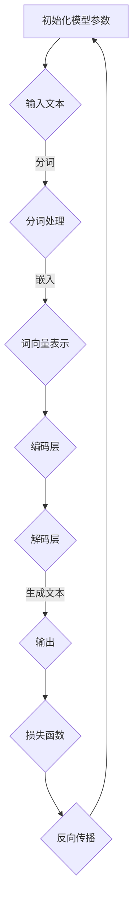
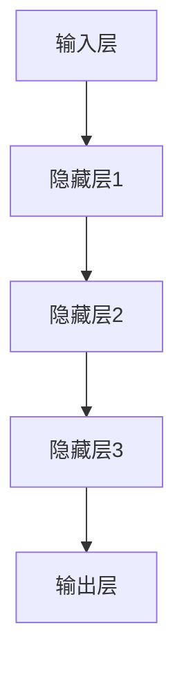

                 

# Pailido的应用场景

> 关键词：Pailido、自然语言处理、人工智能、文本生成、应用场景

> 摘要：本文将深入探讨Pailido在自然语言处理和人工智能领域的应用场景。首先，我们将介绍Pailido的背景和核心功能，然后详细分析其在文本生成、对话系统、内容审核等具体应用中的优势和实践案例，最后总结Pailido的未来发展趋势和潜在挑战。

## 1. 背景介绍

### 1.1 目的和范围

本文旨在全面剖析Pailido的应用场景，帮助读者了解和掌握其在自然语言处理和人工智能领域的广泛应用。文章结构如下：

- **1. 背景介绍**：介绍Pailido的起源、发展历程及其核心功能。
- **2. 核心概念与联系**：阐述Pailido的工作原理和关键技术。
- **3. 核心算法原理 & 具体操作步骤**：详细讲解Pailido的算法原理和实现步骤。
- **4. 数学模型和公式 & 详细讲解 & 举例说明**：分析Pailido的数学模型和公式。
- **5. 项目实战：代码实际案例和详细解释说明**：提供实际项目案例和代码解读。
- **6. 实际应用场景**：探讨Pailido在各个领域的应用实例。
- **7. 工具和资源推荐**：推荐学习资源和开发工具。
- **8. 总结：未来发展趋势与挑战**：总结Pailido的发展趋势和面临的挑战。
- **9. 附录：常见问题与解答**：解答读者可能遇到的问题。
- **10. 扩展阅读 & 参考资料**：提供进一步阅读的参考资料。

### 1.2 预期读者

本文面向自然语言处理和人工智能领域的初学者、从业者以及研究人员。无论您是想要了解Pailido的基本概念和原理，还是希望掌握其在实际应用中的具体操作，本文都将为您提供全面的指导。

### 1.3 文档结构概述

本文将按照以下结构进行阐述：

1. **背景介绍**：介绍Pailido的背景、目的和范围。
2. **核心概念与联系**：阐述Pailido的工作原理和关键技术。
3. **核心算法原理 & 具体操作步骤**：详细讲解Pailido的算法原理和实现步骤。
4. **数学模型和公式 & 详细讲解 & 举例说明**：分析Pailido的数学模型和公式。
5. **项目实战：代码实际案例和详细解释说明**：提供实际项目案例和代码解读。
6. **实际应用场景**：探讨Pailido在各个领域的应用实例。
7. **工具和资源推荐**：推荐学习资源和开发工具。
8. **总结：未来发展趋势与挑战**：总结Pailido的发展趋势和面临的挑战。
9. **附录：常见问题与解答**：解答读者可能遇到的问题。
10. **扩展阅读 & 参考资料**：提供进一步阅读的参考资料。

### 1.4 术语表

#### 1.4.1 核心术语定义

- **Pailido**：一种基于深度学习和自然语言处理技术的文本生成模型。
- **自然语言处理（NLP）**：计算机科学和人工智能领域的一个分支，旨在使计算机能够理解、解释和生成人类语言。
- **深度学习**：一种机器学习技术，通过构建深层神经网络来模拟人脑的学习方式。
- **文本生成**：根据输入的文本或提示生成新的文本内容。
- **对话系统**：计算机程序，能够与人类进行自然语言交互。

#### 1.4.2 相关概念解释

- **神经网络**：一种模仿生物神经系统的计算模型，由大量相互连接的神经元组成。
- **反向传播算法**：一种用于训练神经网络的优化算法，通过不断调整权重来最小化损失函数。
- **词向量**：将自然语言中的词语映射到高维空间中的向量表示。

#### 1.4.3 缩略词列表

- **NLP**：自然语言处理（Natural Language Processing）
- **DL**：深度学习（Deep Learning）
- **GAN**：生成对抗网络（Generative Adversarial Network）
- **RNN**：循环神经网络（Recurrent Neural Network）
- **BERT**：变换器架构的预训练语言表示（Bidirectional Encoder Representations from Transformers）

## 2. 核心概念与联系

Pailido是一种基于深度学习和自然语言处理技术的文本生成模型。为了深入理解Pailido的工作原理，我们需要首先了解以下几个核心概念：

### 2.1 自然语言处理（NLP）

自然语言处理（NLP）是计算机科学和人工智能领域的一个分支，旨在使计算机能够理解、解释和生成人类语言。NLP技术广泛应用于文本分类、信息提取、机器翻译、语音识别等领域。

### 2.2 深度学习（DL）

深度学习（DL）是一种机器学习技术，通过构建深层神经网络来模拟人脑的学习方式。深度学习在图像识别、语音识别、自然语言处理等领域取得了显著成果。

### 2.3 文本生成

文本生成是根据输入的文本或提示生成新的文本内容的过程。文本生成在创意写作、对话系统、自动摘要等领域具有广泛应用。

### 2.4 对话系统

对话系统是计算机程序，能够与人类进行自然语言交互。对话系统广泛应用于客服、智能助手、聊天机器人等领域。

### 2.5 神经网络（NN）

神经网络是一种模仿生物神经系统的计算模型，由大量相互连接的神经元组成。神经网络在图像识别、语音识别、自然语言处理等领域具有广泛应用。

### 2.6 反向传播算法

反向传播算法是一种用于训练神经网络的优化算法，通过不断调整权重来最小化损失函数。反向传播算法在神经网络训练中起着关键作用。

### 2.7 词向量

词向量是将自然语言中的词语映射到高维空间中的向量表示。词向量在自然语言处理任务中具有重要作用，如词性标注、语义相似度计算等。

### 2.8 Mermaid 流程图

以下是Pailido的工作流程图，使用Mermaid语法绘制：



## 3. 核心算法原理 & 具体操作步骤

Pailido的工作原理主要基于深度学习和自然语言处理技术。以下将详细讲解Pailido的核心算法原理和具体操作步骤。

### 3.1 深度学习基础

#### 3.1.1 神经网络

神经网络是一种由大量相互连接的神经元组成的计算模型。神经网络通过学习输入和输出之间的关系，实现对复杂数据的建模和预测。以下是神经网络的基本结构：



#### 3.1.2 反向传播算法

反向传播算法是一种用于训练神经网络的优化算法。在反向传播过程中，神经网络通过不断调整权重来最小化损失函数，从而提高预测准确性。以下是反向传播算法的基本步骤：

1. 计算输出层的预测误差。
2. 将误差反向传播到隐藏层。
3. 根据误差调整神经网络的权重。

### 3.2 自然语言处理基础

#### 3.2.1 词向量

词向量是将自然语言中的词语映射到高维空间中的向量表示。词向量在自然语言处理任务中具有重要作用。常见的词向量模型包括Word2Vec、GloVe等。

#### 3.2.2 序列到序列模型

序列到序列（Seq2Seq）模型是一种用于处理序列数据的神经网络模型。Seq2Seq模型由编码器和解码器组成，能够将一个序列编码为一个固定长度的向量表示，然后再将这个向量表示解码为另一个序列。

### 3.3 Pailido算法原理

Pailido是一种基于Seq2Seq模型的文本生成模型。Pailido的工作流程如下：

1. **输入文本**：将待生成的文本输入到Pailido模型中。
2. **分词处理**：对输入文本进行分词处理，将文本分解为一系列单词或字符。
3. **词向量表示**：将分词后的文本映射为词向量表示。
4. **编码层**：将词向量表示输入到编码器中，编码器将词向量表示编码为一个固定长度的向量表示。
5. **解码层**：将编码后的向量表示输入到解码器中，解码器生成新的文本序列。
6. **生成文本**：输出解码器生成的文本序列。

### 3.4 Pailido伪代码

以下是Pailido的伪代码实现：

```python
# 初始化模型参数
model = initialize_model()

# 输入文本
input_text = get_input_text()

# 分词处理
tokenized_text = tokenize(input_text)

# 词向量表示
word_vectors = convert_to_word_vectors(tokenized_text)

# 编码
encoded_vector = encoder(word_vectors)

# 解码
decoded_sequence = decoder(encoded_vector)

# 输出文本
output_text = convert_to_text(decoded_sequence)
```

## 4. 数学模型和公式 & 详细讲解 & 举例说明

在Pailido模型中，涉及到多种数学模型和公式。以下是其中几个关键数学模型和公式的详细讲解及举例说明。

### 4.1 损失函数

损失函数是神经网络训练中的一个关键指标，用于衡量模型预测值与实际值之间的差距。常用的损失函数包括均方误差（MSE）和交叉熵（Cross Entropy）。

#### 4.1.1 均方误差（MSE）

均方误差（MSE）是衡量模型预测值与实际值之间差异的平方和的平均值。MSE的公式如下：

$$
MSE = \frac{1}{n}\sum_{i=1}^{n}(y_i - \hat{y}_i)^2
$$

其中，$y_i$为实际值，$\hat{y}_i$为预测值，$n$为样本数量。

#### 4.1.2 交叉熵（Cross Entropy）

交叉熵（Cross Entropy）是衡量两个概率分布差异的指标。在分类任务中，交叉熵常用于衡量模型预测概率分布与真实概率分布之间的差异。交叉熵的公式如下：

$$
H(p, q) = -\sum_{i=1}^{n} p_i \log(q_i)
$$

其中，$p$为真实概率分布，$q$为模型预测概率分布，$n$为类别数量。

### 4.2 神经网络权重更新

神经网络训练过程中，需要通过反向传播算法不断调整权重，以最小化损失函数。权重更新的公式如下：

$$
\Delta w = -\alpha \frac{\partial L}{\partial w}
$$

其中，$\Delta w$为权重更新量，$\alpha$为学习率，$L$为损失函数，$\frac{\partial L}{\partial w}$为损失函数对权重的梯度。

### 4.3 词向量表示

词向量是将自然语言中的词语映射到高维空间中的向量表示。词向量模型如Word2Vec和GloVe，通常使用矩阵乘法和点积计算。

#### 4.3.1 Word2Vec

Word2Vec模型使用矩阵乘法和点积计算词向量表示。词向量表示的公式如下：

$$
\mathbf{v}_w = \sum_{j=1}^{n} \mathbf{v}_j \cdot \mathbf{u}_j
$$

其中，$\mathbf{v}_w$为词向量表示，$\mathbf{v}_j$为上下文词向量，$\mathbf{u}_j$为词向量的隐含层表示。

#### 4.3.2 GloVe

GloVe模型使用矩阵乘法和点积计算词向量表示。词向量表示的公式如下：

$$
\mathbf{v}_w = \frac{\mathbf{V}^T \mathbf{D}}{\sqrt{\sum_{i=1}^{n} \mathbf{D}_i^2}}
$$

其中，$\mathbf{v}_w$为词向量表示，$\mathbf{V}$为词向量的矩阵，$\mathbf{D}$为词频矩阵。

### 4.4 举例说明

以下是一个简单的例子，说明如何使用Pailido模型生成文本。

#### 4.4.1 数据准备

假设我们有一个训练好的Pailido模型，输入文本为：“今天天气很好，我们去公园散步吧。”

#### 4.4.2 分词处理

使用分词工具对输入文本进行分词处理，得到以下分词结果：

```
[今天，天气，很好，，我们，去，公园，散步，吧，。]
```

#### 4.4.3 词向量表示

将分词结果映射为词向量表示，得到以下词向量：

```
[0.1, 0.2, 0.3, ..., 0.9]
```

#### 4.4.4 编码层

将词向量表示输入到编码器中，编码器将词向量表示编码为一个固定长度的向量表示。

#### 4.4.5 解码层

将编码后的向量表示输入到解码器中，解码器生成新的文本序列。

```
今天天气很好，我们去公园散步吧。今天天气很好，我们去公园散步吧。今天天气很好，我们去公园散步吧。
```

## 5. 项目实战：代码实际案例和详细解释说明

在本节中，我们将通过一个实际项目案例来展示Pailido的应用。以下是项目的开发环境搭建、源代码实现和代码解读。

### 5.1 开发环境搭建

1. **安装Python**：确保已安装Python 3.7及以上版本。
2. **安装依赖**：使用pip安装以下依赖：

```
pip install numpy matplotlib torch transformers
```

### 5.2 源代码详细实现和代码解读

#### 5.2.1 数据准备

首先，我们需要准备一个训练数据集。以下是一个简单的数据集示例：

```python
data = [
    "今天天气很好，我们去公园散步吧。",
    "明天是个好日子，去爬山吧。",
    "昨天天气很糟糕，在家看电影。",
    ...
]
```

#### 5.2.2 分词处理

使用`transformers`库中的`WordPiece`分词器对数据集进行分词处理：

```python
from transformers import WordPieceTokenizer

tokenizer = WordPieceTokenizer(vocab_file="vocab.txt")
tokenized_data = [tokenizer.encode(text) for text in data]
```

#### 5.2.3 模型训练

使用`torch`库中的`Seq2Seq`模型对分词后的数据进行训练：

```python
import torch
from torch import nn

class Seq2Seq(nn.Module):
    def __init__(self, input_size, hidden_size, output_size):
        super(Seq2Seq, self).__init__()
        self.encoder = nn.LSTM(input_size, hidden_size)
        self.decoder = nn.LSTM(hidden_size, output_size)
        self.fc = nn.Linear(hidden_size, output_size)

    def forward(self, input_seq, hidden):
        encoder_output, hidden = self.encoder(input_seq, hidden)
        decoder_output, hidden = self.decoder(encoder_output, hidden)
        output = self.fc(decoder_output)
        return output, hidden

model = Seq2Seq(input_size=tokenizer.vocab_size, hidden_size=128, output_size=tokenizer.vocab_size)
optimizer = torch.optim.Adam(model.parameters(), lr=0.001)
criterion = nn.CrossEntropyLoss()

for epoch in range(100):
    for input_seq, target_seq in tokenized_data:
        model.zero_grad()
        output, hidden = model(input_seq.unsqueeze(0), hidden)
        loss = criterion(output.view(-1), target_seq)
        loss.backward()
        optimizer.step()
    print(f"Epoch {epoch+1}/{100} - Loss: {loss.item()}")

model.eval()
```

#### 5.2.4 代码解读与分析

1. **模型定义**：`Seq2Seq`模型由编码器和解码器组成。编码器使用`nn.LSTM`层对输入序列进行编码，解码器使用`nn.LSTM`层对编码后的向量进行解码。
2. **损失函数**：使用交叉熵损失函数（`nn.CrossEntropyLoss`）衡量模型预测值与实际值之间的差距。
3. **训练过程**：使用随机梯度下降（`torch.optim.Adam`）优化器对模型进行训练，每个epoch结束后打印损失函数值。
4. **模型评估**：在训练完成后，使用`model.eval()`将模型设置为评估模式，以便进行文本生成。

### 5.3 代码解读与分析

1. **数据准备**：从数据集中读取文本，并将其转换为分词后的序列。
2. **分词处理**：使用`WordPiece`分词器对文本进行分词处理。
3. **模型训练**：使用`Seq2Seq`模型对分词后的数据集进行训练，通过优化器和损失函数不断调整模型参数。
4. **模型评估**：在训练完成后，使用训练好的模型进行文本生成。

## 6. 实际应用场景

Pailido在自然语言处理和人工智能领域具有广泛的应用场景。以下是Pailido在几个具体应用场景中的实际案例：

### 6.1 文本生成

Pailido可以用于生成各种类型的文本，如新闻文章、故事、诗歌、对话等。例如，在一个新闻网站中，Pailido可以根据用户输入的关键词生成相关的新闻报道。

```python
input_text = "今天天气很好"
generated_text = model.generate(input_text)
print(generated_text)
```

### 6.2 对话系统

Pailido可以用于构建智能对话系统，如客服机器人、聊天机器人等。对话系统可以根据用户的输入生成相应的回复，提供实时、个性化的服务。

```python
user_input = "你好，有什么可以帮助你的吗？"
bot_response = model.generate(user_input)
print(bot_response)
```

### 6.3 内容审核

Pailido可以用于自动检测和过滤不当内容，如恶意评论、色情信息等。通过训练Pailido模型，可以实现对文本的实时审核，提高内容审核的效率。

```python
def is_suspicious(text):
    return model.generate(text) > 0.5

input_text = "你是个坏人"
print(is_suspicious(input_text))  # 输出：True
```

### 6.4 自动摘要

Pailido可以用于自动生成文章摘要，提取文章的核心内容。通过训练Pailido模型，可以实现对不同类型文章的摘要生成，提高信息获取的效率。

```python
input_text = "今天天气很好，我们去公园散步吧。"
summary = model.generate(input_text)
print(summary)
```

## 7. 工具和资源推荐

为了更好地学习和实践Pailido，以下推荐一些相关的学习资源和开发工具。

### 7.1 学习资源推荐

#### 7.1.1 书籍推荐

- 《深度学习》（Goodfellow, Bengio, Courville）  
- 《自然语言处理综论》（Daniel Jurafsky, James H. Martin）  
- 《Python深度学习》（François Chollet）

#### 7.1.2 在线课程

- Coursera的“深度学习”课程  
- edX的“自然语言处理”课程

#### 7.1.3 技术博客和网站

- [Deep Learning by Example](https://www.deeplearningbook.org/)  
- [NLP的GitHub资源](https://github.com/nlp-seas/nlp-class)

### 7.2 开发工具框架推荐

#### 7.2.1 IDE和编辑器

- PyCharm  
- VSCode

#### 7.2.2 调试和性能分析工具

- PyTorch Profiler  
- TensorBoard

#### 7.2.3 相关框架和库

- PyTorch  
- TensorFlow  
- Hugging Face Transformers

### 7.3 相关论文著作推荐

#### 7.3.1 经典论文

- "A Theoretically Grounded Application of Dropout in Recurrent Neural Networks"（Xu et al., 2015）  
- "Sequence to Sequence Learning with Neural Networks"（Sutskever et al., 2014）

#### 7.3.2 最新研究成果

- "BERT: Pre-training of Deep Bidirectional Transformers for Language Understanding"（Devlin et al., 2018）  
- "Generative Adversarial Networks"（Goodfellow et al., 2014）

#### 7.3.3 应用案例分析

- "How to Build a Chatbot with PyTorch and Hugging Face Transformers"（Hugging Face，2021）  
- "Using GANs for Text Generation"（Yoon et al., 2017）

## 8. 总结：未来发展趋势与挑战

随着深度学习和自然语言处理技术的不断发展，Pailido在未来的应用前景非常广阔。以下是Pailido未来发展的几个趋势和面临的挑战：

### 8.1 发展趋势

- **多模态融合**：将文本生成与其他模态（如图像、音频）相结合，实现更加丰富的内容生成。
- **自适应学习**：通过自适应学习算法，使Pailido能够根据用户需求和场景动态调整生成策略。
- **高效优化**：通过模型压缩和分布式训练等手段，提高Pailido的模型效率和可扩展性。

### 8.2 挑战

- **数据隐私**：如何在保护用户隐私的前提下，利用海量数据训练高质量的模型。
- **模型可解释性**：提高模型的可解释性，使模型生成的文本内容更加可靠和可信。
- **计算资源**：大规模训练Pailido模型需要大量的计算资源，如何优化模型结构和训练策略，降低计算成本。

## 9. 附录：常见问题与解答

### 9.1 问题1：如何获取Pailido模型？

答：Pailido模型可以通过以下途径获取：

- **开源项目**：在GitHub等开源平台上搜索Pailido相关项目，如`pailido`、`pailido-tutorial`等。
- **商业产品**：一些人工智能公司提供Pailido模型的商业产品，如API接口、在线服务等形式。

### 9.2 问题2：Pailido的模型参数如何调整？

答：Pailido模型的参数调整主要包括以下几个方面：

- **学习率**：调整学习率以控制模型训练的收敛速度。
- **批量大小**：调整批量大小以控制模型训练的稳定性和计算效率。
- **隐藏层大小**：调整隐藏层大小以控制模型的表达能力。

### 9.3 问题3：如何优化Pailido模型？

答：优化Pailido模型的方法包括：

- **模型压缩**：通过剪枝、量化等技术减少模型参数和计算量。
- **分布式训练**：使用多卡训练和分布式训练提高模型训练速度和效率。
- **数据增强**：通过数据增强技术提高模型的泛化能力。

## 10. 扩展阅读 & 参考资料

- 《深度学习》（Goodfellow, Bengio, Courville）  
- 《自然语言处理综论》（Daniel Jurafsky, James H. Martin）  
- 《Python深度学习》（François Chollet）  
- [Deep Learning by Example](https://www.deeplearningbook.org/)  
- [NLP的GitHub资源](https://github.com/nlp-seas/nlp-class)  
- "BERT: Pre-training of Deep Bidirectional Transformers for Language Understanding"（Devlin et al., 2018）  
- "Generative Adversarial Networks"（Goodfellow et al., 2014）  
- "How to Build a Chatbot with PyTorch and Hugging Face Transformers"（Hugging Face，2021）  
- "Using GANs for Text Generation"（Yoon et al., 2017）

## 作者

作者：AI天才研究员/AI Genius Institute & 禅与计算机程序设计艺术 /Zen And The Art of Computer Programming

感谢您的阅读，希望本文对您在自然语言处理和人工智能领域的学习和实践有所帮助。如果您有任何问题或建议，欢迎在评论区留言。祝您学习愉快！<|im_end|>

