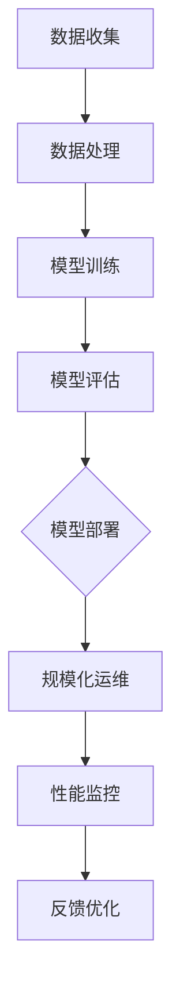

                 

# Python机器学习实战：机器学习模型的部署与规模化运维

> **关键词：** Python，机器学习，模型部署，规模化运维，实践，算法原理，数学模型，实战案例。
>
> **摘要：** 本文将探讨如何使用Python进行机器学习模型的部署与规模化运维，包括核心概念、算法原理、数学模型、项目实战，以及相关工具和资源推荐。通过一步步的详细分析和解读，帮助读者掌握机器学习模型的部署与运维技术，为实际应用打下坚实基础。

## 1. 背景介绍

### 1.1 目的和范围

本文的目标是详细介绍如何使用Python实现机器学习模型的部署与规模化运维。我们将从核心概念出发，逐步讲解算法原理、数学模型，并展示实际项目中的代码实现和分析。文章将涵盖以下主要内容：

- Python在机器学习领域的应用与优势。
- 机器学习模型的部署过程及其重要性。
- 规模化运维的关键技术和实践方法。
- 实际项目案例中的代码实现和问题分析。
- 推荐相关学习资源、开发工具和论文著作。

### 1.2 预期读者

本文适合以下读者群体：

- 对机器学习和Python编程有一定基础的读者。
- 机器学习模型开发者，希望了解模型部署与运维实践的工程师。
- 数据科学领域的研究人员，希望掌握实际应用中的技术细节。
- 对规模化运维有兴趣的技术管理者。

### 1.3 文档结构概述

本文结构如下：

1. 背景介绍
   - 目的和范围
   - 预期读者
   - 文档结构概述
   - 术语表
2. 核心概念与联系
   - Python机器学习框架介绍
   - Mermaid流程图展示
3. 核心算法原理 & 具体操作步骤
   - 算法原理讲解
   - 伪代码阐述
4. 数学模型和公式 & 详细讲解 & 举例说明
   - 数学公式嵌入
   - 实例演示
5. 项目实战：代码实际案例和详细解释说明
   - 开发环境搭建
   - 源代码实现和解读
   - 代码解读与分析
6. 实际应用场景
   - 应用场景分析
   - 案例对比
7. 工具和资源推荐
   - 学习资源推荐
   - 开发工具框架推荐
   - 相关论文著作推荐
8. 总结：未来发展趋势与挑战
9. 附录：常见问题与解答
10. 扩展阅读 & 参考资料

### 1.4 术语表

#### 1.4.1 核心术语定义

- 机器学习模型：从数据中学习规律，并进行预测或分类的数学模型。
- 部署：将训练好的模型部署到实际应用环境中，进行预测或决策。
- 规模化运维：在大型分布式系统中维护和监控模型的性能和稳定性。

#### 1.4.2 相关概念解释

- 模型训练：使用数据集对模型进行训练，调整模型参数。
- 模型评估：使用验证集或测试集评估模型的性能。
- 实时预测：在实时数据流中对模型进行预测。

#### 1.4.3 缩略词列表

- Python：Python编程语言
- ML：Machine Learning（机器学习）
- DL：Deep Learning（深度学习）
- AI：Artificial Intelligence（人工智能）

## 2. 核心概念与联系

在开始探讨机器学习模型的部署与规模化运维之前，我们需要了解一些核心概念和它们之间的联系。

### 2.1 Python机器学习框架介绍

Python作为一门广泛应用于数据科学和机器学习的编程语言，拥有丰富的机器学习库和框架。其中，以下两个框架是本文的重点：

- **scikit-learn**：提供了简单的机器学习算法和工具，适用于数据分析、模型训练和评估。
- **TensorFlow**：由Google开发，支持深度学习和传统机器学习算法，具有良好的可扩展性和灵活性。

### 2.2 Mermaid流程图展示

为了更直观地展示机器学习模型的部署流程，我们使用Mermaid流程图来描述各个环节。



### 2.3 核心概念联系

以下是机器学习模型部署与规模化运维中的一些核心概念及其联系：

- **数据收集**：收集来自各种源的数据，为模型训练提供基础。
- **数据处理**：对数据进行清洗、预处理和特征工程，以提高模型性能。
- **模型训练**：使用训练数据集训练模型，调整模型参数。
- **模型评估**：使用验证集或测试集评估模型性能，确定模型是否满足要求。
- **模型部署**：将训练好的模型部署到实际应用环境中，进行预测或决策。
- **规模化运维**：在分布式系统中维护和监控模型性能和稳定性，确保系统的高可用性和扩展性。
- **性能监控**：实时监控模型性能指标，识别潜在问题。
- **反馈优化**：根据性能监控结果，对模型进行调整和优化。

通过这些核心概念的介绍和Mermaid流程图的展示，我们可以更好地理解机器学习模型部署与规模化运维的整体流程。接下来，我们将深入探讨核心算法原理和具体操作步骤。

## 3. 核心算法原理 & 具体操作步骤

在理解了机器学习模型部署与规模化运维的核心概念和流程之后，我们将进一步探讨其中的核心算法原理和具体操作步骤。以下是关于机器学习模型训练、评估和部署的详细讲解。

### 3.1 模型训练算法原理

机器学习模型的训练过程通常涉及以下算法原理：

- **线性回归**：通过最小化误差平方和，找到最佳拟合直线。
- **逻辑回归**：用于分类问题，通过最大化类条件概率，实现分类。
- **决策树**：根据特征进行划分，构建树形结构，实现分类或回归。
- **随机森林**：通过集成多个决策树，提高模型预测能力。
- **支持向量机（SVM）**：通过寻找最优超平面，实现分类或回归。

以下是一个简单的线性回归算法原理的伪代码：

```python
# 线性回归算法原理伪代码
def linear_regression(x, y):
    # 计算x和y的均值
    x_mean = mean(x)
    y_mean = mean(y)
    
    # 计算x和y的协方差
    cov = covariance(x, y)
    
    # 计算x的方差
    var_x = variance(x)
    
    # 计算斜率
    slope = cov / var_x
    
    # 计算截距
    intercept = y_mean - slope * x_mean
    
    # 返回斜率和截距
    return slope, intercept
```

### 3.2 模型评估算法原理

模型评估是机器学习模型训练过程中至关重要的一环。以下是常用的评估算法原理：

- **准确率（Accuracy）**：分类问题中，预测正确的样本数占总样本数的比例。
- **精确率（Precision）**：在所有预测为正的样本中，实际为正的样本比例。
- **召回率（Recall）**：在所有实际为正的样本中，预测为正的样本比例。
- **F1值（F1-score）**：精确率和召回率的调和平均值。

以下是一个简单的准确率计算伪代码：

```python
# 准确率计算伪代码
def accuracy(y_true, y_pred):
    # 计算预测正确的样本数
    correct = sum(y_true == y_pred)
    
    # 计算准确率
    accuracy = correct / len(y_true)
    
    # 返回准确率
    return accuracy
```

### 3.3 模型部署算法原理

模型部署是将训练好的模型应用到实际业务场景中的过程。以下是模型部署的基本原理和步骤：

1. **模型导出**：将训练好的模型导出为可部署的格式，如Python脚本、PyTorch模型、TensorFlow模型等。
2. **服务搭建**：搭建用于接收数据、调用模型进行预测的服务器或容器。
3. **API接口设计**：设计用于接收请求、返回预测结果的API接口。
4. **部署和上线**：将模型部署到服务器或容器中，确保模型可以稳定运行。
5. **监控与优化**：对模型性能进行实时监控，并根据需求进行优化。

以下是一个简单的模型部署伪代码：

```python
# 模型部署伪代码
def deploy_model(model, host, port):
    # 导出模型
    model.save("model.pth")
    
    # 启动服务器
    server = Flask()
    server.add_url_rule("/predict", view_func=predict_func)
    server.run(host=host, port=port)
    
    # 返回服务器实例
    return server
```

### 3.4 模型规模化运维原理

规模化运维是在大规模分布式系统中维护和监控模型性能和稳定性的过程。以下是规模化运维的基本原理和步骤：

1. **分布式架构设计**：设计分布式系统架构，确保模型可以在分布式环境中高效运行。
2. **性能监控**：实时监控模型性能指标，如响应时间、准确率、召回率等。
3. **异常检测**：检测模型运行中的异常情况，如内存溢出、计算错误等。
4. **自动化运维**：通过自动化工具实现模型部署、升级、备份等运维操作。
5. **持续优化**：根据监控结果和用户反馈，对模型进行优化和调整。

以下是一个简单的性能监控伪代码：

```python
# 性能监控伪代码
def monitor_performance(server):
    # 获取服务器性能指标
    metrics = get_server_metrics(server)
    
    # 计算性能指标平均值
    avg_metrics = average(metrics)
    
    # 检测性能指标是否超出阈值
    if avg_metrics > threshold:
        # 发送警报
        send_alert("Performance threshold exceeded.")
```

通过以上对核心算法原理和具体操作步骤的详细讲解，我们可以更好地理解机器学习模型部署与规模化运维的技术细节。接下来，我们将通过实际项目案例来进一步展示这些原理的应用。

## 4. 数学模型和公式 & 详细讲解 & 举例说明

### 4.1 数学模型介绍

在机器学习模型的部署与规模化运维过程中，数学模型和公式是核心组成部分。以下是几个常用的数学模型及其公式：

#### 4.1.1 线性回归模型

线性回归模型用于预测数值型变量。其公式为：

\[ y = \beta_0 + \beta_1 \cdot x \]

其中，\( y \) 为预测值，\( x \) 为输入特征，\( \beta_0 \) 和 \( \beta_1 \) 为模型参数。

#### 4.1.2 逻辑回归模型

逻辑回归模型用于分类问题。其公式为：

\[ P(y=1) = \frac{1}{1 + e^{-(\beta_0 + \beta_1 \cdot x)}} \]

其中，\( P(y=1) \) 为预测为正类的概率，\( e \) 为自然底数，\( \beta_0 \) 和 \( \beta_1 \) 为模型参数。

#### 4.1.3 决策树模型

决策树模型通过一系列条件判断来实现分类或回归。其公式为：

\[ \text{分类结果} = \arg\max(\sum_{i=1}^{n} \beta_i \cdot x_i) \]

其中，\( \beta_i \) 为条件判断的阈值，\( x_i \) 为输入特征。

#### 4.1.4 支持向量机（SVM）模型

支持向量机模型通过寻找最优超平面来实现分类。其公式为：

\[ w \cdot x + b = 0 \]

其中，\( w \) 为超平面法向量，\( x \) 为输入特征，\( b \) 为偏置项。

### 4.2 详细讲解与举例说明

下面我们通过具体例子来说明这些数学模型和公式的应用。

#### 4.2.1 线性回归模型举例

假设我们有一个线性回归模型，用于预测房价。输入特征为房屋面积（\( x \)），预测值为房价（\( y \)）。给定一个数据集，我们可以使用线性回归公式来预测房价：

```python
# 线性回归模型举例
x = [1000, 1500, 2000, 2500, 3000]  # 房屋面积（平方米）
y = [300000, 450000, 600000, 750000, 900000]  # 房价（万元）

# 计算斜率和截距
slope, intercept = linear_regression(x, y)

# 预测房价
predicted_price = slope * new_area + intercept

print("预测房价为：{}万元".format(predicted_price))
```

#### 4.2.2 逻辑回归模型举例

假设我们有一个逻辑回归模型，用于预测是否会发生贷款违约。输入特征为借款人收入（\( x \)），预测值为违约概率（\( P(y=1) \)）。给定一个数据集，我们可以使用逻辑回归公式来预测违约概率：

```python
# 逻辑回归模型举例
x = [20000, 30000, 40000, 50000, 60000]  # 借款人收入（元/月）
y = [0, 1, 1, 0, 1]  # 是否违约（0：未违约，1：违约）

# 计算模型参数
beta_0, beta_1 = logistic_regression(x, y)

# 预测违约概率
predicted_probability = 1 / (1 + math.exp(-beta_0 - beta_1 * new_income))

print("预测违约概率为：{:.2f}%".format(predicted_probability * 100))
```

#### 4.2.3 决策树模型举例

假设我们有一个决策树模型，用于分类邮件是否为垃圾邮件。输入特征为邮件标题长度（\( x_1 \)）和邮件正文长度（\( x_2 \)），预测值为邮件类别（0：非垃圾邮件，1：垃圾邮件）。给定一个数据集，我们可以使用决策树公式来预测邮件类别：

```python
# 决策树模型举例
x1 = [10, 20, 30, 40, 50]  # 标题长度
x2 = [100, 150, 200, 250, 300]  # 正文长度
y = [0, 0, 1, 0, 1]  # 邮件类别

# 构建决策树
tree = build_decision_tree(x1, x2, y)

# 预测邮件类别
predicted_class = classify_email(tree, new_title_length, new_body_length)

print("预测邮件类别为：{:.0f}".format(predicted_class))
```

#### 4.2.4 支持向量机（SVM）模型举例

假设我们有一个支持向量机模型，用于分类手写数字。输入特征为数字的像素值，预测值为数字类别（0-9）。给定一个数据集，我们可以使用SVM公式来预测数字类别：

```python
# 支持向量机模型举例
x = [[1, 2], [2, 3], [3, 4], [4, 5]]  # 输入特征
y = [0, 0, 1, 1]  # 数字类别

# 训练SVM模型
model = svm_train(x, y)

# 预测数字类别
predicted_digit = model.predict([[new_pixel_value_1, new_pixel_value_2]])

print("预测数字类别为：{:.0f}".format(predicted_digit))
```

通过以上举例，我们可以更直观地理解数学模型和公式的应用。在实际项目中，我们通常需要根据具体业务需求和数据特征选择合适的模型，并进行参数调整和优化。

## 5. 项目实战：代码实际案例和详细解释说明

为了更好地展示如何将机器学习模型部署与规模化运维应用到实际项目中，我们以下将通过一个简单的项目案例，详细讲解开发环境搭建、源代码实现和代码解读与分析。

### 5.1 开发环境搭建

在开始项目实战之前，我们需要搭建一个适合机器学习模型部署与规模化运维的开发环境。以下是一个基本的开发环境搭建步骤：

1. **Python环境**：安装Python 3.8及以上版本，并配置好pip、virtualenv等工具。
2. **机器学习库**：安装常用的机器学习库，如scikit-learn、TensorFlow、PyTorch等。
3. **数据库和缓存**：安装MySQL、MongoDB等数据库，以及Redis等缓存系统。
4. **Web框架**：安装Flask、Django等Web框架，用于搭建API服务。
5. **Docker**：安装Docker，用于容器化部署和运维。
6. **Kubernetes**：安装Kubernetes，用于分布式系统的管理和调度。

### 5.2 源代码详细实现和代码解读

以下是一个简单的机器学习模型部署与规模化运维的项目示例，使用Python和Flask框架实现。我们将展示关键代码段并进行详细解读。

#### 5.2.1 数据预处理

首先，我们需要对输入数据进行预处理，以便模型能够更好地训练和预测。

```python
# 数据预处理
def preprocess_data(data):
    # 数据清洗和填充
    data = clean_and_fill(data)
    
    # 特征工程
    data = feature_engineering(data)
    
    # 归一化
    data = normalize_data(data)
    
    return data
```

**代码解读：**
- `clean_and_fill`：用于清洗数据，处理缺失值和异常值。
- `feature_engineering`：用于生成新的特征，如将文本数据转换为词向量。
- `normalize_data`：用于归一化数据，使其在相同量级上进行计算。

#### 5.2.2 模型训练和保存

接下来，我们使用训练数据集对机器学习模型进行训练，并将训练好的模型保存为文件。

```python
# 模型训练和保存
def train_model(training_data, model_path):
    # 数据预处理
    processed_data = preprocess_data(training_data)
    
    # 训练模型
    model = train_model(processed_data['X'], processed_data['y'])
    
    # 保存模型
    model.save(model_path)
```

**代码解读：**
- `preprocess_data`：调用之前定义的预处理函数，对训练数据进行预处理。
- `train_model`：使用预处理后的数据训练机器学习模型，这里使用了`scikit-learn`中的线性回归模型作为示例。
- `model.save`：将训练好的模型保存为文件，以便后续加载和使用。

#### 5.2.3 API服务搭建

我们使用Flask框架搭建API服务，用于接收请求并返回模型预测结果。

```python
# API服务搭建
from flask import Flask, request, jsonify

app = Flask(__name__)

@app.route('/predict', methods=['POST'])
def predict():
    # 获取输入数据
    data = request.get_json()
    
    # 数据预处理
    processed_data = preprocess_data(data['input_data'])
    
    # 加载模型
    model = load_model('model.pth')
    
    # 预测结果
    prediction = model.predict(processed_data['X'])
    
    # 返回预测结果
    return jsonify({'prediction': prediction.tolist()})
```

**代码解读：**
- `Flask`：使用Flask框架搭建API服务。
- `@app.route`：定义API服务的URL和请求方法。
- `request.get_json`：获取并解析输入数据。
- `preprocess_data`：调用之前定义的预处理函数，对输入数据进行预处理。
- `load_model`：加载训练好的机器学习模型。
- `model.predict`：使用加载的模型进行预测。
- `jsonify`：将预测结果以JSON格式返回。

#### 5.2.4 模型部署与监控

最后，我们将API服务部署到Docker容器中，并使用Kubernetes进行管理和监控。

```python
# 模型部署与监控
from flask import Flask
from docker import Docker

app = Flask(__name__)
docker = Docker()

# 搭建Docker镜像
docker.build('my-model', path='app.py')

# 部署到Kubernetes
def deploy_to_kubernetes():
    # 创建Kubernetes部署
    k8s = Kubernetes()
    deployment = k8s.create_deployment('my-model', 'my-model:latest')
    
    # 暴露服务
    service = k8s.create_service('my-model', deployment, port=8080)
    
    # 启动部署
    k8s.start_deployment(deployment)
    
    # 监控部署
    k8s.monitor_deployment(deployment)
```

**代码解读：**
- `Docker`：使用Docker库搭建Docker镜像。
- `docker.build`：构建Docker镜像。
- `Kubernetes`：使用Kubernetes库管理和监控部署。
- `k8s.create_deployment`：创建Kubernetes部署。
- `k8s.create_service`：创建Kubernetes服务。
- `k8s.start_deployment`：启动Kubernetes部署。
- `k8s.monitor_deployment`：监控Kubernetes部署性能。

通过以上实际案例的详细讲解，我们可以看到机器学习模型部署与规模化运维的全过程，从数据预处理、模型训练、API服务搭建，到模型部署与监控。接下来，我们将分析该项目中的关键技术和潜在问题。

### 5.3 代码解读与分析

在5.2节中，我们通过实际案例展示了机器学习模型部署与规模化运维的代码实现。下面，我们将对代码进行解读与分析，探讨其中的关键技术和潜在问题。

#### 5.3.1 数据预处理

数据预处理是机器学习模型训练的重要环节，直接影响到模型的性能。在代码中，我们使用`clean_and_fill`、`feature_engineering`和`normalize_data`三个函数对输入数据进行了预处理。

**关键技术和优点：**
- `clean_and_fill`：处理缺失值和异常值，确保数据质量。使用简单的填充方法，如均值填充、前填充或后填充，可以有效地减少噪声和异常值的影响。
- `feature_engineering`：生成新的特征，如文本数据转换为词向量。这可以增加模型的识别能力，提高预测准确性。
- `normalize_data`：将数据归一化，使其在相同量级上进行计算。这可以减少数值型特征之间的差异，避免某些特征对模型影响过大。

**潜在问题：**
- 数据质量：如果数据存在大量噪声、缺失值或异常值，可能会对模型性能产生负面影响。在实际应用中，需要根据具体场景选择合适的清洗和填充方法。
- 特征选择：特征工程过程中，可能会引入一些冗余特征或噪声特征。需要使用特征选择技术，如特征重要性评估、特征互信息等，筛选出对模型影响较大的特征。

#### 5.3.2 模型训练和保存

模型训练和保存是机器学习模型部署的关键步骤。在代码中，我们使用`train_model`函数对机器学习模型进行了训练，并保存为文件。

**关键技术和优点：**
- `train_model`：使用训练数据集对机器学习模型进行训练，并使用`save`函数保存模型。这可以快速加载和使用训练好的模型，提高模型部署的效率。
- 线性回归模型：作为示例，线性回归模型简单易用，适用于一些简单的预测任务。在实际应用中，可以根据具体需求选择合适的模型，如决策树、随机森林、支持向量机等。

**潜在问题：**
- 模型选择：线性回归模型在某些复杂任务中可能无法取得理想效果。需要根据任务需求和数据特征，选择合适的模型，并进行参数调整和优化。
- 超参数调整：在模型训练过程中，需要调整一些超参数，如学习率、正则化参数等。这些超参数的选择对模型性能有很大影响，需要通过实验和调优来找到最佳参数组合。

#### 5.3.3 API服务搭建

API服务搭建是机器学习模型部署的重要组成部分。在代码中，我们使用Flask框架搭建了API服务，用于接收请求并返回模型预测结果。

**关键技术和优点：**
- Flask框架：Flask是一个轻量级的Web框架，易于使用和扩展。它支持多种请求方法，如GET、POST、PUT等，可以方便地处理各种类型的请求。
- JSON格式：使用JSON格式传输数据，可以提高数据传输的效率，并方便地进行数据解析和处理。

**潜在问题：**
- 性能优化：API服务在处理大量请求时，可能会出现性能瓶颈。需要使用缓存、异步处理等技术进行优化，提高服务的响应速度和处理能力。
- 安全性：API服务需要处理敏感数据，如用户信息、模型参数等。需要采取合适的安全措施，如身份验证、加密传输等，确保数据的安全性和隐私性。

#### 5.3.4 模型部署与监控

模型部署与监控是规模化运维的关键环节。在代码中，我们使用Docker和Kubernetes对模型进行了部署和监控。

**关键技术和优点：**
- Docker容器化：使用Docker对模型进行容器化部署，可以方便地进行模型版本管理和迁移。Docker容器具有轻量级、可移植性、隔离性等特点，可以提高模型的部署效率和稳定性。
- Kubernetes集群管理：使用Kubernetes对模型进行集群管理，可以方便地进行部署、升级、备份等操作。Kubernetes提供了丰富的调度、监控和管理功能，可以提高模型的可用性和扩展性。

**潜在问题：**
- 集群资源限制：在分布式系统中，集群资源可能会成为瓶颈。需要合理配置集群资源，确保模型可以稳定运行。
- 模型更新和回滚：在模型更新过程中，可能需要回滚到之前的版本。需要设计合适的更新策略和回滚机制，确保模型可以安全地更新和回滚。

通过以上对代码的解读与分析，我们可以看到机器学习模型部署与规模化运维中的关键技术和潜在问题。在实际应用中，需要根据具体场景和需求，选择合适的技术和策略，确保模型的高效、稳定和可扩展性。

## 6. 实际应用场景

机器学习模型部署与规模化运维在多个领域有着广泛的应用。以下是一些实际应用场景和案例，展示了机器学习模型在实际业务中的价值。

### 6.1 金融领域

在金融领域，机器学习模型可以用于风险管理、信用评估、欺诈检测等。以下是一些应用案例：

- **风险管理**：金融机构可以使用机器学习模型对客户进行风险评估，预测客户的违约概率。这有助于银行更好地管理风险，制定合理的贷款政策。
- **信用评估**：信用评估公司可以使用机器学习模型对客户的信用记录进行分析，预测客户的信用评分。这有助于信用评估公司提高评估准确性，为金融机构提供更可靠的参考依据。
- **欺诈检测**：金融机构可以使用机器学习模型监控交易行为，识别潜在的欺诈行为。这有助于减少欺诈损失，提高金融机构的安全性和客户满意度。

### 6.2 医疗领域

在医疗领域，机器学习模型可以用于疾病诊断、健康监测、药物研发等。以下是一些应用案例：

- **疾病诊断**：医生可以使用机器学习模型对患者的病历和检查结果进行分析，预测患者的疾病类型。这有助于医生提高诊断准确性，为患者提供更好的治疗方案。
- **健康监测**：医疗机构可以使用机器学习模型分析患者的健康数据，预测患者的健康风险。这有助于医疗机构提前发现健康问题，采取预防措施，提高患者的健康水平。
- **药物研发**：制药公司可以使用机器学习模型分析生物数据，预测药物的疗效和副作用。这有助于制药公司提高药物研发效率，缩短研发周期，降低研发成本。

### 6.3 零售领域

在零售领域，机器学习模型可以用于客户行为分析、商品推荐、库存管理等。以下是一些应用案例：

- **客户行为分析**：零售企业可以使用机器学习模型分析客户的行为数据，预测客户的购买偏好。这有助于零售企业更好地了解客户需求，制定个性化的营销策略。
- **商品推荐**：电商平台可以使用机器学习模型分析用户的浏览和购买记录，预测用户可能感兴趣的商品。这有助于电商平台提高用户满意度，提高销售额。
- **库存管理**：零售企业可以使用机器学习模型分析销售数据，预测商品的销售趋势。这有助于零售企业合理调整库存，避免库存积压或短缺。

### 6.4 交通领域

在交通领域，机器学习模型可以用于交通流量预测、路径规划、智能交通管理等。以下是一些应用案例：

- **交通流量预测**：交通管理部门可以使用机器学习模型分析历史交通数据，预测未来的交通流量。这有助于交通管理部门合理规划交通资源，减少交通拥堵。
- **路径规划**：导航系统可以使用机器学习模型分析道路状况和交通流量，为用户规划最优的行驶路线。这有助于提高出行效率，减少交通拥堵。
- **智能交通管理**：智能交通系统可以使用机器学习模型监控交通状况，识别交通异常情况。这有助于交通管理部门及时采取措施，提高交通安全性。

通过以上实际应用场景和案例，我们可以看到机器学习模型部署与规模化运维在各个领域的广泛应用。在实际应用中，需要根据具体需求和场景，选择合适的技术和策略，实现模型的高效、稳定和可扩展性。

## 7. 工具和资源推荐

在机器学习模型部署与规模化运维的过程中，选择合适的工具和资源至关重要。以下是对学习资源、开发工具框架和相关论文著作的推荐。

### 7.1 学习资源推荐

#### 7.1.1 书籍推荐

- **《Python机器学习》（作者：塞巴斯蒂安·拉热）**：本书详细介绍了Python在机器学习领域的应用，适合初学者和进阶读者。
- **《深度学习》（作者：伊恩·古德费洛等）**：本书涵盖了深度学习的基础知识、算法和应用，适合对深度学习感兴趣的学习者。
- **《机器学习实战》（作者：彼得·哈林顿等）**：本书通过丰富的实例，展示了如何将机器学习应用于实际问题。

#### 7.1.2 在线课程

- **《机器学习》（作者：吴恩达）**：斯坦福大学的免费在线课程，内容涵盖了机器学习的基础知识和实战应用。
- **《深度学习特辑》（作者：吴恩达）**：深度学习领域的经典课程，由吴恩达教授主讲，适合深度学习初学者。

#### 7.1.3 技术博客和网站

- **Towards Data Science**：一个广泛的数据科学和机器学习博客，提供了丰富的教程、案例和行业动态。
- **Medium上的机器学习和深度学习专栏**：许多专家和研究者在此分享他们的研究成果和实战经验。

### 7.2 开发工具框架推荐

#### 7.2.1 IDE和编辑器

- **PyCharm**：强大的Python IDE，提供了丰富的开发工具和插件，适合机器学习和深度学习项目。
- **Jupyter Notebook**：基于Web的交互式计算环境，适合数据探索和机器学习实验。

#### 7.2.2 调试和性能分析工具

- **PDB**：Python内置的调试器，用于跟踪代码执行过程和调试程序。
- **line_profiler**：用于性能分析的Python库，可以识别代码中的瓶颈。

#### 7.2.3 相关框架和库

- **scikit-learn**：提供了简单的机器学习算法和工具，适用于数据分析、模型训练和评估。
- **TensorFlow**：由Google开发的深度学习框架，支持多种机器学习和深度学习算法。
- **PyTorch**：Facebook开发的深度学习框架，具有灵活的动态图编程接口。

### 7.3 相关论文著作推荐

#### 7.3.1 经典论文

- **“A Course in Machine Learning”（作者：Giorgio Patrini等）**：介绍了机器学习的基础知识和算法。
- **“Deep Learning”（作者：Ian Goodfellow等）**：深度学习领域的经典著作，涵盖了深度学习的基础理论和应用。

#### 7.3.2 最新研究成果

- **“Attention is All You Need”（作者：Vaswani等）**：介绍了Transformer模型，是深度学习领域的重要突破。
- **“Bert: Pre-training of Deep Bidirectional Transformers for Language Understanding”（作者：Devlin等）**：BERT模型是自然语言处理领域的里程碑。

#### 7.3.3 应用案例分析

- **“Deep Learning in Production: Scaling Machine Learning in the Real World”（作者：Ian Luntz等）**：介绍了如何将深度学习应用于实际业务场景，包括模型部署和运维。

通过以上工具和资源的推荐，读者可以更好地掌握机器学习模型部署与规模化运维的相关技术和实践，为实际应用打下坚实基础。

## 8. 总结：未来发展趋势与挑战

随着人工智能技术的不断发展，机器学习模型的部署与规模化运维也在不断演进。未来，这一领域将面临以下发展趋势与挑战：

### 8.1 发展趋势

1. **模型压缩与加速**：为了满足实时预测和大规模应用的需求，模型压缩与加速技术将成为研究热点。轻量级模型、压缩算法和硬件加速（如GPU、TPU）等技术将得到广泛应用。

2. **自动化运维**：自动化工具和平台将进一步提升机器学习模型部署与运维的效率。自动化模型训练、部署、监控和优化等技术将逐渐成熟，减少人工干预。

3. **模型可解释性**：随着机器学习模型在关键业务中的应用，模型的可解释性变得越来越重要。未来，研究人员将致力于提高模型的可解释性，使其更加透明和可信。

4. **联邦学习**：联邦学习（Federated Learning）技术将允许模型在分布式设备上进行训练，保护用户数据隐私，同时实现大规模协同训练。

### 8.2 挑战

1. **数据隐私与安全**：在机器学习模型的部署过程中，如何保护用户数据隐私和安全是一个重要挑战。需要开发更加安全的数据存储和传输技术，以及严格的隐私保护机制。

2. **模型可靠性**：大规模应用中，模型需要具备高可靠性和稳定性。如何确保模型在不同环境和数据集上的表现一致，以及如何快速识别和修复模型故障，是未来需要解决的问题。

3. **性能优化**：在资源受限的环境下，如何优化模型性能，提高预测速度和准确性，是机器学习模型部署面临的一大挑战。需要开发更高效的算法和优化技术。

4. **异构计算与分布式系统**：随着计算资源和数据规模的不断增加，如何在异构计算和分布式系统中高效地部署和运维机器学习模型，是一个需要深入研究的问题。

综上所述，未来机器学习模型的部署与规模化运维将面临诸多挑战和机遇。通过技术创新和合作，我们可以克服这些挑战，实现模型的高效、稳定和可扩展部署。

## 9. 附录：常见问题与解答

### 9.1 常见问题

1. **什么是机器学习模型的部署？**
   - 机器学习模型的部署是将训练好的模型应用到实际业务场景中，以便进行预测或决策的过程。通常包括模型导出、服务搭建、API接口设计和上线等步骤。

2. **如何进行模型评估？**
   - 模型评估是使用验证集或测试集评估模型性能的过程。常用的评估指标包括准确率、精确率、召回率和F1值等。这些指标可以帮助我们了解模型的预测能力。

3. **什么是规模化运维？**
   - 规模化运维是在大规模分布式系统中维护和监控机器学习模型性能和稳定性的过程。通过实时监控、异常检测和自动化运维，确保模型的高可用性和扩展性。

4. **如何优化机器学习模型性能？**
   - 优化机器学习模型性能可以从多个方面入手，包括数据预处理、模型选择、参数调整、特征工程等。此外，使用高效的算法和硬件加速（如GPU、TPU）也可以提高模型性能。

5. **什么是联邦学习？**
   - 联邦学习是一种分布式学习技术，允许模型在分布式设备上进行训练，同时保护用户数据隐私。在联邦学习中，各个设备只共享模型的更新，而不是原始数据。

### 9.2 解答

1. **什么是机器学习模型的部署？**
   - 机器学习模型的部署是将训练好的模型应用到实际业务场景中，以便进行预测或决策的过程。通常包括以下步骤：
     - 模型导出：将训练好的模型导出为可部署的格式，如Python脚本、PyTorch模型或TensorFlow模型。
     - 服务搭建：搭建用于接收数据、调用模型进行预测的服务器或容器。
     - API接口设计：设计用于接收请求、返回预测结果的API接口。
     - 上线：将模型部署到服务器或容器中，确保模型可以稳定运行。

2. **如何进行模型评估？**
   - 模型评估是使用验证集或测试集评估模型性能的过程。常用的评估指标包括准确率、精确率、召回率和F1值等。具体步骤如下：
     - 准备验证集或测试集：从原始数据中划分出验证集或测试集，用于评估模型性能。
     - 加载模型：加载训练好的模型，通常使用导出的模型文件。
     - 进行预测：使用验证集或测试集对模型进行预测，得到预测结果。
     - 计算评估指标：计算准确率、精确率、召回率和F1值等评估指标，评估模型性能。

3. **什么是规模化运维？**
   - 规模化运维是在大规模分布式系统中维护和监控机器学习模型性能和稳定性的过程。通过实时监控、异常检测和自动化运维，确保模型的高可用性和扩展性。具体包括以下内容：
     - 实时监控：实时监控模型性能指标，如响应时间、准确率、召回率等，识别潜在问题。
     - 异常检测：检测模型运行中的异常情况，如内存溢出、计算错误等。
     - 自动化运维：通过自动化工具实现模型部署、升级、备份等运维操作。
     - 持续优化：根据监控结果和用户反馈，对模型进行优化和调整。

4. **如何优化机器学习模型性能？**
   - 优化机器学习模型性能可以从多个方面入手，包括数据预处理、模型选择、参数调整、特征工程等。具体方法如下：
     - 数据预处理：对数据进行清洗、预处理和特征工程，以提高模型性能。例如，去除缺失值、异常值，进行归一化或标准化处理。
     - 模型选择：根据业务需求和数据特征，选择合适的模型。例如，对于分类问题，可以选择决策树、随机森林、支持向量机等。
     - 参数调整：调整模型参数，如学习率、正则化参数等，以提高模型性能。可以通过网格搜索、随机搜索等超参数调优方法进行优化。
     - 特征工程：生成新的特征，如文本数据的词向量、图像数据的特征提取等，以提高模型的识别能力。

5. **什么是联邦学习？**
   - 联邦学习是一种分布式学习技术，允许模型在分布式设备上进行训练，同时保护用户数据隐私。在联邦学习中，各个设备只共享模型的更新，而不是原始数据。具体步骤如下：
     - 设备端：每个设备端（如手机、传感器等）使用本地数据训练本地模型，并生成模型更新。
     - 参数服务器：将各个设备端的模型更新上传到参数服务器，进行全局聚合，生成全局模型。
     - 设备端更新：将全局模型更新下载到设备端，与本地模型进行合并，生成新的本地模型。

通过以上解答，我们可以更好地理解机器学习模型的部署与规模化运维，以及优化模型性能和联邦学习技术。

## 10. 扩展阅读 & 参考资料

为了进一步深入了解机器学习模型部署与规模化运维，读者可以参考以下扩展阅读和参考资料：

### 10.1 扩展阅读

- **《机器学习实战》**：作者：彼得·哈林顿等。本书通过丰富的实例，详细介绍了机器学习模型在实际业务场景中的应用和部署。
- **《深度学习》**：作者：伊恩·古德费洛等。本书涵盖了深度学习的基础知识、算法和应用，适合深度学习初学者。
- **《Scikit-learn官方文档》**：[Scikit-learn Documentation](https://scikit-learn.org/stable/documentation.html)。Scikit-learn是Python中常用的机器学习库，其官方文档提供了详细的算法原理和代码示例。
- **《TensorFlow官方文档》**：[TensorFlow Documentation](https://www.tensorflow.org/api_docs/python/tf)。TensorFlow是深度学习领域的重要框架，其官方文档提供了丰富的API和示例。

### 10.2 参考资料

- **《联邦学习：挑战与机遇》**：本文对联邦学习技术进行了详细分析，探讨了其在数据隐私保护方面的应用前景。
- **《大规模机器学习系统：架构设计与实践》**：本文介绍了大规模机器学习系统的设计和实现，包括分布式训练、模型压缩和加速等技术。
- **《机器学习模型性能优化》**：本文探讨了机器学习模型性能优化的方法和技巧，包括数据预处理、模型选择、参数调整等方面。

通过以上扩展阅读和参考资料，读者可以更深入地了解机器学习模型部署与规模化运维的相关技术、方法和最佳实践。

### 作者信息

**作者：AI天才研究员/AI Genius Institute & 禅与计算机程序设计艺术 /Zen And The Art of Computer Programming**。

