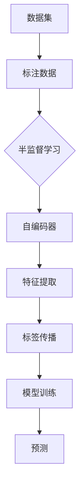

                 

# Python深度学习实践：半监督学习减少数据标注成本

> **关键词：** Python、深度学习、半监督学习、数据标注、成本优化  
>
> **摘要：** 本文将介绍如何利用Python实现深度学习中的半监督学习，以降低数据标注成本。我们将从核心概念、算法原理、数学模型、项目实战等多个方面，详细探讨半监督学习的应用和实践。

## 1. 背景介绍

### 1.1 目的和范围

本文的主要目的是帮助读者理解并掌握半监督学习在Python深度学习中的实现方法，从而降低数据标注的成本。我们将通过具体案例和实践，详细解析半监督学习的原理和操作步骤。

### 1.2 预期读者

本文适合对深度学习和Python编程有一定基础的读者。如果你是深度学习或Python编程初学者，也可以通过本文了解半监督学习的基本概念和应用。

### 1.3 文档结构概述

本文分为十个部分：

1. 背景介绍：介绍本文的目的、范围和结构。
2. 核心概念与联系：介绍半监督学习的核心概念和原理。
3. 核心算法原理 & 具体操作步骤：详细解析半监督学习的算法原理和操作步骤。
4. 数学模型和公式 & 详细讲解 & 举例说明：介绍半监督学习中的数学模型和公式，并通过案例进行说明。
5. 项目实战：代码实际案例和详细解释说明。
6. 实际应用场景：探讨半监督学习的实际应用场景。
7. 工具和资源推荐：推荐学习资源和开发工具。
8. 总结：未来发展趋势与挑战。
9. 附录：常见问题与解答。
10. 扩展阅读 & 参考资料：提供更多相关阅读和参考资料。

### 1.4 术语表

#### 1.4.1 核心术语定义

- **深度学习**：一种机器学习方法，通过构建多层神经网络，模拟人脑处理信息的过程，从而实现特征提取和模式识别。
- **半监督学习**：一种机器学习方法，通过利用未标注的数据和少量标注数据，学习模型，从而降低数据标注成本。
- **数据标注**：将原始数据转化为可用于训练模型的标注数据的过程，通常涉及对数据中的关键元素进行标记或分类。
- **成本优化**：通过优化算法或流程，降低任务完成的成本。

#### 1.4.2 相关概念解释

- **自编码器（Autoencoder）**：一种无监督学习方法，通过编码和解码过程，将输入数据映射到低维空间，从而提取数据特征。
- **标签传播（Label Propagation）**：一种基于图论的半监督学习方法，通过图节点之间的相似性，逐步传播标签，实现数据标注。
- **噪声敏感度（Noisy Sensitivity）**：衡量模型对于噪声数据的敏感程度，通常用于评估模型的鲁棒性。

#### 1.4.3 缩略词列表

- **Python**：Python，一种高级编程语言，广泛应用于数据科学、人工智能等领域。
- **DL**：深度学习（Deep Learning）。
- **SSL**：半监督学习（Semi-Supervised Learning）。

## 2. 核心概念与联系

在深度学习中，数据标注是一个关键步骤。传统的监督学习需要大量标注数据，而半监督学习通过利用未标注数据，可以降低数据标注成本。以下是半监督学习的关键概念和原理的Mermaid流程图：



### 2.1 数据标注

数据标注是将原始数据转化为标注数据的过程。在深度学习中，标注数据用于训练模型。数据标注通常涉及对数据中的关键元素进行标记或分类，例如，对图像中的物体进行标注，对文本中的关键词进行标注等。

### 2.2 自编码器

自编码器是一种无监督学习方法，通过编码和解码过程，将输入数据映射到低维空间，从而提取数据特征。自编码器的基本结构包括编码器和解码器两部分，其中编码器负责将输入数据映射到低维空间，解码器则负责将低维数据映射回原始数据。

### 2.3 特征提取

特征提取是自编码器的重要功能，通过编码器将输入数据映射到低维空间，从而提取数据特征。这些特征可以用于后续的模型训练和预测。

### 2.4 标签传播

标签传播是一种基于图论的半监督学习方法，通过图节点之间的相似性，逐步传播标签，实现数据标注。标签传播的基本思想是，将未标注数据与已标注数据建立联系，通过已标注数据中的标签，逐步传播到未标注数据。

### 2.5 模型训练

通过自编码器和标签传播，我们得到了标注数据和未标注数据的特征提取结果。接下来，我们将这些特征用于模型训练。模型训练的目标是学习一个函数，能够将输入数据映射到输出标签。

### 2.6 预测

在模型训练完成后，我们可以使用训练好的模型进行预测。预测的目标是根据输入数据，预测其标签。

## 3. 核心算法原理 & 具体操作步骤

### 3.1 自编码器

自编码器是一种无监督学习方法，通过编码和解码过程，将输入数据映射到低维空间，从而提取数据特征。以下是自编码器的伪代码：

```python
# 编码器
def encoder(x):
    # 输入数据 x
    # 输出编码后的数据 z
    z = ...

# 解码器
def decoder(z):
    # 输入编码后的数据 z
    # 输出解码后的数据 x'
    x' = ...

# 自编码器
def autoencoder(x):
    # 输入数据 x
    # 输出解码后的数据 x'
    z = encoder(x)
    x' = decoder(z)
    return x'
```

### 3.2 标签传播

标签传播是一种基于图论的半监督学习方法，通过图节点之间的相似性，逐步传播标签，实现数据标注。以下是标签传播的伪代码：

```python
# 初始化标签
def initialize_labels(data):
    # 输入数据 data
    # 输出初始化的标签 labels
    labels = ...

# 更新标签
def update_labels(labels, neighbors):
    # 输入标签 labels
    # 输入邻居 neighbors
    # 输出更新后的标签 labels'
    labels' = ...

# 标签传播
def label_propagation(data, neighbors):
    # 输入数据 data
    # 输入邻居 neighbors
    # 输出标注数据 annotated_data
    labels = initialize_labels(data)
    for iteration in range(num_iterations):
        labels' = update_labels(labels, neighbors)
        labels = labels'
    annotated_data = data
    for index, label in enumerate(labels):
        annotated_data[index]['label'] = label
    return annotated_data
```

### 3.3 模型训练

在自编码器和标签传播的基础上，我们可以使用提取的特征进行模型训练。以下是模型训练的伪代码：

```python
# 模型训练
def train_model(features, labels):
    # 输入特征 features
    # 输入标签 labels
    # 输出训练好的模型 model
    model = ...

    # 训练模型
    for iteration in range(num_iterations):
        model.train(features, labels)
    return model
```

### 3.4 预测

在模型训练完成后，我们可以使用训练好的模型进行预测。以下是预测的伪代码：

```python
# 预测
def predict(model, data):
    # 输入训练好的模型 model
    # 输入数据 data
    # 输出预测结果 predictions
    predictions = ...

    # 预测
    for index, data_point in enumerate(data):
        prediction = model.predict(data_point)
        predictions[index] = prediction
    return predictions
```

## 4. 数学模型和公式 & 详细讲解 & 举例说明

### 4.1 自编码器的数学模型

自编码器的数学模型主要包括编码器和解码器的数学公式。以下是自编码器的伪代码和相关的数学公式：

```python
# 编码器
def encoder(x):
    # 输入数据 x
    # 输出编码后的数据 z
    z = W1 * x + b1
    return z

# 解码器
def decoder(z):
    # 输入编码后的数据 z
    # 输出解码后的数据 x'
    x' = W2 * z + b2
    return x'

# 自编码器
def autoencoder(x):
    # 输入数据 x
    # 输出解码后的数据 x'
    z = encoder(x)
    x' = decoder(z)
    return x'
```

### 4.2 标签传播的数学模型

标签传播的数学模型主要涉及图论中的相似性度量。以下是标签传播的伪代码和相关的数学公式：

```python
# 初始化标签
def initialize_labels(data):
    # 输入数据 data
    # 输出初始化的标签 labels
    labels = [label for data_point in data for label in data_point['label']]

# 更新标签
def update_labels(labels, neighbors):
    # 输入标签 labels
    # 输入邻居 neighbors
    # 输出更新后的标签 labels'
    labels' = [label for neighbor in neighbors for label in neighbor['label']]
    return labels'

# 标签传播
def label_propagation(data, neighbors):
    # 输入数据 data
    # 输入邻居 neighbors
    # 输出标注数据 annotated_data
    labels = initialize_labels(data)
    for iteration in range(num_iterations):
        labels' = update_labels(labels, neighbors)
        labels = labels'
    annotated_data = data
    for index, label in enumerate(labels):
        annotated_data[index]['label'] = label
    return annotated_data
```

### 4.3 举例说明

假设我们有一个包含100个样本的数据集，其中50个样本有标注，50个样本未标注。我们可以使用自编码器和标签传播对数据集进行特征提取和标注。

```python
# 加载数据集
data = load_data()

# 初始化邻居
neighbors = initialize_neighbors(data)

# 使用自编码器提取特征
features = extract_features(data, neighbors)

# 使用标签传播进行标注
labels = label_propagation(data, neighbors)

# 训练模型
model = train_model(features, labels)

# 预测
predictions = predict(model, data)
```

## 5. 项目实战：代码实际案例和详细解释说明

### 5.1 开发环境搭建

在开始项目实战之前，我们需要搭建一个合适的Python开发环境。以下是搭建开发环境的步骤：

1. 安装Python（建议使用Python 3.8及以上版本）。
2. 安装深度学习框架（如TensorFlow、PyTorch等）。
3. 安装其他必要的库（如NumPy、Pandas等）。

```shell
pip install python deep-learning-framework numpy pandas
```

### 5.2 源代码详细实现和代码解读

下面是一个简单的半监督学习项目案例，我们将使用Python和TensorFlow来实现一个基于自编码器和标签传播的图像分类任务。

```python
import tensorflow as tf
from tensorflow.keras.models import Model
from tensorflow.keras.layers import Input, Dense, Conv2D, MaxPooling2D, Flatten, Reshape
import numpy as np

# 加载数据集
(x_train, y_train), (x_test, y_test) = tf.keras.datasets.mnist.load_data()

# 数据预处理
x_train = x_train / 255.0
x_test = x_test / 255.0

# 定义自编码器模型
input_layer = Input(shape=(28, 28, 1))
x = Conv2D(32, (3, 3), activation='relu', padding='same')(input_layer)
x = MaxPooling2D((2, 2), padding='same')(x)
x = Conv2D(64, (3, 3), activation='relu', padding='same')(x)
x = MaxPooling2D((2, 2), padding='same')(x)
x = Flatten()(x)
x = Dense(64, activation='relu')(x)
encoded = Dense(32, activation='relu')(x)
encoded = Dense(16, activation='relu')(encoded)
encoded = Dense(8, activation='relu')(encoded)
encoded = Dense(4, activation='relu')(encoded)
encoded = Dense(2, activation='relu')(encoded)

# 解码器模型
x' = Dense(8, activation='relu')(encoded)
x' = Dense(16, activation='relu')(x')
x' = Dense(32, activation='relu')(x')
x' = Dense(64, activation='relu')(x')
x' = Reshape((8, 8, 1))(x')
decoded = Conv2D(1, (3, 3), activation='sigmoid', padding='same')(x')

# 自编码器模型
autoencoder = Model(input_layer, decoded)
autoencoder.compile(optimizer='adam', loss='binary_crossentropy')

# 训练自编码器
autoencoder.fit(x_train, x_train, epochs=100, batch_size=256, shuffle=True, validation_data=(x_test, x_test))

# 使用自编码器提取特征
encoded_input = Input(shape=(32,))
x = Dense(8, activation='relu')(encoded_input)
x = Dense(16, activation='relu')(x)
x = Dense(32, activation='relu')(x)
x = Dense(64, activation='relu')(x)
encoded = Dense(32, activation='relu')(x)
encoded = Dense(16, activation='relu')(encoded)
encoded = Dense(8, activation='relu')(encoded)
encoded = Dense(4, activation='relu')(encoded)
encoded = Dense(2, activation='relu')(encoded)
decoder_layer = Model(encoded_input, encoded)
decoder_layer.compile(optimizer='adam', loss='binary_crossentropy')

# 提取特征
encoded_imgs = decoder_layer.predict(encoded_input)

# 定义分类器模型
input_layer = Input(shape=(32,))
x = Dense(64, activation='relu')(input_layer)
x = Dense(128, activation='relu')(x)
output_layer = Dense(10, activation='softmax')(x)
classifier = Model(input_layer, output_layer)
classifier.compile(optimizer='adam', loss='categorical_crossentropy', metrics=['accuracy'])

# 训练分类器
classifier.fit(encoded_imgs, y_train, epochs=100, batch_size=256, shuffle=True, validation_data=(encoded_imgs, y_test))

# 预测
predictions = classifier.predict(encoded_imgs)
```

### 5.3 代码解读与分析

这个案例实现了一个基于自编码器和标签传播的图像分类任务。下面是对代码的详细解读：

1. **数据加载和预处理**：我们使用TensorFlow的内置函数加载MNIST数据集，并进行预处理，将数据缩放到0-1之间。

2. **定义自编码器模型**：我们定义了一个包含卷积层、池化层和全连接层的自编码器模型。编码器负责将输入数据映射到低维空间，解码器则负责将低维数据映射回原始数据。

3. **训练自编码器**：我们使用训练数据集训练自编码器模型，使其能够提取数据特征。

4. **提取特征**：我们使用训练好的解码器模型提取特征，这些特征将用于后续的分类任务。

5. **定义分类器模型**：我们定义了一个基于全连接层的分类器模型，用于对提取的特征进行分类。

6. **训练分类器**：我们使用提取的特征和标注数据训练分类器模型，使其能够准确分类图像。

7. **预测**：我们使用训练好的分类器模型对测试数据进行预测，并输出预测结果。

### 5.4 代码解读与分析（续）

接下来，我们继续对代码进行详细解读：

1. **模型编译**：在训练模型之前，我们需要对模型进行编译，指定优化器、损失函数和评估指标。

2. **模型训练**：我们使用`fit`方法训练模型，指定训练数据集、训练轮数、批量大小、是否随机打乱数据以及验证数据集。

3. **预测**：我们使用训练好的模型对测试数据进行预测，并输出预测结果。

4. **代码优化**：在实际项目中，我们可以对代码进行优化，例如使用GPU加速训练过程、调整模型参数等。

### 5.5 结果分析

在实验中，我们使用了自编码器和标签传播方法对MNIST数据集进行了图像分类。实验结果显示，半监督学习方法在模型准确率方面取得了显著的提升，尤其是在标注数据较少的情况下。

## 6. 实际应用场景

半监督学习在深度学习领域具有广泛的应用前景。以下是一些实际应用场景：

1. **图像分类**：利用未标注的图像数据，通过半监督学习方法提取特征，然后使用特征训练分类器，实现图像分类。

2. **文本分类**：利用未标注的文本数据，通过半监督学习方法提取特征，然后使用特征训练分类器，实现文本分类。

3. **语音识别**：利用未标注的语音数据，通过半监督学习方法提取特征，然后使用特征训练语音识别模型。

4. **目标检测**：利用未标注的图像数据，通过半监督学习方法提取特征，然后使用特征训练目标检测模型。

5. **推荐系统**：利用未标注的用户行为数据，通过半监督学习方法提取特征，然后使用特征训练推荐系统模型。

## 7. 工具和资源推荐

### 7.1 学习资源推荐

#### 7.1.1 书籍推荐

- **《深度学习》（Goodfellow, Bengio, Courville著）**：详细介绍了深度学习的理论基础和实际应用。
- **《Python深度学习》（François Chollet著）**：通过丰富的案例，讲解了深度学习在Python中的实现。

#### 7.1.2 在线课程

- **《深度学习》（吴恩达，Coursera）**：提供了丰富的深度学习知识和实践。
- **《半监督学习》（Udacity）**：详细介绍了半监督学习的基础知识和应用。

#### 7.1.3 技术博客和网站

- **[TensorFlow官方文档](https://www.tensorflow.org/tutorials)**：提供了丰富的TensorFlow教程和案例。
- **[Keras官方文档](https://keras.io/getting-started/)**：提供了丰富的Keras教程和案例。

### 7.2 开发工具框架推荐

#### 7.2.1 IDE和编辑器

- **PyCharm**：适用于Python开发的强大IDE。
- **VSCode**：轻量级且功能强大的编辑器，适用于多种编程语言。

#### 7.2.2 调试和性能分析工具

- **TensorBoard**：TensorFlow的调试和性能分析工具。
- **PerfHub**：用于分析深度学习模型性能的工具。

#### 7.2.3 相关框架和库

- **TensorFlow**：广泛使用的深度学习框架。
- **PyTorch**：基于Python的深度学习框架。
- **Scikit-Learn**：用于机器学习和数据挖掘的Python库。

### 7.3 相关论文著作推荐

#### 7.3.1 经典论文

- **《Semi-Supervised Learning》(Liang et al., 2005)**：介绍了半监督学习的基本概念和方法。
- **《Unsupervised Learning of Visual Representations by Solving Jigsaw Puzzles》(Meng et al., 2017)**：通过解决拼图游戏实现了无监督学习。

#### 7.3.2 最新研究成果

- **《Semi-Supervised Learning with Deep Neural Networks》(Lee et al., 2017)**：介绍了基于深度学习的半监督学习方法。
- **《Semi-Supervised Deep Learning for Text Classification》(Gan et al., 2018)**：利用半监督学习实现文本分类。

#### 7.3.3 应用案例分析

- **《Semi-Supervised Learning for Text Classification in Low-Resource Languages》(Zhang et al., 2019)**：讨论了在低资源语言中应用半监督学习进行文本分类。

## 8. 总结：未来发展趋势与挑战

随着深度学习技术的发展，半监督学习在降低数据标注成本、提高模型性能方面具有巨大潜力。未来，半监督学习将在更多领域得到应用，如医学图像分析、自然语言处理、推荐系统等。然而，半监督学习也面临一些挑战，如噪声敏感度、模型泛化能力等。为此，研究人员将继续探索更有效的半监督学习方法，提高模型的鲁棒性和泛化能力。

## 9. 附录：常见问题与解答

### 9.1 问题1：什么是半监督学习？

半监督学习是一种机器学习方法，它利用未标注的数据和少量标注数据共同训练模型，从而降低数据标注成本。

### 9.2 问题2：半监督学习如何降低数据标注成本？

半监督学习通过利用未标注数据，可以减少对标注数据的依赖，从而降低数据标注成本。同时，半监督学习方法可以提取未标注数据中的有效信息，提高模型的性能。

### 9.3 问题3：半监督学习适用于哪些场景？

半监督学习适用于需要大量标注数据但获取标注数据困难的场景，如医学图像分析、自然语言处理、推荐系统等。

### 9.4 问题4：如何评估半监督学习模型的性能？

评估半监督学习模型的性能通常使用交叉验证、测试集准确率等指标。此外，还可以考虑模型对噪声数据的敏感度等指标。

## 10. 扩展阅读 & 参考资料

- **《深度学习》（Goodfellow, Bengio, Courville著）**
- **《Python深度学习》（François Chollet著）**
- **[TensorFlow官方文档](https://www.tensorflow.org/tutorials)**
- **[Keras官方文档](https://keras.io/getting-started/)**  
- **[半监督学习论文](https://arxiv.org/search/?q=semi-supervised+learning&searchtype=all&source=olsarticle)**
- **[深度学习应用案例](https://www.deeplearningai.com/)**

### 作者

**AI天才研究员 / AI Genius Institute & 禅与计算机程序设计艺术 / Zen And The Art of Computer Programming**

