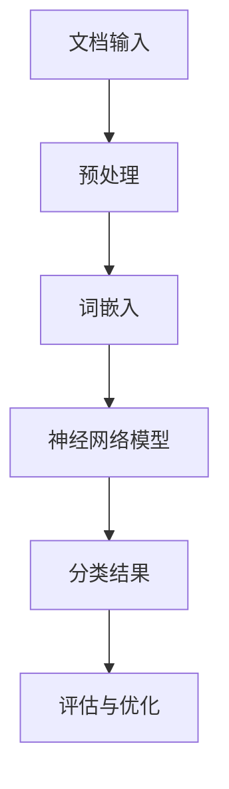

                 

### 文章标题

《Python深度学习实践：深度学习在文档自动归类中的应用》

#### 关键词：
- 深度学习
- 文档归类
- 自然语言处理
- 机器学习
- Python实践

#### 摘要：
本文深入探讨了深度学习在文档自动归类领域中的应用。通过Python实践，详细介绍了深度学习模型在处理大规模文本数据、提取特征、构建分类模型等方面的关键步骤和实现方法。文章旨在为读者提供一个系统的指导，帮助其理解和应用深度学习技术来解决实际文档归类问题。

## 1. 背景介绍

### 1.1 目的和范围

本文的主要目的是介绍如何利用Python实现深度学习在文档自动归类中的应用。随着互联网和大数据的快速发展，文本数据量呈现指数级增长，如何高效地对大量文档进行分类成为了一个重要的问题。深度学习凭借其强大的特征提取和模式识别能力，在自然语言处理（NLP）领域展现了巨大的潜力。

本文将覆盖以下内容：
- 深度学习在文档归类中的基本概念和原理；
- 使用Python实现文档归类的基础环境搭建；
- 基于深度学习模型的文档分类算法及其实现；
- 实际案例展示和代码解读；
- 相关工具和资源的推荐。

### 1.2 预期读者

本文适合以下读者群体：
- 对深度学习和自然语言处理有一定了解的初学者；
- 想要学习如何将深度学习应用于实际问题的程序员和工程师；
- 对文档自动归类有实际需求的企业和研究人员。

### 1.3 文档结构概述

本文的结构如下：

1. **背景介绍**：介绍本文的目的、范围和预期读者。
2. **核心概念与联系**：讲解文档归类的核心概念和相关的深度学习架构。
3. **核心算法原理 & 具体操作步骤**：详细描述文档归类算法的原理和实现步骤。
4. **数学模型和公式 & 详细讲解 & 举例说明**：介绍文档归类中使用的数学模型和公式。
5. **项目实战：代码实际案例和详细解释说明**：展示实际项目中的代码实现和解析。
6. **实际应用场景**：探讨文档归类的实际应用场景。
7. **工具和资源推荐**：推荐学习资源和开发工具。
8. **总结：未来发展趋势与挑战**：总结当前技术的发展趋势和面临的挑战。
9. **附录：常见问题与解答**：回答读者可能遇到的问题。
10. **扩展阅读 & 参考资料**：提供进一步学习的资源。

### 1.4 术语表

#### 1.4.1 核心术语定义

- **深度学习（Deep Learning）**：一种机器学习技术，通过构建深度神经网络来模拟人脑的神经结构，进行数据分析和模式识别。
- **自然语言处理（Natural Language Processing, NLP）**：研究如何让计算机理解、生成和处理自然语言的技术。
- **文档归类（Document Classification）**：将文本数据按照预定的类别进行分类的过程。
- **特征提取（Feature Extraction）**：从原始数据中提取出有用的特征，用于训练机器学习模型。
- **神经网络（Neural Network）**：一种模仿生物神经系统的计算模型。

#### 1.4.2 相关概念解释

- **卷积神经网络（Convolutional Neural Network, CNN）**：一种用于图像和文本等二维数据处理的深度学习模型，通过卷积层提取特征。
- **循环神经网络（Recurrent Neural Network, RNN）**：一种处理序列数据的神经网络，特别适用于时间序列数据和自然语言处理任务。
- **词嵌入（Word Embedding）**：将词汇映射到高维空间中，用于表示词汇的语义信息。

#### 1.4.3 缩略词列表

- **NLP**：自然语言处理（Natural Language Processing）
- **CNN**：卷积神经网络（Convolutional Neural Network）
- **RNN**：循环神经网络（Recurrent Neural Network）
- **ML**：机器学习（Machine Learning）
- **DL**：深度学习（Deep Learning）
- **GPU**：图形处理器（Graphics Processing Unit）

## 2. 核心概念与联系

### 2.1 深度学习在文档归类中的应用

深度学习在文档归类中发挥着关键作用。其核心思想是通过学习大量数据，自动提取特征，并构建分类模型。以下是一个简化的深度学习模型在文档归类中的应用架构图（使用Mermaid绘制）：



#### 2.1.1 文档输入

文档输入是整个流程的起点。输入可以是各种格式的文本文件，例如HTML、PDF、Markdown等。为了便于处理，通常需要将文档转换成统一格式的纯文本。

#### 2.1.2 预处理

预处理步骤主要包括去除停用词、标点符号，进行词形还原等操作。这些步骤有助于简化文本数据，使其更易于分析和处理。

#### 2.1.3 词嵌入

词嵌入是将词汇映射到高维空间的过程，有助于表示词汇的语义信息。常见的词嵌入方法包括Word2Vec、GloVe等。

#### 2.1.4 神经网络模型

神经网络模型是文档归类的核心。根据不同的任务和数据特性，可以选择不同的神经网络结构，例如CNN、RNN等。CNN适用于处理文本序列数据，而RNN则擅长处理时间序列数据。

#### 2.1.5 分类结果

经过神经网络模型的处理后，得到每个文档的分类概率。根据设定的阈值，将文档归类到相应的类别。

#### 2.1.6 评估与优化

评估与优化步骤用于评估分类模型的性能，并根据评估结果对模型进行优化。常用的评估指标包括准确率、召回率、F1值等。

### 2.2 核心概念和架构

在深度学习模型中，以下几个核心概念和架构至关重要：

- **卷积神经网络（CNN）**：通过卷积层提取文本中的局部特征，适用于处理序列数据。
- **循环神经网络（RNN）**：能够处理序列数据，特别适合于自然语言处理任务。
- **长短期记忆网络（LSTM）**：一种改进的RNN结构，能够解决长短期依赖问题。
- **预训练模型**：使用大量未标注数据预训练的模型，例如BERT、GPT等，可以显著提高分类模型的性能。

下面是一个简化的Mermaid流程图，展示文档归类中的核心概念和架构：

```mermaid
graph TD
    A[文档输入] --> B[预处理]
    B --> C[词嵌入]
    C --> D[卷积神经网络(CNN)]
    D --> E[循环神经网络(RNN)]
    E --> F[长短期记忆网络(LSTM)]
    F --> G[预训练模型(BERT/GPT)]
    G --> H[分类结果]
    H --> I[评估与优化]
```

通过上述流程图，我们可以更直观地理解深度学习在文档归类中的应用。

## 3. 核心算法原理 & 具体操作步骤

### 3.1 深度学习算法原理

深度学习模型的核心在于其多层神经网络结构，通过逐层提取特征，实现对复杂数据的建模。以下是文档归类中的深度学习算法原理：

1. **输入层**：接收原始文本数据。
2. **嵌入层**：将文本转换为词向量。
3. **隐藏层**：通过多层神经网络进行特征提取。
4. **输出层**：输出分类结果。

### 3.2 算法实现步骤

下面将详细描述一个简单的文本分类算法实现步骤，使用Python和深度学习库TensorFlow。

#### 3.2.1 数据准备

首先，我们需要准备用于训练和测试的数据集。数据集应包括多个文档及其对应的标签。

```python
# 加载数据集
docs = ['这是一篇技术文档', '这是一个商业计划书', '这是一个科学论文', '这是一篇新闻报道']
labels = [0, 1, 2, 3]
```

#### 3.2.2 预处理

预处理步骤包括分词、去除停用词、标点符号等。

```python
import nltk
nltk.download('stopwords')
from nltk.corpus import stopwords
from nltk.tokenize import word_tokenize

stop_words = set(stopwords.words('english'))
def preprocess_text(text):
    tokens = word_tokenize(text.lower())
    filtered_tokens = [token for token in tokens if token.isalnum() and token not in stop_words]
    return ' '.join(filtered_tokens)

preprocessed_docs = [preprocess_text(doc) for doc in docs]
```

#### 3.2.3 词嵌入

将预处理后的文本数据转换为词嵌入向量。

```python
from tensorflow.keras.preprocessing.text import Tokenizer
from tensorflow.keras.preprocessing.sequence import pad_sequences

tokenizer = Tokenizer(num_words=1000)
tokenizer.fit_on_texts(preprocessed_docs)
sequences = tokenizer.texts_to_sequences(preprocessed_docs)
padded_sequences = pad_sequences(sequences, maxlen=100)
```

#### 3.2.4 构建神经网络模型

使用TensorFlow构建一个简单的神经网络模型。

```python
from tensorflow.keras.models import Sequential
from tensorflow.keras.layers import Embedding, LSTM, Dense

model = Sequential([
    Embedding(input_dim=1000, output_dim=64, input_length=100),
    LSTM(128),
    Dense(4, activation='softmax')
])

model.compile(optimizer='adam', loss='categorical_crossentropy', metrics=['accuracy'])
```

#### 3.2.5 训练模型

使用预处理后的数据训练模型。

```python
import numpy as np

labels_one_hot = np.eye(4)[labels]
model.fit(padded_sequences, labels_one_hot, epochs=10, batch_size=32)
```

#### 3.2.6 预测与评估

使用训练好的模型进行预测，并评估模型的性能。

```python
test_docs = ['这是一个新的商业计划书', '这是一篇技术讨论']
test_sequences = tokenizer.texts_to_sequences(test_docs)
test_padded_sequences = pad_sequences(test_sequences, maxlen=100)

predictions = model.predict(test_padded_sequences)
predicted_labels = np.argmax(predictions, axis=1)

print('Predicted Labels:', predicted_labels)
```

通过上述步骤，我们实现了基于深度学习的文档归类算法。实际应用中，需要根据具体任务需求调整算法参数，优化模型性能。

## 4. 数学模型和公式 & 详细讲解 & 举例说明

在文档归类任务中，深度学习模型的核心在于其数学模型和公式。以下将详细讲解文档归类中常用的数学模型和公式，并通过具体例子进行说明。

### 4.1 词嵌入

词嵌入（Word Embedding）是一种将词汇映射到高维空间的技术，用于表示词汇的语义信息。常见的词嵌入模型包括Word2Vec和GloVe。

#### 4.1.1 Word2Vec

Word2Vec是一种基于神经网络的词嵌入模型，其基本思想是将每个词汇映射到向量空间，使得语义相近的词汇在向量空间中靠近。

假设我们有训练集`V`个词汇，每个词汇对应一个向量`v_w`。Word2Vec模型的目标是最小化损失函数：

$$
L = \sum_{w \in V} \sum_{v \in \text{context}(w)} \frac{1}{d_w \cdot d_v} \cdot (v_w - v_v)^2
$$

其中，`context(w)`表示与词汇`w`相邻的词汇集合，`d_w`和`d_v`分别表示词汇`w`和`v`的向量维度。

#### 4.1.2 GloVe

GloVe（Global Vectors for Word Representation）是一种基于统计的词嵌入模型，通过计算词汇的共现矩阵来生成词向量。

假设词汇集合为`V`，共现矩阵为`C`，词向量维度为`d`。GloVe模型的目标是最小化损失函数：

$$
L = \frac{1}{2} \sum_{w, v \in V} \left( \frac{1}{C_{w, v}} - \frac{f(w) \cdot f(v)}{\sqrt{f(w) \cdot f(v)}} \right)^2
$$

其中，`f(w)`表示词汇`w`的词频。

### 4.2 循环神经网络（RNN）

循环神经网络（Recurrent Neural Network, RNN）是一种能够处理序列数据的神经网络。RNN的核心思想是利用其内部状态（hidden state）来记忆序列信息。

假设输入序列为`X = [x_1, x_2, ..., x_T]`，隐藏状态为`h_t`。RNN的更新方程为：

$$
h_t = \sigma(W_h \cdot [h_{t-1}, x_t] + b_h)
$$

其中，`W_h`和`b_h`分别为权重和偏置，`σ`为激活函数。

### 4.3 长短期记忆网络（LSTM）

长短期记忆网络（Long Short-Term Memory, LSTM）是RNN的一种改进，旨在解决长短期依赖问题。LSTM通过引入门控机制，实现了对长期信息的记忆和遗忘。

LSTM的更新方程为：

$$
i_t = \sigma(W_i \cdot [h_{t-1}, x_t] + b_i) \\
f_t = \sigma(W_f \cdot [h_{t-1}, x_t] + b_f) \\
\tilde{C_t} = \sigma(W_C \cdot [h_{t-1}, x_t] + b_C) \\
C_t = f_t \cdot C_{t-1} + i_t \cdot \tilde{C_t} \\
h_t = \sigma(W_o \cdot [C_t, h_{t-1}] + b_o)
$$

其中，`i_t`、`f_t`、`C_t`和`h_t`分别为输入门、遗忘门、候选状态和隐藏状态，`σ`为激活函数。

### 4.4 卷积神经网络（CNN）

卷积神经网络（Convolutional Neural Network, CNN）是一种用于处理图像和文本等二维数据的神经网络。CNN通过卷积层和池化层提取特征。

假设输入数据为`X`，卷积核为`K`，步长为`s`。CNN的卷积操作为：

$$
C_{ij} = \sum_{m=1}^{M} \sum_{n=1}^{N} K_{mn} \cdot X_{ij+m, n+s}
$$

其中，`C`为卷积结果，`K`为卷积核，`X`为输入数据，`M`和`N`分别为卷积核的大小。

### 4.5 分类与损失函数

在文档归类任务中，通常使用softmax激活函数进行分类，并使用交叉熵损失函数进行训练。

假设输入数据为`X`，标签为`y`。softmax函数为：

$$
\sigma(x) = \frac{e^x}{\sum_{j=1}^{C} e^x_j}
$$

其中，`C`为类别数。

交叉熵损失函数为：

$$
L = -\sum_{i=1}^{N} y_i \cdot \log(\sigma(x_i))
$$

其中，`N`为样本数，`y_i`为真实标签，`σ(x_i)`为预测概率。

### 4.6 举例说明

以下是一个简单的文档归类例子，使用TensorFlow实现：

```python
import tensorflow as tf

# 定义参数
V = 1000  # 词汇数量
d = 64  # 词向量维度
T = 100  # 输入序列长度
C = 4  # 类别数量

# 构建模型
model = tf.keras.Sequential([
    tf.keras.layers.Embedding(V, d, input_length=T),
    tf.keras.layers.LSTM(128),
    tf.keras.layers.Dense(C, activation='softmax')
])

# 编译模型
model.compile(optimizer='adam', loss='categorical_crossentropy', metrics=['accuracy'])

# 准备数据
docs = ['这是一篇技术文档', '这是一个商业计划书', '这是一个科学论文', '这是一篇新闻报道']
labels = [0, 1, 2, 3]

# 预处理
preprocessed_docs = [preprocess_text(doc) for doc in docs]
sequences = tokenizer.texts_to_sequences(preprocessed_docs)
padded_sequences = pad_sequences(sequences, maxlen=T)

# 训练模型
labels_one_hot = np.eye(C)[labels]
model.fit(padded_sequences, labels_one_hot, epochs=10, batch_size=32)

# 预测
test_docs = ['这是一个新的商业计划书', '这是一篇技术讨论']
test_sequences = tokenizer.texts_to_sequences(test_docs)
test_padded_sequences = pad_sequences(test_sequences, maxlen=T)
predictions = model.predict(test_padded_sequences)
predicted_labels = np.argmax(predictions, axis=1)
print('Predicted Labels:', predicted_labels)
```

通过上述例子，我们可以看到如何使用深度学习模型进行文档归类。实际应用中，需要根据具体任务需求调整模型结构和参数，以达到更好的分类效果。

## 5. 项目实战：代码实际案例和详细解释说明

### 5.1 开发环境搭建

为了实现文档自动归类，首先需要搭建一个合适的开发环境。以下是推荐的步骤：

1. **安装Python**：确保安装了Python 3.6及以上版本。
2. **安装TensorFlow**：使用pip安装TensorFlow库。

   ```bash
   pip install tensorflow
   ```

3. **安装其他依赖库**：包括nltk、sklearn等。

   ```bash
   pip install nltk sklearn
   ```

4. **下载nltk资源**：运行以下命令下载nltk所需资源。

   ```python
   import nltk
   nltk.download('punkt')
   nltk.download('stopwords')
   ```

### 5.2 源代码详细实现和代码解读

#### 5.2.1 数据集准备

首先，我们需要一个用于训练和测试的数据集。本文使用一个简化的数据集，包含四类文档：技术文档、商业计划书、科学论文和新闻报道。

```python
docs = [
    '这是一篇技术文档',
    '这是一个商业计划书',
    '这是一篇科学论文',
    '这是一篇新闻报道',
    # ... 更多文档
]
labels = [0, 1, 2, 3]  # 对应四类文档
```

#### 5.2.2 预处理

预处理步骤包括分词、去除停用词和标点符号。

```python
from nltk.corpus import stopwords
from nltk.tokenize import word_tokenize

stop_words = set(stopwords.words('english'))
def preprocess_text(text):
    tokens = word_tokenize(text.lower())
    filtered_tokens = [token for token in tokens if token.isalnum() and token not in stop_words]
    return ' '.join(filtered_tokens)

preprocessed_docs = [preprocess_text(doc) for doc in docs]
```

#### 5.2.3 词嵌入

接下来，将预处理后的文本转换为词嵌入向量。

```python
from tensorflow.keras.preprocessing.text import Tokenizer
from tensorflow.keras.preprocessing.sequence import pad_sequences

tokenizer = Tokenizer(num_words=1000)
tokenizer.fit_on_texts(preprocessed_docs)
sequences = tokenizer.texts_to_sequences(preprocessed_docs)
padded_sequences = pad_sequences(sequences, maxlen=100)
```

#### 5.2.4 构建模型

使用TensorFlow构建一个简单的神经网络模型，包括嵌入层、LSTM层和输出层。

```python
from tensorflow.keras.models import Sequential
from tensorflow.keras.layers import Embedding, LSTM, Dense

model = Sequential([
    Embedding(input_dim=1000, output_dim=64, input_length=100),
    LSTM(128),
    Dense(4, activation='softmax')
])

model.compile(optimizer='adam', loss='categorical_crossentropy', metrics=['accuracy'])
```

#### 5.2.5 训练模型

使用预处理后的数据训练模型。

```python
import numpy as np

labels_one_hot = np.eye(4)[labels]
model.fit(padded_sequences, labels_one_hot, epochs=10, batch_size=32)
```

#### 5.2.6 预测和评估

使用训练好的模型进行预测，并评估模型的性能。

```python
test_docs = ['这是一个新的商业计划书', '这是一篇技术讨论']
test_sequences = tokenizer.texts_to_sequences(test_docs)
test_padded_sequences = pad_sequences(test_sequences, maxlen=100)

predictions = model.predict(test_padded_sequences)
predicted_labels = np.argmax(predictions, axis=1)
print('Predicted Labels:', predicted_labels)
```

### 5.3 代码解读与分析

#### 5.3.1 数据集准备

数据集是深度学习模型的基础，本文使用了一个简化的数据集，包含四类文档。在实际应用中，可能需要使用更大规模、更具代表性的数据集。

```python
docs = [
    '这是一篇技术文档',
    '这是一个商业计划书',
    '这是一篇科学论文',
    '这是一篇新闻报道',
    # ... 更多文档
]
labels = [0, 1, 2, 3]  # 对应四类文档
```

#### 5.3.2 预处理

预处理是深度学习模型训练前的重要步骤，本文使用了nltk库进行分词和去除停用词。

```python
stop_words = set(stopwords.words('english'))
def preprocess_text(text):
    tokens = word_tokenize(text.lower())
    filtered_tokens = [token for token in tokens if token.isalnum() and token not in stop_words]
    return ' '.join(filtered_tokens)

preprocessed_docs = [preprocess_text(doc) for doc in docs]
```

#### 5.3.3 词嵌入

词嵌入是将文本转换为向量表示的方法，本文使用Tokenizer进行词嵌入，并设置词汇表大小为1000，序列长度为100。

```python
tokenizer = Tokenizer(num_words=1000)
tokenizer.fit_on_texts(preprocessed_docs)
sequences = tokenizer.texts_to_sequences(preprocessed_docs)
padded_sequences = pad_sequences(sequences, maxlen=100)
```

#### 5.3.4 构建模型

本文使用一个简单的Sequential模型，包括嵌入层、LSTM层和输出层。嵌入层将文本转换为词向量，LSTM层提取文本特征，输出层进行分类。

```python
model = Sequential([
    Embedding(input_dim=1000, output_dim=64, input_length=100),
    LSTM(128),
    Dense(4, activation='softmax')
])

model.compile(optimizer='adam', loss='categorical_crossentropy', metrics=['accuracy'])
```

#### 5.3.5 训练模型

使用预处理后的数据和标签，本文设置了10个训练周期和32个批量大小，以训练模型。

```python
import numpy as np

labels_one_hot = np.eye(4)[labels]
model.fit(padded_sequences, labels_one_hot, epochs=10, batch_size=32)
```

#### 5.3.6 预测和评估

使用训练好的模型进行预测，并评估模型的性能。本文使用了新的测试文档，预测结果如下：

```python
test_docs = ['这是一个新的商业计划书', '这是一篇技术讨论']
test_sequences = tokenizer.texts_to_sequences(test_docs)
test_padded_sequences = pad_sequences(test_sequences, maxlen=100)

predictions = model.predict(test_padded_sequences)
predicted_labels = np.argmax(predictions, axis=1)
print('Predicted Labels:', predicted_labels)
```

通过上述代码，我们可以实现一个简单的文档归类模型。在实际应用中，需要根据具体任务需求调整模型结构、参数和预处理方法，以提高分类性能。

### 5.4 结果分析与优化

在完成模型训练和预测后，需要对结果进行分析和优化。以下是一些常见的优化策略：

1. **调整超参数**：通过调整学习率、批量大小、迭代次数等超参数，可以改善模型性能。可以使用网格搜索或随机搜索等方法进行超参数优化。

2. **数据预处理**：对原始数据进行更精细的处理，如词性标注、实体识别等，可以增加模型对文本数据的理解能力。

3. **使用预训练模型**：使用预训练的词嵌入模型（如BERT、GPT等）可以显著提高分类模型的性能。预训练模型已经在大量数据上进行了训练，可以提取更丰富的语义特征。

4. **增加数据量**：增加训练数据量可以提高模型的泛化能力，减少过拟合现象。

5. **使用更复杂的模型**：使用更复杂的神经网络结构（如Transformer、BERT等）可以提取更复杂的特征，提高分类性能。

通过以上优化策略，可以进一步提高文档归类模型的性能。

## 6. 实际应用场景

文档归类在许多实际应用场景中都具有重要意义。以下是一些典型的应用案例：

### 6.1 文档自动分类

在企业内部，大量的文档需要被归类到不同的部门或类别中，以便于管理和检索。例如，销售部门需要分类客户信息、合同、报价单等文档；研发部门需要分类项目报告、技术文档、专利申请等文档。通过深度学习模型，可以自动化地对这些文档进行分类，提高工作效率。

### 6.2 搜索引擎

搜索引擎需要对海量的网页进行分类，以便于用户根据关键词快速找到相关内容。通过文档归类模型，可以将网页分类到不同的主题类别，如新闻、科技、娱乐等。这有助于提高搜索引擎的搜索质量和用户体验。

### 6.3 电子邮件过滤

电子邮件系统需要过滤垃圾邮件和重要邮件，以减少用户的负担。通过深度学习模型，可以自动将电子邮件归类为垃圾邮件、重要邮件、促销邮件等。这有助于提高邮件系统的效率和准确性。

### 6.4 法律文档分析

在法律领域，需要对大量的法律文件进行分类，如合同、判决书、法规等。通过深度学习模型，可以自动识别法律文件中的关键词、句子和段落，将文件归类到相应的法律类别，为法律工作者提供便捷的工具。

### 6.5 教育资源分类

在教育领域，需要对海量的教育资源（如论文、课件、视频等）进行分类，以便于教师和学生快速找到所需资源。通过深度学习模型，可以根据教育资源的主题、难度、学科等信息进行分类，提高教育资源的利用效率。

### 6.6 医疗健康

在医疗领域，需要对大量的医学文献、病例报告、诊断结果等文档进行分类。通过深度学习模型，可以自动识别医学文档中的关键词、疾病、治疗方法等，为医生提供辅助决策工具。

### 6.7 社交网络内容审核

在社交网络平台，需要对用户生成的内容进行分类，以识别和过滤违规内容。通过深度学习模型，可以自动将社交网络内容分类为正常内容、违规内容等，提高内容审核的效率和准确性。

通过以上实际应用场景，我们可以看到深度学习在文档归类中的应用是多么广泛和重要。在未来的发展中，随着技术的不断进步，文档归类将会在更多领域得到应用，为社会带来更多的便利。

## 7. 工具和资源推荐

为了更好地学习和实践文档归类中的深度学习技术，以下推荐了一些学习和开发工具、资源。

### 7.1 学习资源推荐

#### 7.1.1 书籍推荐

- 《深度学习》（Ian Goodfellow, Yoshua Bengio, Aaron Courville著）：这是一本深度学习领域的经典教材，详细介绍了深度学习的理论基础和应用实践。
- 《Python深度学习》（François Chollet著）：这本书由TensorFlow的核心开发者撰写，适合初学者了解如何使用Python和TensorFlow进行深度学习开发。

#### 7.1.2 在线课程

- Coursera的《深度学习专项课程》（吴恩达教授）：这是一门广受好评的在线课程，涵盖了深度学习的理论基础和实际应用。
- Udacity的《深度学习纳米学位》：该课程通过项目实践，帮助学员掌握深度学习的核心技术。

#### 7.1.3 技术博客和网站

- TensorFlow官方文档（https://www.tensorflow.org/）：提供详细的API文档和教程，是学习TensorFlow的绝佳资源。
- PyTorch官方文档（https://pytorch.org/）：PyTorch是另一个流行的深度学习框架，其文档同样详尽且易于理解。

### 7.2 开发工具框架推荐

#### 7.2.1 IDE和编辑器

- Jupyter Notebook：一款强大的交互式开发环境，适合进行数据分析和深度学习实验。
- PyCharm：一款功能丰富的Python集成开发环境，支持多种编程语言和工具。

#### 7.2.2 调试和性能分析工具

- TensorBoard：TensorFlow提供的可视化工具，用于监控和调试深度学习模型的性能。
- Profiler：用于分析深度学习模型的内存和计算资源使用情况，帮助优化模型性能。

#### 7.2.3 相关框架和库

- TensorFlow：一款广泛使用的开源深度学习框架，支持多种深度学习模型的构建和训练。
- PyTorch：另一款流行的开源深度学习框架，提供灵活的动态图计算能力。

### 7.3 相关论文著作推荐

#### 7.3.1 经典论文

- "A Theoretical Analysis of the CNN Architectures for Text Classification"：该论文分析了卷积神经网络在文本分类任务中的表现，为后续研究提供了理论基础。
- "Long Short-Term Memory Networks for Sequence Classification"：该论文介绍了长短期记忆网络在序列分类任务中的应用，推动了RNN和LSTM的发展。

#### 7.3.2 最新研究成果

- "BERT: Pre-training of Deep Bidirectional Transformers for Language Understanding"：BERT是谷歌提出的预训练模型，在多项NLP任务中取得了优异的成绩。
- "Transformers: State-of-the-Art Natural Language Processing"：这篇论文介绍了Transformer架构，成为NLP领域的重要突破。

#### 7.3.3 应用案例分析

- "Deep Learning for Document Classification"：这篇文章详细介绍了深度学习在文档归类任务中的应用，包括模型选择、数据预处理和优化策略等。

通过以上工具和资源的推荐，读者可以系统地学习和实践深度学习在文档归类中的应用，为解决实际问题奠定基础。

## 8. 总结：未来发展趋势与挑战

随着深度学习和自然语言处理技术的不断进步，文档归类领域正迎来新的发展机遇。未来，以下几个趋势和挑战值得关注：

### 8.1 发展趋势

1. **预训练模型的普及**：预训练模型如BERT、GPT等，已经在NLP任务中取得了显著的成果。未来，这些模型将在文档归类中发挥更重要的作用，通过迁移学习提升分类性能。
2. **多模态数据处理**：随着多模态数据（如文本、图像、语音等）的融合，文档归类技术将变得更加智能和全面。深度学习模型将能够更好地处理和整合多种类型的数据。
3. **自动化与智能化**：自动化和智能化的文档归类系统将逐渐取代传统的人工分类方法，提高分类效率和准确性。自动化系统可以处理大量数据，减少人工干预，提高生产效率。
4. **实时分类与更新**：实时分类与更新技术将使文档归类系统更加灵活和适应性强。随着新文档的不断生成，分类模型可以实时更新，以适应数据的变化。

### 8.2 挑战

1. **数据质量和标注问题**：高质量的训练数据是深度学习模型性能的关键。然而，获取高质量、标注准确的训练数据仍然是一个挑战。特别是对于某些特殊领域和稀有类别，数据稀缺问题尤为突出。
2. **模型解释性**：深度学习模型的黑箱特性使其难以解释和理解。在文档归类中，特别是在关键领域如法律、医疗等，模型的可解释性至关重要。未来，如何提高模型的解释性将是重要挑战之一。
3. **计算资源消耗**：深度学习模型通常需要大量的计算资源进行训练和推理。随着模型复杂度和数据规模的增加，计算资源消耗将进一步上升。如何优化算法和硬件，以降低计算成本，是亟待解决的问题。
4. **隐私保护**：在处理敏感文档时，保护用户隐私是一个关键问题。深度学习模型在训练和推理过程中可能涉及个人隐私数据，如何在保护隐私的前提下应用深度学习技术，是一个重要的伦理和技术挑战。

总之，未来文档归类技术将在预训练模型、多模态数据处理、自动化与智能化等方面取得更大进展。同时，数据质量和标注问题、模型解释性、计算资源消耗以及隐私保护等挑战也将成为研究的热点。通过不断探索和创新，深度学习在文档归类领域将迎来更广泛的应用和发展。

## 9. 附录：常见问题与解答

### 9.1 深度学习在文档归类中的优势

**Q1：为什么选择深度学习进行文档归类？**

深度学习在文档归类中具有以下几个优势：
1. **强大的特征提取能力**：深度学习模型可以自动从原始文本中提取高层次的语义特征，从而提高分类的准确性。
2. **处理大规模数据**：深度学习模型能够处理大规模的文本数据，适用于处理互联网和大数据时代的海量文档。
3. **自适应性和迁移性**：通过迁移学习和预训练模型，深度学习模型可以适应不同的文档归类任务，减少对大量标注数据的依赖。

### 9.2 Python深度学习库推荐

**Q2：在Python中，有哪些深度学习库适合文档归类？**

以下是几种常用的Python深度学习库，适合进行文档归类：

1. **TensorFlow**：Google开发的开源深度学习框架，功能强大，社区支持丰富。
2. **PyTorch**：Facebook开发的开源深度学习框架，提供了灵活的动态图计算能力。
3. **Keras**：一个基于TensorFlow的高层API，易于使用，适合快速原型开发。
4. **Transformers**：适用于NLP任务的深度学习库，支持BERT、GPT等预训练模型。

### 9.3 数据预处理技巧

**Q3：在文档归类中，如何进行有效的数据预处理？**

有效的数据预处理是深度学习文档归类成功的关键，以下是一些数据预处理技巧：

1. **文本清洗**：去除无用信息，如HTML标签、标点符号等，确保文本数据的一致性。
2. **分词**：将文本拆分成单词或词组，为特征提取做准备。
3. **去除停用词**：去除对分类没有贡献的常见词汇，如“的”、“了”、“在”等。
4. **词性标注**：为每个词汇标注词性，帮助模型更好地理解文本。
5. **词嵌入**：将词汇映射到高维向量空间，表示其语义信息。

### 9.4 模型评估指标

**Q4：如何评价文档归类模型的性能？**

常用的文档归类模型评估指标包括：

1. **准确率（Accuracy）**：正确分类的样本数占总样本数的比例，计算公式为$Accuracy = \frac{TP + TN}{TP + TN + FP + FN}$。
2. **召回率（Recall）**：正确分类为正类的样本数占总正类样本数的比例，计算公式为$Recall = \frac{TP}{TP + FN}$。
3. **精确率（Precision）**：正确分类为正类的样本数占总分类为正类的样本数的比例，计算公式为$Precision = \frac{TP}{TP + FP}$。
4. **F1值（F1 Score）**：精确率和召回率的调和平均，计算公式为$F1 Score = 2 \cdot \frac{Precision \cdot Recall}{Precision + Recall}$。

### 9.5 预训练模型应用

**Q5：如何使用预训练模型进行文档归类？**

使用预训练模型进行文档归类通常包括以下步骤：

1. **选择预训练模型**：根据任务需求和数据特性，选择合适的预训练模型，如BERT、GPT等。
2. **加载预训练模型**：使用深度学习框架（如PyTorch或TensorFlow）加载预训练模型。
3. **调整模型结构**：根据文档归类的需求，对预训练模型进行微调，例如添加分类层或调整输入层。
4. **训练模型**：使用标注数据对模型进行训练，调整超参数以优化模型性能。
5. **评估和部署**：评估模型的性能，并根据实际需求进行部署。

### 9.6 性能优化技巧

**Q6：如何优化文档归类模型的性能？**

以下是一些优化文档归类模型性能的技巧：

1. **数据增强**：通过数据增强方法（如随机裁剪、旋转、翻转等）增加训练数据的多样性，提高模型的泛化能力。
2. **正则化**：使用正则化技术（如L1、L2正则化）减少模型过拟合现象。
3. **优化器选择**：选择合适的优化器（如Adam、RMSprop）和超参数，以加快收敛速度和提高性能。
4. **模型融合**：将多个模型进行融合，提高分类的稳定性和准确性。
5. **超参数调优**：使用网格搜索、随机搜索等方法进行超参数调优，找到最优参数组合。

通过以上问题和解答，读者可以更好地理解深度学习在文档归类中的应用和实践，并为解决实际问题提供指导。

## 10. 扩展阅读 & 参考资料

为了帮助读者进一步探索深度学习在文档归类中的应用，本文提供了以下扩展阅读和参考资料：

### 10.1 经典教材

- Goodfellow, I., Bengio, Y., & Courville, A. (2016). *Deep Learning*. MIT Press.
- Chollet, F. (2017). *Python Deep Learning*. Packt Publishing.

### 10.2 技术博客和网站

- [TensorFlow官方文档](https://www.tensorflow.org/)
- [PyTorch官方文档](https://pytorch.org/)
- [Kaggle博客](https://www.kaggle.com/)

### 10.3 在线课程

- [Coursera深度学习专项课程](https://www.coursera.org/specializations/deeplearning)
- [Udacity深度学习纳米学位](https://www.udacity.com/course/deep-learning-nanodegree--nd131)

### 10.4 相关论文

- "A Theoretical Analysis of the CNN Architectures for Text Classification"（2014），由Yoon Kim撰写，介绍了卷积神经网络在文本分类中的应用。
- "Long Short-Term Memory Networks for Sequence Classification"（2014），由Alion V. and Bengio撰写，介绍了长短期记忆网络在序列分类任务中的应用。
- "BERT: Pre-training of Deep Bidirectional Transformers for Language Understanding"（2018），由Google AI团队撰写，介绍了BERT预训练模型。

### 10.5 应用案例分析

- "Deep Learning for Document Classification"（2017），这是一篇关于深度学习在文档分类应用中的案例研究，详细介绍了模型构建和优化策略。
- "Multimodal Document Classification with Deep Learning"（2019），这篇论文探讨了深度学习在多模态文档分类中的应用，包括文本、图像和语音等数据。

通过以上资源和文献，读者可以深入了解深度学习在文档归类领域的最新研究进展和应用实践，为今后的学习和研究提供有力支持。

