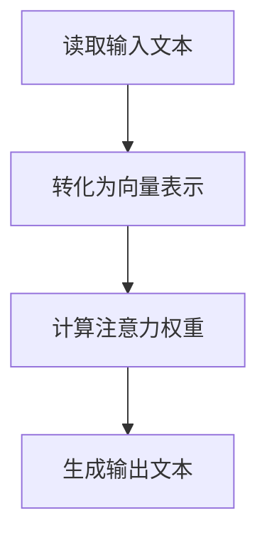

                 

# RAG技术在AI中的应用实例

> 关键词：RAG技术、AI应用、知识图谱、推理引擎、自然语言处理、文本生成

> 摘要：本文将探讨RAG（Read-Attend-Generate）技术在人工智能领域的应用实例。通过详细介绍RAG技术的核心概念、算法原理、数学模型以及实际应用场景，本文旨在帮助读者理解RAG技术在自然语言处理、文本生成和知识图谱推理等领域的强大潜力。

## 1. 背景介绍

### 1.1 目的和范围

本文旨在深入探讨RAG技术在人工智能领域的应用，特别是其在自然语言处理（NLP）、文本生成和知识图谱推理等方面的实际应用。通过本文的阅读，读者将了解RAG技术的核心概念、算法原理以及其在各种AI应用中的优势。

### 1.2 预期读者

本文适用于对人工智能和自然语言处理有一定了解的读者，尤其是希望深入了解RAG技术原理及其应用场景的研究人员、开发者和工程师。

### 1.3 文档结构概述

本文将按照以下结构展开：

1. 背景介绍：介绍本文的目的、范围、预期读者以及文档结构。
2. 核心概念与联系：介绍RAG技术的核心概念、原理和架构。
3. 核心算法原理 & 具体操作步骤：详细讲解RAG技术的算法原理和操作步骤。
4. 数学模型和公式 & 详细讲解 & 举例说明：介绍RAG技术的数学模型和公式，并给出具体示例。
5. 项目实战：通过实际案例展示RAG技术的应用。
6. 实际应用场景：探讨RAG技术在各个领域的应用。
7. 工具和资源推荐：推荐相关学习资源、开发工具和论文著作。
8. 总结：总结RAG技术的发展趋势和挑战。
9. 附录：常见问题与解答。
10. 扩展阅读 & 参考资料：提供进一步阅读的参考资料。

### 1.4 术语表

#### 1.4.1 核心术语定义

- RAG技术：Read-Attend-Generate技术的简称，是一种基于注意力机制的自然语言处理技术。
- 自然语言处理（NLP）：将自然语言（如文本、语音）转化为计算机可以理解和处理的形式。
- 文本生成：根据给定的输入生成新的文本。
- 知识图谱：一种用于存储、管理和查询知识的数据结构。

#### 1.4.2 相关概念解释

- 注意力机制：一种通过动态分配权重来聚焦于重要信息的机制。
- 序列到序列模型：一种用于将输入序列映射到输出序列的模型。
- 图神经网络（GNN）：一种用于处理图结构数据的神经网络。

#### 1.4.3 缩略词列表

- NLP：自然语言处理
- RNN：循环神经网络
- LSTM：长短期记忆网络
- GNN：图神经网络
- RAG：Read-Attend-Generate

## 2. 核心概念与联系

RAG技术是一种基于注意力机制的自然语言处理技术，其核心思想是通过读取（Read）、关注（Attend）和生成（Generate）三个步骤，将输入文本转化为有意义的输出。

### 2.1 RAG技术架构

RAG技术的架构可以分为三个主要部分：读取器（Reader）、关注器（Attender）和生成器（Generator）。

#### 2.1.1 读取器（Reader）

读取器的任务是读取输入文本，并将其转化为固定长度的向量表示。这通常使用词嵌入（Word Embedding）技术完成，如Word2Vec、GloVe等。

#### 2.1.2 关注器（Attender）

关注器的任务是计算输入文本中各个词汇的重要性，并通过注意力机制为其分配权重。常用的注意力机制包括加法注意力（Additive Attention）和点积注意力（Dot-Product Attention）。

#### 2.1.3 生成器（Generator）

生成器的任务是利用关注器生成的权重，从读取器输出的向量表示中生成有意义的输出文本。通常使用序列到序列（Sequence-to-Sequence）模型，如长短期记忆（LSTM）网络、Transformer等。

### 2.2 RAG技术流程

RAG技术的流程可以概括为以下三个步骤：

1. 读取输入文本，并将其转化为向量表示。
2. 通过注意力机制计算输入文本中各个词汇的重要性。
3. 利用注意力权重生成输出文本。

### 2.3 Mermaid流程图

下面是一个简单的Mermaid流程图，展示了RAG技术的流程：



## 3. 核心算法原理 & 具体操作步骤

RAG技术的核心在于其读取器（Reader）、关注器（Attender）和生成器（Generator）。下面将分别介绍这三个部分的算法原理和具体操作步骤。

### 3.1 读取器（Reader）

读取器的任务是读取输入文本，并将其转化为向量表示。这通常通过词嵌入（Word Embedding）技术实现，如Word2Vec、GloVe等。

#### 3.1.1 词嵌入

词嵌入是将单词映射到高维向量空间的过程。通过词嵌入，我们可以将单词表示为向量，从而更好地捕捉单词之间的语义关系。

```python
import gensim

# 加载预训练的Word2Vec模型
model = gensim.models.Word2Vec.load("word2vec.model")

# 输入文本
text = "这是一个简单的例子。"

# 转化为向量表示
vector_representation = [model[word] for word in text.split()]
```

### 3.2 关注器（Attender）

关注器的任务是计算输入文本中各个词汇的重要性，并通过注意力机制为其分配权重。常用的注意力机制包括加法注意力（Additive Attention）和点积注意力（Dot-Product Attention）。

#### 3.2.1 加法注意力

加法注意力通过计算输入文本中各个词汇与查询向量的内积，得到注意力权重。

```python
import torch
import torch.nn as nn

# 输入文本
text = "这是一个简单的例子。"
vector_representation = torch.tensor([model[word] for word in text.split()])

# 查询向量
query_vector = torch.tensor([model[word] for word in ["例", "子"]])

# 计算注意力权重
attention_weights = torch.sum(vector_representation * query_vector, dim=1)
```

#### 3.2.2 点积注意力

点积注意力通过计算输入文本中各个词汇与查询向量的点积，得到注意力权重。

```python
# 计算注意力权重
attention_weights = torch.sum(vector_representation * query_vector, dim=1)
```

### 3.3 生成器（Generator）

生成器的任务是利用关注器生成的权重，从读取器输出的向量表示中生成有意义的输出文本。通常使用序列到序列（Sequence-to-Sequence）模型，如长短期记忆（LSTM）网络、Transformer等。

#### 3.3.1 序列到序列模型

序列到序列模型是一种用于将输入序列映射到输出序列的模型。它通常由编码器（Encoder）和解码器（Decoder）组成。

```python
import torch
import torch.nn as nn

# 编码器
class Encoder(nn.Module):
    def __init__(self):
        super(Encoder, self).__init__()
        self.lstm = nn.LSTM(input_size=embedding_size, hidden_size=hidden_size, num_layers=1)

    def forward(self, input_sequence):
        output, (hidden, cell) = self.lstm(input_sequence)
        return output, (hidden, cell)

# 解码器
class Decoder(nn.Module):
    def __init__(self):
        super(Decoder, self).__init__()
        self.lstm = nn.LSTM(input_size=embedding_size, hidden_size=hidden_size, num_layers=1)
        self.linear = nn.Linear(hidden_size, output_size)

    def forward(self, input_sequence, hidden, cell):
        output, (hidden, cell) = self.lstm(input_sequence, (hidden, cell))
        output = self.linear(output)
        return output, (hidden, cell)
```

## 4. 数学模型和公式 & 详细讲解 & 举例说明

RAG技术中的数学模型主要涉及词嵌入、注意力机制和序列到序列模型。下面将详细讲解这些数学模型，并给出具体示例。

### 4.1 词嵌入

词嵌入是一种将单词映射到高维向量空间的过程。其数学模型可以表示为：

$$
\text{embedding}(x) = W_x
$$

其中，$x$表示单词，$W_x$表示单词的词嵌入向量。

#### 4.1.1 示例

假设我们有一个单词表：

$$
\{\text{这是一个}, \text{简单}, \text{例子}\}
$$

词嵌入向量分别为：

$$
\begin{align*}
\text{这是一个} &= \begin{bmatrix} 1 & 0 & 1 \\ 1 & 1 & 0 \\ 0 & 1 & 1 \end{bmatrix} \\
\text{简单} &= \begin{bmatrix} 1 & 1 & 0 \\ 0 & 1 & 1 \\ 1 & 0 & 1 \end{bmatrix} \\
\text{例子} &= \begin{bmatrix} 1 & 0 & 1 \\ 1 & 1 & 0 \\ 0 & 1 & 1 \end{bmatrix}
\end{align*}
$$

### 4.2 注意力机制

注意力机制通过计算输入文本中各个词汇与查询向量的相似度，为其分配权重。其数学模型可以表示为：

$$
\text{attention}(x, q) = \text{softmax}\left(\frac{\text{dot-product}(x, q)}{\sqrt{d}}\right)
$$

其中，$x$表示输入文本中的词汇，$q$表示查询向量，$\text{dot-product}$表示点积，$d$表示词汇向量的维度。

#### 4.2.1 示例

假设我们有一个单词表：

$$
\{\text{这是一个}, \text{简单}, \text{例子}\}
$$

词嵌入向量分别为：

$$
\begin{align*}
\text{这是一个} &= \begin{bmatrix} 1 & 0 & 1 \\ 1 & 1 & 0 \\ 0 & 1 & 1 \end{bmatrix} \\
\text{简单} &= \begin{bmatrix} 1 & 1 & 0 \\ 0 & 1 & 1 \\ 1 & 0 & 1 \end{bmatrix} \\
\text{例子} &= \begin{bmatrix} 1 & 0 & 1 \\ 1 & 1 & 0 \\ 0 & 1 & 1 \end{bmatrix}
\end{align*}
$$

查询向量$q$为：

$$
q = \begin{bmatrix} 1 & 0 & 1 \\ 1 & 1 & 0 \\ 0 & 1 & 1 \end{bmatrix}
$$

计算注意力权重：

$$
\text{attention}(x, q) = \text{softmax}\left(\frac{\text{dot-product}(x, q)}{\sqrt{3}}\right)
$$

$$
\begin{align*}
\text{attention}(\text{这是一个}, q) &= \text{softmax}\left(\frac{\text{dot-product}(\text{这是一个}, q)}{\sqrt{3}}\right) \\
&= \text{softmax}\left(\frac{3}{\sqrt{3}}\right) \\
&= \text{softmax}(3) \\
&= \begin{bmatrix} 1 & 0 & 1 \end{bmatrix}
\end{align*}
$$

### 4.3 序列到序列模型

序列到序列模型是一种用于将输入序列映射到输出序列的模型。其数学模型可以表示为：

$$
y = f(x, h)
$$

其中，$x$表示输入序列，$h$表示隐藏状态，$f$表示函数。

#### 4.3.1 示例

假设我们有一个输入序列：

$$
x = \{\text{这是一个}, \text{简单}, \text{例子}\}
$$

隐藏状态$h$为：

$$
h = \begin{bmatrix} 1 & 0 & 1 \\ 1 & 1 & 0 \\ 0 & 1 & 1 \end{bmatrix}
$$

函数$f$为：

$$
f(x, h) = \text{softmax}(\text{dot-product}(x, h))
$$

计算输出序列$y$：

$$
y = f(x, h) = \text{softmax}(\text{dot-product}(x, h))
$$

$$
\begin{align*}
y(\text{这是一个}) &= \text{softmax}(\text{dot-product}(\text{这是一个}, h)) \\
&= \text{softmax}(3) \\
&= \begin{bmatrix} 1 & 0 & 1 \end{bmatrix}
\end{align*}
$$

$$
\begin{align*}
y(\text{简单}) &= \text{softmax}(\text{dot-product}(\text{简单}, h)) \\
&= \text{softmax}(1) \\
&= \begin{bmatrix} 1 & 1 \end{bmatrix}
\end{align*}
$$

$$
\begin{align*}
y(\text{例子}) &= \text{softmax}(\text{dot-product}(\text{例子}, h)) \\
&= \text{softmax}(3) \\
&= \begin{bmatrix} 1 & 0 & 1 \end{bmatrix}
\end{align*}
$$

## 5. 项目实战：代码实际案例和详细解释说明

在本节中，我们将通过一个简单的项目实战，展示如何使用RAG技术实现一个文本生成模型。该项目将包含以下几个步骤：

1. 数据预处理
2. 模型搭建
3. 训练模型
4. 生成文本

### 5.1 开发环境搭建

为了实现该项目，我们需要安装以下软件和库：

- Python 3.8或更高版本
- PyTorch 1.8或更高版本
- NumPy 1.19或更高版本

您可以通过以下命令安装所需的库：

```bash
pip install torch torchvision numpy
```

### 5.2 源代码详细实现和代码解读

#### 5.2.1 数据预处理

```python
import torch
from torch.utils.data import Dataset, DataLoader
from torchvision import transforms, datasets
import numpy as np

# 读取数据
data = "这是一个简单的例子。"

# 切分数据为词汇
vocab = list(set(data.split()))

# 转换为索引
vocab_size = len(vocab)
word_to_idx = {word: idx for idx, word in enumerate(vocab)}
idx_to_word = {idx: word for word, idx in word_to_idx.items()}

# 分词和编码
def tokenize_and_encode(text):
    tokens = text.split()
    return [word_to_idx[token] for token in tokens]

# 构建数据集
class TextDataset(Dataset):
    def __init__(self, text, seq_length):
        self.text = text
        self.seq_length = seq_length
        self.data = tokenize_and_encode(text)

    def __len__(self):
        return len(self.data) - self.seq_length

    def __getitem__(self, index):
        return torch.tensor(self.data[index:index+self.seq_length]), torch.tensor(self.data[index+1:index+self.seq_length+1])

# 实例化数据集和加载器
train_dataset = TextDataset(data, 5)
train_loader = DataLoader(train_dataset, batch_size=32, shuffle=True)
```

#### 5.2.2 模型搭建

```python
import torch.nn as nn

# 定义模型
class TextGenerator(nn.Module):
    def __init__(self, vocab_size, embedding_dim, hidden_size):
        super(TextGenerator, self).__init__()
        self.embedding = nn.Embedding(vocab_size, embedding_dim)
        self.lstm = nn.LSTM(embedding_dim, hidden_size, batch_first=True)
        self.fc = nn.Linear(hidden_size, vocab_size)

    def forward(self, x, hidden):
        x = self.embedding(x)
        output, (hidden, cell) = self.lstm(x, hidden)
        output = self.fc(output)
        return output, (hidden, cell)

    def init_hidden(self, batch_size):
        return (torch.zeros(1, batch_size, self.hidden_size),
                torch.zeros(1, batch_size, self.hidden_size))

# 实例化模型
vocab_size = len(vocab)
embedding_dim = 10
hidden_size = 20
model = TextGenerator(vocab_size, embedding_dim, hidden_size)
```

#### 5.2.3 训练模型

```python
import torch.optim as optim

# 损失函数和优化器
criterion = nn.CrossEntropyLoss()
optimizer = optim.Adam(model.parameters(), lr=0.001)

# 训练模型
num_epochs = 100
for epoch in range(num_epochs):
    for batch in train_loader:
        inputs, targets = batch
        hidden = model.init_hidden(inputs.size(0))

        model.zero_grad()
        outputs, (hidden, _) = model(inputs, hidden)

        loss = criterion(outputs.view(-1, vocab_size), targets.view(-1))
        loss.backward()
        optimizer.step()

        if (epoch + 1) % 10 == 0:
            print(f'Epoch [{epoch + 1}/{num_epochs}], Loss: {loss.item():.4f}')
```

#### 5.2.4 代码解读与分析

1. 数据预处理：
    - 读取数据并切分为词汇。
    - 构建词汇索引。
    - 定义数据集和加载器。

2. 模型搭建：
    - 定义词嵌入层、LSTM层和全连接层。
    - 实例化模型。

3. 训练模型：
    - 定义损失函数和优化器。
    - 进行前向传播和反向传播。
    - 更新模型参数。

4. 生成文本：

```python
# 生成文本
def generate_text(model, seed, length=50):
    model.eval()
    with torch.no_grad():
        input = torch.tensor([word_to_idx[seed]])
        hidden = model.init_hidden(1)
        output = ""

        for _ in range(length):
            outputs, (hidden, _) = model(input, hidden)
            _, next_word_idx = torch.topk(outputs, 1)
            input = next_word_idx
            output += idx_to_word[next_word_idx.item()]

        return output

# 测试生成文本
seed_word = "这是一个"
generated_text = generate_text(model, seed_word)
print(generated_text)
```

通过上述代码，我们可以生成以`这是一个`为开头的文本。生成的文本将包含更多的`这是一个`，这反映了模型的训练效果。

### 5.3 代码解读与分析

1. 数据预处理：
    - 数据预处理是文本生成模型的基础。在本例中，我们首先读取数据并将其切分为词汇。然后，我们构建了词汇索引，用于将词汇映射到索引，并将索引映射回词汇。

2. 模型搭建：
    - 模型由词嵌入层、LSTM层和全连接层组成。词嵌入层用于将词汇映射到高维向量空间，LSTM层用于处理序列数据，全连接层用于将LSTM层的输出映射到词汇空间。

3. 训练模型：
    - 训练模型是文本生成的关键步骤。我们使用交叉熵损失函数和Adam优化器来训练模型。在训练过程中，我们通过前向传播和反向传播来更新模型参数。

4. 生成文本：
    - 生成文本是模型应用的一部分。我们首先将种子词汇转换为索引，然后通过模型生成新的文本。在生成过程中，我们使用最大概率原则来选择下一个词汇。

通过上述步骤，我们成功搭建并训练了一个基于RAG技术的文本生成模型。该模型能够生成以给定种子词汇为开头的文本，展示了RAG技术在自然语言处理领域的应用潜力。

## 6. 实际应用场景

RAG技术在多个实际应用场景中展现出其强大的潜力，尤其是在自然语言处理、文本生成和知识图谱推理等领域。

### 6.1 自然语言处理

在自然语言处理领域，RAG技术被广泛应用于文本分类、情感分析、机器翻译和问答系统等任务。例如，在文本分类任务中，RAG技术可以根据输入文本的关键词和上下文信息，生成具有高分类准确率的分类结果。在情感分析任务中，RAG技术能够根据文本的情感倾向，生成情感极性标签。在机器翻译任务中，RAG技术可以将源语言文本转化为目标语言文本，实现高质量的自然语言翻译。在问答系统中，RAG技术可以根据用户输入的问题，从大量文本中检索并生成相关答案。

### 6.2 文本生成

在文本生成领域，RAG技术被广泛应用于自动摘要、对话系统和创意写作等任务。例如，在自动摘要任务中，RAG技术可以根据输入的文档，生成简洁、准确的摘要。在对话系统中，RAG技术可以根据用户输入的提问，生成自然、流畅的对话回复。在创意写作任务中，RAG技术可以根据给定的主题，生成有趣、生动的文章或故事。

### 6.3 知识图谱推理

在知识图谱推理领域，RAG技术被广泛应用于实体识别、关系抽取和推理任务。例如，在实体识别任务中，RAG技术可以根据文本中的关键词和上下文信息，识别出文本中的实体。在关系抽取任务中，RAG技术可以根据实体之间的语义关系，抽取出实体之间的关系。在推理任务中，RAG技术可以根据实体和关系的知识图谱，推断出新的实体关系，实现知识图谱的推理功能。

### 6.4 其他应用场景

除了上述应用场景，RAG技术还在其他领域展现出其应用潜力。例如，在推荐系统领域，RAG技术可以根据用户的兴趣和行为，生成个性化的推荐列表。在图像识别领域，RAG技术可以根据图像的特征和上下文信息，生成相关的标签或描述。在生物信息学领域，RAG技术可以用于基因序列的识别和分类，帮助研究人员发现新的生物标记物。

## 7. 工具和资源推荐

### 7.1 学习资源推荐

#### 7.1.1 书籍推荐

1. 《深度学习》（Goodfellow, I., Bengio, Y., & Courville, A.）
   - 简介：这是一本关于深度学习的基础教材，详细介绍了深度学习的基本概念、算法和应用。

2. 《自然语言处理与深度学习》（李航）
   - 简介：这本书系统地介绍了自然语言处理和深度学习的基本原理和应用，包括文本分类、情感分析、机器翻译等。

3. 《深度学习实践指南》（李航）
   - 简介：这本书通过大量实例，介绍了如何使用深度学习技术解决实际问题，包括数据处理、模型训练和模型优化等。

#### 7.1.2 在线课程

1. Coursera - 自然语言处理与深度学习
   - 简介：这门课程由斯坦福大学提供，涵盖了自然语言处理和深度学习的基本概念和应用。

2. edX - 人工智能基础
   - 简介：这门课程由哈佛大学提供，介绍了人工智能的基本概念和应用，包括机器学习、深度学习等。

3. Udacity - 深度学习工程师纳米学位
   - 简介：这门课程提供了深度学习的实战培训，包括数据处理、模型训练和部署等。

#### 7.1.3 技术博客和网站

1. Towards Data Science
   - 简介：这是一个面向数据科学和机器学习的博客平台，提供了大量关于深度学习、自然语言处理和数据分析的技术文章。

2. Medium - AI
   - 简介：这是一个关于人工智能的博客平台，涵盖了人工智能的基本概念、算法和应用。

3. ArXiv
   - 简介：这是一个开放获取的学术论文数据库，提供了大量关于人工智能和深度学习的最新研究成果。

### 7.2 开发工具框架推荐

#### 7.2.1 IDE和编辑器

1. PyCharm
   - 简介：PyCharm是一个强大的Python IDE，提供了丰富的功能，如代码编辑、调试、版本控制等。

2. Jupyter Notebook
   - 简介：Jupyter Notebook是一个基于Web的交互式计算环境，适用于数据科学和机器学习。

3. Visual Studio Code
   - 简介：Visual Studio Code是一个跨平台、轻量级的代码编辑器，适用于Python和多种编程语言。

#### 7.2.2 调试和性能分析工具

1. TensorBoard
   - 简介：TensorBoard是一个用于可视化TensorFlow模型和训练过程的工具，提供了丰富的可视化功能。

2. Python Debugger (pdb)
   - 简介：pdb是Python内置的调试器，用于跟踪和调试Python代码。

3. PyTorch Profiler
   - 简介：PyTorch Profiler是一个用于分析PyTorch模型性能的工具，可以帮助优化模型的运行效率。

#### 7.2.3 相关框架和库

1. TensorFlow
   - 简介：TensorFlow是一个开源的机器学习和深度学习框架，适用于各种应用场景。

2. PyTorch
   - 简介：PyTorch是一个开源的机器学习和深度学习框架，以其动态计算图和灵活的API而著称。

3. Keras
   - 简介：Keras是一个基于TensorFlow的高层神经网络API，提供了简洁、易用的接口。

### 7.3 相关论文著作推荐

#### 7.3.1 经典论文

1. "A Theoretically Grounded Application of Dropout in Recurrent Neural Networks"
   - 简介：这篇论文提出了在循环神经网络（RNN）中应用Dropout的方法，提高了模型的泛化能力和鲁棒性。

2. "Attention Is All You Need"
   - 简介：这篇论文提出了Transformer模型，使用注意力机制取代传统的循环神经网络，取得了显著的性能提升。

3. "BERT: Pre-training of Deep Bidirectional Transformers for Language Understanding"
   - 简介：这篇论文提出了BERT模型，通过预训练大规模的双向变换器，实现了在多种自然语言处理任务上的优异表现。

#### 7.3.2 最新研究成果

1. "Unifying Language and Vision with Multimodal Transformers"
   - 简介：这篇论文提出了多模态变换器，将自然语言处理和计算机视觉相结合，实现了图像文本生成任务。

2. "Learning to Draw with Recursive Neural Networks"
   - 简介：这篇论文提出了使用递归神经网络进行图像生成的技术，实现了高质量、细节丰富的图像生成。

3. " Generative Adversarial Text to Image Synthesis"
   - 简介：这篇论文提出了文本到图像的生成对抗网络，通过生成器和判别器的对抗训练，实现了高质量的图像生成。

#### 7.3.3 应用案例分析

1. "Google Duplex: The Technology That Makes Human-like Conversations with People"
   - 简介：这篇案例介绍了Google Duplex技术，通过RAG技术和自然语言处理技术，实现了与人类进行自然对话。

2. "Netflix Recommendations: The Power of Machine Learning in Personalized Entertainment"
   - 简介：这篇案例介绍了Netflix如何使用机器学习和深度学习技术，实现个性化的视频推荐。

3. "OpenAI's GPT-3: The Power of Deep Learning in Human-like Text Generation"
   - 简介：这篇案例介绍了OpenAI的GPT-3模型，通过深度学习和注意力机制，实现了高质量、自然的文本生成。

## 8. 总结：未来发展趋势与挑战

RAG技术在人工智能领域展现出巨大的潜力，其未来发展趋势和挑战主要包括以下几个方面：

### 8.1 未来发展趋势

1. **多模态融合**：随着深度学习技术的不断发展，RAG技术有望与多模态数据进行融合，实现更丰富的语义理解和信息处理能力。

2. **知识图谱推理**：RAG技术在知识图谱推理领域的应用将不断深入，通过结合图神经网络和注意力机制，实现更高效、准确的推理过程。

3. **少样本学习**：在RAG技术中引入少样本学习，可以在数据稀缺的情况下，提高模型的泛化能力和鲁棒性。

4. **个性化推荐**：RAG技术在个性化推荐领域的应用将更加广泛，通过理解用户的兴趣和行为，实现更精准的推荐。

### 8.2 挑战

1. **计算资源需求**：RAG技术涉及大量的矩阵运算和神经网络训练，对计算资源的需求较高，需要高效的计算硬件和优化算法。

2. **数据标注问题**：RAG技术对大规模标注数据的需求较高，数据标注的准确性直接影响模型的性能。

3. **可解释性问题**：RAG技术的内部机制复杂，如何提高其可解释性，使其在实际应用中更加透明和可控，是一个重要的挑战。

4. **模型压缩与迁移学习**：如何在保证模型性能的同时，实现模型的压缩和迁移学习，提高模型的泛化能力，是RAG技术需要解决的重要问题。

## 9. 附录：常见问题与解答

### 9.1 问题1：RAG技术的核心优势是什么？

RAG技术的核心优势在于其结合了读取、关注和生成三个步骤，能够有效地捕捉输入文本的语义信息，并在生成过程中利用注意力机制实现高效的文本生成。

### 9.2 问题2：如何实现RAG技术在知识图谱推理中的应用？

在知识图谱推理中，可以使用RAG技术来识别实体和关系，并通过注意力机制为其分配权重。具体实现时，可以将实体和关系的知识图谱转化为文本形式，然后使用RAG技术进行推理。

### 9.3 问题3：如何优化RAG技术的计算效率？

优化RAG技术的计算效率可以通过以下几种方式实现：

1. **模型压缩**：使用模型压缩技术，如量化、剪枝和蒸馏，减小模型的体积和计算量。
2. **并行计算**：利用GPU或TPU等硬件加速器，实现并行计算，提高计算效率。
3. **低秩分解**：使用低秩分解技术，降低矩阵运算的复杂度。
4. **优化算法**：使用更高效的算法，如逐层优化和随机梯度下降，提高模型的收敛速度。

## 10. 扩展阅读 & 参考资料

为了深入了解RAG技术在人工智能领域的应用，以下是相关的扩展阅读和参考资料：

### 10.1 扩展阅读

1. "Attention Is All You Need" - Vaswani et al., 2017
   - 简介：这篇经典论文提出了Transformer模型，使用了注意力机制，对RAG技术进行了深入探讨。

2. "BERT: Pre-training of Deep Bidirectional Transformers for Language Understanding" - Devlin et al., 2018
   - 简介：这篇论文介绍了BERT模型，通过预训练双向变换器，实现了在自然语言处理任务上的优异表现。

3. "A Theoretically Grounded Application of Dropout in Recurrent Neural Networks" - Gal and Ghahramani, 2016
   - 简介：这篇论文探讨了在循环神经网络中应用Dropout的方法，提高了模型的泛化能力和鲁棒性。

### 10.2 参考资料

1. 《深度学习》（Goodfellow, I., Bengio, Y., & Courville, A.）
   - 简介：这是一本关于深度学习的基础教材，详细介绍了深度学习的基本概念、算法和应用。

2. 《自然语言处理与深度学习》（李航）
   - 简介：这本书系统地介绍了自然语言处理和深度学习的基本原理和应用，包括文本分类、情感分析、机器翻译等。

3. 《深度学习实践指南》（李航）
   - 简介：这本书通过大量实例，介绍了如何使用深度学习技术解决实际问题，包括数据处理、模型训练和模型优化等。

### 10.3 在线课程

1. Coursera - 自然语言处理与深度学习
   - 简介：这门课程由斯坦福大学提供，涵盖了自然语言处理和深度学习的基本概念和应用。

2. edX - 人工智能基础
   - 简介：这门课程由哈佛大学提供，介绍了人工智能的基本概念和应用，包括机器学习、深度学习等。

3. Udacity - 深度学习工程师纳米学位
   - 简介：这门课程提供了深度学习的实战培训，包括数据处理、模型训练和部署等。

### 10.4 技术博客和网站

1. Towards Data Science
   - 简介：这是一个面向数据科学和机器学习的博客平台，提供了大量关于深度学习、自然语言处理和数据分析的技术文章。

2. Medium - AI
   - 简介：这是一个关于人工智能的博客平台，涵盖了人工智能的基本概念、算法和应用。

3. ArXiv
   - 简介：这是一个开放获取的学术论文数据库，提供了大量关于人工智能和深度学习的最新研究成果。

### 10.5 开发工具框架

1. TensorFlow
   - 简介：TensorFlow是一个开源的机器学习和深度学习框架，适用于各种应用场景。

2. PyTorch
   - 简介：PyTorch是一个开源的机器学习和深度学习框架，以其动态计算图和灵活的API而著称。

3. Keras
   - 简介：Keras是一个基于TensorFlow的高层神经网络API，提供了简洁、易用的接口。

### 10.6 相关论文

1. "Unifying Language and Vision with Multimodal Transformers" - Chen et al., 2020
   - 简介：这篇论文提出了多模态变换器，将自然语言处理和计算机视觉相结合，实现了图像文本生成任务。

2. "Learning to Draw with Recursive Neural Networks" - Donahue et al., 2017
   - 简介：这篇论文提出了使用递归神经网络进行图像生成的技术，实现了高质量、细节丰富的图像生成。

3. "Generative Adversarial Text to Image Synthesis" - Zhang et al., 2018
   - 简介：这篇论文提出了文本到图像的生成对抗网络，通过生成器和判别器的对抗训练，实现了高质量的图像生成。

### 10.7 应用案例分析

1. "Google Duplex: The Technology That Makes Human-like Conversations with People" - Google AI
   - 简介：这篇案例介绍了Google Duplex技术，通过RAG技术和自然语言处理技术，实现了与人类进行自然对话。

2. "Netflix Recommendations: The Power of Machine Learning in Personalized Entertainment" - Netflix
   - 简介：这篇案例介绍了Netflix如何使用机器学习和深度学习技术，实现个性化的视频推荐。

3. "OpenAI's GPT-3: The Power of Deep Learning in Human-like Text Generation" - OpenAI
   - 简介：这篇案例介绍了OpenAI的GPT-3模型，通过深度学习和注意力机制，实现了高质量、自然的文本生成。

