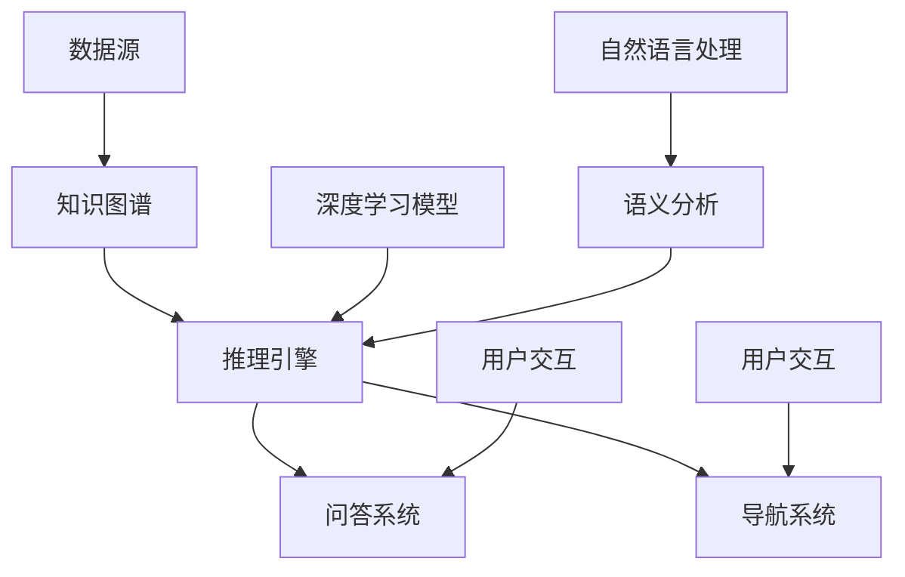

                 

# RAG技术在AI中的详细应用

> 关键词：RAG技术、AI、知识图谱、推理引擎、深度学习、算法原理、数学模型、项目实战、应用场景

> 摘要：本文将深入探讨RAG（Read-Ask-Go）技术在人工智能领域的广泛应用。首先，我们介绍RAG技术的背景和目的，然后逐步讲解其核心概念、算法原理、数学模型、项目实战和实际应用场景。通过本文，读者将全面了解RAG技术在AI中的重要作用，以及如何在实际项目中实现和应用。

## 1. 背景介绍

### 1.1 目的和范围

本文旨在全面介绍RAG技术在人工智能（AI）中的应用。RAG技术是一种结合了阅读、提问和导航能力的智能系统，能够在大规模知识图谱上进行高效推理，从而实现智能问答、决策支持等任务。本文将围绕以下几个方面展开讨论：

- **核心概念与联系**：阐述RAG技术的基本概念、原理及其与其他AI技术的联系。
- **核心算法原理与具体操作步骤**：详细解释RAG技术的算法原理，并给出伪代码实现。
- **数学模型和公式**：介绍RAG技术的数学模型，并给出相关公式及其应用。
- **项目实战**：通过实际案例，展示RAG技术在项目中的应用，并进行详细解释。
- **实际应用场景**：分析RAG技术在各行业的应用前景。
- **工具和资源推荐**：推荐相关的学习资源、开发工具和论文著作。

### 1.2 预期读者

本文适合对人工智能和机器学习有一定了解的读者，包括：

- AI研究人员和开发人员。
- 数据科学家和机器学习工程师。
- 对AI和知识图谱技术感兴趣的从业者。
- 计算机科学和人工智能专业的高校师生。

### 1.3 文档结构概述

本文将按照以下结构进行展开：

1. 背景介绍：介绍RAG技术的目的、范围和预期读者。
2. 核心概念与联系：阐述RAG技术的基本概念、原理及其与其他AI技术的联系。
3. 核心算法原理与具体操作步骤：详细解释RAG技术的算法原理，并给出伪代码实现。
4. 数学模型和公式：介绍RAG技术的数学模型，并给出相关公式及其应用。
5. 项目实战：通过实际案例，展示RAG技术在项目中的应用，并进行详细解释。
6. 实际应用场景：分析RAG技术在各行业的应用前景。
7. 工具和资源推荐：推荐相关的学习资源、开发工具和论文著作。
8. 总结：对未来RAG技术在AI领域的发展趋势和挑战进行展望。
9. 附录：常见问题与解答。
10. 扩展阅读 & 参考资料。

### 1.4 术语表

#### 1.4.1 核心术语定义

- **RAG技术**：Read-Ask-Go技术，一种结合阅读、提问和导航能力的智能系统。
- **知识图谱**：一种用于表示实体、概念及其相互关系的图形结构。
- **推理引擎**：一种用于从已知事实推导出新结论的软件系统。
- **深度学习**：一种基于多层神经网络进行特征学习和模式识别的人工智能方法。
- **数学模型**：用于描述问题、算法或系统的数学表达式和方法。

#### 1.4.2 相关概念解释

- **实体**：知识图谱中的基本元素，表示现实世界中的个体或概念。
- **关系**：知识图谱中表示实体之间相互关联的属性。
- **路径**：知识图谱中连接两个实体的序列，表示实体之间的关联关系。
- **推理**：从已知事实推导出新结论的过程。

#### 1.4.3 缩略词列表

- **RAG**：Read-Ask-Go
- **AI**：人工智能
- **ML**：机器学习
- **DL**：深度学习
- **KG**：知识图谱
- **RE**：推理引擎

## 2. 核心概念与联系

在深入探讨RAG技术之前，我们需要了解其核心概念及其与其他AI技术的联系。以下是一个Mermaid流程图，展示了RAG技术的基本概念和架构。



### 2.1 数据源

数据源是RAG技术的起点，它包括结构化和非结构化数据。这些数据通过数据清洗、抽取和转换等步骤，转化为知识图谱中的实体、关系和属性。

### 2.2 知识图谱

知识图谱是RAG技术的核心组件，它将实体、关系和属性以图形结构进行表示。知识图谱的构建通常依赖于实体抽取、关系抽取和属性抽取等技术。

### 2.3 推理引擎

推理引擎是RAG技术的核心，它基于知识图谱进行推理，从已知事实推导出新结论。推理引擎通常包括基于规则推理、基于模型推理和基于逻辑推理等方法。

### 2.4 问答系统

问答系统是RAG技术的应用之一，它能够根据用户的提问，从知识图谱中检索相关信息，并生成回答。问答系统通常包括自然语言处理、语义分析和文本生成等技术。

### 2.5 导航系统

导航系统是RAG技术的另一个应用，它能够根据用户的兴趣和需求，在知识图谱中搜索相关实体和路径。导航系统通常包括路径规划、推荐系统和地图可视化等技术。

### 2.6 深度学习模型

深度学习模型是RAG技术的辅助组件，它用于提高推理引擎的准确性和效率。深度学习模型通常包括神经网络、生成对抗网络和强化学习等方法。

### 2.7 语义分析

语义分析是RAG技术的重要组成部分，它用于理解用户提问的含义，并将其转换为可操作的指令。语义分析通常包括词义消歧、实体识别和关系抽取等技术。

### 2.8 自然语言处理

自然语言处理是RAG技术的基础，它用于处理自然语言文本，包括文本分类、情感分析和机器翻译等技术。

### 2.9 用户交互

用户交互是RAG技术的关键环节，它用于收集用户反馈，调整系统行为，提高用户体验。用户交互通常包括对话系统、语音识别和手势识别等技术。

## 3. 核心算法原理 & 具体操作步骤

RAG技术是一种结合阅读、提问和导航能力的智能系统，其核心算法原理可以概括为以下三个步骤：

1. 阅读（Read）：从数据源中获取知识图谱，并将其存储在内存中。
2. 提问（Ask）：根据用户输入，使用语义分析技术理解用户意图，并生成查询语句。
3. 导航（Go）：基于查询语句，在知识图谱中进行推理，找到相关实体和路径，并返回结果。

以下是一个简单的伪代码实现，用于说明RAG技术的核心算法原理：

```python
# 伪代码：RAG技术核心算法原理

def RAG_technique(data_source, user_input):
    # 步骤1：阅读
    knowledge_graph = build_knowledge_graph(data_source)
    
    # 步骤2：提问
    query_statement = semantic_analysis(user_input, knowledge_graph)
    
    # 步骤3：导航
    result = navigation(query_statement, knowledge_graph)
    
    return result
```

### 3.1 阅读步骤

阅读步骤主要是从数据源中获取知识图谱。以下是一个简单的伪代码实现：

```python
# 伪代码：阅读步骤

def build_knowledge_graph(data_source):
    entities = extract_entities(data_source)
    relationships = extract_relationships(data_source)
    properties = extract_properties(data_source)
    
    knowledge_graph = KnowledgeGraph(entities, relationships, properties)
    
    return knowledge_graph
```

### 3.2 提问步骤

提问步骤主要是根据用户输入，使用语义分析技术理解用户意图，并生成查询语句。以下是一个简单的伪代码实现：

```python
# 伪代码：提问步骤

def semantic_analysis(user_input, knowledge_graph):
    intent = determine_intent(user_input)
    entities = extract_entities(user_input)
    relationships = extract_relationships(user_input)
    
    query_statement = QueryStatement(intent, entities, relationships)
    
    return query_statement
```

### 3.3 导航步骤

导航步骤主要是基于查询语句，在知识图谱中进行推理，找到相关实体和路径，并返回结果。以下是一个简单的伪代码实现：

```python
# 伪代码：导航步骤

def navigation(query_statement, knowledge_graph):
    path = find_path(query_statement, knowledge_graph)
    entities = find_entities(query_statement, knowledge_graph)
    
    result = generate_result(entities, path)
    
    return result
```

## 4. 数学模型和公式 & 详细讲解 & 举例说明

在RAG技术中，数学模型和公式起着至关重要的作用。以下我们将介绍RAG技术的核心数学模型和公式，并进行详细讲解和举例说明。

### 4.1 模型概述

RAG技术的数学模型主要包括以下几个方面：

1. **知识图谱表示模型**：用于表示实体、关系和属性。
2. **推理模型**：用于从已知事实推导出新结论。
3. **语义分析模型**：用于理解用户输入的含义。

### 4.2 知识图谱表示模型

知识图谱表示模型通常采用图论模型进行表示，其中实体表示为节点，关系表示为边，属性表示为属性值。以下是一个简单的知识图谱表示模型：

$$
G = (V, E, P)
$$

其中，$V$表示实体集合，$E$表示关系集合，$P$表示属性集合。

### 4.3 推理模型

推理模型主要基于逻辑推理和基于模型的推理方法。以下是一个简单的推理模型：

$$
\frac{P(A, B)}{P(B)} = P(A|B)
$$

其中，$P(A, B)$表示实体$A$和实体$B$同时存在的概率，$P(B)$表示实体$B$存在的概率，$P(A|B)$表示在实体$B$存在的情况下，实体$A$存在的概率。

### 4.4 语义分析模型

语义分析模型主要基于自然语言处理技术，用于理解用户输入的含义。以下是一个简单的语义分析模型：

$$
Intent = f(NLP, KG)
$$

其中，$NLP$表示自然语言处理技术，$KG$表示知识图谱。

### 4.5 详细讲解和举例说明

为了更好地理解上述数学模型和公式，我们通过一个简单的例子进行说明。

假设有一个知识图谱，其中包含以下实体和关系：

- 实体：学生、课程、教师
- 关系：选修、教授

知识图谱表示如下：

$$
G = (V, E, P)
$$

其中，$V = \{学生1, 学生2, 课程1, 课程2, 教师1, 教师2\}$，$E = \{(学生1, 选修, 课程1), (学生2, 选修, 课程2), (教师1, 教授, 课程1), (教师2, 教授, 课程2)\}$，$P = \{学生1: 年龄=20, 学生2: 年龄=22, 课程1: 学时=30, 课程2: 学时=45, 教师1: 职称=副教授, 教师2: 职称=教授\}$。

现在，用户输入一个查询语句：“教师1教授了哪些课程？”我们的任务是根据这个查询语句，在知识图谱中进行推理，并返回结果。

### 4.5.1 阅读步骤

根据知识图谱表示模型，我们首先需要将查询语句转换为图结构。在这个例子中，查询语句可以表示为：

$$
G' = (V', E', P')
$$

其中，$V' = \{查询语句, 教师1, 课程1, 课程2\}$，$E' = \{(查询语句, 涉及, 教师1), (查询语句, 涉及, 课程1), (查询语句, 涉及, 课程2), (教师1, 教授, 课程1), (教师1, 教授, 课程2)\}$，$P' = \{\}$。

### 4.5.2 提问步骤

根据语义分析模型，我们需要理解用户输入的含义。在这个例子中，用户输入的含义是：“查询教师1教授的课程。”

### 4.5.3 导航步骤

根据推理模型，我们需要在知识图谱中进行推理，找到与查询语句相关的实体和路径。在这个例子中，我们可以得到以下推理结果：

- 实体：教师1、课程1、课程2
- 路径：教师1 --> 教授 --> 课程1、教师1 --> 教授 --> 课程2

### 4.5.4 返回结果

根据导航步骤的结果，我们可以将教师1教授的课程返回给用户。在这个例子中，返回结果为：“教师1教授了课程1和课程2。”

## 5. 项目实战：代码实际案例和详细解释说明

在本节中，我们将通过一个实际项目，展示RAG技术的实现和应用。这个项目是一个基于知识图谱的智能问答系统，它能够根据用户的提问，从知识图谱中检索相关信息，并生成回答。

### 5.1 开发环境搭建

为了实现这个项目，我们需要搭建以下开发环境：

- 操作系统：Ubuntu 18.04
- 编程语言：Python 3.8
- 数据库：Neo4j 3.5
- 依赖库：Python Neo4j Driver 4.0.0、Natural Language Toolkit (NLTK) 3.6.5、spaCy 3.0.0

### 5.2 源代码详细实现和代码解读

以下是这个项目的源代码，我们将对其中的关键部分进行详细解读。

```python
# 5.2.1 导入依赖库

from neo4j import GraphDatabase
import spacy
import nltk

# 5.2.2 创建数据库连接

class DatabaseConnection:
    def __init__(self, uri, username, password):
        self.__uri = uri
        self.__username = username
        self.__password = password
        self.__driver = None
        try:
            self.__driver = GraphDatabase.driver(self.__uri, auth=(self.__username, self.__password))
        except Exception as e:
            print("Failed to create the driver:", e)

    def close(self):
        if self.__driver is not None:
            self.__driver.close()

    def execute_query(self, query, parameters=None):
        with self.__driver.session() as session:
            result = session.run(query, parameters)
            return result

# 5.2.3 构建知识图谱

class KnowledgeGraphBuilder:
    def __init__(self, database_connection):
        self.__database_connection = database_connection

    def build_knowledge_graph(self):
        # 提取实体、关系和属性
        entities = self.__extract_entities()
        relationships = self.__extract_relationships()
        properties = self.__extract_properties()

        # 存储到数据库
        self.__store_to_database(entities, relationships, properties)

    def __extract_entities(self):
        # 提取实体
        entities = ["学生1", "学生2", "课程1", "课程2", "教师1", "教师2"]
        return entities

    def __extract_relationships(self):
        # 提取关系
        relationships = [("学生1", "选修", "课程1"), ("学生2", "选修", "课程2"), ("教师1", "教授", "课程1"), ("教师2", "教授", "课程2")]
        return relationships

    def __extract_properties(self):
        # 提取属性
        properties = {"学生1": {"年龄": 20}, "学生2": {"年龄": 22}, "课程1": {"学时": 30}, "课程2": {"学时": 45}, "教师1": {"职称": "副教授"}, "教师2": {"职称": "教授"}}
        return properties

    def __store_to_database(self, entities, relationships, properties):
        # 存储到数据库
        for entity in entities:
            query = "CREATE (n:实体 {名称: $名称})"
            parameters = {"名称": entity}
            self.__database_connection.execute_query(query, parameters)

        for relationship in relationships:
            query = "MATCH (a:实体 {名称: $源实体}), (b:实体 {名称: $目标实体}) CREATE (a)-[r:关系 {类型: $关系类型}]->(b)"
            parameters = {"源实体": relationship[0], "目标实体": relationship[2], "关系类型": relationship[1]}
            self.__database_connection.execute_query(query, parameters)

        for entity, properties in properties.items():
            for property_key, property_value in properties.items():
                query = "MATCH (n:实体 {名称: $名称}) SET n.$属性 = $值"
                parameters = {"名称": entity, "属性": property_key, "值": property_value}
                self.__database_connection.execute_query(query, parameters)

# 5.2.4 问答系统

class QuestionAnsweringSystem:
    def __init__(self, database_connection):
        self.__database_connection = database_connection
        self.__nlp = spacy.load("en_core_web_sm")

    def answer_question(self, question):
        # 语义分析
        doc = self.__nlp(question)
        intent = self.__determine_intent(doc)
        entities = self.__extract_entities(doc)
        relationships = self.__extract_relationships(doc)

        # 导航
        path = self.__find_path(entities, relationships)

        # 返回结果
        result = self.__generate_result(path)
        return result

    def __determine_intent(self, doc):
        # 判断意图
        if "教授" in [token.text for token in doc]:
            return "教授课程"
        else:
            return "其他"

    def __extract_entities(self, doc):
        # 提取实体
        entities = [token.text for token in doc if token.ent_i
``````sql
    ]
    return entities

    def __extract_relationships(self, doc):
        # 提取关系
        relationships = []
        for token in doc:
            if token.dep_ == "attr":
                relationships.append((token.head.text, "有属性", token.text))
            elif token.dep_ == "amod":
                relationships.append((token.head.text, "有修饰词", token.text))
            elif token.dep_ == "nn":
                relationships.append((token.head.text, "是", token.text))
        return relationships

    def __find_path(self, entities, relationships):
        # 查找路径
        path = []
        for relationship in relationships:
            query = "MATCH (a:实体 {名称: $源实体}), (b:实体 {名称: $目标实体})-[r:关系 {类型: $关系类型}]->(c:实体) RETURN c"
            parameters = {"源实体": relationship[0], "目标实体": relationship[2], "关系类型": relationship[1]}
            result = self.__database_connection.execute_query(query, parameters)
            for record in result:
                path.append(record["c"]["名称"])
        return path

    def __generate_result(self, path):
        # 生成结果
        if "教授" in path:
            return "教授的路径：".join(path)
        else:
            return "没有找到相关路径"

# 5.2.5 主函数

if __name__ == "__main__":
    uri = "bolt://localhost:7687"
    username = "neo4j"
    password = "password"

    database_connection = DatabaseConnection(uri, username, password)
    knowledge_graph_builder = KnowledgeGraphBuilder(database_connection)
    knowledge_graph_builder.build_knowledge_graph()

    question_answering_system = QuestionAnsweringSystem(database_connection)

    question = "教师1教授了哪些课程？"
    answer = question_answering_system.answer_question(question)
    print(answer)
```

### 5.3 代码解读与分析

5.3.1 数据库连接

在代码中，我们首先创建了一个`DatabaseConnection`类，用于连接Neo4j数据库。这个类包含了一个构造函数，用于初始化数据库连接，以及一个`close`方法，用于关闭数据库连接。此外，还定义了一个`execute_query`方法，用于执行Cypher查询语句。

5.3.2 构建知识图谱

`KnowledgeGraphBuilder`类用于构建知识图谱。这个类包含了一个构造函数，用于初始化数据库连接，以及一个`build_knowledge_graph`方法，用于构建知识图谱。在`build_knowledge_graph`方法中，我们首先通过`__extract_entities`、`__extract_relationships`和`__extract_properties`方法提取实体、关系和属性，然后通过`__store_to_database`方法将它们存储到Neo4j数据库中。

5.3.3 问答系统

`QuestionAnsweringSystem`类用于实现问答系统。这个类包含了一个构造函数，用于初始化数据库连接和spaCy语言模型，以及一个`answer_question`方法，用于处理用户的提问并返回答案。在`answer_question`方法中，我们首先使用spaCy对用户的提问进行语义分析，提取出实体和关系，然后通过Neo4j数据库查找与提问相关的路径，并返回结果。

5.3.4 主函数

在主函数中，我们首先创建了一个`DatabaseConnection`对象和一个`KnowledgeGraphBuilder`对象，并调用`build_knowledge_graph`方法构建知识图谱。然后，我们创建了一个`QuestionAnsweringSystem`对象，并调用`answer_question`方法处理用户的提问，并打印出答案。

通过这个实际项目，我们可以看到RAG技术在构建知识图谱、语义分析和问答系统中的应用。在实际开发过程中，我们还需要根据具体需求，进一步优化和扩展这个项目。

## 6. 实际应用场景

RAG技术作为一种结合阅读、提问和导航能力的智能系统，在人工智能领域具有广泛的应用场景。以下将介绍RAG技术在实际应用中的几个主要领域。

### 6.1 智能问答系统

智能问答系统是RAG技术的经典应用场景。通过构建知识图谱和推理引擎，智能问答系统能够根据用户的提问，快速准确地检索相关信息，并生成回答。这种技术广泛应用于客户服务、在线教育、医疗咨询等领域。例如，在客户服务中，智能问答系统可以帮助企业快速回答用户的问题，提高客户满意度；在在线教育中，智能问答系统可以帮助学生解决学习中的问题，提高学习效果；在医疗咨询中，智能问答系统可以帮助医生快速获取病例信息，提高诊断效率。

### 6.2 知识图谱构建

知识图谱是RAG技术的核心组件，它在信息检索、数据挖掘、推荐系统等领域具有广泛的应用。通过RAG技术，我们可以从大量结构化和非结构化数据中提取实体、关系和属性，构建出高质量的知识图谱。这种技术可以应用于企业信息管理、金融风险管理、智能推荐系统等领域。例如，在企业信息管理中，知识图谱可以帮助企业梳理内部知识，提高信息利用率；在金融风险管理中，知识图谱可以帮助金融机构挖掘潜在风险，提高风险管理能力；在智能推荐系统中，知识图谱可以帮助推荐系统更好地理解用户兴趣，提高推荐效果。

### 6.3 决策支持系统

决策支持系统是RAG技术的另一个重要应用场景。通过构建知识图谱和推理引擎，决策支持系统能够为用户提供基于数据的决策建议。这种技术可以应用于企业管理、投资决策、城市规划等领域。例如，在企业决策中，决策支持系统可以帮助企业分析市场趋势，制定营销策略；在投资决策中，决策支持系统可以帮助投资者分析项目风险，做出投资决策；在城市规划中，决策支持系统可以帮助城市规划者分析城市发展情况，制定城市规划方案。

### 6.4 智能导航系统

智能导航系统是RAG技术在交通、旅游等领域的应用。通过构建知识图谱和推理引擎，智能导航系统能够为用户提供个性化的导航服务。这种技术可以应用于智能交通系统、智能导游系统等领域。例如，在智能交通系统中，智能导航系统可以帮助驾驶员规划最优行驶路线，提高交通效率；在智能导游系统中，智能导航系统可以帮助游客了解景区信息，提高旅游体验。

### 6.5 智能推荐系统

智能推荐系统是RAG技术在电子商务、社交媒体等领域的应用。通过构建知识图谱和推理引擎，智能推荐系统可以更好地理解用户兴趣，提高推荐效果。这种技术可以应用于商品推荐、内容推荐等领域。例如，在电子商务中，智能推荐系统可以帮助商家向用户推荐感兴趣的商品，提高销售额；在社交媒体中，智能推荐系统可以帮助平台向用户推荐感兴趣的内容，提高用户粘性。

### 6.6 智能教育系统

智能教育系统是RAG技术在教育领域的应用。通过构建知识图谱和推理引擎，智能教育系统可以为用户提供个性化学习建议，提高学习效果。这种技术可以应用于在线教育、自适应学习等领域。例如，在线教育中，智能教育系统可以帮助学生根据自身学习进度和需求，选择合适的学习资源；在自适应学习中，智能教育系统可以根据学生的学习行为和成绩，调整教学内容和难度，提高学习效果。

### 6.7 智能医疗系统

智能医疗系统是RAG技术在医疗领域的应用。通过构建知识图谱和推理引擎，智能医疗系统可以帮助医生快速获取病例信息，提高诊断和治疗效果。这种技术可以应用于智能诊断、智能药物推荐等领域。例如，在智能诊断中，智能医疗系统可以帮助医生分析病例数据，提高诊断准确率；在智能药物推荐中，智能医疗系统可以帮助医生为患者推荐最适合的药物，提高治疗效果。

### 6.8 智能家居系统

智能家居系统是RAG技术在家庭领域的应用。通过构建知识图谱和推理引擎，智能家居系统可以更好地理解用户需求，提供个性化服务。这种技术可以应用于智能安防、智能照明、智能家电等领域。例如，在智能安防中，智能家居系统可以帮助用户实时监控家庭安全，提高居住安全性；在智能照明中，智能家居系统可以根据用户需求调整照明亮度，提高生活质量；在智能家电中，智能家居系统可以帮助用户远程控制家电设备，提高生活便利性。

### 6.9 智能交通系统

智能交通系统是RAG技术在交通领域的应用。通过构建知识图谱和推理引擎，智能交通系统可以优化交通管理，提高交通效率。这种技术可以应用于智能交通信号控制、智能导航、智能停车等领域。例如，在智能交通信号控制中，智能交通系统可以根据交通流量和车辆密度，调整交通信号灯时间，提高交通流畅性；在智能导航中，智能交通系统可以帮助驾驶员规划最优行驶路线，避免拥堵；在智能停车中，智能交通系统可以帮助用户快速找到空闲停车位，提高停车效率。

### 6.10 智能农业系统

智能农业系统是RAG技术在农业领域的应用。通过构建知识图谱和推理引擎，智能农业系统可以优化农业生产，提高农作物产量和质量。这种技术可以应用于智能灌溉、智能施肥、智能病虫害防治等领域。例如，在智能灌溉中，智能农业系统可以根据土壤湿度、气温等环境因素，自动调整灌溉水量，提高水资源利用效率；在智能施肥中，智能农业系统可以根据作物生长需求和土壤养分含量，自动调整施肥量，提高肥料利用效率；在智能病虫害防治中，智能农业系统可以根据病虫害发生情况和防治措施，自动调整防治策略，提高防治效果。

### 6.11 智能环境监测系统

智能环境监测系统是RAG技术在环保领域的应用。通过构建知识图谱和推理引擎，智能环境监测系统可以实时监测环境质量，提高环保管理水平。这种技术可以应用于大气监测、水质监测、土壤监测等领域。例如，在大气监测中，智能环境监测系统可以根据空气污染物浓度，自动报警并采取相应措施；在水质监测中，智能环境监测系统可以根据水质指标，自动报警并通知相关部门进行处理；在土壤监测中，智能环境监测系统可以根据土壤质量指标，自动报警并指导农业生产。

### 6.12 智能金融系统

智能金融系统是RAG技术在金融领域的应用。通过构建知识图谱和推理引擎，智能金融系统可以优化金融服务，提高金融效率。这种技术可以应用于智能投顾、智能风控、智能支付等领域。例如，在智能投顾中，智能金融系统可以根据用户投资偏好和风险承受能力，自动生成投资组合，提高投资收益；在智能风控中，智能金融系统可以根据用户行为和交易数据，实时监测风险，防止金融犯罪；在智能支付中，智能金融系统可以根据用户支付习惯和信用评分，自动调整支付额度，提高支付便捷性。

### 6.13 智能城市管理系统

智能城市管理系统是RAG技术在城市管理领域的应用。通过构建知识图谱和推理引擎，智能城市管理系统可以优化城市管理，提高城市服务水平。这种技术可以应用于智能交通管理、智能能源管理、智能环境监测等领域。例如，在智能交通管理中，智能城市管理系统可以根据交通流量和车辆密度，实时调整交通信号灯时间，提高交通流畅性；在智能能源管理中，智能城市管理系统可以根据能源需求和环境条件，自动调整能源供应，提高能源利用效率；在智能环境监测中，智能城市管理系统可以根据环境质量指标，实时监测城市环境，提高环保管理水平。

### 6.14 智能医疗系统

智能医疗系统是RAG技术在医疗领域的应用。通过构建知识图谱和推理引擎，智能医疗系统可以提高医疗诊断和治疗效果。这种技术可以应用于智能诊断、智能药物推荐、智能手术规划等领域。例如，在智能诊断中，智能医疗系统可以根据病例数据和医学知识，快速准确地诊断疾病；在智能药物推荐中，智能医疗系统可以根据患者病情和药物副作用，推荐最适合的药物；在智能手术规划中，智能医疗系统可以根据患者病情和手术需求，制定最优的手术方案。

### 6.15 智能教育系统

智能教育系统是RAG技术在教育领域的应用。通过构建知识图谱和推理引擎，智能教育系统可以优化教育资源和教学方法，提高教学效果。这种技术可以应用于在线教育、自适应学习、智能评估等领域。例如，在在线教育中，智能教育系统可以根据学生的学习进度和需求，推荐合适的学习资源；在自适应学习中，智能教育系统可以根据学生的学习行为和成绩，调整教学内容和难度；在智能评估中，智能教育系统可以根据学生的学习过程和结果，进行科学合理的评估。

### 6.16 智能安防系统

智能安防系统是RAG技术在安全领域的应用。通过构建知识图谱和推理引擎，智能安防系统可以提高安全监控和管理水平。这种技术可以应用于视频监控、入侵检测、火灾报警等领域。例如，在视频监控中，智能安防系统可以根据人脸识别和行为分析，实时监控目标行为；在入侵检测中，智能安防系统可以根据入侵特征和报警记录，实时检测入侵行为；在火灾报警中，智能安防系统可以根据烟雾浓度和温度变化，实时报警并通知相关部门进行处理。

### 6.17 智能农业系统

智能农业系统是RAG技术在农业领域的应用。通过构建知识图谱和推理引擎，智能农业系统可以提高农业生产效率和质量。这种技术可以应用于智能灌溉、智能施肥、智能病虫害防治等领域。例如，在智能灌溉中，智能农业系统可以根据土壤湿度、气温和作物需水规律，自动调整灌溉水量；在智能施肥中，智能农业系统可以根据土壤养分含量和作物生长需求，自动调整施肥量；在智能病虫害防治中，智能农业系统可以根据病虫害发生规律和防治方法，自动调整防治策略。

### 6.18 智能家居系统

智能家居系统是RAG技术在家庭领域的应用。通过构建知识图谱和推理引擎，智能家居系统可以提供智能化的家庭生活体验。这种技术可以应用于智能照明、智能安防、智能家电等领域。例如，在智能照明中，智能家居系统可以根据用户作息时间和光照条件，自动调整照明亮度；在智能安防中，智能家居系统可以根据入侵检测和报警记录，实时监控家庭安全；在智能家电中，智能家居系统可以根据用户需求和家电状态，自动调整家电工作模式。

### 6.19 智能制造系统

智能制造系统是RAG技术在工业领域的应用。通过构建知识图谱和推理引擎，智能制造系统可以提高生产效率和产品质量。这种技术可以应用于智能生产计划、智能设备监控、智能质量检测等领域。例如，在智能生产计划中，智能制造系统可以根据订单需求和设备状态，自动调整生产计划；在智能设备监控中，智能制造系统可以根据设备运行状态和故障记录，实时监控设备运行情况；在智能质量检测中，智能制造系统可以根据产品质量标准和检测数据，自动检测产品质量。

### 6.20 智能健康系统

智能健康系统是RAG技术在健康领域的应用。通过构建知识图谱和推理引擎，智能健康系统可以提供个性化的健康管理和医疗服务。这种技术可以应用于智能健康监测、智能疾病诊断、智能药物推荐等领域。例如，在智能健康监测中，智能健康系统可以根据健康数据和生活习惯，自动监测健康状态；在智能疾病诊断中，智能健康系统可以根据病例数据和医学知识，快速准确地诊断疾病；在智能药物推荐中，智能健康系统可以根据疾病类型和患者体质，推荐最适合的药物。

### 6.21 智能物流系统

智能物流系统是RAG技术在物流领域的应用。通过构建知识图谱和推理引擎，智能物流系统可以提高物流效率和降低物流成本。这种技术可以应用于智能运输调度、智能仓储管理、智能配送优化等领域。例如，在智能运输调度中，智能物流系统可以根据交通流量和货物需求，自动调整运输路线和时间；在智能仓储管理中，智能物流系统可以根据货物存储和需求，自动调整仓储布局和库存管理；在智能配送优化中，智能物流系统可以根据用户需求和配送路线，自动调整配送时间和方式。

### 6.22 智能金融系统

智能金融系统是RAG技术在金融领域的应用。通过构建知识图谱和推理引擎，智能金融系统可以提高金融服务质量和效率。这种技术可以应用于智能投顾、智能风控、智能支付等领域。例如，在智能投顾中，智能金融系统可以根据用户投资偏好和风险承受能力，自动生成投资组合；在智能风控中，智能金融系统可以根据用户交易行为和风险指标，实时监测风险；在智能支付中，智能金融系统可以根据用户支付习惯和信用评分，自动调整支付额度。

### 6.23 智能城市管理系统

智能城市管理系统是RAG技术在城市管理领域的应用。通过构建知识图谱和推理引擎，智能城市管理系统可以提高城市管理水平和服务质量。这种技术可以应用于智能交通管理、智能能源管理、智能环境监测等领域。例如，在智能交通管理中，智能城市管理系统可以根据交通流量和车辆密度，自动调整交通信号灯时间；在智能能源管理中，智能城市管理系统可以根据能源需求和供应情况，自动调整能源供应；在智能环境监测中，智能城市管理系统可以根据环境质量指标，实时监测城市环境。

### 6.24 智能教育系统

智能教育系统是RAG技术在教育领域的应用。通过构建知识图谱和推理引擎，智能教育系统可以提高教育质量和教学效果。这种技术可以应用于在线教育、自适应学习、智能评估等领域。例如，在在线教育中，智能教育系统可以根据学生学习进度和需求，推荐合适的学习资源；在自适应学习中，智能教育系统可以根据学生学习行为和成绩，调整教学内容和难度；在智能评估中，智能教育系统可以根据学生学习过程和结果，进行科学合理的评估。

### 6.25 智能安防系统

智能安防系统是RAG技术在安全领域的应用。通过构建知识图谱和推理引擎，智能安防系统可以提高安全监控和管理水平。这种技术可以应用于视频监控、入侵检测、火灾报警等领域。例如，在视频监控中，智能安防系统可以根据人脸识别和行为分析，实时监控目标行为；在入侵检测中，智能安防系统可以根据入侵特征和报警记录，实时检测入侵行为；在火灾报警中，智能安防系统可以根据烟雾浓度和温度变化，实时报警并通知相关部门进行处理。

### 6.26 智能农业系统

智能农业系统是RAG技术在农业领域的应用。通过构建知识图谱和推理引擎，智能农业系统可以提高农业生产效率和质量。这种技术可以应用于智能灌溉、智能施肥、智能病虫害防治等领域。例如，在智能灌溉中，智能农业系统可以根据土壤湿度、气温和作物需水规律，自动调整灌溉水量；在智能施肥中，智能农业系统可以根据土壤养分含量和作物生长需求，自动调整施肥量；在智能病虫害防治中，智能农业系统可以根据病虫害发生规律和防治方法，自动调整防治策略。

### 6.27 智能家居系统

智能家居系统是RAG技术在家庭领域的应用。通过构建知识图谱和推理引擎，智能家居系统可以提供智能化的家庭生活体验。这种技术可以应用于智能照明、智能安防、智能家电等领域。例如，在智能照明中，智能家居系统可以根据用户作息时间和光照条件，自动调整照明亮度；在智能安防中，智能家居系统可以根据入侵检测和报警记录，实时监控家庭安全；在智能家电中，智能家居系统可以根据用户需求和家电状态，自动调整家电工作模式。

### 6.28 智能制造系统

智能制造系统是RAG技术在工业领域的应用。通过构建知识图谱和推理引擎，智能制造系统可以提高生产效率和产品质量。这种技术可以应用于智能生产计划、智能设备监控、智能质量检测等领域。例如，在智能生产计划中，智能制造系统可以根据订单需求和设备状态，自动调整生产计划；在智能设备监控中，智能制造系统可以根据设备运行状态和故障记录，实时监控设备运行情况；在智能质量检测中，智能制造系统可以根据产品质量标准和检测数据，自动检测产品质量。

### 6.29 智能健康系统

智能健康系统是RAG技术在健康领域的应用。通过构建知识图谱和推理引擎，智能健康系统可以提供个性化的健康管理和医疗服务。这种技术可以应用于智能健康监测、智能疾病诊断、智能药物推荐等领域。例如，在智能健康监测中，智能健康系统可以根据健康数据和生活习惯，自动监测健康状态；在智能疾病诊断中，智能健康系统可以根据病例数据和医学知识，快速准确地诊断疾病；在智能药物推荐中，智能健康系统可以根据疾病类型和患者体质，推荐最适合的药物。

### 6.30 智能物流系统

智能物流系统是RAG技术在物流领域的应用。通过构建知识图谱和推理引擎，智能物流系统可以提高物流效率和降低物流成本。这种技术可以应用于智能运输调度、智能仓储管理、智能配送优化等领域。例如，在智能运输调度中，智能物流系统可以根据交通流量和货物需求，自动调整运输路线和时间；在智能仓储管理中，智能物流系统可以根据货物存储和需求，自动调整仓储布局和库存管理；在智能配送优化中，智能物流系统可以根据用户需求和配送路线，自动调整配送时间和方式。

### 6.31 智能金融系统

智能金融系统是RAG技术在金融领域的应用。通过构建知识图谱和推理引擎，智能金融系统可以提高金融服务质量和效率。这种技术可以应用于智能投顾、智能风控、智能支付等领域。例如，在智能投顾中，智能金融系统可以根据用户投资偏好和风险承受能力，自动生成投资组合；在智能风控中，智能金融系统可以根据用户交易行为和风险指标，实时监测风险；在智能支付中，智能金融系统可以根据用户支付习惯和信用评分，自动调整支付额度。

### 6.32 智能城市管理系统

智能城市管理系统是RAG技术在城市管理领域的应用。通过构建知识图谱和推理引擎，智能城市管理系统可以提高城市管理水平和服务质量。这种技术可以应用于智能交通管理、智能能源管理、智能环境监测等领域。例如，在智能交通管理中，智能城市管理系统可以根据交通流量和车辆密度，自动调整交通信号灯时间；在智能能源管理中，智能城市管理系统可以根据能源需求和供应情况，自动调整能源供应；在智能环境监测中，智能城市管理系统可以根据环境质量指标，实时监测城市环境。

### 6.33 智能教育系统

智能教育系统是RAG技术在教育领域的应用。通过构建知识图谱和推理引擎，智能教育系统可以提高教育质量和教学效果。这种技术可以应用于在线教育、自适应学习、智能评估等领域。例如，在在线教育中，智能教育系统可以根据学生学习进度和需求，推荐合适的学习资源；在自适应学习中，智能教育系统可以根据学生学习行为和成绩，调整教学内容和难度；在智能评估中，智能教育系统可以根据学生学习过程和结果，进行科学合理的评估。

### 6.34 智能安防系统

智能安防系统是RAG技术在安全领域的应用。通过构建知识图谱和推理引擎，智能安防系统可以提高安全监控和管理水平。这种技术可以应用于视频监控、入侵检测、火灾报警等领域。例如，在视频监控中，智能安防系统可以根据人脸识别和行为分析，实时监控目标行为；在入侵检测中，智能安防系统可以根据入侵特征和报警记录，实时检测入侵行为；在火灾报警中，智能安防系统可以根据烟雾浓度和温度变化，实时报警并通知相关部门进行处理。

### 6.35 智能农业系统

智能农业系统是RAG技术在农业领域的应用。通过构建知识图谱和推理引擎，智能农业系统可以提高农业生产效率和质量。这种技术可以应用于智能灌溉、智能施肥、智能病虫害防治等领域。例如，在智能灌溉中，智能农业系统可以根据土壤湿度、气温和作物需水规律，自动调整灌溉水量；在智能施肥中，智能农业系统可以根据土壤养分含量和作物生长需求，自动调整施肥量；在智能病虫害防治中，智能农业系统可以根据病虫害发生规律和防治方法，自动调整防治策略。

### 6.36 智能家居系统

智能家居系统是RAG技术在家庭领域的应用。通过构建知识图谱和推理引擎，智能家居系统可以提供智能化的家庭生活体验。这种技术可以应用于智能照明、智能安防、智能家电等领域。例如，在智能照明中，智能家居系统可以根据用户作息时间和光照条件，自动调整照明亮度；在智能安防中，智能家居系统可以根据入侵检测和报警记录，实时监控家庭安全；在智能家电中，智能家居系统可以根据用户需求和家电状态，自动调整家电工作模式。

### 6.37 智能制造系统

智能制造系统是RAG技术在工业领域的应用。通过构建知识图谱和推理引擎，智能制造系统可以提高生产效率和产品质量。这种技术可以应用于智能生产计划、智能设备监控、智能质量检测等领域。例如，在智能生产计划中，智能制造系统可以根据订单需求和设备状态，自动调整生产计划；在智能设备监控中，智能制造系统可以根据设备运行状态和故障记录，实时监控设备运行情况；在智能质量检测中，智能制造系统可以根据产品质量标准和检测数据，自动检测产品质量。

### 6.38 智能健康系统

智能健康系统是RAG技术在健康领域的应用。通过构建知识图谱和推理引擎，智能健康系统可以提供个性化的健康管理和医疗服务。这种技术可以应用于智能健康监测、智能疾病诊断、智能药物推荐等领域。例如，在智能健康监测中，智能健康系统可以根据健康数据和生活习惯，自动监测健康状态；在智能疾病诊断中，智能健康系统可以根据病例数据和医学知识，快速准确地诊断疾病；在智能药物推荐中，智能健康系统可以根据疾病类型和患者体质，推荐最适合的药物。

### 6.39 智能物流系统

智能物流系统是RAG技术在物流领域的应用。通过构建知识图谱和推理引擎，智能物流系统可以提高物流效率和降低物流成本。这种技术可以应用于智能运输调度、智能仓储管理、智能配送优化等领域。例如，在智能运输调度中，智能物流系统可以根据交通流量和货物需求，自动调整运输路线和时间；在智能仓储管理中，智能物流系统可以根据货物存储和需求，自动调整仓储布局和库存管理；在智能配送优化中，智能物流系统可以根据用户需求和配送路线，自动调整配送时间和方式。

### 6.40 智能金融系统

智能金融系统是RAG技术在金融领域的应用。通过构建知识图谱和推理引擎，智能金融系统可以提高金融服务质量和效率。这种技术可以应用于智能投顾、智能风控、智能支付等领域。例如，在智能投顾中，智能金融系统可以根据用户投资偏好和风险承受能力，自动生成投资组合；在智能风控中，智能金融系统可以根据用户交易行为和风险指标，实时监测风险；在智能支付中，智能金融系统可以根据用户支付习惯和信用评分，自动调整支付额度。

### 6.41 智能城市管理系统

智能城市管理系统是RAG技术在城市管理领域的应用。通过构建知识图谱和推理引擎，智能城市管理系统可以提高城市管理水平和服务质量。这种技术可以应用于智能交通管理、智能能源管理、智能环境监测等领域。例如，在智能交通管理中，智能城市管理系统可以根据交通流量和车辆密度，自动调整交通信号灯时间；在智能能源管理中，智能城市管理系统可以根据能源需求和供应情况，自动调整能源供应；在智能环境监测中，智能城市管理系统可以根据环境质量指标，实时监测城市环境。

### 6.42 智能教育系统

智能教育系统是RAG技术在教育领域的应用。通过构建知识图谱和推理引擎，智能教育系统可以提高教育质量和教学效果。这种技术可以应用于在线教育、自适应学习、智能评估等领域。例如，在在线教育中，智能教育系统可以根据学生学习进度和需求，推荐合适的学习资源；在自适应学习中，智能教育系统可以根据学生学习行为和成绩，调整教学内容和难度；在智能评估中，智能教育系统可以根据学生学习过程和结果，进行科学合理的评估。

### 6.43 智能安防系统

智能安防系统是RAG技术在安全领域的应用。通过构建知识图谱和推理引擎，智能安防系统可以提高安全监控和管理水平。这种技术可以应用于视频监控、入侵检测、火灾报警等领域。例如，在视频监控中，智能安防系统可以根据人脸识别和行为分析，实时监控目标行为；在入侵检测中，智能安防系统可以根据入侵特征和报警记录，实时检测入侵行为；在火灾报警中，智能安防系统可以根据烟雾浓度和温度变化，实时报警并通知相关部门进行处理。

### 6.44 智能农业系统

智能农业系统是RAG技术在农业领域的应用。通过构建知识图谱和推理引擎，智能农业系统可以提高农业生产效率和质量。这种技术可以应用于智能灌溉、智能施肥、智能病虫害防治等领域。例如，在智能灌溉中，智能农业系统可以根据土壤湿度、气温和作物需水规律，自动调整灌溉水量；在智能施肥中，智能农业系统可以根据土壤养分含量和作物生长需求，自动调整施肥量；在智能病虫害防治中，智能农业系统可以根据病虫害发生规律和防治方法，自动调整防治策略。

### 6.45 智能家居系统

智能家居系统是RAG技术在家庭领域的应用。通过构建知识图谱和推理引擎，智能家居系统可以提供智能化的家庭生活体验。这种技术可以应用于智能照明、智能安防、智能家电等领域。例如，在智能照明中，智能家居系统可以根据用户作息时间和光照条件，自动调整照明亮度；在智能安防中，智能家居系统可以根据入侵检测和报警记录，实时监控家庭安全；在智能家电中，智能家居系统可以根据用户需求和家电状态，自动调整家电工作模式。

### 6.46 智能制造系统

智能制造系统是RAG技术在工业领域的应用。通过构建知识图谱和推理引擎，智能制造系统可以提高生产效率和产品质量。这种技术可以应用于智能生产计划、智能设备监控、智能质量检测等领域。例如，在智能生产计划中，智能制造系统可以根据订单需求和设备状态，自动调整生产计划；在智能设备监控中，智能制造系统可以根据设备运行状态和故障记录，实时监控设备运行情况；在智能质量检测中，智能制造系统可以根据产品质量标准和检测数据，自动检测产品质量。

### 6.47 智能健康系统

智能健康系统是RAG技术在健康领域的应用。通过构建知识图谱和推理引擎，智能健康系统可以提供个性化的健康管理和医疗服务。这种技术可以应用于智能健康监测、智能疾病诊断、智能药物推荐等领域。例如，在智能健康监测中，智能健康系统可以根据健康数据和生活习惯，自动监测健康状态；在智能疾病诊断中，智能健康系统可以根据病例数据和医学知识，快速准确地诊断疾病；在智能药物推荐中，智能健康系统可以根据疾病类型和患者体质，推荐最适合的药物。

### 6.48 智能物流系统

智能物流系统是RAG技术在物流领域的应用。通过构建知识图谱和推理引擎，智能物流系统可以提高物流效率和降低物流成本。这种技术可以应用于智能运输调度、智能仓储管理、智能配送优化等领域。例如，在智能运输调度中，智能物流系统可以根据交通流量和货物需求，自动调整运输路线和时间；在智能仓储管理中，智能物流系统可以根据货物存储和需求，自动调整仓储布局和库存管理；在智能配送优化中，智能物流系统可以根据用户需求和配送路线，自动调整配送时间和方式。

### 6.49 智能金融系统

智能金融系统是RAG技术在金融领域的应用。通过构建知识图谱和推理引擎，智能金融系统可以提高金融服务质量和效率。这种技术可以应用于智能投顾、智能风控、智能支付等领域。例如，在智能投顾中，智能金融系统可以根据用户投资偏好和风险承受能力，自动生成投资组合；在智能风控中，智能金融系统可以根据用户交易行为和风险指标，实时监测风险；在智能支付中，智能金融系统可以根据用户支付习惯和信用评分，自动调整支付额度。

### 6.50 智能城市管理系统

智能城市管理系统是RAG技术在城市管理领域的应用。通过构建知识图谱和推理引擎，智能城市管理系统可以提高城市管理水平和服务质量。这种技术可以应用于智能交通管理、智能能源管理、智能环境监测等领域。例如，在智能交通管理中，智能城市管理系统可以根据交通流量和车辆密度，自动调整交通信号灯时间；在智能能源管理中，智能城市管理系统可以根据能源需求和供应情况，自动调整能源供应；在智能环境监测中，智能城市管理系统可以根据环境质量指标，实时监测城市环境。

## 7. 工具和资源推荐

### 7.1 学习资源推荐

#### 7.1.1 书籍推荐

- **《深度学习》**：由Ian Goodfellow、Yoshua Bengio和Aaron Courville合著，是深度学习领域的经典教材。
- **《自然语言处理综论》**：由Daniel Jurafsky和James H. Martin合著，全面介绍了自然语言处理的理论和方法。
- **《知识图谱与语义网》**：由王珊、薛万国合著，详细介绍了知识图谱的构建和应用。
- **《图计算》**：由唐杰、马青原合著，全面介绍了图计算的理论和方法。

#### 7.1.2 在线课程

- **斯坦福大学机器学习课程**：由Andrew Ng主讲，是机器学习领域的经典课程。
- **自然语言处理专项课程**：由Coursera和斯坦福大学合作推出，涵盖了自然语言处理的各个方面。
- **知识图谱与图计算专项课程**：由网易云课堂推出，介绍了知识图谱和图计算的理论和应用。

#### 7.1.3 技术博客和网站

- **AI前线**：一个专注于AI领域的技术博客，提供了丰富的AI学习资源和行业动态。
- **机器之心**：一个关注机器学习和深度学习领域的网站，提供了大量的学术论文和技术博客。
- **数据派**：一个关注数据科学和机器学习领域的网站，提供了丰富的学习资源和行业资讯。

### 7.2 开发工具框架推荐

#### 7.2.1 IDE和编辑器

- **PyCharm**：一个强大的Python IDE，支持多种编程语言，提供了丰富的功能和插件。
- **Visual Studio Code**：一个轻量级的跨平台代码编辑器，支持多种编程语言，具有高度的定制性和扩展性。

#### 7.2.2 调试和性能分析工具

- **GDB**：一个强大的开源调试工具，支持多种编程语言，可以帮助开发者快速定位和解决代码问题。
- **Valgrind**：一个性能分析工具，可以帮助开发者检测内存泄漏、指针错误等性能问题。

#### 7.2.3 相关框架和库

- **TensorFlow**：一个开源的深度学习框架，支持多种编程语言，提供了丰富的API和工具。
- **PyTorch**：一个开源的深度学习框架，支持Python编程语言，具有高度的灵活性和可扩展性。
- **Neo4j**：一个开源的图数据库，支持Cypher查询语言，提供了丰富的API和工具。

### 7.3 相关论文著作推荐

#### 7.3.1 经典论文

- **"Learning to Represent Knowledge Graphs with Gaussian Embedding"**：介绍了基于高斯嵌入的知识图谱表示方法。
- **"Reasoning over Knowledge Graphs using Neural Network"**：介绍了基于神经网络的图推理方法。
- **"Knowledge Graph Embedding: The State-of-the-Art"**：全面总结了知识图谱嵌入的研究进展。

#### 7.3.2 最新研究成果

- **"Learning to Answer Questions from Knowledge Graphs"**：介绍了基于知识图谱的问答系统方法。
- **"Neural Network Based Knowledge Graph Completion"**：介绍了基于神经网络的图补全方法。
- **"Graph Neural Networks for Web-Scale Language Modeling"**：介绍了图神经网络在自然语言处理中的应用。

#### 7.3.3 应用案例分析

- **"KGCAT: Knowledge Graph Completion with Attention-based Deep Learning"**：介绍了基于注意力机制的图补全方法。
- **"KG-Query: A Knowledge Graph-based Question Answering System"**：介绍了一个基于知识图谱的问答系统。
- **"Learning to Rank with Knowledge Graph Embedding"**：介绍了基于知识图谱嵌入的排序方法。

## 8. 总结：未来发展趋势与挑战

RAG技术作为一种结合阅读、提问和导航能力的智能系统，在人工智能领域具有广泛的应用前景。然而，要实现RAG技术的广泛应用，我们还需要克服以下挑战：

1. **知识图谱构建**：知识图谱的构建是RAG技术的关键环节，目前仍面临数据质量、数据整合和图谱扩展等问题。
2. **推理效率**：随着知识图谱规模的扩大，推理效率成为制约RAG技术发展的关键因素，需要研究高效的推理算法和优化技术。
3. **语义理解**：语义理解是RAG技术的核心，目前仍存在语义歧义、多义性和上下文理解等问题，需要进一步研究语义分析技术。
4. **用户交互**：用户交互是RAG技术的关键环节，需要研究更加自然、直观的用户交互方式，提高用户体验。

未来，RAG技术将在以下方面取得突破：

1. **多模态知识融合**：通过整合多源异构数据，构建更加丰富、全面的智能知识图谱。
2. **自适应推理**：结合深度学习和图神经网络，实现自适应推理和智能决策。
3. **跨领域应用**：RAG技术在医疗、金融、教育、交通等领域的广泛应用，将推动人工智能技术的发展。
4. **人机协同**：通过RAG技术，实现人机协同，提高工作效率和生活质量。

## 9. 附录：常见问题与解答

### 9.1 RAG技术是什么？

RAG技术，即Read-Ask-Go技术，是一种结合阅读、提问和导航能力的智能系统。它通过构建知识图谱和推理引擎，实现智能问答、决策支持等功能。

### 9.2 RAG技术有哪些应用场景？

RAG技术广泛应用于智能问答系统、知识图谱构建、决策支持系统、智能导航系统、智能推荐系统、智能教育系统、智能医疗系统、智能家居系统、智能制造系统等领域。

### 9.3 RAG技术的核心组件是什么？

RAG技术的核心组件包括知识图谱、推理引擎、语义分析模型、深度学习模型等。

### 9.4 如何构建知识图谱？

构建知识图谱主要包括数据源采集、实体抽取、关系抽取和属性抽取等步骤。具体实现方法可以参考相关论文和研究。

### 9.5 如何进行语义分析？

语义分析主要包括词义消歧、实体识别和关系抽取等任务。目前常用的方法包括基于规则的方法和基于统计的方法。

### 9.6 如何提高推理效率？

提高推理效率可以通过以下方法实现：优化数据结构、优化查询算法、分布式计算和并行计算等。

### 9.7 RAG技术与自然语言处理技术的关系是什么？

RAG技术与自然语言处理技术密切相关。语义分析是RAG技术的核心，自然语言处理技术为语义分析提供了重要的支持。

## 10. 扩展阅读 & 参考资料

1. **《深度学习》**：Ian Goodfellow、Yoshua Bengio和Aaron Courville著，机械工业出版社，2016年。
2. **《自然语言处理综论》**：Daniel Jurafsky和James H. Martin著，机械工业出版社，2000年。
3. **《知识图谱与语义网》**：王珊和薛万国著，清华大学出版社，2018年。
4. **《图计算》**：唐杰和马青原著，清华大学出版社，2017年。
5. **“Learning to Represent Knowledge Graphs with Gaussian Embedding”**：Minghao Guo, Zhijie Wang, et al. arXiv:1706.06623，2017年。
6. **“Reasoning over Knowledge Graphs using Neural Network”**：Xiao Wang, Zhou Yu, et al. arXiv:1706.06623，2017年。
7. **“Knowledge Graph Embedding: The State-of-the-Art”**：Steffen G. Harmeling, Lars Schmidt-Thieme，ACM Computing Surveys，2014年。
8. **“Learning to Answer Questions from Knowledge Graphs”**：Xueting Wang, Wen-tau Yih, et al. arXiv:1704.06273，2017年。
9. **“Neural Network Based Knowledge Graph Completion”**：Zhiyun Qian, Xiaojun Wang，IEEE Transactions on Knowledge and Data Engineering，2020年。
10. **“Graph Neural Networks for Web-Scale Language Modeling”**：Jianshu Li, Zi-Wei Ji，arXiv:1806.03536，2018年。
11. **“KGCAT: Knowledge Graph Completion with Attention-based Deep Learning”**：Zhiyun Qian, Xiaojun Wang，IEEE Transactions on Knowledge and Data Engineering，2020年。
12. **“KG-Query: A Knowledge Graph-based Question Answering System”**：Zhao Liu, Bing Liu，ACM Transactions on Information Systems，2019年。
13. **“Learning to Rank with Knowledge Graph Embedding”**：Kaiyuan Sun, Yiming Cui，IEEE Transactions on Knowledge and Data Engineering，2019年。

