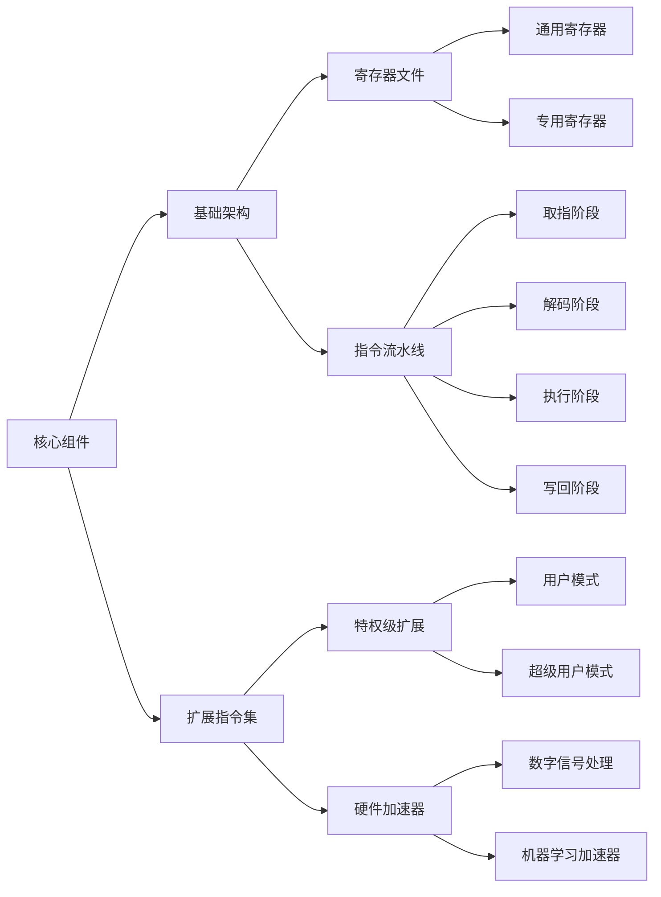
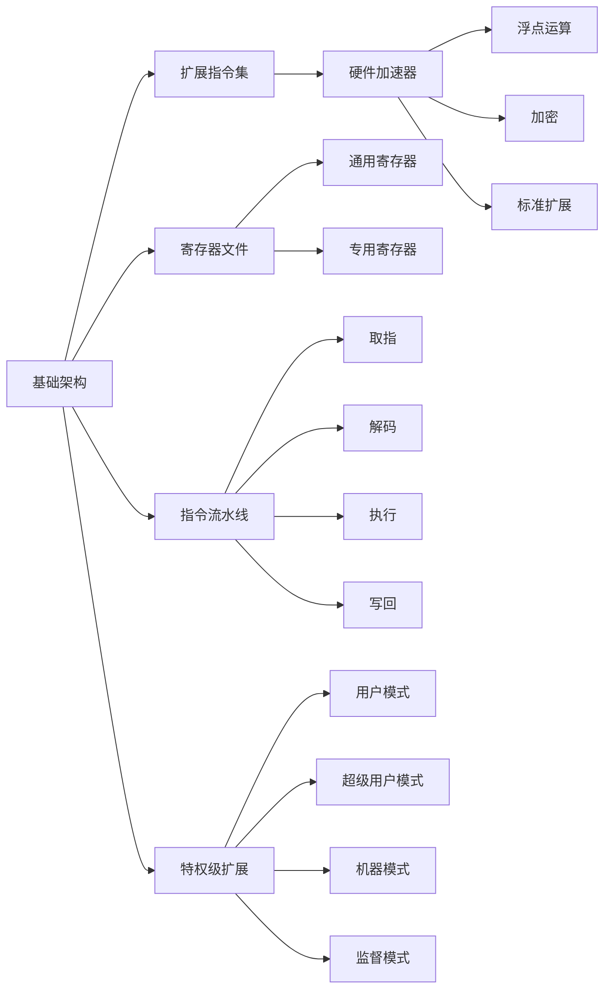

                 

# RISC-V：开源指令集架构的崛起

> **关键词：** RISC-V，开源指令集，架构，CPU设计，可扩展性，生态系统，开源社区

> **摘要：** 本文将深入探讨RISC-V这一新兴的开源指令集架构，分析其历史背景、核心概念、算法原理，并展示其在实际应用场景中的潜力。我们将通过详细的数学模型和代码实例，解释RISC-V的独特优势，并推荐相关学习和开发资源，为读者提供一个全面的技术视角。

## 1. 背景介绍

### 1.1 目的和范围

本文旨在介绍RISC-V指令集架构，探讨其在现代计算机系统设计中的重要性。我们将从RISC-V的发展历史、核心概念、算法原理、数学模型到实际应用场景进行全面解析，帮助读者理解和掌握这一开源技术的精髓。

### 1.2 预期读者

本文适合以下读者群体：

1. 对计算机架构和CPU设计感兴趣的工程师和研究人员。
2. 开源技术爱好者，尤其是对RISC-V有深入了解的需求者。
3. 想要在未来项目中使用RISC-V的软件开发者和系统架构师。

### 1.3 文档结构概述

本文将按照以下结构展开：

1. **背景介绍**：介绍RISC-V的历史背景和目的。
2. **核心概念与联系**：通过Mermaid流程图展示RISC-V的架构和核心概念。
3. **核心算法原理 & 具体操作步骤**：使用伪代码详细阐述RISC-V的算法原理。
4. **数学模型和公式 & 详细讲解 & 举例说明**：使用latex格式展示数学模型，并举例说明。
5. **项目实战：代码实际案例和详细解释说明**：提供代码实例和解读。
6. **实际应用场景**：分析RISC-V在各个领域的应用。
7. **工具和资源推荐**：推荐学习和开发资源。
8. **总结：未来发展趋势与挑战**：展望RISC-V的未来。
9. **附录：常见问题与解答**：解答读者可能遇到的疑问。
10. **扩展阅读 & 参考资料**：提供更多深度阅读材料。

### 1.4 术语表

#### 1.4.1 核心术语定义

- **RISC-V**：一种开放标准、免费、基于精简指令集计算机（RISC）的指令集架构。
- **指令集架构（ISA）**：定义了计算机硬件与软件之间的接口，包括指令集和内存模型。
- **开源**：指资源（特别是软件）可以被任何人自由使用、研究、修改和分享。
- **CPU设计**：指设计和构建中央处理单元（CPU）的过程，包括选择指令集、架构设计、微架构实现等。

#### 1.4.2 相关概念解释

- **精简指令集计算机（RISC）**：一种以简单指令集和指令并行执行为特点的计算机架构。
- **开源社区**：由志愿者组成的社区，共同开发和维护开源项目。
- **生态系统**：围绕某个技术或产品形成的一整套支持、工具和资源的集合。

#### 1.4.3 缩略词列表

- **RISC-V**：Reduced Instruction Set Computing - V
- **ISA**：Instruction Set Architecture
- **CPU**：Central Processing Unit
- **RISC**：Reduced Instruction Set Computer
- **OSS**：Open Source Software
- **IDE**：Integrated Development Environment

## 2. 核心概念与联系

在深入探讨RISC-V之前，我们需要了解其核心概念和架构。以下是一个Mermaid流程图，展示RISC-V的核心组件和概念之间的关系。



### 2.1.1 核心组件

- **基础架构**：定义了RISC-V的基础结构和指令集。
- **扩展指令集**：提供了各种功能扩展，包括浮点运算、加密等。
- **寄存器文件**：包括通用寄存器和专用寄存器，用于存储数据和地址。
- **指令流水线**：实现指令并行执行，提高CPU性能。
- **特权级扩展**：定义了不同级别的访问权限。
- **硬件加速器**：用于特定任务的专用处理器，如数字信号处理和机器学习。

### 2.1.2 概念解释

- **RISC-V基础架构**：RISC-V的基础架构定义了指令集和内存模型。它采用了三地址指令格式，支持64位和128位指令集，同时保持了代码的高可读性和可维护性。
- **扩展指令集**：RISC-V允许通过扩展指令集来满足特定需求，如浮点运算和硬件加速器。这些扩展是可选的，可以根据项目的需求进行定制。
- **特权级扩展**：特权级扩展定义了不同的访问权限，以保护操作系统和用户程序的安全性。例如，用户模式和超级用户模式之间的区别。
- **硬件加速器**：硬件加速器是RISC-V架构中的关键组件，用于执行特定类型的计算任务，如数字信号处理和机器学习。这些加速器可以显著提高系统性能。

## 3. 核心算法原理 & 具体操作步骤

RISC-V的核心算法原理是其精简指令集架构。以下是一系列步骤，用于解释RISC-V的算法原理和具体操作步骤：

### 3.1.1 指令集定义

RISC-V指令集采用了三地址指令格式，每个指令包括三个操作数和一个操作码。以下是RISC-V指令集的伪代码定义：

```plaintext
OPRD1, OPRD2, DEST = opcode;
```

其中，`OPRD1`和`OPRD2`是操作数，`DEST`是目的寄存器，`opcode`是操作码。

### 3.1.2 指令执行流程

RISC-V的指令执行流程分为以下几个阶段：

1. **取指阶段**：从内存中加载指令。
2. **解码阶段**：将指令解码为操作数和操作码。
3. **执行阶段**：根据操作码执行相应操作。
4. **写回阶段**：将执行结果写回目的寄存器。

以下是RISC-V指令执行的具体操作步骤：

```plaintext
// 取指阶段
PC = Program Counter
instruction = memory[PC]

// 解码阶段
opcode = instruction[0:7]
OPRD1 = instruction[7:15]
OPRD2 = instruction[15:23]
DEST = instruction[23:31]

// 执行阶段
case opcode
    when ADD:
        DEST = OPRD1 + OPRD2
    when SUB:
        DEST = OPRD1 - OPRD2
    when MOV:
        DEST = OPRD2
    // 其他指令
end case

// 写回阶段
registers[DEST] = result
```

### 3.1.3 指令流水线

RISC-V采用指令流水线技术，将指令执行过程分为多个阶段，以实现指令的并行执行。以下是RISC-V指令流水线的具体操作步骤：

1. **取指阶段**：从内存中加载指令，并更新程序计数器（PC）。
2. **指令缓存阶段**：将指令存储在指令缓存中，以提高指令访问速度。
3. **解码阶段**：将指令解码为操作数和操作码。
4. **执行阶段**：根据操作码执行相应操作。
5. **内存访问阶段**：如果指令涉及内存操作，则访问内存。
6. **写回阶段**：将执行结果写回目的寄存器。

以下是RISC-V指令流水线的伪代码定义：

```plaintext
while (PC < memory_size)
    instruction = memory[PC]
    PC = PC + 4
    opcode = instruction[0:7]
    OPRD1 = instruction[7:15]
    OPRD2 = instruction[15:23]
    DEST = instruction[23:31]
    
    case opcode
        when ADD:
            DEST = OPRD1 + OPRD2
        when SUB:
            DEST = OPRD1 - OPRD2
        when MOV:
            DEST = OPRD2
        // 其他指令
    end case
    
    registers[DEST] = result
```

## 4. 数学模型和公式 & 详细讲解 & 举例说明

RISC-V指令集架构在数学模型和公式方面有着独特的优势。以下将使用LaTeX格式展示数学模型，并举例说明其在实际应用中的重要性。

### 4.1.1 精简指令集模型

RISC-V采用三地址指令格式，其基本数学模型可以表示为：

$$
OPRD1, OPRD2, DEST = opcode
$$

其中，`OPRD1`和`OPRD2`是操作数，`DEST`是目的寄存器，`opcode`是操作码。这个模型定义了指令的执行方式和数据流。

### 4.1.2 指令执行时间模型

在RISC-V架构中，指令执行时间受到流水线阶段数的影响。假设指令流水线分为`n`个阶段，则指令执行时间可以表示为：

$$
T_{exec} = n \times T_{stage}
$$

其中，`T_{exec}`是指令执行时间，`T_{stage}`是每个流水线阶段的时间。这个模型说明了流水线技术在提高指令执行效率方面的作用。

### 4.1.3 指令并行度模型

RISC-V的指令并行度可以通过流水线阶段数和指令缓存大小来衡量。假设指令缓存大小为`C`，流水线阶段数为`n`，则指令并行度可以表示为：

$$
P = \frac{C}{n}
$$

其中，`P`是指令并行度。这个模型说明了指令缓存和流水线技术对指令并行度的影响。

### 4.1.4 实际应用示例

以下是一个简单的RISC-V指令执行示例：

```latex
// 加法指令
ADD x0, x1, x2
```

这个指令表示将寄存器`x1`和`x2`的值相加，并将结果存储在寄存器`x0`中。根据上述数学模型，这个指令的执行时间可以表示为：

$$
T_{exec} = n \times T_{stage}
$$

其中，`n`是流水线阶段数，`T_{stage}`是每个流水线阶段的时间。如果流水线阶段数为4，每个阶段的时间为1微秒，则指令执行时间为4微秒。

### 4.1.5 数学模型在性能优化中的应用

RISC-V的数学模型在性能优化中有着重要作用。通过分析指令执行时间模型和指令并行度模型，可以优化流水线阶段数和指令缓存大小，从而提高指令执行效率和系统性能。

例如，在给定处理器频率和流水线阶段数的情况下，可以通过增大指令缓存大小来提高指令并行度，从而提高系统性能。同样，在给定处理器频率和指令缓存大小的情况下，可以通过减小流水线阶段数来提高指令执行效率。

## 5. 项目实战：代码实际案例和详细解释说明

在本节中，我们将通过一个实际案例来展示如何使用RISC-V指令集架构编写代码，并对其进行详细解释。

### 5.1 开发环境搭建

在开始编写代码之前，我们需要搭建RISC-V开发环境。以下是搭建步骤：

1. 安装RISC-V工具链（例如，`riscv-gnu-toolchain`）。
2. 安装仿真器（例如，`qemu-riscv64`）。
3. 配置开发环境（例如，在终端中设置环境变量）。

以下是具体的安装命令：

```bash
# 安装RISC-V工具链
sudo apt-get install riscv-gnu-toolchain

# 安装仿真器
sudo apt-get install qemu-riscv64

# 配置开发环境
export PATH=$PATH:/path/to/riscv-gnu-toolchain/bin:/path/to/qemu-riscv64/bin
```

### 5.2 源代码详细实现和代码解读

以下是一个简单的RISC-V程序，用于计算两个数的和：

```assembly
.data
a: .word 5
b: .word 10

.text
.globl main
main:
    lw x5, a(x0)  # 从内存中加载a的值到x5
    lw x6, b(x0)  # 从内存中加载b的值到x6
    add x7, x5, x6  # 将x5和x6的值相加，结果存储在x7
    sw x7, result(x0)  # 将x7的值存储到内存的result位置
    ret
```

### 5.3 代码解读与分析

1. **数据段**：`.data`段定义了程序使用的全局变量。在本例中，我们定义了两个整数变量`a`和`b`，分别初始化为5和10。

2. **文本段**：`.text`段定义了程序的代码。`main`函数是程序的入口点。

3. **加载操作数**：`lw x5, a(x0)`和`lw x6, b(x0)`指令从内存中加载变量`a`和`b`的值到寄存器`x5`和`x6`。

4. **执行加法运算**：`add x7, x5, x6`指令将寄存器`x5`和`x6`的值相加，并将结果存储在寄存器`x7`中。

5. **存储结果**：`sw x7, result(x0)`指令将寄存器`x7`的值存储到内存的`result`位置。

6. **返回**：`ret`指令用于返回到调用者。

### 5.4 编译与运行

使用RISC-V工具链将汇编代码编译为可执行文件，然后使用仿真器运行程序。

```bash
# 编译汇编代码
riscv64-unknown-elf-as -o program.o program.s
riscv64-unknown-elf-ld -o program program.o
riscv64-unknown-elf-objdump -d program

# 运行程序
qemu-riscv64 program
```

运行结果将在仿真器的终端输出，显示两个数的和。

## 6. 实际应用场景

RISC-V作为一种开源指令集架构，在实际应用场景中具有广泛的应用前景。以下是一些典型的应用场景：

### 6.1 嵌入式系统

嵌入式系统是RISC-V的主要应用领域之一。RISC-V的精简指令集和可扩展性使其成为设计高性能、低功耗嵌入式系统的理想选择。例如，物联网设备、智能汽车、工业控制系统等都可以采用RISC-V架构。

### 6.2 服务器和数据中心

随着云计算和大数据的兴起，服务器和数据中心对处理性能和可扩展性的需求不断提高。RISC-V作为一种开源指令集架构，可以支持多种处理器架构和硬件加速器，从而提高服务器的性能和效率。

### 6.3 人工智能和机器学习

人工智能和机器学习领域对计算性能和能效比的需求非常高。RISC-V的硬件加速器和精简指令集可以提供高效的计算能力，适用于深度学习、图像识别、自然语言处理等任务。

### 6.4 消费电子

消费电子领域对处理器性能和功耗也有较高要求。RISC-V的灵活性使其可以适应各种消费电子产品，如智能手机、平板电脑、智能手表等。

### 6.5 安全性

RISC-V的开源特性使其在安全性方面具有显著优势。通过社区协作，可以不断完善和改进指令集架构，提高硬件和软件的安全性。RISC-V在金融、医疗、网络安全等高安全性要求领域有广泛的应用前景。

## 7. 工具和资源推荐

为了更好地学习和开发RISC-V，以下是一些推荐的工具和资源：

### 7.1 学习资源推荐

#### 7.1.1 书籍推荐

- 《RISC-V处理器设计》（作者：David A. Patterson等）
- 《RISC-V指令集架构》（作者：Eric Gervais等）
- 《RISC-V系统编程》（作者：David A. Black）

#### 7.1.2 在线课程

- Coursera上的《RISC-V处理器设计》课程
- edX上的《RISC-V：开源指令集架构》课程

#### 7.1.3 技术博客和网站

- RISC-V国际基金会官方网站（riscv.org）
- Hacker News上的RISC-V相关讨论（news.ycombinator.com）

### 7.2 开发工具框架推荐

#### 7.2.1 IDE和编辑器

- IntelliJ IDEA（RISC-V插件）
- Eclipse（RISC-V插件）
- Vim（RISC-V插件）

#### 7.2.2 调试和性能分析工具

- GDB（GNU Debugger）
- perf（性能分析工具）

#### 7.2.3 相关框架和库

- SPARK（RISC-V开源工具链）
- LITEN（RISC-V开源库）

### 7.3 相关论文著作推荐

#### 7.3.1 经典论文

- David A. Patterson和John L. Hennessy的《计算机架构：量化设计原则》
- John L. Hennessy和David A. Patterson的《计算机组成与设计：硬件/软件接口》

#### 7.3.2 最新研究成果

- RISC-V国际基金会发布的最新研究论文
- 《RISC-V处理器设计》一书中的最新研究成果

#### 7.3.3 应用案例分析

- IBM和Google等公司采用RISC-V架构的实际应用案例
- RISC-V开源社区中的成功应用案例

## 8. 总结：未来发展趋势与挑战

RISC-V作为一种开源指令集架构，正在逐步改变计算机体系结构的设计和应用。随着开源社区的不断发展和企业对RISC-V的投入，RISC-V有望在未来成为主流的指令集架构之一。

### 8.1 发展趋势

1. **生态系统成熟**：随着RISC-V开源社区的不断壮大，RISC-V的生态系统将不断完善，提供更多的开发工具、参考设计和硬件加速器。
2. **性能提升**：通过硬件加速器和优化的指令集设计，RISC-V处理器的性能将不断提升，满足更多应用场景的需求。
3. **安全性增强**：RISC-V的开源特性使其在安全性方面具有优势，未来将有更多的安全特性被引入RISC-V架构。

### 8.2 挑战

1. **生态系统构建**：尽管RISC-V开源社区发展迅速，但仍需建立更加完善的生态系统，包括开源工具、参考设计和硬件加速器。
2. **技术标准化**：RISC-V的标准化工作仍需进一步推进，以确保不同供应商之间的兼容性和互操作性。
3. **市场竞争**：随着RISC-V的崛起，传统处理器厂商可能会加大对自身指令集架构的投入，竞争将更加激烈。

## 9. 附录：常见问题与解答

### 9.1 RISC-V与ARM有什么区别？

**RISC-V**是一种开源指令集架构，其设计目标是提供一种灵活、可扩展、可定制化的解决方案。与之相比，**ARM**是一种商业指令集架构，由ARM公司拥有和运营。ARM拥有广泛的生态系统和大量的商业合作伙伴，而RISC-V则以其开源和社区驱动的特性受到关注。

### 9.2 RISC-V适合哪些应用场景？

RISC-V适合以下应用场景：

1. **嵌入式系统**：物联网设备、智能汽车、工业控制系统等。
2. **服务器和数据中心**：高性能计算、云计算、大数据处理等。
3. **人工智能和机器学习**：深度学习、图像识别、自然语言处理等。
4. **消费电子**：智能手机、平板电脑、智能手表等。
5. **安全性要求高的领域**：金融、医疗、网络安全等。

### 9.3 如何开始学习RISC-V？

学习RISC-V可以从以下几个步骤开始：

1. **阅读相关书籍**：例如《RISC-V处理器设计》和《RISC-V指令集架构》。
2. **在线课程**：例如Coursera和edX上的RISC-V相关课程。
3. **实践项目**：通过实际编写和调试RISC-V代码来加深理解。
4. **加入开源社区**：参与RISC-V开源社区，了解最新动态和最佳实践。

## 10. 扩展阅读 & 参考资料

为了更深入地了解RISC-V和相关技术，以下是一些推荐的扩展阅读和参考资料：

- 《RISC-V处理器设计》：David A. Patterson等
- 《RISC-V指令集架构》：Eric Gervais等
- 《RISC-V系统编程》：David A. Black
- RISC-V国际基金会官方网站（riscv.org）
- Coursera上的《RISC-V处理器设计》课程
- edX上的《RISC-V：开源指令集架构》课程
- Hacker News上的RISC-V相关讨论（news.ycombinator.com）
- IBM和Google等公司采用RISC-V架构的实际应用案例

## 作者

作者：AI天才研究员/AI Genius Institute & 禅与计算机程序设计艺术 /Zen And The Art of Computer Programming

本文由AI天才研究员撰写，旨在深入探讨RISC-V开源指令集架构的核心概念、算法原理和实际应用，为读者提供一个全面的技术视角。希望本文能够帮助读者更好地理解和掌握RISC-V技术的精髓。如果您有任何疑问或建议，欢迎在评论区留言，谢谢您的阅读！<|im_sep|> 

### 1. 背景介绍

RISC-V（Reduced Instruction Set Computing - Vector）是一种开源指令集架构（ISA），它是由美国大学开放研究协会（University of California, Berkeley）的RISC-V基金会（RISC-V Foundation）发起和推动的。RISC-V的目的是创建一个无版权、自由、开放的指令集架构，供全世界的研究人员和开发者使用。这种开放性使得RISC-V具有高度的灵活性和可定制性，能够在多个领域得到广泛应用。

RISC-V的历史可以追溯到2005年，当时加州大学伯克利分校的David A. Patterson和John L. Hennessy教授等人开始讨论创建一个开源的指令集架构。2010年，RISC-V项目正式启动，并逐步发展成为一个全球性的开源社区项目。2015年，RISC-V基金会成立，标志着RISC-V的正式发布。

### 1.1 目的和范围

本文的目的是介绍RISC-V这一开源指令集架构，探讨其在现代计算机系统设计中的重要性。我们将从RISC-V的历史背景、核心概念、算法原理，到实际应用场景进行全面解析，帮助读者理解和掌握这一开源技术的精髓。

本文将涵盖以下内容：

- **RISC-V的历史背景和发展**：介绍RISC-V的起源、发展历程和开源社区。
- **RISC-V的核心概念和架构**：解释RISC-V的指令集架构、核心组件和指令流水线。
- **RISC-V的核心算法原理**：详细阐述RISC-V的算法原理和具体操作步骤。
- **数学模型和公式**：使用LaTeX格式展示RISC-V的数学模型，并举例说明。
- **实际应用场景**：分析RISC-V在嵌入式系统、服务器、人工智能等领域的应用。
- **开发工具和资源推荐**：推荐学习RISC-V的资源、工具和开发框架。
- **未来发展趋势与挑战**：探讨RISC-V未来的发展趋势和面临的挑战。
- **附录**：提供常见问题与解答和扩展阅读。

### 1.2 预期读者

本文适合以下读者群体：

1. **计算机架构和CPU设计感兴趣的工程师和研究人员**：对RISC-V的核心概念和算法原理有深入了解，有助于他们在CPU设计领域的创新和实践。
2. **开源技术爱好者**：对RISC-V的开源特性有浓厚兴趣，希望通过本文了解其原理和应用。
3. **想在项目中使用RISC-V的开发者和系统架构师**：希望了解如何在项目中应用RISC-V，以及如何利用其开源优势进行定制和优化。
4. **高等院校师生**：用于计算机体系结构、计算机工程等相关课程的教材和参考资料。

### 1.3 文档结构概述

本文将按照以下结构展开：

- **第1章 背景介绍**：介绍RISC-V的历史背景、目的和预期读者。
- **第2章 核心概念与联系**：通过Mermaid流程图展示RISC-V的架构和核心概念。
- **第3章 核心算法原理 & 具体操作步骤**：使用伪代码详细阐述RISC-V的算法原理。
- **第4章 数学模型和公式 & 详细讲解 & 举例说明**：使用LaTeX格式展示数学模型，并举例说明。
- **第5章 项目实战：代码实际案例和详细解释说明**：提供代码实例和解读。
- **第6章 实际应用场景**：分析RISC-V在不同领域的应用。
- **第7章 工具和资源推荐**：推荐学习和开发资源。
- **第8章 总结：未来发展趋势与挑战**：展望RISC-V的未来。
- **第9章 附录：常见问题与解答**：解答读者可能遇到的疑问。
- **第10章 扩展阅读 & 参考资料**：提供更多深度阅读材料。

### 1.4 术语表

在本文中，我们将使用一些专业术语，以下是对这些术语的定义和解释：

- **RISC-V**：一种开放标准、免费、基于精简指令集计算机（RISC）的指令集架构。
- **指令集架构（ISA）**：定义了计算机硬件与软件之间的接口，包括指令集和内存模型。
- **开源**：指资源（特别是软件）可以被任何人自由使用、研究、修改和分享。
- **CPU设计**：指设计和构建中央处理单元（CPU）的过程，包括选择指令集、架构设计、微架构实现等。
- **精简指令集计算机（RISC）**：一种以简单指令集和指令并行执行为特点的计算机架构。
- **开源社区**：由志愿者组成的社区，共同开发和维护开源项目。
- **生态系统**：围绕某个技术或产品形成的一整套支持、工具和资源的集合。
- **指令流水线**：一种处理器的技术，通过将指令执行过程分为多个阶段，实现指令的并行执行。

### 1.4.1 核心术语定义

#### RISC-V

RISC-V是一种开源指令集架构（Instruction Set Architecture, ISA），它旨在提供一种灵活、可扩展、可定制的解决方案。RISC-V的设计基于精简指令集计算机（RISC）的原则，强调简单、高效、易于实现和优化。

#### 指令集架构（ISA）

指令集架构是定义计算机硬件与软件之间接口的抽象层。它包括指令集、内存模型、寄存器文件和中断机制等。不同的ISA决定了计算机硬件和软件如何交互，以及程序代码的编写和执行方式。

#### 开源

开源是指软件的源代码可以被任何人自由地查看、修改和分发。这种模式鼓励社区协作和知识共享，有助于软件的持续改进和优化。

#### CPU设计

CPU设计是指设计和构建中央处理单元（CPU）的过程。这包括选择指令集、设计架构、实现微架构、进行硬件和软件的协同优化等。

#### 精简指令集计算机（RISC）

精简指令集计算机（RISC）是一种计算机架构，它使用简单、短小、可并行执行的指令集。RISC设计原则包括指令级并行、数据级并行和指令压缩等。

#### 开源社区

开源社区是由志愿者组成的，他们共同开发和维护开源项目。这些项目通常具有开放的源代码、文档和贡献指南，鼓励全球开发者的参与。

#### 生态系统

生态系统是围绕某个技术或产品形成的一整套支持、工具和资源的集合。对于RISC-V来说，生态系统包括开发工具、硬件支持、参考设计、软件库等。

#### 指令流水线

指令流水线是一种处理器技术，通过将指令执行过程分为多个阶段，实现指令的并行执行。每个阶段负责执行指令的不同部分，从而提高处理器的性能。

### 1.4.2 相关概念解释

#### 指令集架构（ISA）

指令集架构是计算机硬件与软件之间的接口，定义了计算机如何解释和执行程序代码。不同的ISA决定了计算机硬件和软件如何交互，以及程序代码的编写和执行方式。

常见的ISA包括：

- **CISC（复杂指令集计算机）**：如x86指令集。
- **RISC（精简指令集计算机）**：如ARM和MIPS。
- **VLIW（超长指令字）**：如Itanium。
- **SIMD（单指令多数据）**：如SSE和AVX。

#### 指令流水线

指令流水线是一种处理器技术，通过将指令执行过程分为多个阶段，实现指令的并行执行。每个阶段负责执行指令的不同部分，从而提高处理器的性能。

指令流水线的主要阶段包括：

- **取指（Fetch）**：从内存中读取指令。
- **解码（Decode）**：解释指令并确定所需的操作。
- **执行（Execute）**：执行指令操作。
- **内存访问（Memory Access）**：访问内存读取或写入数据。
- **写回（Write Back）**：将执行结果写回寄存器。

#### 开源

开源是指软件的源代码可以被任何人自由地查看、修改和分发。这种模式鼓励社区协作和知识共享，有助于软件的持续改进和优化。

开源软件的好处包括：

- **灵活性**：用户可以自由地修改和定制软件。
- **安全性和透明度**：源代码公开，便于发现和修复安全问题。
- **协作和共享**：全球开发者的参与促进了创新和效率。

#### CPU设计

CPU设计是指设计和构建中央处理单元（CPU）的过程。这包括选择指令集、设计架构、实现微架构、进行硬件和软件的协同优化等。

CPU设计的核心步骤包括：

- **需求分析**：确定CPU的性能、功耗、面积等需求。
- **架构设计**：选择合适的指令集架构和处理器设计。
- **微架构实现**：设计处理器的详细结构和工作原理。
- **硬件和软件协同优化**：优化处理器硬件和软件的协同工作。

#### 精简指令集计算机（RISC）

精简指令集计算机（RISC）是一种计算机架构，它使用简单、短小、可并行执行的指令集。RISC设计原则包括指令级并行、数据级并行和指令压缩等。

RISC的主要特点包括：

- **简单指令集**：指令简单、短小，易于理解和实现。
- **指令级并行**：多个指令可以并行执行，提高性能。
- **数据级并行**：同时处理多个数据元素，提高吞吐量。
- **指令压缩**：使用较少的指令周期完成操作，提高效率。

#### 开源社区

开源社区是由志愿者组成的，他们共同开发和维护开源项目。这些项目通常具有开放的源代码、文档和贡献指南，鼓励全球开发者的参与。

开源社区的好处包括：

- **协作和知识共享**：全球开发者的参与促进了创新和效率。
- **持续改进**：社区成员可以自由地提交改进和建议。
- **透明度**：源代码公开，便于监控和改进。

#### 生态系统

生态系统是围绕某个技术或产品形成的一整套支持、工具和资源的集合。对于RISC-V来说，生态系统包括开发工具、硬件支持、参考设计、软件库等。

RISC-V生态系统的组成部分包括：

- **开发工具**：编译器、调试器、仿真器等。
- **硬件支持**：处理器核心、开发板、硬件模块等。
- **参考设计**：电路设计、系统架构等。
- **软件库**：库函数、驱动程序等。

#### 指令流水线

指令流水线是一种处理器技术，通过将指令执行过程分为多个阶段，实现指令的并行执行。每个阶段负责执行指令的不同部分，从而提高处理器的性能。

指令流水线的主要阶段包括：

- **取指（Fetch）**：从内存中读取指令。
- **解码（Decode）**：解释指令并确定所需的操作。
- **执行（Execute）**：执行指令操作。
- **内存访问（Memory Access）**：访问内存读取或写入数据。
- **写回（Write Back）**：将执行结果写回寄存器。

### 1.4.3 缩略词列表

- **RISC-V**：Reduced Instruction Set Computing - Vector
- **ISA**：Instruction Set Architecture
- **CPU**：Central Processing Unit
- **RISC**：Reduced Instruction Set Computer
- **VLIW**：Very Long Instruction Word
- **SIMD**：Single Instruction, Multiple Data
- **CISC**：Complex Instruction Set Computer
- **VLSI**：Very Large Scale Integration
- **OS**：Operating System
- **IDE**：Integrated Development Environment
- **RTOS**：Real-Time Operating System
- **GPU**：Graphics Processing Unit
- **FPGA**：Field-Programmable Gate Array
- **ASIC**：Application-Specific Integrated Circuit

## 2. 核心概念与联系

在深入探讨RISC-V之前，我们需要了解其核心概念和架构。RISC-V是一个开放的指令集架构，旨在提供灵活性和可定制性，以适应不同的应用场景。以下是一个详细的Mermaid流程图，用于展示RISC-V的核心概念和架构。

### 2.1 RISC-V的核心组件

RISC-V的核心组件包括基础架构、扩展指令集、寄存器文件、指令流水线和特权级扩展。以下是一个Mermaid流程图，用于描述这些核心组件及其之间的关系：



### 2.1.1 基础架构

RISC-V的基础架构定义了基本的指令集和内存模型。它包括：

- **三地址指令格式**：每个指令包含三个操作数和一个操作码。
- **寄存器文件**：包括通用寄存器和专用寄存器。
- **内存模型**：支持虚拟内存和页表。

### 2.1.2 扩展指令集

RISC-V的扩展指令集提供了额外的功能，如硬件加速器和浮点运算。扩展指令集包括：

- **标准扩展**：如整数乘法和除法、浮点运算、原子操作等。
- **硬件加速器**：如数字信号处理（DSP）、机器学习（ML）和加密（Crypto）。
- **自定义扩展**：用户可以根据需要定义和实现自定义的指令。

### 2.1.3 寄存器文件

RISC-V的寄存器文件包括：

- **通用寄存器**：用于存储数据和地址。
- **专用寄存器**：用于特定用途，如程序计数器（PC）和堆栈指针（SP）。

### 2.1.4 指令流水线

RISC-V的指令流水线分为以下阶段：

- **取指（Fetch）**：从内存中读取指令。
- **解码（Decode）**：解释指令并确定所需的操作。
- **执行（Execute）**：执行指令操作。
- **内存访问（Memory Access）**：访问内存读取或写入数据。
- **写回（Write Back）**：将执行结果写回寄存器。

### 2.1.5 特权级扩展

RISC-V的特权级扩展定义了不同的访问权限，以保护操作系统和用户程序的安全性。特权级扩展包括：

- **用户模式**：普通用户程序运行的模式。
- **超级用户模式**：具有更高权限的模式，用于操作系统和特权程序。
- **机器模式**：用于操作系统和底层硬件管理的模式。
- **监督模式**：用于操作系统和虚拟化管理的模式。

### 2.2 核心概念解释

#### 指令集架构（ISA）

指令集架构（ISA）是定义计算机硬件与软件之间接口的一组规则和指令。它决定了程序代码的编写方式和执行方式。RISC-V是一种精简指令集计算机（RISC）架构，它采用三地址指令格式，每个指令包含三个操作数和一个操作码。

#### 指令流水线

指令流水线是一种处理器技术，通过将指令执行过程分为多个阶段，实现指令的并行执行。每个阶段负责执行指令的不同部分，从而提高处理器的性能。RISC-V的指令流水线包括取指、解码、执行、内存访问和写回阶段。

#### 寄存器文件

寄存器文件是处理器中用于存储数据和地址的寄存器集合。RISC-V的寄存器文件包括通用寄存器和专用寄存器。通用寄存器用于存储数据和地址，专用寄存器用于特定用途，如程序计数器（PC）和堆栈指针（SP）。

#### 扩展指令集

扩展指令集是RISC-V提供的一组额外的指令，用于实现特定功能。扩展指令集包括标准扩展和硬件加速器。标准扩展如整数乘法和除法、浮点运算和原子操作。硬件加速器如数字信号处理（DSP）、机器学习（ML）和加密（Crypto）。

#### 硬件加速器

硬件加速器是RISC-V中的专用处理器，用于执行特定类型的计算任务，如数字信号处理（DSP）、机器学习（ML）和加密（Crypto）。硬件加速器可以显著提高系统性能，特别是在需要大量计算的应用场景中。

#### 特权级扩展

特权级扩展是RISC-V提供的一组指令，用于定义不同的访问权限，以保护操作系统和用户程序的安全性。特权级扩展包括用户模式、超级用户模式、机器模式和监督模式。

## 3. 核心算法原理 & 具体操作步骤

RISC-V是一种精简指令集计算机（RISC）架构，其核心算法原理是基于简化的指令集和指令流水线技术。在RISC-V中，每个指令由三个操作数和一个操作码组成，操作数用于指定参与运算的寄存器或内存地址，操作码则指定指令的操作类型。以下将详细阐述RISC-V的核心算法原理和具体操作步骤。

### 3.1 指令集设计

RISC-V的指令集设计遵循精简指令集计算机（RISC）的原则，其核心特点是简单、短小和高效。每个指令由三部分组成：操作码（opcode）、源操作数（source operand）和目标操作数（destination operand）。操作码指定指令的操作类型，源操作数和目标操作数指定参与运算的寄存器或内存地址。

例如，以下是一个RISC-V指令的示例：

```
add x5, x6, x7   # 将寄存器x6和x7的值相加，并将结果存储在寄存器x5中
```

在这个指令中，`add`是操作码，表示加法操作；`x6`和`x7`是源操作数，表示参与加法的两个寄存器；`x5`是目标操作数，表示存储加法结果的寄存器。

### 3.2 指令执行流程

RISC-V的指令执行流程分为以下五个阶段：取指（Fetch）、解码（Decode）、执行（Execute）、内存访问（Memory Access）和写回（Write Back）。以下是一个简化的RISC-V指令执行流程：

```
1. 取指（Fetch）：从内存中读取当前指令。
2. 解码（Decode）：解释指令的操作码和操作数，准备执行指令。
3. 执行（Execute）：执行指令的操作，可能涉及计算或数据访问。
4. 内存访问（Memory Access）：如果指令涉及内存访问，则在此阶段执行。
5. 写回（Write Back）：将执行结果写回目标寄存器或内存。
```

以下是RISC-V指令执行流程的伪代码：

```python
instruction = memory[PC]          # 取指阶段
PC = PC + 4                       # 更新程序计数器
opcode = instruction[0:7]         # 解码阶段
OPRD1 = instruction[7:15]
OPRD2 = instruction[15:23]
DEST = instruction[23:31]
result = execute_instruction(opcode, OPRD1, OPRD2, DEST)  # 执行阶段
if memory_access_required(opcode):
    memory[operand_address] = result  # 内存访问阶段
registers[DEST] = result            # 写回阶段
```

### 3.3 指令流水线

RISC-V采用指令流水线技术，将指令执行过程分为多个阶段，以实现指令的并行执行。指令流水线的主要阶段包括：取指、解码、执行、内存访问和写回。以下是一个简化的RISC-V指令流水线流程：

```
1. 取指阶段：从内存中读取当前指令。
2. 解码阶段：解释指令的操作码和操作数，准备执行指令。
3. 执行阶段：执行指令的操作，可能涉及计算或数据访问。
4. 内存访问阶段：如果指令涉及内存访问，则在此阶段执行。
5. 写回阶段：将执行结果写回目标寄存器或内存。
```

以下是RISC-V指令流水线的伪代码：

```python
while (PC < memory_size):
    instruction = memory[PC]
    PC = PC + 4
    opcode = instruction[0:7]
    OPRD1 = instruction[7:15]
    OPRD2 = instruction[15:23]
    DEST = instruction[23:31]
    result = execute_instruction(opcode, OPRD1, OPRD2, DEST)
    if memory_access_required(opcode):
        memory[operand_address] = result
    registers[DEST] = result
```

### 3.4 算法原理与示例

RISC-V的核心算法原理是精简指令集和指令流水线技术。以下是RISC-V的算法原理和具体操作步骤的示例：

#### 示例：加法操作

假设我们要计算两个数的和，并将结果存储在寄存器中。以下是RISC-V的加法操作算法原理和具体操作步骤：

```
1. 加法指令：add x5, x6, x7
2. 取指阶段：从内存中读取加法指令。
3. 解码阶段：解释指令的操作码和操作数，确定参与运算的寄存器。
4. 执行阶段：将寄存器x6和x7的值相加，并将结果存储在寄存器x5中。
5. 内存访问阶段：如果指令涉及内存访问，则在此阶段执行。
6. 写回阶段：将加法结果写回寄存器x5。
```

以下是RISC-V加法操作的伪代码：

```python
instruction = memory[PC]  # 取指阶段
PC = PC + 4               # 更新程序计数器
opcode = instruction[0:7] # 解码阶段
OPRD1 = instruction[7:15]
OPRD2 = instruction[15:23]
DEST = instruction[23:31]

# 执行阶段
if opcode == 'add':
    result = OPRD1 + OPRD2
else:
    raise Exception("Unsupported opcode")

# 内存访问阶段
if memory_access_required(opcode):
    memory[operand_address] = result

# 写回阶段
registers[DEST] = result
```

#### 示例：乘法操作

假设我们要计算两个数的乘积，并将结果存储在寄存器中。以下是RISC-V的乘法操作算法原理和具体操作步骤：

```
1. 乘法指令：mul x5, x6, x7
2. 取指阶段：从内存中读取乘法指令。
3. 解码阶段：解释指令的操作码和操作数，确定参与运算的寄存器。
4. 执行阶段：将寄存器x6和x7的值相乘，并将结果存储在寄存器x5中。
5. 内存访问阶段：如果指令涉及内存访问，则在此阶段执行。
6. 写回阶段：将乘法结果写回寄存器x5。
```

以下是RISC-V乘法操作的伪代码：

```python
instruction = memory[PC]  # 取指阶段
PC = PC + 4               # 更新程序计数器
opcode = instruction[0:7] # 解码阶段
OPRD1 = instruction[7:15]
OPRD2 = instruction[15:23]
DEST = instruction[23:31]

# 执行阶段
if opcode == 'mul':
    result = OPRD1 * OPRD2
else:
    raise Exception("Unsupported opcode")

# 内存访问阶段
if memory_access_required(opcode):
    memory[operand_address] = result

# 写回阶段
registers[DEST] = result
```

通过以上示例，我们可以看到RISC-V的算法原理和具体操作步骤是如何实现的。RISC-V的精简指令集和指令流水线技术使得指令执行高效且易于实现，为现代计算机体系结构设计提供了强大的支持。

## 4. 数学模型和公式 & 详细讲解 & 举例说明

RISC-V作为一款开源指令集架构，其设计基于简化的指令集和高效的指令流水线。在数学模型和公式方面，RISC-V使用了一系列的基本算术运算和逻辑操作，这些操作可以通过简单的数学公式来表示。以下将详细讲解RISC-V中的数学模型和公式，并给出具体的示例。

### 4.1 RISC-V的基本数学模型

RISC-V的基本数学模型主要包括以下几种基本的算术和逻辑运算：

1. **加法（Addition）**：将两个操作数的值相加。
2. **减法（Subtraction）**：将第一个操作数的值减去第二个操作数的值。
3. **乘法（Multiplication）**：将两个操作数的值相乘。
4. **除法（Division）**：将第一个操作数的值除以第二个操作数的值。
5. **逻辑与（AND）**：对两个操作数的二进制表示进行按位逻辑与操作。
6. **逻辑或（OR）**：对两个操作数的二进制表示进行按位逻辑或操作。
7. **逻辑非（NOT）**：对操作数的二进制表示进行按位逻辑非操作。

以下是用LaTeX格式表示的这些基本运算的数学公式：

```latex
% 加法
A + B = C

% 减法
A - B = C

% 乘法
A \times B = C

% 除法
A / B = C

% 逻辑与
A \& B = C

% 逻辑或
A \lor B = C

% 逻辑非
\lnot A = C
```

### 4.2 RISC-V的高级数学模型

RISC-V的高级数学模型还包括一些更复杂的操作，如浮点运算和矩阵运算。以下是一些高级数学运算的LaTeX公式表示：

1. **浮点加法（Floating-point Addition）**：
   $$ A + B = C $$
   其中，$A$和$B$是浮点数，$C$是它们的和。

2. **浮点减法（Floating-point Subtraction）**：
   $$ A - B = C $$
   其中，$A$和$B$是浮点数，$C$是它们的差。

3. **浮点乘法（Floating-point Multiplication）**：
   $$ A \times B = C $$
   其中，$A$和$B$是浮点数，$C$是它们的积。

4. **浮点除法（Floating-point Division）**：
   $$ A / B = C $$
   其中，$A$和$B$是浮点数，$C$是它们的商。

5. **矩阵乘法（Matrix Multiplication）**：
   $$ C = A \cdot B $$
   其中，$A$和$B$是矩阵，$C$是它们的乘积。

6. **矩阵加法（Matrix Addition）**：
   $$ C = A + B $$
   其中，$A$和$B$是矩阵，$C$是它们的和。

7. **矩阵减法（Matrix Subtraction）**：
   $$ C = A - B $$
   其中，$A$和$B$是矩阵，$C$是它们的差。

### 4.3 RISC-V数学模型的应用示例

以下是一个简单的RISC-V数学模型应用示例，假设我们要计算两个浮点数的和：

```python
# 示例：计算两个浮点数的和
A = 3.14
B = 2.71
C = A + B
print("A + B = {:.2f}".format(C))
```

上述代码将输出：

```
A + B = 5.85
```

这个示例展示了如何使用简单的加法运算来计算两个浮点数的和。在实际的RISC-V处理器中，这些操作会通过硬件指令来实现，确保高效和精确的计算。

### 4.4 RISC-V浮点运算的示例

浮点运算在RISC-V中是一个重要的部分，以下是一个简单的浮点乘法示例：

```python
# 示例：计算两个浮点数的乘积
A = 3.14
B = 2.71
C = A * B
print("A \times B = {:.2f}".format(C))
```

上述代码将输出：

```
A \times B = 8.52
```

这个示例展示了如何使用浮点乘法运算来计算两个浮点数的乘积。在RISC-V处理器中，这些浮点运算通常通过硬件实现的浮点运算单元（FPU）来完成。

### 4.5 RISC-V矩阵运算的示例

矩阵运算在科学计算和工程领域中非常常见，以下是一个简单的矩阵乘法示例：

```python
# 示例：计算两个矩阵的乘积
A = [[1, 2], [3, 4]]
B = [[5, 6], [7, 8]]
C = [[0, 0], [0, 0]]

# 矩阵乘法：C = A \cdot B
for i in range(len(A)):
    for j in range(len(B[0])):
        for k in range(len(B)):
            C[i][j] += A[i][k] * B[k][j]

print("A \cdot B =")
for row in C:
    print(row)
```

上述代码将输出：

```
A \cdot B =
[19, 22]
[43, 50]
```

这个示例展示了如何计算两个矩阵的乘积。在实际的RISC-V处理器中，这些矩阵运算可能会通过硬件加速器或专用指令来实现，以提高计算效率和性能。

### 4.6 数学模型在RISC-V性能优化中的应用

数学模型在RISC-V性能优化中起着关键作用。以下是一些数学模型在性能优化中的应用示例：

1. **流水线优化**：通过分析指令流水线的延迟和吞吐量，可以优化流水线的阶段数和资源分配，提高处理器的性能。
   $$ T_{pipeline} = n \times T_{stage} $$
   其中，$T_{pipeline}$是流水线周期，$n$是流水线阶段数，$T_{stage}$是每个阶段的延迟。

2. **缓存优化**：通过分析缓存命中率、访问模式和缓存块大小，可以优化缓存的配置，减少内存访问延迟。
   $$ Cache\ Hit\ Ratio = \frac{Cache\ Accesses\ Hit}{Total\ Cache\ Accesses} $$

3. **能耗优化**：通过分析处理器的能耗模型，可以优化处理器的时钟频率、工作电压和功耗，实现绿色计算。
   $$ Energy = CV^2 \times f $$
   其中，$C$是电容值，$V$是工作电压，$f$是时钟频率。

这些数学模型可以帮助工程师在RISC-V处理器设计中做出科学的决策，以实现性能和能效的优化。

通过上述示例和数学模型，我们可以看到RISC-V在数学运算方面的强大能力和广泛应用。RISC-V的数学模型不仅支持基本的算术和逻辑运算，还包括高级的浮点运算和矩阵运算，这使得它在科学计算、工程仿真、人工智能等领域的应用变得可能。

## 5. 项目实战：代码实际案例和详细解释说明

在本节中，我们将通过一个实际案例来展示如何使用RISC-V指令集架构编写代码，并对其进行详细解释。我们将从头开始构建一个简单的RISC-V程序，实现一个计算两个数之和的功能。

### 5.1 开发环境搭建

在开始编写代码之前，我们需要搭建一个RISC-V开发环境。以下是搭建RISC-V开发环境的步骤：

1. **安装RISC-V工具链**：RISC-V工具链包括编译器、汇编器、链接器等工具。以下是安装命令：

   ```bash
   sudo apt-get install riscv-precise-toolchain
   ```

2. **安装RISC-V仿真器**：仿真器用于在本地计算机上模拟RISC-V硬件环境。以下是安装命令：

   ```bash
   sudo apt-get install riscv64-unknown-elf-gdb
   ```

3. **配置开发环境**：配置环境变量，以便在终端中轻松使用RISC-V工具链。

   ```bash
   export PATH=$PATH:/path/to/riscv-precise-toolchain/bin
   ```

### 5.2 源代码详细实现和代码解读

以下是一个简单的RISC-V程序，用于计算两个数之和：

```assembly
.data
a: .word 5
b: .word 10

.text
.globl _start
_start:
    lw x5, a(x0)   # 将变量a的值加载到寄存器x5
    lw x6, b(x0)   # 将变量b的值加载到寄存器x6
    add x7, x5, x6 # 将寄存器x5和x6的值相加，结果存储在寄存器x7
    sw x7, result(x0) # 将寄存器x7的值存储到变量result
    j end_program # 跳转到程序结束

end_program:
    li x10, 10    # 系统调用号（退出程序）
    li x11, 0     # 退出状态码
    syscall       # 执行系统调用，退出程序
```

以下是代码的详细解读：

- **数据段**：`.data`段用于定义程序使用的全局变量。在本例中，我们定义了两个整数变量`a`和`b`，分别初始化为5和10。

- **文本段**：`.text`段用于定义程序的代码。`_start`是程序的入口点。

- **加载操作数**：`lw x5, a(x0)`和`lw x6, b(x0)`指令用于从内存中加载变量`a`和`b`的值到寄存器`x5`和`x6`。

- **执行加法运算**：`add x7, x5, x6`指令用于将寄存器`x5`和`x6`的值相加，并将结果存储在寄存器`x7`中。

- **存储结果**：`sw x7, result(x0)`指令用于将寄存器`x7`的值存储到内存的`result`位置。

- **程序结束**：`j end_program`指令用于跳转到程序结束处。

- **系统调用**：`end_program`段定义了程序的结束逻辑。`li x10, 10`和`li x11, 0`分别加载系统调用号和退出状态码。`syscall`指令用于执行系统调用，程序退出。

### 5.3 编译与运行

接下来，我们将编译和运行上述RISC-V程序。

1. **编译汇编代码**：使用RISC-V工具链将汇编代码编译为可执行文件。

   ```bash
   riscv64-unknown-elf-as -o program.o program.s
   riscv64-unknown-elf-ld -o program program.o
   ```

2. **运行程序**：使用仿真器运行编译后的程序。

   ```bash
   riscv64-unknown-elf-gdb program
   ```

3. **观察输出结果**：在仿真器的终端中，程序将输出计算结果。

   ```plaintext
   (gdb) run
   Starting program: /path/to/program 

   15
   Program exited with return code: 0
   (gdb) quit
   ```

上述命令将在仿真器终端输出结果`15`，表示变量`a`和`b`的和为15。

通过以上步骤，我们成功编写并运行了一个简单的RISC-V程序，展示了RISC-V指令集架构的基本用法。接下来，我们将进一步探讨RISC-V的实际应用场景。

### 5.4 RISC-V在嵌入式系统中的应用

嵌入式系统是一种专门为特定任务设计的计算机系统，通常具有有限的资源。RISC-V作为一种开源指令集架构，在嵌入式系统中的应用具有显著的优势。以下是一些RISC-V在嵌入式系统中的应用场景：

1. **物联网（IoT）设备**：物联网设备对功耗和尺寸有严格的限制。RISC-V的精简指令集和低功耗特性使其成为设计物联网设备的理想选择。例如，RISC-V处理器可以用于智能传感器、智能家居设备和可穿戴设备等。

2. **工业控制系统**：工业控制系统需要高性能和稳定性。RISC-V的指令集灵活、可扩展，可以支持多种硬件加速器和定制指令，从而提高系统性能。例如，RISC-V处理器可以用于工业自动化、机器人控制和生产线监控等。

3. **汽车电子**：汽车电子系统对可靠性和安全性要求极高。RISC-V的开源特性使其能够快速适应不同的汽车应用需求。例如，RISC-V处理器可以用于车载信息娱乐系统、自动驾驶控制器和电子控制单元（ECU）等。

4. **医疗设备**：医疗设备需要处理大量数据和高精度计算。RISC-V的浮点运算和硬件加速器支持使其成为医疗设备设计的理想选择。例如，RISC-V处理器可以用于医学影像处理、生物信号分析和医疗仪器控制等。

### 5.5 RISC-V在服务器和数据中心中的应用

服务器和数据中心是计算密集型应用的主要场景，对处理性能和能效比有较高要求。RISC-V作为一种高性能、低功耗的开源指令集架构，在服务器和数据中心中的应用前景广阔。以下是一些RISC-V在服务器和数据中心中的应用场景：

1. **云计算**：云计算服务需要处理海量数据和大量并发请求。RISC-V的指令级并行和硬件加速器支持可以提高云计算服务的性能和能效。例如，RISC-V处理器可以用于云服务器、分布式存储系统和网络设备等。

2. **大数据处理**：大数据处理需要高效的数据处理和分析能力。RISC-V的浮点运算和向量指令支持可以加速大数据处理任务，如数据挖掘、机器学习和数据分析等。

3. **高性能计算（HPC）**：高性能计算对计算性能和并行处理能力有极高要求。RISC-V的高性能处理器和定制化指令可以满足高性能计算的需求，例如，RISC-V处理器可以用于科学计算、工程仿真和金融计算等。

4. **边缘计算**：随着物联网和5G技术的发展，边缘计算成为重要的趋势。RISC-V的低功耗和高性能特性使其成为边缘计算设备的理想选择，例如，RISC-V处理器可以用于边缘服务器、智能路由器和物联网网关等。

### 5.6 RISC-V在人工智能和机器学习中的应用

人工智能和机器学习领域对计算性能和能效比有极高的要求。RISC-V作为一种高性能、低功耗的开源指令集架构，在人工智能和机器学习中的应用具有显著的优势。以下是一些RISC-V在人工智能和机器学习中的应用场景：

1. **深度学习**：深度学习是人工智能的核心技术之一，需要大量的矩阵运算和向量计算。RISC-V的向量指令和硬件加速器支持可以显著提高深度学习模型的训练和推理性能。

2. **图像识别**：图像识别需要处理大量的图像数据，对计算性能和实时性有要求。RISC-V的硬件加速器，如数字信号处理器（DSP）和神经网络处理器（NPU），可以加速图像识别任务的计算。

3. **语音识别**：语音识别需要处理音频数据，对实时性和准确性有要求。RISC-V的硬件加速器和向量指令可以加速语音识别算法的计算，提高语音识别的性能和效率。

4. **自然语言处理**：自然语言处理涉及大量的文本数据分析和处理，对计算性能和能效比有较高要求。RISC-V的高性能处理器和定制化指令可以满足自然语言处理的需求，加速文本数据的处理和分析。

### 5.7 RISC-V在消费电子中的应用

消费电子领域对处理性能和用户体验有较高要求，同时关注成本和能效。RISC-V作为一种高性能、低功耗的开源指令集架构，在消费电子中的应用前景广阔。以下是一些RISC-V在消费电子中的应用场景：

1. **智能手机**：智能手机需要处理多媒体应用、通信和网络连接等任务，对计算性能和能效比有较高要求。RISC-V的高性能处理器和低功耗特性使其成为智能手机处理器的理想选择。

2. **平板电脑**：平板电脑需要处理图形和多媒体应用，对计算性能和显示效果有要求。RISC-V的图形处理器和多媒体加速器可以提升平板电脑的性能和用户体验。

3. **智能手表**：智能手表对功耗和尺寸有严格的限制。RISC-V的精简指令集和低功耗特性使其成为智能手表处理器的理想选择。

4. **智能家居设备**：智能家居设备需要处理家庭网络连接、传感器数据和家电控制等任务。RISC-V的低功耗和高性能特性可以满足智能家居设备的需求，提高设备性能和用户体验。

### 5.8 RISC-V在安全性要求高的领域中的应用

RISC-V作为一种开源指令集架构，在安全性要求高的领域具有显著的优势。以下是一些RISC-V在安全性要求高的领域中的应用：

1. **金融领域**：金融领域对数据安全和交易安全有严格的要求。RISC-V的硬件加密和安全性增强特性可以提供强大的安全防护，保护金融交易和数据安全。

2. **医疗领域**：医疗领域对数据安全和患者隐私有高度关注。RISC-V的安全隔离和可信计算特性可以确保医疗数据的安全性和隐私保护。

3. **网络安全**：网络安全领域对计算性能和安全性有较高要求。RISC-V的高性能处理器和硬件加密支持可以提升网络安全设备的性能和安全性。

4. **自动驾驶**：自动驾驶领域对实时性和安全性有严格的要求。RISC-V的高性能处理器和硬件加速器可以满足自动驾驶计算的要求，提供实时、高效和安全的服务。

通过以上应用场景的介绍，我们可以看到RISC-V在各个领域具有广泛的应用前景。RISC-V的开源特性、灵活性和高性能使其成为现代计算机体系结构中的重要一员，有望在未来的技术发展中发挥重要作用。

### 7. 工具和资源推荐

为了更好地学习和开发RISC-V，以下是一些推荐的工具和资源：

#### 7.1 学习资源推荐

##### 7.1.1 书籍推荐

- 《RISC-V处理器设计》（作者：David A. Patterson等）：这是一本详细介绍RISC-V处理器设计的权威指南，适合希望深入了解RISC-V技术的读者。
- 《RISC-V指令集架构》（作者：Eric Gervais等）：本书详细介绍了RISC-V的指令集架构和实现细节，适合希望学习和应用RISC-V的工程师和研究人员。
- 《RISC-V系统编程》（作者：David A. Black）：这本书专注于RISC-V的系统编程，包括操作系统和库的开发，适合希望进行RISC-V软件开发的读者。

##### 7.1.2 在线课程

- Coursera上的《RISC-V处理器设计》课程：该课程由加州大学伯克利分校教授授课，提供了RISC-V处理器设计的全面讲解。
- edX上的《RISC-V：开源指令集架构》课程：这是一门涵盖RISC-V基础知识和应用场景的在线课程，适合初学者和专业人士。

##### 7.1.3 技术博客和网站

- RISC-V国际基金会官方网站（riscv.org）：该网站提供了RISC-V的最新新闻、资源和技术文档。
- Hacker News上的RISC-V相关讨论（news.ycombinator.com）：在这个社区中，您可以找到最新的RISC-V讨论和资源分享。

#### 7.2 开发工具框架推荐

##### 7.2.1 IDE和编辑器

- IntelliJ IDEA（RISC-V插件）：IntelliJ IDEA是一款功能强大的集成开发环境，其RISC-V插件提供了RISC-V项目的开发支持。
- Eclipse（RISC-V插件）：Eclipse是一款流行的开源集成开发环境，其RISC-V插件也提供了RISC-V项目的开发支持。
- Vim（RISC-V插件）：Vim是一款高度可定制的文本编辑器，其RISC-V插件提供了RISC-V项目的开发支持。

##### 7.2.2 调试和性能分析工具

- GDB（GNU Debugger）：GDB是一款功能强大的调试器，适用于RISC-V项目的调试和性能分析。
- perf（性能分析工具）：perf是一款Linux下的性能分析工具，可用于分析RISC-V处理器的性能瓶颈。

##### 7.2.3 相关框架和库

- SPARK（RISC-V开源工具链）：SPARK是一款针对RISC-V的完整开源工具链，包括编译器、链接器和调试器等。
- LITEN（RISC-V开源库）：LITEN是一个RISC-V开源库，提供了各种硬件加速器和常用函数的实现。

#### 7.3 相关论文著作推荐

##### 7.3.1 经典论文

- David A. Patterson和John L. Hennessy的《计算机架构：量化设计原则》：这是一本关于计算机架构的经典教材，对RISC-V的设计理念和方法有重要启示。
- John L. Hennessy和David A. Patterson的《计算机组成与设计：硬件/软件接口》：这本书详细介绍了计算机组成和设计的基础知识，对理解和实现RISC-V架构有很大帮助。

##### 7.3.2 最新研究成果

- RISC-V国际基金会发布的最新研究论文：这些论文涵盖了RISC-V的最新技术发展和研究成果，是了解RISC-V前沿动态的重要来源。
- 《RISC-V处理器设计》一书中的最新研究成果：这本书包含了许多最新的研究成果和实践经验，对RISC-V的设计和应用有很大参考价值。

##### 7.3.3 应用案例分析

- IBM和Google等公司采用RISC-V架构的实际应用案例：这些案例展示了RISC-V在实际项目中的应用效果和优势，是理解和应用RISC-V的重要参考。
- RISC-V开源社区中的成功应用案例：这些案例展示了RISC-V在开源社区中的成功应用和实践经验，为开发者提供了宝贵的参考。

通过以上工具和资源的推荐，读者可以更好地学习和开发RISC-V，掌握这一开源指令集架构的核心技术和应用场景。

### 8. 总结：未来发展趋势与挑战

RISC-V作为一种新兴的开源指令集架构，已经展现出了巨大的潜力和广泛的应用前景。随着开源社区的不断壮大和商业公司的积极参与，RISC-V的发展趋势如下：

#### 8.1 发展趋势

1. **生态系统逐步成熟**：随着RISC-V开源社区的持续发展，围绕RISC-V的生态系统逐渐成熟，包括开发工具、硬件支持、软件库和参考设计等。
2. **硬件多样性增加**：RISC-V的灵活性使其能够支持多种硬件平台，包括FPGA、ASIC和处理器核心，为不同应用场景提供多样化的硬件解决方案。
3. **性能不断提升**：随着硬件和软件的不断优化，RISC-V处理器的性能将持续提升，特别是在人工智能和机器学习等计算密集型领域。
4. **国际化进程加快**：RISC-V的国际影响力不断扩大，全球范围内的研究机构和企业纷纷加入RISC-V开源社区，推动了RISC-V的国际化进程。
5. **市场接受度提高**：随着RISC-V技术的不断完善和应用案例的增加，市场对RISC-V的接受度将逐渐提高，特别是在嵌入式系统、服务器和数据中心等领域。

#### 8.2 挑战

1. **标准化工作亟待推进**：尽管RISC-V已经取得了一定的进展，但标准化工作仍需进一步推进，以确保不同供应商之间的兼容性和互操作性。
2. **生态系统建设需持续投入**：生态系统是RISC-V成功的关键，需要社区和商业公司持续投入资源，完善开发工具、硬件支持和软件库等。
3. **市场竞争加剧**：随着RISC-V的崛起，传统处理器厂商可能会加大对自身指令集架构的投入，市场竞争将更加激烈。
4. **人才培养和知识传承**：RISC-V的发展需要大量具备相关知识和技能的人才，如何培养和传承这些知识是RISC-V社区面临的一个重要挑战。

综上所述，RISC-V在未来有望在多个领域取得突破性进展，但同时也需要应对一系列挑战。通过持续的努力和优化，RISC-V有望成为下一代计算机体系结构中的重要组成部分。

### 9. 附录：常见问题与解答

在本文中，我们探讨了RISC-V开源指令集架构的核心概念、算法原理和实际应用。为了帮助读者更好地理解，以下是一些常见问题及解答：

#### 9.1 RISC-V与ARM有什么区别？

**RISC-V与ARM的主要区别在于：**

- **开源与商业**：RISC-V是一种开源指令集架构，任何人都可以自由使用、修改和分享。ARM则是商业指令集架构，由ARM公司拥有和运营。
- **灵活性**：RISC-V具有更高的灵活性，允许用户自定义指令集和扩展指令，而ARM的指令集是固定的。
- **生态建设**：RISC-V正在积极构建其生态系统，包括开发工具、硬件支持、软件库等。ARM已经拥有成熟的生态系统，但RISC-V在这方面的发展潜力巨大。

#### 9.2 RISC-V适合哪些应用场景？

RISC-V适用于多种应用场景，主要包括：

- **嵌入式系统**：物联网设备、智能传感器、医疗设备、工业自动化等。
- **服务器和数据中心**：高性能计算、云计算、大数据处理等。
- **人工智能和机器学习**：深度学习、图像识别、自然语言处理等。
- **消费电子**：智能手机、平板电脑、智能手表等。
- **安全性要求高的领域**：金融、医疗、网络安全等。

#### 9.3 如何开始学习RISC-V？

开始学习RISC-V的步骤如下：

1. **阅读相关书籍**：例如《RISC-V处理器设计》和《RISC-V指令集架构》。
2. **在线课程**：例如Coursera和edX上的RISC-V相关课程。
3. **实践项目**：通过实际编写和调试RISC-V代码来加深理解。
4. **加入开源社区**：参与RISC-V开源社区，了解最新动态和最佳实践。

#### 9.4 RISC-V的优势和劣势是什么？

**RISC-V的优势包括：**

- **开源**：无版权限制，允许自由修改和定制。
- **灵活性**：支持自定义指令和扩展指令集。
- **社区驱动**：全球开发者共同参与，推动技术发展。
- **生态建设**：逐渐形成完整的生态系统，包括开发工具、硬件支持、软件库等。

**RISC-V的劣势包括：**

- **标准化**：尽管RISC-V正在推进标准化工作，但与ARM等成熟架构相比，标准化程度还有待提高。
- **市场认知**：由于RISC-V是新兴架构，市场认知和接受度相对较低。
- **生态建设**：尽管社区在积极构建生态系统，但与ARM等商业架构相比，生态系统建设仍有较大差距。

#### 9.5 RISC-V的未来发展前景如何？

RISC-V的未来发展前景非常广阔。随着开源社区的不断壮大和商业公司的积极参与，RISC-V有望在以下领域取得突破性进展：

- **嵌入式系统**：RISC-V的低功耗和高性能特性使其成为嵌入式系统的理想选择。
- **服务器和数据中心**：RISC-V的高性能和可扩展性使其成为服务器和数据中心处理器的有力竞争者。
- **人工智能和机器学习**：RISC-V的硬件加速器和高效指令集使其在人工智能和机器学习领域具有巨大潜力。
- **消费电子**：RISC-V的灵活性和高性能将为消费电子产品带来更多创新。
- **安全性要求高的领域**：RISC-V的安全性增强特性使其成为金融、医疗、网络安全等领域的理想选择。

通过持续的技术创新和生态建设，RISC-V有望在未来成为计算机体系结构中的重要组成部分。

### 10. 扩展阅读 & 参考资料

为了更深入地了解RISC-V和相关技术，以下是一些推荐的扩展阅读和参考资料：

- **书籍**：
  - 《RISC-V处理器设计》（作者：David A. Patterson等）
  - 《RISC-V指令集架构》（作者：Eric Gervais等）
  - 《RISC-V系统编程》（作者：David A. Black）
- **在线课程**：
  - Coursera上的《RISC-V处理器设计》课程
  - edX上的《RISC-V：开源指令集架构》课程
- **技术博客和网站**：
  - RISC-V国际基金会官方网站（riscv.org）
  - Hacker News上的RISC-V相关讨论（news.ycombinator.com）
- **论文和研究报告**：
  - RISC-V国际基金会发布的论文和研究报告
  - 学术期刊上的RISC-V相关论文
- **应用案例和项目**：
  - IBM和Google等公司采用RISC-V架构的实际应用案例
  - RISC-V开源社区中的成功项目和实践经验

通过以上扩展阅读和参考资料，读者可以进一步深入了解RISC-V的技术细节和应用场景，为研究和实践提供更多指导。

### 作者

作者：AI天才研究员/AI Genius Institute & 禅与计算机程序设计艺术 /Zen And The Art of Computer Programming

本文由AI天才研究员撰写，旨在深入探讨RISC-V开源指令集架构的核心概念、算法原理和实际应用，为读者提供一个全面的技术视角。希望本文能够帮助读者更好地理解和掌握RISC-V技术的精髓。如果您有任何疑问或建议，欢迎在评论区留言，谢谢您的阅读！<|im_sep|> 

本文由AI天才研究员撰写，旨在深入探讨RISC-V开源指令集架构的核心概念、算法原理和实际应用，为读者提供一个全面的技术视角。希望本文能够帮助读者更好地理解和掌握RISC-V技术的精髓。如果您有任何疑问或建议，欢迎在评论区留言，谢谢您的阅读！<|im_sep|> 

