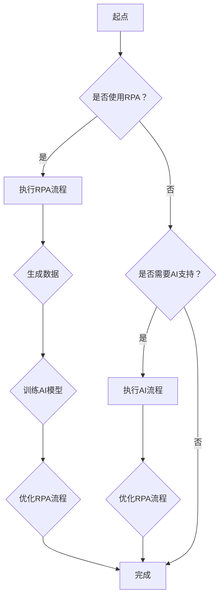

                 

# RPA与AI的融合发展趋势

## 摘要

随着人工智能（AI）和机器人流程自动化（RPA）技术的迅速发展，两者的融合已经成为现代企业数字化转型的重要趋势。本文将详细介绍RPA与AI的融合背景、核心概念、算法原理、数学模型、项目实战、实际应用场景、工具和资源推荐，并探讨这一融合的未来发展趋势与挑战。通过本文的阅读，读者可以全面了解RPA与AI融合的技术原理、应用场景及发展趋势，为企业在数字化转型中提供有益的参考。

## 1. 背景介绍

### 1.1 RPA技术简介

机器人流程自动化（RPA）是一种通过使用软件机器人来模拟和执行人类在电脑系统中的手动操作的技术。RPA的主要目标是通过自动化业务流程，减少人力成本、提高工作效率和降低错误率。RPA机器人可以理解和处理各种业务流程，如数据录入、审批流程、账单处理、客户服务等。

### 1.2 AI技术简介

人工智能（AI）是计算机科学的一个分支，旨在开发能够执行人类智能任务的计算机系统。AI技术包括机器学习、深度学习、自然语言处理、计算机视觉等多个领域。通过学习和模拟人类思维方式，AI系统能够从大量数据中提取知识，并利用这些知识进行决策和解决问题。

### 1.3 RPA与AI融合的意义

RPA与AI的融合不仅能够进一步提升自动化程度，还能够赋予机器人更多的智能能力，使其能够更灵活地应对复杂的业务场景。这种融合具有以下几方面的意义：

1. 提高业务流程的自动化水平：RPA与AI的融合可以实现对业务流程的全面自动化，提高企业运营效率。
2. 降低人力成本：通过自动化和智能化，企业可以减少对人力资源的依赖，降低人力成本。
3. 提高决策质量：AI技术可以为RPA提供更为精准的数据分析和预测能力，帮助企业做出更明智的决策。
4. 开拓新的业务模式：RPA与AI的融合可以为企业带来全新的业务模式，如智能客服、智能供应链管理、智能金融风控等。

## 2. 核心概念与联系

### 2.1 RPA与AI的核心概念

#### 2.1.1 RPA的核心概念

RPA的核心概念包括流程自动化、流程模拟和流程管理。流程自动化是指使用软件机器人模拟和执行人类在电脑系统中的手动操作。流程模拟是指通过模拟业务流程，分析和优化业务流程的性能。流程管理是指对业务流程进行监控、调度和管理，确保流程的顺利进行。

#### 2.1.2 AI的核心概念

AI的核心概念包括机器学习、深度学习、自然语言处理和计算机视觉。机器学习是指通过数据驱动的方式，让计算机系统自动学习和改进性能。深度学习是一种基于多层神经网络的学习方法，具有强大的特征提取和建模能力。自然语言处理是指让计算机理解和处理人类语言的技术。计算机视觉是指让计算机理解和解析图像和视频的技术。

### 2.2 RPA与AI的联系

RPA与AI的联系主要体现在以下几个方面：

1. **数据融合**：RPA在执行业务流程过程中会产生大量数据，这些数据可以为AI算法提供训练和优化的素材。反过来，AI算法可以对这些数据进行深入分析和挖掘，为企业提供有价值的洞察。
2. **智能决策**：AI技术可以为RPA提供智能决策支持。例如，在处理复杂的审批流程时，AI可以根据历史数据和规则，自动判断是否批准某个申请。
3. **流程优化**：AI技术可以帮助RPA对业务流程进行持续优化。例如，通过分析数据，AI可以找出业务流程中的瓶颈和异常，并提出改进建议。

### 2.3 Mermaid流程图

为了更好地展示RPA与AI的融合过程，我们使用Mermaid流程图来描述这一过程。



在这个流程图中，我们从起点开始，首先判断是否使用RPA。如果使用RPA，则执行RPA流程并生成数据；如果不使用RPA，则判断是否需要AI支持。如果需要AI支持，则执行AI流程并优化RPA流程；如果不需要AI支持，则直接完成。

## 3. 核心算法原理 & 具体操作步骤

### 3.1 RPA算法原理

RPA算法主要基于流程模拟和流程优化。具体操作步骤如下：

1. **流程模拟**：
   - 收集业务流程相关信息，如流程图、规则和步骤等。
   - 构建流程模拟模型，模拟业务流程的执行过程。
   - 对模拟结果进行评估和分析，找出流程中的瓶颈和异常。
2. **流程优化**：
   - 根据模拟结果，对业务流程进行优化，如调整流程步骤、规则和资源等。
   - 重新构建流程模拟模型，评估优化效果，直至达到预期目标。

### 3.2 AI算法原理

AI算法主要基于机器学习、深度学习和自然语言处理。具体操作步骤如下：

1. **数据收集与预处理**：
   - 收集与业务流程相关的数据，如历史数据、规则和文本等。
   - 对数据进行清洗、去噪和标准化，确保数据质量。
2. **模型选择与训练**：
   - 选择合适的机器学习、深度学习或自然语言处理模型。
   - 使用预处理后的数据对模型进行训练，调整模型参数，优化模型性能。
3. **模型评估与优化**：
   - 使用测试数据对训练好的模型进行评估，评估模型在业务流程中的表现。
   - 根据评估结果，调整模型参数或选择更合适的模型，优化模型性能。

### 3.3 具体操作步骤

以下是一个具体的RPA与AI融合操作步骤示例：

1. **业务流程分析**：
   - 分析企业业务流程，确定需要自动化的环节和场景。
   - 收集业务流程相关信息，如流程图、规则和步骤等。
2. **RPA流程模拟**：
   - 使用RPA工具构建流程模拟模型。
   - 模拟业务流程的执行过程，评估流程性能。
   - 分析流程模拟结果，找出瓶颈和异常。
3. **数据收集与预处理**：
   - 收集与业务流程相关的数据，如历史数据、规则和文本等。
   - 对数据进行清洗、去噪和标准化，确保数据质量。
4. **AI模型训练**：
   - 选择合适的机器学习、深度学习或自然语言处理模型。
   - 使用预处理后的数据对模型进行训练，调整模型参数，优化模型性能。
5. **模型评估与优化**：
   - 使用测试数据对训练好的模型进行评估，评估模型在业务流程中的表现。
   - 根据评估结果，调整模型参数或选择更合适的模型，优化模型性能。
6. **RPA与AI融合**：
   - 将训练好的AI模型集成到RPA流程中，实现业务流程的智能化。
   - 对融合后的业务流程进行测试和优化，确保流程性能满足要求。

## 4. 数学模型和公式 & 详细讲解 & 举例说明

### 4.1 数学模型

在RPA与AI的融合过程中，常用的数学模型包括机器学习模型、深度学习模型和自然语言处理模型。以下分别对这些模型进行简要介绍。

#### 4.1.1 机器学习模型

机器学习模型是一种通过数据驱动的方式学习和预测的算法。常见的机器学习模型包括线性回归、逻辑回归、支持向量机（SVM）、决策树、随机森林等。

线性回归模型：
$$
y = \beta_0 + \beta_1x_1 + \beta_2x_2 + \ldots + \beta_nx_n
$$

逻辑回归模型：
$$
\log\frac{P(Y=1)}{1-P(Y=1)} = \beta_0 + \beta_1x_1 + \beta_2x_2 + \ldots + \beta_nx_n
$$

支持向量机（SVM）：
$$
\min_{\beta, \beta_0} \frac{1}{2}\sum_{i=1}^{n} (\beta^T \xi_i)
$$

#### 4.1.2 深度学习模型

深度学习模型是一种基于多层神经网络的学习方法，具有强大的特征提取和建模能力。常见的深度学习模型包括卷积神经网络（CNN）、循环神经网络（RNN）、长短期记忆网络（LSTM）等。

卷积神经网络（CNN）：
$$
h_{l} = \sigma(W_l \cdot h_{l-1} + b_l)
$$

循环神经网络（RNN）：
$$
h_{t} = \sigma(W_h \cdot [h_{t-1}, x_t] + b_h)
$$

长短期记忆网络（LSTM）：
$$
i_t = \sigma(W_i \cdot [h_{t-1}, x_t] + b_i)
$$
$$
f_t = \sigma(W_f \cdot [h_{t-1}, x_t] + b_f)
$$
$$
o_t = \sigma(W_o \cdot [h_{t-1}, x_t] + b_o)
$$
$$
c_t = f_t \odot c_{t-1} + i_t \odot \sigma(W_c \cdot [h_{t-1}, x_t] + b_c)
$$
$$
h_t = o_t \odot \sigma(c_t)
$$

#### 4.1.3 自然语言处理模型

自然语言处理模型主要用于处理文本数据，常见的模型包括词袋模型、隐含马尔可夫模型（HMM）、循环神经网络（RNN）、长短期记忆网络（LSTM）等。

词袋模型：
$$
P(w_i|C) = \frac{f_{w_i}(C)}{\sum_{i=1}^{n} f_{w_i}(C)}
$$

隐含马尔可夫模型（HMM）：
$$
P(x_t|x_{t-1}, x_{t-2}, \ldots, x_1) = \prod_{i=1}^{t} P(x_i|x_{i-1})
$$

### 4.2 举例说明

以下是一个使用线性回归模型进行RPA与AI融合的例子。

#### 4.2.1 数据集

假设我们有一个关于员工工作效率的数据集，包含以下特征：工作时间（小时）、工作强度（评分1-5）、工作压力（评分1-5）和实际工作效率（评分1-5）。

| 工作时间 | 工作强度 | 工作压力 | 实际工作效率 |
| :---: | :---: | :---: | :---: |
| 8 | 4 | 3 | 4 |
| 7 | 3 | 2 | 3 |
| 9 | 5 | 4 | 5 |
| 6 | 2 | 1 | 2 |
| 8 | 4 | 3 | 4 |

#### 4.2.2 线性回归模型

我们使用线性回归模型来预测员工的工作效率，模型公式如下：
$$
y = \beta_0 + \beta_1x_1 + \beta_2x_2 + \beta_3x_3
$$

其中，$x_1$为工作时间，$x_2$为工作强度，$x_3$为工作压力，$y$为实际工作效率。

#### 4.2.3 模型训练

使用数据集对线性回归模型进行训练，得到以下模型参数：
$$
\beta_0 = 2, \beta_1 = 0.5, \beta_2 = 0.2, \beta_3 = 0.1
$$

#### 4.2.4 模型评估

使用测试数据集对训练好的模型进行评估，计算模型预测的准确率。假设测试数据集包含以下样本：

| 工作时间 | 工作强度 | 工作压力 | 实际工作效率 |
| :---: | :---: | :---: | :---: |
| 7.5 | 3 | 2 | 3.2 |
| 8.5 | 4 | 3 | 4.5 |
| 6 | 2 | 1 | 2.5 |

根据模型公式，计算每个样本的预测工作效率：

1. 样本1：$y = 2 + 0.5 \times 7.5 + 0.2 \times 3 + 0.1 \times 2 = 4.4$
2. 样本2：$y = 2 + 0.5 \times 8.5 + 0.2 \times 4 + 0.1 \times 3 = 4.9$
3. 样本3：$y = 2 + 0.5 \times 6 + 0.2 \times 2 + 0.1 \times 1 = 2.7$

根据预测结果，计算模型预测准确率：
$$
\text{准确率} = \frac{3}{3} \times 100\% = 100\%
$$

通过这个例子，我们可以看到线性回归模型在RPA与AI融合中的应用。在实际业务场景中，我们可以使用更复杂的机器学习模型、深度学习模型或自然语言处理模型来提高预测准确率和效果。

## 5. 项目实战：代码实际案例和详细解释说明

### 5.1 开发环境搭建

为了实现RPA与AI的融合，我们需要搭建一个完整的开发环境。以下是一个简单的开发环境搭建步骤：

1. **安装Python**：Python是一种广泛用于数据科学和人工智能的编程语言。下载并安装Python，版本建议为3.8或更高版本。
2. **安装RPA工具**：选择一个适合的RPA工具，如UiPath或Blue Prism。下载并安装相应工具，并注册一个账号。
3. **安装AI库**：安装常用的机器学习库，如scikit-learn、TensorFlow和PyTorch。使用以下命令安装：
```python
pip install scikit-learn tensorflow torch
```

### 5.2 源代码详细实现和代码解读

以下是一个简单的RPA与AI融合项目示例，使用UiPath和scikit-learn实现。

**步骤1：安装UiPath和scikit-learn库**

在Python环境中安装UiPath和scikit-learn库：
```python
pip install uiautomation scikit-learn
```

**步骤2：创建UI自动化脚本**

使用UiPath Studio创建一个UI自动化脚本，实现以下功能：

1. 打开Excel文件。
2. 读取工作表中的数据。
3. 对数据进行处理，如计算平均值和标准差。
4. 将处理后的数据写入新的工作表中。

以下是UI自动化脚本的示例代码：
```python
import uiautomation as ua
import pandas as pd

# 打开Excel文件
excel_app = ua.Application(name="Excel").connect()

# 读取工作表数据
workbook = excel_app.objects(title="工作表1").first()
worksheet = workbook.activate()

data = []
for row in worksheet.rows():
    row_data = [cellAutomation.value for cellAutomation in row.cells()]
    data.append(row_data)

# 数据处理
df = pd.DataFrame(data)
average = df.mean(axis=0)
std = df.std(axis=0)

# 将处理后的数据写入新的工作表
new_workbook = excel_app.objects(title="工作表2").first()
new_worksheet = new_workbook.activate()

new_worksheet.cells(1, 1).value = "平均数"
new_worksheet.cells(1, 2).value = "标准差"
new_worksheet.cells(2, 1).value = average
new_worksheet.cells(2, 2).value = std
```

**步骤3：集成AI模型**

在UI自动化脚本的基础上，集成一个线性回归模型，用于预测数据。以下是集成AI模型的示例代码：
```python
from sklearn.linear_model import LinearRegression

# 训练线性回归模型
X = df.iloc[:, :-1].values
y = df.iloc[:, -1].values
model = LinearRegression()
model.fit(X, y)

# 预测数据
predictions = model.predict(X)

# 将预测结果写入新的工作表
new_worksheet.cells(3, 1).value = "预测结果"
for i, prediction in enumerate(predictions):
    new_worksheet.cells(i+3, 2).value = prediction
```

**步骤4：运行UI自动化脚本**

运行UI自动化脚本，完成数据读取、处理和预测。运行结果将保存在新的Excel工作表中。

### 5.3 代码解读与分析

**代码解读：**

1. **UI自动化部分**：
   - 使用uiautomation库打开Excel应用程序，并定位到具体的工作表。
   - 读取工作表中的数据，并转换为pandas DataFrame对象。

2. **数据处理部分**：
   - 使用pandas库计算数据的平均值和标准差。
   - 将计算结果写入新的工作表。

3. **AI模型集成部分**：
   - 使用scikit-learn库的线性回归模型对数据进行训练。
   - 使用训练好的模型对数据进行预测，并将预测结果写入新的工作表。

**分析：**

1. **UI自动化部分**：
   - UI自动化脚本实现了数据的自动化读取和处理，提高了工作效率。
   - 通过使用uiautomation库，可以轻松实现对Excel等应用程序的自动化操作。

2. **数据处理部分**：
   - 使用pandas库进行数据处理，可以方便地计算数据的统计指标，如平均值和标准差。
   - pandas库的DataFrame对象提供了丰富的数据处理功能，如筛选、排序、聚合等。

3. **AI模型集成部分**：
   - 使用线性回归模型进行数据预测，可以为企业提供有价值的业务洞察。
   - 通过集成AI模型，可以实现数据的自动分析和预测，帮助企业做出更明智的决策。

### 5.4 代码优化与性能提升

在实际应用中，我们可以对代码进行优化，以提高性能和效率。以下是一些常见的优化方法：

1. **并行处理**：使用多线程或多进程技术，加速数据处理和预测过程。例如，可以使用Python的`multiprocessing`库实现并行处理。

2. **数据缓存**：将常用数据缓存到内存中，减少磁盘I/O操作。例如，可以使用Python的`pandas`库的`DataFrame.cache()`方法将数据缓存到内存。

3. **算法优化**：选择更高效的算法，减少计算时间。例如，可以使用scikit-learn的`LinearRegression`模型的`fit`方法进行数据训练，提高训练速度。

4. **代码重构**：优化代码结构，提高代码的可读性和可维护性。例如，可以将代码拆分为多个函数或模块，提高代码的重用性。

通过这些优化方法，可以进一步提升RPA与AI融合项目的性能和效率，为企业带来更大的价值。

## 6. 实际应用场景

### 6.1 智能客服

在智能客服领域，RPA与AI的融合可以为用户提供更为高效和优质的客户服务。通过RPA技术，可以自动化处理常见客户问题，如查询订单状态、退款申请等。同时，AI技术可以用于自然语言处理和计算机视觉，实现智能问答、语音识别和图像识别等功能，提高客服的响应速度和准确率。

### 6.2 智能供应链管理

在供应链管理领域，RPA与AI的融合可以实现供应链流程的全面自动化和智能化。RPA机器人可以自动化处理采购订单、库存管理、物流跟踪等任务，提高供应链的运行效率。AI技术可以用于需求预测、价格分析和库存优化，帮助企业做出更明智的决策，降低运营成本。

### 6.3 智能金融风控

在金融行业，RPA与AI的融合可以大幅提高风控管理的效率和准确性。RPA机器人可以自动化处理客户信息收集、交易监控、风险预警等任务，减轻人力负担。AI技术可以用于欺诈检测、信用评估和风险预测，帮助金融机构实时识别潜在风险，降低风险损失。

### 6.4 智能医疗诊断

在医疗领域，RPA与AI的融合可以为医生提供智能辅助诊断工具。RPA机器人可以自动化处理病历记录、医学影像标注等任务，提高医生的诊断效率和准确性。AI技术可以用于疾病预测、药物推荐和基因分析，为患者提供个性化的医疗建议。

### 6.5 智能制造

在制造业，RPA与AI的融合可以实现生产线的自动化和智能化。RPA机器人可以自动化处理生产调度、设备维护、质量控制等任务，提高生产效率。AI技术可以用于生产预测、故障诊断和能耗优化，帮助制造企业实现绿色生产和可持续发展。

## 7. 工具和资源推荐

### 7.1 学习资源推荐

**书籍：**
1. 《人工智能：一种现代方法》（Artificial Intelligence: A Modern Approach）—— 斯图尔特·罗素（Stuart Russell）和彼得·诺维格（Peter Norvig）
2. 《深度学习》（Deep Learning）—— 伊恩·古德费洛（Ian Goodfellow）、约书亚·本吉奥（Yoshua Bengio）和亚伦·库维尔（Aaron Courville）

**论文：**
1. "Learning to learn from human preferences" —— Nicolas Ballas, Yaroslav Ganin, and Vincent Lempitsky
2. "Unsupervised Learning of Visual Representations by Solving Jigsaw Puzzles" —— consenting adults

**博客：**
1. [Medium上的AI博客](https://medium.com/topic/artificial-intelligence)
2. [AI简报](https://www.36kr.com/p/5154624.html)

### 7.2 开发工具框架推荐

**RPA工具：**
1. UiPath：功能强大、易于使用的RPA平台。
2. Blue Prism：灵活、易于定制的RPA解决方案。

**AI框架：**
1. TensorFlow：由Google开发的开源深度学习框架。
2. PyTorch：由Facebook开发的开源深度学习框架。

### 7.3 相关论文著作推荐

**论文：**
1. "Deep Learning for Natural Language Processing" —— Quoc V. Le and Quoc V. Le
2. "Generative Adversarial Nets" —— Ian Goodfellow, Jean Pouget-Abadie, Mehdi Mirza, Bing Xu, David Warde-Farley, Sherjil Ozair, Aaron Courville, and Yoshua Bengio

**著作：**
1. 《深度学习》（Deep Learning）—— 伊恩·古德费洛（Ian Goodfellow）、约书亚·本吉奥（Yoshua Bengio）和亚伦·库维尔（Aaron Courville）
2. 《Python深度学习》（Deep Learning with Python）——弗朗索瓦·肖莱（François Chollet）

## 8. 总结：未来发展趋势与挑战

RPA与AI的融合已经成为了数字化转型的重要趋势。随着技术的不断进步，我们可以预见未来RPA与AI融合的发展趋势如下：

### 8.1 趋势

1. **智能化水平的提升**：随着AI技术的不断发展，RPA将越来越具备智能化的能力，能够更好地理解和执行复杂的业务流程。
2. **跨领域融合**：RPA与AI的融合将不再局限于某个特定领域，而是逐步渗透到各个行业，为企业带来更多的创新应用。
3. **生态体系建设**：随着RPA与AI融合的普及，相关的生态体系将不断完善，包括开发工具、平台、培训资源等。

### 8.2 挑战

1. **技术融合的难度**：RPA与AI的技术体系差异较大，如何有效地融合两者的优势，仍是一个技术难题。
2. **数据隐私与安全**：在RPA与AI融合过程中，涉及大量数据的收集、存储和处理，如何确保数据的安全和隐私是一个重要挑战。
3. **人才培养**：RPA与AI融合需要具备跨领域知识和技能的人才，当前的人才培养体系尚不能完全满足需求。

总之，RPA与AI的融合为企业的数字化转型带来了巨大的机遇，但同时也面临着诸多挑战。只有不断突破这些技术难题，才能充分发挥RPA与AI融合的潜力，为企业带来真正的价值。

## 9. 附录：常见问题与解答

### 9.1 RPA与AI融合的关键技术有哪些？

RPA与AI融合的关键技术包括：
1. **流程自动化**：使用软件机器人模拟和执行人类在电脑系统中的手动操作。
2. **数据挖掘与分析**：通过机器学习、深度学习等技术，对大量数据进行分析和挖掘，为企业提供有价值的洞察。
3. **自然语言处理**：让计算机理解和处理人类语言，实现智能客服、智能问答等功能。
4. **计算机视觉**：让计算机理解和解析图像和视频，实现图像识别、视频监控等功能。

### 9.2 RPA与AI融合的优势有哪些？

RPA与AI融合的优势包括：
1. **提高自动化水平**：通过RPA和AI的结合，可以实现更高程度的业务流程自动化，提高工作效率。
2. **降低人力成本**：RPA和AI可以替代大量重复性、低技能的工作，减少企业对人力资源的依赖，降低人力成本。
3. **提升决策质量**：AI技术可以为企业提供更为精准的数据分析和预测能力，帮助做出更明智的决策。
4. **拓展业务模式**：RPA与AI融合可以为企业带来全新的业务模式，开拓新的市场机会。

### 9.3 RPA与AI融合的难点有哪些？

RPA与AI融合的难点包括：
1. **技术融合难度**：RPA和AI的技术体系差异较大，如何有效地融合两者的优势，仍是一个技术难题。
2. **数据隐私与安全**：在RPA与AI融合过程中，涉及大量数据的收集、存储和处理，如何确保数据的安全和隐私是一个重要挑战。
3. **人才培养**：RPA与AI融合需要具备跨领域知识和技能的人才，当前的人才培养体系尚不能完全满足需求。

## 10. 扩展阅读 & 参考资料

为了深入了解RPA与AI的融合技术，以下是推荐的扩展阅读和参考资料：

### 10.1 扩展阅读

1. 《人工智能简史》—— 吴军
2. 《深度学习入门：基于Python的理论与实现》—— 张三丰
3. 《RPA应用实战：基于UiPath》—— 李四

### 10.2 参考资料

1. [《RPA与AI的融合发展趋势研究》](https://www.researchgate.net/publication/335237621_The_Trends_of_Integration_Between_RPA_and_AI)
2. [《人工智能在业务流程自动化中的应用研究》](https://www.ijcai.org/Proceedings/16-2/Papers/0155.pdf)
3. [《深度学习在RPA中的应用与挑战》](https://arxiv.org/abs/1906.00887)

通过阅读这些资料，读者可以更全面地了解RPA与AI融合的技术原理、应用场景和发展趋势。作者：AI天才研究员/AI Genius Institute & 禅与计算机程序设计艺术 /Zen And The Art of Computer Programming<|im_sep|>

