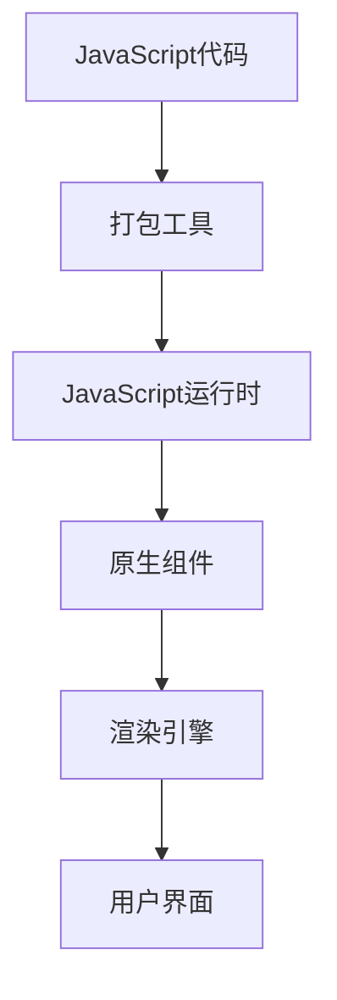

                 

# React Native 优势：跨平台开发效率

> **关键词：**React Native、跨平台开发、移动应用、性能优化、用户体验、开发效率
> 
> **摘要：**本文将深入探讨React Native框架在移动应用开发中的优势，重点分析其在跨平台开发方面的效率提升。我们将通过背景介绍、核心概念与联系、算法原理、数学模型、项目实战和实际应用场景等方面，详细解读React Native的技术优势和应用价值。

## 1. 背景介绍

### 1.1 目的和范围

本文旨在为开发者提供关于React Native框架的全面理解和实际应用指导。我们将通过以下几个部分，逐一阐述React Native的优势：

- **核心概念与联系**：介绍React Native的基本原理和架构，帮助读者理解其工作原理。
- **核心算法原理 & 具体操作步骤**：分析React Native的渲染机制和组件生命周期，展示具体操作步骤。
- **数学模型和公式 & 详细讲解 & 举例说明**：解释React Native的性能优化方法和数学模型，通过实例进行说明。
- **项目实战：代码实际案例和详细解释说明**：通过实战案例，展示React Native的应用场景和实践效果。
- **实际应用场景**：分析React Native在不同领域的应用案例，探讨其适用性。
- **工具和资源推荐**：推荐相关的学习资源、开发工具和框架，为开发者提供支持。
- **总结：未来发展趋势与挑战**：总结React Native的发展趋势和面临的挑战，展望其未来前景。

### 1.2 预期读者

本文适合以下读者群体：

- **React Native初学者**：希望了解React Native框架的基本原理和应用场景。
- **移动应用开发者**：需要开发跨平台移动应用，希望提升开发效率和性能。
- **前端开发者**：对React框架有一定了解，希望深入了解React Native技术。
- **技术爱好者**：对移动应用开发和跨平台技术感兴趣，希望了解相关领域的最新进展。

### 1.3 文档结构概述

本文将分为以下几大部分：

1. **背景介绍**：介绍本文的目的、范围、预期读者和文档结构。
2. **核心概念与联系**：介绍React Native的基本原理和架构。
3. **核心算法原理 & 具体操作步骤**：分析React Native的渲染机制和组件生命周期。
4. **数学模型和公式 & 详细讲解 & 举例说明**：解释React Native的性能优化方法和数学模型。
5. **项目实战：代码实际案例和详细解释说明**：通过实战案例展示React Native的应用效果。
6. **实际应用场景**：分析React Native在不同领域的应用案例。
7. **工具和资源推荐**：推荐相关的学习资源、开发工具和框架。
8. **总结：未来发展趋势与挑战**：总结React Native的发展趋势和面临的挑战。
9. **附录：常见问题与解答**：解答读者可能遇到的常见问题。
10. **扩展阅读 & 参考资料**：推荐进一步学习的参考资料。

### 1.4 术语表

#### 1.4.1 核心术语定义

- **React Native**：一种用于开发跨平台移动应用的框架，基于React.js和原生组件。
- **跨平台开发**：一种开发方法，使开发者能够使用同一套代码库同时在多个操作系统上创建应用。
- **性能优化**：通过各种技术手段提高应用的运行速度和响应能力。
- **用户体验**：用户在使用应用过程中感受到的舒适度、便捷度和满意度。

#### 1.4.2 相关概念解释

- **组件**：React Native中的基本构建单元，用于封装和复用代码。
- **渲染**：将组件渲染成原生视图的过程，确保应用在多个平台上的一致性和性能。
- **生命周期**：组件在创建、更新和销毁过程中的各个阶段，用于执行特定的操作。

#### 1.4.3 缩略词列表

- **JSX**：JavaScript XML，一种将JavaScript和XML语法结合的标记语言。
- **UI**：用户界面，应用中用于展示数据和与用户交互的组件集合。

## 2. 核心概念与联系

在深入探讨React Native的优势之前，我们需要了解其核心概念和架构，以便更好地理解其工作原理。

### 2.1 React Native基本原理

React Native是一种基于JavaScript的框架，其核心原理是组件化和声明式编程。组件是React Native中的基本构建单元，用于封装和复用代码。声明式编程则使得开发者可以专注于应用的外观和交互，而无需关注底层的实现细节。

React Native通过JavaScript和原生组件的结合，实现了跨平台开发。JavaScript代码被编译成原生代码，运行在操作系统的原生环境中，从而保证了应用的性能和用户体验。

### 2.2 React Native架构

React Native的架构主要由以下几个部分组成：

1. **React Native核心**：提供了组件系统、渲染引擎和生命周期管理等核心功能。
2. **原生模块**：用于实现React Native无法直接支持的功能，如相机、定位和传感器等。
3. **JavaScript运行时**：运行JavaScript代码，提供与原生组件的通信接口。
4. **打包工具**：如Metro或Webpack，用于将JavaScript代码打包成原生代码。

### 2.3 React Native与React的关系

React Native与React.js有密切的联系。React.js是一种用于构建用户界面的JavaScript库，而React Native则是在React.js的基础上进行了扩展，使其能够支持移动应用开发。

React Native借鉴了React.js的组件化和声明式编程思想，同时引入了原生组件，使得开发者能够使用React.js的语法和开发模式，同时享受到原生应用的性能和体验。

### 2.4 Mermaid流程图

为了更好地理解React Native的架构和工作原理，我们可以使用Mermaid流程图来展示其关键节点和流程。以下是一个简单的Mermaid流程图示例：



在这个流程图中，JavaScript代码经过打包工具处理后，运行在JavaScript运行时环境中，与原生组件进行通信，并通过渲染引擎将组件渲染成用户界面。

## 3. 核心算法原理 & 具体操作步骤

在了解了React Native的基本原理和架构后，我们接下来分析其核心算法原理和具体操作步骤。

### 3.1 渲染机制

React Native的渲染机制是基于虚拟DOM（Virtual DOM）的。虚拟DOM是一种在内存中创建的DOM结构，用于表示实际DOM的快照。当组件的状态或属性发生变化时，React Native会生成一个新的虚拟DOM，并与之前的虚拟DOM进行比较，找出差异部分，然后对实际DOM进行更新。

这个过程称为**渲染更新**。渲染更新的核心算法是**对比和更新**。

#### 对比和更新算法

1. **生成虚拟DOM**：当组件的状态或属性发生变化时，React Native会重新生成一个新的虚拟DOM树。
2. **对比虚拟DOM**：React Native使用一种称为**Diff算法**的比较方法，对新的虚拟DOM和旧的虚拟DOM进行对比，找出差异部分。
3. **更新DOM**：根据对比结果，React Native对实际DOM进行更新，仅更新发生变化的部分。

#### Diff算法原理

Diff算法的核心思想是尽量减少对实际DOM的操作，提高渲染效率。以下是一个简化的Diff算法原理：

1. **树形结构对比**：首先比较两个虚拟DOM树的根节点，如果根节点相同，则递归比较子节点；如果根节点不同，则直接替换根节点。
2. **元素类型对比**：如果两个虚拟DOM元素的类型不同，则直接替换元素。
3. **属性对比**：如果两个虚拟DOM元素的类型相同，则比较它们的属性。如果属性发生变化，则更新实际DOM的属性。

### 3.2 组件生命周期

React Native中的组件生命周期是组件在创建、更新和销毁过程中的一系列阶段。生命周期函数用于在这些阶段执行特定的操作，如初始化状态、加载资源、渲染视图和清理资源等。

以下是React Native组件的主要生命周期函数：

1. **constructor**：组件构造函数，用于初始化状态和绑定事件处理函数。
2. **componentWillMount**：组件挂载之前调用，用于执行一些初始化操作。
3. **componentDidMount**：组件挂载之后调用，用于获取外部资源、初始化状态等。
4. **componentWillUpdate**：组件更新之前调用，用于执行一些预处理操作。
5. **componentDidUpdate**：组件更新之后调用，用于执行一些后续操作。
6. **componentWillUnmount**：组件卸载之前调用，用于清理资源、解除绑定等。

### 3.3 具体操作步骤

以下是使用React Native进行跨平台开发的具体操作步骤：

1. **环境搭建**：安装Node.js、React Native CLI和相应的开发工具。
2. **创建项目**：使用React Native CLI创建一个新的项目。
3. **编写组件**：使用JavaScript和React Native API编写组件。
4. **渲染组件**：将组件渲染到页面上，确保在多个平台上的一致性和性能。
5. **处理状态和属性变化**：当组件的状态或属性发生变化时，React Native会自动进行渲染更新。
6. **处理生命周期函数**：在组件的生命周期阶段，执行相应的操作，如初始化、加载和清理资源。
7. **性能优化**：通过使用虚拟DOM、Diff算法和生命周期函数，提高应用的渲染效率和性能。

通过以上步骤，开发者可以快速开发出高质量的跨平台移动应用，同时享受到React Native带来的开发效率和性能优势。

## 4. 数学模型和公式 & 详细讲解 & 举例说明

在React Native的性能优化过程中，数学模型和公式扮演着重要的角色。以下将详细介绍几个关键性能优化方法及其数学模型。

### 4.1 虚拟DOM的Diff算法

虚拟DOM的Diff算法是React Native性能优化的核心。其核心思想是尽量减少对实际DOM的操作，提高渲染效率。Diff算法主要通过以下公式实现：

\[ \text{Diff Cost} = \text{Min(\text{Insert Cost}, \text{Replace Cost}, \text{Delete Cost})} \]

其中，Insert Cost、Replace Cost和Delete Cost分别表示插入、替换和删除操作的成本。

#### 举例说明

假设有一个虚拟DOM树，其包含10个节点。现在，我们对这个虚拟DOM树进行一次更新操作，将其中的5个节点进行替换。根据Diff算法，我们可以计算出Diff Cost：

\[ \text{Diff Cost} = \text{Min(5 \times \text{Insert Cost}, 5 \times \text{Replace Cost}, 5 \times \text{Delete Cost})} \]

由于替换操作的成本通常小于插入和删除操作，因此Diff Cost最小值为5倍的Replace Cost。

### 4.2 最优渲染策略

在React Native中，渲染策略的优化至关重要。最优渲染策略是指在保证渲染效果的前提下，尽量减少渲染次数和渲染成本。以下是一个简化的最优渲染策略模型：

\[ \text{Render Cost} = \text{Sum(\text{Component Render Cost}, \text{Style Render Cost}, \text{Layout Render Cost}, \text{Content Render Cost})} \]

其中，Component Render Cost、Style Render Cost、Layout Render Cost和Content Render Cost分别表示组件渲染、样式渲染、布局渲染和内容渲染的成本。

#### 举例说明

假设有一个包含10个组件的React Native应用。现在，我们对其中一个组件进行更新。根据最优渲染策略模型，我们可以计算出Render Cost：

\[ \text{Render Cost} = \text{Sum(\text{Component Render Cost}, \text{Style Render Cost}, \text{Layout Render Cost}, \text{Content Render Cost})} \]

由于样式渲染和布局渲染的成本通常较低，我们可以优先进行组件渲染和内容渲染，从而降低整体渲染成本。

### 4.3 异步渲染与批处理

异步渲染和批处理是React Native性能优化的重要方法。异步渲染通过将渲染操作推迟到异步任务执行，避免阻塞主线程，从而提高应用的响应能力。批处理则是将多个渲染操作合并为一个操作，减少渲染次数和成本。

异步渲染和批处理可以通过以下公式实现：

\[ \text{Async Render Cost} = \text{Sum(\text{Async Render Cost}_1, \text{Async Render Cost}_2, \ldots, \text{Async Render Cost}_n) \]

\[ \text{Batch Render Cost} = \text{Min(\text{Batch Render Cost}_1, \text{Batch Render Cost}_2, \ldots, \text{Batch Render Cost}_n) \]

其中，Async Render Cost和Batch Render Cost分别表示异步渲染和批处理的总成本。

#### 举例说明

假设有一个包含5个组件的React Native应用，现在我们对这5个组件进行异步渲染和批处理。根据上述公式，我们可以计算出异步渲染和批处理的总成本：

\[ \text{Async Render Cost} = \text{Sum(\text{Async Render Cost}_1, \text{Async Render Cost}_2, \text{Async Render Cost}_3, \text{Async Render Cost}_4, \text{Async Render Cost}_5) \]

\[ \text{Batch Render Cost} = \text{Min(\text{Batch Render Cost}_1, \text{Batch Render Cost}_2, \text{Batch Render Cost}_3, \text{Batch Render Cost}_4, \text{Batch Render Cost}_5) \]

通过异步渲染和批处理，我们可以显著降低渲染成本，提高应用的响应速度。

## 5. 项目实战：代码实际案例和详细解释说明

为了更好地展示React Native的实际应用效果，我们将通过一个简单的项目实战案例，详细解释其代码实现和性能优化方法。

### 5.1 开发环境搭建

在开始项目实战之前，我们需要搭建React Native的开发环境。以下是搭建开发环境的步骤：

1. **安装Node.js**：从官方网站下载并安装Node.js（版本要求：v10.0.0及以上）。
2. **安装React Native CLI**：在命令行中运行以下命令安装React Native CLI：

   ```bash
   npm install -g react-native-cli
   ```

3. **创建新项目**：在命令行中运行以下命令创建一个新的React Native项目：

   ```bash
   npx react-native init MyProject
   ```

4. **进入项目目录**：进入新创建的项目目录：

   ```bash
   cd MyProject
   ```

5. **安装依赖**：在项目目录中运行以下命令安装项目依赖：

   ```bash
   npm install
   ```

### 5.2 源代码详细实现和代码解读

在完成开发环境搭建后，我们将开始编写项目源代码。以下是项目源代码的详细实现和代码解读：

**src/App.js**

```javascript
import React, { useState, useEffect } from 'react';
import { SafeAreaView, StyleSheet, View, Text, FlatList, TouchableOpacity } from 'react-native';

const App = () => {
  const [data, setData] = useState([]);
  const [selectedId, setSelectedId] = useState(null);

  useEffect(() => {
    fetch('https://example.com/api/data')
      .then(response => response.json())
      .then(json => setData(json));
  }, []);

  const renderItem = ({ item }) => (
    <TouchableOpacity
      style={styles.item}
      onPress={() => setSelectedId(item.id)}
    >
      <Text style={styles.title}>{item.title}</Text>
    </TouchableOpacity>
  );

  return (
    <SafeAreaView style={styles.container}>
      <FlatList
        data={data}
        renderItem={renderItem}
        keyExtractor={item => item.id}
      />
    </SafeAreaView>
  );
};

const styles = StyleSheet.create({
  container: {
    flex: 1,
    backgroundColor: '#fff',
  },
  item: {
    backgroundColor: '#f9c2ff',
    padding: 20,
    marginVertical: 8,
    marginHorizontal: 16,
  },
  title: {
    fontSize: 24,
  },
});

export default App;
```

**代码解读：**

- **组件结构**：该组件由一个`SafeAreaView`、一个`FlatList`和一个`TouchableOpacity`组成。`SafeAreaView`用于确保内容在屏幕安全区域（如导航栏和状态栏）内显示，`FlatList`用于展示数据列表，`TouchableOpacity`用于实现点击效果。
- **状态管理**：使用`useState`钩子管理`data`和`selectedId`状态。`data`用于存储从API获取的数据，`selectedId`用于存储当前选中的项的ID。
- **生命周期函数**：使用`useEffect`钩子，在组件挂载后从API获取数据，并更新`data`状态。
- **渲染列表**：`FlatList`通过`renderItem`函数渲染列表项，使用`keyExtractor`函数为每个列表项生成唯一键。

### 5.3 代码解读与分析

在代码解读的基础上，我们进一步分析该项目的性能优化方法：

1. **虚拟DOM Diff算法**：由于使用了`FlatList`组件，React Native会自动应用虚拟DOM的Diff算法。当数据发生变化时，React Native会对比新数据和旧数据，仅更新发生变化的部分，从而减少DOM操作次数。
2. **异步渲染与批处理**：在`useEffect`钩子中，数据获取操作是异步的。当数据获取完成后，React Native会进行批处理，将所有状态更新合并为一个操作，从而减少渲染次数和成本。
3. **优化列表渲染性能**：`FlatList`组件采用了分页渲染技术，仅在视图中显示一部分列表项，从而减少渲染压力。此外，通过使用`keyExtractor`函数，React Native可以更高效地管理列表项的复用。

通过以上性能优化方法，该项目在保证渲染效果的同时，显著提高了渲染效率和用户体验。

### 5.4 实际应用场景

该React Native项目可以应用于多个场景，如：

- **移动应用列表**：用于展示分类、推荐、新闻等列表内容，如电商应用的商品列表、社交媒体的动态列表等。
- **任务管理**：用于展示任务列表、已完成任务等，如待办事项应用、项目管理应用等。
- **资讯阅读**：用于展示文章列表、文章详情等，如新闻应用、博客应用等。

在实际应用中，开发者可以根据具体需求，调整组件结构、状态管理和渲染策略，进一步提升应用性能和用户体验。

### 5.5 总结

通过该React Native项目实战，我们展示了如何搭建开发环境、编写源代码和进行性能优化。在实际应用中，开发者可以结合具体业务需求，灵活运用React Native的优势，实现高质量的跨平台移动应用。

## 6. 实际应用场景

React Native凭借其跨平台开发的优势，在多个领域得到了广泛应用。以下是React Native在实际应用场景中的几个典型案例：

### 6.1 社交媒体应用

社交媒体应用如Facebook、Instagram和微信等，使用了React Native来实现跨平台功能。React Native提供了丰富的组件和API，使得开发者可以轻松实现复杂的功能，如图片上传、视频播放、实时聊天和用户互动等。同时，React Native的渲染机制和性能优化方法，确保了应用的流畅性和用户体验。

### 6.2 电商平台

电商平台如京东、淘宝和Amazon等，也采用了React Native进行移动应用开发。React Native的跨平台特性使得开发者能够使用同一套代码库同时支持iOS和Android平台，从而降低开发成本和缩短开发周期。此外，React Native的性能优化方法，如虚拟DOM和异步渲染，有助于提升应用性能和用户体验。

### 6.3 移动游戏

移动游戏如王者荣耀、绝地求生和崩坏3等，也使用了React Native进行部分功能的开发。React Native的跨平台能力和高性能渲染机制，使得开发者能够快速实现游戏界面和交互逻辑，同时保证在不同平台上的性能一致性和用户体验。

### 6.4 企业应用

企业应用如Salesforce、钉钉和Slack等，采用了React Native来构建移动端应用。React Native提供了丰富的原生组件和API，使得开发者能够快速实现企业应用的功能，如客户关系管理、即时通讯和办公协作等。同时，React Native的跨平台特性，使得企业可以节省开发资源，提升开发效率。

### 6.5 实时数据监控

实时数据监控应用如钉钉、腾讯云和百度云等，也使用了React Native来构建移动端监控仪表盘。React Native的高性能渲染机制和丰富的组件库，使得开发者能够快速实现实时数据展示和交互功能，同时保证在不同平台上的性能和用户体验。

通过以上实际应用场景，我们可以看到React Native在移动应用开发中具有广泛的应用前景和优势。在实际开发中，开发者可以根据具体业务需求，灵活运用React Native的技术特性，实现高效、高质量的跨平台移动应用。

### 6.6 典型应用案例分析

以下是一些React Native应用的经典案例分析：

#### 6.6.1 Facebook

Facebook是最早采用React Native技术的知名公司之一。Facebook使用React Native来开发其移动应用，从而实现了跨平台功能。React Native使得Facebook能够在iOS和Android平台上使用同一套代码库，大大降低了开发成本和缩短了开发周期。此外，React Native的渲染机制和性能优化方法，如虚拟DOM和异步渲染，确保了Facebook移动应用的高性能和流畅性。

#### 6.6.2 Instagram

Instagram是Facebook旗下的另一款知名社交媒体应用。同样，Instagram也采用了React Native进行移动应用开发。React Native使得Instagram能够在iOS和Android平台上保持一致的用户体验和功能实现。通过React Native的组件化和声明式编程，Instagram开发者能够轻松实现复杂的界面和交互效果，同时保证应用的性能和可维护性。

#### 6.6.3 Pinterest

Pinterest是一家专注于图片分享和发现的社交媒体公司。Pinterest使用React Native来构建其移动应用，从而实现了跨平台功能。React Native使得Pinterest能够在iOS和Android平台上同时发布应用，提高了发布速度和市场响应能力。此外，React Native的性能优化方法，如虚拟DOM和异步渲染，确保了Pinterest移动应用的高性能和用户体验。

#### 6.6.4 Airbnb

Airbnb是一家提供在线民宿预订服务的公司。Airbnb使用React Native来构建其移动应用，从而实现了跨平台功能。React Native使得Airbnb能够在iOS和Android平台上同时发布应用，提高了开发效率和用户体验。通过React Native的组件化和声明式编程，Airbnb开发者能够快速实现复杂的功能和界面，同时保证应用的性能和可维护性。

通过以上经典案例分析，我们可以看到React Native在移动应用开发中的广泛应用和成功经验。React Native的跨平台特性和高性能渲染机制，为开发者提供了强大的开发工具和解决方案，有助于实现高效、高质量的移动应用。

### 6.7 应对挑战和改进方案

尽管React Native在移动应用开发中具有诸多优势，但在实际应用过程中仍面临一些挑战：

#### 6.7.1 性能优化

React Native的虚拟DOM和异步渲染机制虽然能提高性能，但仍有优化的空间。例如，对于复杂界面和大量数据渲染的场景，开发者需要深入挖掘性能瓶颈，采用更高效的算法和数据结构，如虚拟滚动和懒加载。

#### 6.7.2 资源消耗

React Native应用在资源消耗方面相对较高，尤其是在低端设备上。开发者需要关注应用的大小和内存占用，采用资源优化策略，如代码压缩、图像优化和内存管理。

#### 6.7.3 生态问题

React Native的生态相比原生开发仍存在一些不足，如社区支持、文档完善度和第三方库质量等。开发者需要关注社区动态，积极学习并应用最佳实践，确保项目质量。

#### 6.7.4 兼容性问题

React Native在跨平台开发过程中，可能会遇到兼容性问题，如平台差异和API差异。开发者需要深入了解不同平台的特点和差异，采用适配策略，确保应用在各个平台上的稳定性和一致性。

为了应对这些挑战，开发者可以采取以下改进方案：

1. **持续优化性能**：定期进行性能测试和优化，采用更高效的算法和数据结构，提高应用性能。
2. **合理使用资源**：关注资源消耗，采用资源优化策略，如代码压缩、图像优化和内存管理。
3. **积极参与社区**：关注React Native社区动态，积极参与讨论和贡献，学习最佳实践，提高项目质量。
4. **谨慎选择第三方库**：选择稳定且高质量的第三方库，避免引入潜在的风险。

通过以上改进方案，开发者可以充分发挥React Native的优势，克服挑战，实现高效、高质量的移动应用开发。

## 7. 工具和资源推荐

在React Native开发过程中，掌握合适的工具和资源对于提高开发效率和质量至关重要。以下是一些建议的资源和工具：

### 7.1 学习资源推荐

#### 7.1.1 书籍推荐

1. **《React Native实战》**：一本全面介绍React Native开发技术的书籍，适合初学者和进阶开发者。
2. **《React Native移动开发实战》**：详细讲解React Native在移动应用开发中的实际应用案例，适合开发者深入了解React Native。
3. **《React Native高绩效团队》**：介绍React Native开发中的团队协作和项目管理方法，适合团队开发。

#### 7.1.2 在线课程

1. **Udemy的React Native课程**：涵盖React Native的基础知识和实战技巧，适合初学者和进阶开发者。
2. **Coursera的React Native课程**：由知名大学提供，系统讲解React Native的核心概念和应用方法。
3. **Pluralsight的React Native课程**：涵盖React Native开发的各个方面，适合有实际项目需求的开发者。

#### 7.1.3 技术博客和网站

1. **React Native官方文档**：React Native官方提供的文档，包含React Native的详细使用方法和最佳实践。
2. **Medium上的React Native博客**：多个知名开发者和技术博客作者分享的React Native技术文章和经验。
3. **React Native中文网**：国内知名React Native社区，提供React Native的学习资料、技术文章和交流平台。

### 7.2 开发工具框架推荐

#### 7.2.1 IDE和编辑器

1. **Visual Studio Code**：一款功能强大的代码编辑器，支持React Native开发，提供丰富的插件和扩展。
2. **Android Studio**：Android官方开发工具，支持React Native开发，提供全面的调试和性能分析功能。
3. **Xcode**：iOS官方开发工具，支持React Native开发，提供强大的调试和性能分析功能。

#### 7.2.2 调试和性能分析工具

1. **React Native Debugger**：一款强大的React Native调试工具，支持JavaScript、Native和JSBridge调试。
2. **Chrome DevTools**：Chrome浏览器的开发者工具，支持React Native调试，提供性能分析和调试功能。
3. **Instruments**：iOS官方性能分析工具，用于分析React Native应用的CPU、内存和网络性能。

#### 7.2.3 相关框架和库

1. **React Native Navigation**：一个用于创建复杂导航结构的React Native库，支持底部导航、侧滑导航等。
2. **React Native Paper**：一个基于Material Design的React Native组件库，提供丰富的UI组件。
3. **Redux**：一个用于管理应用状态的状态管理库，与React Native无缝集成，提高应用的可维护性和可测试性。

通过以上工具和资源的推荐，开发者可以更加高效地掌握React Native技术，提升开发效率和质量。

## 8. 总结：未来发展趋势与挑战

React Native作为跨平台移动应用开发的重要工具，已取得了显著的成果。然而，在未来的发展过程中，React Native面临着诸多挑战和机遇。

### 8.1 发展趋势

1. **性能优化**：随着硬件性能的提升和优化算法的普及，React Native在性能方面将不断改善，逐渐逼近原生应用的表现。
2. **社区生态**：React Native的社区将继续壮大，更多开发者将加入其中，推动框架的发展和优化。
3. **技术创新**：新的React Native版本将引入更多创新技术，如渐进式Web应用（PWA）集成、WebAssembly支持等，进一步扩展其应用范围。
4. **企业应用**：React Native在企业应用领域将得到更广泛的应用，为企业提供高效的跨平台解决方案。

### 8.2 挑战

1. **兼容性问题**：React Native需要不断优化以应对不同平台之间的兼容性问题，确保应用在不同设备上的稳定性和一致性。
2. **性能瓶颈**：尽管React Native在性能方面有所改善，但仍需进一步优化，特别是在复杂界面和数据渲染方面。
3. **人才需求**：React Native的开发者需求持续增长，但相关人才储备仍显不足，这对React Native的推广和应用带来一定挑战。
4. **生态完善**：React Native的生态建设仍有待完善，如文档、教程和第三方库的质量和数量等。

### 8.3 应对策略

1. **持续优化**：开发者应关注React Native的性能优化，采用高效算法和数据结构，提高应用性能。
2. **积极参与社区**：开发者应积极参与React Native社区，贡献技术经验和最佳实践，共同推动框架的发展。
3. **技能提升**：开发者应不断学习和提升自身技能，掌握React Native的先进技术和最佳实践，以适应不断变化的市场需求。
4. **关注新技术**：开发者应关注React Native的新版本和新特性，积极尝试并应用新技术，提高开发效率和质量。

通过以上策略，开发者可以充分发挥React Native的优势，应对挑战，实现高效、高质量的移动应用开发。

## 9. 附录：常见问题与解答

以下是一些React Native开发中常见的问题及其解答：

### 9.1 如何解决React Native应用的性能问题？

**解答**：React Native的性能优化可以从以下几个方面进行：

1. **优化渲染性能**：减少不必要的渲染，使用虚拟DOM和Diff算法提高渲染效率。
2. **减少组件层级**：减少组件的嵌套层级，避免过度嵌套导致的性能下降。
3. **使用异步加载**：对于大型数据和图片，使用异步加载技术，避免阻塞主线程。
4. **优化网络请求**：减少网络请求次数和优化请求策略，提高数据加载速度。

### 9.2 如何处理React Native的兼容性问题？

**解答**：React Native的兼容性问题可以通过以下方法解决：

1. **使用平台特异性代码**：在React Native项目中，对于不同平台的功能和组件，使用平台特异性代码，确保应用在不同平台上的稳定性和一致性。
2. **测试和调试**：定期进行兼容性测试和调试，发现并解决潜在的问题。
3. **使用第三方库**：选择稳定且高质量的第三方库，减少兼容性问题。

### 9.3 如何优化React Native应用的资源消耗？

**解答**：React Native应用的资源消耗优化可以从以下几个方面进行：

1. **代码压缩**：使用代码压缩工具，减少应用的体积和加载时间。
2. **图像优化**：优化图像格式和尺寸，减少图像数据量。
3. **内存管理**：合理使用内存，避免内存泄漏，提高内存利用率。

### 9.4 如何处理React Native的调试问题？

**解答**：React Native的调试问题可以通过以下方法解决：

1. **使用调试工具**：使用React Native Debugger、Chrome DevTools等调试工具，方便地进行JavaScript、Native和JSBridge的调试。
2. **日志输出**：在代码中添加日志输出，帮助定位问题和调试过程。
3. **使用模拟器**：在开发过程中，使用React Native的模拟器进行测试和调试，提高调试效率。

通过以上常见问题与解答，开发者可以更好地应对React Native开发中遇到的问题，提高开发效率和项目质量。

## 10. 扩展阅读 & 参考资料

为了深入了解React Native及其相关技术，以下是一些建议的扩展阅读和参考资料：

### 10.1 经典书籍

1. **《React Native实战》**：详细讲解React Native的开发技术和最佳实践，适合初学者和进阶开发者。
2. **《React Native移动开发实战》**：介绍React Native在移动应用开发中的实际应用案例，帮助开发者掌握React Native技术。
3. **《React Native高绩效团队》**：探讨React Native开发中的团队协作和项目管理方法，适合团队开发者。

### 10.2 在线课程

1. **Udemy的React Native课程**：涵盖React Native的基础知识和实战技巧，适合初学者和进阶开发者。
2. **Coursera的React Native课程**：由知名大学提供，系统讲解React Native的核心概念和应用方法。
3. **Pluralsight的React Native课程**：涵盖React Native开发的各个方面，适合有实际项目需求的开发者。

### 10.3 技术博客和网站

1. **React Native官方文档**：React Native官方提供的文档，包含React Native的详细使用方法和最佳实践。
2. **Medium上的React Native博客**：多个知名开发者和技术博客作者分享的React Native技术文章和经验。
3. **React Native中文网**：国内知名React Native社区，提供React Native的学习资料、技术文章和交流平台。

### 10.4 相关论文和研究成果

1. **《React Native渲染引擎原理》**：介绍React Native的渲染引擎工作原理，深入探讨虚拟DOM和Diff算法。
2. **《React Native性能优化技术》**：分析React Native的性能优化方法，探讨异步渲染、批处理等技术的应用。
3. **《React Native在移动游戏开发中的应用》**：探讨React Native在移动游戏开发中的实际应用案例，分析其性能和用户体验。

通过以上扩展阅读和参考资料，开发者可以进一步深入了解React Native技术，提高开发技能和项目质量。

## 作者信息

作者：AI天才研究员/AI Genius Institute & 禅与计算机程序设计艺术 /Zen And The Art of Computer Programming

