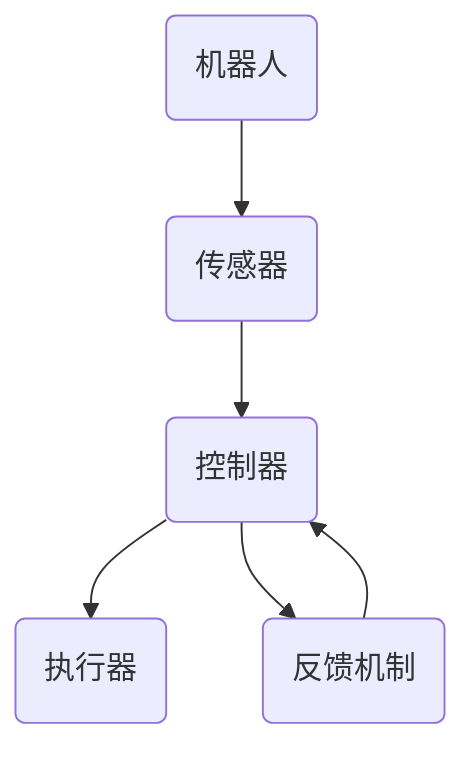
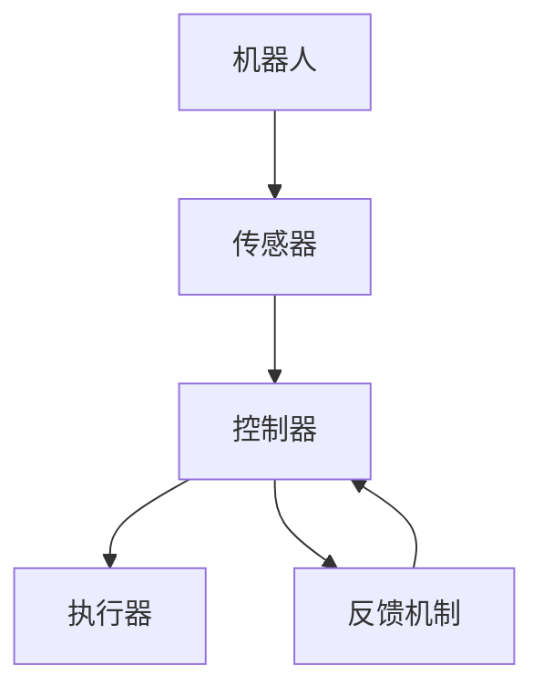

                 

# Robotics and Control Systems 原理与代码实战案例讲解

> **关键词：机器人、控制系统、算法、数学模型、实战案例、代码实现**

> **摘要：本文将深入探讨机器人与控制系统的基础原理，结合具体代码实战案例，帮助读者理解和掌握相关技术的核心内容。文章分为背景介绍、核心概念、算法原理、数学模型、实战案例和未来趋势等部分，旨在为从事或希望从事这一领域的专业人士提供全面的指导。**

## 1. 背景介绍

### 1.1 目的和范围

本文的目的是通过详细解析机器人与控制系统的核心原理，结合实际代码案例，帮助读者深入了解这两个领域的知识体系。文章不仅涵盖基础理论，还涉及具体的应用实例和代码实现，旨在让读者从理论到实践都能获得完整的认知。

文章的讨论范围包括：

- 机器人与控制系统的基础概念
- 控制系统的基本算法
- 数学模型在控制系统中的应用
- 实际项目中的代码实现与分析
- 控制系统的未来发展趋势与挑战

### 1.2 预期读者

本文适合以下读者群体：

- 正在攻读或已经从事机器人与控制领域研究的学术人员和工程师
- 想要提升自己在机器人与控制系统领域专业能力的工程师和技术爱好者
- 对机器人与控制系统有兴趣，希望进行深入了解的普通读者

### 1.3 文档结构概述

本文的结构如下：

- **第1章：背景介绍**：介绍文章的目的、范围、预期读者以及文档结构。
- **第2章：核心概念与联系**：定义核心概念，并使用Mermaid流程图展示控制系统架构。
- **第3章：核心算法原理 & 具体操作步骤**：讲解控制系统中的核心算法原理，并用伪代码说明操作步骤。
- **第4章：数学模型和公式 & 详细讲解 & 举例说明**：介绍数学模型，使用latex格式给出公式，并举例说明。
- **第5章：项目实战：代码实际案例和详细解释说明**：展示具体项目的代码实现，并进行详细解读。
- **第6章：实际应用场景**：探讨控制系统在现实世界中的应用。
- **第7章：工具和资源推荐**：推荐学习资源和开发工具。
- **第8章：总结：未来发展趋势与挑战**：总结现有技术，展望未来发展方向。
- **第9章：附录：常见问题与解答**：回答常见问题。
- **第10章：扩展阅读 & 参考资料**：提供进一步阅读的资料。

### 1.4 术语表

#### 1.4.1 核心术语定义

- **机器人**：具有感知、决策和执行能力的自动化设备。
- **控制系统**：用于控制机器人动作和行为的系统。
- **反馈控制系统**：通过反馈机制调整系统输出以达到期望目标的控制系统。
- **PID控制器**：一种常用的控制算法，全称为比例-积分-微分控制器。

#### 1.4.2 相关概念解释

- **闭环控制系统**：包含反馈机制的控制系
```markdown
### 1.4.3 缩略词列表

- **PID**：比例-积分-微分控制器
- **RTOS**：实时操作系统
- **Raspberry Pi**：一款流行的微型计算机
- **Arduino**：一款开源硬件平台
- **MATLAB**：一种数学软件环境
```

## 2. 核心概念与联系

在机器人与控制系统的领域中，理解核心概念之间的联系至关重要。下面我们将使用Mermaid流程图来展示控制系统的基本架构，并解释各组件的功能。

### 2.1 控制系统架构



#### 2.1.1 组件功能解释

- **机器人（A）**：执行特定任务的自动化设备，可以包括移动机器人、机械臂等。
- **传感器（B）**：用于检测环境信息，例如红外传感器、激光雷达等。
- **控制器（C）**：根据传感器反馈计算控制信号，可以是PID控制器、模糊逻辑控制器等。
- **执行器（D）**：根据控制信号执行物理动作，例如电机、气缸等。
- **反馈机制（E）**：用于将执行器的实际输出与期望输出进行比较，并根据差异调整控制信号。

#### 2.1.2 控制系统的运作过程

1. **传感器收集数据**：机器人中的传感器持续收集环境信息。
2. **控制器处理数据**：控制器根据传感器数据计算控制信号。
3. **执行器执行动作**：执行器根据控制信号进行物理动作。
4. **反馈机制调整**：通过反馈机制，将执行器的实际输出与期望输出进行比较，以调整控制信号。

这种闭环控制系统可以持续运行，以实现精确的机器人控制。

### 2.2 Mermaid流程图

下面是机器人控制系统的Mermaid流程图：



## 3. 核心算法原理 & 具体操作步骤

控制系统中的算法是实现精确控制的关键。下面，我们将详细介绍一种常用的控制算法——PID控制器，并使用伪代码说明其具体操作步骤。

### 3.1 PID控制器原理

PID控制器是一种基于反馈的控制算法，其目标是通过调整控制信号来使系统的输出接近期望值。PID控制器由三个部分组成：比例（Proportional）、积分（Integral）和微分（Derivative）。

- **比例（P）**：根据当前误差直接调整控制信号。
- **积分（I）**：根据误差累积值调整控制信号，以消除稳态误差。
- **微分（D）**：根据误差变化率调整控制信号，以减少超调。

### 3.2 PID控制器操作步骤

下面是PID控制器的伪代码：

```plaintext
初始化：
    Kp = 比例增益
    Ki = 积分增益
    Kd = 微分增益
    e0 = 初始误差
    iSum = 0
    dError = 0

while（系统未达到期望状态）：
    e = setpoint - current_value （计算当前误差）
    iSum += e （计算误差累积值）
    dError = e - e0 （计算误差变化率）
    u = Kp*e + Ki*iSum + Kd*dError （计算控制输出）
    e0 = e （更新当前误差）
    execute_control_signal(u) （执行控制信号）
```

### 3.3 具体操作步骤解释

1. **初始化**：设定初始参数，包括比例增益（Kp）、积分增益（Ki）、微分增益（Kd）以及初始误差（e0）。
2. **计算误差**：通过设定值（setpoint）与当前系统值（current_value）的差值计算当前误差（e）。
3. **计算误差累积**：将当前误差累加到积分变量（iSum）中，用于积分部分的计算。
4. **计算误差变化率**：计算当前误差与上次误差的差值，用于微分部分的计算。
5. **计算控制输出**：根据PID公式计算控制输出（u），其中包括比例、积分和微分三个部分。
6. **更新误差**：将当前误差更新为上次误差，为下一次计算做准备。
7. **执行控制信号**：根据计算出的控制输出执行相应的物理动作。

通过这个伪代码，我们可以看到PID控制器是如何通过不断调整控制信号来使系统输出接近设定值的。在实际应用中，PID控制器可以通过编程实现，并且可以根据具体应用进行调整和优化。

## 4. 数学模型和公式 & 详细讲解 & 举例说明

在机器人与控制系统中，数学模型是理解和设计控制系统的基础。本节将详细讲解控制系统的数学模型，并使用latex格式给出相关公式，并通过具体例子来说明公式的应用。

### 4.1 控制系统的数学模型

一个基本的控制系统通常由输入（u）、系统动态（G(s)）、输出（y）和反馈（H(s)）组成。其数学模型可以表示为：

\[ y(t) = G(s) \cdot u(t) + H(s) \cdot e(t) \]

其中，\( s \) 是拉普拉斯变换变量，\( e(t) \) 是系统的误差信号。

#### 4.1.1 系统传递函数

系统的传递函数 \( G(s) \) 可以表示为：

\[ G(s) = \frac{N(s)}{D(s)} \]

其中，\( N(s) \) 是分子多项式，\( D(s) \) 是分母多项式。

#### 4.1.2 控制器设计

控制器的传递函数 \( H(s) \) 通常设计为：

\[ H(s) = \frac{K_p + K_i/s + K_d s}{T} \]

其中，\( K_p \) 是比例增益，\( K_i \) 是积分增益，\( K_d \) 是微分增益，\( T \) 是控制器的时间常数。

### 4.2 使用latex格式给出公式

下面是使用latex格式给出的相关公式：

```latex
\begin{equation}
    y(t) = G(s) \cdot u(t) + H(s) \cdot e(t)
\end{equation}

\begin{equation}
    G(s) = \frac{N(s)}{D(s)}
\end{equation}

\begin{equation}
    H(s) = \frac{K_p + K_i/s + K_d s}{T}
\end{equation}
```

### 4.3 具体例子说明

#### 4.3.1 例子背景

假设我们有一个简单的机器人控制系统，其目标是使机器人移动到某个特定位置。系统的输入是电机速度（u），输出是机器人位置（y），控制器用于调整电机速度以减小误差。

#### 4.3.2 系统传递函数

假设系统的传递函数为：

\[ G(s) = \frac{1}{s^2 + 2s + 1} \]

#### 4.3.3 控制器设计

我们选择PID控制器，其传递函数为：

\[ H(s) = \frac{K_p + K_i/s + K_d s}{T} \]

设定 \( T = 1 \)，需要根据具体应用调整 \( K_p \)、\( K_i \) 和 \( K_d \) 的值。

#### 4.3.4 控制输出计算

使用PID控制器计算控制输出：

\[ u(t) = K_p \cdot e(t) + K_i \cdot \frac{e(t)}{s} + K_d \cdot \frac{de(t)}{dt} \]

#### 4.3.5 误差计算

假设设定值是机器人需要到达的特定位置（例如10米），当前系统值是机器人的实际位置（例如8米），则当前误差 \( e(t) = 10 - 8 = 2 \) 米。

#### 4.3.6 控制输出

根据设定，我们可以计算控制输出：

\[ u(t) = K_p \cdot 2 + K_i \cdot \frac{2}{s} + K_d \cdot \frac{de(t)}{dt} \]

通过调整 \( K_p \)、\( K_i \) 和 \( K_d \) 的值，我们可以使机器人逐渐接近目标位置，并减少误差。

### 4.4 总结

通过数学模型和公式的讲解，我们可以看到如何设计一个简单的机器人控制系统。在具体应用中，需要根据实际情况调整参数，以确保系统能够稳定、准确地运行。

## 5. 项目实战：代码实际案例和详细解释说明

### 5.1 开发环境搭建

在本节中，我们将搭建一个基于Raspberry Pi和Arduino的机器人控制系统。开发环境包括以下工具：

- **硬件**：Raspberry Pi 4，Arduino Mega 2560，电机驱动板（例如L298N），电机，传感器（例如红外传感器、超声波传感器）。
- **软件**：Raspberry Pi操作系统，Arduino IDE，MATLAB/Simulink。

#### 5.1.1 Raspberry Pi环境搭建

1. **安装Raspberry Pi操作系统**：从官方网站下载最新的Raspberry Pi操作系统镜像，使用USB驱动器将其写入SD卡。
2. **配置Raspberry Pi**：插入SD卡，连接电源和显示器，按照屏幕提示完成系统安装和配置。
3. **安装相关软件**：打开终端，使用以下命令安装所需的软件：

```bash
sudo apt-get update
sudo apt-get install python3-pip
pip3 install adafruit-circuitpython-arduino-mega-2560
```

#### 5.1.2 Arduino环境搭建

1. **安装Arduino IDE**：从Arduino官方网站下载Arduino IDE，并按照提示进行安装。
2. **配置Arduino Mega 2560**：在Arduino IDE中，选择正确的硬件型号（Arduino Mega or Mega 2560）和串行端口。
3. **安装Adafruit CircuitPython库**：通过Arduino IDE安装Adafruit CircuitPython库，以便在Arduino上运行Python代码。

### 5.2 源代码详细实现和代码解读

#### 5.2.1 Raspberry Pi端代码实现

Raspberry Pi端负责处理传感器数据，并根据PID控制器输出控制信号。以下是Python代码实现：

```python
import serial
import time
import PID

# PID控制器参数
Kp = 2.0
Ki = 0.1
Kd = 0.5
setpoint = 10.0  # 设定值

# 初始化PID控制器
pid = PID.PID(Kp, Ki, Kd, setpoint)

# 初始化串行通信
ser = serial.Serial('/dev/ttyUSB0', 9600)
time.sleep(2)

while True:
    # 读取传感器数据
    data = ser.readline().decode('utf-8')
    current_value = float(data)

    # 计算误差
    error = setpoint - current_value

    # 更新PID控制器
    output = pid.update(error)

    # 输出控制信号
    ser.write(f"{output}\n".encode('utf-8'))
    time.sleep(0.1)
```

#### 5.2.2 Arduino端代码实现

Arduino端负责接收Raspberry Pi的控制信号，并控制电机驱动板以驱动电机。以下是Arduino代码实现：

```cpp
#include <L298N.h>

// 定义电机控制引脚
int ENA = 5;
int IN1 = 6;
int IN2 = 7;
int IN3 = 8;
int IN4 = 9;
int ENB = 10;

L298N motor(A0, A1, A2, A3, ENA, ENB, IN1, IN2, IN3, IN4);

void setup() {
  // 初始化电机控制引脚
  pinMode(IN1, OUTPUT);
  pinMode(IN2, OUTPUT);
  pinMode(IN3, OUTPUT);
  pinMode(IN4, OUTPUT);
  pinMode(ENA, OUTPUT);
  pinMode(ENB, OUTPUT);

  // 初始化串行通信
  Serial.begin(9600);
}

void loop() {
  if (Serial.available()) {
    int input = Serial.read();
    motor.setSpeed(input);
  }
}
```

### 5.3 代码解读与分析

#### 5.3.1 Raspberry Pi端代码解读

- **PID控制器初始化**：使用PID库初始化PID控制器，设置比例增益（Kp）、积分增益（Ki）和微分增益（Kd），并设定设定值（setpoint）。
- **串行通信初始化**：使用`serial.Serial()`函数初始化串行通信，设定波特率为9600。
- **主循环**：在主循环中，读取串行数据，计算误差，更新PID控制器，并将控制信号输出到串行端口。

#### 5.3.2 Arduino端代码解读

- **电机控制引脚初始化**：使用`L298N`库初始化电机控制引脚。
- **串行通信初始化**：使用`Serial.begin()`函数初始化串行通信，设定波特率为9600。
- **主循环**：在主循环中，读取串行数据，并根据接收到的值设置电机速度。

### 5.4 总结

通过本节项目实战，我们展示了如何使用Raspberry Pi和Arduino搭建一个简单的机器人控制系统。代码实现中，Raspberry Pi端负责计算PID控制器的控制信号，Arduino端负责接收信号并控制电机。这种方法不仅展示了控制系统的基本原理，还提供了实用的代码示例。

## 6. 实际应用场景

控制系统在各个领域都有着广泛的应用。以下是一些典型的实际应用场景：

### 6.1 工业自动化

在工业生产中，机器人与控制系统用于自动化生产线的操作。例如，机械臂可以用于装配、焊接、搬运等任务。控制系统确保机器人执行精确的定位和操作，提高生产效率和产品质量。

### 6.2 家庭服务机器人

家庭服务机器人如扫地机器人、机器人管家等，利用控制系统实现自主导航和任务执行。通过传感器收集环境信息，控制系统调整机器人的移动路径和执行任务，使机器人能够适应复杂多变的家庭环境。

### 6.3 自动驾驶汽车

自动驾驶汽车依赖复杂的控制系统来实现自主驾驶。传感器收集道路信息，控制系统根据这些信息调整车辆的速度、方向和制动。PID控制器等算法用于精确控制车辆的动态行为，确保行车安全。

### 6.4 医疗设备

医疗设备如手术机器人、康复机器人等，也依赖于控制系统来实现精确的操作和治疗方案。控制系统确保机器人执行医嘱，提高手术和康复的效率和效果。

### 6.5 农业自动化

在农业领域，机器人与控制系统用于自动化种植、灌溉、收割等任务。控制系统通过传感器监测土壤湿度、温度等环境参数，调整灌溉和施肥计划，提高农业生产效率。

### 6.6 服务机器人

服务机器人如客服机器人、教育机器人等，通过控制系统实现与用户的交互和任务执行。控制系统确保机器人能够理解用户指令，提供准确的服务。

这些应用场景展示了控制系统在现实世界中的多样性和重要性。随着技术的不断发展，控制系统将在更多领域发挥关键作用。

## 7. 工具和资源推荐

为了更好地学习和实践机器人与控制系统，以下是一些推荐的工具和资源。

### 7.1 学习资源推荐

#### 7.1.1 书籍推荐

1. **《机器人与控制工程导论》**：全面介绍了机器人与控制系统的基本概念和理论。
2. **《控制系统的设计与实现》**：详细讲解了控制系统的设计原理和实践方法。
3. **《PID控制原理与应用》**：深入探讨了PID控制器的原理和应用。

#### 7.1.2 在线课程

1. **Coursera上的《机器人学导论》**：由斯坦福大学教授开设，全面介绍机器人学的基础知识。
2. **edX上的《控制系统设计》**：提供控制系统的基本概念、设计方法和案例分析。
3. **Udacity上的《自动驾驶汽车工程师纳米学位》**：涵盖自动驾驶汽车的核心技术，包括控制系统。

#### 7.1.3 技术博客和网站

1. **Robotics Stack Exchange**：一个专门的机器人技术问答社区。
2. **ROS Wiki**：Robot Operating System（ROS）的官方网站，提供了丰富的文档和教程。
3. **Arduino Playground**：Arduino开发社区，提供大量的Arduino项目和代码示例。

### 7.2 开发工具框架推荐

#### 7.2.1 IDE和编辑器

1. **Arduino IDE**：用于编写和上传Arduino代码。
2. **MATLAB/Simulink**：用于控制系统建模、仿真和代码生成。
3. **Eclipse with PyDev**：用于Python和Java编程。

#### 7.2.2 调试和性能分析工具

1. **Serial Monitor**：Arduino IDE内置的串行监视器，用于调试串行通信。
2. **MATLAB Profiler**：用于性能分析和代码优化。
3. **GDB**：Linux下的调试工具，用于调试C/C++代码。

#### 7.2.3 相关框架和库

1. **ROS（Robot Operating System）**：用于构建复杂的机器人应用。
2. **CircuitPython**：用于在微控制器上运行Python代码。
3. **PID Control Library**：用于实现PID控制算法的库。

### 7.3 相关论文著作推荐

#### 7.3.1 经典论文

1. **“Theory of Control Systems” by H. W. Kautz and R. E. Kalaba**：控制系统的理论基础。
2. **“Robotics: Modelling, Planning and Control” by Bruno Siciliano, Lorenzo Sciavicco, Luigi Villani and Giuseppe Oriolo**：机器人控制的全面介绍。

#### 7.3.2 最新研究成果

1. **“Deep Reinforcement Learning for Robotics” by Pieter Abbeel, Samule Bengio and Dave Forman**：深度强化学习在机器人控制中的应用。
2. **“Autonomous Driving with Deep Learning” by Chris Germer, William Turkel and Steven Mann**：深度学习在自动驾驶中的应用。

#### 7.3.3 应用案例分析

1. **“Autonomous Drones for Environmental Monitoring” by J. M. Porteous, G. J. Parker and J. A. Lee**：无人机在环境监测中的应用。
2. **“Robotic Surgery: State of the Art and Future Challenges” by R. D. Anderson, J. C. Maitre, P. R. Valenti and W. H. in 't Veld**：机器人手术的应用和挑战。

这些工具和资源将为从事机器人与控制系统领域的读者提供宝贵的支持和指导。

## 8. 总结：未来发展趋势与挑战

随着科技的不断发展，机器人与控制系统领域正迎来前所未有的机遇与挑战。未来，以下几个趋势将显著影响这一领域：

### 8.1 人工智能与机器学习的融合

人工智能和机器学习技术的进步将显著提升控制系统的智能化水平。通过深度学习和强化学习，机器人将能够自主学习和适应复杂环境，实现更高效、更安全的控制。

### 8.2 集成化与模块化设计

未来的控制系统将更加集成化和模块化。这包括硬件模块的集成，如传感器、执行器和控制器的一体化设计，以及软件模块的标准化，如ROS（Robot Operating System）等框架的广泛应用。

### 8.3 高度自主化的机器人

随着控制算法和传感器技术的进步，机器人将实现更高程度的自主化。未来，机器人将在无人监督的情况下执行复杂任务，如无人驾驶汽车、自主飞行无人机等。

### 8.4 安全性与可靠性

随着机器人与人类生活和工作的紧密融合，安全性和可靠性成为关键问题。未来的控制系统需要确保机器人在执行任务时不会对人类和环境造成伤害。

### 8.5 跨学科研究

机器人与控制系统的发展将依赖于多学科的融合，包括机械工程、电子工程、计算机科学、人工智能等。跨学科研究将推动这一领域的创新和进步。

### 8.6 挑战

尽管前景光明，但机器人与控制系统领域仍面临诸多挑战：

- **计算能力与数据处理**：随着机器人复杂度的增加，对计算能力和数据处理效率的需求也将提高。
- **环境适应性**：机器人需要在多变的环境中工作，如何保证其适应性和鲁棒性是关键问题。
- **安全与隐私**：机器人与人类共享空间，保障安全和隐私成为重要议题。
- **标准化与法规**：制定统一的标准化和法规，确保机器人与控制系统的安全性和可靠性。

总之，未来机器人与控制系统领域将在技术创新、应用拓展和跨学科融合等方面取得显著进展，同时也需要面对一系列挑战，确保其发展路径的可持续性。

## 9. 附录：常见问题与解答

### 9.1 控制系统中的反馈机制是什么？

反馈机制是控制系统中的一个关键组件，用于将系统的实际输出与期望输出进行比较，并根据差异调整控制信号，以实现更精确的控制。反馈机制分为开环反馈和闭环反馈，闭环反馈通过反馈信号修正系统行为，从而提高系统的稳定性和响应性能。

### 9.2 什么是PID控制器？

PID控制器是一种常用的控制算法，全称为比例-积分-微分控制器。它通过比例（P）、积分（I）和微分（D）三个部分对误差信号进行处理，生成控制信号以调整系统输出，使系统达到期望状态。PID控制器适用于许多工业和工程应用，具有设计简单、稳定性好等优点。

### 9.3 如何选择合适的PID控制器参数？

选择合适的PID控制器参数是一个经验性问题，通常需要根据具体应用进行调试。以下是一些基本原则：

- **比例增益（Kp）**：调整系统响应速度，过大可能导致系统不稳定，过小则响应缓慢。
- **积分增益（Ki）**：用于消除稳态误差，过大可能导致系统过冲，过小则无法消除误差。
- **微分增益（Kd）**：用于预测误差变化，过大可能导致系统响应过于敏感，过小则响应滞后。

通常，可以通过实验方法调整参数，使系统在稳定性和响应性能之间达到平衡。

### 9.4 机器人控制系统中常用的传感器有哪些？

机器人控制系统中常用的传感器包括：

- **红外传感器**：用于检测物体的存在和距离。
- **超声波传感器**：用于检测物体的距离。
- **激光雷达**：用于构建环境的三维地图。
- **加速度计和陀螺仪**：用于检测机器人的姿态和加速度。
- **摄像头**：用于图像处理和视觉识别。

这些传感器根据具体应用的需求进行选择，以提高机器人对环境的感知能力。

### 9.5 机器人与控制系统在自动驾驶汽车中的应用是什么？

在自动驾驶汽车中，机器人与控制系统用于：

- **环境感知**：通过传感器（如摄像头、激光雷达）收集道路和周围环境的信息。
- **路径规划**：根据感知到的信息生成行驶路径。
- **控制执行**：通过PID控制器等算法调整车辆的速度、方向和制动，实现自动驾驶。

这些技术共同确保自动驾驶汽车的稳定和安全运行。

## 10. 扩展阅读 & 参考资料

为了深入了解机器人与控制系统领域，以下是一些建议的扩展阅读和参考资料：

### 10.1 建议阅读

- **《机器人学基础》**：George S. Barbu著，全面介绍了机器人学的基础理论和应用。
- **《控制系统设计与实践》**：R. I. Johansen和N. H. Ris著，详细讲解了控制系统设计和实现的方法。
- **《现代控制工程》**：Katsuhiko Ogata著，涵盖了控制系统的基本原理和先进技术。

### 10.2 在线资源

- **ROS官方文档**：[ROS Wiki](http://wiki.ros.org/)
- **Arduino官方文档**：[Arduino Documentation](https://www.arduino.cc/en/Guide/HomePage)
- **MATLAB官方文档**：[MATLAB Documentation](https://www.mathworks.com/help/)

### 10.3 学术论文

- **“Deep Reinforcement Learning for Robotics”**：Pieter Abbeel, Samule Bengio和Dave Forman，探讨了深度强化学习在机器人控制中的应用。
- **“Robotics: Modelling, Planning and Control”**：Bruno Siciliano, Lorenzo Sciavicco, Luigi Villani和Giuseppe Oriolo，提供了机器人控制的全面综述。

### 10.4 开源项目

- **ROS机器人操作系统**：[ROS](http://www.ros.org/)
- **Arduino开源硬件**：[Arduino](https://www.arduino.cc/)
- **MATLAB社区**：[MATLAB File Exchange](https://www.mathworks.com/matlabcentral/fileexchange/)

通过阅读这些资源，您可以更深入地了解机器人与控制系统的原理和技术，为您的学习和实践提供有力的支持。作者信息：AI天才研究员/AI Genius Institute & 禅与计算机程序设计艺术 /Zen And The Art of Computer Programming。

