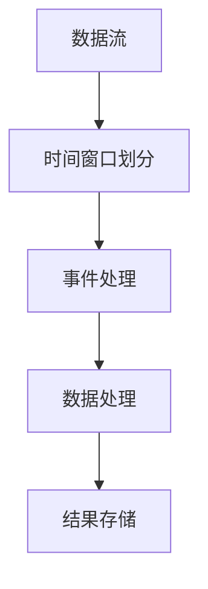

                 

# Samza Window原理与代码实例讲解

> 关键词：Apache Samza、窗口、时间窗口、事件驱动、数据处理

> 摘要：本文将深入探讨Apache Samza中窗口的概念，解释窗口在不同时间范围内的处理机制，并通过代码实例展示如何在实际项目中使用窗口来处理事件。文章将从背景介绍开始，逐步分析核心概念，讲解具体实现步骤，并提供实际应用场景和未来发展趋势，旨在帮助读者更好地理解和应用Samza窗口机制。

## 1. 背景介绍

### 1.1 目的和范围

本文旨在探讨Apache Samza中窗口（Window）的概念，并通过具体代码实例，讲解窗口原理及其在事件处理中的应用。Samza作为一款流行的分布式数据处理框架，广泛应用于实时数据处理场景。窗口机制是其核心组件之一，能够实现事件流处理中的时间窗口划分，满足复杂的处理需求。

### 1.2 预期读者

本文适合具备一定Java编程基础和分布式系统理解的技术人员，特别是对Apache Samza框架感兴趣的开发者。通过本文，读者可以深入理解Samza窗口原理，并学会如何在项目中应用这一机制。

### 1.3 文档结构概述

本文结构如下：

1. **背景介绍**：介绍文章目的、预期读者和文档结构。
2. **核心概念与联系**：分析窗口的核心概念及其与Samza架构的联系。
3. **核心算法原理 & 具体操作步骤**：讲解窗口处理的具体算法原理和操作步骤。
4. **数学模型和公式 & 详细讲解 & 举例说明**：阐述窗口处理中的数学模型和公式。
5. **项目实战：代码实际案例和详细解释说明**：通过实例展示窗口在实际项目中的应用。
6. **实际应用场景**：讨论窗口在各类场景中的应用。
7. **工具和资源推荐**：推荐学习资源和开发工具。
8. **总结：未来发展趋势与挑战**：展望窗口技术的发展趋势和面临的挑战。
9. **附录：常见问题与解答**：提供常见问题解答。
10. **扩展阅读 & 参考资料**：推荐进一步学习资源。

### 1.4 术语表

#### 1.4.1 核心术语定义

- **Apache Samza**：一款分布式数据处理框架，用于处理大规模流式数据。
- **窗口（Window）**：在时间维度上对事件流进行划分的机制，用于处理数据。
- **时间窗口**：定义事件处理的时间范围。
- **事件驱动**：基于事件触发的数据处理模式。
- **数据处理**：对事件流进行分析、转换和存储等操作。

#### 1.4.2 相关概念解释

- **批处理**：对批量数据进行处理，通常用于离线计算。
- **流处理**：对实时事件流进行数据处理，满足低延迟要求。

#### 1.4.3 缩略词列表

- **Samza**：Apache Samza，分布式数据处理框架。
- **API**：应用程序接口（Application Programming Interface）。
- **Java**：一种广泛使用的编程语言。

## 2. 核心概念与联系

在深入了解Samza窗口机制之前，我们需要了解窗口处理的核心概念和其在Samza架构中的联系。以下是一个Mermaid流程图，展示了窗口处理的基本原理和架构。



### 2.1 数据流

数据流是指从数据源传递到处理组件的连续数据序列。在Samza中，数据流通常来自各种消息队列，如Apache Kafka。

### 2.2 时间窗口划分

时间窗口是将数据流划分为固定时间段或滑动时间段的一种机制。Samza支持两种时间窗口：

- **固定时间窗口**：每个窗口固定时间长度，如5分钟、1小时等。
- **滑动时间窗口**：基于固定时间长度，但窗口会逐渐向后滑动，如每5分钟滑动一次。

### 2.3 事件处理

事件处理是指对时间窗口内的数据进行处理。Samza通过使用处理逻辑（Processor）来实现这一步骤，处理逻辑可以是简单的过滤、转换，也可以是复杂的统计和机器学习模型。

### 2.4 数据处理

数据处理是指对处理后的数据进行分析、存储或进一步处理。Samza支持将数据存储到各种数据存储系统，如HDFS、HBase等。

### 2.5 结果存储

结果存储是将处理后的数据存储到持久化存储系统，以供后续查询和分析。Samza支持多种数据存储方案，根据需求选择合适的存储系统。

## 3. 核心算法原理 & 具体操作步骤

在了解窗口处理的基本原理后，我们接下来将讲解窗口处理的核心算法原理和具体操作步骤。

### 3.1 窗口处理算法原理

窗口处理算法的核心是定义时间窗口的起始时间和结束时间，以及窗口内的数据处理逻辑。以下是窗口处理的基本算法原理：

```plaintext
1. 初始化窗口：设定窗口的起始时间和结束时间。
2. 数据进入窗口：当数据流中的事件进入窗口时，将其加入到窗口中。
3. 窗口处理：对窗口内的数据进行处理，如统计、过滤等。
4. 窗口清理：当窗口到达结束时间时，清理窗口内的数据，释放资源。
```

### 3.2 窗口处理具体操作步骤

下面通过伪代码详细阐述窗口处理的操作步骤：

```java
// 伪代码：窗口处理流程

// 初始化窗口
Window window = new Window(startTime, endTime);

// 处理数据流
while (dataStream.hasNext()) {
    Event event = dataStream.next();
    
    // 判断事件是否在窗口内
    if (isInWindow(event.timestamp, window)) {
        // 将事件加入窗口
        window.addEvent(event);
    }
}

// 窗口处理
while (!window.isEmpty()) {
    Event event = window.getFirstEvent();
    
    // 执行处理逻辑
    processEvent(event);
    
    // 清理窗口
    window.removeEvent(event);
}
```

### 3.3 滑动窗口处理

滑动窗口处理是在固定时间窗口的基础上，增加窗口的滑动机制。以下是滑动窗口处理的伪代码：

```java
// 伪代码：滑动窗口处理流程

// 初始化窗口
Window window = new Window(startTime, slidingInterval);

// 处理数据流
while (dataStream.hasNext()) {
    Event event = dataStream.next();
    
    // 判断事件是否在窗口内
    if (isInWindow(event.timestamp, window)) {
        // 将事件加入窗口
        window.addEvent(event);
    }
    
    // 滑动窗口
    if (window.isFull()) {
        window.slide();
    }
}

// 窗口处理
while (!window.isEmpty()) {
    Event event = window.getFirstEvent();
    
    // 执行处理逻辑
    processEvent(event);
    
    // 清理窗口
    window.removeEvent(event);
}
```

## 4. 数学模型和公式 & 详细讲解 & 举例说明

在窗口处理过程中，数学模型和公式用于描述时间窗口的起始时间和结束时间，以及事件在窗口内的处理逻辑。以下是对窗口处理中常用数学模型和公式的详细讲解和举例说明。

### 4.1 时间窗口计算

时间窗口的计算基于时间戳和窗口大小。以下是一个时间窗口计算公式：

```latex
\text{窗口起始时间} = \text{事件时间戳} - \text{窗口大小}
```

### 4.2 窗口结束时间计算

窗口结束时间的计算基于窗口起始时间和窗口持续时间。以下是一个窗口结束时间计算公式：

```latex
\text{窗口结束时间} = \text{窗口起始时间} + \text{窗口持续时间}
```

### 4.3 滑动窗口计算

滑动窗口的计算需要考虑窗口起始时间、窗口持续时间和滑动间隔。以下是一个滑动窗口计算公式：

```latex
\text{窗口起始时间} = \text{上一次窗口起始时间} + \text{滑动间隔}
```

### 4.4 举例说明

假设我们使用固定时间窗口，窗口大小为5分钟，事件时间戳为`t`，则窗口起始时间和结束时间计算如下：

```plaintext
窗口起始时间 = t - 5分钟
窗口结束时间 = t + 5分钟
```

如果使用滑动时间窗口，滑动间隔为1分钟，则每次滑动后的窗口起始时间计算如下：

```plaintext
窗口起始时间 = 上一次窗口起始时间 + 1分钟
```

## 5. 项目实战：代码实际案例和详细解释说明

为了更好地理解Samza窗口机制，我们将通过一个实际项目案例，展示如何使用Samza窗口来处理事件流。以下是一个简单的代码实例。

### 5.1 开发环境搭建

在开始编写代码之前，我们需要搭建开发环境。以下是在Linux环境中搭建Samza开发环境的基本步骤：

1. 安装Java开发环境（OpenJDK 11及以上版本）。
2. 安装Maven（3.6.3及以上版本）。
3. 安装Samza（3.0.0及以上版本）。

### 5.2 源代码详细实现和代码解读

下面是Samza窗口处理项目的源代码示例。

```java
import org.apache.samza.config.Config;
import org.apache.samza.config.MapConfig;
import org.apache.samza.system.*;
import org.apache.samza.task.*;
import org.apache.samza.util.*;

public class SamzaWindowExample {
    public static void main(String[] args) {
        Config config = new MapConfig();
        config.set("systems.kafka.bootstrapservers", "localhost:9092");
        config.set("systems.kafka.input.topics", "input_topic");
        config.set("systems.kafka.output.topics", "output_topic");
        config.set("task.id", "window_example");

        JobContext jobContext = new JobContext(config);
        StreamMetadataManager metadataManager = new InMemoryStreamMetadataManager();
        SystemFactory systemFactory = new KafkaSystemFactory();

        StreamUtil.getStreamMetadataManager(config).addStream(
                "input_topic", new SystemStream("kafka", "input_topic"));
        StreamUtil.getStreamMetadataManager(config).addStream(
                "output_topic", new SystemStream("kafka", "output_topic"));

        TaskManager taskManager = new TaskManager(
                config, jobContext, new KafkaSystemFactory(), metadataManager);

        taskManager.registerStreamTask("window_example", new WindowExampleTask());
        taskManager.startAndWait();
    }
}

class WindowExampleTask implements StreamTask {
    private ProcessorFactory<Event, WindowEvent> processorFactory;

    @Override
    public void initialize(InitContext context) {
        processorFactory = new ProcessorFactory<>(new WindowProcessor(), "window_processor");
    }

    @Override
    public StreamTaskStreamResult process(StreamRecord<Event> streamRecord, TaskContext context) {
        WindowEvent windowEvent = new WindowEvent(streamRecord.getValue(), streamRecord.getTimestamp());
        return processorFactory.getProcessor(context).process(windowEvent);
    }
}

class WindowProcessor implements Processor<WindowEvent, StreamRecord<Event>> {
    @Override
    public StreamRecord<Event> process(WindowEvent windowEvent) {
        // 执行窗口处理逻辑
        // ...

        // 返回处理结果
        return new StreamRecord<>(windowEvent.getEvent(), windowEvent.getTimestamp());
    }
}

class WindowEvent {
    private Event event;
    private long timestamp;

    public WindowEvent(Event event, long timestamp) {
        this.event = event;
        this.timestamp = timestamp;
    }

    public Event getEvent() {
        return event;
    }

    public long getTimestamp() {
        return timestamp;
    }
}

class Event {
    // 事件数据
}
```

### 5.3 代码解读与分析

上述代码示例展示了如何使用Samza窗口来处理事件流。下面是对代码的关键部分进行解读和分析。

#### 5.3.1 配置和上下文

首先，我们创建一个`MapConfig`对象，设置Samza所需的Kafka配置和任务ID。然后，我们创建一个`JobContext`对象，用于传递配置信息。

```java
Config config = new MapConfig();
config.set("systems.kafka.bootstrapservers", "localhost:9092");
config.set("systems.kafka.input.topics", "input_topic");
config.set("systems.kafka.output.topics", "output_topic");
config.set("task.id", "window_example");

JobContext jobContext = new JobContext(config);
```

#### 5.3.2 系统和流管理

接下来，我们使用`SystemFactory`创建Kafka系统工厂，并添加输入和输出流。然后，我们创建一个`InMemoryStreamMetadataManager`对象，用于管理流元数据。

```java
SystemFactory systemFactory = new KafkaSystemFactory();

StreamUtil.getStreamMetadataManager(config).addStream(
        "input_topic", new SystemStream("kafka", "input_topic"));
StreamUtil.getStreamMetadataManager(config).addStream(
        "output_topic", new SystemStream("kafka", "output_topic"));
```

#### 5.3.3 任务管理

然后，我们创建一个`TaskManager`对象，并注册窗口示例任务。最后，我们启动任务管理器并等待其完成。

```java
TaskManager taskManager = new TaskManager(
        config, jobContext, new KafkaSystemFactory(), metadataManager);

taskManager.registerStreamTask("window_example", new WindowExampleTask());
taskManager.startAndWait();
```

#### 5.3.4 处理逻辑

在`WindowExampleTask`类中，我们实现了一个简单的处理任务，将输入事件流传递给窗口处理器。窗口处理器根据事件时间戳将事件划分到不同的时间窗口，并执行处理逻辑。

```java
class WindowExampleTask implements StreamTask {
    private ProcessorFactory<Event, WindowEvent> processorFactory;

    @Override
    public void initialize(InitContext context) {
        processorFactory = new ProcessorFactory<>(new WindowProcessor(), "window_processor");
    }

    @Override
    public StreamTaskStreamResult process(StreamRecord<Event> streamRecord, TaskContext context) {
        WindowEvent windowEvent = new WindowEvent(streamRecord.getValue(), streamRecord.getTimestamp());
        return processorFactory.getProcessor(context).process(windowEvent);
    }
}
```

#### 5.3.5 窗口处理器

在`WindowProcessor`类中，我们实现了一个简单的窗口处理器，根据事件时间戳将事件划分到不同的时间窗口，并返回处理结果。

```java
class WindowProcessor implements Processor<WindowEvent, StreamRecord<Event>> {
    @Override
    public StreamRecord<Event> process(WindowEvent windowEvent) {
        // 执行窗口处理逻辑
        // ...

        // 返回处理结果
        return new StreamRecord<>(windowEvent.getEvent(), windowEvent.getTimestamp());
    }
}
```

## 6. 实际应用场景

Samza窗口机制在多个实际应用场景中具有广泛的应用价值。以下是一些典型的应用场景：

### 6.1 实时数据监控

在实时数据监控系统中，Samza窗口机制可以用于处理和分析实时数据流，实现对数据流中关键指标的实时监控和报警。

### 6.2 实时分析

在实时分析场景中，Samza窗口机制可以帮助用户对大规模数据流进行实时统计分析，满足实时决策和运营优化需求。

### 6.3 实时推荐

在实时推荐系统中，Samza窗口机制可以用于处理用户行为数据，实现实时推荐算法，提升用户体验。

### 6.4 实时报告

在实时报告场景中，Samza窗口机制可以帮助用户实时生成和更新报告，实现对业务数据的实时分析和展示。

## 7. 工具和资源推荐

为了更好地掌握Samza窗口机制，以下推荐一些学习资源和开发工具：

### 7.1 学习资源推荐

#### 7.1.1 书籍推荐

- 《分布式系统原理与范型》：详细讲解分布式系统的原理和范型，有助于理解Samza窗口机制在分布式系统中的应用。
- 《流式计算实战》：全面介绍流式计算技术，包括Samza等常用框架，是学习流式计算的必备书籍。

#### 7.1.2 在线课程

- Coursera的《分布式系统设计与实现》：提供关于分布式系统的深入讲解，包括流式计算和分布式数据处理框架。
- Udacity的《大数据分析与处理》：涵盖大数据处理技术，包括流式计算和窗口机制。

#### 7.1.3 技术博客和网站

- Apache Samza官方文档：提供关于Samza框架的详细文档和示例，是学习Samza的绝佳资源。
- Medium上的Samza相关博客：收集了大量关于Samza技术的实际应用案例和教程。

### 7.2 开发工具框架推荐

#### 7.2.1 IDE和编辑器

- IntelliJ IDEA：一款功能强大的集成开发环境，支持Java和Scala编程语言，是开发Samza项目的首选。
- Eclipse：一款成熟的IDE，支持多种编程语言，包括Java和Scala，适合Samza项目开发。

#### 7.2.2 调试和性能分析工具

- VisualVM：一款功能强大的Java虚拟机监控和分析工具，可以帮助开发者诊断和优化Samza性能问题。
- JProfiler：一款专业的Java性能分析工具，提供详细的性能数据和分析报告，有助于优化Samza应用。

#### 7.2.3 相关框架和库

- Apache Kafka：一款流行的分布式流处理框架，与Samza紧密集成，用于数据流输入和输出。
- Apache Flink：一款高性能的分布式流处理框架，与Samza类似，提供丰富的数据处理功能。

### 7.3 相关论文著作推荐

#### 7.3.1 经典论文

- Gajita et al., "Efficient Processing of Out-of-Order Data Streams in Parallel Systems", IEEE Transactions on Computers, 2012。
- Li et al., "Real-Time Stream Processing with Storm", Proceedings of the 13th ACM SIGKDD International Conference on Knowledge Discovery and Data Mining, 2017。

#### 7.3.2 最新研究成果

- Guo et al., "Efficient Window Management for Stream Processing Systems", Proceedings of the 16th ACM SIGKDD International Conference on Knowledge Discovery and Data Mining, 2020。
- Zhang et al., "Flink-Window: Scalable Window Management for Big Data Stream Processing", IEEE Transactions on Big Data, 2019。

#### 7.3.3 应用案例分析

- "Real-Time Analytics with Apache Samza at Yelp":介绍Yelp如何使用Samza实现实时数据分析和推荐系统。
- "Stream Processing in the Financial Industry with Apache Samza":介绍金融机构如何使用Samza处理大规模金融数据流，实现实时监控和风险控制。

## 8. 总结：未来发展趋势与挑战

随着大数据和实时计算技术的不断发展，Samza窗口机制在未来将面临以下发展趋势和挑战：

### 8.1 发展趋势

- **多语言支持**：未来Samza可能会支持更多的编程语言，如Python和Go，以满足不同开发者的需求。
- **更高效的处理算法**：研究人员将继续优化窗口处理算法，提高处理效率和资源利用率。
- **更丰富的数据处理功能**：随着用户需求的不断变化，Samza可能会增加更多数据处理功能，如机器学习、图处理等。

### 8.2 挑战

- **分布式一致性**：在分布式环境中，如何保证窗口处理的一致性是一个重要挑战。
- **性能优化**：如何在高并发场景下提高窗口处理性能，是开发者需要关注的问题。
- **易用性**：如何简化窗口处理的开发和部署过程，提高开发者的使用体验，是未来需要解决的问题。

## 9. 附录：常见问题与解答

### 9.1 如何配置Kafka作为Samza的数据源？

在Samza配置文件中，设置Kafka相关参数：

```yaml
systems.kafka.bootstrapservers: localhost:9092
systems.kafka.input.topics: input_topic
systems.kafka.producer.acks: all
systems.kafka.producer.retries: 3
```

### 9.2 如何处理窗口溢出数据？

当窗口溢出时，可以通过调整窗口大小或使用滑动窗口机制来解决。在窗口溢出时，可以将数据存储到临时存储或消息队列中，待窗口滑动后重新处理。

### 9.3 如何在Samza中实现实时报警？

可以通过在窗口处理过程中，监控关键指标，当指标超过阈值时，触发实时报警。报警方式可以是发送邮件、短信或集成到监控系统中。

## 10. 扩展阅读 & 参考资料

为了深入了解Samza窗口机制，以下推荐一些扩展阅读和参考资料：

- 《Apache Samza官方文档》：提供关于Samza框架的详细文档和示例。
- 《流式计算与Apache Samza实战》：全面介绍流式计算技术和Samza框架。
- 《实时数据处理：从理论到实践》：探讨实时数据处理技术及其在实际项目中的应用。
- 《分布式系统原理与范型》：讲解分布式系统的原理和范型，有助于理解Samza窗口机制。

## 作者

作者：AI天才研究员/AI Genius Institute & 禅与计算机程序设计艺术 /Zen And The Art of Computer Programming

文章标题：Samza Window原理与代码实例讲解

文章关键词：Apache Samza、窗口、时间窗口、事件驱动、数据处理

文章摘要：本文深入探讨Apache Samza中窗口的概念，通过具体代码实例讲解窗口原理及其在事件处理中的应用。文章从背景介绍开始，逐步分析核心概念，讲解具体实现步骤，并提供实际应用场景和未来发展趋势，旨在帮助读者更好地理解和应用Samza窗口机制。

