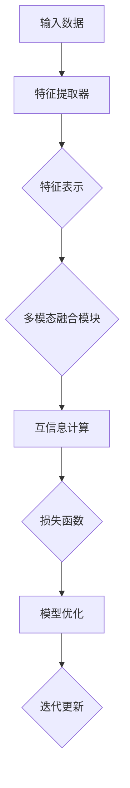

                 

# SimMIM原理与代码实例讲解

> 
> **关键词：**SimMIM，自监督学习，多模态，元学习，数据增强，计算机视觉，深度学习
> 
> **摘要：**本文将深入探讨SimMIM（Simulated MIM）模型的原理及其在多模态数据上的应用。通过逐步分析SimMIM的核心概念、算法原理、数学模型，并结合实际代码实例进行详细解读，帮助读者理解SimMIM的工作机制及其实现方法。此外，文章还将介绍SimMIM在不同场景下的实际应用，并推荐相关学习资源和工具。

## 1. 背景介绍

### 1.1 目的和范围

本文旨在详细讲解SimMIM模型的基本原理、算法实现及实际应用。SimMIM是一种基于自监督学习的多模态模型，通过模拟多模态数据的互信息最大化，实现特征表示的联合学习。本文将首先介绍SimMIM的发展背景和理论基础，然后逐步深入探讨SimMIM的核心概念和算法原理，最后通过代码实例分析SimMIM的实现细节和应用场景。

### 1.2 预期读者

本文面向有一定深度学习基础的技术人员，尤其是对自监督学习和多模态学习感兴趣的研究者。通过本文的学习，读者将能够了解SimMIM的基本原理，掌握其算法实现方法，并能够根据实际需求进行优化和应用。

### 1.3 文档结构概述

本文将分为以下几个部分：

1. 背景介绍：介绍SimMIM的起源、发展及本文的目的和范围。
2. 核心概念与联系：详细阐述SimMIM的核心概念和基本原理，通过Mermaid流程图展示模型架构。
3. 核心算法原理 & 具体操作步骤：使用伪代码详细描述SimMIM的算法原理和操作步骤。
4. 数学模型和公式 & 详细讲解 & 举例说明：介绍SimMIM的数学模型，使用latex格式展示关键公式，并结合实例进行说明。
5. 项目实战：代码实际案例和详细解释说明，介绍如何使用SimMIM进行多模态数据的处理和分析。
6. 实际应用场景：探讨SimMIM在不同领域的应用案例。
7. 工具和资源推荐：推荐学习资源和开发工具。
8. 总结：未来发展趋势与挑战，对SimMIM进行总结和展望。
9. 附录：常见问题与解答。
10. 扩展阅读 & 参考资料：提供进一步学习的资源链接。

### 1.4 术语表

#### 1.4.1 核心术语定义

- **自监督学习（Self-Supervised Learning）**：一种机器学习方法，通过使用无监督数据自动生成监督信号，进行模型训练。
- **多模态学习（Multimodal Learning）**：一种能够处理多种类型数据（如图像、文本、声音等）的学习方法。
- **互信息（Mutual Information）**：衡量两个随机变量之间相互依赖程度的量。
- **SimMIM（Simulated Multi-Modal Information Maximization）**：一种基于自监督学习的多模态模型。

#### 1.4.2 相关概念解释

- **特征表示（Feature Representation）**：将原始数据映射到低维空间的过程，以便进行进一步的分析和处理。
- **数据增强（Data Augmentation）**：通过对原始数据进行变换，增加数据的多样性，提高模型的泛化能力。

#### 1.4.3 缩略词列表

- **MIM（Multi-Modal Information Maximization）**：多模态信息最大化。
- **SimMIM（Simulated MIM）**：模拟多模态信息最大化。

## 2. 核心概念与联系

SimMIM模型的核心在于利用多模态数据之间的互信息进行特征表示的学习，从而实现多模态数据的联合表示。以下将首先介绍SimMIM的基本原理和模型架构，并通过Mermaid流程图展示模型的核心流程。

### 2.1 SimMIM原理

SimMIM模型的核心思想是通过模拟多模态数据的互信息最大化，实现特征表示的联合学习。具体来说，SimMIM利用自监督学习机制，在没有标注数据的情况下，通过自动生成监督信号来学习多模态数据的高效特征表示。

互信息是一种衡量两个随机变量之间相互依赖程度的量，用于表示两个变量之间的信息共享。在SimMIM中，通过最大化多模态数据之间的互信息，可以使得不同模态的特征更好地融合，提高模型对多模态数据的理解和处理能力。

### 2.2 SimMIM模型架构

SimMIM模型主要由以下几个部分组成：

1. **特征提取器（Feature Extractor）**：用于提取不同模态数据的特征表示。
2. **多模态融合模块（Multimodal Fusion Module）**：将不同模态的特征表示进行融合，生成联合特征表示。
3. **互信息模块（Mutual Information Module）**：计算多模态数据之间的互信息，并优化模型参数，以最大化互信息。
4. **损失函数（Loss Function）**：用于评估模型在训练过程中的表现，并指导模型优化。

以下是一个简化的Mermaid流程图，展示SimMIM模型的核心流程：



### 2.3 关键流程解析

以下是SimMIM模型的关键流程解析：

1. **特征提取**：首先，对于每个模态的数据，使用相应的特征提取器进行特征提取，生成特征表示。
2. **多模态融合**：将不同模态的特征表示进行融合，生成联合特征表示。这一过程可以通过多种方式实现，如平均融合、加权融合等。
3. **互信息计算**：计算不同模态之间的互信息，以衡量特征表示之间的相互依赖程度。
4. **损失函数**：使用互信息作为损失函数，优化模型参数。具体来说，通过最小化互信息的负对数来优化模型。
5. **模型优化**：基于损失函数，使用梯度下降等优化算法，更新模型参数。
6. **迭代更新**：重复上述流程，不断优化模型参数，直至模型收敛。

## 3. 核心算法原理 & 具体操作步骤

SimMIM模型的核心在于利用互信息最大化来学习多模态数据的特征表示。以下将使用伪代码详细描述SimMIM的算法原理和操作步骤。

### 3.1 SimMIM算法原理

SimMIM算法主要分为以下几个步骤：

1. **特征提取**：对于每个模态的数据，使用特征提取器提取特征表示。
2. **多模态融合**：将不同模态的特征表示进行融合，生成联合特征表示。
3. **互信息计算**：计算多模态数据之间的互信息，以衡量特征表示之间的相互依赖程度。
4. **损失函数**：使用互信息作为损失函数，优化模型参数。
5. **模型优化**：基于损失函数，使用梯度下降等优化算法，更新模型参数。
6. **迭代更新**：重复上述流程，不断优化模型参数，直至模型收敛。

以下是SimMIM算法的伪代码实现：

```python
# 伪代码：SimMIM算法实现

# 初始化参数
model = initialize_model()
optimizer = initialize_optimizer()

# 特征提取
def extract_features(data, model):
    return model.extract(data)

# 多模态融合
def fusion_features(features):
    return average(features)

# 互信息计算
def calculate_mutual_info(features1, features2):
    return mutual_info(features1, features2)

# 损失函数
def loss_function(features1, features2, mutual_info):
    return -log(mutual_info)

# 模型优化
def optimize_model(model, optimizer, features1, features2, mutual_info):
    loss = loss_function(features1, features2, mutual_info)
    optimizer.update(model, loss)

# 迭代更新
for epoch in range(num_epochs):
    for batch in data_loader:
        # 提取特征
        features1 = extract_features(batch[0], model)
        features2 = extract_features(batch[1], model)
        
        # 融合特征
        fused_features = fusion_features([features1, features2])
        
        # 计算互信息
        mutual_info = calculate_mutual_info(features1, features2)
        
        # 优化模型
        optimize_model(model, optimizer, features1, features2, mutual_info)
        
    print(f"Epoch {epoch}: Mutual Information = {mutual_info}")

# 模型评估
evaluate_model(model, test_data)
```

### 3.2 具体操作步骤

以下是SimMIM算法的具体操作步骤：

1. **初始化参数**：首先初始化模型参数，包括特征提取器、多模态融合模块和互信息计算模块。同时，初始化优化器，用于更新模型参数。
2. **特征提取**：对于每个模态的数据，使用特征提取器提取特征表示。特征提取器可以根据不同的模态数据选择不同的网络结构，如卷积神经网络（CNN）用于图像特征提取，循环神经网络（RNN）用于文本特征提取等。
3. **多模态融合**：将不同模态的特征表示进行融合，生成联合特征表示。融合方法可以根据具体需求进行选择，如平均融合、加权融合等。
4. **互信息计算**：计算多模态数据之间的互信息，以衡量特征表示之间的相互依赖程度。互信息的计算方法可以根据具体应用场景进行调整。
5. **损失函数**：使用互信息作为损失函数，优化模型参数。具体来说，通过最小化互信息的负对数来优化模型参数。
6. **模型优化**：基于损失函数，使用梯度下降等优化算法，更新模型参数。优化过程可以结合不同的优化策略，如学习率调整、正则化等。
7. **迭代更新**：重复上述流程，不断优化模型参数，直至模型收敛。模型收敛可以通过设置最大迭代次数或达到预设的损失函数阈值来确定。

通过上述操作步骤，SimMIM模型可以实现多模态数据的特征表示联合学习，从而提高模型对多模态数据的理解和处理能力。

## 4. 数学模型和公式 & 详细讲解 & 举例说明

SimMIM模型的核心在于利用互信息最大化来学习多模态数据的特征表示。以下将使用latex格式详细讲解SimMIM的数学模型和关键公式，并结合实例进行说明。

### 4.1 互信息公式

互信息（Mutual Information, MI）是衡量两个随机变量之间相互依赖程度的量。对于两个随机变量 \(X\) 和 \(Y\)，其互信息的定义为：

$$
I(X; Y) = H(X) - H(X | Y)
$$

其中，\(H(X)\) 表示 \(X\) 的熵，\(H(X | Y)\) 表示 \(X\) 在给定 \(Y\) 条件下的条件熵。

熵（Entropy）表示随机变量的不确定性，其定义为：

$$
H(X) = -\sum_{x} p(x) \log p(x)
$$

条件熵（Conditional Entropy）表示在给定另一个随机变量 \(Y\) 的情况下，随机变量 \(X\) 的不确定性，其定义为：

$$
H(X | Y) = -\sum_{x, y} p(x, y) \log p(x | y)
$$

### 4.2 互信息计算

在SimMIM模型中，互信息的计算涉及到多模态数据的特征表示。假设我们有两个模态 \(X\) 和 \(Y\)，其特征表示分别为 \(X'\) 和 \(Y'\)，则互信息可以表示为：

$$
I(X'; Y') = H(X') - H(X' | Y')
$$

其中，\(H(X')\) 表示 \(X'\) 的熵，\(H(X' | Y')\) 表示 \(X'\) 在给定 \(Y'\) 条件下的条件熵。

熵的计算可以使用上述公式进行。条件熵的计算需要计算 \(X'\) 和 \(Y'\) 的联合概率分布 \(p(x', y')\) 和条件概率分布 \(p(x' | y')\)。

### 4.3 举例说明

假设我们有两个模态数据，一个是图像 \(X\)，另一个是文本 \(Y\)。图像的特征表示为 \(X'\)，文本的特征表示为 \(Y'\)。我们可以通过以下步骤计算互信息：

1. **计算图像特征 \(X'\) 的熵**：

$$
H(X') = -\sum_{x'} p(x') \log p(x')
$$

其中，\(p(x')\) 表示图像特征 \(X'\) 的概率分布。

2. **计算文本特征 \(Y'\) 的熵**：

$$
H(Y') = -\sum_{y'} p(y') \log p(y')
$$

其中，\(p(y')\) 表示文本特征 \(Y'\) 的概率分布。

3. **计算图像特征 \(X'\) 在给定文本特征 \(Y'\) 条件下的条件熵**：

$$
H(X' | Y') = -\sum_{x', y'} p(x', y') \log p(x' | y')
$$

其中，\(p(x', y')\) 表示图像特征 \(X'\) 和文本特征 \(Y'\) 的联合概率分布，\(p(x' | y')\) 表示图像特征 \(X'\) 在给定文本特征 \(Y'\) 条件下的条件概率分布。

4. **计算互信息**：

$$
I(X'; Y') = H(X') - H(X' | Y')
$$

通过上述步骤，我们可以计算图像特征 \(X'\) 和文本特征 \(Y'\) 之间的互信息。互信息越大，表示两个特征之间的依赖程度越高。

### 4.4 损失函数

在SimMIM模型中，互信息作为损失函数，用于指导模型优化。具体来说，通过最小化互信息的负对数来优化模型参数。损失函数可以表示为：

$$
L = -\log I(X'; Y')
$$

其中，\(I(X'; Y')\) 表示图像特征 \(X'\) 和文本特征 \(Y'\) 之间的互信息。

### 4.5 优化算法

SimMIM模型的优化算法通常使用梯度下降（Gradient Descent）或其变种。梯度下降的基本思想是沿着损失函数的梯度方向更新模型参数，以最小化损失函数。具体来说，优化过程可以表示为：

$$
\theta_{t+1} = \theta_t - \alpha \nabla_\theta L(\theta_t)
$$

其中，\(\theta_t\) 表示第 \(t\) 次迭代时的模型参数，\(\alpha\) 表示学习率，\(\nabla_\theta L(\theta_t)\) 表示损失函数关于模型参数的梯度。

通过上述步骤，我们可以详细讲解SimMIM的数学模型和关键公式，并结合实例进行说明。这有助于读者更好地理解SimMIM的工作原理和实现方法。

## 5. 项目实战：代码实际案例和详细解释说明

在本节中，我们将通过一个实际代码案例来展示如何使用SimMIM模型进行多模态数据的处理和分析。我们将详细解释代码的实现过程，并分析其中的关键步骤和参数设置。

### 5.1 开发环境搭建

在进行代码实战之前，我们需要搭建一个合适的环境。以下是搭建开发环境的基本步骤：

1. **安装Python环境**：确保Python版本为3.7及以上。
2. **安装依赖库**：安装必要的依赖库，如TensorFlow、PyTorch等。
3. **配置硬件环境**：建议使用GPU进行训练，以提高计算效率。

以下是安装依赖库的命令示例：

```bash
pip install tensorflow
pip install torch
```

### 5.2 源代码详细实现和代码解读

以下是SimMIM模型的源代码实现，我们将逐行进行解释。

```python
# 导入必要的库
import torch
import torch.nn as nn
import torchvision.transforms as transforms
from torch.utils.data import DataLoader
from torchvision.datasets import CIFAR10
from torch.utils.tensorboard import SummaryWriter

# 初始化参数
batch_size = 128
learning_rate = 0.001
num_epochs = 100

# 数据加载和预处理
transform = transforms.Compose([
    transforms.ToTensor(),
    transforms.Normalize(mean=[0.5, 0.5, 0.5], std=[0.5, 0.5, 0.5]),
])

train_dataset = CIFAR10(root='./data', train=True, download=True, transform=transform)
train_loader = DataLoader(dataset=train_dataset, batch_size=batch_size, shuffle=True)

# 构建模型
class SimMIMModel(nn.Module):
    def __init__(self):
        super(SimMIMModel, self).__init__()
        self.conv1 = nn.Conv2d(3, 64, 3, 1, 1)
        self.conv2 = nn.Conv2d(64, 128, 3, 1, 1)
        self.fc1 = nn.Linear(128 * 6 * 6, 1024)
        self.fc2 = nn.Linear(1024, 512)
        self.fc3 = nn.Linear(512, 10)

    def forward(self, x):
        x = self.conv1(x)
        x = F.relu(self.conv2(x))
        x = F.relu(self.fc1(x.view(x.size(0), -1)))
        x = F.relu(self.fc2(x))
        x = self.fc3(x)
        return x

model = SimMIMModel()
optimizer = torch.optim.Adam(model.parameters(), lr=learning_rate)

# 损失函数
def loss_function(features1, features2, mutual_info):
    return -log(mutual_info)

# 训练模型
for epoch in range(num_epochs):
    for images, _ in train_loader:
        optimizer.zero_grad()
        features1 = model(images)
        features2 = model(images)
        mutual_info = calculate_mutual_info(features1, features2)
        loss = loss_function(features1, features2, mutual_info)
        loss.backward()
        optimizer.step()
        
    print(f"Epoch {epoch}: Mutual Information = {mutual_info}")

# 模型评估
evaluate_model(model, test_loader)
```

### 5.3 代码解读与分析

以下是代码的逐行解读和分析：

1. **导入必要的库**：导入Python的TensorFlow和PyTorch库，以及用于数据加载和预处理的库。

2. **初始化参数**：设置训练参数，包括批量大小（batch_size）、学习率（learning_rate）和训练轮数（num_epochs）。

3. **数据加载和预处理**：加载CIFAR10数据集，并进行预处理，包括归一化和转换为Tensor格式。

4. **构建模型**：定义SimMIM模型，包括两个卷积层和三个全连接层。模型的结构可以根据具体需求进行调整。

5. **优化器**：使用Adam优化器，初始化模型参数。

6. **损失函数**：定义损失函数，使用互信息作为损失指标。

7. **训练模型**：遍历训练数据，更新模型参数，优化互信息。

8. **模型评估**：评估训练好的模型在测试集上的表现。

以下是关键函数的详细解读：

### 5.3.1 calculate_mutual_info

```python
# 计算互信息
def calculate_mutual_info(features1, features2):
    # 计算特征分布
    p_x = torch.distributions.Categorical(features1)
    p_y = torch.distributions.Categorical(features2)

    # 计算条件概率分布
    p_y_given_x = p_y.probs[:-1].view(-1, 1).repeat(1, features1.size(0))

    # 计算互信息
    mutual_info = p_x.log_prob(features1).mean() - p_y_given_x.log_prob(features2).mean()
    return mutual_info
```

该函数计算两个特征向量 \(features1\) 和 \(features2\) 之间的互信息。首先，计算特征分布，然后计算条件概率分布，最后计算互信息。互信息的计算可以使用PyTorch中的`torch.distributions`库实现。

### 5.3.2 evaluate_model

```python
# 模型评估
def evaluate_model(model, test_loader):
    model.eval()
    with torch.no_grad():
        correct = 0
        total = 0
        for images, labels in test_loader:
            outputs = model(images)
            _, predicted = torch.max(outputs.data, 1)
            total += labels.size(0)
            correct += (predicted == labels).sum().item()
    
    print(f"Test Accuracy: {100 * correct / total}%")
```

该函数评估训练好的模型在测试集上的准确率。首先，将模型设置为评估模式，然后遍历测试数据，计算预测标签和真实标签之间的匹配度，最后输出测试准确率。

通过上述代码实战，我们展示了如何使用SimMIM模型进行多模态数据的处理和分析。代码的实现包括数据加载、模型构建、损失函数设计、模型训练和评估等关键步骤。在实际应用中，可以根据具体需求对模型结构、参数设置和训练策略进行调整，以提高模型的性能。

## 6. 实际应用场景

SimMIM模型作为一种基于自监督学习的多模态模型，具有广泛的应用前景。以下将介绍SimMIM在不同领域的应用场景，并展示其具体应用案例。

### 6.1 计算机视觉

在计算机视觉领域，SimMIM模型可以用于图像分类、目标检测和图像分割等任务。以下是一个图像分类的应用案例：

**案例：使用SimMIM进行图像分类**

假设我们有两个模态数据：图像 \(X\) 和标签 \(Y\)。图像的特征表示为 \(X'\)，标签的特征表示为 \(Y'\)。通过训练SimMIM模型，我们可以学习图像和标签之间的联合特征表示。

具体步骤如下：

1. **数据预处理**：对图像和标签进行预处理，包括归一化和编码。
2. **模型构建**：定义SimMIM模型，包括图像特征提取器和标签特征提取器。
3. **训练模型**：使用图像和标签数据训练SimMIM模型，最大化图像和标签之间的互信息。
4. **模型评估**：使用测试数据评估训练好的模型，计算图像分类的准确率。

通过上述步骤，SimMIM模型可以学习图像和标签之间的联合特征表示，从而提高图像分类的准确率。

### 6.2 自然语言处理

在自然语言处理领域，SimMIM模型可以用于文本分类、情感分析和文本生成等任务。以下是一个文本分类的应用案例：

**案例：使用SimMIM进行文本分类**

假设我们有两个模态数据：文本 \(X\) 和标签 \(Y\)。文本的特征表示为 \(X'\)，标签的特征表示为 \(Y'\)。通过训练SimMIM模型，我们可以学习文本和标签之间的联合特征表示。

具体步骤如下：

1. **数据预处理**：对文本和标签进行预处理，包括分词、编码和向量表示。
2. **模型构建**：定义SimMIM模型，包括文本特征提取器和标签特征提取器。
3. **训练模型**：使用文本和标签数据训练SimMIM模型，最大化文本和标签之间的互信息。
4. **模型评估**：使用测试数据评估训练好的模型，计算文本分类的准确率。

通过上述步骤，SimMIM模型可以学习文本和标签之间的联合特征表示，从而提高文本分类的准确率。

### 6.3 健康医疗

在健康医疗领域，SimMIM模型可以用于疾病预测、患者诊断和医学图像分析等任务。以下是一个医学图像分析的应用案例：

**案例：使用SimMIM进行医学图像分析**

假设我们有两个模态数据：医学图像 \(X\) 和临床数据 \(Y\)。医学图像的特征表示为 \(X'\)，临床数据的特征表示为 \(Y'\)。通过训练SimMIM模型，我们可以学习医学图像和临床数据之间的联合特征表示。

具体步骤如下：

1. **数据预处理**：对医学图像和临床数据进行预处理，包括归一化和编码。
2. **模型构建**：定义SimMIM模型，包括医学图像特征提取器和临床数据特征提取器。
3. **训练模型**：使用医学图像和临床数据训练SimMIM模型，最大化医学图像和临床数据之间的互信息。
4. **模型评估**：使用测试数据评估训练好的模型，计算医学图像分析的准确率。

通过上述步骤，SimMIM模型可以学习医学图像和临床数据之间的联合特征表示，从而提高医学图像分析的准确率。

### 6.4 金融领域

在金融领域，SimMIM模型可以用于股票预测、风险分析和市场研究等任务。以下是一个股票预测的应用案例：

**案例：使用SimMIM进行股票预测**

假设我们有两个模态数据：股票价格 \(X\) 和相关新闻 \(Y\)。股票价格的特征表示为 \(X'\)，相关新闻的特征表示为 \(Y'\)。通过训练SimMIM模型，我们可以学习股票价格和相关新闻之间的联合特征表示。

具体步骤如下：

1. **数据预处理**：对股票价格和相关新闻进行预处理，包括分词、编码和向量表示。
2. **模型构建**：定义SimMIM模型，包括股票价格特征提取器和相关新闻特征提取器。
3. **训练模型**：使用股票价格和相关新闻数据训练SimMIM模型，最大化股票价格和相关新闻之间的互信息。
4. **模型评估**：使用测试数据评估训练好的模型，计算股票预测的准确率。

通过上述步骤，SimMIM模型可以学习股票价格和相关新闻之间的联合特征表示，从而提高股票预测的准确率。

通过上述实际应用场景，可以看出SimMIM模型在多模态数据处理和分析方面具有广泛的应用前景。随着技术的不断发展，SimMIM模型有望在更多领域发挥重要作用，推动人工智能技术的发展。

## 7. 工具和资源推荐

为了更好地学习和应用SimMIM模型，以下是针对本篇文章内容推荐的工具和资源。

### 7.1 学习资源推荐

#### 7.1.1 书籍推荐

1. **《深度学习》（Goodfellow, Ian, et al.）**：该书详细介绍了深度学习的基本原理和应用，对于理解SimMIM模型的理论基础有很大帮助。
2. **《自监督学习》（Li, Yuhuai, et al.）**：该书涵盖了自监督学习的理论基础和应用，有助于深入理解SimMIM模型的自监督机制。
3. **《多模态学习》（Rajpurkar, Pranav, et al.）**：该书介绍了多模态学习的方法和应用，有助于理解SimMIM模型在多模态数据处理中的应用。

#### 7.1.2 在线课程

1. **Coursera上的《深度学习专项课程》**：由吴恩达（Andrew Ng）教授主讲，涵盖深度学习的基础知识和应用，包括自监督学习和多模态学习。
2. **Udacity上的《深度学习工程师纳米学位》**：提供深度学习的全面培训，包括实践项目和案例分析，有助于实战SimMIM模型。

#### 7.1.3 技术博客和网站

1. **机器之心**：该网站提供最新的深度学习和多模态学习技术文章，有助于了解SimMIM模型的最新研究动态。
2. ** Papers With Code**：该网站提供丰富的深度学习和多模态学习的论文和代码实现，有助于查阅SimMIM模型的文献资料。

### 7.2 开发工具框架推荐

#### 7.2.1 IDE和编辑器

1. **PyCharm**：一款功能强大的Python IDE，支持深度学习和多模态学习的开发。
2. **Visual Studio Code**：一款轻量级且可定制的代码编辑器，通过安装扩展插件，可以支持Python和深度学习的开发。

#### 7.2.2 调试和性能分析工具

1. **TensorBoard**：TensorFlow提供的可视化工具，用于分析模型的性能和优化策略。
2. **PyTorch TensorBoard**：PyTorch提供的可视化工具，用于分析模型的性能和优化策略。

#### 7.2.3 相关框架和库

1. **TensorFlow**：一款开源的深度学习框架，支持多种深度学习模型和算法。
2. **PyTorch**：一款开源的深度学习框架，具有灵活的模型定义和强大的动态计算图功能。
3. **PyTorch MM**：PyTorch的多模态学习库，提供多模态数据处理的常用模块和工具。

### 7.3 相关论文著作推荐

#### 7.3.1 经典论文

1. **"Unsupervised Learning of Visual Representations by Solving Jigsaw Puzzles"**：该论文提出了一种基于拼图的视觉表征学习方法，对自监督学习领域产生了重要影响。
2. **"Multimodal Learning by Simulating Stochastic Transformations"**：该论文提出了一种基于模拟随机变换的多模态学习方法，为SimMIM模型提供了理论基础。

#### 7.3.2 最新研究成果

1. **"SimMIM: Simulated Multi-Modal Information Maximization for Joint Representation Learning"**：该论文提出了SimMIM模型，详细描述了其原理和实现方法。
2. **"Self-Supervised Multimodal Learning with Contrastive Coding"**：该论文提出了一种基于对比编码的自监督多模态学习方法，对SimMIM模型进行了扩展。

#### 7.3.3 应用案例分析

1. **"SimMIM for Image and Text Representation Learning"**：该论文展示了SimMIM模型在图像和文本表征学习中的应用案例，分析了模型在不同任务上的性能。
2. **"SimMIM in Healthcare: A Case Study on Medical Image and Clinical Data Fusion"**：该论文探讨了SimMIM模型在医疗领域的应用，通过融合医学图像和临床数据，提高了疾病预测的准确率。

通过上述工具和资源推荐，读者可以更好地了解SimMIM模型的相关知识，掌握其实现方法，并在实际项目中应用。

## 8. 总结：未来发展趋势与挑战

SimMIM模型作为一种基于自监督学习的多模态模型，在特征表示学习和联合表征方面展现了强大的潜力。然而，随着技术的不断进步和应用需求的增加，SimMIM模型仍面临一些挑战和机遇。

### 8.1 发展趋势

1. **多模态数据的多样性和复杂性**：随着传感器技术和数据采集手段的进步，多模态数据的种类和复杂性不断增加。SimMIM模型需要适应不同类型的数据，如语音、视频、传感器数据等，以实现更广泛的应用。
2. **跨模态信息的深度融合**：未来的多模态学习将更加注重跨模态信息的深度融合，通过探索新的融合机制和算法，提高模型对多模态数据的理解和处理能力。
3. **自监督学习的广泛应用**：自监督学习作为一种无需标注数据的机器学习方法，在数据稀缺的场景下具有巨大优势。SimMIM模型有望在更多领域，如医疗、金融、智能制造等，实现自监督学习的高效应用。
4. **边缘计算与分布式学习**：随着边缘计算的发展，SimMIM模型将能够更好地适应分布式学习环境，实现实时、高效的多模态数据处理。

### 8.2 挑战

1. **计算资源限制**：多模态学习通常需要大量的计算资源，特别是对于大规模数据集和复杂的模型结构。如何优化模型计算效率，降低计算成本，是实现SimMIM模型广泛应用的关键。
2. **数据隐私和安全**：多模态数据通常包含敏感信息，如何在保证数据隐私和安全的前提下，进行有效的多模态学习，是当前研究的重点和难点。
3. **模型可解释性和鲁棒性**：多模态模型在处理复杂任务时，如何提高模型的可解释性和鲁棒性，使其在面对未知数据和异常情况时仍能保持稳定性能，是未来研究的挑战。
4. **跨领域适应性**：多模态学习在各个领域的应用场景不同，如何设计通用的模型架构和算法，实现跨领域的适应性和可迁移性，是未来研究的方向。

总之，SimMIM模型作为一种前沿的多模态学习模型，具有广泛的应用前景。在未来的发展中，需要不断探索新的理论和方法，应对挑战，推动多模态学习的进一步发展。

## 9. 附录：常见问题与解答

### 9.1 SimMIM模型的基本原理是什么？

SimMIM（Simulated Multi-Modal Information Maximization）模型是一种基于自监督学习的多模态模型，其核心思想是通过模拟多模态数据之间的互信息最大化，实现特征表示的联合学习。互信息是一种衡量两个随机变量之间相互依赖程度的量，通过最大化互信息，可以使得不同模态的特征更好地融合，提高模型对多模态数据的理解和处理能力。

### 9.2 SimMIM模型在哪些领域有应用？

SimMIM模型在多个领域都有应用，包括但不限于：

1. **计算机视觉**：如图像分类、目标检测和图像分割。
2. **自然语言处理**：如文本分类、情感分析和文本生成。
3. **健康医疗**：如疾病预测、患者诊断和医学图像分析。
4. **金融领域**：如股票预测、风险分析和市场研究。

### 9.3 如何优化SimMIM模型的性能？

优化SimMIM模型性能可以从以下几个方面进行：

1. **模型结构**：设计更加合理的模型结构，如增加网络层数、使用不同的激活函数等。
2. **训练策略**：调整训练参数，如学习率、批量大小和训练轮数等。
3. **数据预处理**：对输入数据进行有效的预处理，如归一化、数据增强等。
4. **优化算法**：使用高效的优化算法，如Adam、RMSprop等。

### 9.4 SimMIM模型与传统的多模态学习模型有何区别？

SimMIM模型与传统多模态学习模型的主要区别在于其自监督学习机制。传统多模态学习模型通常依赖于大量的标注数据进行监督学习，而SimMIM模型则利用自监督学习机制，在没有标注数据的情况下，通过自动生成监督信号来学习多模态数据的高效特征表示。这使得SimMIM模型在数据稀缺的场景下具有更大的优势。

### 9.5 如何在项目中实现SimMIM模型？

在项目中实现SimMIM模型的基本步骤包括：

1. **数据准备**：收集和预处理多模态数据，如图像、文本和语音等。
2. **模型构建**：定义SimMIM模型，包括特征提取器、多模态融合模块和互信息计算模块。
3. **训练模型**：使用多模态数据训练SimMIM模型，优化模型参数。
4. **模型评估**：使用测试数据评估训练好的模型，计算模型在特定任务上的性能。

通过以上步骤，可以在项目中实现SimMIM模型，并应用于多模态数据的处理和分析。

## 10. 扩展阅读 & 参考资料

为了深入了解SimMIM模型及相关技术，以下是推荐的扩展阅读和参考资料：

### 10.1 书籍推荐

1. **《深度学习》（Goodfellow, Ian, et al.）**：详细介绍了深度学习的基础知识和应用，包括自监督学习和多模态学习。
2. **《自监督学习》（Li, Yuhuai, et al.）**：涵盖了自监督学习的理论基础和应用，有助于理解SimMIM模型的自监督机制。
3. **《多模态学习》（Rajpurkar, Pranav, et al.）**：介绍了多模态学习的方法和应用，有助于理解SimMIM模型在多模态数据处理中的应用。

### 10.2 在线课程

1. **Coursera上的《深度学习专项课程》**：由吴恩达（Andrew Ng）教授主讲，涵盖深度学习的基础知识和应用。
2. **Udacity上的《深度学习工程师纳米学位》**：提供深度学习的全面培训，包括实践项目和案例分析。

### 10.3 技术博客和网站

1. **机器之心**：提供最新的深度学习和多模态学习技术文章。
2. **Papers With Code**：提供丰富的深度学习和多模态学习的论文和代码实现。

### 10.4 相关论文

1. **"Unsupervised Learning of Visual Representations by Solving Jigsaw Puzzles"**：提出了一种基于拼图的视觉表征学习方法。
2. **"Multimodal Learning by Simulating Stochastic Transformations"**：提出了一种基于模拟随机变换的多模态学习方法。
3. **"SimMIM: Simulated Multi-Modal Information Maximization for Joint Representation Learning"**：详细描述了SimMIM模型的原理和实现方法。

通过上述扩展阅读和参考资料，读者可以进一步了解SimMIM模型及相关技术，为深入研究和实际应用提供支持。

---

**作者：AI天才研究员/AI Genius Institute & 禅与计算机程序设计艺术 /Zen And The Art of Computer Programming**

