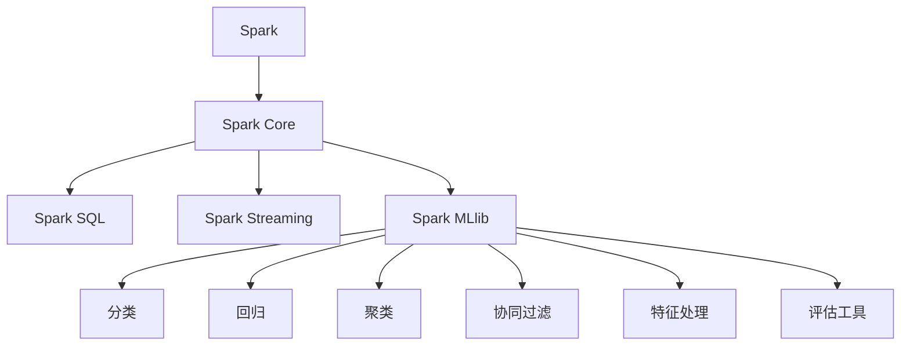
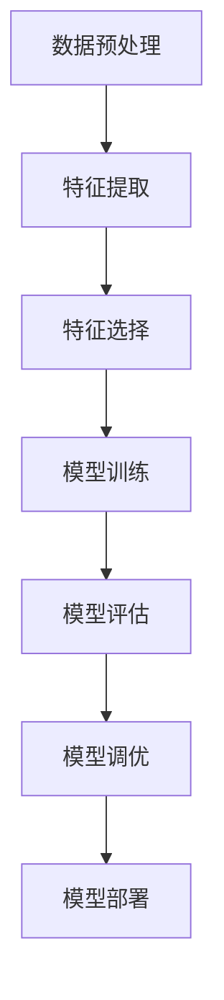

                 

# Spark MLlib机器学习库原理与代码实例讲解

> 关键词：Spark, MLlib, 机器学习, 原理, 代码实例, 分布式计算, 统计学习, 算法, 深度学习, 模型评估

> 摘要：本文旨在深入讲解Spark MLlib机器学习库的基本原理、核心算法及其应用。文章将首先介绍Spark MLlib的背景和架构，然后详细探讨其核心算法和操作步骤，并通过具体实例分析代码实现。最后，我们将探讨MLlib在现实世界中的应用场景，并提供一系列学习和资源推荐。

## 1. 背景介绍

### 1.1 目的和范围

本文的目标是帮助读者深入了解Spark MLlib机器学习库的原理和用法。我们将从基础概念出发，逐步深入到高级算法，并通过实际代码实例展示如何使用MLlib进行机器学习。

本文的范围包括：
- Spark MLlib的基本概念和架构
- MLlib中常用算法的原理和操作步骤
- 实际代码实例分析
- MLlib在现实世界中的应用场景
- 学习和资源推荐

### 1.2 预期读者

本文适合以下读者群体：
- 对机器学习和大数据有基础了解的技术人员
- 想要学习Spark MLlib的高级开发人员
- 研究机器学习和分布式计算的研究生

### 1.3 文档结构概述

本文的结构如下：
- 第1章：背景介绍
- 第2章：核心概念与联系
- 第3章：核心算法原理与具体操作步骤
- 第4章：数学模型和公式详解
- 第5章：项目实战：代码实际案例和详细解释
- 第6章：实际应用场景
- 第7章：工具和资源推荐
- 第8章：总结：未来发展趋势与挑战
- 第9章：附录：常见问题与解答
- 第10章：扩展阅读与参考资料

### 1.4 术语表

#### 1.4.1 核心术语定义

- **Spark**: 一个开源的分布式计算系统，适用于大数据处理。
- **MLlib**: Spark的机器学习库，提供各种机器学习算法的实现。
- **分布式计算**: 在多台计算机上同时处理数据，以实现高效计算。
- **统计学习**: 基于统计理论，通过数据建模来预测或分类。

#### 1.4.2 相关概念解释

- **模型评估**: 对模型的性能进行评估，以确定其在实际应用中的效果。
- **特征工程**: 从原始数据中提取特征，用于训练机器学习模型。
- **分类**: 将数据分为不同的类别。
- **回归**: 预测一个连续的数值输出。

#### 1.4.3 缩略词列表

- **MLlib**: Machine Learning Library
- **Spark**: Simple Programming with Integrated Kernel
- **RDD**: Resilient Distributed Dataset
- **DataFrame**: Distributed data structure with structured schema
- **DataFrame**: Distributed data structure with structured schema

## 2. 核心概念与联系

Spark MLlib是建立在Spark之上的机器学习库，它提供了一系列常用的算法和工具，以支持大规模数据处理和机器学习。MLlib的设计目标是支持分布式计算，并能够高效地处理大规模数据集。

### 2.1 Spark MLlib架构

下面是Spark MLlib的架构示意图：



在这个架构中，Spark Core提供了基本的数据处理能力和分布式计算引擎，Spark SQL用于处理结构化数据，Spark Streaming用于实时数据处理，而Spark MLlib则专注于机器学习算法的实现。

### 2.2 MLlib核心算法原理

MLlib提供了多种机器学习算法，包括分类、回归、聚类和协同过滤等。以下是一个简单的流程图，展示了这些算法的基本原理和联系：



这个流程图展示了机器学习的一般步骤，从数据预处理到模型部署。每个步骤都有相应的算法和工具支持。

## 3. 核心算法原理 & 具体操作步骤

在本章中，我们将深入探讨MLlib中的几个核心算法，包括逻辑回归、决策树和随机森林。我们将使用伪代码来详细阐述这些算法的原理和操作步骤。

### 3.1 逻辑回归

逻辑回归是一种分类算法，用于预测一个二分类结果。其基本原理是通过线性模型将输入特征映射到概率空间。

#### 原理：

逻辑回归的损失函数是逻辑损失函数，它的目标是最小化预测概率与真实标签之间的差异。逻辑回归的损失函数可以表示为：

$$
L(y, \hat{y}) = -y \log(\hat{y}) - (1 - y) \log(1 - \hat{y})
$$

其中，$y$ 是真实标签，$\hat{y}$ 是预测概率。

#### 操作步骤：

1. 初始化模型参数（权重和偏置）。
2. 对每个样本，计算预测概率。
3. 计算损失函数值。
4. 使用梯度下降法更新模型参数。
5. 重复步骤2-4，直到收敛。

伪代码如下：

```python
def logistic_regression(data, learning_rate, iterations):
    # 初始化模型参数
    weights = initialize_weights(data)
    bias = initialize_bias()

    # 梯度下降法
    for i in range(iterations):
        for sample in data:
            # 计算预测概率
            prediction = sigmoid(weights * sample + bias)
            
            # 计算损失函数值
            loss = logistic_loss(sample.label, prediction)
            
            # 计算梯度
            gradient_weights = compute_gradient(sample, prediction)
            gradient_bias = compute_gradient(sample, prediction, bias)
            
            # 更新模型参数
            weights -= learning_rate * gradient_weights
            bias -= learning_rate * gradient_bias

    return weights, bias

def sigmoid(x):
    return 1 / (1 + exp(-x))

def logistic_loss(y, y_pred):
    return -y * log(y_pred) - (1 - y) * log(1 - y_pred)
```

### 3.2 决策树

决策树是一种基于树形结构进行决策的算法，其基本原理是通过递归地将数据划分为多个子集，每个子集都对应一个特征和阈值。

#### 原理：

决策树的构建过程是从根节点开始，对每个特征计算增益，选择增益最大的特征进行划分。增益可以表示为：

$$
Gini(D) = 1 - \sum_{v \in V} \left( \frac{|D_v|}{|D|} \right)^2
$$

其中，$D$ 是数据集，$V$ 是特征集合，$D_v$ 是特征 $v$ 的取值。

#### 操作步骤：

1. 初始化树结构。
2. 对每个节点，计算增益。
3. 选择增益最大的特征进行划分。
4. 递归构建子树。
5. 停止条件：达到最大深度或节点纯度达到阈值。

伪代码如下：

```python
def build_decision_tree(data, max_depth, purity_threshold):
    # 停止条件
    if max_depth == 0 or purity_threshold >= node_purity(data):
        return LeafNode(data)
    
    # 计算增益
    gains = compute_gains(data)
    
    # 选择增益最大的特征
    feature = select_best_feature(gains)
    
    # 划分数据
    subsets = split_data(data, feature)
    
    # 递归构建子树
    tree = TreeNode(feature, subsets)
    for subset in subsets:
        tree.children.append(build_decision_tree(subset, max_depth - 1, purity_threshold))
    
    return tree

def compute_gains(data):
    gains = {}
    for feature in features:
        gain = gini_impurity(data) - (len(data) / n) * gini_impurity(split_data(data, feature))
        gains[feature] = gain
    return gains

def select_best_feature(gains):
    best_gain = max(gains.values())
    best_feature = [f for f, g in gains.items() if g == best_gain]
    return random.choice(best_feature)

def gini_impurity(data):
    # 计算基尼不纯度
    pass

def split_data(data, feature):
    # 根据特征划分数据
    pass
```

### 3.3 随机森林

随机森林是一种集成学习方法，通过构建多个决策树来提高模型的泛化能力。

#### 原理：

随机森林的基本原理是通过对原始数据进行随机抽样，并构建多个决策树。每个决策树都对数据进行预测，最终通过投票机制确定最终预测结果。

#### 操作步骤：

1. 初始化随机森林。
2. 对每个决策树，使用随机抽样数据构建决策树。
3. 对每个样本，计算每个决策树的预测结果。
4. 通过投票机制确定最终预测结果。

伪代码如下：

```python
def build_random_forest(data, n_trees, max_depth, purity_threshold):
    forests = []
    for _ in range(n_trees):
        tree = build_decision_tree(data, max_depth, purity_threshold)
        forests.append(tree)
    
    return forests

def predict(random_forest, sample):
    predictions = [tree.predict(sample) for tree in random_forest]
    return majority_vote(predictions)

def majority_vote(predictions):
    # 计算投票结果
    pass
```

## 4. 数学模型和公式 & 详细讲解 & 举例说明

在本章中，我们将详细介绍MLlib中常用的数学模型和公式，并使用LaTeX格式进行表示。然后，我们将通过具体例子来说明这些公式的应用。

### 4.1 逻辑回归

逻辑回归的预测概率可以表示为：

$$
\hat{y} = \frac{1}{1 + e^{-(\sum_{i=1}^{n} w_i x_i + b)}}
$$

其中，$w_i$ 是权重，$x_i$ 是特征，$b$ 是偏置。

### 4.2 决策树

决策树的基尼不纯度可以表示为：

$$
Gini(D) = 1 - \sum_{v \in V} \left( \frac{|D_v|}{|D|} \right)^2
$$

其中，$D$ 是数据集，$V$ 是特征集合，$D_v$ 是特征 $v$ 的取值。

### 4.3 随机森林

随机森林的预测结果可以表示为：

$$
\hat{y} = \frac{1}{n} \sum_{i=1}^{n} \hat{y}_i
$$

其中，$n$ 是决策树的数量，$\hat{y}_i$ 是第 $i$ 个决策树的预测结果。

### 4.4 例子

假设我们有一个包含两个特征 $x_1$ 和 $x_2$ 的二分类问题，数据集如下：

$$
\begin{array}{ccc}
x_1 & x_2 & y \\
1 & 2 & 0 \\
2 & 3 & 1 \\
3 & 4 & 0 \\
4 & 5 & 1 \\
\end{array}
$$

我们使用逻辑回归进行预测，假设权重 $w_1 = 0.5$，$w_2 = 0.3$，偏置 $b = 0.1$。

预测概率为：

$$
\hat{y} = \frac{1}{1 + e^{-(0.5 \cdot 1 + 0.3 \cdot 2 + 0.1)}}
$$

计算结果为 $\hat{y} \approx 0.69$，由于 $\hat{y} > 0.5$，预测结果为 $y = 1$。

## 5. 项目实战：代码实际案例和详细解释说明

### 5.1 开发环境搭建

在开始编写代码之前，我们需要搭建一个合适的开发环境。以下是搭建MLlib开发环境的步骤：

1. 安装Java环境
2. 安装Scala环境
3. 安装Spark环境
4. 配置Spark MLlib依赖

具体步骤如下：

#### 安装Java环境

下载并安装Java Development Kit (JDK)。在Windows上，可以从Oracle官网下载JDK，并按照安装向导进行安装。安装完成后，确保在环境变量中添加`JAVA_HOME`和`PATH`。

```shell
export JAVA_HOME=/path/to/jdk
export PATH=$JAVA_HOME/bin:$PATH
```

#### 安装Scala环境

下载并安装Scala。在Windows上，可以从Scala官网下载Scala安装包，并按照安装向导进行安装。安装完成后，确保在环境变量中添加`SCALA_HOME`和`PATH`。

```shell
export SCALA_HOME=/path/to/scala
export PATH=$SCALA_HOME/bin:$PATH
```

#### 安装Spark环境

下载并安装Spark。在Windows上，可以从Spark官网下载Spark安装包，并按照安装向导进行安装。安装完成后，确保在环境变量中添加`SPARK_HOME`和`PATH`。

```shell
export SPARK_HOME=/path/to/spark
export PATH=$SPARK_HOME/bin:$PATH
```

#### 配置Spark MLlib依赖

在Scala项目中，我们需要添加Spark MLlib的依赖。在项目的`build.sbt`文件中，添加以下依赖：

```scala
libraryDependencies ++= Seq(
  "org.apache.spark" %% "spark-core" % "3.1.1",
  "org.apache.spark" %% "spark-mllib" % "3.1.1"
)
```

### 5.2 源代码详细实现和代码解读

下面是一个使用Spark MLlib进行逻辑回归分类的代码实例：

```scala
import org.apache.spark.ml.classification.LogisticRegression
import org.apache.spark.ml.feature.VectorAssembler
import org.apache.spark.ml.linalg.Vectors
import org.apache.spark.sql.SparkSession

// 创建Spark会话
val spark = SparkSession.builder()
  .appName("LogisticRegressionExample")
  .master("local[*]")
  .getOrCreate()

// 加载数据
val data = spark.read.format("libsvm").load("data/mllib/sample_libsvm_data.txt")

// 特征组装
val assembler = new VectorAssembler()
  .setInputCols(Array("feature1", "feature2"))
  .setOutputCol("features")

val output = assembler.transform(data)

// 模型训练
val lr = new LogisticRegression()
  .setMaxIter(10)
  .setRegParam(0.01)

val model = lr.fit(output)

// 模型评估
val predictions = model.transform(output)
val accuracy = predictions.select("prediction", "label").where($"prediction" === $"label").count() * 100.0 / predictions.count()

println(s"Model accuracy: $accuracy%")

// 保存模型
model.write.overwrite().save("model/logistic_regression_model")

// 关闭Spark会话
spark.stop()
```

#### 代码解读

1. 导入所需的Spark MLlib和Spark SQL模块。
2. 创建Spark会话。
3. 加载数据集，这里使用的是libsvm格式的数据。
4. 使用VectorAssembler将原始特征进行组装，输出为特征向量。
5. 训练逻辑回归模型，设置最大迭代次数和正则化参数。
6. 使用训练好的模型进行预测，并计算模型的准确率。
7. 将模型保存到本地文件系统。

### 5.3 代码解读与分析

1. **数据加载与处理**：
   - 使用`read.format("libsvm").load()`方法加载libsvm格式的数据集。
   - 使用`VectorAssembler`将原始特征进行组装，输出为特征向量。

2. **模型训练**：
   - 创建`LogisticRegression`实例，设置最大迭代次数和正则化参数。
   - 使用`fit()`方法训练模型。

3. **模型评估**：
   - 使用`transform()`方法将训练好的模型应用于原始数据。
   - 计算模型的准确率。

4. **模型保存**：
   - 使用`write.overwrite().save()`方法将模型保存到本地文件系统。

通过这个实例，我们可以看到如何使用Spark MLlib进行逻辑回归分类。在实际项目中，我们还需要根据具体需求调整参数，并处理不同的数据格式。

## 6. 实际应用场景

MLlib在现实世界的应用场景非常广泛，以下是一些典型的应用实例：

### 6.1 电子商务推荐系统

在电子商务领域，MLlib可以用于构建推荐系统。通过分析用户的历史购买记录和浏览行为，推荐系统可以预测用户可能感兴趣的商品，从而提高销售额和用户满意度。

### 6.2 金融市场预测

MLlib可以用于金融市场预测，通过分析历史交易数据和宏观经济指标，预测股票价格和交易量。这对于投资者和金融机构具有重要的参考价值。

### 6.3 医疗健康数据分析

MLlib可以用于医疗健康数据分析，通过分析患者的医疗记录和基因数据，预测疾病风险和诊断结果。这有助于提高医疗服务的质量和效率。

### 6.4 社交网络分析

MLlib可以用于社交网络分析，通过分析用户之间的关系和社交行为，预测用户的行为和趋势。这对于社交网络平台和广告商具有重要的参考价值。

## 7. 工具和资源推荐

为了更好地学习和使用Spark MLlib，以下是几款推荐的工具和资源：

### 7.1 学习资源推荐

#### 7.1.1 书籍推荐

- 《Spark MLlib：机器学习实战》
- 《大数据Spark实战：基于Spark的机器学习与数据挖掘》

#### 7.1.2 在线课程

- Coursera上的“大数据分析”课程
- Udacity的“机器学习工程师纳米学位”

#### 7.1.3 技术博客和网站

- Apache Spark官网：[spark.apache.org](http://spark.apache.org/)
- Databricks博客：[databricks.com/blog/)

### 7.2 开发工具框架推荐

#### 7.2.1 IDE和编辑器

- IntelliJ IDEA
- Eclipse

#### 7.2.2 调试和性能分析工具

- Spark UI：用于监控Spark任务的执行情况
- Ganglia：用于监控集群性能

#### 7.2.3 相关框架和库

- Hadoop：用于大数据存储和处理
- TensorFlow：用于深度学习

### 7.3 相关论文著作推荐

#### 7.3.1 经典论文

- "MapReduce: Simplified Data Processing on Large Clusters" by Dean and Ghemawat
- "Large Scale Machine Learning on Hadoop with MLlib" by Cheng et al.

#### 7.3.2 最新研究成果

- "Machine Learning on Graphs: A Comprehensive Survey" by Scarselli et al.
- "Deep Learning on Multi-Modal Data with Spatio-Temporal Graphs" by Raghu et al.

#### 7.3.3 应用案例分析

- "Building a Recommendation System with Spark MLlib" by Arjuna Charitha Wickramarathne
- "Building a Predictive Model for Customer Churn with Spark MLlib" by Abhishek Anand

## 8. 总结：未来发展趋势与挑战

随着大数据和机器学习的快速发展，Spark MLlib在未来有着广阔的应用前景。以下是MLlib未来发展的几个趋势和挑战：

### 8.1 发展趋势

- **深度学习集成**：MLlib未来可能会集成深度学习算法，以支持更复杂的模型。
- **自动化机器学习**：自动化机器学习（AutoML）将成为MLlib的一个重要研究方向，以简化模型训练和调优过程。
- **跨平台支持**：MLlib可能会扩展到其他计算平台，如GPU和FPGA，以提高计算效率。

### 8.2 挑战

- **算法效率**：随着数据规模的增大，如何提高算法的效率是一个重要挑战。
- **模型可解释性**：如何提高模型的可解释性，使其更易于理解和解释，是一个亟待解决的问题。
- **算法公平性和透明度**：随着机器学习在关键领域（如金融、医疗等）的应用，算法的公平性和透明度将成为重要关注点。

## 9. 附录：常见问题与解答

### 9.1 Q：什么是Spark MLlib？

A：Spark MLlib是Apache Spark的一个模块，提供了用于机器学习的算法和工具，支持分布式计算和大数据处理。

### 9.2 Q：Spark MLlib支持哪些算法？

A：Spark MLlib支持多种机器学习算法，包括分类、回归、聚类、协同过滤和特征处理等。

### 9.3 Q：如何安装和配置Spark MLlib？

A：安装和配置Spark MLlib的步骤包括安装Java、Scala和Spark环境，并在Scala项目中添加Spark MLlib的依赖。

### 9.4 Q：如何使用Spark MLlib进行模型训练？

A：使用Spark MLlib进行模型训练的步骤包括数据预处理、特征提取、模型训练和模型评估等。

## 10. 扩展阅读 & 参考资料

- 《Spark MLlib：机器学习实战》
- 《大数据Spark实战：基于Spark的机器学习与数据挖掘》
- [Apache Spark官网](http://spark.apache.org/)
- [Databricks博客](http://databricks.com/blog/)

