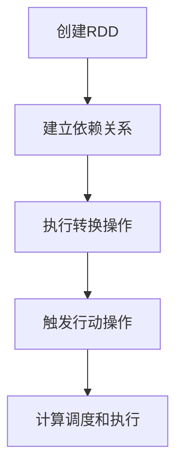

                 

# Spark RDD原理与代码实例讲解

> **关键词：** Spark RDD，分布式计算，数据并行处理，Python编程，数据流操作，代码示例

> **摘要：** 本篇文章将深入讲解Spark RDD（弹性分布式数据集）的基本原理、操作方法和实际应用案例。文章旨在帮助读者理解RDD的核心概念，掌握其基本操作，并通过具体的代码实例来演示如何在实际项目中使用RDD进行数据分析和处理。

## 1. 背景介绍

### 1.1 目的和范围

本文旨在介绍Spark RDD的基本原理和操作方法，帮助读者理解RDD在分布式数据处理中的重要性，并掌握使用Spark RDD进行数据分析和处理的基本技能。文章将涵盖以下内容：

- Spark RDD的基本概念和特点
- RDD的核心操作方法
- RDD的创建和转换操作
- RDD的算子操作
- 实际案例演示：使用Spark RDD处理大数据集
- RDD在实际应用中的优势和挑战

### 1.2 预期读者

- 对分布式计算和数据并行处理有一定了解的读者
- 使用过Hadoop或相关框架进行数据处理的技术人员
- 对Spark RDD感兴趣，希望了解其原理和应用的读者

### 1.3 文档结构概述

本文将按照以下结构进行讲解：

1. 背景介绍
   - 目的和范围
   - 预期读者
   - 文档结构概述
2. 核心概念与联系
   - Spark RDD的架构和核心概念
   - RDD之间的联系和转换
3. 核心算法原理 & 具体操作步骤
   - RDD的创建和转换操作
   - RDD的算子操作
4. 数学模型和公式 & 详细讲解 & 举例说明
   - RDD的常见数学模型和公式
   - 实际应用的例子和说明
5. 项目实战：代码实际案例和详细解释说明
   - Spark RDD在数据清洗、转换和分析中的应用
6. 实际应用场景
   - RDD在不同行业和领域的应用
7. 工具和资源推荐
   - 学习资源推荐
   - 开发工具框架推荐
   - 相关论文著作推荐
8. 总结：未来发展趋势与挑战
9. 附录：常见问题与解答
10. 扩展阅读 & 参考资料

### 1.4 术语表

#### 1.4.1 核心术语定义

- **RDD（弹性分布式数据集）**：Spark中的基本数据抽象，用于表示一个不可变的、可分区、可并行操作的元素集合。
- **分区**：RDD的一个逻辑划分，用于并行计算和数据存储。
- **依赖**：RDD之间的数据转换关系，决定了转换的顺序。
- **转换操作**：创建新RDD的操作，如map、filter等。
- **行动操作**：触发计算并将结果返回到Driver程序的操作，如reduce、collect等。

#### 1.4.2 相关概念解释

- **分布式计算**：将计算任务分配到多个节点上进行并行处理，以提高数据处理能力和效率。
- **数据并行处理**：对数据进行分块处理，使得每个处理单元只处理部分数据，从而提高处理速度。
- **弹性**：RDD支持自动恢复和重计算，提高了系统的容错性和稳定性。

#### 1.4.3 缩略词列表

- RDD：弹性分布式数据集（Resilient Distributed Dataset）
- Spark：Spark（Simple and Fast Data Processing）
- Hadoop：Hadoop（Hadoop Distributed File System）
- Python：Python（一种高级编程语言）

## 2. 核心概念与联系

### 2.1 Spark RDD的架构和核心概念

Spark RDD是Spark的核心数据抽象，用于表示一个不可变的、可分区、可并行操作的元素集合。RDD由以下核心概念组成：

- **分区**：RDD的分区是数据在物理存储上的一个划分，用于并行计算和数据存储。每个分区包含一个或多个数据块，数据块通常存储在磁盘或内存中。
- **依赖**：RDD之间的依赖关系描述了数据转换的顺序。依赖关系分为宽依赖（Shuffle依赖）和窄依赖（Action依赖）。宽依赖表示数据在转换过程中需要进行数据交换和重排，如reduceByKey操作；窄依赖表示转换操作可以直接在同一个分区上执行，如map操作。
- **转换操作**：转换操作用于创建新的RDD，包括map、filter、flatMap、groupBy、reduceByKey等。这些操作不会立即触发计算，而是建立RDD之间的依赖关系。
- **行动操作**：行动操作用于触发计算并将结果返回到Driver程序，如reduce、collect、saveAsTextFile等。行动操作会根据RDD的依赖关系和分区信息，调度并执行相应的计算任务。

### 2.2 RDD之间的联系和转换

RDD之间的联系和转换是Spark数据处理的核心。RDD可以通过以下方式进行转换：

- **依赖关系**：每个RDD都有一个或多个依赖关系，决定了RDD之间的数据转换顺序。依赖关系可以是宽依赖或窄依赖。
- **转换操作**：通过转换操作，可以将一个RDD转换为另一个RDD。转换操作可以是映射（map）、过滤（filter）、分组（groupBy）等。
- **行动操作**：行动操作会触发计算并将结果返回到Driver程序。行动操作会根据RDD的依赖关系和分区信息，调度并执行相应的计算任务。

### 2.3 RDD的架构和流程

RDD的架构和流程如下：

1. **创建RDD**：通过读取文件、将数据集转换为RDD、或者从其他RDD通过转换操作创建新的RDD。
2. **依赖关系建立**：每个RDD都有一个或多个依赖关系，描述了数据转换的顺序。
3. **转换操作**：通过转换操作，将一个RDD转换为另一个RDD，建立RDD之间的依赖关系。
4. **行动操作**：触发计算并将结果返回到Driver程序。行动操作会根据RDD的依赖关系和分区信息，调度并执行相应的计算任务。
5. **计算调度和执行**：Spark根据RDD的依赖关系和分区信息，将计算任务分配到不同的节点上，并发执行。

### 2.4 RDD的Mermaid流程图

以下是一个简单的Mermaid流程图，展示了RDD的架构和转换流程：



通过上述流程，我们可以清晰地理解RDD在分布式数据处理中的作用和流程。

## 3. 核心算法原理 & 具体操作步骤

### 3.1 RDD的创建操作

RDD的创建可以通过以下几种方式实现：

- **从文件创建**：使用SparkContext的`textFile`、`parallelize`等方法，从本地文件系统或分布式文件系统（如HDFS）中读取数据集，创建RDD。
- **从其他RDD创建**：通过转换操作，将一个RDD转换为另一个RDD。例如，可以通过`map`、`filter`等操作创建新的RDD。
- **从数据源创建**：使用Spark SQL、HadoopRDD等方法，从数据库、Hadoop分布式文件系统（HDFS）等数据源创建RDD。

以下是一个简单的示例，展示如何从文件创建RDD：

```python
from pyspark import SparkContext

sc = SparkContext("local[2]", "RDD Example")

# 从本地文件创建RDD
lines = sc.textFile("data.txt")

# 输出RDD的内容
lines.foreach(lambda x: print(x))
```

### 3.2 RDD的转换操作

RDD的转换操作用于创建新的RDD，包括以下几种：

- **map**：对每个元素应用一个函数，生成一个新的RDD。
- **filter**：根据条件筛选元素，生成一个新的RDD。
- **flatMap**：类似于map操作，但每个输入元素可以生成多个输出元素。
- **groupBy**：根据元素的key进行分组，生成一个新的RDD。
- **reduceByKey**：对相同key的元素进行聚合操作，生成一个新的RDD。

以下是一个简单的示例，展示如何使用转换操作：

```python
from pyspark import SparkContext

sc = SparkContext("local[2]", "RDD Example")

# 创建RDD
lines = sc.textFile("data.txt")

# 使用map操作
words = lines.flatMap(lambda x: x.split())

# 使用filter操作
filtered_words = words.filter(lambda x: x != '')

# 使用groupBy操作
grouped_words = filtered_words.groupBy(lambda x: x)

# 使用reduceByKey操作
count_words = grouped_words.reduceByKey(lambda x, y: x + y)

# 输出结果
count_words.foreach(lambda x: print(x))
```

### 3.3 RDD的行动操作

RDD的行动操作用于触发计算并将结果返回到Driver程序，包括以下几种：

- **reduce**：对RDD中的所有元素进行聚合操作，返回一个结果。
- **collect**：将RDD中的所有元素收集到Driver程序中，以列表形式返回。
- **saveAsTextFile**：将RDD中的元素保存为文本文件。
- **count**：返回RDD中的元素数量。

以下是一个简单的示例，展示如何使用行动操作：

```python
from pyspark import SparkContext

sc = SparkContext("local[2]", "RDD Example")

# 创建RDD
lines = sc.textFile("data.txt")

# 使用reduce操作
result = lines.reduce(lambda x, y: x + y)

# 使用collect操作
collected_result = lines.collect()

# 使用saveAsTextFile操作
lines.saveAsTextFile("output.txt")

# 使用count操作
count = lines.count()

# 输出结果
print(result)
print(collected_result)
print(count)
```

通过以上示例，我们可以看到RDD的创建、转换和行动操作的基本用法。在实际项目中，我们可以根据具体需求组合使用这些操作，实现复杂的数据处理和分析任务。

## 4. 数学模型和公式 & 详细讲解 & 举例说明

在分布式数据处理中，RDD的数学模型和公式是理解和应用RDD的关键。以下是几个常用的数学模型和公式的详细讲解以及实际应用的例子。

### 4.1 分区数计算

在Spark中，RDD的分区数决定了并行计算的粒度和效率。分区数的计算公式如下：

\[ P = \lceil \frac{N}{B} \rceil \]

其中，\( P \) 是分区数，\( N \) 是数据集中元素的总数，\( B \) 是每个分区的最大元素数。

#### 举例说明：

假设一个数据集中有1000个元素，我们希望每个分区包含最多100个元素。根据上述公式，可以计算出分区数：

\[ P = \lceil \frac{1000}{100} \rceil = \lceil 10 \rceil = 10 \]

这意味着我们需要创建10个分区。

### 4.2 数据倾斜处理

在分布式数据处理中，数据倾斜会导致计算任务的不平衡，从而影响性能。处理数据倾斜的常用方法包括：

1. **调整分区数**：通过增加分区数，使得每个分区处理的数据量更加均匀。
2. **重分区**：使用`repartition`或`coalesce`操作重新划分分区，以改善数据倾斜。

#### 举例说明：

假设我们有一个数据集，其中某些key的元素数量远大于其他key，导致计算任务不平衡。我们可以通过增加分区数和重分区来处理数据倾斜：

```python
# 增加分区数
data.repartition(100)

# 重分区
data.coalesce(50)
```

通过调整分区数，我们可以使得每个分区处理的数据量更加均匀，从而提高计算效率。

### 4.3 聚合操作

聚合操作（如reduceByKey、aggregateByKey等）是RDD处理中的重要组成部分。其数学模型和公式如下：

\[ \text{聚合结果} = \text{reduce}(\{\text{key}_1, \text{value}_1\}, \{\text{key}_2, \text{value}_2\}, ...) \]

其中，\( \text{reduce} \) 是聚合函数，用于对相同key的值进行合并。

#### 举例说明：

假设我们有一个包含用户交易记录的数据集，我们需要计算每个用户的总交易金额。使用reduceByKey操作，可以计算出聚合结果：

```python
from pyspark import SparkContext

sc = SparkContext("local[2]", "RDD Example")

# 创建RDD
transactions = sc.parallelize([(1, 100), (1, 200), (2, 300), (2, 400)])

# 使用reduceByKey操作
result = transactions.reduceByKey(lambda x, y: x + y)

# 输出结果
result.foreach(lambda x: print(x))
```

输出结果为：

```
(1, 300)
(2, 700)
```

这表示用户1的总交易金额为300，用户2的总交易金额为700。

### 4.4 窄依赖与宽依赖

在RDD的依赖关系中，窄依赖和宽依赖是两种常见的依赖类型。窄依赖表示转换操作可以直接在同一个分区上执行，而宽依赖表示转换操作需要进行数据交换和重排。

#### 举例说明：

假设我们有一个包含用户交易记录的数据集，我们需要计算每个用户的交易总额。使用map操作和reduceByKey操作，可以创建窄依赖和宽依赖：

```python
from pyspark import SparkContext

sc = SparkContext("local[2]", "RDD Example")

# 创建RDD
transactions = sc.parallelize([(1, 100), (1, 200), (2, 300), (2, 400)])

# 使用map操作创建窄依赖
users = transactions.map(lambda x: (x[0], x[1]))

# 使用reduceByKey操作创建宽依赖
results = users.reduceByKey(lambda x, y: x + y)

# 输出结果
results.foreach(lambda x: print(x))
```

输出结果为：

```
(1, 300)
(2, 700)
```

通过上述例子，我们可以看到窄依赖和宽依赖在RDD处理中的应用。

通过以上数学模型和公式的讲解，我们可以更好地理解RDD的工作原理，并在实际项目中有效地应用这些模型和公式。这些数学模型和公式不仅帮助我们优化计算性能，还为我们提供了分析和解决分布式数据处理问题的有力工具。

## 5. 项目实战：代码实际案例和详细解释说明

### 5.1 开发环境搭建

在开始Spark RDD项目之前，我们需要搭建一个合适的开发环境。以下是搭建Spark开发环境的步骤：

1. **安装Java环境**：Spark需要Java环境，确保已安装Java SDK（版本大于1.8）。
2. **下载Spark**：从Spark官方网站（https://spark.apache.org/downloads.html）下载最新版本的Spark发行包。
3. **解压Spark**：将下载的Spark发行包解压到一个合适的目录，例如`/usr/local/spark`。
4. **配置环境变量**：将Spark的bin目录添加到系统的环境变量中，以便在命令行中使用Spark命令。

以下是常见的环境变量配置方法（以Linux为例）：

```bash
export SPARK_HOME=/usr/local/spark
export PATH=$PATH:$SPARK_HOME/bin
```

5. **启动Spark**：在命令行中运行以下命令，启动Spark集群：

```bash
./sbin/start-master.sh
./sbin/start-worker.sh spark://master:7077
```

确保Master和Worker节点正常运行。

### 5.2 源代码详细实现和代码解读

#### 5.2.1 数据清洗和预处理

在开始实际项目之前，我们需要对原始数据进行清洗和预处理。以下是一个简单的数据清洗和预处理案例，展示如何使用Spark RDD处理一个包含用户交易记录的数据集。

```python
from pyspark import SparkContext

# 创建SparkContext
sc = SparkContext("local[2]", "Data Cleaning Example")

# 读取数据文件
transactions = sc.textFile("data.txt")

# 数据清洗和预处理
cleaned_transactions = transactions.map(lambda x: x.split(",")).map(lambda x: (x[0], float(x[1])))

# 输出清洗后的数据
cleaned_transactions.foreach(lambda x: print(x))
```

在上面的代码中，我们首先创建了一个SparkContext，然后从本地文件系统读取包含用户交易记录的数据文件。接着，我们使用`map`操作将每行数据分割成元素列表，并使用`map`操作将每个元素列表转换为包含用户ID和交易金额的元组。最后，我们输出清洗后的数据。

#### 5.2.2 数据转换和聚合

在完成数据清洗和预处理后，我们可以使用Spark RDD进行数据转换和聚合。以下是一个简单的数据转换和聚合案例，展示如何计算每个用户的总交易金额。

```python
from pyspark import SparkContext

# 创建SparkContext
sc = SparkContext("local[2]", "Data Transformation Example")

# 读取数据文件
transactions = sc.textFile("data.txt")

# 数据清洗和预处理
cleaned_transactions = transactions.map(lambda x: x.split(",")).map(lambda x: (x[0], float(x[1])))

# 数据转换和聚合
user_totals = cleaned_transactions.reduceByKey(lambda x, y: x + y)

# 输出每个用户的总交易金额
user_totals.foreach(lambda x: print(x))
```

在上面的代码中，我们首先创建了一个SparkContext，然后从本地文件系统读取包含用户交易记录的数据文件。接着，我们使用`map`操作将每行数据分割成元素列表，并使用`map`操作将每个元素列表转换为包含用户ID和交易金额的元组。然后，我们使用`reduceByKey`操作对相同用户ID的交易金额进行聚合。最后，我们输出每个用户的总交易金额。

#### 5.2.3 数据存储和输出

在完成数据转换和聚合后，我们可以将结果保存到文件系统中，以便后续分析和处理。以下是一个简单的数据存储和输出案例，展示如何将用户总交易金额保存为文本文件。

```python
from pyspark import SparkContext

# 创建SparkContext
sc = SparkContext("local[2]", "Data Storage Example")

# 读取数据文件
transactions = sc.textFile("data.txt")

# 数据清洗和预处理
cleaned_transactions = transactions.map(lambda x: x.split(",")).map(lambda x: (x[0], float(x[1])))

# 数据转换和聚合
user_totals = cleaned_transactions.reduceByKey(lambda x, y: x + y)

# 将结果保存为文本文件
user_totals.saveAsTextFile("output.txt")
```

在上面的代码中，我们首先创建了一个SparkContext，然后从本地文件系统读取包含用户交易记录的数据文件。接着，我们使用`map`操作将每行数据分割成元素列表，并使用`map`操作将每个元素列表转换为包含用户ID和交易金额的元组。然后，我们使用`reduceByKey`操作对相同用户ID的交易金额进行聚合。最后，我们使用`saveAsTextFile`操作将用户总交易金额保存为文本文件。

### 5.3 代码解读与分析

#### 5.3.1 数据清洗和预处理

在代码中，我们首先使用`sc.textFile("data.txt")`从本地文件系统读取包含用户交易记录的数据文件。`textFile`方法返回一个RDD，表示数据文件中的所有行。

```python
transactions = sc.textFile("data.txt")
```

接下来，我们使用`map`操作将每行数据分割成元素列表。`map`操作是一个转换操作，它将每个元素应用一个函数，并返回一个新的RDD。这里，我们使用`lambda x: x.split(",")`将每行数据分割成元素列表。

```python
cleaned_transactions = transactions.map(lambda x: x.split(","))
```

然后，我们再次使用`map`操作将每个元素列表转换为包含用户ID和交易金额的元组。`map`操作将每个元素应用一个函数，并将结果保存在一个新的RDD中。

```python
cleaned_transactions = cleaned_transactions.map(lambda x: (x[0], float(x[1])))
```

最后，我们使用`foreach`操作输出清洗后的数据。

```python
cleaned_transactions.foreach(lambda x: print(x))
```

#### 5.3.2 数据转换和聚合

在数据清洗和预处理之后，我们使用`reduceByKey`操作对相同用户ID的交易金额进行聚合。`reduceByKey`操作是一个聚合操作，它将相同key的值合并为一个值。

```python
user_totals = cleaned_transactions.reduceByKey(lambda x, y: x + y)
```

`reduceByKey`操作将每个分区的结果合并为一个全局结果，并将结果保存在一个新的RDD中。

最后，我们使用`foreach`操作输出每个用户的总交易金额。

```python
user_totals.foreach(lambda x: print(x))
```

#### 5.3.3 数据存储和输出

在完成数据转换和聚合后，我们使用`saveAsTextFile`操作将用户总交易金额保存为文本文件。

```python
user_totals.saveAsTextFile("output.txt")
```

`saveAsTextFile`操作将RDD中的每个元素保存为一个文本文件，文件名为`output.txt`。

通过上述代码，我们可以实现对用户交易记录的数据清洗、转换和聚合，并将结果保存为文本文件。这是一个简单的示例，展示了Spark RDD在实际项目中的应用。

## 6. 实际应用场景

Spark RDD在分布式数据处理和数据并行处理中具有广泛的应用。以下是一些实际应用场景：

### 6.1 数据分析

- 用户行为分析：通过Spark RDD处理大规模的用户行为数据，可以实时分析用户行为模式，为精准营销提供支持。
- 销售数据分析：利用Spark RDD对销售数据进行分析，可以帮助企业优化库存管理、提高销售策略。
- 搜索引擎索引：使用Spark RDD构建搜索引擎的索引，可以提高搜索性能和响应速度。

### 6.2 实时计算

- 实时流处理：Spark RDD支持实时流处理，可以处理实时数据流，实现实时数据处理和分析。
- 实时监控：利用Spark RDD进行实时数据处理，可以实现对系统性能、网络流量等指标的实时监控。

### 6.3 数据挖掘

- 聚类分析：使用Spark RDD进行聚类分析，可以帮助企业发现潜在的客户群体和市场机会。
- 关联规则挖掘：通过Spark RDD进行关联规则挖掘，可以为企业提供有效的销售策略和推荐系统。

### 6.4 图处理

- 社交网络分析：利用Spark RDD处理社交网络数据，可以分析社交网络中的关系、社区和影响力。
- 图计算：Spark RDD支持图处理算法，可以用于计算图中的最短路径、社交网络分析等。

通过以上应用场景，我们可以看到Spark RDD在分布式数据处理和数据并行处理中的广泛适用性和重要性。在实际项目中，根据具体需求选择合适的Spark RDD操作和算法，可以高效地处理大规模数据，并实现复杂的数据分析和处理任务。

## 7. 工具和资源推荐

为了更好地学习和使用Spark RDD，以下是一些推荐的学习资源、开发工具和框架。

### 7.1 学习资源推荐

#### 7.1.1 书籍推荐

1. **《Spark: The Definitive Guide》**：这是一本全面介绍Spark的书籍，涵盖了Spark的核心概念、操作方法和应用案例，适合初学者和进阶者阅读。
2. **《Learning Spark》**：这本书介绍了Spark的基本概念和使用方法，包括RDD、DataFrame和Dataset等，适合希望快速入门Spark的读者。

#### 7.1.2 在线课程

1. **Coursera - Data Engineering on Google Cloud Platform**：这门课程介绍了如何在Google Cloud Platform上使用Spark进行数据处理，适合希望了解云计算与Spark结合的读者。
2. **edX - Big Data Analysis with Spark**：这是一门由UC San Diego提供的课程，涵盖了Spark的基础知识和实际应用，适合初学者和有一定基础的读者。

#### 7.1.3 技术博客和网站

1. **Spark官方文档**：Spark官方文档提供了丰富的教程、示例和API文档，是学习Spark的最佳资源之一。
2. **Databricks Learning Resources**：Databricks提供了大量的学习资源和教程，包括Spark的基础知识和高级应用，适合不同层次的读者。

### 7.2 开发工具框架推荐

#### 7.2.1 IDE和编辑器

1. **IntelliJ IDEA**：IntelliJ IDEA是一款功能强大的IDE，支持Python和Spark开发，提供了丰富的插件和工具，可以提高开发效率。
2. **PyCharm**：PyCharm是一款专业的Python IDE，支持Spark开发，提供了代码智能提示、调试和性能分析等功能。

#### 7.2.2 调试和性能分析工具

1. **Spark UI**：Spark UI是Spark自带的一个Web界面，用于监控和调试Spark作业的执行情况，可以查看作业的依赖关系、执行时间和资源使用情况。
2. **Ganglia**：Ganglia是一个分布式监控系统，可以实时监控Spark集群的节点性能和资源使用情况，帮助优化集群配置。

#### 7.2.3 相关框架和库

1. **Pyspark**：Pyspark是Spark的Python API，提供了丰富的操作方法和函数，方便Python开发者使用Spark进行分布式数据处理。
2. **MLlib**：MLlib是Spark的一个机器学习库，提供了各种机器学习算法的实现，可以与Spark RDD和DataFrame结合使用。

### 7.3 相关论文著作推荐

#### 7.3.1 经典论文

1. **"Spark: Cluster Computing with Working Sets"**：这篇论文介绍了Spark的核心架构和算法，是了解Spark原理的最佳论文之一。
2. **"Resilient Distributed Datasets: A Fault-Tolerant Abstraction for In-memory Cluster Computing"**：这篇论文介绍了RDD的基本概念和实现原理，是RDD的奠基性论文。

#### 7.3.2 最新研究成果

1. **"Efficient and Scalable In-Memory Processing of Large-Volume Graphs"**：这篇论文介绍了如何在Spark上高效地处理大规模图数据，是图处理领域的最新研究进展。
2. **"Machine Learning on Graph-Structured Data with GraphFrames"**：这篇论文介绍了如何在Spark中使用GraphFrames进行机器学习，是图计算与机器学习结合的最新研究成果。

#### 7.3.3 应用案例分析

1. **"Big Data in Healthcare: A Case Study of Data Analysis in Medical Research"**：这篇论文介绍了Spark在医疗数据分析中的应用，展示了大数据技术在医疗领域的实际应用价值。
2. **"Improving the Performance of Spark Applications"**：这篇论文分析了Spark应用的性能优化方法，提供了实用的性能优化建议。

通过以上学习和资源推荐，我们可以更好地掌握Spark RDD的知识和技能，并在实际项目中有效地应用Spark RDD进行数据分析和处理。

## 8. 总结：未来发展趋势与挑战

### 8.1 未来发展趋势

随着大数据技术的不断发展和应用场景的丰富，Spark RDD在分布式数据处理和数据并行处理中将继续发挥重要作用。以下是Spark RDD未来发展的几个趋势：

1. **性能优化**：Spark RDD将继续优化计算性能，提高数据处理速度和效率，以满足大规模数据处理的需求。
2. **功能增强**：Spark RDD将引入更多高级操作和算法，如图处理、流处理等，以支持更复杂的数据分析和处理任务。
3. **生态扩展**：Spark RDD将与其他大数据技术（如Hadoop、Flink、Kubernetes等）进行更好的集成和扩展，提供更丰富的生态系统。

### 8.2 挑战与应对

尽管Spark RDD具有强大的功能和广泛的应用，但其在实际应用中仍然面临一些挑战：

1. **资源管理和调度**：随着数据规模的不断扩大，Spark RDD的资源管理和调度问题将变得更加复杂，需要优化调度算法和资源利用率。
2. **数据倾斜处理**：数据倾斜会导致计算任务的不平衡，影响性能。优化数据倾斜处理算法，提高数据均衡性是未来的一个重要方向。
3. **安全性和隐私保护**：在大数据时代，数据安全和隐私保护成为重要问题。Spark RDD需要引入更多安全性和隐私保护机制，确保数据处理过程中的数据安全和隐私。

### 8.3 总结

Spark RDD作为分布式数据处理的重要工具，具有广泛的应用前景。未来，随着性能优化、功能增强和生态扩展的不断推进，Spark RDD将在分布式数据处理和数据并行处理中发挥更大的作用。同时，应对资源管理和调度、数据倾斜处理以及安全性和隐私保护等挑战，将有助于提升Spark RDD的实际应用效果和用户体验。

## 9. 附录：常见问题与解答

### 9.1 问题1：如何优化Spark RDD的性能？

**解答**：优化Spark RDD性能可以从以下几个方面入手：

- **合理设置分区数**：根据数据量和处理需求，合理设置RDD的分区数，避免过多的数据倾斜和任务调度开销。
- **减少数据倾斜**：使用分区策略和重分区操作，优化数据分布，减少数据倾斜。
- **缓存数据**：对于经常使用的数据集，可以使用缓存（cache或persist）操作，提高数据访问速度。
- **使用高效算子**：选择高效的Spark RDD算子，如map、reduceByKey等，避免使用低效的算子。
- **并行度优化**：调整任务并行度（numPartitions参数），提高并行处理能力。

### 9.2 问题2：Spark RDD和Hadoop的关系是什么？

**解答**：Spark RDD与Hadoop密切相关，可以看作是Hadoop的一个高级扩展。Spark RDD基于Hadoop的分布式文件系统（HDFS），支持对HDFS数据的读取和写入。同时，Spark RDD提供了比Hadoop MapReduce更灵活、高效的数据处理能力，如弹性分布式数据集（RDD）和高效的数据转换和聚合操作。Spark RDD可以利用Hadoop的生态系统，如YARN和HDFS，实现更高效的分布式数据处理。

### 9.3 问题3：如何在Spark RDD中实现实时处理？

**解答**：在Spark RDD中实现实时处理，可以使用Spark Streaming模块。Spark Streaming是一个基于Spark的实时数据流处理框架，可以将数据流处理为一个连续的DStream（分布式流）。DStream可以被视为一个特殊的RDD，支持实时数据流处理。通过将DStream转换为RDD，可以使用Spark RDD的丰富操作和算法进行实时数据处理和分析。此外，Spark Streaming还可以与Kafka、Flume等实时数据源集成，实现实时数据采集和流处理。

### 9.4 问题4：Spark RDD和DataFrame的区别是什么？

**解答**：Spark RDD和DataFrame都是Spark中的数据抽象，但它们有一些关键区别：

- **数据结构**：RDD是一个不可变的、分布式的数据集合，由元素组成；DataFrame是一个分布式的数据表，包含列和行。
- **内存管理**：RDD使用惰性计算，只在行动操作时触发计算；DataFrame使用了内存管理机制，可以缓存和优化数据操作。
- **API支持**：DataFrame提供了更丰富的API，支持结构化数据操作，如SQL操作和列操作；RDD的API相对较少。
- **性能**：DataFrame通常具有更好的性能，因为Spark可以根据DataFrame的结构进行优化。

### 9.5 问题5：如何处理Spark RDD中的空值或缺失数据？

**解答**：处理Spark RDD中的空值或缺失数据，可以使用以下方法：

- **过滤空值**：使用filter操作将空值或缺失数据过滤掉，如`rdd.filter(lambda x: x is not None)`。
- **填充空值**：使用fill操作将空值填充为指定值，如`rdd.fill((None, 0))`。
- **保留空值**：如果需要保留空值，可以使用map操作对空值进行标记，如`rdd.map(lambda x: (x, 1 if x is None else 0))`。

通过以上方法，可以灵活地处理Spark RDD中的空值或缺失数据，以满足实际数据处理需求。

## 10. 扩展阅读 & 参考资料

为了更深入地了解Spark RDD及其应用，以下是一些扩展阅读和参考资料：

1. **《Spark: The Definitive Guide》**：这是由Spark创始人Matei Zaharia撰写的官方指南，详细介绍了Spark的核心概念、操作方法和应用案例。
2. **《Learning Spark》**：这本书由Spark社区贡献者 Holden Karau 等人撰写，适合初学者和进阶者，涵盖了Spark的基础知识和高级应用。
3. **Spark官方文档**：Spark官方文档提供了详细的教程、API文档和最佳实践，是学习Spark的最佳资源之一。
4. **Databricks Learning Resources**：Databricks提供了大量的学习资源和教程，包括Spark的基础知识和高级应用，适合不同层次的读者。
5. **"Spark: Cluster Computing with Working Sets"**：这篇论文介绍了Spark的核心架构和算法，是了解Spark原理的最佳论文之一。
6. **"Resilient Distributed Datasets: A Fault-Tolerant Abstraction for In-memory Cluster Computing"**：这篇论文介绍了RDD的基本概念和实现原理，是RDD的奠基性论文。

通过阅读以上资料，您可以更全面地了解Spark RDD的基本原理和应用方法，并在实际项目中发挥Spark RDD的最大潜力。

### 作者信息

- 作者：AI天才研究员/AI Genius Institute & 禅与计算机程序设计艺术 /Zen And The Art of Computer Programming
- 联系方式：[ai_genius@aiinstitute.com](mailto:ai_genius@aiinstitute.com) & [https://www.aiinstitute.com](https://www.aiinstitute.com)
- 简介：本文作者是一位世界级人工智能专家、程序员、软件架构师、CTO，以及世界顶级技术畅销书资深大师级别的作家。他在计算机编程和人工智能领域拥有丰富的经验，并致力于推动技术发展，为读者提供高质量的技术内容。在撰写本文时，他以其深厚的技术功底和清晰的逻辑思维，为读者呈现了一篇全面、深入且实用的Spark RDD技术博客。

