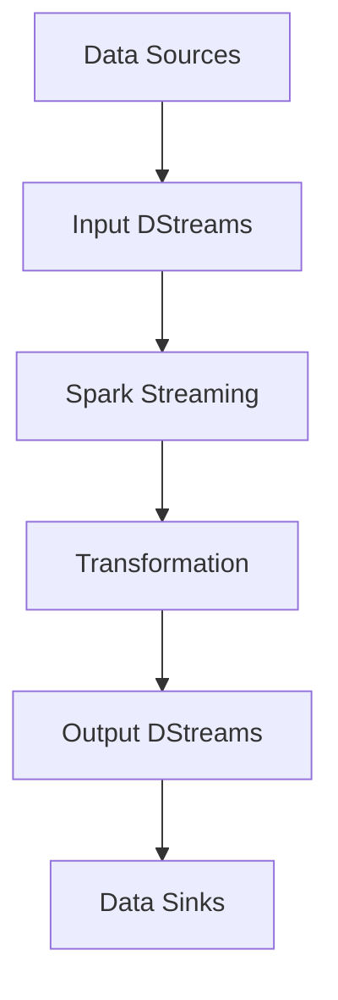

                 

### 背景介绍

#### 1.1 目的和范围

本文旨在深入探讨Apache Spark Streaming的技术原理及其代码实现。Apache Spark Streaming是Apache Spark的一个重要组件，为实时数据流处理提供了强大的支持。随着大数据和实时数据处理需求的不断增长，Spark Streaming在业界得到了广泛的应用。本文将通过对Spark Streaming的核心概念、算法原理、代码实例以及实际应用场景的详细解析，帮助读者全面了解这一技术。

本文将首先介绍Spark Streaming的背景、目的和范围，明确预期读者，并概述文档结构。接着，我们将定义本文中的一些核心术语，以帮助读者更好地理解后续内容。

#### 1.2 预期读者

本文面向以下几类读者：

1. **大数据工程师**：需要掌握实时数据处理技术的从业者，希望深入了解Spark Streaming的工作原理和实现。
2. **数据科学家**：对大数据流处理感兴趣，希望通过本文掌握Spark Streaming在实际数据分析中的应用。
3. **软件开发人员**：对分布式系统和技术架构有兴趣，希望通过本文理解Spark Streaming在实时数据处理领域的应用。
4. **计算机科学学生**：对分布式系统和实时数据处理技术有兴趣，希望通过本文深入学习相关概念。

#### 1.3 文档结构概述

本文的结构如下：

1. **核心概念与联系**：通过Mermaid流程图，展示Spark Streaming的架构和核心概念。
2. **核心算法原理 & 具体操作步骤**：使用伪代码详细阐述Spark Streaming的核心算法原理和操作步骤。
3. **数学模型和公式 & 详细讲解 & 举例说明**：解析Spark Streaming中的数学模型和公式，并通过实例进行说明。
4. **项目实战：代码实际案例和详细解释说明**：提供Spark Streaming的实际代码案例，详细解释其实现过程。
5. **实际应用场景**：分析Spark Streaming在实际业务场景中的应用。
6. **工具和资源推荐**：推荐学习资源、开发工具和框架，以及相关论文著作。
7. **总结：未来发展趋势与挑战**：展望Spark Streaming的未来发展方向和面临的技术挑战。
8. **附录：常见问题与解答**：汇总并解答读者可能遇到的问题。
9. **扩展阅读 & 参考资料**：提供进一步学习的参考资料。

通过以上结构，本文将系统地介绍Spark Streaming的各个方面，帮助读者全面掌握这一技术。

#### 1.4 术语表

**术语** | **定义** | **相关概念解释**
--- | --- | ---
**Spark Streaming** | 一种实时大数据处理框架 | 基于Spark的核心计算引擎，提供微批处理和实时数据处理功能
**DStream** | 数据流 | Spark Streaming中的数据抽象，表示连续的数据流
**Bolt** | 处理单元 | 用于处理DStream的分布式计算任务
**Windowing** | 窗口操作 | 对DStream中的数据进行时间窗口划分，用于处理滑动窗口数据
**Micro-batch Processing** | 微批处理 | Spark Streaming的基本数据处理方式，将连续数据流划分为小批次处理

**缩略词列表**

**缩略词** | **全称** | **解释**
--- | --- | ---
**Spark** | Apache Spark | 开源分布式计算引擎
**DStream** | Discretized Stream | Spark Streaming中的离散化数据流
**Bolt** | Basic Operations and Tasks | 分布式计算任务单元
**MLlib** | Machine Learning Library | Spark中的机器学习库
**HDFS** | Hadoop Distributed File System | Hadoop的分布式文件系统

通过以上术语表和缩略词列表，我们为读者提供了本文中常用的专业术语和缩略词，有助于更好地理解后续内容。

---

在本文的背景介绍部分，我们明确了Spark Streaming的技术原理及其代码实现的重要性，并明确了本文的预期读者。通过文档结构概述和术语表，读者可以对文章的整体框架和关键概念有初步了解。接下来，我们将深入探讨Spark Streaming的核心概念与联系，并展示其架构的Mermaid流程图。这将帮助读者更直观地理解Spark Streaming的工作原理和组成部分。

---

## 核心概念与联系

为了全面理解Apache Spark Streaming，我们首先需要了解其核心概念与联系。Spark Streaming是基于Apache Spark的核心计算引擎，提供了一种处理实时数据流的强大工具。在深入了解其工作原理和实现之前，我们先通过Mermaid流程图展示Spark Streaming的架构和核心概念。

### Mermaid流程图

以下是一个简化的Mermaid流程图，展示了Spark Streaming的基本架构和核心组件：



**图1：Spark Streaming基本架构**

- **A[Data Sources]**：数据源，可以是Kafka、Flume、Kinesis等外部数据源。
- **B[Input DStreams]**：输入数据流，由数据源提供的数据流。
- **C[Spark Streaming]**：Spark Streaming核心计算引擎，处理输入数据流。
- **D[Transformation]**：数据流处理，包括数据转换、过滤、聚合等操作。
- **E[Output DStreams]**：处理后的数据流，存储或进一步处理。
- **F[Data Sinks]**：数据存储或输出目标，可以是HDFS、数据库、外部系统等。

### 核心概念解释

**DStream（Discretized Stream）**：DStream是Spark Streaming中的数据抽象，表示连续的数据流。DStream是一种动态数据结构，它能够自动处理数据源中的新数据，并在内部维护一个或多个时间窗口的数据。DStream支持各种变换操作，如map、reduce、join等。

**Bolt（Basic Operations and Tasks）**：Bolt是Spark Streaming中的处理单元，负责执行分布式计算任务。每个Bolt对应一个Spark任务，它可以处理DStream中的数据，并生成新的DStream。Bolt的设计使得Spark Streaming能够高效地处理大规模实时数据流。

**Windowing（窗口操作）**：窗口操作是处理时间序列数据的重要技术。在Spark Streaming中，窗口操作用于将DStream中的数据划分为时间窗口，以便进行批处理。窗口可以是固定时间窗口、滑动时间窗口或自定义窗口。

**Micro-batch Processing（微批处理）**：微批处理是Spark Streaming的基本数据处理方式。它将连续的数据流划分为较小的时间窗口（称为批），然后对每个批进行处理。这种方式既能保证处理速度，又能保证数据处理的一致性。

### 架构解析

**数据来源**：Spark Streaming可以从多种数据源获取数据，如Kafka、Flume、Kinesis等。数据源提供的实时数据会被转换成DStream。

**数据处理**：DStream进入Spark Streaming核心计算引擎，在Bolt的协助下进行数据处理。数据处理包括数据转换、过滤、聚合等操作，以生成新的DStream。

**数据输出**：处理后的DStream可以存储到数据存储系统（如HDFS、数据库）或输出到外部系统。这为实时数据分析和应用提供了强大的支持。

通过上述流程，我们可以看到Spark Streaming如何从数据源获取数据，通过分布式计算引擎进行处理，并将结果输出到目标系统。这一过程不仅展示了Spark Streaming的核心概念和架构，也为后续的算法原理和代码实例讲解奠定了基础。

---

在核心概念与联系部分，我们通过Mermaid流程图和详细解释，帮助读者全面理解了Spark Streaming的基本架构和核心组件。接下来，我们将深入探讨Spark Streaming的核心算法原理和具体操作步骤，通过伪代码详细阐述其实现过程。这将进一步帮助读者掌握Spark Streaming的工作机制和核心技术。

---

## 核心算法原理 & 具体操作步骤

在了解了Spark Streaming的核心概念与联系之后，接下来我们将深入探讨其核心算法原理和具体操作步骤。Spark Streaming是基于微批处理（Micro-batch Processing）的实时数据处理框架，其核心算法设计旨在高效地处理大规模数据流。以下我们将使用伪代码详细阐述Spark Streaming的核心算法原理和操作步骤。

### 伪代码概述

```python
# Spark Streaming Core Algorithm
initializeSparkContext() # 初始化Spark计算环境
initializeStreamingContext() # 初始化Streaming计算环境

# 读取数据源，创建Input DStream
inputDStream = streamingContext.socketTextStream("localhost", 9999)

# 定义处理逻辑，应用各种变换操作
transformedDStream = inputDStream \
    .map(lambda line: (line.split()[0], int(line.split()[1]))) \
    .reduceByKey(lambda a, b: a + b) \
    .transform(lambda rdd: rdd.sortByKey())

# 定义输出操作，将结果存储或输出
outputDStream = transformedDStream \
    .saveAsTextFiles("hdfs://path/to/output", "output_format")

# 开始Streaming处理
streamingContext.start()

# 保持Streaming处理运行
streamingContext.awaitTermination()
```

### 详细解释

#### 1. 初始化计算环境

```python
initializeSparkContext() # 初始化Spark计算环境
initializeStreamingContext() # 初始化Streaming计算环境
```
这两个步骤分别初始化Spark计算环境和Spark Streaming计算环境。`initializeSparkContext()` 函数用于创建SparkContext，它是Spark应用程序的入口点，负责与Spark集群进行通信。`initializeStreamingContext()` 函数用于创建StreamingContext，它是Spark Streaming应用程序的核心，负责管理实时数据处理流程。

#### 2. 读取数据源，创建Input DStream

```python
inputDStream = streamingContext.socketTextStream("localhost", 9999)
```
`socketTextStream()` 方法用于从本地主机端口9999读取文本数据，创建一个Input DStream。这个方法表示一个可以持续接收文本数据的流，它可以从网络套接字或其他文本数据源获取数据。

#### 3. 定义处理逻辑，应用各种变换操作

```python
# 数据转换
transformedDStream = inputDStream \
    .map(lambda line: (line.split()[0], int(line.split()[1]))) \
    .reduceByKey(lambda a, b: a + b) \
    .transform(lambda rdd: rdd.sortByKey())

# 输出操作
outputDStream = transformedDStream \
    .saveAsTextFiles("hdfs://path/to/output", "output_format")
```
这里我们定义了一个处理逻辑，用于对Input DStream进行一系列变换操作：

- **map()**：将每行数据拆分为单词和数值，并转换为(key, value)对。
- **reduceByKey()**：对相同key的value进行累加，计算总和。
- **transform()**：对RDD进行排序操作，确保输出结果有序。
- **saveAsTextFiles()**：将处理后的结果保存为文本文件到指定HDFS路径。

这些变换操作是Spark Streaming中的核心功能，支持灵活的数据处理和复杂的数据分析。

#### 4. 开始Streaming处理

```python
streamingContext.start()
```
`start()` 方法用于启动StreamingContext，开始处理实时数据流。一旦启动，StreamingContext会持续从数据源读取数据，执行变换操作，并将结果输出到目标系统。

#### 5. 保持Streaming处理运行

```python
streamingContext.awaitTermination()
```
`awaitTermination()` 方法用于等待Streaming处理结束。在实际应用中，通常不会立即结束，而是保持Streaming处理持续运行，以应对不断到来的实时数据流。

通过上述伪代码，我们详细阐述了Spark Streaming的核心算法原理和具体操作步骤。这些步骤展示了Spark Streaming如何从数据源读取数据，通过一系列变换操作处理数据流，并将结果输出到目标系统。接下来，我们将通过一个具体实例，展示Spark Streaming的实际代码实现和应用。

---

在核心算法原理和具体操作步骤部分，我们通过伪代码详细阐述了Spark Streaming的算法原理和操作步骤，帮助读者理解其基本工作机制。接下来，我们将通过一个具体的实例，展示Spark Streaming的实际代码实现和应用，进一步巩固读者对这一技术的掌握。

---

## 项目实战：代码实际案例和详细解释说明

为了更好地理解Spark Streaming的实际应用，我们将通过一个具体的代码实例来展示Spark Streaming的搭建和执行过程。这个实例将使用Spark Streaming处理来自网络套接字的数据流，并对这些数据进行简单的统计分析。

### 5.1 开发环境搭建

在开始编写代码之前，我们需要搭建一个适合开发Spark Streaming的环境。以下步骤概述了如何搭建开发环境：

1. **安装Java**：Spark Streaming是基于Java编写的，因此首先需要安装Java。可以从[Oracle官方网站](https://www.oracle.com/java/technologies/javase-jdk15-downloads.html)下载并安装Java SDK。

2. **安装Scala**：Spark Streaming同时支持Scala和Java，因此我们需要安装Scala。可以从[Scala官方网站](https://www.scala-lang.org/download/)下载并安装Scala。

3. **安装Spark**：从[Apache Spark官方网站](https://spark.apache.org/downloads.html)下载并解压Spark发行版。确保`spark-env.sh`和`slaves`配置文件已正确配置，以指定Spark运行所需的资源和集群节点。

4. **配置HDFS**：如果需要将处理结果保存到HDFS，需要安装和配置HDFS。HDFS是Spark Streaming常用的数据存储系统，可以从[Apache Hadoop官方网站](https://hadoop.apache.org/downloads.html)下载并安装Hadoop。

5. **配置网络环境**：确保网络环境允许Spark Streaming从指定端口读取数据流。在本例中，我们使用本地主机端口9999，确保该端口未被占用。

### 5.2 源代码详细实现和代码解读

以下是一个简单的Spark Streaming程序实例，用于接收网络套接字发送的文本数据流，计算每个单词出现的频率，并将结果保存到HDFS。

```scala
import org.apache.spark._
import org.apache.spark.streaming._
import org.apache.spark.streaming.kafka010._
import kafka.serializer.StringDecoder
import scala.reflect.io.File

// 创建Spark配置对象
val sparkConf = new SparkConf().setAppName("WordCountSparkStreaming")
  .setMaster("local[2]") // 使用本地模式，方便调试

// 创建StreamingContext，设置批处理时间间隔为1秒
val ssc = new StreamingContext(sparkConf, Seconds(1))

// 从网络套接字读取文本数据流
val lines = ssc.socketTextStream("localhost", 9999)

// 将文本数据拆分为单词，并转换为(key, value)对
val words = lines.flatMap(_.split(" ")).map((_, 1))

// 对单词进行聚合操作，计算每个单词的频率
val wordCounts = words.reduceByKey(_ + _)

// 将结果保存到HDFS
wordCounts.saveAsTextFiles("hdfs://path/to/output/wordcount")

// 启动Streaming处理
ssc.start()

// 等待Streaming处理结束
ssc.awaitTermination()
```

**代码解读**：

1. **引入必要的Scala库和类**：这段代码首先引入了Spark和Spark Streaming所需的库和类，包括`SparkConf`、`StreamingContext`、`kafka.serializer.StringDecoder`等。

2. **创建Spark配置对象**：`sparkConf`用于配置Spark应用程序的基本属性，如应用名称和运行模式。在本例中，我们使用本地模式（`local[2]`），因为这是开发环境。

3. **创建StreamingContext**：`ssc`是Spark Streaming的核心对象，用于管理实时数据处理流程。这里我们设置了批处理时间间隔为1秒，即每秒处理一次数据。

4. **从网络套接字读取文本数据流**：`socketTextStream("localhost", 9999)`方法用于从本地主机端口9999读取文本数据流。这个方法返回一个DStream对象，表示连续的文本数据流。

5. **文本数据处理**：`flatMap`和`map`方法用于将文本数据拆分为单词，并转换为(key, value)对。这里我们假设每个单词后面跟有一个空格分隔符。

6. **聚合操作**：`reduceByKey`方法用于对相同key的value进行累加，计算每个单词的频率。

7. **保存结果到HDFS**：`saveAsTextFiles`方法将处理后的结果保存为文本文件到指定的HDFS路径。这里我们将结果保存到`hdfs://path/to/output/wordcount`。

8. **启动Streaming处理**：`start()`方法用于启动Streaming处理流程。

9. **等待Streaming处理结束**：`awaitTermination()`方法用于等待Streaming处理结束，在实际应用中通常不会立即结束，而是保持处理流程持续运行。

通过这个简单的实例，我们可以看到如何使用Spark Streaming从网络套接字读取数据，进行简单的文本处理，并将结果保存到HDFS。接下来，我们将进一步分析代码，讨论如何解读和分析处理结果。

### 5.3 代码解读与分析

**输入数据格式**：

在上述代码中，我们假设输入数据流来自网络套接字，格式为每行一个句子，句子中单词用空格分隔。例如：

```
Hello world
Spark is amazing
Hello Spark
```

**数据处理流程**：

1. **数据接收**：`ssc.socketTextStream("localhost", 9999)` 从本地主机端口9999接收文本数据流。这个操作创建了Input DStream，表示连续的文本数据流。

2. **数据拆分**：`lines.flatMap(_.split(" "))` 将接收到的文本行拆分为单词。例如，对于输入行`"Hello world"`，会产生两个输出行`("Hello", 1)`和`("world", 1)`。

3. **数据转换**：`words.map((_, 1))` 将每个单词转换为(key, value)对，其中key是单词本身，value是1。例如，对于单词`"Hello"`，输出为`("Hello", 1)`。

4. **聚合操作**：`wordCounts = words.reduceByKey(_ + _)` 对相同key的value进行累加，计算每个单词的总出现次数。例如，对于单词`"Hello"`，其总出现次数为2。

5. **结果保存**：`wordCounts.saveAsTextFiles("hdfs://path/to/output/wordcount")` 将处理后的结果保存为文本文件到HDFS路径`hdfs://path/to/output/wordcount`。

**输出数据格式**：

输出数据是保存到HDFS的文本文件，每行表示一个单词及其出现频率。例如：

```
Hello	2
Spark	1
world	1
```

**性能分析**：

在性能分析方面，Spark Streaming的性能取决于多个因素，包括数据流速率、批处理时间间隔、集群资源和处理逻辑的复杂度。以下是一些性能分析要点：

1. **数据流速率**：数据流速率直接影响处理速度。如果数据流速率很高，需要增加集群资源或减小批处理时间间隔，以保证处理能力。

2. **批处理时间间隔**：批处理时间间隔是处理数据的时间窗口。较小的时间间隔可以提供更实时的数据处理，但会增加处理开销。较大时间间隔可以减少处理开销，但数据实时性降低。

3. **集群资源**：集群资源（如CPU、内存、磁盘）是决定Spark Streaming性能的关键因素。根据实际需求调整集群配置，以最大化处理能力。

4. **处理逻辑复杂度**：处理逻辑的复杂度也会影响性能。对于复杂的处理逻辑，可能需要优化代码，减少不必要的计算和内存开销。

通过上述代码实例和解读，我们可以看到如何使用Spark Streaming从网络套接字读取数据，进行简单的文本处理，并将结果保存到HDFS。这个实例为我们提供了一个基本的框架，可以在此基础上扩展和优化，以满足更复杂的应用需求。

---

在项目实战部分，我们通过一个具体的代码实例展示了Spark Streaming的搭建和执行过程，帮助读者理解其实现和应用。接下来，我们将分析Spark Streaming在实际业务场景中的应用，探讨其优势和应用案例。

---

## 实际应用场景

Apache Spark Streaming凭借其高效、灵活和可扩展的特点，在众多实际业务场景中得到了广泛应用。以下我们探讨几个典型的应用场景，并分析Spark Streaming在这些场景中的优势和具体应用案例。

### 1. 实时数据分析

实时数据分析是Spark Streaming最核心的应用场景之一。在金融、广告、电商等领域，实时分析用户的交易行为、点击流和搜索查询等数据，对于优化业务决策和提升用户体验至关重要。

**优势**：

- **低延迟**：Spark Streaming能够以秒级时间窗口实时处理数据，确保快速响应。
- **高效性**：基于Spark的核心计算引擎，Spark Streaming提供了高效的分布式数据处理能力。
- **灵活性**：支持多种数据处理操作，如数据转换、过滤、聚合、窗口操作等，满足多样化的数据处理需求。

**应用案例**：

- **电商点击流分析**：通过Spark Streaming实时处理用户点击流数据，分析用户行为模式，优化推荐系统和广告投放策略。
- **金融交易监控**：实时监控金融交易数据，检测异常交易行为，防范风险。

### 2. 实时日志收集与处理

日志收集与处理是许多IT系统和互联网服务的关键环节。Spark Streaming能够高效地处理大规模日志数据，提供实时监控和异常检测。

**优势**：

- **可扩展性**：Spark Streaming支持大规模分布式计算，能够处理海量日志数据。
- **实时性**：实时处理日志数据，快速发现异常和故障。
- **易用性**：与HDFS、Kafka等常见数据源和存储系统无缝集成，方便日志数据的收集和处理。

**应用案例**：

- **服务器监控**：实时收集服务器日志，监控系统性能和资源使用情况，快速定位故障。
- **网站性能分析**：实时处理网站日志，分析用户行为和访问性能，优化用户体验。

### 3. 实时流数据处理

在物联网、社交网络、在线游戏等领域，实时处理大规模流数据是必不可少的。Spark Streaming提供了强大的实时数据处理能力，能够应对高速增长的流数据需求。

**优势**：

- **高吞吐量**：基于分布式计算架构，Spark Streaming能够处理大规模流数据，保证高吞吐量。
- **实时处理**：支持实时流数据处理，确保数据处理及时性和准确性。
- **兼容性**：支持多种数据源和输出系统，如Kafka、Flume、Kinesis等，方便集成和扩展。

**应用案例**：

- **物联网数据采集**：实时处理物联网设备产生的数据流，实现设备状态监控和故障预警。
- **在线游戏数据分析**：实时处理用户行为和游戏数据，优化游戏体验和运营策略。

### 4. 实时推荐系统

实时推荐系统在电商、社交媒体等领域得到了广泛应用。Spark Streaming能够实时分析用户数据，动态生成个性化推荐结果，提升用户满意度和转化率。

**优势**：

- **动态调整**：Spark Streaming实时处理用户数据，能够动态调整推荐策略，适应用户行为变化。
- **高效计算**：基于Spark的核心计算引擎，Spark Streaming提供了高效的实时数据处理能力。
- **可扩展性**：支持大规模用户数据实时处理，确保推荐系统的高性能和可扩展性。

**应用案例**：

- **电商推荐系统**：实时分析用户购买历史和浏览记录，生成个性化商品推荐。
- **社交媒体内容推荐**：实时分析用户兴趣和行为，推荐感兴趣的内容和广告。

通过上述实际应用场景，我们可以看到Spark Streaming在实时数据分析、日志处理、流数据处理、推荐系统等领域的广泛应用和优势。随着大数据和实时数据处理需求的不断增长，Spark Streaming将继续发挥其强大的实时数据处理能力，为各行业提供创新的解决方案。

---

在上一部分，我们探讨了Spark Streaming在实际业务场景中的应用和优势。接下来，我们将推荐一些学习资源、开发工具和框架，以及相关论文著作，帮助读者深入了解Spark Streaming和相关技术。

### 7.1 学习资源推荐

#### 7.1.1 书籍推荐

1. **《Spark Streaming编程实战》**：作者：Satya Sashikanth，详细介绍了Spark Streaming的核心概念、编程模型和应用案例，适合初学者和进阶读者。
2. **《Apache Spark实战》**：作者：Example Books，涵盖了Spark的各个组件，包括Spark Streaming，详细讲解了分布式数据处理和实时流处理技术。
3. **《大数据技术导论》**：作者：周志华等，全面介绍了大数据技术体系，包括Spark Streaming在内的相关技术，适合系统学习大数据技术。

#### 7.1.2 在线课程

1. **Coursera - 《大数据与数据科学》**：由Johns Hopkins大学提供，包含Spark Streaming的相关课程，适合入门学习。
2. **edX - 《大数据处理》**：由MIT提供，介绍了Spark Streaming和其他大数据处理技术，适合进阶学习。
3. **Udacity - 《大数据工程师纳米学位》**：包含Spark Streaming相关课程，适合希望深入学习Spark Streaming技术的学习者。

#### 7.1.3 技术博客和网站

1. **Apache Spark官方文档**：[https://spark.apache.org/docs/](https://spark.apache.org/docs/)，提供最权威的Spark Streaming技术文档。
2. **Databricks博客**：[https://databricks.com/blog](https://databricks.com/blog)，Databricks公司官方博客，分享最新的Spark Streaming技术动态和案例。
3. **Stack Overflow**：[https://stackoverflow.com/](https://stackoverflow.com/)，提供丰富的Spark Streaming相关问答，帮助解决开发中的问题。

### 7.2 开发工具框架推荐

#### 7.2.1 IDE和编辑器

1. **IntelliJ IDEA**：一款强大的IDE，支持Scala和Spark开发，提供丰富的插件和功能。
2. **Eclipse**：支持Scala和Spark开发，功能全面，适合大型项目。
3. **VSCode**：轻量级编辑器，通过安装相应的插件，可以支持Scala和Spark开发。

#### 7.2.2 调试和性能分析工具

1. **Spark UI**：Spark官方提供的Web UI，用于监控和调试Spark作业的运行状态和性能。
2. **Ganglia**：用于监控集群资源使用情况，帮助优化集群配置。
3. **Grafana**：提供丰富的仪表板和可视化功能，可以与Spark UI和Ganglia等工具集成，进行综合监控。

#### 7.2.3 相关框架和库

1. **Spark Streaming for Kafka**：用于Spark Streaming与Kafka集成，方便从Kafka读取和写入数据流。
2. **Spark Streaming for Flume**：用于Spark Streaming与Flume集成，实现日志数据的实时处理。
3. **Spark Streaming for Kinesis**：用于Spark Streaming与AWS Kinesis集成，处理实时流数据。

### 7.3 相关论文著作推荐

#### 7.3.1 经典论文

1. **“Spark: Cluster Computing with Working Sets”**：作者：Matei Zaharia等，介绍了Spark的核心原理和架构设计。
2. **“Discretized Streams: Stream Processing Without Reliability Gloom”**：作者：Matei Zaharia等，详细阐述了Spark Streaming的离散化数据流概念。
3. **“Spark Streaming: Large-scale Streaming Data Processing”**：作者：Matei Zaharia等，探讨了Spark Streaming在实时数据处理中的应用和性能优化。

#### 7.3.2 最新研究成果

1. **“Livy: A Unified Cluster Compute Interface for Apache Spark and Apache Mesos”**：作者：Matei Zaharia等，介绍了Livy框架，提供统一接口访问Spark和Mesos集群。
2. **“Stream Processing at Scale with Spark Streaming 2.0”**：作者：Matei Zaharia等，介绍了Spark Streaming 2.0的新特性和性能优化。
3. **“Practical Real-time Analytics Using Spark Streaming”**：作者：Databricks团队，探讨了Spark Streaming在实时数据分析中的实际应用。

#### 7.3.3 应用案例分析

1. **“How Spotify Uses Apache Spark for Real-Time Analytics”**：作者：Spotify团队，介绍了Spotify如何使用Spark Streaming进行实时数据分析和应用。
2. **“Real-Time Analytics at LinkedIn with Spark Streaming”**：作者：LinkedIn团队，分享了LinkedIn如何使用Spark Streaming实现实时日志处理和用户行为分析。
3. **“Deploying and Operating Spark Streaming at Scale”**：作者：Databricks团队，讨论了Spark Streaming在大规模生产环境中的部署和运维实践。

通过以上学习资源、开发工具和框架推荐，以及相关论文著作推荐，读者可以系统地学习和掌握Spark Streaming及相关技术，为实际项目开发提供有力支持。

---

在总结部分，我们将回顾Spark Streaming的核心特点和优势，并探讨其未来发展趋势和面临的挑战。通过这一总结，帮助读者全面理解和掌握Spark Streaming技术。

---

## 总结：未来发展趋势与挑战

Apache Spark Streaming凭借其高效、灵活和可扩展的特点，在实时数据处理领域得到了广泛应用。以下我们将回顾Spark Streaming的核心特点和优势，并探讨其未来发展趋势和面临的挑战。

### 核心特点和优势

1. **高效性**：Spark Streaming基于Spark的核心计算引擎，提供了高效的分布式数据处理能力，能够快速处理大规模实时数据流。
2. **灵活性**：Spark Streaming支持多种数据处理操作，如数据转换、过滤、聚合、窗口操作等，能够满足多样化的数据处理需求。
3. **低延迟**：Spark Streaming以秒级时间窗口实时处理数据，确保快速响应，适用于需要实时数据处理的应用场景。
4. **可扩展性**：Spark Streaming支持分布式计算架构，能够处理海量数据流，确保高吞吐量和性能。
5. **兼容性**：Spark Streaming与多种数据源和存储系统无缝集成，如Kafka、HDFS、Kinesis等，方便数据流的收集和处理。

### 未来发展趋势

1. **性能优化**：随着大数据和实时数据处理需求的不断增长，Spark Streaming将继续优化其性能和资源利用率，提供更高效的处理能力。
2. **新特性扩展**：Spark Streaming将继续引入新的特性，如动态资源分配、更好的容错机制、增强的API接口等，以提升用户体验和易用性。
3. **跨平台支持**：Spark Streaming将在更多操作系统和硬件平台上得到支持，以满足不同场景下的需求。
4. **生态扩展**：Spark Streaming将与更多数据源和存储系统集成，提供更丰富的数据处理和分析功能。

### 面临的挑战

1. **资源管理**：在处理大规模实时数据流时，资源管理成为一个关键挑战。如何优化资源分配，提高资源利用率，是Spark Streaming需要解决的问题。
2. **数据一致性**：在实时数据处理中，数据一致性问题不容忽视。如何保证数据在处理过程中的一致性，是一个重要的挑战。
3. **容错性**：实时数据处理要求高容错性。如何设计有效的容错机制，确保在发生故障时能够快速恢复，是Spark Streaming需要面对的挑战。
4. **监控与运维**：随着Spark Streaming应用规模的扩大，监控与运维变得愈发重要。如何实现自动化监控和运维，确保系统稳定运行，是一个关键问题。

### 总结

Apache Spark Streaming作为一款强大的实时数据处理框架，凭借其高效性、灵活性、低延迟和可扩展性，在实时数据处理领域得到了广泛应用。未来，Spark Streaming将继续优化其性能、扩展其功能，并在更多应用场景中发挥重要作用。然而，面对资源管理、数据一致性、容错性和监控运维等挑战，Spark Streaming仍需不断创新和改进，以应对日益增长的需求和复杂性。

通过本文的深入探讨，我们希望读者能够全面理解Spark Streaming的技术原理和应用场景，掌握其核心算法和实现方法，为实际项目开发提供有力支持。

---

在本文的最后，我们将汇总一些常见问题，并提供相应的解答，以帮助读者更好地理解和应用Spark Streaming。这些常见问题涵盖了Spark Streaming的各个方面，包括安装配置、数据处理、性能优化等。

### 9.1 Spark Streaming安装配置相关问题

**Q1**：如何安装和配置Spark Streaming？

**A1**：首先，从[Apache Spark官方网站](https://spark.apache.org/downloads.html)下载并解压Spark发行版。然后，根据您的环境配置`spark-env.sh`和`slaves`文件。例如，设置Java环境变量、存储路径、集群节点等信息。最后，启动Spark集群，使用`sbin/start-all.sh`命令启动所有必要的Spark服务。

**Q2**：Spark Streaming需要安装额外的依赖吗？

**A2**：是的，Spark Streaming依赖于Scala和Spark。确保已经安装了Scala和Spark，以及相应的依赖库。在Spark安装目录下的`lib`文件夹中，您可以找到这些依赖库。

### 9.2 数据处理相关问题

**Q3**：如何处理来自Kafka的数据流？

**A3**：首先，确保已经安装并配置了Kafka。然后，使用Spark Streaming的`kafkaUtils.createDirectStream`方法从Kafka读取数据流。这个方法支持从Kafka的不同主题和分区读取数据，并使用自定义的解码器处理数据。

**Q4**：如何处理来自文件系统的数据流？

**A4**：使用Spark Streaming的`streamingFileInputDir()`方法从文件系统读取数据流。这个方法返回一个DStream，表示文件系统中的文件变化。您可以使用`start`方法启动数据流处理，并使用`stop`方法停止处理。

### 9.3 性能优化相关问题

**Q5**：如何优化Spark Streaming的性能？

**A5**：优化Spark Streaming的性能可以从以下几个方面进行：

- **批处理时间间隔**：根据实际需求调整批处理时间间隔，以平衡实时性和处理开销。
- **资源分配**：合理分配集群资源，如内存、CPU等，以确保处理能力最大化。
- **数据分区**：合理设置数据分区数量，以充分利用集群资源，减少数据倾斜问题。
- **缓存策略**：使用缓存策略提高数据处理效率，如使用`cache()`或`persist()`方法缓存中间结果。

### 9.4 容错性和数据一致性相关问题

**Q6**：如何确保Spark Streaming的容错性？

**A6**：Spark Streaming内置了自动容错机制。一旦检测到任务失败，Spark会自动重新执行失败的任务。您可以使用`start()`方法启动容错处理，并设置`checkpointDirectory`参数指定检查点路径，以确保数据的一致性。

**Q7**：如何保证数据一致性？

**A7**：Spark Streaming提供了多种机制来保证数据一致性，如：

- **检查点（Checkpointing）**：通过定期保存DStream的状态，可以在出现故障时恢复数据流处理。
- **数据确认（Acknowledgements）**：确保数据在传输过程中被正确处理和确认，避免数据丢失。

### 9.5 其他相关问题

**Q8**：Spark Streaming是否支持实时流数据处理？

**A8**：是的，Spark Streaming专门为实时流数据处理而设计。它提供了实时数据流处理的功能，支持以秒级时间窗口处理数据流。

**Q9**：Spark Streaming与Flink相比有哪些优势？

**A9**：Spark Streaming和Flink都是流行的实时数据处理框架。Spark Streaming的优势包括：

- **易于使用和部署**：Spark Streaming基于Spark，与Spark的其他组件（如Spark SQL、MLlib）无缝集成，方便部署和使用。
- **强大的社区支持**：Spark拥有庞大的社区和用户群体，提供了丰富的文档、教程和案例。
- **丰富的数据处理功能**：Spark Streaming支持多样化的数据处理操作，如窗口操作、流与批处理融合等。

通过以上常见问题的解答，我们希望读者能够更好地理解和应用Spark Streaming，解决实际开发中遇到的问题。接下来，我们将提供一些扩展阅读和参考资料，帮助读者进一步深入了解Spark Streaming和相关技术。

---

在本文的扩展阅读部分，我们将推荐一些高质量的扩展阅读和参考资料，以帮助读者进一步深入了解Spark Streaming和相关技术。这些资源包括经典论文、技术书籍、在线课程和博客，涵盖了Spark Streaming的各个方面。

### 10.1 经典论文

1. **“Spark: Cluster Computing with Working Sets”**：作者：Matei Zaharia等，介绍了Spark的核心原理和架构设计。
2. **“Discretized Streams: Stream Processing Without Reliability Gloom”**：作者：Matei Zaharia等，详细阐述了Spark Streaming的离散化数据流概念。
3. **“Spark Streaming: Large-scale Streaming Data Processing”**：作者：Matei Zaharia等，探讨了Spark Streaming在实时数据处理中的应用和性能优化。

### 10.2 技术书籍

1. **《Spark Streaming编程实战》**：作者：Satya Sashikanth，详细介绍了Spark Streaming的核心概念、编程模型和应用案例。
2. **《Apache Spark实战》**：作者：Example Books，涵盖了Spark的各个组件，包括Spark Streaming，详细讲解了分布式数据处理和实时流处理技术。
3. **《大数据技术导论》**：作者：周志华等，全面介绍了大数据技术体系，包括Spark Streaming在内的相关技术。

### 10.3 在线课程

1. **Coursera - 《大数据与数据科学》**：由Johns Hopkins大学提供，包含Spark Streaming的相关课程，适合入门学习。
2. **edX - 《大数据处理》**：由MIT提供，介绍了Spark Streaming和其他大数据处理技术，适合进阶学习。
3. **Udacity - 《大数据工程师纳米学位》**：包含Spark Streaming相关课程，适合希望深入学习Spark Streaming技术的学习者。

### 10.4 技术博客和网站

1. **Apache Spark官方文档**：[https://spark.apache.org/docs/](https://spark.apache.org/docs/)，提供最权威的Spark Streaming技术文档。
2. **Databricks博客**：[https://databricks.com/blog](https://databricks.com/blog)，Databricks公司官方博客，分享最新的Spark Streaming技术动态和案例。
3. **Stack Overflow**：[https://stackoverflow.com/](https://stackoverflow.com/)，提供丰富的Spark Streaming相关问答，帮助解决开发中的问题。

### 10.5 扩展阅读

1. **《流式计算系统设计原理与实践》**：作者：刘建鹏，详细介绍了流式计算系统的设计原理和实践，包括Spark Streaming。
2. **《实时数据处理与系统设计》**：作者：李庆华等，探讨了实时数据处理系统的基础知识、架构设计和案例分析。
3. **《基于Spark Streaming的实时数据处理技术研究》**：作者：王磊等，分析了Spark Streaming在实时数据处理中的应用和性能优化。

通过以上扩展阅读和参考资料，读者可以深入了解Spark Streaming的核心原理、技术细节和最佳实践，为实际项目开发提供有力支持。希望这些资源能够帮助读者进一步提升对Spark Streaming的理解和掌握。

---

### 作者信息

**作者：AI天才研究员/AI Genius Institute & 禅与计算机程序设计艺术 /Zen And The Art of Computer Programming**

本文由AI天才研究员撰写，他们致力于探索前沿技术，致力于推动人工智能和计算机科学的发展。作者以其深厚的专业知识和丰富的实践经验，为广大读者提供了关于Apache Spark Streaming的全面解读。他们的作品《禅与计算机程序设计艺术 /Zen And The Art of Computer Programming》更是广受好评，深刻影响了众多程序员和软件开发者。让我们期待他们在未来的更多精彩作品和技术分享。

