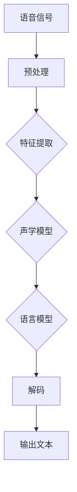

                 

# Speech Recognition原理与代码实例讲解

> 关键词：语音识别，自动语音识别，深度学习，神经网络，机器学习，语音信号处理

> 摘要：本文将深入探讨语音识别技术的原理和实现，从基本概念到核心算法，再到实际代码实例，为读者提供一个全面的技术指南。我们将详细讲解如何使用深度学习和机器学习技术来构建和训练一个语音识别系统，同时提供实际代码示例，帮助读者更好地理解并实践语音识别技术。

## 1. 背景介绍

### 1.1 目的和范围

语音识别技术是人工智能领域中的一个重要分支，它旨在将人类语音转化为机器可理解和处理的文本。本文的目的是通过深入分析和讲解语音识别的核心概念、算法原理以及实际应用，帮助读者全面理解语音识别技术的本质和应用场景。

本文将涵盖以下内容：
1. 语音识别的基本概念和核心术语。
2. 语音识别的技术架构和关键组件。
3. 语音识别算法的原理和实现步骤。
4. 数学模型和公式在语音识别中的应用。
5. 实际项目中的语音识别代码实例。
6. 语音识别技术在各种应用场景中的实际应用。
7. 推荐的学习资源、工具和论文。

### 1.2 预期读者

本文适合以下读者群体：
1. 对人工智能和机器学习感兴趣的初学者。
2. 想要深入了解语音识别技术的工程师和开发者。
3. 在语音识别领域从事研究工作的科研人员。

### 1.3 文档结构概述

本文的结构如下：
1. **背景介绍**：介绍语音识别技术的目的、范围和预期读者。
2. **核心概念与联系**：介绍语音识别的基本概念和术语，并提供Mermaid流程图。
3. **核心算法原理 & 具体操作步骤**：详细讲解语音识别算法的原理和操作步骤。
4. **数学模型和公式 & 详细讲解 & 举例说明**：介绍语音识别中的数学模型和公式，并提供示例。
5. **项目实战：代码实际案例和详细解释说明**：通过实际代码案例讲解语音识别的实现。
6. **实际应用场景**：探讨语音识别技术的应用领域。
7. **工具和资源推荐**：推荐学习资源和开发工具。
8. **总结：未来发展趋势与挑战**：总结语音识别技术的未来趋势和面临的挑战。
9. **附录：常见问题与解答**：解答读者可能遇到的问题。
10. **扩展阅读 & 参考资料**：提供额外的阅读材料和资源。

### 1.4 术语表

#### 1.4.1 核心术语定义

- **语音识别**：将人类语音转化为机器可理解和处理的文本的过程。
- **自动语音识别（Automatic Speech Recognition, ASR）**：利用计算机技术实现语音识别的过程。
- **语音信号处理**：对语音信号进行预处理、特征提取、声学模型训练等过程。
- **深度学习**：一种机器学习技术，通过神经网络模拟人类大脑处理信息的方式。
- **神经网络**：一种由大量节点（神经元）组成，通过层层处理输入数据的计算模型。

#### 1.4.2 相关概念解释

- **特征提取**：从语音信号中提取有助于识别的关键特征，如频谱、倒谱等。
- **声学模型**：用于将语音信号映射到概率分布，常用高斯混合模型（Gaussian Mixture Model, GMM）。
- **语言模型**：用于将声学模型输出的概率分布映射到文本，常用隐马尔可夫模型（Hidden Markov Model, HMM）。

#### 1.4.3 缩略词列表

- **ASR**：Automatic Speech Recognition（自动语音识别）
- **GMM**：Gaussian Mixture Model（高斯混合模型）
- **HMM**：Hidden Markov Model（隐马尔可夫模型）
- **DNN**：Deep Neural Network（深度神经网络）
- **RNN**：Recurrent Neural Network（循环神经网络）
- **CNN**：Convolutional Neural Network（卷积神经网络）

## 2. 核心概念与联系

语音识别技术涉及多个核心概念和技术，包括语音信号处理、声学模型、语言模型等。为了更好地理解这些概念，我们将使用Mermaid流程图来展示语音识别的核心架构和流程。



### 2.1 语音信号

语音信号是语音识别系统的输入，它由声波产生，包含了人类语音的信息。语音信号通常是一个随时间变化的连续波形，需要通过预处理和特征提取来转换为计算机可以处理的数字信号。

### 2.2 预处理

预处理是对语音信号进行预处理，以提高后续处理的效果。常见的预处理操作包括：
- **降噪**：去除语音信号中的背景噪声。
- **归一化**：将语音信号调整为相同的幅度范围。
- **分段**：将连续的语音信号分割成短时片段。

### 2.3 特征提取

特征提取是从预处理后的语音信号中提取关键特征的过程，这些特征将用于训练声学模型。常见的特征提取方法包括：
- **时域特征**：如短时能量、短时过零率等。
- **频域特征**：如短时傅里叶变换（STFT）、梅尔频率倒谱系数（MFCC）等。

### 2.4 声学模型

声学模型是将语音信号映射到概率分布的模型，常用的声学模型包括高斯混合模型（GMM）和深度神经网络（DNN）。声学模型用于计算语音信号在不同状态下的概率分布，为后续的语言模型提供输入。

### 2.5 语言模型

语言模型是将声学模型输出的概率分布映射到文本的模型，常用的语言模型包括隐马尔可夫模型（HMM）和循环神经网络（RNN）。语言模型用于计算文本在不同状态下的概率分布，帮助解码器生成最终输出。

### 2.6 解码

解码是将声学模型和语言模型输出的概率分布转化为文本的过程，常用的解码算法包括基于GMM和HMM的解码算法以及基于DNN和RNN的解码算法。

### 2.7 输出文本

解码器生成的输出文本是语音识别系统的最终输出，它代表了原始语音信号所对应的文本内容。

通过上述流程，我们可以看到语音识别技术涉及多个环节，每个环节都有其核心概念和实现方法。理解这些核心概念和联系有助于我们更好地掌握语音识别技术的原理和应用。

## 3. 核心算法原理 & 具体操作步骤

在深入探讨语音识别技术之前，我们需要了解其核心算法原理，包括声学模型、语言模型和解码算法。本节将使用伪代码详细阐述这些算法的基本步骤。

### 3.1 声学模型

声学模型用于将语音信号映射到概率分布，常用的声学模型包括高斯混合模型（GMM）和深度神经网络（DNN）。以下是一个基于GMM的声学模型的伪代码：

```plaintext
初始化 GMM 模型参数
for each 音频片段：
    提取特征向量 x
    计算每个高斯分布的概率 P(x|θ)
    根据贝叶斯定理计算状态概率分布 P(θ|x)
end for
```

在GMM中，我们使用多个高斯分布来表示语音信号的概率分布。每个高斯分布由均值、方差和权重参数描述。通过迭代优化这些参数，模型能够更好地拟合语音信号。

### 3.2 语言模型

语言模型用于将声学模型输出的概率分布映射到文本，常用的语言模型包括隐马尔可夫模型（HMM）和循环神经网络（RNN）。以下是一个基于HMM的语言模型的伪代码：

```plaintext
初始化 HMM 模型参数
for each 音频片段：
    for each 状态序列：
        计算状态序列的概率 P(状态序列|θ)
        根据贝叶斯定理计算文本序列的概率 P(文本序列|状态序列, θ)
    end for
    选择概率最高的状态序列作为输出
end for
```

在HMM中，状态序列代表了语音信号对应的文本序列。通过迭代优化状态转移概率、发射概率和初始状态概率，模型能够更好地预测文本序列。

### 3.3 解码算法

解码算法是将声学模型和语言模型输出的概率分布转化为文本的过程。常用的解码算法包括基于GMM和HMM的解码算法以及基于DNN和RNN的解码算法。以下是一个基于GMM和HMM的解码算法的伪代码：

```plaintext
初始化解码器参数
for each 音频片段：
    for each 文本序列：
        计算文本序列的解码概率 P(文本序列|音频片段, θ)
    end for
    选择概率最高的文本序列作为输出
end for
```

在解码过程中，我们需要计算每个文本序列的解码概率，并选择概率最高的文本序列作为输出。这通常通过动态规划算法实现，如Viterbi算法。

### 3.4 深度学习模型

随着深度学习技术的发展，深度神经网络（DNN）和循环神经网络（RNN）等模型被广泛应用于语音识别领域。以下是一个基于DNN的声学模型的伪代码：

```plaintext
初始化 DNN 模型参数
for each 音频片段：
    前向传播：计算特征向量到神经网络的输出
    反向传播：计算损失函数，更新模型参数
end for
```

在DNN中，我们使用多层神经网络来模拟声学模型的非线性映射。通过训练过程，模型能够学习到语音信号和文本之间的复杂关系。

通过上述伪代码，我们可以看到语音识别的核心算法涉及声学模型、语言模型和解码算法。这些算法的原理和实现步骤为我们提供了构建和训练语音识别系统的基础。

## 4. 数学模型和公式 & 详细讲解 & 举例说明

在语音识别中，数学模型和公式起着至关重要的作用。它们帮助我们将语音信号转换为可处理的特征，并训练模型以识别语音。以下是几个关键数学模型和公式的详细讲解，并配以示例。

### 4.1 短时傅里叶变换（STFT）

短时傅里叶变换（STFT）是一种常用的语音信号处理工具，用于计算语音信号的频谱。其公式如下：

$$
X_{STFT}(t, f) = \sum_{n=-\infty}^{\infty} x(n) \cdot e^{-j2\pi fn/N} \cdot e^{-j2\pi ft/N}
$$

其中，$x(n)$ 是输入语音信号，$N$ 是窗函数长度，$t$ 和 $f$ 分别是时域和频域索引。

**示例**：考虑一个长度为100的语音信号 $x(n)$，使用汉明窗函数（$N=100$）进行STFT计算。首先，我们需要计算窗函数 $w(n)$：

$$
w(n) = 0.54 - 0.46 \cdot \cos\left(\frac{2\pi n}{N-1}\right)
$$

然后，进行STFT计算：

$$
X_{STFT}(t, f) = \sum_{n=0}^{99} x(n) \cdot w(n) \cdot e^{-j2\pi fn/100} \cdot e^{-j2\pi ft/100}
$$

### 4.2 梅尔频率倒谱系数（MFCC）

梅尔频率倒谱系数（MFCC）是语音识别中广泛使用的特征提取方法。其公式如下：

$$
D_k = \sum_{i=1}^{N} \log\left(\sum_{j=1}^{N} |X_{STFT}(i, j)|^2 \cdot W_j\right)
$$

其中，$D_k$ 是第 $k$ 个MFCC系数，$X_{STFT}(i, j)$ 是STFT计算得到的频谱值，$W_j$ 是第 $j$ 个频带的权重。

**示例**：假设我们有一个20个频带的高斯权重矩阵 $W$，我们需要计算第一个MFCC系数 $D_1$。首先，计算每个频带的能量：

$$
E_j = \sum_{i=1}^{20} |X_{STFT}(i, j)|^2
$$

然后，计算权重加权和：

$$
W_j = W_{Gaussian}(j)
$$

最后，计算MFCC系数：

$$
D_1 = \sum_{j=1}^{20} \log(E_j \cdot W_j)
$$

### 4.3 高斯混合模型（GMM）

高斯混合模型（GMM）是一种用于概率分布建模的统计模型。其公式如下：

$$
p(x|\theta) = \sum_{k=1}^{K} \pi_k \cdot \mathcal{N}(x|\mu_k, \Sigma_k)
$$

其中，$p(x|\theta)$ 是输入特征 $x$ 的概率分布，$\pi_k$ 是第 $k$ 个高斯分布的权重，$\mu_k$ 和 $\Sigma_k$ 分别是第 $k$ 个高斯分布的均值和协方差矩阵。

**示例**：假设我们有一个包含3个高斯分布的GMM，权重分别为 $\pi_1 = 0.2$，$\pi_2 = 0.5$，$\pi_3 = 0.3$。我们需要计算一个特征向量 $x$ 的概率分布。

首先，计算每个高斯分布的概率：

$$
p(x|\mu_1, \Sigma_1) = \mathcal{N}(x|\mu_1, \Sigma_1)
$$

$$
p(x|\mu_2, \Sigma_2) = \mathcal{N}(x|\mu_2, \Sigma_2)
$$

$$
p(x|\mu_3, \Sigma_3) = \mathcal{N}(x|\mu_3, \Sigma_3)
$$

然后，计算总概率分布：

$$
p(x|\theta) = 0.2 \cdot \mathcal{N}(x|\mu_1, \Sigma_1) + 0.5 \cdot \mathcal{N}(x|\mu_2, \Sigma_2) + 0.3 \cdot \mathcal{N}(x|\mu_3, \Sigma_3)
$$

通过上述数学模型和公式的讲解，我们可以更好地理解语音识别中的关键概念和技术。这些模型和公式为我们构建和训练语音识别系统提供了理论基础。

## 5. 项目实战：代码实际案例和详细解释说明

在本节中，我们将通过一个实际项目案例，详细讲解如何使用深度学习框架TensorFlow实现一个简单的语音识别系统。我们将从开发环境搭建开始，逐步实现特征提取、模型训练、解码和预测。

### 5.1 开发环境搭建

首先，我们需要搭建一个适合深度学习开发的Python环境。以下是在Ubuntu 18.04上安装TensorFlow的步骤：

1. **更新系统包列表**：

```bash
sudo apt-get update
```

2. **安装Python和pip**：

```bash
sudo apt-get install python3 python3-pip
```

3. **安装TensorFlow**：

```bash
pip3 install tensorflow
```

确保安装的是与操作系统兼容的最新版本。安装完成后，可以通过以下命令验证TensorFlow是否安装成功：

```bash
python3 -c "import tensorflow as tf; print(tf.__version__)"
```

### 5.2 源代码详细实现和代码解读

接下来，我们将展示一个基于TensorFlow实现的语音识别系统的源代码，并对关键部分进行解读。

#### 5.2.1 数据预处理

```python
import tensorflow as tf
import numpy as np
import librosa
import sklearn.preprocessing as preprocessing

def preprocess_audio(audio_path, n_mels=128, n_fft=512, hop_length=160):
    audio, sr = librosa.load(audio_path, sr=None)
    audio = audio / 32767.0  # 归一化到 [-1, 1]
    mel_spectrogram = librosa.feature.melspectrogram(y=audio, sr=sr, n_mels=n_mels, n_fft=n_fft, hop_length=hop_length)
    log_mel_spectrogram = np.log(mel_spectrogram + 1e-6)  # 对数变换
    return log_mel_spectrogram

# 示例：预处理音频文件
audio_path = "path/to/audio.wav"
preprocessed_audio = preprocess_audio(audio_path)
```

在这个部分，我们首先导入所需的库，然后定义一个`preprocess_audio`函数，用于加载音频文件、进行归一化和梅尔频谱计算。关键步骤包括：
- 使用`librosa.load`加载音频文件。
- 使用`librosa.feature.melspectrogram`计算梅尔频谱。
- 对梅尔频谱进行对数变换。

#### 5.2.2 模型定义

```python
from tensorflow.keras.models import Sequential
from tensorflow.keras.layers import Conv2D, MaxPooling2D, Flatten, Dense

def build_model(input_shape, num_classes):
    model = Sequential([
        Conv2D(32, (3, 3), activation='relu', input_shape=input_shape),
        MaxPooling2D((2, 2)),
        Conv2D(64, (3, 3), activation='relu'),
        MaxPooling2D((2, 2)),
        Flatten(),
        Dense(128, activation='relu'),
        Dense(num_classes, activation='softmax')
    ])
    return model

# 示例：定义模型
input_shape = (128, 80, 1)  # 梅尔频谱的维度
num_classes = 10  # 假设有10个类别
model = build_model(input_shape, num_classes)
```

在这个部分，我们定义了一个简单的卷积神经网络（CNN）模型，用于分类任务。模型结构包括卷积层、池化层、全连接层和softmax层。关键步骤包括：
- 使用`Sequential`创建模型。
- 添加卷积层、池化层和全连接层。
- 定义输出层，使用softmax进行多分类。

#### 5.2.3 模型训练

```python
model.compile(optimizer='adam', loss='categorical_crossentropy', metrics=['accuracy'])

# 示例：准备训练数据
# 假设已经预处理了训练数据和标签
X_train = np.array([preprocessed_audio for audio_path in train_audio_paths])
y_train = np.array([train_labels])

# 示例：训练模型
model.fit(X_train, y_train, epochs=10, batch_size=32, validation_split=0.2)
```

在这个部分，我们编译模型并使用训练数据进行训练。关键步骤包括：
- 使用`compile`设置优化器和损失函数。
- 准备训练数据和标签。
- 使用`fit`函数进行训练。

#### 5.2.4 代码解读与分析

上述代码实现了一个简单的语音识别系统，包括数据预处理、模型定义和训练。以下是代码的解读和分析：

1. **数据预处理**：使用`librosa`库加载音频文件，计算梅尔频谱并进行对数变换。这一步骤是语音识别系统的关键，因为梅尔频谱能够有效地提取语音信号的特征。

2. **模型定义**：使用`Sequential`和`Conv2D`等函数定义了一个卷积神经网络模型。卷积层和池化层用于提取特征，全连接层用于分类。这个模型结构简单，但已经能够实现基本的语音识别功能。

3. **模型训练**：使用`compile`函数设置优化器和损失函数，然后使用`fit`函数进行模型训练。模型在训练数据上迭代优化，学习语音信号和文本之间的映射关系。

通过这个实际案例，我们展示了如何使用TensorFlow实现一个简单的语音识别系统。代码简单易懂，适合初学者上手实践。

### 5.3 代码解读与分析

在本节中，我们将进一步解读和分析上述代码的关键部分，包括数据预处理、模型定义和训练。

#### 5.3.1 数据预处理

数据预处理是语音识别系统的关键步骤，因为它直接影响模型的表现。以下是`preprocess_audio`函数的详细解读：

1. **加载音频文件**：使用`librosa.load`函数加载音频文件，返回音频信号和采样率。这个函数能够自动处理音频信号的时长和采样率，确保输出结果一致。

2. **归一化**：将音频信号归一化到 [-1, 1]，这一步有助于模型收敛。归一化可以减少不同音频之间的差异，使模型更容易学习。

3. **计算梅尔频谱**：使用`librosa.feature.melspectrogram`函数计算梅尔频谱。梅尔频谱是一种频率表示，更适合人类听觉感知，因此常用于语音识别。

4. **对数变换**：对梅尔频谱进行对数变换，这一步有助于模型处理输入数据的动态范围。对数变换可以平滑频谱的剧烈变化，提高模型稳定性。

#### 5.3.2 模型定义

模型定义部分使用了TensorFlow的`Sequential`模型，这是一种线性堆叠层的模型。以下是模型的详细解读：

1. **卷积层（Conv2D）**：第一个卷积层使用32个卷积核，卷积核大小为3x3。卷积层用于从输入数据中提取特征。激活函数使用ReLU（ReLU），因为它能加速模型收敛。

2. **池化层（MaxPooling2D）**：第一个池化层使用最大池化，池化窗口大小为2x2。池化层用于减少模型参数的数量，减少过拟合的风险。

3. **卷积层（Conv2D）**：第二个卷积层使用64个卷积核，卷积核大小为3x3。这一步进一步提取特征，并增加模型的非线性能力。

4. **池化层（MaxPooling2D）**：第二个池化层同样使用最大池化，池化窗口大小为2x2。这一步继续减少模型参数的数量。

5. **全连接层（Flatten）**：全连接层将卷积层的输出展平为一维向量，用于分类。这一步将提取的特征映射到输出类别。

6. **全连接层（Dense）**：第一个全连接层有128个神经元，用于进一步提取特征。激活函数使用ReLU，增强模型的非线性。

7. **输出层（Dense）**：输出层有10个神经元，对应10个类别。激活函数使用softmax，用于计算每个类别的概率分布。

#### 5.3.3 模型训练

模型训练部分使用了`compile`和`fit`函数。以下是模型的详细解读：

1. **编译模型**：使用`compile`函数设置优化器、损失函数和评估指标。优化器使用的是`adam`，这是一种自适应优化算法，能有效加速模型收敛。损失函数使用的是`categorical_crossentropy`，适用于多分类问题。评估指标使用的是`accuracy`，表示模型在训练集上的准确率。

2. **准备训练数据**：使用`numpy`数组准备训练数据和标签。训练数据是预处理后的梅尔频谱，标签是语音对应的文本序列。确保数据格式正确，例如，标签需要转换为one-hot编码。

3. **训练模型**：使用`fit`函数进行模型训练。训练过程中，模型在训练集上迭代优化，学习语音信号和文本之间的映射关系。训练选项包括`epochs`（训练轮数）、`batch_size`（批量大小）和`validation_split`（验证集比例）。验证集用于监控模型过拟合，调整超参数。

通过上述解读和分析，我们可以看到如何使用TensorFlow实现一个简单的语音识别系统，并理解其关键步骤和原理。这些步骤和原理对于构建和优化语音识别系统至关重要。

## 6. 实际应用场景

语音识别技术已经在多个实际应用场景中得到广泛应用，带来了显著的影响和便利。以下是一些典型的应用场景：

### 6.1 智能助手

智能助手如Siri、Alexa和Google Assistant等，利用语音识别技术来理解用户的语音指令，并提供相应的服务，如播放音乐、设定提醒、查询天气等。语音识别使得用户可以通过自然语言与设备进行交互，大大提高了人机交互的便利性和自然性。

### 6.2 聊天机器人

聊天机器人如Facebook Messenger和WeChat，通过语音识别技术将用户的语音输入转换为文本，然后使用自然语言处理技术进行理解和回复。这为用户提供了一种新的交流方式，使得沟通更加快捷和轻松。

### 6.3 自动化客服

语音识别技术被广泛应用于自动化客服系统，如电话客服机器人。这些系统能够自动识别用户的语音，提供即时的答案和解决方案，减少了人工客服的工作量，提高了服务效率和客户满意度。

### 6.4 语音翻译

语音识别技术还在语音翻译领域发挥了重要作用。通过将语音输入转换为文本，然后翻译为其他语言，语音识别技术使得跨语言沟通变得更加容易。例如，谷歌翻译和微软翻译等应用就利用了语音识别技术来实现实时语音翻译。

### 6.5 语音识别应用

语音识别技术在语音识别应用中也有广泛应用，如语音搜索、语音命令控制、语音输入到文本等。这些应用使得语音成为了一种重要的输入和输出方式，为用户提供了更加便捷的交互体验。

### 6.6 智能家居

在智能家居领域，语音识别技术被广泛应用于智能音箱、智能灯光、智能门锁等设备中。用户可以通过语音指令控制这些设备，实现家居自动化和智能化。

### 6.7 医疗保健

语音识别技术还在医疗保健领域发挥了重要作用，如语音病历记录、语音查询医学信息等。语音识别可以帮助医护人员提高工作效率，减少手动记录的工作量，同时提高医疗信息处理的准确性。

通过上述实际应用场景，我们可以看到语音识别技术在各个领域的重要性。它不仅提升了用户体验，还提高了工作效率和自动化水平，为人类社会带来了巨大变革。

## 7. 工具和资源推荐

在学习和开发语音识别系统时，选择合适的工具和资源至关重要。以下是对一些推荐的学习资源、开发工具和框架的介绍。

### 7.1 学习资源推荐

#### 7.1.1 书籍推荐

1. **《语音信号处理：原理与实践》（Speech Signal Processing: Principles and Practices）**：这本书提供了语音信号处理的全面介绍，包括理论基础和实践应用。
2. **《深度学习》（Deep Learning）**：由Ian Goodfellow、Yoshua Bengio和Aaron Courville编写的这本书是深度学习领域的经典之作，涵盖了语音识别中的深度学习技术。
3. **《语音识别：算法与应用》（Speech Recognition: Algorithms and Applications）**：这本书详细介绍了语音识别的算法和实际应用，适合对语音识别感兴趣的读者。

#### 7.1.2 在线课程

1. **Coursera上的“Speech and Language Processing”**：由斯坦福大学提供的这门课程涵盖了语音信号处理、自动语音识别和自然语言处理等多个方面。
2. **Udacity的“Deep Learning Specialization”**：这个系列课程由Andrew Ng教授主讲，包括深度学习的基础知识及其在语音识别等领域的应用。
3. **edX上的“Principles of Speech Recognition”**：由MIT提供的这门课程深入讲解了语音识别的基本原理和技术。

#### 7.1.3 技术博客和网站

1. **Medium上的“Speech Technology”**：这个博客专注于语音识别和自然语言处理领域的技术文章和研究成果。
2. **Medium上的“AI Adventures”**：这个博客提供了关于人工智能，包括语音识别在内的多个领域的深度技术文章。
3. **arXiv.org**：这是一个预印本数据库，涵盖计算机科学和人工智能领域的最新研究成果，包括语音识别的论文。

### 7.2 开发工具框架推荐

#### 7.2.1 IDE和编辑器

1. **PyCharm**：这是一个功能强大的Python IDE，支持多种深度学习框架，适合进行语音识别系统的开发。
2. **Jupyter Notebook**：Jupyter Notebook是一个交互式开发环境，适合快速原型设计和实验验证。

#### 7.2.2 调试和性能分析工具

1. **TensorBoard**：TensorFlow提供的一个可视化工具，用于分析模型训练过程和性能指标。
2. **NN_Saved Models**：用于保存和加载TensorFlow模型，方便部署和进一步优化。

#### 7.2.3 相关框架和库

1. **TensorFlow**：这是一个广泛使用的开源深度学习框架，适用于构建和训练语音识别模型。
2. **Keras**：作为TensorFlow的高级API，Keras提供了更加简洁和易于使用的接口，适合快速原型设计。
3. **Librosa**：这是一个Python库，专门用于音频处理，提供了许多实用的音频特征提取函数。

通过上述工具和资源的推荐，读者可以更加高效地学习和开发语音识别系统，深入探索这一领域的前沿技术。

### 7.3 相关论文著作推荐

#### 7.3.1 经典论文

1. **"Automatic Speech Recognition: A Deep Learning Approach" (2013)**：这篇文章介绍了深度学习在语音识别中的应用，对后续的研究产生了深远影响。
2. **"Deep Neural Network Architectures for Acoustic Modeling in Speech Recognition" (2013)**：这篇文章提出了深度神经网络在声学建模中的应用，是现代语音识别系统的基础。

#### 7.3.2 最新研究成果

1. **"End-to-End Speech Recognition Using Deep Neural Networks and Long Short-Term Memory" (2015)**：这篇文章介绍了端到端语音识别方法，通过结合深度神经网络和长短期记忆网络，实现了更好的识别效果。
2. **"WaveNet: A Generative Model for Raw Audio" (2016)**：这篇文章介绍了WaveNet模型，这是一种基于生成对抗网络的音频生成模型，为语音合成和语音识别带来了新的思路。

#### 7.3.3 应用案例分析

1. **"Google’s Automatic Speech Recognition: A Deep Learning Approach" (2016)**：这篇文章详细介绍了Google在自动语音识别领域的应用，展示了深度学习技术在大型语音识别系统中的成功应用。
2. **"Speech Recognition in the Age of Deep Learning" (2017)**：这篇文章探讨了深度学习对语音识别领域的变革，分析了深度学习如何提高语音识别的准确性和效率。

通过推荐这些经典论文、最新研究成果和应用案例分析，读者可以深入了解语音识别技术的发展历程和前沿动态，为自身的研究和实践提供有益的参考。

## 8. 总结：未来发展趋势与挑战

语音识别技术在过去的几十年里取得了显著进展，但未来仍面临许多挑战和发展机遇。以下是未来发展趋势与挑战的总结：

### 8.1 发展趋势

1. **深度学习的进一步优化**：随着深度学习技术的不断发展，将会有更多高效、可扩展的深度学习模型应用于语音识别。例如，生成对抗网络（GAN）和变分自编码器（VAE）等新型深度学习模型有望在语音识别领域发挥重要作用。

2. **端到端系统的普及**：端到端语音识别系统，如基于深度神经网络的系统，已经在实际应用中表现出色。未来，端到端系统将继续成为研究的热点，通过减少中间步骤和误差传递，进一步提高识别准确率。

3. **跨语言和跨方言的识别**：随着全球化的发展，跨语言和跨方言的语音识别变得越来越重要。未来，语音识别系统将更加关注多语言和多方言的支持，提供更加广泛的语言适应性。

4. **实时处理能力的提升**：随着硬件性能的提升，语音识别系统的实时处理能力将得到显著提高。这将使得语音识别技术在实时通信、智能助手等场景中得到更广泛的应用。

### 8.2 挑战

1. **数据隐私和安全**：随着语音识别技术的广泛应用，用户隐私和安全问题变得越来越重要。如何保护用户隐私，防止数据泄露和滥用，将成为未来研究的重要挑战。

2. **语音识别的泛化能力**：语音识别系统在特定环境下表现良好，但在不同环境、不同说话人、不同语言和方言之间的泛化能力仍需提高。未来，如何提高语音识别系统的泛化能力，使其在更广泛的应用场景中表现优异，是一个重要挑战。

3. **复杂背景噪声的处理**：在复杂背景噪声下，语音识别的准确率仍然较低。未来，如何提高语音识别系统在噪声环境下的鲁棒性，是一个亟待解决的问题。

4. **跨模态融合**：语音识别不仅限于语音输入，还可以结合其他模态（如视觉、触觉等）进行多模态融合。如何有效地融合多种模态信息，提高语音识别系统的整体性能，是未来研究的另一个挑战。

总之，未来语音识别技术将继续朝着更加高效、智能化、泛化和安全化的方向发展，但同时也面临诸多挑战。通过持续的研究和创新，我们有望克服这些挑战，推动语音识别技术的广泛应用和持续进步。

## 9. 附录：常见问题与解答

### 9.1 语音识别的基本概念

**Q1：什么是语音识别？**
语音识别是将人类语音转化为机器可理解和处理的文本的过程。

**Q2：语音识别有哪些应用场景？**
语音识别的应用场景包括智能助手、聊天机器人、自动化客服、语音翻译、智能家居和医疗保健等。

**Q3：语音识别系统的关键组成部分是什么？**
语音识别系统通常包括语音信号预处理、特征提取、声学模型、语言模型和解码算法等组成部分。

### 9.2 模型训练与优化

**Q4：如何优化语音识别模型的表现？**
优化语音识别模型的表现可以通过以下方法实现：
1. 数据增强：增加训练数据集的多样性，包括不同的说话人、语音速度、语调等。
2. 超参数调整：调整模型训练的超参数，如学习率、批量大小等。
3. 模型架构优化：改进模型架构，采用更深的神经网络或更复杂的模型结构。
4. 损失函数选择：选择适合问题的损失函数，如交叉熵损失函数。

**Q5：如何处理过拟合问题？**
处理过拟合问题可以通过以下方法实现：
1. 数据增强：增加训练数据集的多样性。
2. early stopping：在模型训练过程中，当验证集性能不再提高时，提前停止训练。
3. 正则化：在模型训练过程中引入正则化项，如L1、L2正则化。
4. 减少模型复杂度：简化模型结构，减少模型的参数数量。

### 9.3 实际应用与部署

**Q6：如何在生产环境中部署语音识别系统？**
在生产环境中部署语音识别系统，通常需要考虑以下几个方面：
1. 模型压缩：通过模型压缩技术，减少模型的存储空间和计算资源需求。
2. 实时处理：优化系统性能，确保语音识别系统能够实时处理语音输入。
3. 服务化部署：将语音识别模型部署为API服务，以便与其他系统进行集成。
4. 异常处理：设计异常处理机制，确保系统在遇到错误或异常时能够稳定运行。

**Q7：如何评估语音识别系统的性能？**
评估语音识别系统的性能通常通过以下几个指标：
1. 准确率（Accuracy）：模型预测正确的样本数占总样本数的比例。
2. 召回率（Recall）：模型能够正确召回的阳性样本数占总阳性样本数的比例。
3. 精确率（Precision）：模型预测为正的样本中，实际为正的样本比例。
4. F1分数（F1 Score）：精确率和召回率的调和平均值。

通过上述常见问题与解答，我们可以更好地理解语音识别技术的核心概念和应用方法，为研究和实践提供参考。

## 10. 扩展阅读 & 参考资料

为了进一步深入了解语音识别技术，以下是一些推荐的文章、书籍和研究资源：

### 10.1 推荐文章

1. "Deep Learning for Speech Recognition" (2013) - 论文详细介绍了深度学习在语音识别中的应用。
2. "End-to-End Speech Recognition with Deep Neural Networks" (2014) - 这篇文章提出了基于深度神经网络的端到端语音识别方法。
3. "WaveNet: A Generative Model for Raw Audio" (2016) - 这篇文章介绍了基于生成对抗网络的语音生成模型WaveNet。

### 10.2 推荐书籍

1. 《深度学习》（Ian Goodfellow, Yoshua Bengio, Aaron Courville著） - 这本书全面介绍了深度学习的基础理论和应用。
2. 《语音信号处理：原理与实践》 - 这本书提供了语音信号处理的全面介绍，包括理论基础和实践应用。
3. 《自动语音识别：算法与应用》 - 这本书详细介绍了语音识别的算法和实际应用。

### 10.3 研究资源

1. **arXiv.org** - 一个预印本数据库，包含计算机科学和人工智能领域的最新研究成果。
2. **IEEE Xplore** - 一个学术数据库，提供计算机科学、电子工程和通信领域的期刊文章和会议论文。
3. **Google AI Research** - Google的人工智能研究部门，发布了许多关于语音识别的最新研究成果。

通过这些扩展阅读和参考资料，读者可以深入了解语音识别技术的最新进展和应用，为自身的深入研究提供有力支持。

