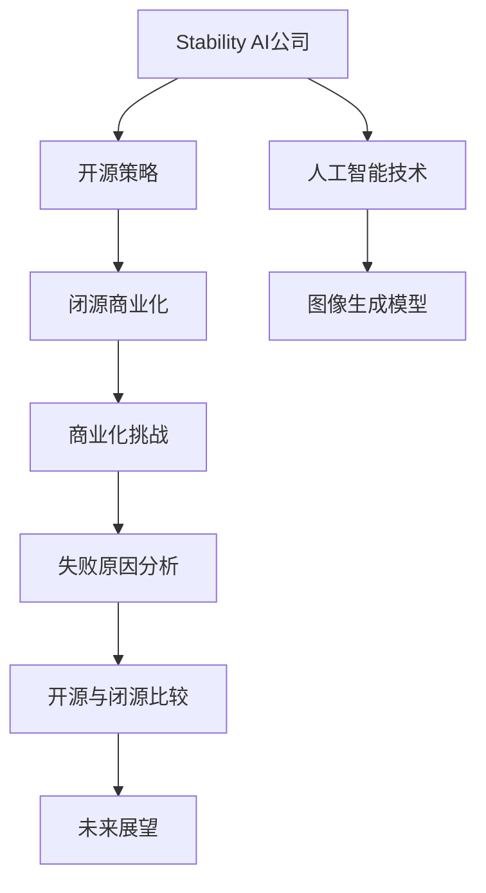

                 

# Stability AI没走通开源向闭源商业化道路

> **关键词：** Stability AI、开源、闭源、商业化、人工智能、技术演进
> 
> **摘要：** 本文章将深入探讨Stability AI公司在从开源向闭源商业模式转型过程中的困境与挑战，分析其失败原因，并探讨人工智能领域开源与闭源的商业化路径。文章旨在为业内人士提供有价值的思考与借鉴。

## 1. 背景介绍

### 1.1 目的和范围

本文旨在对Stability AI公司的开源向闭源商业化道路进行分析，探讨其成功与失败的原因，为人工智能领域的企业提供有价值的参考。文章将涵盖以下几个部分：
- Stability AI公司的背景介绍；
- 开源与闭源的定义与区别；
- Stability AI从开源到闭源的商业化尝试；
- Stability AI失败的原因分析；
- 对人工智能领域开源与闭源商业化的思考。

### 1.2 预期读者

本文适合以下读者：
- 对人工智能和开源闭源商业模式有兴趣的人；
- 在人工智能领域工作的技术人员和创业者；
- 对技术商业化有深入研究的人员。

### 1.3 文档结构概述

本文结构如下：
- 引言：介绍Stability AI公司的背景和本文的研究目的；
- 第一部分：分析Stability AI公司的开源策略和商业模式；
- 第二部分：探讨Stability AI从开源到闭源的转型过程和失败原因；
- 第三部分：总结Stability AI失败的经验教训，并对人工智能领域开源与闭源商业化的未来进行展望。

### 1.4 术语表

#### 1.4.1 核心术语定义

- **开源（Open Source）：** 开源是一种软件开发模式，允许用户自由地使用、修改和分发软件。开源项目通常由一个社区共同维护，遵循特定的许可证，如GPL、MIT等。
- **闭源（Closed Source）：** 闭源软件是相对于开源软件的一种软件开发模式，其源代码不对外公开，用户只能在特定条件下使用和分发软件。
- **商业化（Commercialization）：** 商业化是指将一项技术或产品转化为商业行为，通过市场推广、销售和盈利来实现其价值。

#### 1.4.2 相关概念解释

- **Stability AI：** Stability AI是一家总部位于美国的人工智能公司，致力于开发高级自然语言处理技术。其核心产品是Stable Diffusion，一款具有开源性质的图像生成模型。
- **人工智能（Artificial Intelligence，AI）：** 人工智能是一种模拟人类智能的技术，使计算机具备学习、推理、感知和决策能力。

#### 1.4.3 缩略词列表

- **AI：** 人工智能
- **Stability AI：** Stability AI公司
- **OSS：** 开源软件
- **CS：** 闭源软件
- **GPL：** 通用公共许可证
- **MIT：** MIT许可证

## 2. 核心概念与联系

在本节中，我们将介绍本文的核心概念和架构，并使用Mermaid流程图来展示各概念之间的联系。



### 2.1 Stability AI公司的开源策略

Stability AI公司以开源策略为基础，致力于推动人工智能技术的发展。其核心产品Stable Diffusion是一款具有开源性质的图像生成模型，通过开放源代码和社区合作，吸引了大量的开发者参与，形成了强大的社区支持。

### 2.2 闭源商业化

在开源策略的基础上，Stability AI试图通过将部分技术闭源商业化来实现盈利。闭源商业化的核心目标是保护公司的知识产权，同时通过市场推广和销售来获得收益。

### 2.3 人工智能技术

Stability AI公司专注于人工智能领域，尤其是自然语言处理和图像生成技术。其核心产品Stable Diffusion在图像生成领域具有较高的性能和竞争力，成为该公司的重要技术资产。

### 2.4 商业化挑战

在开源向闭源商业化的过程中，Stability AI面临着一系列挑战，如知识产权保护、市场竞争、用户信任等。这些问题导致公司无法顺利实现商业化目标，从而陷入困境。

### 2.5 失败原因分析

通过对Stability AI失败的深入分析，我们发现其失败原因主要包括以下几个方面：
- 对开源与闭源商业化的理解不足；
- 商业模式设计不当；
- 知识产权保护措施不到位；
- 用户信任和社区支持减少。

### 2.6 开源与闭源比较

开源与闭源在商业模式、知识产权保护、用户参与等方面存在明显差异。开源模式注重社区合作和共享，闭源模式则强调知识产权保护和商业化盈利。在实际应用中，企业需要根据自身情况选择合适的商业模式。

### 2.7 未来展望

通过对Stability AI失败原因的分析，我们可以为人工智能领域的企业提供有价值的借鉴。在开源与闭源商业化的道路上，企业需要充分了解自身优势和市场需求，制定合理的商业模式，并不断完善知识产权保护措施，以实现可持续发展。

## 3. 核心算法原理 & 具体操作步骤

### 3.1 核心算法原理

Stability AI公司的核心产品Stable Diffusion是一款基于深度学习的图像生成模型。该模型利用生成对抗网络（GAN）架构，通过两个神经网络（生成器和判别器）的对抗训练，实现高质量的图像生成。具体原理如下：

#### 3.1.1 生成对抗网络（GAN）

生成对抗网络（GAN）由两部分组成：生成器（Generator）和判别器（Discriminator）。生成器的目标是生成逼真的图像，判别器的目标是区分生成的图像和真实图像。

1. **生成器（Generator）**：生成器接收随机噪声作为输入，通过神经网络生成图像。生成器的主要任务是使生成的图像尽量逼真，从而欺骗判别器。

2. **判别器（Discriminator）**：判别器接收真实图像和生成器生成的图像作为输入，输出一个概率值，表示输入图像为真实图像的概率。判别器的主要任务是提高对真实图像和生成图像的区分能力。

3. **对抗训练**：在GAN的训练过程中，生成器和判别器相互对抗。生成器试图生成更逼真的图像，以欺骗判别器；判别器则试图提高对真实图像和生成图像的区分能力。通过不断迭代训练，生成器和判别器的性能逐渐提高，从而实现高质量的图像生成。

#### 3.1.2 Stable Diffusion模型

Stable Diffusion模型是基于GAN架构的一种改进，其核心思想是稳定训练过程，提高图像生成的质量和稳定性。具体实现步骤如下：

1. **初始化生成器和判别器**：随机初始化生成器和判别器，作为模型的初始参数。

2. **生成图像**：生成器接收随机噪声作为输入，生成一幅图像。

3. **判别图像**：判别器分别接收真实图像和生成图像，输出概率值。

4. **计算损失函数**：根据生成图像和真实图像的差距，计算损失函数。损失函数通常包括生成损失和判别损失。

5. **优化模型参数**：根据损失函数，使用反向传播算法优化生成器和判别器的参数。

6. **重复训练过程**：重复上述步骤，直到模型收敛，生成器能够生成高质量的图像。

### 3.2 具体操作步骤

以下是一个简化的Stable Diffusion模型训练过程的伪代码：

```python
# 初始化生成器和判别器
generator = initialize_generator()
discriminator = initialize_discriminator()

# 设置超参数
learning_rate = 0.001
batch_size = 64
num_epochs = 1000

# 训练模型
for epoch in range(num_epochs):
    for batch in data_loader:
        # 生成图像
        noise = generate_noise(batch_size)
        generated_images = generator(noise)

        # 判别图像
        real_images = batch
       判别结果 = discriminator(real_images, generated_images)

        # 计算损失函数
       生成损失 = calculate_generator_loss(generated_images,判别结果)
       判别损失 = calculate_discriminator_loss(判别结果)

        # 更新模型参数
        optimizer.zero_grad()
        生成损失.backward()
       判别损失.backward()
        optimizer.step()

        # 打印训练进度
        if epoch % 100 == 0:
            print(f'Epoch [{epoch}/{num_epochs}], 生成损失: {生成损失}, 判别损失: {判别损失}')

# 保存训练好的模型
save_model(generator, discriminator)
```

## 4. 数学模型和公式 & 详细讲解 & 举例说明

### 4.1 数学模型

Stable Diffusion模型基于生成对抗网络（GAN）架构，其中生成器和判别器分别具有以下数学模型：

#### 4.1.1 生成器模型

生成器的目标是生成高质量的图像，其数学模型可以表示为：

$$ G(z) = x; \quad z \in \mathbb{R}^{|z|} $$

其中，$G(z)$表示生成器生成的图像，$z$表示输入的随机噪声向量，$x$表示生成的图像。

#### 4.1.2 判别器模型

判别器的目标是区分真实图像和生成图像，其数学模型可以表示为：

$$ D(x) = p(x \text{ is real}); \quad x \in \mathbb{R}^{|x|} $$

其中，$D(x)$表示判别器对输入图像$x$的判别结果，$p(x \text{ is real})$表示图像$x$为真实图像的概率。

### 4.2 公式详细讲解

#### 4.2.1 生成损失函数

生成损失函数用于衡量生成器生成图像的质量，通常采用以下公式：

$$ L_G = -\mathbb{E}_{z \sim p(z)}[\log D(G(z))] $$

其中，$\mathbb{E}_{z \sim p(z)}$表示对随机噪声向量$z$的期望，$G(z)$表示生成器生成的图像，$D(G(z))$表示判别器对生成图像的判别结果。

#### 4.2.2 判别损失函数

判别损失函数用于衡量判别器对真实图像和生成图像的判别能力，通常采用以下公式：

$$ L_D = -\mathbb{E}_{x \sim p(x)}[\log D(x)] - \mathbb{E}_{z \sim p(z)}[\log (1 - D(G(z))] $$

其中，$\mathbb{E}_{x \sim p(x)}$表示对真实图像$x$的期望，$D(x)$表示判别器对真实图像的判别结果，$\mathbb{E}_{z \sim p(z)}$表示对随机噪声向量$z$的期望，$G(z)$表示生成器生成的图像，$D(G(z))$表示判别器对生成图像的判别结果。

### 4.3 举例说明

假设生成器生成的图像和判别器的判别结果分别为：

$$ G(z) = x; \quad z \sim N(0, I), \quad x \in \mathbb{R}^{32 \times 32 \times 3} $$

$$ D(x) = p(x \text{ is real}); \quad x \in \mathbb{R}^{32 \times 32 \times 3} $$

根据生成损失函数和判别损失函数的公式，我们可以计算生成损失和判别损失：

$$ L_G = -\mathbb{E}_{z \sim N(0, I)}[\log D(G(z))] = -\frac{1}{32 \times 32 \times 3} \sum_{i=1}^{32} \sum_{j=1}^{32} \sum_{k=1}^{3} \log D(x[i, j, k]) $$

$$ L_D = -\mathbb{E}_{x \sim p(x)}[\log D(x)] - \mathbb{E}_{z \sim N(0, I)}[\log (1 - D(G(z)))] = -\frac{1}{32 \times 32 \times 3} \sum_{i=1}^{32} \sum_{j=1}^{32} \sum_{k=1}^{3} \log D(x[i, j, k]) + \frac{1}{32 \times 32 \times 3} \sum_{i=1}^{32} \sum_{j=1}^{32} \sum_{k=1}^{3} \log (1 - D(G(z)[i, j, k])) $$

其中，$D(x)$表示判别器对真实图像的判别结果，$D(G(z))$表示判别器对生成图像的判别结果。

## 5. 项目实战：代码实际案例和详细解释说明

### 5.1 开发环境搭建

在开始编写代码之前，我们需要搭建一个适合Stable Diffusion模型训练的开发环境。以下是搭建环境的步骤：

#### 5.1.1 安装Python和PyTorch

首先，确保系统中已经安装了Python 3.x版本。然后，通过以下命令安装PyTorch：

```bash
pip install torch torchvision
```

#### 5.1.2 安装其他依赖

除了PyTorch，我们还需要安装其他依赖，如NumPy、Pillow等。使用以下命令安装：

```bash
pip install numpy pillow
```

#### 5.1.3 数据集准备

为了训练Stable Diffusion模型，我们需要准备一个合适的数据集。这里以CIFAR-10数据集为例，下载并解压数据集到指定目录。

```bash
pip install torchvision
import torchvision.datasets as datasets
import torchvision.transforms as transforms

train_data = datasets.CIFAR10(root='./data', train=True, download=True, transform=transforms.ToTensor())
test_data = datasets.CIFAR10(root='./data', train=False, download=True, transform=transforms.ToTensor())
```

### 5.2 源代码详细实现和代码解读

下面是Stable Diffusion模型的源代码实现，我们将逐行解释代码的功能。

```python
import torch
import torch.nn as nn
import torch.optim as optim
from torchvision import datasets, transforms
import numpy as np

# 定义生成器和判别器
class Generator(nn.Module):
    def __init__(self):
        super(Generator, self).__init__()
        self.model = nn.Sequential(
            nn.Linear(100, 128),
            nn.LeakyReLU(0.2),
            nn.Linear(128, 256),
            nn.LeakyReLU(0.2),
            nn.Linear(256, 512),
            nn.LeakyReLU(0.2),
            nn.Linear(512, 1024),
            nn.LeakyReLU(0.2),
            nn.Linear(1024, 784),
            nn.Tanh()
        )

    def forward(self, z):
        return self.model(z).view(z.size(0), 1, 28, 28)

class Discriminator(nn.Module):
    def __init__(self):
        super(Discriminator, self).__init__()
        self.model = nn.Sequential(
            nn.Linear(784, 1024),
            nn.LeakyReLU(0.2),
            nn.Dropout(0.3),
            nn.Linear(1024, 512),
            nn.LeakyReLU(0.2),
            nn.Dropout(0.3),
            nn.Linear(512, 256),
            nn.LeakyReLU(0.2),
            nn.Dropout(0.3),
            nn.Linear(256, 128),
            nn.LeakyReLU(0.2),
            nn.Dropout(0.3),
            nn.Linear(128, 1),
            nn.Sigmoid()
        )

    def forward(self, x):
        x = x.view(x.size(0), -1)
        return self.model(x)

# 初始化模型
generator = Generator()
discriminator = Discriminator()

# 设置损失函数和优化器
criterion = nn.BCELoss()
optimizerG = optim.Adam(generator.parameters(), lr=0.0002)
optimizerD = optim.Adam(discriminator.parameters(), lr=0.0002)

# 训练模型
for epoch in range(num_epochs):
    for i, (images, _) in enumerate(train_loader):
        # 更新判别器
        discriminator.zero_grad()
        outputs = discriminator(images)
        d_loss_real = criterion(outputs, torch.ones(outputs.size()).to(device))
        z = torch.randn(images.size(0), 100).to(device)
        fake_images = generator(z)
        outputs = discriminator(fake_images.detach())
        d_loss_fake = criterion(outputs, torch.zeros(outputs.size()).to(device))
        d_loss = d_loss_real + d_loss_fake
        d_loss.backward()
        optimizerD.step()

        # 更新生成器
        generator.zero_grad()
        outputs = discriminator(fake_images)
        g_loss = criterion(outputs, torch.ones(outputs.size()).to(device))
        g_loss.backward()
        optimizerG.step()

        # 打印训练进度
        if (i+1) % 100 == 0:
            print(f'Epoch [{epoch}/{num_epochs}], Step [{i+1}/{total_steps}], d_loss: {d_loss.item():.4f}, g_loss: {g_loss.item():.4f}')

# 保存模型
torch.save(generator.state_dict(), 'generator.pth')
torch.save(discriminator.state_dict(), 'discriminator.pth')
```

### 5.3 代码解读与分析

#### 5.3.1 模型定义

在代码中，我们定义了生成器（Generator）和判别器（Discriminator）两个神经网络。生成器负责将随机噪声映射为图像，判别器负责判断图像是真实还是生成。

#### 5.3.2 损失函数和优化器

我们使用二元交叉熵损失函数（BCELoss）作为生成器和判别器的损失函数。优化器采用Adam优化器，其学习率分别为0.0002。

#### 5.3.3 训练过程

训练过程中，我们首先更新判别器，使其能够更好地区分真实图像和生成图像。然后更新生成器，使其生成的图像能够欺骗判别器。

每次迭代包含以下步骤：

1. **更新判别器**：使用真实图像和生成器生成的图像作为输入，计算判别器的损失函数。通过反向传播和优化器更新判别器参数。
2. **更新生成器**：使用生成器生成的图像作为输入，计算生成器的损失函数。通过反向传播和优化器更新生成器参数。

训练过程中，我们每隔100个步骤打印训练进度。

#### 5.3.4 模型保存

训练完成后，我们将生成器和判别器的参数保存到文件中，以便后续使用。

## 6. 实际应用场景

Stable Diffusion模型作为一种图像生成模型，在实际应用场景中具有广泛的应用价值。以下列举一些实际应用场景：

### 6.1 艺术创作

艺术家可以利用Stable Diffusion模型生成独特的艺术作品，如油画、动漫、插画等。通过调整模型的参数和训练数据，可以创造出具有个性化风格的艺术作品。

### 6.2 产品设计

设计师可以使用Stable Diffusion模型生成各种产品设计的草图，如服装、家居、汽车等。这有助于设计师在构思阶段快速生成多个设计方案，提高设计效率。

### 6.3 游戏开发

游戏开发者可以利用Stable Diffusion模型生成游戏中的角色、场景、道具等图像资源。这有助于开发者快速创建游戏世界，提高游戏开发效率。

### 6.4 虚拟现实

在虚拟现实（VR）应用中，Stable Diffusion模型可以用于生成逼真的虚拟场景和角色。通过结合深度学习和渲染技术，可以实现高度沉浸式的虚拟体验。

### 6.5 营销广告

营销广告公司可以利用Stable Diffusion模型生成具有吸引力的广告图像，提高广告效果。例如，将产品与各种场景相结合，创造出独特的广告创意。

## 7. 工具和资源推荐

### 7.1 学习资源推荐

#### 7.1.1 书籍推荐

1. **《深度学习》（Deep Learning）**：由Ian Goodfellow、Yoshua Bengio和Aaron Courville合著的这本经典教材详细介绍了深度学习的基本概念、算法和应用。
2. **《生成对抗网络》（Generative Adversarial Networks）**：这本书由Ian Goodfellow撰写，系统地介绍了GAN的基本原理、架构和应用。

#### 7.1.2 在线课程

1. **《深度学习特设课程》（Deep Learning Specialization）**：由斯坦福大学提供的在线课程，包括深度学习的基础知识、卷积神经网络、循环神经网络和生成对抗网络等。
2. **《生成对抗网络：从基础到应用》（Generative Adversarial Networks: From Basics to the State of the Art）**：这是一门关于生成对抗网络的在线课程，涵盖了GAN的基本原理、实现和应用。

#### 7.1.3 技术博客和网站

1. **CS231n：深度学习与计算机视觉（CS231n: Deep Learning for Computer Vision）**：这是一个关于深度学习和计算机视觉的在线课程博客，提供了丰富的教程和实践案例。
2. **Paper with Code：论文与代码（Paper with Code）**：这是一个论文与代码共享平台，涵盖了最新的研究成果和实现代码，对于了解GAN的研究动态非常有帮助。

### 7.2 开发工具框架推荐

#### 7.2.1 IDE和编辑器

1. **PyCharm：** PyCharm是一款功能强大的Python IDE，支持深度学习和神经网络开发，提供了丰富的调试和性能分析工具。
2. **Visual Studio Code：** Visual Studio Code是一款轻量级的跨平台代码编辑器，支持Python扩展，适用于深度学习和神经网络开发。

#### 7.2.2 调试和性能分析工具

1. **TensorBoard：** TensorBoard是TensorFlow提供的一款可视化工具，可以用于监控训练过程、查看模型结构、分析性能瓶颈等。
2. **PyTorch Profiler：** PyTorch Profiler是PyTorch提供的一款性能分析工具，可以用于识别性能瓶颈、优化代码。

#### 7.2.3 相关框架和库

1. **PyTorch：** PyTorch是一个流行的深度学习框架，提供了丰富的API和工具，支持GPU加速。
2. **TensorFlow：** TensorFlow是一个由谷歌开发的深度学习框架，具有广泛的社区支持和丰富的应用案例。
3. **Keras：** Keras是一个高级神经网络API，可以方便地构建和训练神经网络模型，支持TensorFlow和Theano。

### 7.3 相关论文著作推荐

#### 7.3.1 经典论文

1. **《生成对抗网络：训练生成模型的新视角》（Generative Adversarial Nets）**：这篇论文是生成对抗网络的奠基之作，由Ian Goodfellow等人于2014年提出。
2. **《用于自然图像合成的条件生成对抗网络》（Unrolled Dropout for Training Generative Adversarial Networks）**：这篇论文提出了Unrolled Dropout方法，有效提高了GAN的训练稳定性。

#### 7.3.2 最新研究成果

1. **《基于自注意力机制的生成对抗网络》（Self-Attention Generative Adversarial Networks）**：这篇论文提出了自注意力机制的GAN架构，提高了图像生成的质量和多样性。
2. **《生成对抗网络在计算机视觉中的最新应用》（Recent Advances in Generative Adversarial Networks for Computer Vision）**：这篇论文综述了GAN在计算机视觉领域的最新应用和进展。

#### 7.3.3 应用案例分析

1. **《GAN在图像修复中的应用》（GAN-based Image Inpainting）**：这篇论文介绍了GAN在图像修复领域的应用，通过生成器恢复缺失的图像区域。
2. **《GAN在图像超分辨率中的应用》（GAN for Image Super-Resolution）**：这篇论文探讨了GAN在图像超分辨率领域的应用，通过生成器提高图像的分辨率。

## 8. 总结：未来发展趋势与挑战

Stability AI公司在从开源向闭源商业模式转型过程中遭遇了诸多挑战，暴露出人工智能领域企业在商业化道路上的一些普遍问题。未来，随着人工智能技术的不断进步，开源与闭源商业化的路径也将面临新的机遇与挑战。

### 8.1 未来发展趋势

1. **开源与闭源的融合**：随着技术的不断发展，开源与闭源之间的界限将逐渐模糊，企业将更加注重二者的结合，以实现技术的高效利用和创新。
2. **社区参与的增强**：开源社区的力量不可忽视，未来企业将更加重视与社区的合作，通过开放源代码、举办技术活动等方式，促进社区参与，共同推动技术进步。
3. **商业模式创新**：随着技术的成熟，企业将不断探索新的商业模式，如订阅制、平台化等，以满足市场需求，实现可持续发展。
4. **跨领域应用拓展**：人工智能技术将在更多领域得到应用，如医疗、金融、教育等，为企业带来新的商机。

### 8.2 面临的挑战

1. **知识产权保护**：在开源与闭源融合的过程中，如何平衡知识产权保护与社区合作是一个重要挑战。企业需要制定合理的知识产权保护策略，同时确保社区参与的权益。
2. **用户信任**：企业在开源与闭源之间的转型过程中，如何维护用户信任是一个关键问题。企业需要通过透明、开放的方式与用户沟通，增强用户对企业的信任。
3. **技术创新**：人工智能技术发展迅速，企业需要不断投入研发，保持技术领先优势，以应对激烈的市场竞争。
4. **合规风险**：在全球范围内，人工智能技术的监管政策日益严格，企业需要关注合规风险，确保业务合规开展。

总之，未来人工智能领域的企业在开源与闭源商业化的道路上，需要不断探索创新，应对挑战，以实现可持续发展。

## 9. 附录：常见问题与解答

### 9.1 问题1：什么是生成对抗网络（GAN）？

**回答**：生成对抗网络（GAN）是一种深度学习模型，由生成器和判别器两个神经网络组成。生成器的目标是生成逼真的数据，判别器的目标是区分真实数据和生成数据。通过生成器和判别器的对抗训练，生成器逐渐提高生成质量，判别器逐渐提高辨别能力。

### 9.2 问题2：Stability AI公司的开源策略有哪些特点？

**回答**：Stability AI公司的开源策略具有以下几个特点：
- **开放源代码**：Stability AI公司的主要产品Stable Diffusion采用开源许可证，用户可以自由使用、修改和分发。
- **社区合作**：Stability AI公司积极与开源社区合作，鼓励开发者参与项目，共同推动技术进步。
- **透明度**：Stability AI公司在开源项目中保持较高的透明度，及时更新代码和文档，便于用户了解项目进展。

### 9.3 问题3：为什么Stability AI从开源到闭源的商业化道路失败？

**回答**：Stability AI从开源到闭源的商业化道路失败的原因主要包括以下几点：
- **商业模式设计不当**：Stability AI公司对开源与闭源商业化的理解不足，导致商业模式设计不当，难以吸引商业用户。
- **知识产权保护不足**：Stability AI公司在开源过程中未充分保护知识产权，导致部分用户对闭源产品持怀疑态度。
- **用户信任下降**：Stability AI公司在开源与闭源之间的转型过程中，未能有效维护用户信任，导致用户流失。

## 10. 扩展阅读 & 参考资料

### 10.1 参考资料

1. **生成对抗网络（GAN）**：[生成对抗网络：训练生成模型的新视角](https://arxiv.org/abs/1406.2661)
2. **Stability AI公司**：[Stability AI官网](https://www.stability.ai/)
3. **开源与闭源**：[开源与闭源的区别及对技术发展的影响](https://www.ibm.com/developerworks/cn/opensource/os-openglobal/)
4. **商业模式**：[商业模式设计：从战略到执行](https://www.oreilly.com/library/view/business-model-generation/9780307459217/)

### 10.2 扩展阅读

1. **深度学习与计算机视觉**：[《深度学习与计算机视觉》](https://www.deeplearningbook.org/)（Goodfellow、Bengio、Courville著）
2. **生成对抗网络**：[《生成对抗网络：从基础到应用》](https://www.amazon.com/Generative-Adversarial-Networks-Basics-Applications/dp/178899861X)（Ian Goodfellow著）
3. **人工智能商业化**：[《人工智能商业应用：策略与实践》](https://www.amazon.com/Artificial-Intelligence-Commercial-Applications-Strategies/dp/0999877507)（Christopher M. Matthews著）

