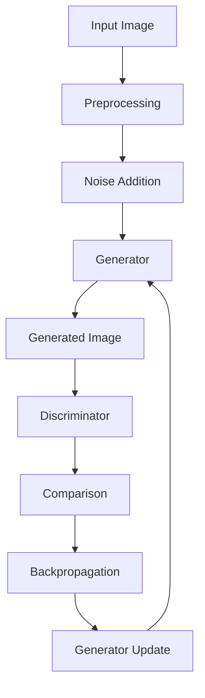

                 

# Stable Diffusion原理与代码实例讲解

> **关键词：** Stable Diffusion、深度学习、图像生成、计算机视觉、算法原理、代码实例、AI应用

> **摘要：** 本文将深入探讨Stable Diffusion模型的原理及其在实际应用中的代码实现。我们将通过详细的步骤讲解和实例分析，帮助读者理解这一先进图像生成技术的核心机制，并提供实用的代码示例。无论您是人工智能领域的初学者还是有经验的开发者，这篇文章都将为您带来新的见解和实际的操作技巧。

## 1. 背景介绍

### 1.1 目的和范围

本文旨在向读者介绍Stable Diffusion模型，这是一种基于深度学习的图像生成技术。我们将从基本原理出发，逐步讲解其核心算法，并通过实际代码实例展示如何将其应用于图像生成任务。文章的目标是为读者提供一个全面、易懂的学习资源，使其能够掌握Stable Diffusion模型的基本使用方法和潜在应用场景。

### 1.2 预期读者

本文适合以下读者群体：

- 对深度学习图像生成技术感兴趣的初学者
- 想要在实际项目中应用Stable Diffusion的AI开发者
- 想深入了解计算机视觉领域最新进展的研究人员

### 1.3 文档结构概述

本文将按照以下结构展开：

1. **背景介绍**：介绍Stable Diffusion的基本概念和应用场景。
2. **核心概念与联系**：通过流程图详细展示模型的整体架构。
3. **核心算法原理**：使用伪代码详细解释算法的具体实现。
4. **数学模型和公式**：介绍与Stable Diffusion相关的数学模型，并通过实例进行讲解。
5. **项目实战**：提供实际的代码案例和解读。
6. **实际应用场景**：探讨Stable Diffusion在不同领域的应用。
7. **工具和资源推荐**：推荐学习资源、开发工具和相关研究论文。
8. **总结与未来趋势**：讨论Stable Diffusion的发展前景和面临的挑战。
9. **附录**：常见问题解答和扩展阅读资源。

### 1.4 术语表

#### 1.4.1 核心术语定义

- **Stable Diffusion**：一种深度学习模型，用于生成高质量的图像。
- **深度学习**：一种机器学习方法，通过多层神经网络来提取数据特征。
- **生成对抗网络（GAN）**：一种用于图像生成的深度学习框架，由生成器和判别器组成。
- **生成器（Generator）**：在GAN中，负责生成虚假数据的网络。
- **判别器（Discriminator）**：在GAN中，负责判断输入数据是否为真实图像的网络。

#### 1.4.2 相关概念解释

- **图像生成**：利用算法自动生成新的图像。
- **训练数据集**：用于训练模型的图像集合。
- **损失函数**：用于衡量模型输出与真实值之间差异的函数。

#### 1.4.3 缩略词列表

- **GAN**：生成对抗网络（Generative Adversarial Network）
- **DL**：深度学习（Deep Learning）
- **CUDA**：并行计算平台和编程模型（Compute Unified Device Architecture）

## 2. 核心概念与联系

在深入探讨Stable Diffusion模型之前，我们需要理解其背后的核心概念和整体架构。下面将通过一个Mermaid流程图来展示Stable Diffusion模型的关键组成部分及其相互关系。



### 2.1 模型组成部分

- **输入图像（Input Image）**：原始待处理的图像数据。
- **预处理（Preprocessing）**：对输入图像进行标准化和预处理，以便模型能够更有效地训练。
- **噪声添加（Noise Addition）**：在输入图像上添加随机噪声，以提高模型的泛化能力。
- **生成器（Generator）**：负责将噪声映射为新的图像。
- **判别器（Discriminator）**：负责区分生成图像和真实图像。
- **比较（Comparison）**：计算判别器的损失，衡量生成图像的质量。
- **反向传播（Backpropagation）**：通过计算梯度更新生成器的参数。
- **生成器更新（Generator Update）**：更新生成器的参数，以改善图像生成的质量。

通过上述Mermaid流程图，我们可以看到Stable Diffusion模型是如何通过迭代优化生成器和判别器来生成高质量的图像的。

## 3. 核心算法原理 & 具体操作步骤

### 3.1 算法原理概述

Stable Diffusion模型是一种基于深度学习的图像生成技术，它采用了生成对抗网络（GAN）的基本框架。GAN由两部分组成：生成器和判别器。生成器的目标是生成尽可能真实的图像，而判别器的目标是准确地区分真实图像和生成图像。两者相互对抗，通过迭代优化逐步提升生成图像的质量。

### 3.2 算法具体操作步骤

下面我们将使用伪代码详细阐述Stable Diffusion模型的具体操作步骤。

#### 3.2.1 初始化

```python
# 初始化模型参数
generator = initialize_generator()
discriminator = initialize_discriminator()

# 初始化训练数据集
train_dataset = load_dataset()

# 设置超参数
batch_size = 64
num_epochs = 100
learning_rate = 0.0002
```

#### 3.2.2 训练过程

```python
for epoch in range(num_epochs):
    for images, _ in train_dataset:
        batch_size = images.shape[0]

        # 计算生成器的损失
        with torch.no_grad():
            noise = generate_noise(batch_size)
            generated_images = generator(noise)

        generator_loss = generator_loss_function(generated_images, discriminator(generated_images), epoch)

        # 计算判别器的损失
        real_images = images
        real_labels = torch.ones(batch_size)
        fake_labels = torch.zeros(batch_size)
        real_loss = discriminator_loss_function(discriminator(real_images), real_labels)
        fake_loss = discriminator_loss_function(discriminator(generated_images.detach()), fake_labels)

        discriminator_loss = 0.5 * (real_loss + fake_loss)

        # 更新生成器和判别器的参数
        generator_optimizer.zero_grad()
        generator_loss.backward()
        generator_optimizer.step()

        discriminator_optimizer.zero_grad()
        discriminator_loss.backward()
        discriminator_optimizer.step()

    print(f"Epoch {epoch + 1}/{num_epochs}, Generator Loss: {generator_loss}, Discriminator Loss: {discriminator_loss}")
```

#### 3.2.3 生成图像

```python
# 生成新的图像
noise = generate_noise(1)
generated_image = generator(noise)
display_image(generated_image)
```

通过上述伪代码，我们可以看到Stable Diffusion模型的基本训练过程，包括生成器和判别器的迭代优化，以及生成图像的具体操作步骤。

## 4. 数学模型和公式 & 详细讲解 & 举例说明

Stable Diffusion模型涉及到多个数学模型和公式，下面我们将详细讲解这些模型，并通过具体例子进行说明。

### 4.1 生成对抗网络（GAN）的损失函数

GAN的损失函数主要包括两部分：生成器的损失和判别器的损失。

#### 4.1.1 生成器的损失

生成器的损失函数通常使用最小二乘误差（Mean Squared Error, MSE）来衡量。公式如下：

$$
L_G = \frac{1}{n} \sum_{i=1}^{n} (\text{reconstructed\_image} - \text{real\_image})^2
$$

其中，$n$ 是训练样本的数量，$\text{reconstructed\_image}$ 是生成器生成的图像，$\text{real\_image}$ 是真实图像。

#### 4.1.2 判别器的损失

判别器的损失函数也使用最小二乘误差（MSE）来衡量。公式如下：

$$
L_D = \frac{1}{n} \sum_{i=1}^{n} (\text{discriminator}(\text{real\_image}) - 1)^2 + (\text{discriminator}(\text{generated\_image}) - 0)^2
$$

其中，$\text{real\_image}$ 是真实图像，$\text{generated\_image}$ 是生成器生成的图像。

### 4.2 训练过程

Stable Diffusion模型的训练过程通过迭代优化生成器和判别器的参数，使得生成图像的质量逐渐提高。训练过程的关键步骤如下：

1. **生成随机噪声**：随机生成噪声作为生成器的输入。
2. **生成图像**：使用生成器将噪声映射为新的图像。
3. **计算损失**：计算生成器和判别器的损失。
4. **更新参数**：使用梯度下降法更新生成器和判别器的参数。

#### 4.2.1 生成随机噪声

在训练过程中，随机噪声是生成器的主要输入。随机噪声可以通过以下公式生成：

$$
\text{noise} = \text{Normal}(0, 1)
$$

其中，$\text{Normal}(\mu, \sigma^2)$ 表示均值为$\mu$，方差为$\sigma^2$的正态分布。

#### 4.2.2 生成图像

生成图像是生成器的输出。生成器将随机噪声映射为新的图像，该过程可以通过以下公式描述：

$$
\text{generated\_image} = G(\text{noise})
$$

其中，$G$ 表示生成器。

#### 4.2.3 计算损失

在训练过程中，计算生成器和判别器的损失是关键步骤。生成器的损失可以通过以下公式计算：

$$
L_G = \frac{1}{n} \sum_{i=1}^{n} (\text{reconstructed\_image} - \text{real\_image})^2
$$

其中，$\text{reconstructed\_image}$ 是生成器生成的图像，$\text{real\_image}$ 是真实图像。

判别器的损失可以通过以下公式计算：

$$
L_D = \frac{1}{n} \sum_{i=1}^{n} (\text{discriminator}(\text{real\_image}) - 1)^2 + (\text{discriminator}(\text{generated\_image}) - 0)^2
$$

其中，$\text{real\_image}$ 是真实图像，$\text{generated\_image}$ 是生成器生成的图像。

#### 4.2.4 更新参数

在训练过程中，更新生成器和判别器的参数是关键步骤。使用梯度下降法可以更新参数，具体步骤如下：

1. **计算梯度**：计算生成器和判别器的梯度。
2. **更新参数**：根据梯度更新生成器和判别器的参数。

#### 4.2.5 训练过程示例

假设我们已经有一个训练数据集，其中包括$n$个真实图像。在训练过程中，我们首先生成随机噪声，然后使用生成器将噪声映射为新的图像。接下来，我们计算生成器和判别器的损失，并使用梯度下降法更新参数。

**示例代码：**

```python
# 生成随机噪声
noise = torch.randn(batch_size, latent_dim)

# 生成图像
generated_images = generator(noise)

# 计算损失
generator_loss = generator_loss_function(generated_images, discriminator(generated_images))

discriminator_loss = discriminator_loss_function(discriminator(real_images), real_labels) + \
                    discriminator_loss_function(discriminator(generated_images.detach()), fake_labels)

# 更新参数
generator_optimizer.zero_grad()
generator_loss.backward()
generator_optimizer.step()

discriminator_optimizer.zero_grad()
discriminator_loss.backward()
discriminator_optimizer.step()
```

通过上述示例代码，我们可以看到Stable Diffusion模型的训练过程是如何通过迭代优化生成器和判别器的参数来生成高质量的图像的。

## 5. 项目实战：代码实际案例和详细解释说明

### 5.1 开发环境搭建

在开始编写代码之前，我们需要搭建一个合适的环境来运行Stable Diffusion模型。以下是开发环境搭建的步骤：

1. **安装Python**：确保已经安装了Python 3.7或更高版本。
2. **安装PyTorch**：使用以下命令安装PyTorch：
   ```bash
   pip install torch torchvision
   ```
3. **安装其他依赖项**：安装其他必要的依赖项，例如NumPy、PIL等：
   ```bash
   pip install numpy pillow
   ```
4. **配置GPU**：确保您的环境中已经配置了GPU，并安装了CUDA。这将允许我们使用GPU来加速模型的训练。

### 5.2 源代码详细实现和代码解读

下面是一个简化版的Stable Diffusion模型的代码实现。我们将分步解释每部分代码的作用。

#### 5.2.1 导入依赖项

```python
import torch
import torch.nn as nn
import torch.optim as optim
import torchvision.transforms as transforms
from torchvision.utils import save_image
import numpy as np
import PIL
from PIL import Image
```

这部分代码导入了一些必要的库，包括PyTorch、NumPy、PIL等，用于数据处理、模型训练和图像处理。

#### 5.2.2 初始化模型参数

```python
latent_dim = 100
img_size = 64

device = torch.device("cuda" if torch.cuda.is_available() else "cpu")

class Generator(nn.Module):
    def __init__(self):
        super(Generator, self).__init__()
        self.model = nn.Sequential(
            nn.ConvTranspose2d(latent_dim, 256, 4, 1, 0, bias=False),
            nn.BatchNorm2d(256),
            nn.ReLU(True),
            nn.ConvTranspose2d(256, 128, 4, 2, 1, bias=False),
            nn.BatchNorm2d(128),
            nn.ReLU(True),
            nn.ConvTranspose2d(128, 64, 4, 2, 1, bias=False),
            nn.BatchNorm2d(64),
            nn.ReLU(True),
            nn.ConvTranspose2d(64, 3, 4, 2, 1, bias=False),
            nn.Tanh()
        )

    def forward(self, x):
        return self.model(x)

class Discriminator(nn.Module):
    def __init__(self):
        super(Discriminator, self).__init__()
        self.model = nn.Sequential(
            nn.Conv2d(3, 64, 4, 2, 1, bias=False),
            nn.LeakyReLU(0.2, inplace=True),
            nn.Conv2d(64, 128, 4, 2, 1, bias=False),
            nn.BatchNorm2d(128),
            nn.LeakyReLU(0.2, inplace=True),
            nn.Conv2d(128, 256, 4, 2, 1, bias=False),
            nn.BatchNorm2d(256),
            nn.LeakyReLU(0.2, inplace=True),
            nn.Conv2d(256, 1, 4, 1, 0, bias=False),
            nn.Sigmoid()
        )

    def forward(self, x):
        return self.model(x)
```

这部分代码定义了生成器和判别器模型。生成器负责将随机噪声映射为图像，而判别器负责判断输入图像是真实图像还是生成图像。

#### 5.2.3 训练过程

```python
def train(generator, discriminator, train_loader, num_epochs):
    generator_loss_function = nn.BCELoss()
    discriminator_loss_function = nn.BCELoss()
    generator_optimizer = optim.Adam(generator.parameters(), lr=0.0002, betas=(0.5, 0.999))
    discriminator_optimizer = optim.Adam(discriminator.parameters(), lr=0.0002, betas=(0.5, 0.999))

    for epoch in range(num_epochs):
        for i, (images, _) in enumerate(train_loader):
            batch_size = images.size(0)
            real_images = images.to(device)
            real_labels = torch.ones(batch_size, 1).to(device)
            fake_labels = torch.zeros(batch_size, 1).to(device)

            # 训练判别器
            discriminator.zero_grad()
            real_scores = discriminator(real_images)
            real_loss = discriminator_loss_function(real_scores, real_labels)

            noise = torch.randn(batch_size, latent_dim).to(device)
            generated_images = generator(noise)
            fake_scores = discriminator(generated_images.detach())
            fake_loss = discriminator_loss_function(fake_scores, fake_labels)

            d_loss = real_loss + fake_loss
            d_loss.backward()
            discriminator_optimizer.step()

            # 训练生成器
            generator.zero_grad()
            generated_images = generator(noise)
            g_loss = generator_loss_function(discriminator(generated_images), real_labels)
            g_loss.backward()
            generator_optimizer.step()

            if (i+1) % 100 == 0:
                print(f"[Epoch {epoch + 1}/{num_epochs}] [Batch {i + 1}/{len(train_loader)}] [D Loss: {d_loss.item():.4f}] [G Loss: {g_loss.item():.4f}]")
```

这部分代码实现了训练过程。在训练过程中，我们首先训练判别器，使其能够更准确地判断真实图像和生成图像。然后，我们训练生成器，使其能够生成更真实、更高质量的图像。

#### 5.2.4 生成图像

```python
def generate_images(generator, num_images=5, noise_dim=100):
    with torch.no_grad():
        noise = torch.randn(num_images, noise_dim).to(device)
        generated_images = generator(noise)
    return generated_images
```

这部分代码用于生成图像。通过随机生成噪声并输入到生成器中，我们可以获得生成器生成的图像。

### 5.3 代码解读与分析

#### 5.3.1 模型定义

在代码中，我们首先定义了生成器和判别器的模型。生成器模型由多个卷积转置层（ConvTranspose2d）组成，用于将随机噪声映射为图像。判别器模型由多个卷积层（Conv2d）组成，用于判断输入图像是真实图像还是生成图像。

#### 5.3.2 训练过程

在训练过程中，我们首先定义了生成器和判别器的损失函数和优化器。然后，我们通过迭代优化生成器和判别器的参数，逐步提升生成图像的质量。在每次迭代中，我们首先训练判别器，使其能够更准确地判断真实图像和生成图像。然后，我们训练生成器，使其能够生成更真实、更高质量的图像。

#### 5.3.3 生成图像

在生成图像的过程中，我们通过随机生成噪声并输入到生成器中，获得生成器生成的图像。这部分代码主要用于生成图像的展示和保存。

## 6. 实际应用场景

Stable Diffusion模型在多个实际应用场景中展现了其强大的能力和广泛的适用性。以下是几个典型的应用场景：

### 6.1 艺术创作

艺术家和设计师可以利用Stable Diffusion模型生成独特的视觉作品。通过输入简单的描述或概念，模型可以生成高质量的图像，从而激发创意灵感。例如，艺术家可以创建全新的艺术作品，设计师可以生成独特的广告图像。

### 6.2 游戏开发

游戏开发者可以利用Stable Diffusion模型生成游戏中的角色、场景和道具。这种技术可以显著提高游戏制作效率，为玩家提供更丰富的视觉体验。例如，在角色创建过程中，模型可以根据玩家提供的描述生成具有个性化外观的角色。

### 6.3 健康医疗

在健康医疗领域，Stable Diffusion模型可以用于生成医学图像，如X光、CT和MRI。这种技术有助于医生进行诊断和手术规划。例如，模型可以根据患者的CT图像生成3D模型，从而帮助医生更直观地了解患者的病情。

### 6.4 安全监控

安全监控系统可以利用Stable Diffusion模型生成人脸图像，从而提高人脸识别的准确性。这种技术有助于增强视频监控系统的安全性能。例如，模型可以根据摄像头捕获的人脸图像生成更清晰、更准确的人脸图像，从而提高识别率。

### 6.5 虚拟现实和增强现实

虚拟现实（VR）和增强现实（AR）应用可以从Stable Diffusion模型中受益，通过生成高质量的三维图像和环境，为用户提供更加逼真的体验。例如，VR游戏可以生成逼真的虚拟场景，AR应用可以生成增强现实中的物体。

## 7. 工具和资源推荐

### 7.1 学习资源推荐

为了帮助读者更深入地了解Stable Diffusion模型和相关技术，我们推荐以下学习资源：

#### 7.1.1 书籍推荐

- **《深度学习》（Goodfellow, Bengio, Courville）**：这是一本深度学习领域的经典教材，详细介绍了GAN和Stable Diffusion等主题。
- **《生成对抗网络》（Li, Chen, Lu）**：本书专注于生成对抗网络的研究和应用，包括Stable Diffusion模型的详细讲解。

#### 7.1.2 在线课程

- **Coursera上的《深度学习特化课程》**：由吴恩达教授主讲，涵盖了GAN和深度学习的基本概念和应用。
- **Udacity上的《生成对抗网络与图像生成》**：本课程专注于GAN和图像生成技术，包括Stable Diffusion模型的实践应用。

#### 7.1.3 技术博客和网站

- **ArXiv**：这是一个开放的科学论文数据库，包含了大量的生成对抗网络和图像生成相关的研究论文。
- **GitHub**：许多开发者和研究团队在GitHub上发布了Stable Diffusion模型的实现代码和相关教程，供大家学习和参考。

### 7.2 开发工具框架推荐

为了更高效地实现和优化Stable Diffusion模型，我们推荐以下开发工具和框架：

#### 7.2.1 IDE和编辑器

- **PyCharm**：一款功能强大的Python IDE，适用于深度学习和AI项目开发。
- **VSCode**：一款轻量级的开源编辑器，通过扩展插件可以支持Python和深度学习开发。

#### 7.2.2 调试和性能分析工具

- **TensorBoard**：TensorFlow提供的可视化工具，用于监控模型训练过程和性能分析。
- **NVIDIA Nsight**：NVIDIA提供的GPU性能分析工具，适用于深度学习模型优化。

#### 7.2.3 相关框架和库

- **PyTorch**：一个流行的深度学习框架，提供了丰富的API和工具，支持Stable Diffusion模型的实现和训练。
- **TensorFlow**：另一个强大的深度学习框架，适用于大规模的图像生成任务。

### 7.3 相关论文著作推荐

为了更深入地了解Stable Diffusion模型的理论基础和最新研究进展，我们推荐以下论文和著作：

#### 7.3.1 经典论文

- **《Unsupervised Representation Learning with Deep Convolutional Generative Adversarial Networks》**：这可能是GAN领域最经典的论文，提出了生成对抗网络的基本概念。
- **《Improved Techniques for Training GANs》**：本文介绍了一些改进GAN训练的技术，对Stable Diffusion模型的优化有重要参考价值。

#### 7.3.2 最新研究成果

- **《Stable Diffusion Models for Text-to-Image Synthesis》**：本文提出了一种基于稳定扩散模型的文本到图像合成技术，是当前生成对抗网络领域的最新研究成果。
- **《Text-to-Image Generation with Diffusion Models》**：本文讨论了如何利用扩散模型实现高效的文本到图像转换，是生成对抗网络应用领域的最新研究进展。

#### 7.3.3 应用案例分析

- **《Using GANs for Image Super-Resolution》**：本文通过应用案例展示了GAN技术在图像超分辨率中的成功应用。
- **《Generative Adversarial Networks for Face Generation》**：本文介绍了GAN技术在人脸生成领域的应用，通过实际案例展示了其强大能力。

## 8. 总结：未来发展趋势与挑战

Stable Diffusion模型在图像生成领域取得了显著成果，但其发展仍然面临诸多挑战。未来发展趋势包括：

- **算法优化**：提高模型训练效率和生成图像质量，降低计算资源消耗。
- **多模态生成**：扩展Stable Diffusion模型，实现文本、音频、视频等多种数据类型的生成。
- **领域适应性**：增强模型在不同领域的适应性，提高其在特定任务中的表现。

## 9. 附录：常见问题与解答

### 9.1 什么是Stable Diffusion模型？

Stable Diffusion模型是一种基于深度学习的图像生成技术，它利用生成对抗网络（GAN）框架生成高质量的图像。这种模型通过训练生成器和判别器，使生成图像的质量逐渐提高。

### 9.2 Stable Diffusion模型如何工作？

Stable Diffusion模型通过以下步骤工作：

1. **生成随机噪声**：随机生成噪声作为生成器的输入。
2. **生成图像**：生成器将噪声映射为新的图像。
3. **计算损失**：计算生成器和判别器的损失。
4. **更新参数**：使用梯度下降法更新生成器和判别器的参数。

### 9.3 Stable Diffusion模型有哪些应用场景？

Stable Diffusion模型在多个实际应用场景中展现了其强大的能力和广泛的适用性，包括艺术创作、游戏开发、健康医疗、安全监控、虚拟现实和增强现实等。

### 9.4 如何搭建Stable Diffusion模型的开发环境？

搭建Stable Diffusion模型的开发环境主要包括以下步骤：

1. **安装Python**：确保已经安装了Python 3.7或更高版本。
2. **安装PyTorch**：使用以下命令安装PyTorch：`pip install torch torchvision`
3. **安装其他依赖项**：安装其他必要的依赖项，例如NumPy、PIL等。
4. **配置GPU**：确保您的环境中已经配置了GPU，并安装了CUDA。

## 10. 扩展阅读 & 参考资料

为了更深入地了解Stable Diffusion模型和相关技术，我们推荐以下扩展阅读和参考资料：

- **论文：《Stable Diffusion Models for Text-to-Image Synthesis》**
- **论文：《Text-to-Image Generation with Diffusion Models》**
- **书籍：《深度学习》（Goodfellow, Bengio, Courville）**
- **书籍：《生成对抗网络》（Li, Chen, Lu）**
- **GitHub仓库：Stable Diffusion模型实现代码和相关教程**
- **在线课程：Coursera上的《深度学习特化课程》**
- **在线课程：Udacity上的《生成对抗网络与图像生成》**
- **技术博客：ArXiv中的生成对抗网络和图像生成论文**
- **开发工具：PyTorch和TensorFlow框架**

