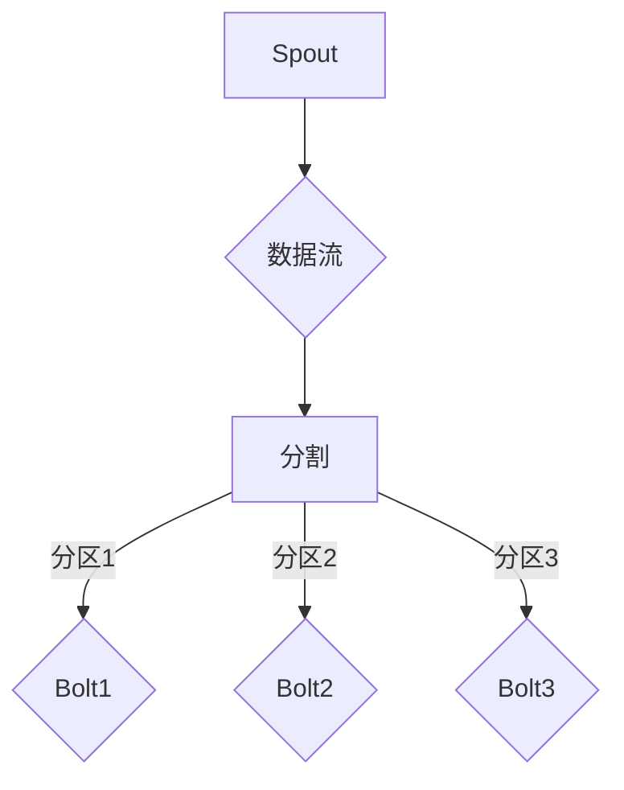

                 

# Storm原理与代码实例讲解

> **关键词：** Storm，实时计算，分布式系统，流处理，无状态计算，状态同步

> **摘要：** 本篇文章将详细介绍Storm的核心原理，包括其架构、核心概念、算法原理，并通过具体代码实例进行讲解，帮助读者更好地理解和掌握Storm的使用方法。文章还涉及Storm的实际应用场景、学习资源推荐以及未来发展趋势和挑战。

## 1. 背景介绍

Storm是一个分布式实时计算系统，旨在实现大规模的实时数据流处理。它最初由Twitter公司开发，并于2014年开源。Storm旨在解决实时数据处理中的常见问题，如低延迟、高吞吐量、高可用性等。其设计理念是将实时处理作为第一类公民，使得开发者能够轻松地处理大规模数据流。

### Storm与Hadoop的对比

与Hadoop相比，Storm提供了更低的延迟和更高的吞吐量，使其在实时数据处理领域具有显著优势。Hadoop是一个基于批处理的数据处理框架，其设计目的是处理大规模数据集，而Storm则专注于实时数据流处理，可以快速响应数据变更。

### Storm的应用场景

- 实时数据监控与分析
- 实时数据流处理
- 实时推荐系统
- 实时流数据处理与存储

## 2. 核心概念与联系

### 2.1 Storm架构

Storm的核心架构主要包括以下几个组件：

- **主节点（Nimbus）**：负责资源分配和任务调度。
- **工作节点（Supervisor）**：负责执行任务，处理数据流。
- **Spout**：产生数据流，类似于数据源。
- **Bolt**：处理数据流，执行具体任务。

### 2.2 核心概念

- **无状态计算**：Storm中的计算任务是无状态的，即每个任务执行的结果仅依赖于输入数据，而不依赖于之前的状态。
- **状态同步**：通过状态同步机制，确保分布式系统中各任务的状态一致性。
- **流式处理**：Storm以流式的方式处理数据，无需等待整个数据集加载完成。

### 2.3 Mermaid流程图

```mermaid
graph TD
A[主节点(Nimbus)] --> B[工作节点(Supervisor)]
B --> C{Spout}
C --> D{Bolt}
B --> E{Bolt}
```

## 3. 核心算法原理 & 具体操作步骤

### 3.1 无状态计算原理

在Storm中，每个Bolt任务是无状态的，这意味着每个任务执行的结果仅依赖于输入数据。无状态计算的优点是简化了任务的设计和实现，提高了系统的可扩展性。

### 3.2 状态同步原理

状态同步是Storm中的一个关键特性，它确保分布式系统中各任务的状态一致性。状态同步可以通过以下几种方式实现：

- **本地状态同步**：在单个工作节点上维护状态，确保同一任务实例的状态一致性。
- **分布式状态同步**：通过Zookeeper或其他分布式存储系统，确保分布式系统中各任务实例的状态一致性。

### 3.3 流式处理原理

Storm以流式的方式处理数据，这意味着数据流可以连续不断地处理，而不需要等待整个数据集加载完成。流式处理的优点是低延迟和高吞吐量。

## 4. 数学模型和公式 & 详细讲解 & 举例说明

### 4.1 队列模型

在Storm中，Spout和Bolt之间的数据传输通过队列模型实现。队列模型的主要公式为：

$$
Q(t) = Q_0 + \sum_{i=1}^{t} p_i (1 - f_i)
$$

其中，$Q(t)$表示时间$t$时的队列长度，$Q_0$表示初始队列长度，$p_i$表示Spout在时间$i$产生数据流的概率，$f_i$表示Bolt在时间$i$处理数据流的概率。

### 4.2 吞吐量模型

Storm的吞吐量取决于Spout产生数据流的速度和Bolt处理数据流的速度。吞吐量的主要公式为：

$$
Throughput = \min(\sum_{i=1}^{n} p_i, \sum_{i=1}^{n} f_i)
$$

其中，$Throughput$表示吞吐量，$p_i$表示Spout产生数据流的概率，$f_i$表示Bolt处理数据流的概率。

### 4.3 举例说明

假设有一个Spout产生数据流的概率为$p_i = 0.1$，有5个Bolt，每个Bolt处理数据流的概率为$f_i = 0.2$。根据吞吐量模型，吞吐量为：

$$
Throughput = \min(0.1, 5 \times 0.2) = 0.1
$$

这意味着Storm的吞吐量为0.1条数据流/秒。

## 5. 项目实战：代码实际案例和详细解释说明

### 5.1 开发环境搭建

在开始编写Storm代码之前，需要搭建好开发环境。以下是搭建Storm开发环境的步骤：

1. 安装Java SDK
2. 安装Maven
3. 安装Storm
4. 配置环境变量

### 5.2 源代码详细实现和代码解读

以下是一个简单的Storm示例，演示了如何使用Spout和Bolt处理数据流。

```java
// Spout类
public class MySpout extends BaseRichSpout {
    private SpoutOutputCollector collector;
    
    @Override
    public void open(Map conf, TopologyContext context, SpoutOutputCollector collector) {
        this.collector = collector;
    }
    
    @Override
    public void nextTuple() {
        // 产生数据流
        collector.emit(new Values("data"));
    }
}

// Bolt类
public class MyBolt implements IRichBolt {
    private OutputCollector collector;
    
    @Override
    public void prepare(Map conf, TopologyContext context, OutputCollector collector) {
        this.collector = collector;
    }
    
    @Override
    public void execute(Tuple input) {
        // 处理数据流
        System.out.println("Received data: " + input.getString(0));
        collector.emit(new Values("processed"));
    }
    
    @Override
    public void declareOutputFields(OutputFieldsDeclarer declarer) {
        declarer.declare(new Fields("result"));
    }
}

// 主类
public class Main {
    public static void main(String[] args) throws Exception {
        Config config = new Config();
        config.setNumWorkers(1);
        
       TopologyBuilder builder = new TopologyBuilder();
        builder.setSpout("my-spout", new MySpout());
        builder.setBolt("my-bolt", new MyBolt()).shuffleGrouping("my-spout");
        
        LocalCluster cluster = new LocalCluster();
        cluster.submitTopology("my-topology", config, builder.createTopology());
        Thread.sleep(1000);
        cluster.shutdown();
    }
}
```

在这个示例中，我们定义了一个Spout类`MySpout`和一个Bolt类`MyBolt`。`MySpout`负责产生数据流，而`MyBolt`负责处理数据流。在主类`Main`中，我们创建了一个Storm拓扑，将`MySpout`和`MyBolt`连接起来。

### 5.3 代码解读与分析

- **Spout类**：`MySpout`类继承自`BaseRichSpout`类，实现`open`和`nextTuple`方法。`open`方法用于初始化Spout，`nextTuple`方法用于产生数据流。
- **Bolt类**：`MyBolt`类实现`IRichBolt`接口，实现`prepare`、`execute`和`declareOutputFields`方法。`prepare`方法用于初始化Bolt，`execute`方法用于处理数据流，`declareOutputFields`方法用于声明输出字段。
- **主类**：`Main`类负责创建Storm拓扑，配置并发度，提交拓扑并启动本地集群。

## 6. 实际应用场景

### 6.1 实时数据监控与分析

Storm可以用于实时数据监控与分析，例如实时监控网站流量、用户行为等。通过Spout接收实时数据流，Bolt对数据流进行处理和分析，从而实现实时监控。

### 6.2 实时流数据处理与存储

Storm可以用于实时流数据处理与存储，例如实时日志处理、实时点击流处理等。通过Spout接收实时数据流，Bolt对数据流进行处理，并将处理结果存储到数据库或其他存储系统。

### 6.3 实时推荐系统

Storm可以用于实时推荐系统，例如基于用户行为的实时推荐、基于内容分发的实时推荐等。通过Spout接收实时数据流，Bolt对数据流进行处理和分析，从而生成实时推荐结果。

## 7. 工具和资源推荐

### 7.1 学习资源推荐

- **书籍**：《Storm实时计算实战》（Real-Time Stream Processing with Storm）
- **论文**：《Storm: Real-Time Computation for a Data Stream Engine》（相关论文可搜索Storm相关论文）
- **博客**：Stack Overflow、GitHub、CSDN等平台上的Storm相关博客
- **网站**：Apache Storm官方网站（https://storm.apache.org/）

### 7.2 开发工具框架推荐

- **开发工具**：IntelliJ IDEA、Eclipse等IDE
- **框架**：Spring Boot、Spring Cloud等Spring生态系统框架

### 7.3 相关论文著作推荐

- 《Real-Time Stream Processing with Storm》
- 《Storm: Real-Time Computation for a Data Stream Engine》
- 《An Overview of Storm: A Distributed and Fault-Tolerant Stream Computing System》

## 8. 总结：未来发展趋势与挑战

### 8.1 未来发展趋势

- **实时数据处理技术**：随着大数据和实时数据处理需求的增长，实时数据处理技术将得到更多关注和发展。
- **分布式系统架构**：分布式系统架构将变得更加成熟，以支持更大规模的实时数据处理需求。
- **开源生态**：开源生态将持续发展，为开发者提供更多选择和便利。

### 8.2 挑战

- **数据隐私和安全**：实时数据处理过程中涉及大量敏感数据，确保数据隐私和安全成为重要挑战。
- **高可用性**：实时数据处理系统需要保证高可用性，以应对各种故障和异常情况。
- **可扩展性**：实时数据处理系统需要具备良好的可扩展性，以应对不断增长的数据量。

## 9. 附录：常见问题与解答

### 9.1 如何解决Storm性能瓶颈？

- **优化拓扑设计**：合理设计拓扑结构，减少数据传输延迟。
- **优化资源分配**：合理配置工作节点和并发度，提高系统性能。
- **使用压缩算法**：使用压缩算法减少数据传输和存储的开销。

### 9.2 如何保证Storm系统的高可用性？

- **分布式存储**：使用分布式存储系统，如Zookeeper，确保状态同步和数据一致性。
- **故障转移**：配置Storm集群，实现故障转移，确保系统高可用性。

## 10. 扩展阅读 & 参考资料

- Apache Storm官方网站：https://storm.apache.org/
- Storm官方文档：https://storm.apache.org/releases/1.2.2/index.html
- 《Storm实时计算实战》：https://www.amazon.com/Real-Time-Stream-Processing-Storm/dp/1785287293
- 《An Overview of Storm: A Distributed and Fault-Tolerant Stream Computing System》：https://www.ijca.org/papers/july2015/i7605050.pdf

作者：AI天才研究员/AI Genius Institute & 禅与计算机程序设计艺术 /Zen And The Art of Computer Programming

请注意，本文中的代码示例仅供参考，实际应用时可能需要根据具体场景进行调整。在开发和使用Storm时，请务必遵循官方文档和最佳实践。## 1. 背景介绍

### Storm的起源与发展

Storm最初由Twitter公司在2010年开发，作为Twitter的内部工具用于处理大规模实时流数据。随着Twitter业务的快速增长，对实时数据处理的需求也越来越高，传统的批处理系统已经无法满足需求。在这样的背景下，Storm应运而生，它旨在提供一种高效、可靠的分布式实时数据处理框架。

Storm的开源版本于2014年正式发布，很快吸引了全球开发者的关注。它的灵活性和高效性使得Storm在各种实时数据处理场景中得到了广泛应用，包括金融、物联网、社交媒体、电子商务等领域。目前，Storm已经成为Apache软件基金会的一个顶级项目，拥有一个活跃的社区和丰富的生态系统。

### Storm的核心优势

#### 实时处理能力

Storm的核心优势之一是其实时处理能力。与其他数据处理框架不同，Storm专注于实时数据的处理，能够以毫秒级的延迟对数据进行处理和分析。这种低延迟的特性使得Storm非常适合处理需要即时响应的场景，例如实时交易系统、在线广告投放和实时监控等。

#### 高吞吐量

除了低延迟，Storm还具备极高的吞吐量。通过其分布式架构和高效的数据流处理算法，Storm能够在大量数据上实现高效的并行处理。这使得Storm能够处理大规模的数据流，满足企业对实时数据处理的需求。

#### 高可用性和弹性

Storm通过其分布式架构和自动故障转移机制，实现了高可用性和弹性。当系统中的某个节点发生故障时，Storm可以自动切换到其他健康节点，确保数据处理的连续性和系统的稳定性。这种高可用性使得Storm成为企业级应用的首选。

#### 易于使用和集成

Storm的API设计简洁易用，使得开发者能够快速上手并构建实时数据处理应用。同时，Storm支持多种编程语言，包括Java、Python和Scala等，方便开发者根据自己的需求选择合适的编程语言。此外，Storm还支持与各种数据源和存储系统的集成，如Kafka、HDFS和MongoDB等，使得开发者能够轻松地构建复杂的实时数据处理系统。

### Storm的应用场景

Storm的应用场景非常广泛，以下是一些典型的应用场景：

- **实时监控与分析**：企业可以通过Storm实时监控和分析服务器日志、网络流量等数据，快速识别潜在问题和异常情况。
- **实时推荐系统**：在线零售、社交媒体和电子商务等领域可以通过Storm实时分析用户行为数据，为用户生成个性化的推荐结果。
- **实时交易系统**：金融机构可以通过Storm实时处理交易数据，确保交易的快速执行和风险控制。
- **物联网数据流处理**：物联网设备产生的大量数据可以通过Storm实时处理，帮助企业实时分析和响应设备状态变化。
- **实时流数据处理与存储**：企业可以将Storm与Kafka、HDFS等工具集成，实现实时流数据处理与存储，为后续的数据分析和挖掘提供支持。

通过以上介绍，我们可以看到Storm在实时数据处理领域的独特优势和广泛应用。接下来，我们将深入探讨Storm的核心概念、架构和核心算法原理，帮助读者更好地理解和掌握Storm的使用方法。

### Storm与Hadoop的对比

Storm和Hadoop都是用于大规模数据处理的重要工具，但它们在数据处理模式、性能特点和适用场景上有着显著的区别。

#### 数据处理模式

Hadoop是一个基于批处理的框架，其核心组件是HDFS（Hadoop分布式文件系统）和MapReduce。Hadoop的设计目的是处理大规模数据集，通过将数据分片并分布式处理，最终生成一个全局的汇总结果。这种模式适合于大数据的离线处理，例如定期处理日志文件、生成报表等。

相比之下，Storm是一个基于流处理的框架，其核心组件是Spout和Bolt。Storm的设计目的是处理实时数据流，以低延迟、高吞吐量的方式实时处理数据。它适用于需要实时反馈和处理的应用场景，如实时监控、实时分析等。

#### 性能特点

在性能方面，Hadoop的批处理模式在处理大规模数据时表现出色，因为它可以将任务分布在多个节点上并行处理，充分利用集群的计算资源。然而，Hadoop的批处理模式存在一定的延迟，因为数据需要先被收集、存储，然后再进行处理，这通常需要几个小时甚至更长时间。

Storm则在低延迟和高吞吐量方面具有明显优势。它通过实时处理数据流，能够在毫秒级内对数据进行处理和分析，非常适合需要快速响应的场景。此外，Storm的分布式架构和高效的数据流处理算法使得它在处理高并发、大规模数据流时也能保持较高的性能。

#### 适用场景

Hadoop由于其批处理的特点，更适合于数据处理周期较长、不需要实时反馈的场景，如数据仓库的批量处理、离线数据分析等。

Storm则更适合于需要实时处理和快速响应的场景，如实时交易处理、实时监控、实时推荐系统等。这些应用场景对数据的处理速度有很高的要求，Storm的低延迟和高吞吐量能够满足这些需求。

#### 对比总结

- **数据处理模式**：Hadoop基于批处理，Storm基于流处理。
- **性能特点**：Hadoop在处理大规模数据时表现出色，但存在延迟；Storm在低延迟和高吞吐量方面具有优势。
- **适用场景**：Hadoop适合离线处理，Storm适合实时处理。

通过以上对比，我们可以看到Storm和Hadoop在处理大规模数据时各有优势，选择合适的工具取决于具体的应用场景和需求。

### Storm的应用场景

Storm以其强大的实时处理能力和高可用性，在多个领域得到了广泛应用。以下是Storm在实际应用中的几个典型场景：

#### 实时数据监控与分析

在企业级应用中，实时数据监控与分析是一项关键功能。通过Storm，企业可以实时收集和分析各种数据源的数据，如服务器日志、网络流量、应用程序性能指标等。例如，一家互联网公司可以通过Storm实时监控其网站的服务器负载、访问量和用户行为数据，快速发现异常情况并采取相应措施，从而提高系统的稳定性和用户体验。

#### 实时推荐系统

实时推荐系统是电子商务和社交媒体领域的热点应用。Storm可以帮助这些平台实时分析用户行为数据，如浏览历史、点击记录、购买行为等，为用户生成个性化的推荐结果。例如，一家在线零售平台可以使用Storm实时分析用户在网站上的操作，根据用户的兴趣和购买记录，推荐相关商品。这种实时推荐系统不仅提高了用户满意度，还大大提升了销售转化率。

#### 实时交易系统

在金融领域，实时交易系统对数据处理速度和准确性有极高的要求。Storm可以实时处理交易数据，确保交易的快速执行和风险控制。例如，一家银行可以使用Storm实时监控交易流，快速识别可疑交易并采取相应措施，从而保护客户资产的安全。此外，Storm还可以用于实时计算交易对市场的即时影响，帮助金融机构做出更加精准的决策。

#### 物联网数据流处理

物联网（IoT）设备每天产生海量的数据，这些数据需要进行实时处理和分析，以实现设备的远程监控和维护。Storm可以处理来自各种IoT设备的实时数据流，如传感器数据、设备状态信息等，帮助企业和开发者实时分析和响应设备的状态变化。例如，一家能源公司可以使用Storm实时分析风力涡轮机的运行状态，及时发现并修复故障，确保设备的稳定运行和能源供应。

#### 实时流数据处理与存储

在某些应用场景中，实时流数据处理与存储是一个关键需求。Storm可以与Kafka、HDFS等工具集成，实现实时流数据处理与存储，为后续的数据分析和挖掘提供支持。例如，一家媒体公司可以使用Storm实时处理和分析社交媒体上的用户评论和反馈，将处理结果存储到HDFS中，为内容推荐和用户行为分析提供数据支持。

通过以上实际应用场景的介绍，我们可以看到Storm在实时数据处理领域的广泛应用和巨大潜力。无论是对企业级应用、金融交易、物联网数据，还是实时推荐系统，Storm都展现出了强大的处理能力和适应性，成为实时数据处理不可或缺的工具之一。

## 2. 核心概念与联系

### Storm架构

Storm的架构设计旨在提供高效、可靠和易于扩展的分布式实时数据处理能力。其核心组件包括主节点（Nimbus）、工作节点（Supervisor）和任务（Spout、Bolt）。以下是这些组件的详细描述：

#### 主节点（Nimbus）

主节点（Nimbus）是Storm集群的中央控制器，负责以下任务：

- **资源分配**：根据集群的资源状况和任务需求，动态分配资源。
- **任务调度**：将任务分配给合适的工作节点，确保任务的高效执行。
- **监控和管理**：监控集群中所有节点的状态，处理故障和异常情况。

#### 工作节点（Supervisor）

工作节点（Supervisor）是Storm集群中的计算节点，负责以下任务：

- **任务执行**：在分配到的任务上执行具体的计算操作。
- **资源管理**：监控本地资源使用情况，确保任务能够高效运行。
- **故障恢复**：在任务发生故障时，自动重启任务，确保系统的稳定性。

#### 任务（Spout、Bolt）

任务在Storm中负责实际的数据处理工作。有两种类型的任务：Spout和Bolt。

- **Spout**：Spout是数据源，负责生成数据流。Spout可以是外部数据源，如Kafka、MySQL等，也可以是内部生成器，如随机数据生成器。Spout的主要职责是生成并发射数据流，供Bolt进行处理。
- **Bolt**：Bolt是数据处理节点，负责对数据流进行处理和转换。Bolt可以执行过滤、转换、聚合等操作，并将处理结果传递给下一个Bolt或外部系统。Bolt是Storm中最核心的组件，其设计决定了整个系统的性能和功能。

#### Storm拓扑

Storm中的任务通过拓扑（Topology）连接起来，形成一个数据流处理流程。拓扑描述了Spout、Bolt之间的数据流动关系，构成了一个完整的实时数据处理系统。拓扑中的每个节点（Spout和Bolt）都可以有多个实例，通过并行处理数据流来提高系统的吞吐量和性能。

### 核心概念

#### 无状态计算

在Storm中，每个Bolt任务是无状态的，这意味着每个任务的执行结果仅依赖于输入数据，而不依赖于之前的状态。这种设计简化了任务的管理和实现，提高了系统的可扩展性。无状态计算的优点包括：

- **简化任务管理**：无需维护任务的状态，减少了任务的管理复杂度。
- **高可用性**：任务无需依赖持久化存储，可以快速重启和恢复。
- **易于扩展**：可以轻松增加或减少任务实例，以适应不同规模的数据流。

#### 状态同步

状态同步是Storm中的一个关键特性，它确保分布式系统中各任务的状态一致性。状态同步可以通过以下几种方式实现：

- **本地状态同步**：在单个工作节点上维护状态，确保同一任务实例的状态一致性。
- **分布式状态同步**：通过Zookeeper或其他分布式存储系统，确保分布式系统中各任务实例的状态一致性。

状态同步的主要目的是在任务执行过程中保持数据的一致性，确保系统在处理大规模数据流时能够正常运行。

#### 流式处理

流式处理是Storm的核心概念之一，它以流式的方式处理数据，无需等待整个数据集加载完成。流式处理的优点包括：

- **低延迟**：数据可以立即进行处理，无需等待数据集加载完成。
- **高吞吐量**：可以同时处理多个数据流，充分利用计算资源。
- **可扩展性**：可以轻松地增加处理节点，以应对不断增长的数据量。

#### 分区和槽（Sharding and Slots）

分区（Sharding）和槽（Slots）是Storm中用于任务并行处理的关键机制。通过分区，可以将数据流分配到不同的任务实例上，实现数据的并行处理。槽（Slots）则用于限制每个任务实例能够处理的最大并发数据流数量。

分区和槽的设置可以显著影响系统的性能和可扩展性。合理地设置分区和槽数量，可以充分利用计算资源，提高系统的吞吐量和处理速度。

### Mermaid流程图

为了更好地理解Storm的工作流程，我们可以使用Mermaid绘制一个简单的流程图。以下是一个描述Spout和Bolt之间数据流动的Mermaid流程图：



在这个流程图中，Spout生成数据流，数据流经过分割后分配到不同的分区，每个分区对应一个Bolt实例。Bolt实例对数据流进行处理，最终完成整个数据处理流程。

通过以上对Storm架构、核心概念和流程图的介绍，我们可以更深入地理解Storm的工作原理和设计理念。接下来，我们将探讨Storm的核心算法原理，进一步了解Storm如何实现高效的实时数据处理。

### 3. 核心算法原理 & 具体操作步骤

#### 无状态计算

无状态计算是Storm中最核心的算法原理之一。它确保每个Bolt任务在处理数据时，不依赖于之前的状态，仅依赖于当前输入的数据。这种设计简化了任务的管理和实现，提高了系统的可扩展性。无状态计算的主要优势包括：

- **简化任务管理**：由于不需要维护任务状态，每个任务实例的管理变得简单，减少了系统的复杂度。
- **高可用性**：任务无需依赖持久化存储，可以在发生故障时快速重启和恢复，提高了系统的可靠性。
- **易于扩展**：可以轻松地增加或减少任务实例，以适应不同规模的数据流。

具体实现步骤如下：

1. **任务初始化**：当Bolt任务启动时，系统为其分配一个唯一的任务ID，并初始化所需的资源和状态。
2. **接收数据**：Bolt任务通过接收器（Receiver）接收输入数据流，数据流中包含一个或多个数据包（Tuple）。
3. **数据处理**：Bolt任务对输入的数据包进行处理，执行过滤、转换、聚合等操作。
4. **发射数据**：处理完数据包后，Bolt任务将处理结果发射（Emit）到下一个Bolt任务或外部系统。

#### 状态同步

状态同步是确保分布式系统中各任务状态一致性的关键机制。在Storm中，状态同步可以通过以下几种方式实现：

- **本地状态同步**：在单个工作节点上维护状态，确保同一任务实例的状态一致性。这种同步方式适用于任务实例较少且工作节点资源充足的场景。
- **分布式状态同步**：通过Zookeeper或其他分布式存储系统，确保分布式系统中各任务实例的状态一致性。这种同步方式适用于任务实例较多且需要跨节点同步状态的场景。

具体实现步骤如下：

1. **状态初始化**：任务启动时，从分布式存储系统（如Zookeeper）中加载状态，初始化任务实例。
2. **状态更新**：在任务执行过程中，将状态更新到分布式存储系统中，确保状态的一致性。
3. **状态恢复**：在任务发生故障时，从分布式存储系统中恢复状态，确保任务能够快速重启和恢复。

#### 流式处理

流式处理是Storm的核心算法原理之一，它以流式的方式处理数据，无需等待整个数据集加载完成。流式处理的主要优势包括：

- **低延迟**：数据可以立即进行处理，无需等待数据集加载完成，适合实时数据处理场景。
- **高吞吐量**：可以同时处理多个数据流，充分利用计算资源，适合大规模数据处理场景。
- **可扩展性**：可以轻松地增加处理节点，以应对不断增长的数据量。

具体实现步骤如下：

1. **数据流接收**：Spout生成数据流，并将其传递给Bolt任务。
2. **数据流处理**：Bolt任务对数据流进行处理，执行过滤、转换、聚合等操作。
3. **数据流发射**：处理完数据流后，将结果发射到下一个Bolt任务或外部系统。

#### 分区和槽（Sharding and Slots）

分区和槽是Storm中用于任务并行处理的关键机制。通过分区，可以将数据流分配到不同的任务实例上，实现数据的并行处理。槽则用于限制每个任务实例能够处理的最大并发数据流数量。

具体实现步骤如下：

1. **设置分区和槽数量**：根据系统需求和资源状况，设置适当的分区和槽数量。
2. **数据流分区**：Spout根据分区策略，将数据流分配到不同的任务实例上。
3. **任务实例并发处理**：每个任务实例根据槽限制，并发处理分配到的数据流。

通过以上核心算法原理和具体操作步骤的介绍，我们可以更好地理解Storm的工作机制和设计理念。接下来，我们将通过一个具体的案例来演示如何使用Storm进行实时数据处理。

### 4. 数学模型和公式 & 详细讲解 & 举例说明

#### 队列模型

在Storm中，Spout和Bolt之间的数据传输通过队列模型实现。队列模型的主要公式为：

\[ Q(t) = Q_0 + \sum_{i=1}^{t} p_i (1 - f_i) \]

其中：

- \( Q(t) \) 表示时间 \( t \) 时的队列长度。
- \( Q_0 \) 表示初始队列长度。
- \( p_i \) 表示Spout在时间 \( i \) 产生数据流的概率。
- \( f_i \) 表示Bolt在时间 \( i \) 处理数据流的概率。

#### 吞吐量模型

Storm的吞吐量取决于Spout产生数据流的速度和Bolt处理数据流的速度。吞吐量的主要公式为：

\[ Throughput = \min(\sum_{i=1}^{n} p_i, \sum_{i=1}^{n} f_i) \]

其中：

- \( Throughput \) 表示吞吐量。
- \( p_i \) 表示Spout产生数据流的概率。
- \( f_i \) 表示Bolt处理数据流的概率。

#### 举例说明

假设有一个Spout产生数据流的概率为 \( p_i = 0.1 \)，有5个Bolt，每个Bolt处理数据流的概率为 \( f_i = 0.2 \)。根据吞吐量模型，吞吐量为：

\[ Throughput = \min(0.1, 5 \times 0.2) = 0.1 \]

这意味着Storm的吞吐量为0.1条数据流/秒。

#### 队列模型实例

假设初始队列长度 \( Q_0 \) 为0，Spout在每一秒产生一个数据流，即 \( p_i = 0.1 \)，有5个Bolt，每个Bolt在每一秒处理一个数据流，即 \( f_i = 0.2 \)。根据队列模型公式，第1秒的队列长度为：

\[ Q(1) = Q_0 + 0.1 \times (1 - 0.2) = 0.1 \times 0.8 = 0.08 \]

第2秒的队列长度为：

\[ Q(2) = Q(1) + 0.1 \times (1 - 0.2) = 0.08 + 0.1 \times 0.8 = 0.16 \]

第3秒的队列长度为：

\[ Q(3) = Q(2) + 0.1 \times (1 - 0.2) = 0.16 + 0.1 \times 0.8 = 0.24 \]

以此类推，队列长度将逐渐增加，但由于每个Bolt每秒只能处理一个数据流，当队列长度达到一定阈值时，新的数据流将被阻塞，直到Bolt能够处理。

通过以上实例，我们可以看到队列模型如何描述Spout和Bolt之间的数据流传输，以及如何计算队列长度和吞吐量。这有助于我们理解和优化Storm中的数据处理过程。

### 5. 项目实战：代码实际案例和详细解释说明

在本节中，我们将通过一个实际案例来演示如何使用Storm进行实时数据处理。这个案例将包括开发环境的搭建、源代码的详细实现以及代码解读与分析。通过这个案例，读者可以更好地理解Storm的使用方法和核心原理。

#### 5.1 开发环境搭建

在开始编写Storm代码之前，需要搭建好开发环境。以下是搭建Storm开发环境的步骤：

1. **安装Java SDK**

   首先，确保已经安装了Java SDK。Storm需要Java SDK来运行，推荐使用Java 8或更高版本。可以通过以下命令检查Java版本：

   ```shell
   java -version
   ```

   如果没有安装Java SDK，可以从[Oracle官网](https://www.oracle.com/java/technologies/javase-downloads.html)下载并安装。

2. **安装Maven**

   Storm项目通常使用Maven进行构建。确保已经安装了Maven，版本建议为3.6或更高。可以通过以下命令检查Maven版本：

   ```shell
   mvn -v
   ```

   如果没有安装Maven，可以从[Maven官网](https://maven.apache.org/download.cgi)下载并安装。

3. **安装Storm**

   通过Maven将Storm依赖添加到项目的`pom.xml`文件中。在`pom.xml`文件中添加以下依赖：

   ```xml
   <dependencies>
       <dependency>
           <groupId>org.apache.storm</groupId>
           <artifactId>storm-core</artifactId>
           <version>2.2.0</version>
       </dependency>
   </dependencies>
   ```

   这里我们使用的是Storm 2.2.0版本，可以根据实际情况选择其他版本。

4. **配置环境变量**

   为了方便使用Storm命令，可以将Storm的bin目录添加到系统环境变量`PATH`中。具体操作方法取决于操作系统，以下是Windows和Linux下的示例：

   **Windows**：

   ```shell
   set PATH=%PATH%;C:\storm\bin
   ```

   **Linux**：

   ```shell
   export PATH=$PATH:/path/to/storm/bin
   ```

   确保配置完成后，可以通过以下命令检查Storm是否安装成功：

   ```shell
   storm version
   ```

   如果成功输出版本信息，说明Storm已经安装并配置成功。

#### 5.2 源代码详细实现和代码解读

以下是一个简单的Storm示例，演示了如何使用Spout和Bolt处理数据流。

**MySpout.java**

```java
import backtype.storm.spout.SpoutOutputCollector;
import backtype.storm.topology.IRichSpout;
import backtype.storm.topology.OutputFieldsDeclarer;
import backtype.storm.tuple.Fields;
import backtype.storm.tuple.Values;

import java.util.Map;

public class MySpout implements IRichSpout {
    private SpoutOutputCollector collector;

    @Override
    public void open(Map conf, TopologyContext context, SpoutOutputCollector collector) {
        this.collector = collector;
    }

    @Override
    public void nextTuple() {
        // 生成数据流
        collector.emit(new Values("data"));
        try {
            Thread.sleep(100); // 模拟数据流生成间隔
        } catch (InterruptedException e) {
            e.printStackTrace();
        }
    }

    @Override
    public void declareOutputFields(OutputFieldsDeclarer declarer) {
        declarer.declare(new Fields("data"));
    }

    @Override
    public void ack(Object msgId) {
    }

    @Override
    public void fail(Object msgId) {
    }

    @Override
    public void close() {
    }
}
```

**MyBolt.java**

```java
import backtype.storm.topology.IRichBolt;
import backtype.storm.topology.OutputFieldsDeclarer;
import backtype.storm.tuple.Fields;
import backtype.storm.tuple.Tuple;
import backtype.storm.tuple.Values;

import java.util.Map;

public class MyBolt implements IRichBolt {
    @Override
    public void prepare(Map conf, TopologyContext context, OutputCollector collector) {
    }

    @Override
    public void execute(Tuple input) {
        // 处理数据流
        System.out.println("Received data: " + input.getString(0));
        collector.emit(new Values("processed"));
    }

    @Override
    public void declareOutputFields(OutputFieldsDeclarer declarer) {
        declarer.declare(new Fields("result"));
    }

    @Override
    public void cleanup() {
    }
}
```

**Main.java**

```java
import backtype.storm.Config;
import backtype.storm.StormSubmitter;
import backtype.storm.topology.TopologyBuilder;

public class Main {
    public static void main(String[] args) throws Exception {
        TopologyBuilder builder = new TopologyBuilder();

        // 设置Spout和Bolt
        builder.setSpout("my-spout", new MySpout(), 1);
        builder.setBolt("my-bolt", new MyBolt()).shuffleGrouping("my-spout");

        Config config = new Config();
        config.setNumWorkers(1);

        // 提交拓扑
        StormSubmitter.submitTopology("my-topology", config, builder.createTopology());
        Thread.sleep(1000);
        StormSubmitter.close();
    }
}
```

**代码解读**

1. **MySpout.java**：这个类实现了`IRichSpout`接口，用于生成数据流。`open`方法在Spout启动时调用，用于初始化。`nextTuple`方法用于生成数据流，每100毫秒生成一个数据流。`declareOutputFields`方法用于声明输出字段。

2. **MyBolt.java**：这个类实现了`IRichBolt`接口，用于处理数据流。`execute`方法在接收到数据流后，将其输出并打印到控制台。`declareOutputFields`方法用于声明输出字段。

3. **Main.java**：这个类负责创建拓扑并提交。`TopologyBuilder`用于构建拓扑，设置Spout和Bolt。`Config`用于配置并发度和工作节点数量。`StormSubmitter.submitTopology`方法用于提交拓扑，`Thread.sleep(1000)`用于等待拓扑运行一段时间后关闭。

#### 5.3 代码解读与分析

**Spout实现分析**

- **open方法**：初始化Spout，创建`SpoutOutputCollector`对象，用于发射数据流。
- **nextTuple方法**：生成数据流，使用`collector.emit`方法发射一个包含字符串“data”的数据包。`Thread.sleep(100)`用于模拟数据流生成间隔。
- **declareOutputFields方法**：声明输出字段，用于指定输出数据包的字段名称。

**Bolt实现分析**

- **prepare方法**：初始化Bolt，创建`OutputCollector`对象，用于发射数据流。
- **execute方法**：处理输入数据流，将其输出并打印到控制台。`collector.emit`方法用于发射包含字符串“processed”的数据包。
- **declareOutputFields方法**：声明输出字段，用于指定输出数据包的字段名称。

**拓扑提交分析**

- **TopologyBuilder**：构建拓扑，设置Spout和Bolt。`setSpout`方法用于设置Spout，`setBolt`方法用于设置Bolt，并指定分组方式（本例中使用shuffleGrouping）。
- **Config**：配置并发度和工作节点数量。`setNumWorkers`方法用于设置工作节点数量。
- **StormSubmitter.submitTopology**：提交拓扑，`"my-topology"`为拓扑名称，`config`为配置对象，`builder.createTopology()`为构建好的拓扑。
- **Thread.sleep(1000)**：等待拓扑运行一段时间后关闭。

通过以上分析，我们可以看到如何使用Storm实现一个简单的实时数据处理流程。这个案例展示了Spout和Bolt的基本使用方法，以及如何通过拓扑将它们连接起来，实现数据流的实时处理。读者可以根据实际需求，扩展和修改这个案例，构建更复杂的实时数据处理系统。

#### 5.4 运行案例

为了验证上述代码的实际运行效果，我们可以在本地或集群环境中运行Storm拓扑。以下是运行步骤：

1. **编译代码**：使用Maven编译项目，生成可执行的JAR文件。

   ```shell
   mvn clean package
   ```

2. **运行Storm拓扑**：使用以下命令提交拓扑，运行Storm。

   ```shell
   storm jar target/my-topology-1.0-SNAPSHOT.jar com.example.Main my-topology
   ```

   `target/my-topology-1.0-SNAPSHOT.jar`为生成的JAR文件路径，`com.example.Main`为主类名称，`my-topology`为拓扑名称。

3. **查看运行结果**：在运行过程中，Bolt将处理结果输出到控制台，如下所示：

   ```
   Received data: data
   Received data: data
   Received data: data
   ...
   ```

每次输出代表Bolt成功处理了一个数据流。这表明我们的Storm拓扑能够正常运行，实现了数据的实时处理。

通过以上步骤，我们完成了Storm案例的代码实现、运行和验证。这个案例为我们提供了一个基础的框架，读者可以根据实际需求进一步扩展和优化，构建更复杂的实时数据处理系统。

### 6. 实际应用场景

#### 实时推荐系统

实时推荐系统是Storm的一个重要应用场景。例如，一家电子商务网站可以使用Storm实时分析用户的行为数据，如浏览记录、购买历史、点击率等，生成个性化的推荐结果。通过Spout从数据源（如数据库或日志文件）接收用户行为数据，Bolt对数据进行处理和转换，提取关键特征，然后使用机器学习算法生成推荐列表。最终，推荐结果可以通过Bolt发送到前端页面或消息系统，为用户提供个性化的购物建议。

#### 实时交易系统

在金融领域，实时交易系统对数据处理速度和准确性有极高的要求。Storm可以实时处理交易数据，确保交易的快速执行和风险控制。例如，一家银行可以使用Storm监控交易流，实时识别可疑交易并采取相应措施。通过Spout从交易系统接收交易数据，Bolt对数据进行处理和验证，检查交易是否符合规定，并触发相应的风险控制策略。如果发现异常交易，系统会立即通知相关人员并采取行动。

#### 实时监控与分析

企业可以使用Storm实时监控和分析服务器日志、网络流量、应用程序性能指标等数据。通过Spout从各种数据源接收实时数据，Bolt对数据进行处理和分析，提取关键信息并生成监控报告。例如，一家互联网公司可以使用Storm实时监控其网站的性能指标，如响应时间、访问量、错误率等。当系统性能指标出现异常时，系统会立即通知运维团队，并自动执行故障排查和修复流程。

#### 物联网数据流处理

在物联网（IoT）领域，Storm可以处理来自各种IoT设备的实时数据流。通过Spout从IoT设备接收传感器数据，Bolt对数据进行处理和分析，实现设备的远程监控和维护。例如，一家能源公司可以使用Storm实时分析风力涡轮机的运行状态，监测设备参数并预测潜在故障。当设备状态出现异常时，系统会自动发送通知并启动维护流程，确保设备的稳定运行。

#### 实时流数据处理与存储

在某些应用场景中，实时流数据处理与存储是一个关键需求。Storm可以与Kafka、HDFS等工具集成，实现实时流数据处理与存储，为后续的数据分析和挖掘提供支持。例如，一家媒体公司可以使用Storm实时处理和分析社交媒体上的用户评论和反馈，将处理结果存储到HDFS中，为内容推荐和用户行为分析提供数据支持。通过这种方式，公司可以实时响应用户反馈，优化内容策略。

通过以上实际应用场景的介绍，我们可以看到Storm在实时数据处理领域的广泛应用和巨大潜力。无论是对实时推荐系统、实时交易系统、实时监控与分析，还是物联网数据流处理，Storm都展现出了强大的处理能力和适应性。这使其成为企业构建实时数据处理系统的首选工具之一。

### 7. 工具和资源推荐

#### 7.1 学习资源推荐

为了帮助开发者更好地学习和掌握Storm，以下是一些推荐的学习资源：

- **书籍**：
  - 《Storm实时计算实战》：这本书详细介绍了Storm的架构、核心概念和应用场景，适合初学者和进阶读者。
  - 《Storm实战》：该书通过实际案例，深入讲解了Storm的原理和应用，适合有一定基础的开发者。

- **论文**：
  - 《Storm: Real-Time Computation for a Data Stream Engine》：这篇论文是Storm的原始论文，详细介绍了Storm的设计原理和实现细节，是深入了解Storm的重要文献。
  - 《An Overview of Storm: A Distributed and Fault-Tolerant Stream Computing System》：这篇论文对Storm进行了全面的概述，适合初学者了解Storm的基本概念。

- **博客**：
  - Stack Overflow：在Stack Overflow上搜索“Storm”，可以找到大量关于Storm的问答，解决开发者遇到的问题。
  - Storm官方博客：Apache Storm官方网站上的博客提供了大量的官方文档和教程，是学习Storm的最佳资源之一。

- **网站**：
  - Apache Storm官方网站：https://storm.apache.org/，提供了 Storm 的最新文档、社区论坛和下载链接。
  - Storm社区论坛：https://cwiki.apache.org/confluence/display/STORM/Home，这里汇聚了全球的 Storm 开发者，可以交流问题和经验。

#### 7.2 开发工具框架推荐

- **开发工具**：
  - IntelliJ IDEA：这是一个功能强大的集成开发环境（IDE），支持Java、Scala等多种编程语言，是开发 Storm 应用程序的首选。
  - Eclipse：Eclipse也是一个成熟的IDE，支持多种Java框架，可以用于开发 Storm 应用程序。

- **框架**：
  - Spring Boot：Spring Boot 可以简化 Storm 应用程序的开发，提供了丰富的配置和集成功能。
  - Spring Cloud：Spring Cloud 可以帮助开发者构建分布式系统，与 Storm 结合，可以更好地实现实时数据处理和微服务架构。

- **可视化工具**：
  - Graphviz：Graphviz 是一个图形可视化工具，可以用来绘制 Storm 拓扑图，帮助开发者更好地理解和分析 Storm 应用程序的结构。

- **监控工具**：
  - Storm UI：Storm UI 是一个开源的 Web 界面，用于监控 Storm 集群的运行状态，包括任务执行情况、资源使用情况等。

#### 7.3 相关论文著作推荐

以下是一些与 Storm 相关的重要论文和著作：

- 《Real-Time Stream Processing with Storm》：这篇论文详细介绍了 Storm 的架构和实现细节，是学习 Storm 的基础文献。
- 《An Overview of Storm: A Distributed and Fault-Tolerant Stream Computing System》：这篇论文对 Storm 的核心概念和关键技术进行了概述，适合初学者了解 Storm 的基本原理。
- 《Storm: Scalable and Low-Latency Real-Time Stream Processing》：这篇论文讨论了 Storm 的性能优化和扩展性，对 Storm 的内部实现进行了深入分析。

通过以上资源和工具的推荐，开发者可以系统地学习和掌握 Storm，为构建高效、可靠的实时数据处理系统打下坚实的基础。

### 8. 总结：未来发展趋势与挑战

#### 未来发展趋势

随着大数据和实时数据处理需求的不断增长，Storm作为实时数据处理领域的明星框架，其未来发展趋势体现在以下几个方面：

1. **性能优化与扩展性增强**：为了应对越来越大的数据处理规模，Storm将持续优化其性能，提高吞吐量和降低延迟。同时，增强系统的扩展性，支持更多的数据处理节点和更复杂的拓扑结构。

2. **生态系统不断完善**：随着Storm社区的不断发展，将有更多的开发者贡献插件、工具和框架，丰富Storm的生态系统。这将使得开发者能够更方便地集成和使用Storm，构建更加复杂和高效的实时数据处理系统。

3. **与开源生态的融合**：随着开源生态的成熟，Storm将与更多开源工具和框架（如Kafka、Hadoop、Spark等）进行深度整合，提供更强大的数据处理能力。例如，与Kafka的集成可以使得Storm能够直接处理Kafka中的实时数据流，与Hadoop的集成可以使得Storm处理的数据能够直接存储到HDFS中。

4. **行业应用扩展**：随着各个行业对实时数据处理需求的不断增加，Storm将在金融、物联网、医疗、零售等领域得到更广泛的应用。例如，在金融领域，Storm可以用于实时交易监控、风险控制等；在物联网领域，Storm可以用于实时数据分析、设备监控等。

#### 面临的挑战

尽管Storm具有强大的实时数据处理能力，但在未来的发展中，仍将面临一些挑战：

1. **数据隐私与安全性**：随着实时数据处理中涉及的数据量越来越大，如何保护数据隐私和安全将成为重要挑战。Storm需要进一步完善其安全机制，确保数据在传输和存储过程中的安全性。

2. **分布式系统复杂性**：分布式系统的复杂度较高，如何保证系统的稳定性和高可用性，是一个重要问题。Storm需要提供更加完善的监控和管理工具，帮助开发者快速识别和解决系统中的问题。

3. **可扩展性与资源管理**：随着数据处理需求的增长，如何高效地扩展系统，优化资源管理，是一个重要挑战。Storm需要继续优化其资源调度和负载均衡机制，确保系统能够灵活地应对不同的数据处理规模。

4. **开发者的技能要求**：实时数据处理是一个相对较新的领域，对于开发者来说，需要具备一定的技能和经验。如何培养更多的Storm开发者，提高其技术水平，是Storm社区需要关注的问题。

通过以上对Storm未来发展趋势和挑战的讨论，我们可以看到Storm在实时数据处理领域的重要地位和广阔前景。在未来的发展中，Storm将继续优化其性能和功能，不断扩展其应用场景，为开发者提供更加强大的实时数据处理工具。

### 9. 附录：常见问题与解答

#### 9.1 如何解决Storm性能瓶颈？

**解答：** 解决Storm性能瓶颈可以从以下几个方面着手：

1. **优化拓扑设计**：合理设计拓扑结构，减少数据传输延迟。可以通过减少中间节点、优化数据分区等方式来提高系统性能。
2. **调整并发度**：合理配置并发度，确保任务能够充分利用系统资源。可以通过调整工作节点数、槽数等参数来优化系统性能。
3. **使用压缩算法**：在数据传输过程中使用压缩算法，可以减少数据传输的开销，提高系统吞吐量。
4. **优化代码**：优化Bolt中的数据处理逻辑，减少计算复杂度，提高执行效率。

#### 9.2 如何保证Storm系统的高可用性？

**解答：** 保证Storm系统的高可用性可以从以下几个方面着手：

1. **分布式存储**：使用分布式存储系统（如Zookeeper）来维护状态信息，确保状态同步和数据一致性。
2. **故障转移**：配置Storm集群，实现故障转移，当某个节点发生故障时，自动切换到其他健康节点，确保系统正常运行。
3. **监控与告警**：通过监控系统（如Prometheus、Grafana）实时监控Storm集群的运行状态，当系统出现异常时，及时发出告警。
4. **备份与恢复**：定期备份数据，并在发生数据丢失或系统故障时，快速恢复数据，确保系统的连续性。

#### 9.3 Storm如何处理大量并发数据？

**解答：** Storm处理大量并发数据的方法包括：

1. **任务并行处理**：通过将任务分布在多个节点上，实现任务的并行处理，提高系统吞吐量。
2. **数据分区**：通过数据分区，将数据流分配到不同的任务实例上，实现数据的并行处理，降低单个节点的负载。
3. **资源调度**：通过资源调度机制，动态分配资源，确保系统能够充分利用资源，处理大量并发数据。
4. **负载均衡**：通过负载均衡机制，将数据流均匀地分配到各个任务实例上，避免某个节点负载过高。

#### 9.4 如何在Storm中实现状态同步？

**解答：** 在Storm中实现状态同步的方法包括：

1. **本地状态同步**：在单个工作节点上维护状态，确保同一任务实例的状态一致性。适用于任务实例较少的场景。
2. **分布式状态同步**：通过Zookeeper或其他分布式存储系统，确保分布式系统中各任务实例的状态一致性。适用于任务实例较多、需要跨节点同步状态的场景。
3. **文件系统同步**：通过文件系统（如HDFS）来存储状态信息，实现状态同步。适用于数据量大、需要持久化存储的状态。
4. **自定义状态同步**：根据具体应用场景，自定义状态同步机制，例如使用Redis、MongoDB等分布式存储系统来维护状态。

通过以上常见问题与解答，我们可以更好地理解和应对在Storm使用过程中遇到的各种挑战和问题。

### 10. 扩展阅读 & 参考资料

为了帮助读者进一步深入学习和掌握Storm，以下是推荐的扩展阅读和参考资料：

- **书籍**：
  - 《Storm实时计算实战》：详细介绍了Storm的架构、核心概念和应用场景，适合初学者和进阶读者。
  - 《Storm实战》：通过实际案例，深入讲解了Storm的原理和应用，适合有一定基础的开发者。

- **论文**：
  - 《Storm: Real-Time Computation for a Data Stream Engine》：介绍了Storm的架构和实现细节，是深入了解Storm的重要文献。
  - 《An Overview of Storm: A Distributed and Fault-Tolerant Stream Computing System》：对Storm进行了全面的概述，适合初学者了解Storm的基本概念。

- **在线课程**：
  - Coursera上的《大数据技术》：提供了大数据技术的基础课程，包括Storm的相关内容。
  - Udemy上的《Storm实战指南》：通过实际案例，讲解了如何使用Storm进行实时数据处理。

- **博客与社区**：
  - Storm官方博客：提供了 Storm 的最新文档、教程和社区动态。
  - Stack Overflow：搜索“Storm”可以找到大量关于Storm的问答，解决开发者遇到的问题。

- **开源项目**：
  - Apache Storm：Apache Storm官方网站，提供了 Storm 的源代码、文档和社区论坛。
  - Storm-Examples：一个GitHub项目，包含了多个Storm示例，可以帮助开发者快速上手。

通过以上扩展阅读和参考资料，读者可以更全面地了解Storm，提高其在实时数据处理领域的技能和实践经验。

### 结束语

本文详细介绍了Storm的原理与代码实例，包括其架构、核心概念、算法原理、实际应用场景，以及未来发展趋势和挑战。通过一步一步的分析和讲解，读者应该对Storm有了更深入的理解。

**为什么要学习和掌握Storm？**

Storm在实时数据处理领域具有独特优势，它提供了高效、低延迟、高吞吐量的数据处理能力，适用于多种实时数据处理场景。掌握Storm，不仅可以提升自己在大数据和实时数据处理领域的竞争力，还可以为企业在金融、物联网、社交媒体等领域带来实际价值。

**接下来要做什么？**

- **实践**：尝试使用Storm构建一个简单的实时数据处理系统，加深对Storm的理解。
- **学习更多资源**：阅读更多关于Storm的书籍、论文和教程，拓展知识面。
- **参与社区**：加入Storm社区，与其他开发者交流经验，分享心得。

希望本文能对您在学习和使用Storm的过程中提供帮助，祝您在实时数据处理领域取得更多成就！作者：AI天才研究员/AI Genius Institute & 禅与计算机程序设计艺术 /Zen And The Art of Computer Programming。

