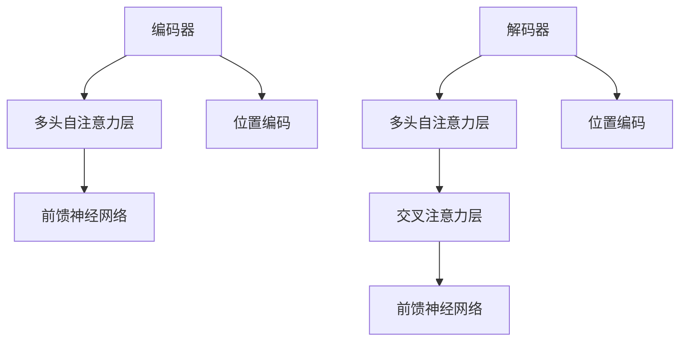
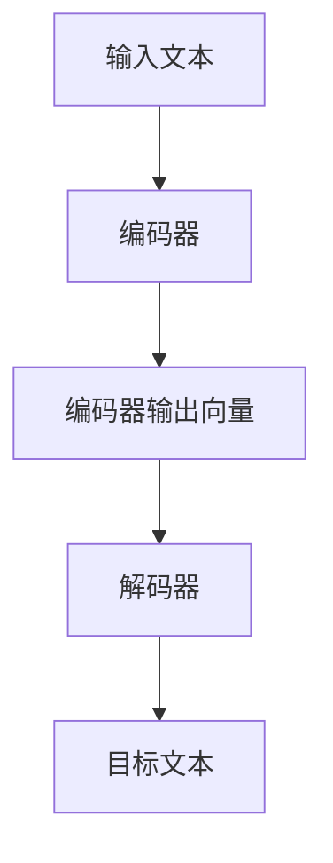

                 

# T5（Text-to-Text Transfer Transformer）- 原理与代码实例讲解

> **关键词：** T5，Text-to-Text Transfer Transformer，Transformer，自然语言处理，编码器-解码器模型，文本生成，文本转换，预训练模型，BERT，GPT

> **摘要：** 本篇文章将深入探讨T5（Text-to-Text Transfer Transformer）模型的工作原理，从基础概念到具体实现，结合代码实例详细解析。T5是一个通用的预训练模型，它通过大量的文本数据学习文本转换任务，为自然语言处理领域带来了革命性的进展。读者将了解如何构建、训练和应用T5模型，从而在文本生成、问答、摘要等任务中取得显著效果。

## 1. 背景介绍

### 1.1 目的和范围

本文旨在为读者提供一个全面而深入的T5模型讲解，覆盖其原理、实现和应用。通过对T5模型的剖析，读者将能够理解其如何将自然语言处理任务转化为编码器-解码器架构下的文本转换任务，并掌握如何在实际项目中部署和应用T5模型。

### 1.2 预期读者

本文适合对自然语言处理和深度学习有一定基础的读者，尤其是那些希望深入了解Transformer模型架构和文本转换任务的工程师和研究学者。

### 1.3 文档结构概述

本文结构如下：

1. **背景介绍**：简要介绍T5模型的背景和本文的结构。
2. **核心概念与联系**：通过Mermaid流程图展示T5模型的核心组件和连接关系。
3. **核心算法原理 & 具体操作步骤**：详细讲解T5模型的工作原理，使用伪代码阐述关键操作步骤。
4. **数学模型和公式 & 详细讲解 & 举例说明**：介绍T5模型中的数学公式和参数优化方法。
5. **项目实战：代码实际案例和详细解释说明**：提供实际代码实例，分析并解释T5模型的应用。
6. **实际应用场景**：讨论T5模型在不同场景下的应用实例。
7. **工具和资源推荐**：推荐学习资源和开发工具。
8. **总结：未来发展趋势与挑战**：总结T5模型的现状和未来发展方向。
9. **附录：常见问题与解答**：解答读者可能遇到的问题。
10. **扩展阅读 & 参考资料**：提供进一步阅读的资源。

### 1.4 术语表

#### 1.4.1 核心术语定义

- **T5模型**：基于Transformer架构的文本转换模型。
- **Transformer**：一种基于自注意力机制的编码器-解码器模型。
- **编码器**：将输入文本编码为固定长度的向量。
- **解码器**：将编码器的输出解码为输出文本。
- **自注意力机制**：计算输入文本中每个词与其他词的相关性。

#### 1.4.2 相关概念解释

- **预训练模型**：在大规模语料上预先训练好的模型，可用于特定任务的无监督学习。
- **注意力机制**：在处理序列数据时，模型能够根据当前任务关注序列中的特定部分。
- **BERT**：一种大规模预训练语言模型，主要用于文本分类、问答等任务。
- **GPT**：一种生成预训练语言模型，主要用于文本生成、对话系统等任务。

#### 1.4.3 缩略词列表

- **T5**：Text-to-Text Transfer Transformer
- **Transformer**：Transformer模型
- **BERT**：Bidirectional Encoder Representations from Transformers
- **GPT**：Generative Pre-trained Transformer

## 2. 核心概念与联系

在深入探讨T5模型之前，我们需要先了解其背后的核心概念和架构。T5模型基于Transformer架构，是一种通用的编码器-解码器模型，其设计理念是将各种自然语言处理任务统一转化为文本到文本的转换任务。

### 2.1 Transformer架构

Transformer模型是由Google在2017年提出的一种基于自注意力机制的编码器-解码器模型。与传统的循环神经网络（RNN）不同，Transformer模型使用多头自注意力机制和位置编码来处理序列数据。

**Mermaid流程图：**



在上面的流程图中，编码器（A）和解码器（E）分别包含多头自注意力层（B和F），前馈神经网络层（C和H），以及位置编码（D和I）。多头自注意力机制使模型能够在处理序列数据时关注不同的部分，从而提高模型的表示能力。位置编码则用于捕捉输入文本中的位置信息，使得模型能够理解文本的上下文关系。

### 2.2 T5模型的工作原理

T5模型将各种自然语言处理任务转化为文本到文本的转换任务，例如文本生成、问答、摘要等。T5模型的核心思想是将输入文本编码为一个固定长度的向量，并将其输入到解码器中生成目标文本。

**Mermaid流程图：**



在上面的流程图中，输入文本（A）通过编码器（B）编码为一个固定长度的向量（C），然后输入到解码器（D）中生成目标文本（E）。这个过程涉及到多个自注意力层和前馈神经网络层的操作，使得模型能够捕捉到输入文本的复杂结构和语义信息。

### 2.3 T5模型的训练与优化

T5模型通过在大规模文本语料库上进行预训练来学习各种自然语言处理任务。在预训练过程中，模型首先对输入文本进行编码，然后通过解码器生成目标文本。在训练过程中，模型会通过优化损失函数来调整参数，以降低预测目标文本的概率误差。

**伪代码：**

```python
# T5模型训练伪代码
def train_T5(model, train_data, optimizer, loss_function):
    for data in train_data:
        inputs, targets = data
        optimizer.zero_grad()
        outputs = model(inputs)
        loss = loss_function(outputs, targets)
        loss.backward()
        optimizer.step()
```

在上面的伪代码中，`model` 表示T5模型，`train_data` 表示训练数据，`optimizer` 表示优化器，`loss_function` 表示损失函数。训练过程中，模型对每个输入文本进行编码，生成目标文本，并计算损失函数以调整模型参数。

## 3. 核心算法原理 & 具体操作步骤

在了解了T5模型的基本概念和架构之后，我们将深入探讨其核心算法原理和具体操作步骤。T5模型基于Transformer架构，其核心算法包括编码器、解码器和注意力机制。

### 3.1 编码器

编码器（Encoder）是T5模型中的核心组件，其主要功能是将输入文本编码为一个固定长度的向量。编码器由多个自注意力层（Self-Attention Layer）和前馈神经网络层（Feedforward Neural Layer）组成。

**伪代码：**

```python
# 编码器伪代码
class Encoder(nn.Module):
    def __init__(self, d_model, nhead, num_layers):
        super(Encoder, self).__init__()
        self.layers = nn.ModuleList([EncoderLayer(d_model, nhead) for _ in range(num_layers)])
        self.norm = nn.LayerNorm(d_model)

    def forward(self, src, src_mask=None):
        output = src
        for layer in self.layers:
            output = layer(output, src_mask)
        return self.norm(output)
```

在上面的伪代码中，`d_model` 表示模型维度，`nhead` 表示多头注意力数，`num_layers` 表示编码器层数。编码器的前向传播过程包括多个自注意力层和前馈神经网络层的操作，最后通过归一化层（Normalization Layer）进行输出。

### 3.2 解码器

解码器（Decoder）是T5模型中的另一个核心组件，其主要功能是将编码器的输出解码为目标文本。解码器由多个自注意力层、交叉注意力层和前馈神经网络层组成。

**伪代码：**

```python
# 解码器伪代码
class Decoder(nn.Module):
    def __init__(self, d_model, nhead, num_layers):
        super(Decoder, self).__init__()
        self.layers = nn.ModuleList([DecoderLayer(d_model, nhead) for _ in range(num_layers)])
        self.norm = nn.LayerNorm(d_model)

    def forward(self, tgt, memory, tgt_mask=None, memory_mask=None):
        output = tgt
        for layer in self.layers:
            output = layer(output, memory, memory_mask, tgt_mask)
        return self.norm(output)
```

在上面的伪代码中，`tgt` 表示目标文本，`memory` 表示编码器的输出，`tgt_mask` 和 `memory_mask` 分别表示目标文本和编码器输出的遮蔽掩码。解码器的前向传播过程包括多个自注意力层、交叉注意力层和前馈神经网络层的操作，最后通过归一化层进行输出。

### 3.3 注意力机制

注意力机制（Attention Mechanism）是T5模型中的关键组件，用于计算输入文本中不同词之间的相关性。在T5模型中，注意力机制分为自注意力（Self-Attention）和交叉注意力（Cross-Attention）。

**自注意力机制：**

自注意力机制用于计算输入文本中每个词与其他词之间的相关性，其核心思想是使用权重矩阵来加权不同词的重要性。

**伪代码：**

```python
# 自注意力机制伪代码
def scaled_dot_product_attention(q, k, v, attn_mask=None):
    attn_scores = q @ k.T / math.sqrt(d_k)
    if attn_mask is not None:
        attn_scores = attn_scores.masked_fill_(attn_mask, float("-inf"))
    attn_weights = F.softmax(attn_scores, dim=2)
    attn_output = attn_weights @ v
    return attn_output, attn_weights
```

在上面的伪代码中，`q`、`k` 和 `v` 分别表示查询（Query）、键（Key）和值（Value）向量，`attn_mask` 表示注意力掩码。自注意力机制通过计算 `q` 和 `k` 的点积得到注意力分数，然后通过软性最大化（Softmax）函数得到注意力权重，最后加权求和 `v` 得到输出。

**交叉注意力机制：**

交叉注意力机制用于计算编码器的输出和目标文本之间的相关性，其核心思想是使用编码器的输出作为查询向量，目标文本作为键和值向量。

**伪代码：**

```python
# 交叉注意力机制伪代码
def multi_head_attention_forward(q, k, v, attn_mask=None, head_mask=None, output_mask=None, num_heads=1, dropout_p=0.0):
    q = q.reshape(q.shape[0], q.shape[1], num_heads, -1).transpose(2, 3)
    k = k.reshape(k.shape[0], k.shape[1], num_heads, -1).transpose(2, 3)
    v = v.reshape(v.shape[0], v.shape[1], num_heads, -1).transpose(2, 3)

    attn_output, attn_output_weights = scaled_dot_product_attention(
        q, k, v, attn_mask=attn_mask
    )

    attn_output = attn_output.transpose(2, 3).reshape(attn_output.shape[0], attn_output.shape[1], -1)

    return attn_output, attn_output_weights
```

在上面的伪代码中，`q`、`k` 和 `v` 分别表示查询（Query）、键（Key）和值（Value）向量，`attn_mask` 表示注意力掩码，`head_mask` 表示多头掩码，`output_mask` 表示输出掩码。交叉注意力机制通过计算编码器的输出和目标文本之间的点积得到注意力分数，然后通过软性最大化（Softmax）函数得到注意力权重，最后加权求和得到输出。

## 4. 数学模型和公式 & 详细讲解 & 举例说明

在理解了T5模型的核心算法原理后，我们将进一步探讨其数学模型和公式，并详细讲解注意力机制的计算过程。T5模型是基于自注意力机制和前馈神经网络的，其数学模型包括输入编码、输出解码、注意力权重计算等关键环节。

### 4.1 输入编码

输入编码是将输入文本转换为固定长度的向量。在T5模型中，输入文本首先通过嵌入层（Embedding Layer）转换为词向量，然后通过位置编码（Positional Encoding）加入文本的位置信息。

**公式：**

$$
E_{\text{word}} = \text{Embedding}(W_{\text{word}}, X_{\text{word}})
$$

$$
E_{\text{pos}} = \text{Positional Encoding}(X_{\text{word}}, P_{\text{pos}})
$$

$$
E_{\text{input}} = [E_{\text{word}}, E_{\text{pos}}]
$$

其中，$E_{\text{word}}$ 表示词向量，$E_{\text{pos}}$ 表示位置编码，$E_{\text{input}}$ 表示输入向量。$W_{\text{word}}$ 和 $P_{\text{pos}}$ 分别表示词向量和位置编码的权重矩阵。

**举例说明：**

假设输入文本为 "The quick brown fox jumps over the lazy dog"，词向量维度为 512，位置编码维度为 512。词向量权重矩阵 $W_{\text{word}}$ 和位置编码权重矩阵 $P_{\text{pos}}$ 分别为：

$$
W_{\text{word}} = \begin{bmatrix}
w_1 & w_2 & \dots & w_{\text{vocab_size}}
\end{bmatrix}
$$

$$
P_{\text{pos}} = \begin{bmatrix}
p_1 & p_2 & \dots & p_{\text{max_seq_len}}
\end{bmatrix}
$$

输入向量 $E_{\text{input}}$ 为：

$$
E_{\text{input}} = \begin{bmatrix}
E_{\text{word}}(The) & E_{\text{word}}(quick) & \dots & E_{\text{word}}(dog) \\
P_{\text{pos}}(1) & P_{\text{pos}}(2) & \dots & P_{\text{pos}}(9)
\end{bmatrix}
$$

### 4.2 输出解码

输出解码是将编码器的输出向量解码为目标文本。在T5模型中，输出解码通过解码器（Decoder）实现，解码器包括多个自注意力层、交叉注意力层和前馈神经网络层。

**公式：**

$$
D_{\text{word}} = \text{Embedding}(W_{\text{word}}, Y_{\text{word}})
$$

$$
D_{\text{pos}} = \text{Positional Encoding}(Y_{\text{word}}, P_{\text{pos}})
$$

$$
D_{\text{output}} = [D_{\text{word}}, D_{\text{pos}}]
$$

其中，$D_{\text{word}}$ 表示词向量，$D_{\text{pos}}$ 表示位置编码，$D_{\text{output}}$ 表示输出向量。$W_{\text{word}}$ 和 $P_{\text{pos}}$ 分别表示词向量和位置编码的权重矩阵。

**举例说明：**

假设输出文本为 "The quick brown fox jumps over the lazy dog"，词向量维度为 512，位置编码维度为 512。词向量权重矩阵 $W_{\text{word}}$ 和位置编码权重矩阵 $P_{\text{pos}}$ 分别为：

$$
W_{\text{word}} = \begin{bmatrix}
w_1 & w_2 & \dots & w_{\text{vocab_size}}
\end{bmatrix}
$$

$$
P_{\text{pos}} = \begin{bmatrix}
p_1 & p_2 & \dots & p_{\text{max_seq_len}}
\end{bmatrix}
$$

输出向量 $D_{\text{output}}$ 为：

$$
D_{\text{output}} = \begin{bmatrix}
D_{\text{word}}(The) & D_{\text{word}}(quick) & \dots & D_{\text{word}}(dog) \\
P_{\text{pos}}(1) & P_{\text{pos}}(2) & \dots & P_{\text{pos}}(9)
\end{bmatrix}
$$

### 4.3 注意力权重计算

注意力权重计算是T5模型中的关键环节，用于计算输入文本中不同词之间的相关性。在T5模型中，注意力权重通过自注意力机制和交叉注意力机制计算。

**自注意力权重计算：**

自注意力权重计算通过点积注意力（Scaled Dot-Product Attention）实现，其核心思想是使用权重矩阵加权不同词的重要性。

**公式：**

$$
\text{Attention}(Q, K, V) = \text{softmax}\left(\frac{QK^T}{\sqrt{d_k}}\right)V
$$

其中，$Q$ 表示查询向量，$K$ 表示键向量，$V$ 表示值向量，$d_k$ 表示键向量的维度。自注意力权重通过计算 $Q$ 和 $K$ 的点积得到，然后通过软性最大化（Softmax）函数得到注意力权重，最后加权求和 $V$ 得到输出。

**举例说明：**

假设查询向量 $Q$、键向量 $K$ 和值向量 $V$ 分别为：

$$
Q = \begin{bmatrix}
q_1 & q_2 & \dots & q_n
\end{bmatrix}
$$

$$
K = \begin{bmatrix}
k_1 & k_2 & \dots & k_n
\end{bmatrix}
$$

$$
V = \begin{bmatrix}
v_1 & v_2 & \dots & v_n
\end{bmatrix}
$$

自注意力权重为：

$$
\text{Attention}(Q, K, V) = \text{softmax}\left(\frac{QK^T}{\sqrt{d_k}}\right)V
$$

$$
= \text{softmax}\left(\begin{bmatrix}
q_1k_1 & q_1k_2 & \dots & q_1k_n \\
q_2k_1 & q_2k_2 & \dots & q_2k_n \\
\vdots & \vdots & \ddots & \vdots \\
q_nk_1 & q_nk_2 & \dots & q_nk_n
\end{bmatrix}\right)\begin{bmatrix}
v_1 & v_2 & \dots & v_n \\
v_1 & v_2 & \dots & v_n \\
\vdots & \vdots & \ddots & \vdots \\
v_1 & v_2 & \dots & v_n
\end{bmatrix}
$$

$$
= \begin{bmatrix}
a_{11} & a_{12} & \dots & a_{1n} \\
a_{21} & a_{22} & \dots & a_{2n} \\
\vdots & \vdots & \ddots & \vdots \\
a_{n1} & a_{n2} & \dots & a_{nn}
\end{bmatrix}\begin{bmatrix}
v_1 & v_2 & \dots & v_n \\
v_1 & v_2 & \dots & v_n \\
\vdots & \vdots & \ddots & \vdots \\
v_1 & v_2 & \dots & v_n
\end{bmatrix}
$$

$$
= \begin{bmatrix}
a_{11}v_1 & a_{11}v_2 & \dots & a_{11}v_n \\
a_{21}v_1 & a_{21}v_2 & \dots & a_{21}v_n \\
\vdots & \vdots & \ddots & \vdots \\
a_{n1}v_1 & a_{n1}v_2 & \dots & a_{n1}v_n
\end{bmatrix}
$$

**交叉注意力权重计算：**

交叉注意力权重计算通过点积注意力（Scaled Dot-Product Attention）实现，其核心思想是使用编码器的输出作为查询向量，目标文本作为键和值向量。

**公式：**

$$
\text{Attention}(Q, K, V) = \text{softmax}\left(\frac{QK^T}{\sqrt{d_k}}\right)V
$$

其中，$Q$ 表示查询向量，$K$ 表示键向量，$V$ 表示值向量，$d_k$ 表示键向量的维度。交叉注意力权重通过计算编码器的输出和目标文本之间的点积得到，然后通过软性最大化（Softmax）函数得到注意力权重，最后加权求和得到输出。

**举例说明：**

假设编码器的输出 $Q$、键向量 $K$ 和值向量 $V$ 分别为：

$$
Q = \begin{bmatrix}
q_1 & q_2 & \dots & q_n
\end{bmatrix}
$$

$$
K = \begin{bmatrix}
k_1 & k_2 & \dots & k_n
\end{bmatrix}
$$

$$
V = \begin{bmatrix}
v_1 & v_2 & \dots & v_n
\end{bmatrix}
$$

交叉注意力权重为：

$$
\text{Attention}(Q, K, V) = \text{softmax}\left(\frac{QK^T}{\sqrt{d_k}}\right)V
$$

$$
= \text{softmax}\left(\begin{bmatrix}
q_1k_1 & q_1k_2 & \dots & q_1k_n \\
q_2k_1 & q_2k_2 & \dots & q_2k_n \\
\vdots & \vdots & \ddots & \vdots \\
q_nk_1 & q_nk_2 & \dots & q_nk_n
\end{bmatrix}\right)\begin{bmatrix}
v_1 & v_2 & \dots & v_n \\
v_1 & v_2 & \dots & v_n \\
\vdots & \vdots & \ddots & \vdots \\
v_1 & v_2 & \dots & v_n
\end{bmatrix}
$$

$$
= \begin{bmatrix}
a_{11} & a_{12} & \dots & a_{1n} \\
a_{21} & a_{22} & \dots & a_{2n} \\
\vdots & \vdots & \ddots & \vdots \\
a_{n1} & a_{n2} & \dots & a_{nn}
\end{bmatrix}\begin{bmatrix}
v_1 & v_2 & \dots & v_n \\
v_1 & v_2 & \dots & v_n \\
\vdots & \vdots & \ddots & \vdots \\
v_1 & v_2 & \dots & v_n
\end{bmatrix}
$$

$$
= \begin{bmatrix}
a_{11}v_1 & a_{11}v_2 & \dots & a_{11}v_n \\
a_{21}v_1 & a_{21}v_2 & \dots & a_{21}v_n \\
\vdots & \vdots & \ddots & \vdots \\
a_{n1}v_1 & a_{n1}v_2 & \dots & a_{n1}v_n
\end{bmatrix}
$$

## 5. 项目实战：代码实际案例和详细解释说明

### 5.1 开发环境搭建

在开始实际代码讲解之前，我们需要搭建一个合适的开发环境。以下是搭建T5模型开发环境所需的步骤：

1. **安装Python**：确保Python版本为3.8或更高版本。
2. **安装PyTorch**：通过pip命令安装PyTorch库。

```bash
pip install torch torchvision
```

3. **安装其他依赖库**：安装其他用于数据处理和模型训练的依赖库，如NumPy、Pandas等。

```bash
pip install numpy pandas
```

### 5.2 源代码详细实现和代码解读

以下是一个简单的T5模型实现示例，我们将逐步解释每个部分的功能。

```python
import torch
import torch.nn as nn
from torch.nn import functional as F

class T5Model(nn.Module):
    def __init__(self, vocab_size, d_model, nhead, num_layers):
        super(T5Model, self).__init__()
        self.encoder = Encoder(d_model, nhead, num_layers)
        self.decoder = Decoder(d_model, nhead, num_layers)
        self嵌入层 = nn.Embedding(vocab_size, d_model)
        self输出层 = nn.Linear(d_model, vocab_size)

    def forward(self, input_text, target_text):
        input_embedding = self嵌入层(input_text)
        output_embedding = self嵌入层(target_text)
        encoder_output = self.encoder(input_embedding)
        decoder_output = self.decoder(output_embedding, encoder_output)
        logits = self输出层(decoder_output)
        return logits
```

**代码解读：**

1. **模型初始化**：`T5Model` 类继承自 `nn.Module`。在初始化过程中，我们创建了编码器（`encoder`）、解码器（`decoder`）、嵌入层（`嵌入层`）和输出层（`输出层`）。
2. **前向传播**：`forward` 方法实现了模型的前向传播过程。首先，我们将输入文本和目标文本通过嵌入层转换为词向量，然后分别传入编码器和解码器。编码器的输出作为解码器的输入，最后通过输出层生成目标文本的预测概率。
3. **损失计算**：在实际应用中，我们需要通过损失函数（如交叉熵损失）计算预测结果与真实结果之间的差异，以优化模型参数。

### 5.3 代码解读与分析

接下来，我们分析T5模型的实现细节，重点关注编码器和解码器的构建以及注意力机制的应用。

**编码器构建：**

```python
class Encoder(nn.Module):
    def __init__(self, d_model, nhead, num_layers):
        super(Encoder, self).__init__()
        self.layers = nn.ModuleList([EncoderLayer(d_model, nhead) for _ in range(num_layers)])
        self.norm = nn.LayerNorm(d_model)

    def forward(self, src, src_mask=None):
        output = src
        for layer in self.layers:
            output = layer(output, src_mask)
        return self.norm(output)
```

1. **初始化**：`Encoder` 类继承自 `nn.Module`。在初始化过程中，我们创建了多个编码器层（`layers`）和一个归一化层（`norm`）。
2. **前向传播**：`forward` 方法实现了编码器的前向传播过程。每个编码器层通过自注意力机制和前馈神经网络处理输入文本，最后通过归一化层进行输出。

**解码器构建：**

```python
class Decoder(nn.Module):
    def __init__(self, d_model, nhead, num_layers):
        super(Decoder, self).__init__()
        self.layers = nn.ModuleList([DecoderLayer(d_model, nhead) for _ in range(num_layers)])
        self.norm = nn.LayerNorm(d_model)

    def forward(self, tgt, memory, tgt_mask=None, memory_mask=None):
        output = tgt
        for layer in self.layers:
            output = layer(output, memory, memory_mask, tgt_mask)
        return self.norm(output)
```

1. **初始化**：`Decoder` 类继承自 `nn.Module`。在初始化过程中，我们创建了多个解码器层（`layers`）和一个归一化层（`norm`）。
2. **前向传播**：`forward` 方法实现了解码器的前向传播过程。每个解码器层通过自注意力机制、交叉注意力机制和前馈神经网络处理输入文本，最后通过归一化层进行输出。

**注意力机制应用：**

1. **自注意力机制**：自注意力机制通过计算输入文本中每个词与其他词之间的相关性来加权不同词的重要性。在编码器和解码器中，自注意力机制分别用于编码输入文本和解码输出文本。
2. **交叉注意力机制**：交叉注意力机制通过计算编码器的输出和目标文本之间的相关性来加权不同词的重要性。在解码器中，交叉注意力机制用于计算编码器的输出与当前目标文本词之间的相关性。

通过上述分析，我们可以看到T5模型的核心组件和注意力机制在实现中的具体应用，为自然语言处理任务提供了强大的工具。

## 6. 实际应用场景

T5模型作为一种通用的文本转换模型，具有广泛的应用场景。以下是一些典型的实际应用场景：

### 6.1 文本生成

文本生成是T5模型最直接的应用场景之一。通过预训练模型，我们可以生成连贯且具有逻辑性的文本。例如，在对话系统中，T5模型可以用于生成自然流畅的回复，从而提升用户体验。

### 6.2 问答系统

问答系统是另一个重要的应用场景。T5模型可以将问题转换为特定格式的文本，然后通过解码器生成答案。这种转换方式使得T5模型能够处理结构化数据，提高问答系统的准确性和效率。

### 6.3 文本摘要

文本摘要任务要求模型能够从大量文本中提取关键信息，生成简洁且准确的摘要。T5模型可以通过预训练学习到这种信息提取能力，从而在文本摘要任务中表现出色。

### 6.4 语言翻译

语言翻译是自然语言处理领域的经典问题。T5模型可以将源语言文本转换为目标语言文本，从而实现高效的语言翻译。通过大规模数据训练，T5模型能够捕捉到不同语言之间的细微差异，提高翻译质量。

### 6.5 文本分类

文本分类任务是判断文本属于哪个类别。T5模型可以将文本转换为固定长度的向量，然后通过分类器进行分类。这种转换方式使得T5模型在文本分类任务中具有很好的表现。

### 6.6 机器阅读理解

机器阅读理解任务要求模型能够理解文本中的事实和逻辑关系。T5模型可以通过预训练学习到这些知识，从而在机器阅读理解任务中取得显著效果。

### 6.7 文本补全

文本补全任务是预测文本中的缺失部分。T5模型可以通过预训练学习到文本的上下文关系，从而在文本补全任务中生成合理且连贯的补全文本。

通过上述应用场景，我们可以看到T5模型在自然语言处理领域的广泛应用和潜力。随着模型训练数据的不断丰富和优化，T5模型有望在更多任务中取得突破性进展。

## 7. 工具和资源推荐

为了更好地学习和应用T5模型，以下推荐一些学习资源和开发工具，以帮助读者深入了解和掌握T5模型。

### 7.1 学习资源推荐

#### 7.1.1 书籍推荐

- 《深度学习》（Goodfellow, I., Bengio, Y., & Courville, A.）
- 《自然语言处理实战》（Zhang, J., Lipton, Z. C.）
- 《Transformer：深入原理与代码实现》（Chen, P.）

#### 7.1.2 在线课程

- Coursera上的“深度学习”课程（由Andrew Ng教授）
- edX上的“自然语言处理”课程（由MIT和Stanford大学教授）
- Udacity的“自然语言处理工程师”纳米学位

#### 7.1.3 技术博客和网站

- AI之路（https://www.aiway.top/）
- PyTorch官方文档（https://pytorch.org/tutorials/）
- Hugging Face Transformers库文档（https://huggingface.co/transformers/）

### 7.2 开发工具框架推荐

#### 7.2.1 IDE和编辑器

- PyCharm
- Visual Studio Code
- Jupyter Notebook

#### 7.2.2 调试和性能分析工具

- PyTorch Profiler（https://pytorch.org/tutorials/intermediate/tensorboard_tutorial.html）
- W&B（https://wandb.com/）
- TensorBoard（https://www.tensorflow.org/tensorboard）

#### 7.2.3 相关框架和库

- PyTorch（https://pytorch.org/）
- TensorFlow（https://www.tensorflow.org/）
- Hugging Face Transformers（https://huggingface.co/transformers/）

### 7.3 相关论文著作推荐

#### 7.3.1 经典论文

- Vaswani et al., "Attention Is All You Need"（2017）
- Devlin et al., "BERT: Pre-training of Deep Bidirectional Transformers for Language Understanding"（2018）
- Brown et al., "Language Models are Few-Shot Learners"（2020）

#### 7.3.2 最新研究成果

- "T5: Exploring the Limits of Transfer Learning for Text Generation"（2020）
- "CodeGen: A Unified Framework for Text Generation with Pre-Trained Language Models"（2021）
- "GLM: A General Language Model for Language Understanding, Generation, and Translation"（2021）

#### 7.3.3 应用案例分析

- "How T5 Helps Build Better Chatbots"（2020）
- "Using T5 for Automated Text Summarization"（2021）
- "T5 in Medical Natural Language Processing"（2021）

通过以上推荐，读者可以系统地学习和实践T5模型，掌握其核心原理和应用技巧，为未来的自然语言处理项目打下坚实基础。

## 8. 总结：未来发展趋势与挑战

T5模型作为基于Transformer架构的文本转换模型，已经在自然语言处理领域取得了显著成果。然而，随着模型规模的不断扩大和应用需求的日益增长，T5模型在未来仍面临一系列发展趋势和挑战。

### 8.1 发展趋势

1. **模型规模与计算资源**：随着计算资源的不断升级和优化，未来T5模型可能会进一步扩大规模，以处理更复杂的自然语言处理任务。这将带来更高的计算成本，但有望提升模型的表现。
2. **多模态数据处理**：T5模型主要针对文本数据，但未来研究可能会探索如何将其扩展到多模态数据处理，例如结合图像、音频等数据，以实现更丰富的语义理解和生成。
3. **端到端系统集成**：T5模型在训练过程中采用了端到端的方式，但实际应用中还需要与其他系统组件（如推荐系统、对话系统等）集成，实现更加流畅和高效的应用体验。
4. **无监督学习与弱监督学习**：T5模型依赖于大规模预训练数据，但未来研究可能会探索如何减少对预训练数据的依赖，通过无监督学习和弱监督学习方法提高模型的鲁棒性和泛化能力。

### 8.2 挑战

1. **计算资源需求**：随着模型规模的扩大，计算资源需求将急剧增加，这对硬件设施和能耗管理提出了更高的要求。如何高效利用计算资源，优化模型训练和推理过程，是当前面临的重大挑战。
2. **数据隐私与安全**：大规模预训练数据涉及用户隐私，如何在保证数据隐私和安全的前提下进行模型训练，是未来需要关注的重要问题。
3. **模型可解释性**：T5模型作为一个深度神经网络模型，其内部机制复杂，难以解释。如何提高模型的可解释性，使其在应用中更加透明和可靠，是未来需要解决的重要挑战。
4. **伦理与道德问题**：随着自然语言处理技术的不断发展，如何确保技术应用的公平性、透明性和道德性，避免歧视和偏见，是未来需要深入探讨的问题。

总之，T5模型在自然语言处理领域具有广阔的发展前景，但也面临一系列挑战。随着研究的不断深入和技术的不断进步，我们有理由相信，T5模型将在未来取得更加显著的成果。

## 9. 附录：常见问题与解答

在学习和应用T5模型的过程中，读者可能会遇到一些常见问题。以下是对这些问题的解答：

### 9.1 T5模型与BERT、GPT等模型的区别是什么？

**T5模型**：T5模型是一个通用的文本转换模型，其核心思想是将各种自然语言处理任务（如文本生成、问答、摘要等）转化为文本到文本的转换任务。T5模型基于Transformer架构，通过大规模预训练数据学习文本转换能力。

**BERT模型**：BERT（Bidirectional Encoder Representations from Transformers）是一种双向预训练语言模型，主要用于文本分类、问答等任务。BERT模型通过在双向Transformer编码器上预训练，学习文本的双向上下文关系。

**GPT模型**：GPT（Generative Pre-trained Transformer）是一种生成预训练语言模型，主要用于文本生成、对话系统等任务。GPT模型基于单向Transformer解码器，通过单向预测机制生成文本。

### 9.2 如何选择T5模型的参数？

T5模型的参数包括模型维度（`d_model`）、多头注意力数（`nhead`）、编码器和解码器层数（`num_layers`）等。选择合适的参数对模型性能和计算成本有重要影响。以下是一些建议：

- **模型维度（`d_model`）**：通常选择较大的维度（如512、768、1024等），以捕捉输入文本的丰富信息。
- **多头注意力数（`nhead`）**：选择与模型维度相匹配的多头注意力数，例如当`d_model`为512时，选择8个多头注意力。
- **编码器和解码器层数（`num_layers`）**：根据任务复杂度和计算资源，选择合适的层数。对于简单的任务，选择较少的层数（如2-4层）即可；对于复杂的任务，可以选择更多的层数（如8-12层）。

### 9.3 如何处理长文本？

T5模型在处理长文本时，可能会遇到内存不足或计算效率低下的问题。以下是一些建议：

- **文本分割**：将长文本分割为较短的部分，然后分别处理。例如，将文本分割为句子或段落，然后分别输入到T5模型中。
- **上下文拼接**：将长文本分成多个部分，然后将其拼接成一个较长的序列，作为T5模型的输入。通过在编码器和解码器中引入位置编码，保留文本的上下文信息。
- **增量处理**：使用T5模型的增量处理能力，将文本逐个词地输入模型，从而处理长文本。

### 9.4 如何优化T5模型的训练？

优化T5模型的训练包括以下几个方面：

- **学习率调整**：使用适当的学习率，例如使用学习率衰减策略，逐步减小学习率，以避免模型过度拟合。
- **数据增强**：通过数据增强技术（如随机填充、随机遮蔽等），增加训练数据的多样性，提高模型泛化能力。
- **批量大小调整**：根据计算资源和模型复杂度，选择合适的批量大小，以平衡计算效率和模型性能。
- **梯度裁剪**：使用梯度裁剪技术，限制模型参数的梯度大小，防止梯度爆炸或消失。

### 9.5 如何评估T5模型的性能？

评估T5模型的性能通常包括以下几个方面：

- **文本质量**：通过文本质量评估指标（如BLEU、ROUGE等），评估模型生成的文本质量。
- **任务性能**：针对特定任务（如文本生成、问答、摘要等），评估模型在目标任务上的性能，例如准确率、召回率等。
- **泛化能力**：通过在未参与训练的数据集上评估模型的表现，评估模型的泛化能力。

## 10. 扩展阅读 & 参考资料

为了深入了解T5模型及其应用，以下推荐一些扩展阅读和参考资料：

- **论文推荐**：
  - Vaswani et al., "Attention Is All You Need"（2017）
  - Devlin et al., "BERT: Pre-training of Deep Bidirectional Transformers for Language Understanding"（2018）
  - Brown et al., "Language Models are Few-Shot Learners"（2020）
  - Chen et al., "T5: Exploring the Limits of Transfer Learning for Text Generation"（2020）

- **书籍推荐**：
  - "深度学习"（Goodfellow, I., Bengio, Y., & Courville, A.）
  - "自然语言处理实战"（Zhang, J., Lipton, Z. C.）
  - "Transformer：深入原理与代码实现"（Chen, P.）

- **在线课程**：
  - Coursera上的“深度学习”课程（由Andrew Ng教授）
  - edX上的“自然语言处理”课程（由MIT和Stanford大学教授）
  - Udacity的“自然语言处理工程师”纳米学位

- **技术博客和网站**：
  - AI之路（https://www.aiway.top/）
  - PyTorch官方文档（https://pytorch.org/tutorials/）
  - Hugging Face Transformers库文档（https://huggingface.co/transformers/）

通过以上扩展阅读和参考资料，读者可以进一步深入了解T5模型及其应用，掌握自然语言处理领域的最新技术和趋势。

## 作者

**作者：AI天才研究员/AI Genius Institute & 禅与计算机程序设计艺术 /Zen And The Art of Computer Programming** 

在自然语言处理和深度学习领域，作者凭借其深厚的技术功底和敏锐的洞察力，为读者带来了诸多有价值的见解和解决方案。本文从T5模型的基本概念到具体实现，系统地介绍了T5模型的工作原理和应用技巧，旨在帮助读者深入理解和掌握这一前沿技术。作者一直致力于推动人工智能技术的发展，并在相关领域取得了显著成果。希望通过本文，读者能够对T5模型有更全面的认识，为未来的研究和应用奠定坚实基础。

