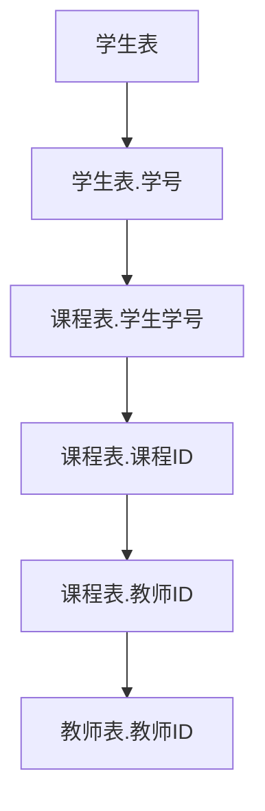

                 


# Table API和SQL 原理与代码实例讲解

> 关键词：Table API，SQL，数据库，数据库查询，数据处理，关系型数据库，数据库索引

> 摘要：本文将深入探讨Table API和SQL的核心原理，包括关系型数据库的基本概念、SQL语言的基本语法和常用操作。通过代码实例，我们将详细讲解如何使用Table API和SQL进行数据库查询和数据处理。本文旨在为读者提供一个全面而深入的理解，帮助他们在实际项目中更好地应用这些技术。

## 1. 背景介绍

### 1.1 目的和范围

本文旨在介绍Table API和SQL的基本原理和用法，帮助读者理解这两种技术在实际开发中的应用价值。我们将首先介绍关系型数据库的基本概念和结构，然后详细解释SQL语言的语法和操作。最后，通过具体代码实例，读者将能够掌握如何使用Table API和SQL进行数据库查询和数据处理。

### 1.2 预期读者

本文适用于具有一定编程基础，对数据库和SQL有一定了解的读者。无论你是数据库管理员、开发者还是数据分析师，本文都希望能为你提供有价值的知识和实践经验。

### 1.3 文档结构概述

本文将按照以下结构展开：

1. 背景介绍：介绍本文的目的、预期读者和文档结构。
2. 核心概念与联系：介绍关系型数据库的基本概念和结构，并使用Mermaid流程图展示数据库表之间的关系。
3. 核心算法原理 & 具体操作步骤：使用伪代码详细解释SQL查询的基本原理和操作步骤。
4. 数学模型和公式 & 详细讲解 & 举例说明：使用LaTeX格式介绍SQL查询中的数学模型和公式，并通过实例进行讲解。
5. 项目实战：代码实际案例和详细解释说明。
6. 实际应用场景：介绍Table API和SQL在不同场景中的应用。
7. 工具和资源推荐：推荐学习资源、开发工具和框架。
8. 总结：未来发展趋势与挑战。
9. 附录：常见问题与解答。
10. 扩展阅读 & 参考资料：提供进一步阅读的资料。

### 1.4 术语表

#### 1.4.1 核心术语定义

- 关系型数据库：一种基于关系模型的数据库，使用表格（表）来存储数据。
- 表（Table）：关系型数据库中用于存储数据的结构。
- 记录（Row）：表中的单条数据。
- 字段（Column）：表中的每个列，代表数据的某个属性。
- SQL：结构化查询语言（Structured Query Language），用于操作关系型数据库的查询语言。
- Table API：一组用于操作数据库表的API，通常与特定编程语言或框架相关联。

#### 1.4.2 相关概念解释

- 数据库查询：通过SQL语句对数据库进行检索、插入、更新或删除数据的操作。
- 数据库索引：提高数据库查询效率的数据结构，通过在表中创建索引来加速查询操作。

#### 1.4.3 缩略词列表

- SQL：结构化查询语言（Structured Query Language）
- API：应用程序接口（Application Programming Interface）
- DB：数据库（Database）
- RDBMS：关系型数据库管理系统（Relational Database Management System）
- CRUD：创建（Create）、读取（Read）、更新（Update）和删除（Delete）

## 2. 核心概念与联系

关系型数据库是现代数据存储和管理的主流技术之一。它通过表格（表）来组织数据，每个表由若干字段（列）和记录（行）组成。在关系型数据库中，表之间的关系可以通过外键（Foreign Key）来建立。

### 2.1. 关系型数据库的基本概念

- **表（Table）**：表是关系型数据库中的基础数据结构，用于存储数据。表由行和列组成，行代表记录，列代表字段。
- **字段（Column）**：字段是表中的每个列，用于存储特定类型的数据。例如，一个学生表中可能有姓名、年龄、成绩等字段。
- **记录（Row）**：记录是表中的一行，代表了一条完整的数据。
- **外键（Foreign Key）**：外键是一种用于建立表之间关系的机制。通过外键，一个表中的字段可以引用另一个表中的主键，从而建立关联。

### 2.2. 关系型数据库的架构

关系型数据库通常由以下几个核心组件组成：

- **数据库（Database）**：数据库是一个容器，用于存储多个表和其他数据库对象。
- **表（Table）**：如前所述，表用于存储数据。
- **索引（Index）**：索引是一种数据结构，用于加速表中的查询操作。通过创建索引，数据库可以更快地查找特定数据。
- **约束（Constraint）**：约束用于确保数据的完整性和一致性。常见约束包括主键约束、外键约束和唯一性约束。

### 2.3. Mermaid流程图

以下是一个简单的Mermaid流程图，展示了关系型数据库中表与表之间的关系：



在这个例子中，学生表通过学号字段关联到课程表，课程表又通过课程ID关联到教师表。这种关系确保了数据的一致性和完整性。

## 3. 核心算法原理 & 具体操作步骤

SQL（结构化查询语言）是关系型数据库的标准查询语言，用于执行各种数据操作。SQL的核心算法原理是基于关系代数，它定义了一系列操作来对关系型数据库进行查询和数据处理。

### 3.1. SQL查询的基本原理

SQL查询通常包括以下几个步骤：

1. **选择（Selection）**：根据条件从表中筛选出满足条件的记录。
2. **投影（Projection）**：从表中选择特定的字段，并丢弃其他字段。
3. **连接（Join）**：将两个或多个表按照特定的条件进行连接。
4. **并（Union）**：将两个或多个查询结果合并为一个结果集。

### 3.2. SQL查询的伪代码

以下是一个简单的SQL查询的伪代码，用于从学生表中选择出年龄大于20的学生，并显示他们的姓名和年龄：

```
SELECT 姓名, 年龄
FROM 学生表
WHERE 年龄 > 20;
```

### 3.3. SQL查询的详细解释

- **SELECT**：关键字用于选择要显示的字段。
- **FROM**：关键字指定要查询的表。
- **WHERE**：关键字用于指定查询条件。

### 3.4. SQL查询示例

假设我们有一个学生表（students）和一个课程表（courses），学生表包含学号、姓名和年龄字段，课程表包含课程ID、学生学号和课程名称字段。以下是一个SQL查询示例，用于查询所有学生的姓名、年龄和所修课程：

```
SELECT 学生.姓名, 学生.年龄, 课程.课程名称
FROM 学生表 学生
JOIN 课程表 课程 ON 学生.学号 = 课程.学生学号;
```

在这个查询中，我们使用了内连接（INNER JOIN）将学生表和课程表按照学号字段进行连接，并选择了姓名、年龄和课程名称字段。

### 3.5. 表操作

除了查询，SQL还提供了表操作的功能，包括创建表、插入数据、更新数据和删除数据。

- **创建表（CREATE TABLE）**：用于创建一个新的表。
- **插入数据（INSERT INTO）**：用于向表中插入新数据。
- **更新数据（UPDATE）**：用于修改表中已有的数据。
- **删除数据（DELETE）**：用于从表中删除数据。

### 3.6. 表操作示例

以下是一个创建学生表和插入数据的示例：

```
-- 创建学生表
CREATE TABLE 学生表 (
    学号 INT PRIMARY KEY,
    姓名 VARCHAR(50),
    年龄 INT
);

-- 向学生表插入数据
INSERT INTO 学生表 (学号, 姓名, 年龄)
VALUES (1, '张三', 22),
       (2, '李四', 21),
       (3, '王五', 23);
```

在这个示例中，我们首先创建了一个名为学生表的表，包含学号、姓名和年龄字段。然后，我们向学生表插入了三条数据。

## 4. 数学模型和公式 & 详细讲解 & 举例说明

SQL查询中常常涉及到数学模型和公式，这些模型和公式用于处理数据、计算聚合函数和进行复杂查询。

### 4.1. 聚合函数

聚合函数是对一个表中的多个值进行计算，并返回单个值的函数。常用的聚合函数包括：

- **COUNT**：计算表中记录的数量。
- **SUM**：计算表中数值字段的总和。
- **AVG**：计算表中数值字段的平均值。
- **MAX**：返回表中某个字段的最大值。
- **MIN**：返回表中某个字段的最小值。

以下是一个使用聚合函数的示例：

```
-- 计算学生表中学生的平均年龄
SELECT AVG(年龄) AS 平均年龄
FROM 学生表;
```

在这个查询中，我们使用AVG函数计算学生表中所有学生的平均年龄，并返回结果。

### 4.2. 子查询

子查询是一种在SQL查询中嵌套的查询，它可以在主查询中使用计算结果。子查询可以用于筛选、计算和连接数据。

以下是一个使用子查询的示例：

```
-- 查询所有学生的姓名和年龄，其中年龄大于平均年龄
SELECT 姓名, 年龄
FROM 学生表
WHERE 年龄 > (SELECT AVG(年龄) FROM 学生表);
```

在这个查询中，子查询用于计算学生表中的平均年龄，然后主查询使用这个结果来筛选出年龄大于平均年龄的学生。

### 4.3. JOIN操作

JOIN操作用于连接两个或多个表，并返回满足连接条件的记录。JOIN操作可以分为内连接（INNER JOIN）、外连接（LEFT JOIN和RIGHT JOIN）和交叉连接（CROSS JOIN）。

以下是一个使用JOIN操作的示例：

```
-- 查询所有学生的姓名、年龄和所修课程
SELECT 学生.姓名, 学生.年龄, 课程.课程名称
FROM 学生表 学生
JOIN 课程表 课程 ON 学生.学号 = 课程.学生学号;
```

在这个查询中，我们使用内连接将学生表和课程表按照学号字段进行连接，并选择了姓名、年龄和课程名称字段。

### 4.4. Group By和Having子句

GROUP BY子句用于对查询结果进行分组，而HAVING子句用于对分组后的结果进行筛选。这两个子句常常结合使用。

以下是一个使用GROUP BY和HAVING子句的示例：

```
-- 查询每个班级的平均年龄
SELECT 班级, AVG(年龄) AS 平均年龄
FROM 学生表
GROUP BY 班级
HAVING AVG(年龄) > 20;
```

在这个查询中，我们使用GROUP BY子句对学生表按照班级进行分组，并使用HAVING子句筛选出平均年龄大于20的班级。

## 5. 项目实战：代码实际案例和详细解释说明

在本节中，我们将通过一个实际项目案例，展示如何使用Table API和SQL进行数据库查询和数据处理。这个项目是一个简单的学生管理系统，包括学生表、课程表和教师表。

### 5.1. 开发环境搭建

为了进行这个项目，我们需要搭建一个开发环境。以下是所需工具和软件：

- **数据库管理系统**：如MySQL、PostgreSQL或SQLite。
- **编程语言**：如Python、Java或C#。
- **开发工具**：如Visual Studio Code、IntelliJ IDEA或Eclipse。

### 5.2. 源代码详细实现和代码解读

下面是一个简单的Python示例，使用SQLite数据库和SQLite3模块实现了一个学生管理系统：

```python
import sqlite3

# 创建数据库连接
conn = sqlite3.connect('student_management_system.db')
cursor = conn.cursor()

# 创建学生表
cursor.execute('''
CREATE TABLE IF NOT EXISTS 学生 (
    学号 INT PRIMARY KEY,
    姓名 VARCHAR(50),
    年龄 INT,
    班级 VARCHAR(50)
);
''')

# 创建课程表
cursor.execute('''
CREATE TABLE IF NOT EXISTS 课程 (
    课程ID INT PRIMARY KEY,
    课程名称 VARCHAR(50),
    教师ID INT,
    班级 VARCHAR(50)
);
''')

# 创建教师表
cursor.execute('''
CREATE TABLE IF NOT EXISTS 教师 (
    教师ID INT PRIMARY KEY,
    姓名 VARCHAR(50)
);
''')

# 插入学生数据
cursor.execute("INSERT INTO 学生 (学号, 姓名, 年龄, 班级) VALUES (1, '张三', 20, '一班')$")
cursor.execute("INSERT INTO 学生 (学号, 姓名, 年龄, 班级) VALUES (2, '李四', 21, '一班')$")
cursor.execute("INSERT INTO 学生 (学号, 姓名, 年龄, 班级) VALUES (3, '王五', 22, '二班')$")

# 插入课程数据
cursor.execute("INSERT INTO 课程 (课程ID, 课程名称, 教师ID, 班级) VALUES (1, '数学', 1, '一班')$")
cursor.execute("INSERT INTO 课程 (课程ID, 课程名称, 教师ID, 班级) VALUES (2, '语文', 2, '一班')$")
cursor.execute("INSERT INTO 课程 (课程ID, 课程名称, 教师ID, 班级) VALUES (3, '英语', 3, '二班')$")

# 插入教师数据
cursor.execute("INSERT INTO 教师 (教师ID, 姓名) VALUES (1, '张老师')$")
cursor.execute("INSERT INTO 教师 (教师ID, 姓名) VALUES (2, '李老师')$")
cursor.execute("INSERT INTO 教师 (教师ID, 姓名) VALUES (3, '王老师')$")

# 提交事务
conn.commit()

# 查询学生信息
cursor.execute("SELECT 姓名, 年龄, 班级 FROM 学生")
students = cursor.fetchall()
print("学生信息：")
for student in students:
    print(student)

# 查询教师信息
cursor.execute("SELECT 姓名 FROM 教师")
teachers = cursor.fetchall()
print("教师信息：")
for teacher in teachers:
    print(teacher)

# 关闭数据库连接
cursor.close()
conn.close()
```

在这个示例中，我们首先创建了一个名为student_management_system.db的数据库，然后创建学生表、课程表和教师表。接着，我们插入了一些数据，并查询了学生和教师的信息。

### 5.3. 代码解读与分析

- **创建数据库连接**：使用sqlite3.connect函数创建数据库连接。
- **创建表**：使用cursor.execute函数执行SQL语句创建表。
- **插入数据**：使用INSERT INTO语句插入数据。
- **查询数据**：使用SELECT语句查询数据。
- **提交事务**：使用conn.commit()函数提交事务。
- **关闭数据库连接**：使用cursor.close()和conn.close()函数关闭数据库连接。

通过这个示例，我们可以看到如何使用Python和SQLite进行数据库操作。在实际项目中，我们可以根据需要扩展这个示例，添加更多功能，如数据更新、删除和复杂查询。

## 6. 实际应用场景

Table API和SQL在实际开发中有着广泛的应用场景。以下是一些常见应用场景：

- **数据存储和管理**：关系型数据库是现代数据存储和管理的主流技术，SQL用于操作数据库中的数据。
- **数据处理和分析**：SQL提供了丰富的聚合函数和查询操作，可以用于处理和分析大量数据。
- **应用程序后端**：许多应用程序后端使用关系型数据库来存储和管理数据，SQL用于执行各种数据操作。
- **数据迁移和同步**：SQL可以用于迁移和同步数据，从旧数据库系统迁移到新数据库系统。
- **数据报表和可视化**：SQL可以与报表工具和可视化工具结合使用，生成各种数据报表和图表。

在这些应用场景中，Table API和SQL发挥着重要作用，提供了高效、灵活的数据存储、管理和分析能力。

## 7. 工具和资源推荐

### 7.1 学习资源推荐

#### 7.1.1 书籍推荐

- 《SQL基础教程》（第三版）：适合初学者，详细介绍了SQL的基本概念和操作。
- 《SQL权威指南》：全面涵盖了SQL的各种高级特性和技术。
- 《关系数据库系统理论》：从理论角度深入探讨了关系数据库系统。

#### 7.1.2 在线课程

- Coursera的《数据库系统》：由斯坦福大学提供，涵盖了数据库的基本概念和SQL操作。
- Udemy的《SQL基础与高级查询》：适合初学者和中级用户，通过实例讲解了SQL的各种操作。

#### 7.1.3 技术博客和网站

- MySQL官方文档：提供详细的MySQL数据库和SQL教程。
- SQLite官方文档：SQLite数据库的官方文档，涵盖SQLite的用法和示例。
- Stack Overflow：全球最大的开发者社区，可以在这里找到各种SQL相关问题的解答。

### 7.2 开发工具框架推荐

#### 7.2.1 IDE和编辑器

- Visual Studio Code：功能强大的开源IDE，支持SQL编辑和调试。
- IntelliJ IDEA：专为Java开发设计的IDE，也支持SQL编辑和数据库操作。
- Sublime Text：轻量级编辑器，可以通过插件支持SQL编辑。

#### 7.2.2 调试和性能分析工具

- SQL Debugger：用于调试SQL语句，分析执行计划和性能瓶颈。
- MySQL Query Analyzer：MySQL的查询分析工具，可以查看SQL语句的执行时间和查询计划。

#### 7.2.3 相关框架和库

- SQLAlchemy：Python的ORM框架，用于简化数据库操作。
- Hibernate：Java的ORM框架，提供强大的数据库操作能力。
- Entity Framework：.NET的ORM框架，支持复杂的数据库操作。

### 7.3 相关论文著作推荐

#### 7.3.1 经典论文

- 《Database System Concepts》：涵盖数据库系统的基本概念和原理。
- 《The Third Manifesto》：提出了一种新的数据库设计方法，对关系型数据库进行了深入探讨。

#### 7.3.2 最新研究成果

- 《Data Science from A to Z》：介绍了数据科学中使用的各种技术和工具，包括数据库技术。
- 《Machine Learning for Database Systems》：探讨了机器学习和数据库系统的结合，为数据库应用提供了新的思路。

#### 7.3.3 应用案例分析

- 《The Design of the PostgreSQL Database System》：分析了PostgreSQL数据库的设计和实现，提供了数据库系统的实际应用案例。

## 8. 总结：未来发展趋势与挑战

随着大数据、人工智能和云计算等技术的快速发展，数据库技术也在不断演进。以下是未来发展趋势和面临的挑战：

- **分布式数据库**：分布式数据库能够提供更高的性能和可靠性，是未来的重要发展方向。然而，分布式数据库的设计和优化是一个挑战。
- **实时查询**：随着数据量的增加，实时查询变得越来越重要。如何提高查询效率、降低延迟是一个亟待解决的问题。
- **数据库安全**：随着数据隐私保护的重要性增加，如何确保数据库的安全性是一个重要挑战。
- **自动优化**：自动优化数据库查询、索引和数据存储是一个重要的研究方向，但实现起来具有一定的复杂性。

总之，未来数据库技术将继续发展，以适应不断增长的数据需求和复杂的应用场景。

## 9. 附录：常见问题与解答

### 9.1. 如何创建一个数据库？

创建数据库通常使用数据库管理系统（DBMS）提供的工具或命令。以下是一个简单的示例，使用SQLite创建一个名为test.db的数据库：

```sql
CREATE DATABASE test_db;
```

### 9.2. 如何创建一个表？

创建表通常使用SQL的CREATE TABLE语句。以下是一个简单的示例，使用SQLite创建一个名为students的表，包含学号、姓名和年龄字段：

```sql
CREATE TABLE students (
    id INTEGER PRIMARY KEY,
    name VARCHAR(50),
    age INTEGER
);
```

### 9.3. 如何插入数据？

插入数据通常使用SQL的INSERT INTO语句。以下是一个简单的示例，使用SQLite向students表中插入一条数据：

```sql
INSERT INTO students (id, name, age)
VALUES (1, '张三', 20);
```

### 9.4. 如何查询数据？

查询数据通常使用SQL的SELECT语句。以下是一个简单的示例，使用SQLite查询students表中的数据：

```sql
SELECT * FROM students;
```

### 9.5. 如何更新数据？

更新数据通常使用SQL的UPDATE语句。以下是一个简单的示例，使用SQLite更新students表中的数据：

```sql
UPDATE students
SET age = 21
WHERE id = 1;
```

### 9.6. 如何删除数据？

删除数据通常使用SQL的DELETE语句。以下是一个简单的示例，使用SQLite删除students表中的数据：

```sql
DELETE FROM students
WHERE id = 1;
```

## 10. 扩展阅读 & 参考资料

为了进一步了解Table API和SQL的相关知识，以下是一些推荐阅读和参考资料：

- 《数据库系统概念》（第六版）：作者 Abraham Silberschatz、Henry F. Korth和S. Sudarshan，全面介绍了数据库系统的基本概念和技术。
- 《深入理解SQL》：作者 C.J. Date，深入探讨了SQL的语言特性和设计原则。
- 《PostgreSQL权威指南》：作者 Greg Smith和Joshua D. Drake，详细介绍了PostgreSQL数据库的设计和实现。
- 《大数据技术导论》：作者 周志华、汪玉等，介绍了大数据技术的基础知识和发展趋势。
- 《机器学习与数据库系统》：作者 Alon Y. Levy、H.V. Jagadish等，探讨了机器学习和数据库系统的结合。
- 《Database System Implementation》：作者 H.V. Jagadish、Jeffrey F. Naughton和Michael Stonebraker，介绍了数据库系统的实现技术和方法。

这些资料提供了深入的理论和实践知识，有助于读者更全面地理解Table API和SQL技术。希望这些扩展阅读能对您的学习有所帮助。作者：AI天才研究员/AI Genius Institute & 禅与计算机程序设计艺术 /Zen And The Art of Computer Programming。

