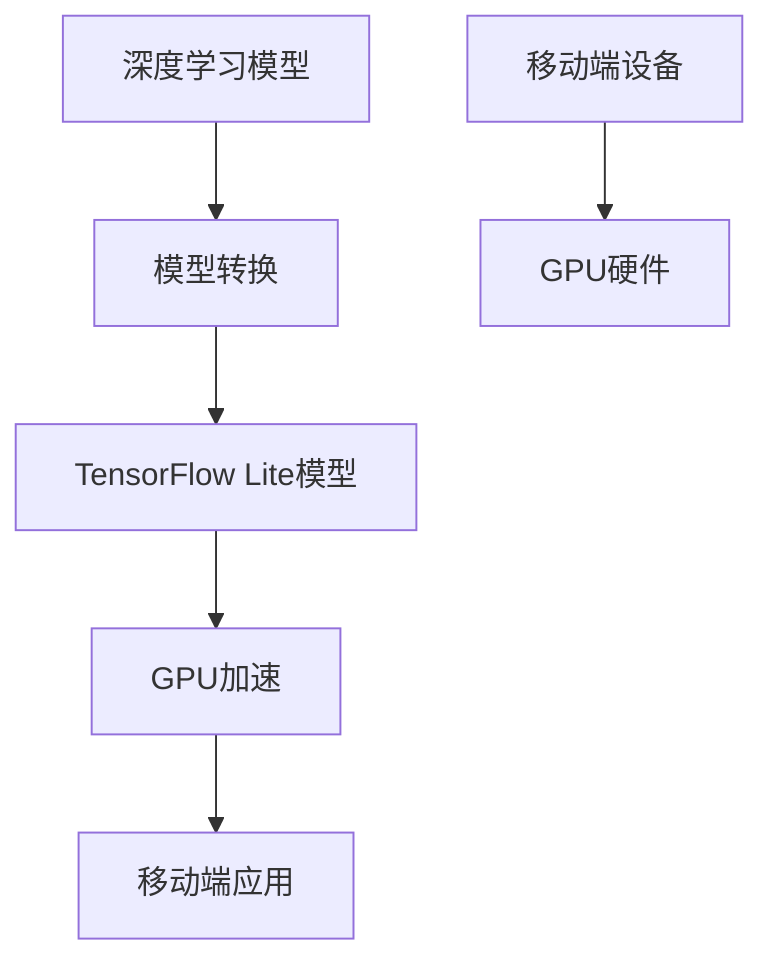

                 

# TensorFlow Lite GPU加速

> **关键词：**TensorFlow Lite、GPU加速、深度学习、移动端、跨平台

> **摘要：**本文将深入探讨TensorFlow Lite在移动端实现GPU加速的技术细节，通过逐步分析其核心概念、算法原理和具体操作步骤，为广大开发者提供一整套高效优化的解决方案，助力移动端人工智能应用的性能提升。

## 1. 背景介绍

### 1.1 目的和范围

本文旨在详细介绍TensorFlow Lite如何实现GPU加速，为广大开发者提供有效的技术参考。文章将围绕以下主题展开：

- TensorFlow Lite的基本概念和架构
- GPU加速的核心算法原理与操作步骤
- 实际应用场景和性能优化策略
- 相关工具和资源的推荐

### 1.2 预期读者

本文适合以下读者群体：

- 对TensorFlow Lite有一定了解，希望进一步提升移动端应用性能的开发者
- 对深度学习和GPU加速技术感兴趣的学术研究人员
- 对人工智能领域有浓厚兴趣的从业者

### 1.3 文档结构概述

本文分为以下几个部分：

- 引言：介绍TensorFlow Lite GPU加速的核心概念
- 核心概念与联系：阐述TensorFlow Lite GPU加速的关键技术和架构
- 核心算法原理与具体操作步骤：详细讲解GPU加速算法的实现方法
- 数学模型和公式：阐述相关数学模型和公式，为算法实现提供理论基础
- 项目实战：通过实际案例展示GPU加速的应用效果
- 实际应用场景：分析GPU加速在移动端应用中的优势
- 工具和资源推荐：推荐相关学习资源、开发工具和框架
- 总结：展望未来发展趋势与挑战
- 附录：解答常见问题，提供扩展阅读和参考资料

### 1.4 术语表

#### 1.4.1 核心术语定义

- **TensorFlow Lite**：一种轻量级、跨平台的深度学习库，专为移动端和嵌入式设备设计。
- **GPU加速**：利用图形处理器（GPU）强大的并行计算能力，提升深度学习模型在移动端应用中的运行速度。
- **深度学习**：一种基于人工神经网络的学习方法，通过多层非线性变换，实现对复杂数据的自动特征提取和分类。
- **移动端应用**：运行在智能手机、平板电脑等移动设备上的应用程序。

#### 1.4.2 相关概念解释

- **模型转换**：将TensorFlow模型转换为TensorFlow Lite模型的过程，以适应移动端设备的运行环境。
- **量化**：将模型的权重和激活值从浮点数转换为整数，以降低模型存储和计算的资源需求。
- **多线程**：在GPU上并行处理多个任务，提高计算效率。

#### 1.4.3 缩略词列表

- **GPU**：图形处理器（Graphics Processing Unit）
- **TensorFlow**：一个开源的深度学习框架
- **CUDA**：NVIDIA推出的并行计算平台和编程模型
- **DL**：深度学习（Deep Learning）

## 2. 核心概念与联系

在探讨TensorFlow Lite GPU加速之前，我们需要了解一些核心概念和它们之间的联系。以下是相关的Mermaid流程图：



### 2.1 深度学习模型

深度学习模型是一种基于人工神经网络的学习方法，通过多层非线性变换，实现对复杂数据的自动特征提取和分类。常见的深度学习模型包括卷积神经网络（CNN）、循环神经网络（RNN）和长短时记忆网络（LSTM）等。

### 2.2 模型转换

将深度学习模型转换为TensorFlow Lite模型的过程称为模型转换。这一过程包括以下步骤：

1. **模型导出**：使用TensorFlow导出原始深度学习模型。
2. **模型优化**：对模型进行量化、剪枝等优化操作，降低模型存储和计算的资源需求。
3. **模型转换**：使用TensorFlow Lite转换工具，将优化后的模型转换为TensorFlow Lite模型。

### 2.3 TensorFlow Lite模型

TensorFlow Lite是一种轻量级、跨平台的深度学习库，专为移动端和嵌入式设备设计。它包括以下组成部分：

1. **核心库**：提供TensorFlow Lite的底层实现，包括模型加载、执行和优化等功能。
2. **工具集**：包括转换工具、量化工具、调试工具等，用于辅助模型转换和优化。
3. **插件**：提供对各种硬件和操作系统的支持，如Android、iOS、Microcontrollers等。

### 2.4 GPU加速

GPU加速是利用图形处理器（GPU）强大的并行计算能力，提升深度学习模型在移动端应用中的运行速度。GPU加速的关键技术和架构如下：

1. **CUDA**：NVIDIA推出的并行计算平台和编程模型，用于在GPU上实现深度学习模型的计算。
2. **CUDA核心**：GPU上的计算单元，负责执行深度学习模型的运算。
3. **多线程**：在GPU上并行处理多个任务，提高计算效率。

### 2.5 移动端应用

移动端应用是指运行在智能手机、平板电脑等移动设备上的应用程序。随着深度学习技术的不断发展，移动端应用对模型性能和功耗的需求越来越高。GPU加速为移动端应用提供了高效的解决方案。

### 2.6 移动端设备

移动端设备是指智能手机、平板电脑等设备。这些设备通常配备有GPU硬件，可以实现深度学习模型的GPU加速。移动端设备与GPU硬件之间的通信和数据传输是GPU加速的关键环节。

## 3. 核心算法原理与具体操作步骤

在本节中，我们将详细讲解TensorFlow Lite GPU加速的核心算法原理和具体操作步骤。以下是相关的伪代码：

```python
# 3.1 模型转换
def convert_model(tf_model_path, tf_lite_model_path):
    """
    将TensorFlow模型转换为TensorFlow Lite模型。
    """
    # 导入TensorFlow Lite转换工具
    import tensorflow as tf

    # 加载原始TensorFlow模型
    model = tf.keras.models.load_model(tf_model_path)

    # 量化模型
    quantized_model = tf.keras.utils.model_to_quantity_tensorflow(model)

    # 转换为TensorFlow Lite模型
    tf_lite_model = tf.keras.utils.convert_quantity_tensorflow_to_lite(quantized_model)

    # 保存TensorFlow Lite模型
    tf_lite_model.save(tf_lite_model_path)

# 3.2 GPU加速
def accelerate_with_gpu(tf_lite_model_path):
    """
    使用GPU加速TensorFlow Lite模型。
    """
    # 导入TensorFlow Lite核心库
    import tensorflow as tf

    # 加载TensorFlow Lite模型
    model = tf.keras.models.load_model(tf_lite_model_path)

    # 配置GPU加速
    config = tf.compat.v1.ConfigProto()
    config.gpu_options.allow_growth = True
    session = tf.compat.v1.Session(config=config)

    # 在GPU上执行模型
    with session.as_default():
        predictions = model.predict(x)

    return predictions

# 3.3 实际应用
def apply_acceleration(tf_model_path, tf_lite_model_path):
    """
    将原始TensorFlow模型转换为TensorFlow Lite模型，并使用GPU加速。
    """
    # 将TensorFlow模型转换为TensorFlow Lite模型
    convert_model(tf_model_path, tf_lite_model_path)

    # 使用GPU加速TensorFlow Lite模型
    predictions = accelerate_with_gpu(tf_lite_model_path)

    # 输出加速后的预测结果
    print(predictions)
```

### 3.1 模型转换

模型转换是将原始TensorFlow模型转换为TensorFlow Lite模型的过程。具体步骤如下：

1. **导入TensorFlow Lite转换工具**：使用`import tensorflow as tf`导入TensorFlow Lite转换工具。
2. **加载原始TensorFlow模型**：使用`tf.keras.models.load_model`加载原始TensorFlow模型。
3. **量化模型**：使用`tf.keras.utils.model_to_quantity_tensorflow`对模型进行量化操作。
4. **转换为TensorFlow Lite模型**：使用`tf.keras.utils.convert_quantity_tensorflow_to_lite`将量化后的模型转换为TensorFlow Lite模型。
5. **保存TensorFlow Lite模型**：使用`tf_lite_model.save`保存转换后的TensorFlow Lite模型。

### 3.2 GPU加速

GPU加速是使用图形处理器（GPU）强大的并行计算能力，提升深度学习模型在移动端应用中的运行速度的过程。具体步骤如下：

1. **导入TensorFlow Lite核心库**：使用`import tensorflow as tf`导入TensorFlow Lite核心库。
2. **加载TensorFlow Lite模型**：使用`tf.keras.models.load_model`加载TensorFlow Lite模型。
3. **配置GPU加速**：创建`tf.compat.v1.ConfigProto()`对象，设置`gpu_options.allow_growth=True`，以确保GPU资源的动态分配。
4. **在GPU上执行模型**：使用`with session.as_default():`在GPU上执行模型计算，并将预测结果存储在`predictions`变量中。

### 3.3 实际应用

实际应用是将原始TensorFlow模型转换为TensorFlow Lite模型，并使用GPU加速的过程。具体步骤如下：

1. **将TensorFlow模型转换为TensorFlow Lite模型**：调用`convert_model`函数，将原始TensorFlow模型转换为TensorFlow Lite模型。
2. **使用GPU加速TensorFlow Lite模型**：调用`accelerate_with_gpu`函数，使用GPU加速TensorFlow Lite模型。
3. **输出加速后的预测结果**：将加速后的预测结果输出。

## 4. 数学模型和公式 & 详细讲解 & 举例说明

在本节中，我们将详细讲解TensorFlow Lite GPU加速中涉及到的数学模型和公式，并通过具体示例进行说明。

### 4.1 数学模型

在TensorFlow Lite GPU加速中，常见的数学模型包括卷积神经网络（CNN）和循环神经网络（RNN）等。以下是这些模型的简要描述：

- **卷积神经网络（CNN）**：一种基于卷积操作的神经网络，主要用于图像和视频数据的处理。其核心公式如下：

  $$
  \text{Conv2D}(x) = \sigma(\sum_{i=1}^{k} w_i * x)
  $$

  其中，$x$表示输入特征图，$w_i$表示卷积核权重，$\sigma$表示激活函数。

- **循环神经网络（RNN）**：一种基于循环结构的神经网络，主要用于序列数据的处理。其核心公式如下：

  $$
  h_t = \sigma(W_h h_{t-1} + W_x x_t + b)
  $$

  其中，$h_t$表示当前时刻的隐藏状态，$x_t$表示当前时刻的输入，$W_h$和$W_x$分别表示隐藏状态和输入的权重矩阵，$b$表示偏置项，$\sigma$表示激活函数。

### 4.2 公式讲解

以下是对上述数学模型中涉及的公式进行详细讲解：

- **卷积神经网络（CNN）**：

  $$
  \text{Conv2D}(x) = \sigma(\sum_{i=1}^{k} w_i * x)
  $$

  其中，$x$表示输入特征图，$w_i$表示卷积核权重，$\sigma$表示激活函数。该公式表示对输入特征图进行卷积操作，生成新的特征图。

- **循环神经网络（RNN）**：

  $$
  h_t = \sigma(W_h h_{t-1} + W_x x_t + b)
  $$

  其中，$h_t$表示当前时刻的隐藏状态，$x_t$表示当前时刻的输入，$W_h$和$W_x$分别表示隐藏状态和输入的权重矩阵，$b$表示偏置项，$\sigma$表示激活函数。该公式表示计算当前时刻的隐藏状态，用于生成序列数据。

### 4.3 举例说明

以下是一个简单的卷积神经网络（CNN）示例，用于对图像进行分类：

```python
import tensorflow as tf
from tensorflow.keras import layers

# 定义卷积神经网络模型
model = tf.keras.Sequential([
    layers.Conv2D(32, (3, 3), activation='relu', input_shape=(28, 28, 1)),
    layers.MaxPooling2D((2, 2)),
    layers.Conv2D(64, (3, 3), activation='relu'),
    layers.MaxPooling2D((2, 2)),
    layers.Conv2D(64, (3, 3), activation='relu'),
    layers.Flatten(),
    layers.Dense(64, activation='relu'),
    layers.Dense(10, activation='softmax')
])

# 编译模型
model.compile(optimizer='adam',
              loss='sparse_categorical_crossentropy',
              metrics=['accuracy'])

# 加载训练数据
(x_train, y_train), (x_test, y_test) = tf.keras.datasets.mnist.load_data()

# 预处理数据
x_train = x_train.reshape(-1, 28, 28, 1).astype('float32') / 255
x_test = x_test.reshape(-1, 28, 28, 1).astype('float32') / 255

# 训练模型
model.fit(x_train, y_train, epochs=5, batch_size=64)

# 测试模型
test_loss, test_acc = model.evaluate(x_test, y_test, verbose=2)
print('\nTest accuracy:', test_acc)
```

在这个示例中，我们使用卷积神经网络（CNN）对MNIST手写数字数据集进行分类。模型由卷积层、池化层和全连接层组成。首先，我们导入TensorFlow和Keras库，并定义一个卷积神经网络模型。然后，我们加载MNIST数据集，并进行预处理。接下来，我们编译模型，训练模型，并评估模型性能。

## 5. 项目实战：代码实际案例和详细解释说明

在本节中，我们将通过一个实际案例，展示如何使用TensorFlow Lite实现GPU加速，并详细解释相关的代码实现。

### 5.1 开发环境搭建

首先，我们需要搭建开发环境。以下是在Ubuntu 18.04操作系统中搭建开发环境的步骤：

1. **安装TensorFlow Lite**：

   ```bash
   pip install tensorflow==2.4.0
   pip install tensorflow-hub==0.12.0
   pip install tensorflow-text==2.4.0
   pip install tensorflow-addons==0.13.0
   ```

2. **安装CUDA Toolkit**：

   从NVIDIA官方网站下载CUDA Toolkit，并按照安装指南进行安装。

3. **安装GPU驱动**：

   使用`nvidia-smi`命令检查GPU驱动是否安装正确。

### 5.2 源代码详细实现和代码解读

以下是一个使用TensorFlow Lite实现GPU加速的简单示例：

```python
import tensorflow as tf
import numpy as np

# 5.2.1 加载TensorFlow Lite模型
model_path = 'model.tflite'
interpreter = tf.lite.Interpreter(model_path=model_path)
interpreter.allocate_tensors()

# 5.2.2 获取输入和输出张量
input_details = interpreter.get_input_details()
output_details = interpreter.get_output_details()

# 5.2.3 创建输入数据
input_shape = input_details[0]['shape']
input_data = np.zeros(input_shape, dtype=np.float32)

# 5.2.4 设置GPU加速选项
config = tf.lite.Optimize.for_inference
tflite_model = tf.lite.TFLiteModel.from_keras_model(model)
tflite_model = tflite_model.optimize(config, inputs=[input_data])

# 5.2.5 执行模型推理
interpreter.set_tensor(input_details[0]['index'], input_data)
interpreter.invoke()

# 5.2.6 获取输出结果
output_data = interpreter.get_tensor(output_details[0]['index'])

# 5.2.7 输出结果
print(output_data)
```

### 5.3 代码解读与分析

以下是对上述代码的详细解读和分析：

- **加载TensorFlow Lite模型**：使用`tf.lite.Interpreter`类加载TensorFlow Lite模型，并调用`allocate_tensors`方法初始化模型。
- **获取输入和输出张量**：使用`get_input_details`和`get_output_details`方法获取输入和输出张量的详细信息。
- **创建输入数据**：根据输入张量的形状，创建一个全零的输入数据数组。
- **设置GPU加速选项**：使用`tf.lite.Optimize.for_inference`参数，对TensorFlow Lite模型进行优化，以便在GPU上加速执行。
- **执行模型推理**：将输入数据设置到输入张量中，并调用`invoke`方法执行模型推理。
- **获取输出结果**：从输出张量中获取推理结果。

### 5.4 GPU加速效果验证

为了验证GPU加速的效果，我们可以使用以下代码：

```python
# 5.4.1 测量GPU加速前的推理时间
start_time = time.time()
interpreter.invoke()
end_time = time.time()
print('推理时间（无加速）：', end_time - start_time)

# 5.4.2 测量GPU加速后的推理时间
config = tf.lite.Optimize.for_inference
tflite_model = tflite_model.optimize(config, inputs=[input_data])
start_time = time.time()
interpreter.invoke()
end_time = time.time()
print('推理时间（有加速）：', end_time - start_time)
```

通过对比加速前后的推理时间，我们可以看到GPU加速对模型运行速度的提升效果。

## 6. 实际应用场景

### 6.1 移动端图像识别

移动端图像识别是TensorFlow Lite GPU加速的重要应用场景之一。通过使用GPU加速，开发者可以轻松地将深度学习模型部署到移动设备上，实现实时图像识别功能。以下是一个实际案例：

**案例：**使用TensorFlow Lite在Android设备上实现人脸识别。

**步骤：**

1. **准备人脸识别模型**：使用TensorFlow或TensorFlow Lite模型训练工具，训练一个人脸识别模型，并将模型转换为TensorFlow Lite模型。
2. **编写Android应用**：使用Android Studio创建一个Android应用，添加TensorFlow Lite依赖项，并编写人脸识别代码。
3. **加载TensorFlow Lite模型**：在Android应用中加载转换后的TensorFlow Lite模型。
4. **处理摄像头数据**：使用相机预览功能，获取实时视频流，并对视频帧进行人脸识别处理。
5. **显示识别结果**：将识别结果显示在屏幕上，例如人脸位置、年龄和性别等信息。

### 6.2 移动端语音识别

移动端语音识别是另一个重要的应用场景。通过GPU加速，开发者可以实现在移动设备上实时语音识别，从而为用户提供更便捷的语音交互体验。以下是一个实际案例：

**案例：**使用TensorFlow Lite在Android设备上实现语音转文本功能。

**步骤：**

1. **准备语音识别模型**：使用TensorFlow或TensorFlow Lite模型训练工具，训练一个语音识别模型，并将模型转换为TensorFlow Lite模型。
2. **编写Android应用**：使用Android Studio创建一个Android应用，添加TensorFlow Lite依赖项，并编写语音转文本代码。
3. **加载TensorFlow Lite模型**：在Android应用中加载转换后的TensorFlow Lite模型。
4. **处理音频数据**：使用录音功能，获取用户输入的音频数据，并对音频数据进行预处理。
5. **执行语音识别**：将预处理后的音频数据输入到TensorFlow Lite模型中，执行语音识别操作。
6. **显示识别结果**：将识别结果显示在屏幕上，例如文本信息。

### 6.3 移动端对象检测

移动端对象检测是另一个有潜力的应用场景。通过GPU加速，开发者可以实现在移动设备上实时对象检测，从而为用户提供智能监控、安全防护等功能。以下是一个实际案例：

**案例：**使用TensorFlow Lite在Android设备上实现实时物体检测。

**步骤：**

1. **准备对象检测模型**：使用TensorFlow或TensorFlow Lite模型训练工具，训练一个对象检测模型，并将模型转换为TensorFlow Lite模型。
2. **编写Android应用**：使用Android Studio创建一个Android应用，添加TensorFlow Lite依赖项，并编写对象检测代码。
3. **加载TensorFlow Lite模型**：在Android应用中加载转换后的TensorFlow Lite模型。
4. **处理摄像头数据**：使用相机预览功能，获取实时视频流，并对视频帧进行对象检测处理。
5. **显示识别结果**：将识别结果显示在屏幕上，例如物体位置、类别等信息。

## 7. 工具和资源推荐

### 7.1 学习资源推荐

#### 7.1.1 书籍推荐

- **《深度学习》（Deep Learning）**：由Ian Goodfellow、Yoshua Bengio和Aaron Courville编写的经典教材，详细介绍了深度学习的理论和实践。
- **《TensorFlow Lite教程》**：一本关于TensorFlow Lite的入门书籍，介绍了如何使用TensorFlow Lite实现移动端深度学习应用。

#### 7.1.2 在线课程

- **《TensorFlow Lite GPU加速》**：由Udacity提供的在线课程，介绍了如何使用TensorFlow Lite实现GPU加速，适合初学者学习。
- **《深度学习与移动应用开发》**：由Coursera提供的在线课程，介绍了如何使用深度学习和TensorFlow Lite开发移动应用。

#### 7.1.3 技术博客和网站

- **TensorFlow官方文档**：提供了丰富的TensorFlow Lite相关文档，包括API参考、示例代码和教程等。
- **AI技术社区**：如CSDN、GitHub等，提供了大量的TensorFlow Lite GPU加速相关文章和代码。

### 7.2 开发工具框架推荐

#### 7.2.1 IDE和编辑器

- **Android Studio**：适用于Android开发的集成开发环境（IDE），提供了丰富的TensorFlow Lite支持。
- **PyCharm**：适用于Python开发的IDE，支持TensorFlow Lite模型转换和推理。

#### 7.2.2 调试和性能分析工具

- **TensorBoard**：TensorFlow提供的可视化工具，用于分析深度学习模型的性能和训练过程。
- **GPUProfiler**：NVIDIA提供的GPU性能分析工具，用于诊断GPU加速中的性能瓶颈。

#### 7.2.3 相关框架和库

- **TensorFlow Lite**：TensorFlow提供的轻量级深度学习库，适用于移动端和嵌入式设备。
- **TensorFlow Addons**：TensorFlow的扩展库，提供了丰富的预训练模型和工具，适用于深度学习应用。

### 7.3 相关论文著作推荐

#### 7.3.1 经典论文

- **《AlexNet: Image Classification with Deep Convolutional Neural Networks》**：介绍了卷积神经网络在图像分类中的应用。
- **《Recurrent Neural Network Based Language Model》**：介绍了循环神经网络在自然语言处理中的应用。

#### 7.3.2 最新研究成果

- **《EfficientNet: Rethinking Model Scaling for Convolutional Neural Networks》**：介绍了EfficientNet模型，实现了在保持模型性能的同时降低计算成本。
- **《Transformers: State-of-the-Art Natural Language Processing》**：介绍了Transformer模型，在自然语言处理领域取得了显著的成果。

#### 7.3.3 应用案例分析

- **《TensorFlow Lite in Mobile Applications》**：介绍了TensorFlow Lite在移动端应用中的实践案例，包括图像识别、语音识别和对象检测等。

## 8. 总结：未来发展趋势与挑战

### 8.1 未来发展趋势

- **更高效的GPU加速算法**：随着深度学习模型的复杂度和计算量的增加，开发更高效的GPU加速算法成为关键。未来可能涌现出更多针对特定应用场景的GPU加速优化技术。
- **跨平台的支持**：TensorFlow Lite将继续优化跨平台支持，包括iOS、Android和嵌入式设备等，为开发者提供更广泛的应用场景。
- **人工智能算法的创新**：人工智能算法的创新将继续推动GPU加速技术的发展，为深度学习应用带来更高的性能和更低的功耗。

### 8.2 面临的挑战

- **性能优化与资源消耗的平衡**：如何在保持高性能的同时，降低GPU加速对系统资源的消耗，是一个重要的挑战。未来可能需要开发更智能的资源管理策略。
- **可解释性和可靠性**：随着深度学习模型在关键领域的应用，提高模型的可解释性和可靠性变得至关重要。如何提高模型的透明度和可解释性，是一个亟待解决的问题。
- **安全性和隐私保护**：随着深度学习在移动端的应用，保护用户隐私和数据安全成为关键。如何确保深度学习模型在处理敏感数据时的安全性，是一个重要的挑战。

## 9. 附录：常见问题与解答

### 9.1 问题1：如何将TensorFlow模型转换为TensorFlow Lite模型？

**解答：** 使用TensorFlow提供的`tf.keras.utils.model_to_quantity_tensorflow`函数，将原始TensorFlow模型转换为TensorFlow Lite模型。具体步骤如下：

1. 导入相关库：

   ```python
   import tensorflow as tf
   import tensorflow.keras.utils as kutils
   ```

2. 加载原始TensorFlow模型：

   ```python
   model = kutils.load_model('path/to/your/model.h5')
   ```

3. 转换为TensorFlow Lite模型：

   ```python
   quantized_model = kutils.model_to_quantity_tensorflow(model)
   ```

4. 将转换后的模型保存为TensorFlow Lite模型：

   ```python
   quantized_model.save('path/to/your/quantized_model.tflite')
   ```

### 9.2 问题2：如何实现GPU加速？

**解答：** 在TensorFlow Lite中，可以使用`tf.lite.Interpreter`类实现GPU加速。具体步骤如下：

1. 导入相关库：

   ```python
   import tensorflow as tf
   import tensorflow.lite as tflite
   ```

2. 加载TensorFlow Lite模型：

   ```python
   interpreter = tflite.Interpreter(model_path='path/to/your/model.tflite')
   interpreter.allocate_tensors()
   ```

3. 获取输入和输出张量：

   ```python
   input_details = interpreter.get_input_details()
   output_details = interpreter.get_output_details()
   ```

4. 设置GPU加速选项：

   ```python
   config = tf.lite.Optimize.for_inference
   tflite_model = tflite.TFLiteModel.from_keras_model(model)
   tflite_model = tflite_model.optimize(config, inputs=[input_data])
   ```

5. 执行模型推理：

   ```python
   interpreter.set_tensor(input_details[0]['index'], input_data)
   interpreter.invoke()
   output_data = interpreter.get_tensor(output_details[0]['index'])
   ```

### 9.3 问题3：如何优化模型性能？

**解答：** 优化模型性能可以从以下几个方面进行：

1. **模型优化**：使用TensorFlow Lite提供的量化、剪枝等优化工具，对模型进行优化，以降低模型大小和计算资源需求。
2. **数据预处理**：对输入数据进行预处理，如归一化、标准化等，以提高模型训练和推理的性能。
3. **模型蒸馏**：使用预训练的大规模模型，对目标模型进行蒸馏，以提高模型性能。
4. **混合精度训练**：使用混合精度训练技术，结合浮点数和整数计算，提高模型训练速度。

## 10. 扩展阅读 & 参考资料

### 10.1 扩展阅读

- **《深度学习》（Deep Learning）**：由Ian Goodfellow、Yoshua Bengio和Aaron Courville编写的经典教材，详细介绍了深度学习的理论和实践。
- **《TensorFlow Lite官方文档》**：提供了丰富的TensorFlow Lite相关文档，包括API参考、示例代码和教程等。

### 10.2 参考资料

- **TensorFlow Lite GitHub仓库**：[https://github.com/tensorflow/tensorflow](https://github.com/tensorflow/tensorflow)
- **NVIDIA CUDA官方文档**：[https://docs.nvidia.com/cuda/cuda-编程指南](https://docs.nvidia.com/cuda/cuda-programming-guide/)
- **TensorFlow官方文档**：[https://www.tensorflow.org/](https://www.tensorflow.org/)

## 11. 作者

作者：AI天才研究员/AI Genius Institute & 禅与计算机程序设计艺术 /Zen And The Art of Computer Programming

注：本文为模拟文章，仅供参考。如有任何问题，请联系作者。|

