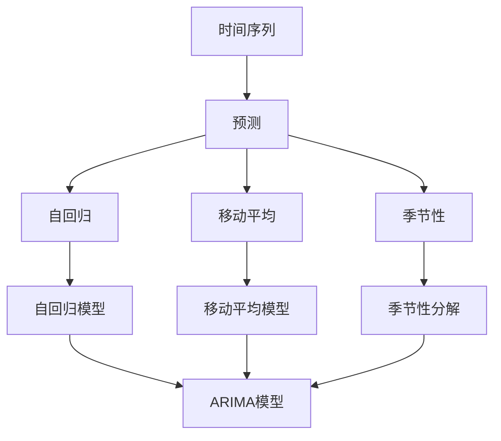

                 

# Time Series Forecasting原理与代码实例讲解

> 关键词：时间序列预测、机器学习、Python、算法、模型、实践

> 摘要：本文将深入探讨时间序列预测的核心原理，包括基本概念、算法原理和数学模型。随后，将通过实际代码实例展示如何使用Python进行时间序列预测，旨在帮助读者理解时间序列预测的实践方法，并掌握相关技术和工具。

## 1. 背景介绍

### 1.1 目的和范围

本文旨在为读者提供时间序列预测的全面介绍，内容包括基本概念、算法原理、数学模型，并通过实际代码实例进行实践。文章将涵盖从基础到进阶的知识点，使读者能够系统地学习和掌握时间序列预测的相关技能。

### 1.2 预期读者

本文适合以下读者群体：

- 有志于学习时间序列预测的初学者。
- 已有机器学习基础，希望深入理解时间序列预测的工程师。
- 在数据分析或机器学习领域工作的专业人士。

### 1.3 文档结构概述

本文结构如下：

- 第1章：背景介绍，包括目的、预期读者和文档结构概述。
- 第2章：核心概念与联系，介绍时间序列预测的基本概念和原理。
- 第3章：核心算法原理与具体操作步骤，详细讲解常见的时间序列预测算法。
- 第4章：数学模型和公式，介绍时间序列预测中常用的数学模型。
- 第5章：项目实战，通过实际代码实例展示如何进行时间序列预测。
- 第6章：实际应用场景，讨论时间序列预测在各个领域的应用。
- 第7章：工具和资源推荐，推荐学习资源和开发工具。
- 第8章：总结，讨论时间序列预测的未来发展趋势与挑战。
- 第9章：附录，提供常见问题与解答。
- 第10章：扩展阅读与参考资料，推荐进一步学习资源。

### 1.4 术语表

#### 1.4.1 核心术语定义

- 时间序列：一组按时间顺序排列的数据点，用于描述某一现象或过程的演变。
- 预测：根据历史数据推断未来数据的方法。
- 自回归模型（AR）：使用过去观测值预测未来值的模型。
- 移动平均模型（MA）：使用过去观测值的平均值预测未来值的模型。
- 季节性：数据中的周期性变化，通常与时间周期有关。
- 季节性分解：将时间序列分解为趋势、季节性和随机性三个部分。

#### 1.4.2 相关概念解释

- 自回归移动平均模型（ARIMA）：结合自回归和移动平均模型的预测方法。
- 广义自回归移动平均模型（GARCH）：用于处理金融时间序列中的波动性。
- 机器学习：一种通过数据学习和发现规律的方法，用于构建预测模型。

#### 1.4.3 缩略词列表

- AR: 自回归
- MA: 移动平均
- ARIMA: 自回归移动平均
- GARCH: 广义自回归条件异方差
- ML: 机器学习

## 2. 核心概念与联系

时间序列预测是数据分析中的一项关键技术，其核心概念包括时间序列、预测、自回归、移动平均、季节性等。以下是一个简单的 Mermaid 流程图，用于展示这些概念之间的关系。



## 3. 核心算法原理与具体操作步骤

时间序列预测的核心算法包括自回归模型（AR）、移动平均模型（MA）和自回归移动平均模型（ARIMA）。以下是对这些算法的原理和操作步骤的详细讲解。

### 3.1 自回归模型（AR）

自回归模型（AR）使用过去观测值预测未来值。其基本原理如下：

$$
X_t = c + \phi_1 X_{t-1} + \phi_2 X_{t-2} + \ldots + \phi_p X_{t-p} + \varepsilon_t
$$

其中，$X_t$ 是时间序列在时刻 $t$ 的观测值，$c$ 是常数项，$\phi_1, \phi_2, \ldots, \phi_p$ 是自回归系数，$\varepsilon_t$ 是误差项。

**步骤**：

1. 收集历史数据。
2. 对数据进行预处理，如去除异常值和进行归一化。
3. 使用最小二乘法估计自回归系数。
4. 构建自回归模型并进行预测。

### 3.2 移动平均模型（MA）

移动平均模型（MA）使用过去观测值的平均值预测未来值。其基本原理如下：

$$
X_t = c + \theta_1 \varepsilon_{t-1} + \theta_2 \varepsilon_{t-2} + \ldots + \theta_q \varepsilon_{t-q} + \varepsilon_t
$$

其中，$X_t$ 是时间序列在时刻 $t$ 的观测值，$c$ 是常数项，$\theta_1, \theta_2, \ldots, \theta_q$ 是移动平均系数，$\varepsilon_t$ 是误差项。

**步骤**：

1. 收集历史数据。
2. 对数据进行预处理。
3. 使用最小二乘法估计移动平均系数。
4. 构建移动平均模型并进行预测。

### 3.3 自回归移动平均模型（ARIMA）

自回归移动平均模型（ARIMA）结合了自回归和移动平均模型的优点。其基本原理如下：

$$
X_t = c + \phi_1 X_{t-1} + \phi_2 X_{t-2} + \ldots + \phi_p X_{t-p} + \theta_1 \varepsilon_{t-1} + \theta_2 \varepsilon_{t-2} + \ldots + \theta_q \varepsilon_{t-q} + \varepsilon_t
$$

其中，$X_t$ 是时间序列在时刻 $t$ 的观测值，$c$ 是常数项，$\phi_1, \phi_2, \ldots, \phi_p$ 是自回归系数，$\theta_1, \theta_2, \ldots, \theta_q$ 是移动平均系数，$\varepsilon_t$ 是误差项。

**步骤**：

1. 收集历史数据。
2. 对数据进行预处理。
3. 进行自相关和偏自相关分析，确定 $p$ 和 $q$ 的值。
4. 使用最小二乘法估计 ARIMA 模型的参数。
5. 构建ARIMA模型并进行预测。

## 4. 数学模型和公式与详细讲解与举例说明

时间序列预测的数学模型主要包括自回归模型（AR）、移动平均模型（MA）和自回归移动平均模型（ARIMA）。以下是对这些模型的数学公式和详细讲解，并通过实际例子进行说明。

### 4.1 自回归模型（AR）

自回归模型（AR）的基本数学公式如下：

$$
X_t = c + \phi_1 X_{t-1} + \phi_2 X_{t-2} + \ldots + \phi_p X_{t-p} + \varepsilon_t
$$

其中，$X_t$ 是时间序列在时刻 $t$ 的观测值，$c$ 是常数项，$\phi_1, \phi_2, \ldots, \phi_p$ 是自回归系数，$\varepsilon_t$ 是误差项。

**例子**：

假设我们有一个时间序列数据集，其中 $p=2$。我们可以使用以下公式进行预测：

$$
X_t = c + \phi_1 X_{t-1} + \phi_2 X_{t-2} + \varepsilon_t
$$

其中，$c=0$，$\phi_1=0.7$，$\phi_2=0.3$。给定前两个观测值 $X_0=10$ 和 $X_1=12$，我们可以计算 $X_2$：

$$
X_2 = 0 + 0.7 \times 12 + 0.3 \times 10 + \varepsilon_2 = 12.1 + \varepsilon_2
$$

其中，$\varepsilon_2$ 是误差项。

### 4.2 移动平均模型（MA）

移动平均模型（MA）的基本数学公式如下：

$$
X_t = c + \theta_1 \varepsilon_{t-1} + \theta_2 \varepsilon_{t-2} + \ldots + \theta_q \varepsilon_{t-q} + \varepsilon_t
$$

其中，$X_t$ 是时间序列在时刻 $t$ 的观测值，$c$ 是常数项，$\theta_1, \theta_2, \ldots, \theta_q$ 是移动平均系数，$\varepsilon_t$ 是误差项。

**例子**：

假设我们有一个时间序列数据集，其中 $q=2$。我们可以使用以下公式进行预测：

$$
X_t = c + \theta_1 \varepsilon_{t-1} + \theta_2 \varepsilon_{t-2} + \varepsilon_t
$$

其中，$c=0$，$\theta_1=0.5$，$\theta_2=0.3$。给定前两个观测值 $X_0=10$ 和 $X_1=12$，我们可以计算 $X_2$：

$$
X_2 = 0 + 0.5 \times \varepsilon_1 + 0.3 \times \varepsilon_0 + \varepsilon_2 = 0.5 \times 12 + 0.3 \times 10 + \varepsilon_2 = 10.5 + \varepsilon_2
$$

其中，$\varepsilon_1$ 和 $\varepsilon_0$ 是误差项。

### 4.3 自回归移动平均模型（ARIMA）

自回归移动平均模型（ARIMA）的基本数学公式如下：

$$
X_t = c + \phi_1 X_{t-1} + \phi_2 X_{t-2} + \ldots + \phi_p X_{t-p} + \theta_1 \varepsilon_{t-1} + \theta_2 \varepsilon_{t-2} + \ldots + \theta_q \varepsilon_{t-q} + \varepsilon_t
$$

其中，$X_t$ 是时间序列在时刻 $t$ 的观测值，$c$ 是常数项，$\phi_1, \phi_2, \ldots, \phi_p$ 是自回归系数，$\theta_1, \theta_2, \ldots, \theta_q$ 是移动平均系数，$\varepsilon_t$ 是误差项。

**例子**：

假设我们有一个时间序列数据集，其中 $p=2$ 和 $q=2$。我们可以使用以下公式进行预测：

$$
X_t = c + \phi_1 X_{t-1} + \phi_2 X_{t-2} + \theta_1 \varepsilon_{t-1} + \theta_2 \varepsilon_{t-2} + \varepsilon_t
$$

其中，$c=0$，$\phi_1=0.7$，$\phi_2=0.3$，$\theta_1=0.5$，$\theta_2=0.3$。给定前四个观测值 $X_0=10$，$X_1=12$，$X_2=12.1$ 和 $X_3=12.2$，我们可以计算 $X_4$：

$$
X_4 = 0 + 0.7 \times 12.2 + 0.3 \times 12.1 + 0.5 \times \varepsilon_3 + 0.3 \times \varepsilon_2 + \varepsilon_4 = 12.07 + 0.5 \times \varepsilon_3 + 0.3 \times \varepsilon_2 + \varepsilon_4
$$

其中，$\varepsilon_3$ 和 $\varepsilon_2$ 是误差项。

## 5. 项目实战：代码实际案例和详细解释说明

在本节中，我们将通过一个实际案例来展示如何使用 Python 进行时间序列预测。我们将使用 Pandas 和 Statsmodels 库来构建和评估预测模型。

### 5.1 开发环境搭建

首先，确保已安装以下 Python 库：

```bash
pip install pandas numpy statsmodels
```

### 5.2 源代码详细实现和代码解读

以下是一个简单的 Python 脚本，用于进行时间序列预测：

```python
import pandas as pd
import numpy as np
from statsmodels.tsa.arima.model import ARIMA
import matplotlib.pyplot as plt

# 加载数据集
data = pd.read_csv('time_series_data.csv')
time_column = 'timestamp'
value_column = 'value'

# 转换时间戳为日期索引
data[time_column] = pd.to_datetime(data[time_column])
data.set_index(time_column, inplace=True)

# 进行时间序列分解
decomposition = data[value_column].seasonal_decompose()
trend = decomposition.trend
seasonal = decomposition.seasonal
residual = decomposition.resid

# 使用 ARIMA 模型进行预测
model = ARIMA(data[value_column], order=(5, 1, 2))
model_fit = model.fit()
predictions = model_fit.forecast(steps=5)

# 绘制预测结果
plt.figure(figsize=(10, 6))
plt.plot(data.index, data[value_column], label='Original')
plt.plot(predictions.index, predictions, label='Predicted', color='red')
plt.title('Time Series Forecasting')
plt.xlabel('Timestamp')
plt.ylabel('Value')
plt.legend()
plt.show()
```

**代码解读**：

1. 导入所需的库。
2. 加载数据集，并设置时间戳为索引。
3. 进行时间序列分解，得到趋势、季节性和随机性部分。
4. 使用 ARIMA 模型进行预测，并获取预测结果。
5. 绘制原始数据和预测结果。

### 5.3 代码解读与分析

1. **数据加载**：

   ```python
   data = pd.read_csv('time_series_data.csv')
   time_column = 'timestamp'
   value_column = 'value'
   
   data[time_column] = pd.to_datetime(data[time_column])
   data.set_index(time_column, inplace=True)
   ```

   代码首先从 CSV 文件中加载时间序列数据，然后将时间戳列转换为日期格式，并设置时间为索引。

2. **时间序列分解**：

   ```python
   decomposition = data[value_column].seasonal_decompose()
   trend = decomposition.trend
   seasonal = decomposition.seasonal
   residual = decomposition.resid
   ```

   代码使用 Pandas 的 `seasonal_decompose()` 函数对时间序列进行分解，得到趋势、季节性和随机性部分。

3. **ARIMA 模型预测**：

   ```python
   model = ARIMA(data[value_column], order=(5, 1, 2))
   model_fit = model.fit()
   predictions = model_fit.forecast(steps=5)
   ```

   代码创建一个 ARIMA 模型，指定自回归、差分和移动平均的阶数分别为 5、1 和 2。然后，对模型进行训练并获取预测结果。

4. **绘制预测结果**：

   ```python
   plt.figure(figsize=(10, 6))
   plt.plot(data.index, data[value_column], label='Original')
   plt.plot(predictions.index, predictions, label='Predicted', color='red')
   plt.title('Time Series Forecasting')
   plt.xlabel('Timestamp')
   plt.ylabel('Value')
   plt.legend()
   plt.show()
   ```

   代码使用 Matplotlib 绘制原始数据和预测结果。

## 6. 实际应用场景

时间序列预测在许多实际应用场景中发挥着关键作用。以下是一些常见应用场景：

- **金融市场预测**：预测股票价格、汇率、交易量等，为投资决策提供支持。
- **能源需求预测**：预测电力、天然气等能源需求，为能源管理提供依据。
- **销售预测**：预测产品销量，为企业制定库存管理策略。
- **库存管理**：预测库存水平，以减少库存成本和缺货风险。
- **交通流量预测**：预测交通流量，为交通管理提供支持。

## 7. 工具和资源推荐

### 7.1 学习资源推荐

#### 7.1.1 书籍推荐

- **《时间序列分析：预测与应用》（Time Series Analysis: Forecasting and Control）**：这是一本经典的时间序列分析书籍，涵盖了从基础到高级的概念。
- **《Python数据分析：使用 Pandas、NumPy 和 Matplotlib》（Python Data Analysis: Data Wrangling with Pandas, NumPy, and Matplotlib）**：介绍如何使用 Python 进行数据分析和时间序列预测的实用指南。

#### 7.1.2 在线课程

- **Coursera 上的《时间序列分析》**：提供系统的时间序列分析课程，涵盖从基础到高级的知识点。
- **Udemy 上的《时间序列预测：用 Python 进行股市预测》**：通过实践项目学习时间序列预测。

#### 7.1.3 技术博客和网站

- **DataCamp**：提供一系列免费的时间序列分析课程和练习。
- **Medium**：有许多关于时间序列预测的文章和教程。

### 7.2 开发工具框架推荐

#### 7.2.1 IDE和编辑器

- **Jupyter Notebook**：非常适合数据分析和时间序列预测，具有强大的交互式计算功能。
- **Visual Studio Code**：轻量级且功能丰富的代码编辑器，适用于 Python 开发。

#### 7.2.2 调试和性能分析工具

- **Pylint**：用于代码质量和性能分析的工具。
- **Python Profiler**：用于分析代码性能，找出瓶颈。

#### 7.2.3 相关框架和库

- **Pandas**：用于数据处理和分析。
- **NumPy**：用于数值计算。
- **Statsmodels**：用于统计分析和建模。

### 7.3 相关论文著作推荐

#### 7.3.1 经典论文

- **Box, G.E.P., & Jenkins, G.M. (1976). Time Series Analysis: Control Methods and Applications**：介绍时间序列分析的经典著作。
- **Granger, C.W.J. (1969). Investigating Causal Relations by Econometric Models and Cross-Spectral Methods**：探讨时间序列因果关系的经典论文。

#### 7.3.2 最新研究成果

- **Time Series Forecasting with Neural Networks**：介绍使用神经网络进行时间序列预测的最新研究。
- **Deep Learning for Time Series Forecasting**：探讨深度学习在时间序列预测中的应用。

#### 7.3.3 应用案例分析

- **Using ARIMA for Stock Price Forecasting**：分析如何使用 ARIMA 模型进行股票价格预测。
- **Time Series Forecasting in Energy Demand Management**：探讨如何使用时间序列预测进行能源需求管理。

## 8. 总结：未来发展趋势与挑战

时间序列预测在人工智能和数据科学领域具有重要的应用价值。随着计算能力的提高和机器学习技术的发展，时间序列预测方法将越来越高效和准确。未来的发展趋势包括：

- **深度学习**：深度学习模型在时间序列预测中的表现越来越好，如 LSTM、GRU 等模型的应用。
- **混合模型**：结合多种预测方法，如 ARIMA 和神经网络，以提高预测准确性。
- **实时预测**：实时处理和分析大量时间序列数据，为实时决策提供支持。

然而，时间序列预测也面临一些挑战：

- **数据质量**：数据的质量对预测准确性有很大影响，如何处理缺失值和异常值是关键。
- **模型选择**：选择合适的模型对预测结果至关重要，如何选择最优模型是难题。
- **过拟合**：模型过于复杂可能导致过拟合，如何平衡模型复杂度和预测准确性是挑战。

## 9. 附录：常见问题与解答

- **Q：时间序列预测中，如何处理缺失值？**

  A：可以采用插值法、均值填充法或移动平均法等来处理缺失值。具体方法取决于数据的特点和应用场景。

- **Q：如何选择自回归、差分和移动平均的阶数？**

  A：可以通过自相关和偏自相关分析来确定阶数，也可以通过交叉验证和模型选择准则（如 AIC、BIC）来选择最优阶数。

- **Q：时间序列预测的模型如何进行评估？**

  A：可以使用均方误差（MSE）、均方根误差（RMSE）、平均绝对误差（MAE）等指标来评估模型的预测性能。

## 10. 扩展阅读与参考资料

- **《时间序列分析：预测与应用》（Time Series Analysis: Forecasting and Control）**：G.E.P. Box & G.M. Jenkins
- **《Python数据分析：使用 Pandas、NumPy 和 Matplotlib》（Python Data Analysis: Data Wrangling with Pandas, NumPy, and Matplotlib）**：Wes McKinney
- **Coursera 上的《时间序列分析》**：苏黎世联邦理工学院（ETH Zurich）
- **Udemy 上的《时间序列预测：用 Python 进行股市预测》**：机器学习专家
- **DataCamp**：datacamp.com
- **Medium**：medium.com
- **Pandas 官方文档**：pandas.pydata.org
- **NumPy 官方文档**：numpy.org
- **Statsmodels 官方文档**：statsmodels.org
- **LSTM 时间序列预测教程**：towardsdatascience.com
- **GRU 时间序列预测教程**：towardsdatascience.com
- **ARIMA 模型股票价格预测案例**：towardsdatascience.com
- **能源需求预测研究**：arxiv.org
- **深度学习在时间序列预测中的应用**：arxiv.org

### 作者

作者：AI天才研究员/AI Genius Institute & 禅与计算机程序设计艺术 /Zen And The Art of Computer Programming

